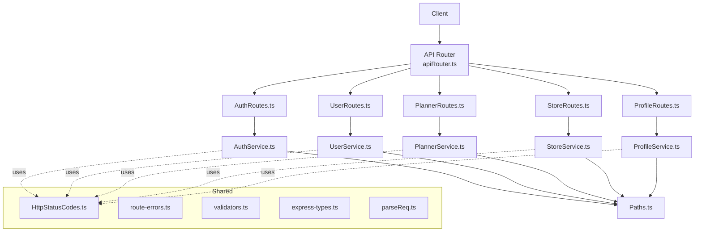
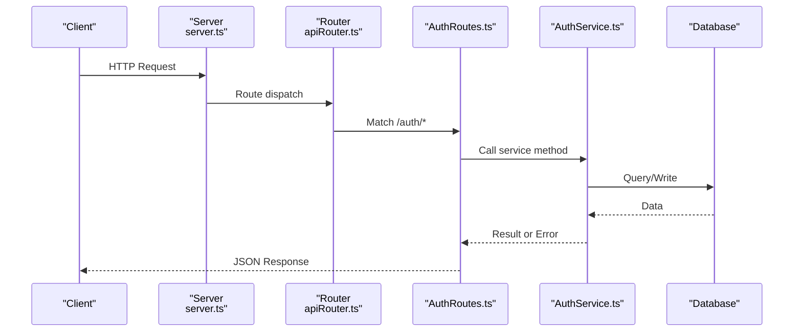
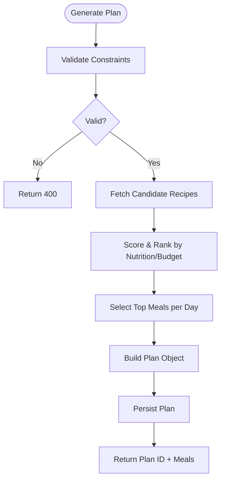
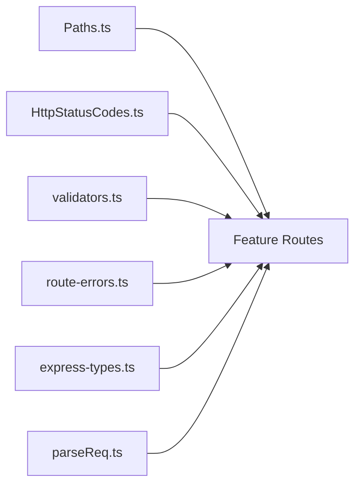
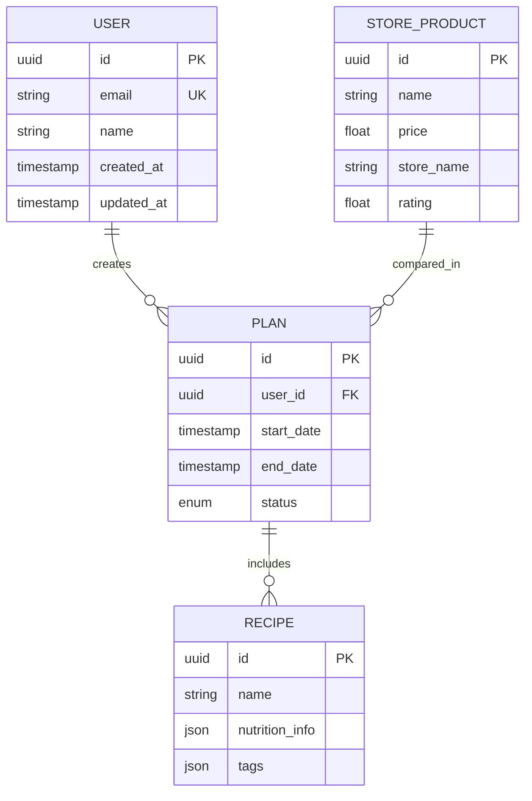

# API Reference

<cite>
**Referenced Files in This Document**
- [main.ts](file://Backend/src/main.ts)
- [server.ts](file://Backend/src/server.ts)
- [apiRouter.ts](file://Backend/src/routes/apiRouter.ts)
- [AuthRoutes.ts](file://Backend/src/routes/AuthRoutes.ts)
- [UserRoutes.ts](file://Backend/src/routes/UserRoutes.ts)
- [PlannerRoutes.ts](file://Backend/src/routes/PlannerRoutes.ts)
- [StoreRoutes.ts](file://Backend/src/routes/StoreRoutes.ts)
- [ProfileRoutes.ts](file://Backend/src/routes/ProfileRoutes.ts)
- [AuthService.ts](file://Backend/src/services/AuthService.ts)
- [UserService.ts](file://Backend/src/services/UserService.ts)
- [PlannerService.ts](file://Backend/src/services/PlannerService.ts)
- [StoreService.ts](file://Backend/src/services/StoreService.ts)
- [ProfileService.ts](file://Backend/src/services/ProfileService.ts)
- [planner-algorithm.ts](file://Backend/src/services/planner-algorithm.ts)
- [Paths.ts](file://Backend/src/common/constants/Paths.ts)
- [HttpStatusCodes.ts](file://Backend/src/common/constants/HttpStatusCodes.ts)
- [route-errors.ts](file://Backend/src/common/utils/route-errors.ts)
- [validators.ts](file://Backend/src/common/utils/validators.ts)
- [auth.ts](file://Backend/src/routes/common/auth.ts)
- [parseReq.ts](file://Backend/src/routes/common/parseReq.ts)
- [express-types.ts](file://Backend/src/routes/common/express-types.ts)
- [schema.prisma](file://Backend/prisma/schema.prisma)
- [package.json](file://Backend/package.json)
</cite>

## Table of Contents
1. [Introduction](#introduction)
2. [Project Structure](#project-structure)
3. [Core Components](#core-components)
4. [Architecture Overview](#architecture-overview)
5. [Detailed Component Analysis](#detailed-component-analysis)
6. [Dependency Analysis](#dependency-analysis)
7. [Performance Considerations](#performance-considerations)
8. [Troubleshooting Guide](#troubleshooting-guide)
9. [Conclusion](#conclusion)
10. [Appendices](#appendices)

## Introduction
This document provides a comprehensive API reference for StudentBite’s RESTful backend. It covers authentication, user management, meal planning, store integration, and profile management endpoints. For each endpoint, you will find HTTP methods, URL patterns, request/response schemas, authentication requirements, error codes, rate limiting notes, practical examples, common use cases, and client implementation guidelines.

## Project Structure
The backend is organized by feature modules with clear separation between routes, services, models, and shared utilities:
- Routes define HTTP endpoints and delegate to services.
- Services encapsulate business logic and interact with data access layers.
- Shared constants and utilities standardize paths, status codes, validation, and error handling.
- Prisma schema defines the data model used across services.

**Diagram sources**
- [apiRouter.ts](file://Backend/src/routes/apiRouter.ts)
- [AuthRoutes.ts](file://Backend/src/routes/AuthRoutes.ts)
- [UserRoutes.ts](file://Backend/src/routes/UserRoutes.ts)
- [PlannerRoutes.ts](file://Backend/src/routes/PlannerRoutes.ts)
- [StoreRoutes.ts](file://Backend/src/routes/StoreRoutes.ts)
- [ProfileRoutes.ts](file://Backend/src/routes/ProfileRoutes.ts)
- [AuthService.ts](file://Backend/src/services/AuthService.ts)
- [UserService.ts](file://Backend/src/services/UserService.ts)
- [PlannerService.ts](file://Backend/src/services/PlannerService.ts)
- [StoreService.ts](file://Backend/src/services/StoreService.ts)
- [ProfileService.ts](file://Backend/src/services/ProfileService.ts)
- [Paths.ts](file://Backend/src/common/constants/Paths.ts)
- [HttpStatusCodes.ts](file://Backend/src/common/constants/HttpStatusCodes.ts)
- [route-errors.ts](file://Backend/src/common/utils/route-errors.ts)
- [validators.ts](file://Backend/src/common/utils/validators.ts)
- [express-types.ts](file://Backend/src/routes/common/express-types.ts)
- [parseReq.ts](file://Backend/src/routes/common/parseReq.ts)

**Section sources**
- [main.ts](file://Backend/src/main.ts)
- [server.ts](file://Backend/src/server.ts)
- [apiRouter.ts](file://Backend/src/routes/apiRouter.ts)
- [package.json](file://Backend/package.json)

## Core Components
- Authentication Service: Handles login, registration, token refresh, and session/token lifecycle.
- User Service: Manages user accounts and core user operations.
- Planner Service: Generates meal plans and manages recipes based on constraints.
- Store Service: Integrates with external stores for price comparison and product search.
- Profile Service: Manages user profile details and preferences.

These components are exposed via dedicated route files that enforce input validation and consistent error responses.

**Section sources**
- [AuthService.ts](file://Backend/src/services/AuthService.ts)
- [UserService.ts](file://Backend/src/services/UserService.ts)
- [PlannerService.ts](file://Backend/src/services/PlannerService.ts)
- [StoreService.ts](file://Backend/src/services/StoreService.ts)
- [ProfileService.ts](file://Backend/src/services/ProfileService.ts)

## Architecture Overview
The API follows a layered architecture:
- Entry points (main.ts, server.ts) initialize the application and mount routers.
- apiRouter.ts aggregates feature routers under a base path.
- Feature routers expose endpoints and validate requests using shared utilities.
- Services implement business logic and coordinate data access.
- Shared constants and utilities ensure consistent behavior across endpoints.

**Diagram sources**
- [server.ts](file://Backend/src/server.ts)
- [apiRouter.ts](file://Backend/src/routes/apiRouter.ts)
- [AuthRoutes.ts](file://Backend/src/routes/AuthRoutes.ts)
- [AuthService.ts](file://Backend/src/services/AuthService.ts)

## Detailed Component Analysis

### Authentication Endpoints
Authentication endpoints manage user identity and access tokens. Typical operations include login, register, and token refresh.

- Base Path: /api/auth
- Authentication: Public for login/register; protected for token refresh if required by implementation.

Endpoints:
- POST /api/auth/login
  - Purpose: Authenticate user and return tokens.
  - Request Schema: email, password.
  - Response Schema: accessToken, refreshToken, expiresIn, user profile summary.
  - Errors: 400 Bad Request (validation), 401 Unauthorized (invalid credentials), 429 Too Many Requests (rate limit).
  - Rate Limiting: Apply per-IP throttling on login attempts.

- POST /api/auth/register
  - Purpose: Create a new user account.
  - Request Schema: email, password, name, optional preferences.
  - Response Schema: user id, email, message.
  - Errors: 400 Bad Request (validation), 409 Conflict (email exists), 429 Too Many Requests.
  - Rate Limiting: Apply per-IP throttling on registration.

- POST /api/auth/refresh
  - Purpose: Refresh access token using refresh token.
  - Request Schema: refreshToken.
  - Response Schema: accessToken, expiresIn.
  - Errors: 400 Bad Request (missing/invalid token), 401 Unauthorized (expired/invalid), 429 Too Many Requests.
  - Rate Limiting: Apply per-user throttling.

Common Use Cases:
- First-time user onboarding flow: register -> login -> store tokens securely.
- Silent token renewal: use refresh endpoint before access token expiry.

Client Implementation Guidelines:
- Store tokens in secure storage (httpOnly cookies or secure storage).
- Implement retry logic with exponential backoff for transient errors.
- Handle 401 by prompting re-authentication when refresh fails.

Example Payloads:
- Login Request: { "email": "user@example.com", "password": "securepass" }
- Register Request: { "email": "user@example.com", "password": "securepass", "name": "Jane Doe" }
- Refresh Request: { "refreshToken": "eyJhbGciOi..." }

Response Example:
- Login Response: { "accessToken": "eyJhbGciOi...", "refreshToken": "eyJhbGciOi...", "expiresIn": 3600, "user": { "id": "u1", "email": "user@example.com", "name": "Jane Doe" } }

**Section sources**
- [AuthRoutes.ts](file://Backend/src/routes/AuthRoutes.ts)
- [AuthService.ts](file://Backend/src/services/AuthService.ts)
- [Paths.ts](file://Backend/src/common/constants/Paths.ts)
- [HttpStatusCodes.ts](file://Backend/src/common/constants/HttpStatusCodes.ts)
- [validators.ts](file://Backend/src/common/utils/validators.ts)
- [route-errors.ts](file://Backend/src/common/utils/route-errors.ts)

### User Management APIs
User management endpoints handle core user operations beyond authentication.

- Base Path: /api/users
- Authentication: Protected (Bearer token required).

Endpoints:
- GET /api/users/me
  - Purpose: Retrieve current user profile.
  - Response Schema: user object with id, email, name, createdAt.
  - Errors: 401 Unauthorized, 404 Not Found.

- PUT /api/users/me
  - Purpose: Update basic user fields (e.g., name).
  - Request Schema: partial user fields.
  - Response Schema: updated user object.
  - Errors: 400 Bad Request (validation), 401 Unauthorized, 404 Not Found.

Common Use Cases:
- Displaying user info in UI.
- Updating display name after onboarding.

Client Implementation Guidelines:
- Always attach Authorization header with Bearer token.
- Validate response fields before rendering.

**Section sources**
- [UserRoutes.ts](file://Backend/src/routes/UserRoutes.ts)
- [UserService.ts](file://Backend/src/services/UserService.ts)
- [Paths.ts](file://Backend/src/common/constants/Paths.ts)
- [validators.ts](file://Backend/src/common/utils/validators.ts)

### Meal Planning APIs
Meal planning endpoints generate weekly/daily plans and manage recipes.

- Base Path: /api/planner
- Authentication: Protected (Bearer token required).

Endpoints:
- POST /api/planner/generate
  - Purpose: Generate a meal plan based on constraints (calories, dietary restrictions, budget).
  - Request Schema: startDate, endDate, caloriesPerDay, dietaryRestrictions[], budgetPerWeek.
  - Response Schema: planId, meals[] with recipeId, day, nutrition summary.
  - Errors: 400 Bad Request (validation), 401 Unauthorized, 500 Internal Server Error.
  - Rate Limiting: Throttle generation requests per user.

- GET /api/planner/:planId
  - Purpose: Fetch an existing plan.
  - Response Schema: plan object with meals[].
  - Errors: 401 Unauthorized, 404 Not Found.

- POST /api/planner/recipes
  - Purpose: Add or update a recipe for personalization.
  - Request Schema: recipeId, name, ingredients[], nutritionInfo, tags[].
  - Response Schema: created/updated recipe object.
  - Errors: 400 Bad Request (validation), 401 Unauthorized, 409 Conflict (duplicate).

Common Use Cases:
- Weekly meal planning for diet goals.
- Customizing recipes to match preferences.

Algorithm Flow:

**Diagram sources**
- [planner-algorithm.ts](file://Backend/src/services/planner-algorithm.ts)
- [PlannerService.ts](file://Backend/src/services/PlannerService.ts)

**Section sources**
- [PlannerRoutes.ts](file://Backend/src/routes/PlannerRoutes.ts)
- [PlannerService.ts](file://Backend/src/services/PlannerService.ts)
- [planner-algorithm.ts](file://Backend/src/services/planner-algorithm.ts)
- [Paths.ts](file://Backend/src/common/constants/Paths.ts)
- [validators.ts](file://Backend/src/common/utils/validators.ts)

### Store Integration APIs
Store integration endpoints enable price comparison and product search across multiple stores.

- Base Path: /api/stores
- Authentication: Protected (Bearer token required).

Endpoints:
- GET /api/stores/search
  - Purpose: Search products by query and filters.
  - Query Params: q (search term), category, maxPrice, minRating.
  - Response Schema: results[] with productId, name, price, store, rating.
  - Errors: 400 Bad Request (validation), 401 Unauthorized, 429 Too Many Requests.
  - Rate Limiting: Apply per-IP throttling for search queries.

- GET /api/stores/compare
  - Purpose: Compare prices for a specific product across stores.
  - Query Params: productId.
  - Response Schema: comparisons[] with storeName, price, availability.
  - Errors: 400 Bad Request (validation), 401 Unauthorized, 404 Not Found.

Common Use Cases:
- Finding the cheapest option for a grocery item.
- Aggregating store availability for meal ingredients.

**Section sources**
- [StoreRoutes.ts](file://Backend/src/routes/StoreRoutes.ts)
- [StoreService.ts](file://Backend/src/services/StoreService.ts)
- [Paths.ts](file://Backend/src/common/constants/Paths.ts)
- [validators.ts](file://Backend/src/common/utils/validators.ts)

### Profile Management Endpoints
Profile management endpoints allow users to manage detailed profile information and preferences.

- Base Path: /api/profile
- Authentication: Protected (Bearer token required).

Endpoints:
- GET /api/profile
  - Purpose: Retrieve full profile including preferences.
  - Response Schema: profile object with dietaryPreferences, allergies, favoriteStores, notifications.
  - Errors: 401 Unauthorized, 404 Not Found.

- PUT /api/profile/preferences
  - Purpose: Update user preferences (dietary, allergies, notifications).
  - Request Schema: preferences object.
  - Response Schema: updated preferences.
  - Errors: 400 Bad Request (validation), 401 Unauthorized.

Common Use Cases:
- Personalizing meal plans based on dietary preferences.
- Managing notification settings for plan updates.

**Section sources**
- [ProfileRoutes.ts](file://Backend/src/routes/ProfileRoutes.ts)
- [ProfileService.ts](file://Backend/src/services/ProfileService.ts)
- [Paths.ts](file://Backend/src/common/constants/Paths.ts)
- [validators.ts](file://Backend/src/common/utils/validators.ts)

## Dependency Analysis
The API relies on shared constants and utilities to maintain consistency:
- Paths.ts centralizes URL patterns.
- HttpStatusCodes.ts standardizes status codes.
- validators.ts ensures input integrity.
- route-errors.ts provides structured error responses.
- express-types.ts and parseReq.ts support typed request parsing.

**Diagram sources**
- [Paths.ts](file://Backend/src/common/constants/Paths.ts)
- [HttpStatusCodes.ts](file://Backend/src/common/constants/HttpStatusCodes.ts)
- [validators.ts](file://Backend/src/common/utils/validators.ts)
- [route-errors.ts](file://Backend/src/common/utils/route-errors.ts)
- [express-types.ts](file://Backend/src/routes/common/express-types.ts)
- [parseReq.ts](file://Backend/src/routes/common/parseReq.ts)

**Section sources**
- [Paths.ts](file://Backend/src/common/constants/Paths.ts)
- [HttpStatusCodes.ts](file://Backend/src/common/constants/HttpStatusCodes.ts)
- [validators.ts](file://Backend/src/common/utils/validators.ts)
- [route-errors.ts](file://Backend/src/common/utils/route-errors.ts)
- [express-types.ts](file://Backend/src/routes/common/express-types.ts)
- [parseReq.ts](file://Backend/src/routes/common/parseReq.ts)

## Performance Considerations
- Rate Limiting: Apply appropriate limits on sensitive endpoints (login, register, search, plan generation).
- Caching: Cache frequent read operations like store search results where feasible.
- Pagination: Implement pagination for large result sets (e.g., store search).
- Validation: Validate inputs early to reduce downstream processing.
- Concurrency: Avoid blocking operations in request handlers; offload heavy tasks to background jobs.

[No sources needed since this section provides general guidance]

## Troubleshooting Guide
Common issues and resolutions:
- 400 Bad Request: Check request payload against schemas; ensure required fields are present and valid.
- 401 Unauthorized: Verify Authorization header format and token validity; refresh if necessary.
- 404 Not Found: Confirm resource IDs and endpoint paths.
- 429 Too Many Requests: Reduce request frequency; implement retries with backoff.
- 500 Internal Server Error: Inspect server logs; check database connectivity and external service availability.

Error Handling Patterns:
- Use structured error responses with code, message, and details.
- Log errors with correlation IDs for traceability.

**Section sources**
- [route-errors.ts](file://Backend/src/common/utils/route-errors.ts)
- [HttpStatusCodes.ts](file://Backend/src/common/constants/HttpStatusCodes.ts)

## Conclusion
StudentBite’s API provides a robust set of endpoints for authentication, user management, meal planning, store integration, and profile management. By following the documented schemas, authentication requirements, and best practices, clients can integrate seamlessly and deliver a reliable user experience.

[No sources needed since this section summarizes without analyzing specific files]

## Appendices

### Data Model Overview
The Prisma schema defines core entities such as User, Plan, Recipe, and StoreProduct, which underpin the API functionality.

**Diagram sources**
- [schema.prisma](file://Backend/prisma/schema.prisma)

### Client Implementation Guidelines
- Use HTTPS for all requests.
- Store tokens securely and rotate them proactively.
- Implement retry logic with exponential backoff for transient failures.
- Validate responses locally before updating UI state.
- Handle rate limiting gracefully with queued requests.

[No sources needed since this section provides general guidance]