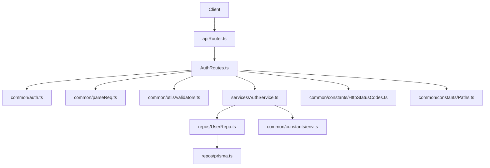
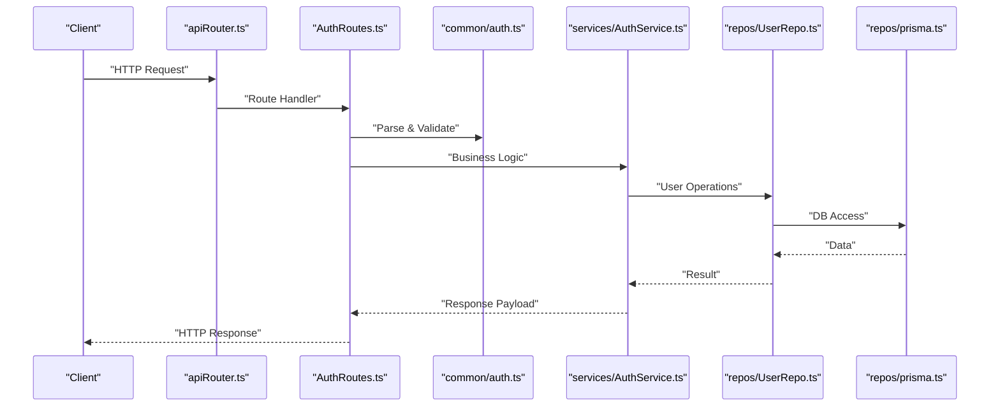
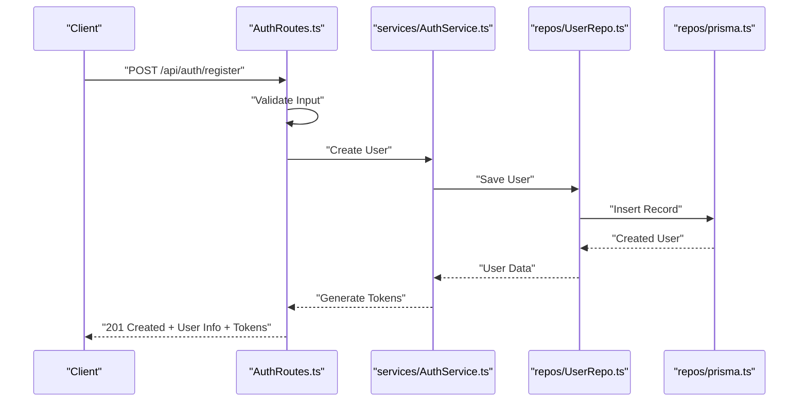
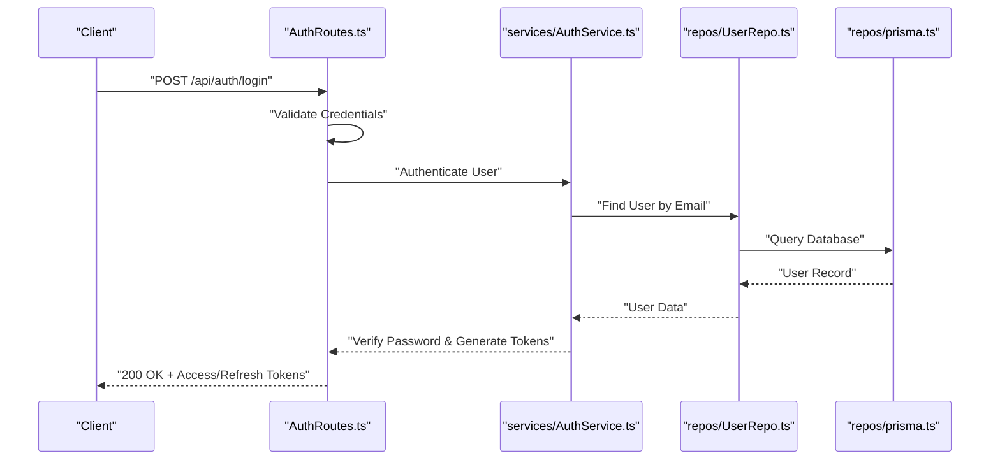
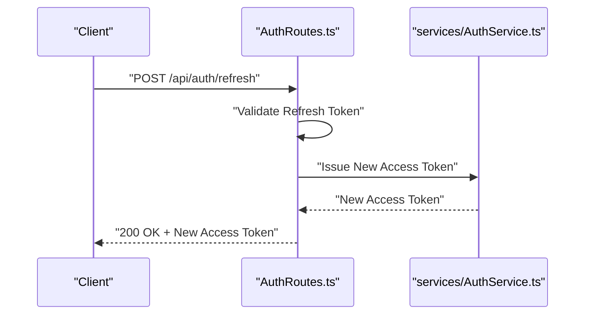
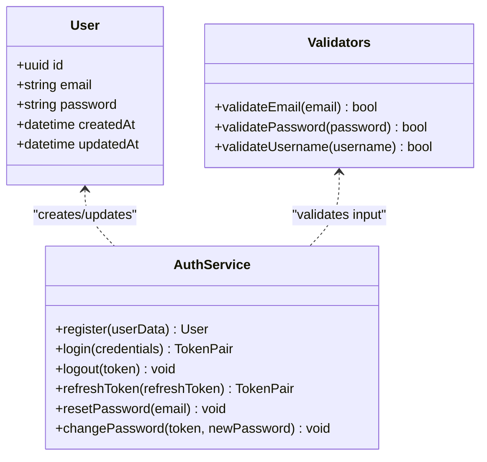
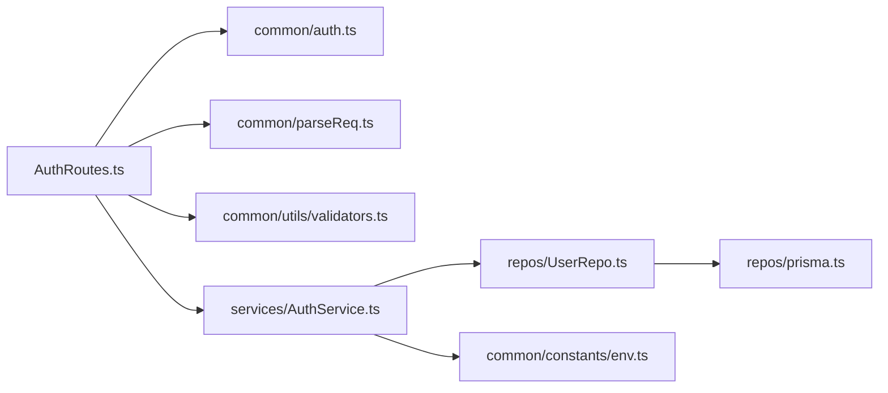

# Authentication API

<cite>
**Referenced Files in This Document**
- [AuthRoutes.ts](file://Backend/src/routes/AuthRoutes.ts)
- [auth.ts](file://Backend/src/routes/common/auth.ts)
- [AuthService.ts](file://Backend/src/services/AuthService.ts)
- [User.model.ts](file://Backend/src/models/User.model.ts)
- [apiRouter.ts](file://Backend/src/routes/apiRouter.ts)
- [Paths.ts](file://Backend/src/common/constants/Paths.ts)
- [HttpStatusCodes.ts](file://Backend/src/common/constants/HttpStatusCodes.ts)
- [validators.ts](file://Backend/src/common/utils/validators.ts)
- [route-errors.ts](file://Backend/src/common/utils/route-errors.ts)
- [parseReq.ts](file://Backend/src/routes/common/parseReq.ts)
- [express-types.ts](file://Backend/src/routes/common/express-types.ts)
- [prisma.ts](file://Backend/src/repos/prisma.ts)
- [UserRepo.ts](file://Backend/src/repos/UserRepo.ts)
- [env.ts](file://Backend/src/common/constants/env.ts)
</cite>

## Table of Contents
1. [Introduction](#introduction)
2. [Project Structure](#project-structure)
3. [Core Components](#core-components)
4. [Architecture Overview](#architecture-overview)
5. [Detailed Component Analysis](#detailed-component-analysis)
6. [Dependency Analysis](#dependency-analysis)
7. [Performance Considerations](#performance-considerations)
8. [Troubleshooting Guide](#troubleshooting-guide)
9. [Conclusion](#conclusion)
10. [Appendices](#appendices)

## Introduction
This document provides comprehensive API documentation for StudentBite’s authentication endpoints. It covers user registration, login/logout operations, token refresh mechanisms, and password management. For each endpoint, it specifies HTTP methods, URL patterns, request/response schemas, validation rules, JWT handling, error responses (including 401, 403, 422), and security considerations. Practical examples and client implementation guidelines are included to help you integrate authentication flows correctly.

## Project Structure
Authentication functionality is implemented across routes, services, models, repositories, and utilities:
- Routes define HTTP endpoints and parse requests.
- Services encapsulate business logic for authentication.
- Models represent database entities.
- Repositories interact with the database via Prisma.
- Utilities provide validation, error mapping, and constants.

**Diagram sources**
- [apiRouter.ts](file://Backend/src/routes/apiRouter.ts)
- [AuthRoutes.ts](file://Backend/src/routes/AuthRoutes.ts)
- [auth.ts](file://Backend/src/routes/common/auth.ts)
- [parseReq.ts](file://Backend/src/routes/common/parseReq.ts)
- [validators.ts](file://Backend/src/common/utils/validators.ts)
- [AuthService.ts](file://Backend/src/services/AuthService.ts)
- [UserRepo.ts](file://Backend/src/repos/UserRepo.ts)
- [prisma.ts](file://Backend/src/repos/prisma.ts)
- [env.ts](file://Backend/src/common/constants/env.ts)
- [HttpStatusCodes.ts](file://Backend/src/common/constants/HttpStatusCodes.ts)
- [Paths.ts](file://Backend/src/common/constants/Paths.ts)

**Section sources**
- [AuthRoutes.ts](file://Backend/src/routes/AuthRoutes.ts)
- [auth.ts](file://Backend/src/routes/common/auth.ts)
- [AuthService.ts](file://Backend/src/services/AuthService.ts)
- [User.model.ts](file://Backend/src/models/User.model.ts)
- [apiRouter.ts](file://Backend/src/routes/apiRouter.ts)
- [Paths.ts](file://Backend/src/common/constants/Paths.ts)
- [HttpStatusCodes.ts](file://Backend/src/common/constants/HttpStatusCodes.ts)
- [validators.ts](file://Backend/src/common/utils/validators.ts)
- [route-errors.ts](file://Backend/src/common/utils/route-errors.ts)
- [parseReq.ts](file://Backend/src/routes/common/parseReq.ts)
- [express-types.ts](file://Backend/src/routes/common/express-types.ts)
- [prisma.ts](file://Backend/src/repos/prisma.ts)
- [UserRepo.ts](file://Backend/src/repos/UserRepo.ts)
- [env.ts](file://Backend/src/common/constants/env.ts)

## Core Components
- Authentication routes expose endpoints for register, login, logout, refresh, and password management.
- The authentication service handles token generation/validation, password hashing, and user operations.
- Validation utilities enforce input constraints and return structured errors.
- Error utilities map exceptions to standardized HTTP responses.

Key responsibilities:
- Route handlers parse and validate requests, then delegate to the auth service.
- Auth service manages JWT lifecycle and interacts with user repository.
- Repository layer abstracts database access using Prisma.
- Constants define paths and status codes used across the API.

**Section sources**
- [AuthRoutes.ts](file://Backend/src/routes/AuthRoutes.ts)
- [auth.ts](file://Backend/src/routes/common/auth.ts)
- [AuthService.ts](file://Backend/src/services/AuthService.ts)
- [validators.ts](file://Backend/src/common/utils/validators.ts)
- [route-errors.ts](file://Backend/src/common/utils/route-errors.ts)
- [Paths.ts](file://Backend/src/common/constants/Paths.ts)
- [HttpStatusCodes.ts](file://Backend/src/common/constants/HttpStatusCodes.ts)

## Architecture Overview
The authentication flow follows a layered architecture:
- HTTP clients call route endpoints.
- Route handlers parse and validate inputs.
- Service layer performs business logic and token operations.
- Repository layer persists or retrieves data through Prisma.
- Errors are normalized and returned as consistent JSON responses.

**Diagram sources**
- [apiRouter.ts](file://Backend/src/routes/apiRouter.ts)
- [AuthRoutes.ts](file://Backend/src/routes/AuthRoutes.ts)
- [auth.ts](file://Backend/src/routes/common/auth.ts)
- [AuthService.ts](file://Backend/src/services/AuthService.ts)
- [UserRepo.ts](file://Backend/src/repos/UserRepo.ts)
- [prisma.ts](file://Backend/src/repos/prisma.ts)

## Detailed Component Analysis

### Authentication Endpoints
Endpoints exposed by the authentication module include:
- Register: POST /api/auth/register
- Login: POST /api/auth/login
- Logout: POST /api/auth/logout
- Refresh Token: POST /api/auth/refresh
- Password Management: POST /api/auth/password/reset, POST /api/auth/password/change

Request/response schemas:
- Register
  - Request fields: email (string, required), password (string, required), username (string, optional).
  - Response: { userId, email, username, accessToken, refreshToken } on success; error details on failure.
  - Validation: email format, password length requirements, unique constraints.
- Login
  - Request fields: email (string, required), password (string, required).
  - Response: { accessToken, refreshToken } on success; error details on failure.
  - Validation: credentials presence and format.
- Logout
  - Request headers: Authorization Bearer token.
  - Response: { message } indicating successful logout; error details if invalid token.
- Refresh Token
  - Request body: refreshToken (string, required).
  - Response: { accessToken, refreshToken } on success; error details on failure.
- Password Reset
  - Request fields: email (string, required).
  - Response: { message } indicating reset instructions sent; error details on failure.
- Password Change
  - Request headers: Authorization Bearer token.
  - Request body: newPassword (string, required).
  - Response: { message } indicating successful change; error details on failure.

JWT handling:
- Access tokens are short-lived and included in Authorization header.
- Refresh tokens are long-lived and stored securely; used to obtain new access tokens.
- Tokens are validated and signed using environment-configured secrets.

Error responses:
- 401 Unauthorized: Invalid or missing token.
- 403 Forbidden: Insufficient permissions or account locked.
- 422 Unprocessable Entity: Validation errors in request payload.

Security considerations:
- Use HTTPS for all endpoints.
- Store tokens securely on the client side (e.g., httpOnly cookies or secure storage).
- Implement token rotation and expiration policies.
- Enforce strong password policies and rate limiting.

**Section sources**
- [AuthRoutes.ts](file://Backend/src/routes/AuthRoutes.ts)
- [auth.ts](file://Backend/src/routes/common/auth.ts)
- [AuthService.ts](file://Backend/src/services/AuthService.ts)
- [validators.ts](file://Backend/src/common/utils/validators.ts)
- [route-errors.ts](file://Backend/src/common/utils/route-errors.ts)
- [Paths.ts](file://Backend/src/common/constants/Paths.ts)
- [HttpStatusCodes.ts](file://Backend/src/common/constants/HttpStatusCodes.ts)

#### Registration Flow

**Diagram sources**
- [AuthRoutes.ts](file://Backend/src/routes/AuthRoutes.ts)
- [AuthService.ts](file://Backend/src/services/AuthService.ts)
- [UserRepo.ts](file://Backend/src/repos/UserRepo.ts)
- [prisma.ts](file://Backend/src/repos/prisma.ts)

#### Login Flow

**Diagram sources**
- [AuthRoutes.ts](file://Backend/src/routes/AuthRoutes.ts)
- [AuthService.ts](file://Backend/src/services/AuthService.ts)
- [UserRepo.ts](file://Backend/src/repos/UserRepo.ts)
- [prisma.ts](file://Backend/src/repos/prisma.ts)

#### Token Refresh Flow

**Diagram sources**
- [AuthRoutes.ts](file://Backend/src/routes/AuthRoutes.ts)
- [AuthService.ts](file://Backend/src/services/AuthService.ts)

### Data Models and Validation
User model defines core attributes such as id, email, password, and timestamps. Validation utilities ensure data integrity before processing requests.

**Diagram sources**
- [User.model.ts](file://Backend/src/models/User.model.ts)
- [validators.ts](file://Backend/src/common/utils/validators.ts)
- [AuthService.ts](file://Backend/src/services/AuthService.ts)

**Section sources**
- [User.model.ts](file://Backend/src/models/User.model.ts)
- [validators.ts](file://Backend/src/common/utils/validators.ts)
- [AuthService.ts](file://Backend/src/services/AuthService.ts)

## Dependency Analysis
Authentication components have clear dependencies:
- Routes depend on common utilities for parsing and validation.
- Services depend on repositories for data operations.
- Repositories depend on Prisma for database interactions.
- Environment variables configure JWT secrets and token lifetimes.

**Diagram sources**
- [AuthRoutes.ts](file://Backend/src/routes/AuthRoutes.ts)
- [auth.ts](file://Backend/src/routes/common/auth.ts)
- [parseReq.ts](file://Backend/src/routes/common/parseReq.ts)
- [validators.ts](file://Backend/src/common/utils/validators.ts)
- [AuthService.ts](file://Backend/src/services/AuthService.ts)
- [UserRepo.ts](file://Backend/src/repos/UserRepo.ts)
- [prisma.ts](file://Backend/src/repos/prisma.ts)
- [env.ts](file://Backend/src/common/constants/env.ts)

**Section sources**
- [AuthRoutes.ts](file://Backend/src/routes/AuthRoutes.ts)
- [AuthService.ts](file://Backend/src/services/AuthService.ts)
- [UserRepo.ts](file://Backend/src/repos/UserRepo.ts)
- [prisma.ts](file://Backend/src/repos/prisma.ts)
- [env.ts](file://Backend/src/common/constants/env.ts)

## Performance Considerations
- Minimize database queries by caching frequently accessed data where appropriate.
- Use efficient indexing on user email and other lookup fields.
- Implement rate limiting on authentication endpoints to prevent brute-force attacks.
- Optimize JWT signing and verification processes by using appropriate algorithms and key sizes.
- Monitor response times and identify bottlenecks in authentication flows.

[No sources needed since this section provides general guidance]

## Troubleshooting Guide
Common authentication issues and solutions:
- Invalid credentials: Ensure email and password match registered values. Check for typos and case sensitivity.
- Token expired: Refresh tokens should be used to obtain new access tokens. Implement automatic refresh logic.
- Validation errors: Verify request payloads conform to expected schemas. Check field types and required parameters.
- Permission denied: Ensure user has necessary permissions to perform requested actions.

Debugging tips:
- Enable detailed logging for authentication flows.
- Use development tools to inspect request/response headers and payloads.
- Test endpoints with known valid credentials and tokens.

**Section sources**
- [route-errors.ts](file://Backend/src/common/utils/route-errors.ts)
- [validators.ts](file://Backend/src/common/utils/validators.ts)
- [AuthService.ts](file://Backend/src/services/AuthService.ts)

## Conclusion
StudentBite’s authentication system provides a robust foundation for user management and secure access control. By following the documented endpoints, schemas, and security practices, developers can implement reliable authentication flows that protect user data and maintain application integrity.

[No sources needed since this section summarizes without analyzing specific files]

## Appendices

### Client Implementation Guidelines
- Store access tokens in memory or secure storage.
- Implement automatic token refresh when access tokens expire.
- Handle error responses gracefully and provide user feedback.
- Use HTTPS for all API communications.
- Implement proper logout functionality to clear tokens.

### Security Best Practices
- Never log sensitive information like passwords or tokens.
- Use environment variables for configuration secrets.
- Implement CSRF protection for state-changing operations.
- Regularly update dependencies and security patches.

[No sources needed since this section provides general guidance]