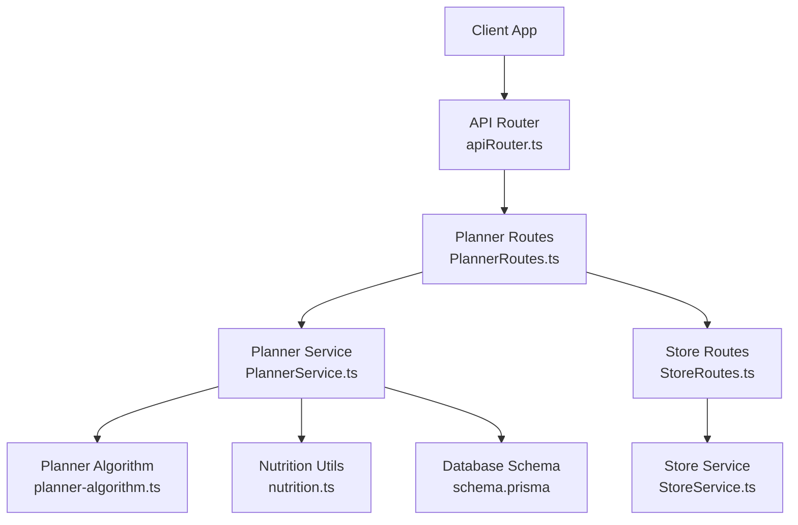
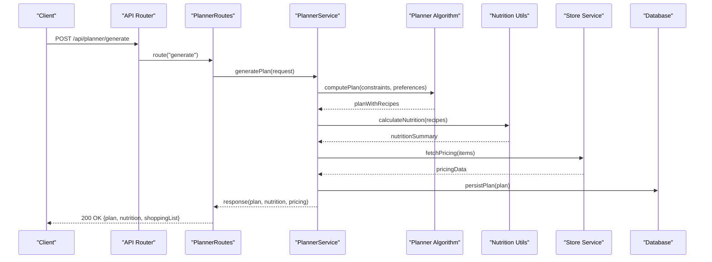
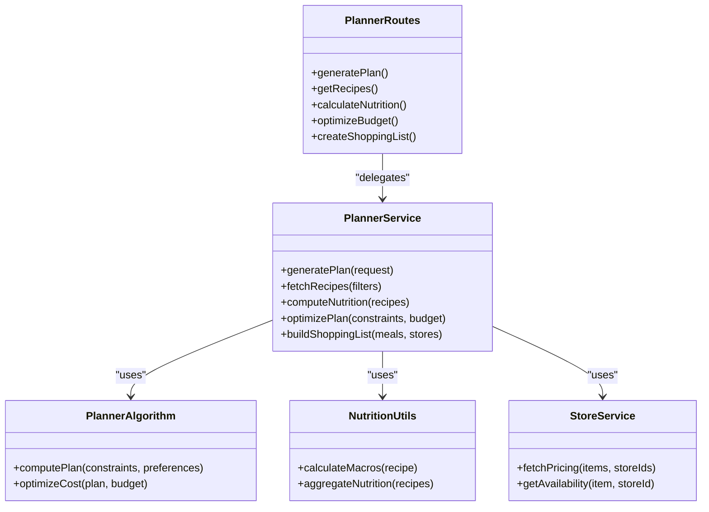
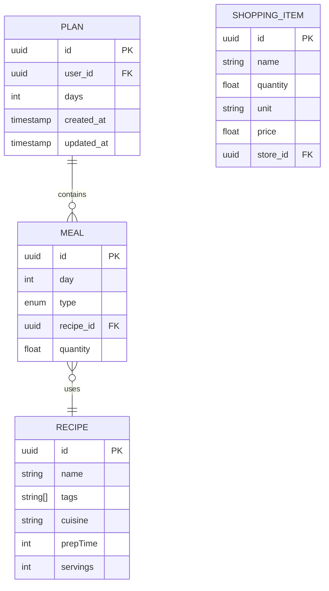

# Meal Planning API

<cite>
**Referenced Files in This Document**
- [PlannerRoutes.ts](file://Backend/src/routes/PlannerRoutes.ts)
- [PlannerService.ts](file://Backend/src/services/PlannerService.ts)
- [planner-algorithm.ts](file://Backend/src/services/planner-algorithm.ts)
- [nutrition.ts](file://Backend/src/common/utils/nutrition.ts)
- [Paths.ts](file://Backend/src/common/constants/Paths.ts)
- [apiRouter.ts](file://Backend/src/routes/apiRouter.ts)
- [StoreRoutes.ts](file://Backend/src/routes/StoreRoutes.ts)
- [StoreService.ts](file://Backend/src/services/StoreService.ts)
- [schema.prisma](file://Backend/prisma/schema.prisma)
</cite>

## Table of Contents
1. [Introduction](#introduction)
2. [Project Structure](#project-structure)
3. [Core Components](#core-components)
4. [Architecture Overview](#architecture-overview)
5. [Detailed Component Analysis](#detailed-component-analysis)
6. [Dependency Analysis](#dependency-analysis)
7. [Performance Considerations](#performance-considerations)
8. [Troubleshooting Guide](#troubleshooting-guide)
9. [Conclusion](#conclusion)
10. [Appendices](#appendices)

## Introduction
This document provides comprehensive API documentation for StudentBite’s meal planning endpoints. It covers plan generation, recipe management, nutritional analysis, budget optimization, and shopping list creation. Each endpoint specifies HTTP methods, URL patterns under /api/planner/*, request/response schemas (including nutritional data structures), algorithm parameters, dietary restriction filters, and optimization criteria. Practical examples illustrate how to generate meal plans, specify custom constraints, perform batch operations, and integrate with store pricing data.

## Project Structure
The meal planning feature is implemented on the backend using Express routes, services, and an algorithm module. The planner routes are mounted under a common API router and expose endpoints for plan generation, recipe queries, nutrition calculations, budget optimization, and shopping list creation. Store integration is provided via separate store routes and services that can be used to fetch pricing data for cost optimization.

**Diagram sources**
- [apiRouter.ts](file://Backend/src/routes/apiRouter.ts)
- [PlannerRoutes.ts](file://Backend/src/routes/PlannerRoutes.ts)
- [PlannerService.ts](file://Backend/src/services/PlannerService.ts)
- [planner-algorithm.ts](file://Backend/src/services/planner-algorithm.ts)
- [nutrition.ts](file://Backend/src/common/utils/nutrition.ts)
- [StoreRoutes.ts](file://Backend/src/routes/StoreRoutes.ts)
- [StoreService.ts](file://Backend/src/services/StoreService.ts)
- [schema.prisma](file://Backend/prisma/schema.prisma)

**Section sources**
- [PlannerRoutes.ts](file://Backend/src/routes/PlannerRoutes.ts)
- [PlannerService.ts](file://Backend/src/services/PlannerService.ts)
- [planner-algorithm.ts](file://Backend/src/services/planner-algorithm.ts)
- [nutrition.ts](file://Backend/src/common/utils/nutrition.ts)
- [Paths.ts](file://Backend/src/common/constants/Paths.ts)
- [apiRouter.ts](file://Backend/src/routes/apiRouter.ts)
- [StoreRoutes.ts](file://Backend/src/routes/StoreRoutes.ts)
- [StoreService.ts](file://Backend/src/services/StoreService.ts)
- [schema.prisma](file://Backend/prisma/schema.prisma)

## Core Components
- PlannerRoutes: Defines HTTP endpoints under /api/planner for meal planning operations.
- PlannerService: Orchestrates business logic for plan generation, recipe retrieval, nutrition calculation, budget optimization, and shopping list creation.
- Planner Algorithm: Implements core algorithms for generating balanced meals based on constraints and preferences.
- Nutrition Utils: Provides utilities for computing nutritional values and aggregating macro/micronutrient data.
- Store Integration: Fetches pricing and availability from stores to optimize costs and build shopping lists.

Key responsibilities:
- Plan Generation: Create weekly or daily meal plans respecting dietary restrictions and nutritional targets.
- Recipe Management: Query recipes by tags, ingredients, cuisine, and other filters.
- Nutritional Analysis: Compute per-meal and per-plan nutritional summaries.
- Budget Optimization: Minimize total cost while meeting nutritional goals and constraints.
- Shopping List Creation: Aggregate ingredients across selected meals and map to store items.

**Section sources**
- [PlannerRoutes.ts](file://Backend/src/routes/PlannerRoutes.ts)
- [PlannerService.ts](file://Backend/src/services/PlannerService.ts)
- [planner-algorithm.ts](file://Backend/src/services/planner-algorithm.ts)
- [nutrition.ts](file://Backend/src/common/utils/nutrition.ts)

## Architecture Overview
The meal planning API follows a layered architecture:
- Route Layer: Validates requests and delegates to service layer.
- Service Layer: Coordinates domain logic, calls algorithm and utility modules, and interacts with external services (e.g., store pricing).
- Algorithm Layer: Executes optimization and selection logic for meal plans.
- Data Layer: Persists and retrieves recipes, plans, and user preferences via Prisma schema.

**Diagram sources**
- [PlannerRoutes.ts](file://Backend/src/routes/PlannerRoutes.ts)
- [PlannerService.ts](file://Backend/src/services/PlannerService.ts)
- [planner-algorithm.ts](file://Backend/src/services/planner-algorithm.ts)
- [nutrition.ts](file://Backend/src/common/utils/nutrition.ts)
- [StoreService.ts](file://Backend/src/services/StoreService.ts)
- [schema.prisma](file://Backend/prisma/schema.prisma)

## Detailed Component Analysis

### Endpoints Overview
All meal planning endpoints are exposed under /api/planner. Typical HTTP methods include:
- POST /api/planner/generate: Generate a meal plan based on constraints and preferences.
- GET /api/planner/recipes: Retrieve recipes with filtering and pagination.
- POST /api/planner/nutrition: Calculate nutritional information for given recipes or meals.
- POST /api/planner/optimize-budget: Optimize plan cost within nutritional constraints.
- POST /api/planner/shopping-list: Create a consolidated shopping list from selected meals.

Note: Exact URL patterns may vary; consult the route definitions for precise paths.

**Section sources**
- [PlannerRoutes.ts](file://Backend/src/routes/PlannerRoutes.ts)
- [Paths.ts](file://Backend/src/common/constants/Paths.ts)

### Plan Generation Endpoint
- Method: POST
- URL Pattern: /api/planner/generate
- Request Body:
  - days: number of days to plan
  - mealsPerDay: number of meals per day
  - dietaryRestrictions: array of strings (e.g., vegetarian, gluten-free)
  - nutritionalTargets: object with macros and micros (calories, protein, carbs, fats, vitamins)
  - budgetLimit: optional maximum cost per day or total
  - preferredCuisines: array of strings
  - excludedIngredients: array of strings
  - storeIds: optional list of store IDs for pricing integration
- Response:
  - plan: array of daily meal sets with recipe selections
  - nutritionSummary: aggregated nutritional values per day and overall
  - shoppingList: aggregated ingredients mapped to store items
  - costBreakdown: per-day and total cost with store pricing

Example usage:
- Generate a 7-day plan with vegetarian diet, target calories 2000/day, protein 100g, exclude nuts, budget $50/day, prefer Asian and Mediterranean cuisines, use store IDs [1, 2].

**Section sources**
- [PlannerRoutes.ts](file://Backend/src/routes/PlannerRoutes.ts)
- [PlannerService.ts](file://Backend/src/services/PlannerService.ts)
- [planner-algorithm.ts](file://Backend/src/services/planner-algorithm.ts)
- [nutrition.ts](file://Backend/src/common/utils/nutrition.ts)
- [StoreService.ts](file://Backend/src/services/StoreService.ts)

### Recipe Management Endpoint
- Method: GET
- URL Pattern: /api/planner/recipes
- Query Parameters:
  - tags: comma-separated tags (e.g., breakfast,dairy-free)
  - cuisine: string filter
  - maxCalories: number
  - minProtein: number
  - page: integer
  - limit: integer
- Response:
  - recipes: array of recipe objects with id, name, tags, cuisine, prepTime, servings
  - pagination: {page, limit, total}

Example usage:
- Retrieve breakfast recipes with dairy-free tag, max 400 calories, page 1, limit 20.

**Section sources**
- [PlannerRoutes.ts](file://Backend/src/routes/PlannerRoutes.ts)
- [PlannerService.ts](file://Backend/src/services/PlannerService.ts)

### Nutritional Analysis Endpoint
- Method: POST
- URL Pattern: /api/planner/nutrition
- Request Body:
  - recipes: array of recipe ids or full recipe objects
  - servingSizes: optional mapping of recipe id to multiplier
- Response:
  - perRecipeNutrition: object keyed by recipe id with macros and micros
  - totals: aggregated nutritional values across all recipes
  - recommendations: optional suggestions to meet targets

Example usage:
- Calculate nutrition for 3 recipes with serving size multipliers 1.2, 0.8, 1.0.

**Section sources**
- [PlannerRoutes.ts](file://Backend/src/routes/PlannerRoutes.ts)
- [PlannerService.ts](file://Backend/src/services/PlannerService.ts)
- [nutrition.ts](file://Backend/src/common/utils/nutrition.ts)

### Budget Optimization Endpoint
- Method: POST
- URL Pattern: /api/planner/optimize-budget
- Request Body:
  - constraints: same as plan generation (dietary, nutritional, exclusions)
  - budgetLimit: total or per-day budget
  - storeIds: optional list of store IDs
  - optimizationGoal: minimizeCost | maximizeNutrition | balance
- Response:
  - optimizedPlan: plan with minimal cost or maximized nutrition depending on goal
  - costAnalysis: breakdown by ingredient and store
  - savings: comparison against baseline plan

Example usage:
- Optimize a 5-day plan with vegetarian constraints, budget $40/day, goal minimizeCost, stores [1].

**Section sources**
- [PlannerRoutes.ts](file://Backend/src/routes/PlannerRoutes.ts)
- [PlannerService.ts](file://Backend/src/services/PlannerService.ts)
- [planner-algorithm.ts](file://Backend/src/services/planner-algorithm.ts)
- [StoreService.ts](file://Backend/src/services/StoreService.ts)

### Shopping List Creation Endpoint
- Method: POST
- URL Pattern: /api/planner/shopping-list
- Request Body:
  - planId: optional existing plan id
  - meals: array of meal objects with recipe ids and quantities
  - storeIds: optional list of store IDs for item mapping
- Response:
  - shoppingList: array of items with name, quantity, unit, estimatedPrice, storeAvailability
  - totalEstimatedCost: sum of item prices
  - storeBreakdown: items grouped by store

Example usage:
- Create a shopping list for selected meals across stores [1, 2], aggregate ingredients, and estimate total cost.

**Section sources**
- [PlannerRoutes.ts](file://Backend/src/routes/PlannerRoutes.ts)
- [PlannerService.ts](file://Backend/src/services/PlannerService.ts)
- [StoreService.ts](file://Backend/src/services/StoreService.ts)

### Batch Operations
- Method: POST
- URL Pattern: /api/planner/batch
- Request Body:
  - operations: array of operation objects each specifying type (generate, nutrition, optimize, shoppingList) and payload
- Response:
  - results: array of results corresponding to each operation
  - errors: any failures with details

Example usage:
- Batch generate two plans, calculate nutrition for three recipes, and create one shopping list in a single request.

**Section sources**
- [PlannerRoutes.ts](file://Backend/src/routes/PlannerRoutes.ts)
- [PlannerService.ts](file://Backend/src/services/PlannerService.ts)

### Integration with Store Pricing Data
- Use storeIds in plan generation, budget optimization, and shopping list creation to fetch real-time pricing and availability.
- Store routes provide additional endpoints for querying store catalogs and promotions.

Example usage:
- Include storeIds [1, 2] in budget optimization to compare costs across stores and select optimal items.

**Section sources**
- [StoreRoutes.ts](file://Backend/src/routes/StoreRoutes.ts)
- [StoreService.ts](file://Backend/src/services/StoreService.ts)

## Dependency Analysis
The meal planning system has clear dependencies between layers:
- PlannerRoutes depends on PlannerService for business logic.
- PlannerService depends on planner-algorithm for optimization and nutrition.ts for nutritional calculations.
- StoreService is used for pricing and availability data.
- Database interactions are defined via schema.prisma.

**Diagram sources**
- [PlannerRoutes.ts](file://Backend/src/routes/PlannerRoutes.ts)
- [PlannerService.ts](file://Backend/src/services/PlannerService.ts)
- [planner-algorithm.ts](file://Backend/src/services/planner-algorithm.ts)
- [nutrition.ts](file://Backend/src/common/utils/nutrition.ts)
- [StoreService.ts](file://Backend/src/services/StoreService.ts)

**Section sources**
- [PlannerRoutes.ts](file://Backend/src/routes/PlannerRoutes.ts)
- [PlannerService.ts](file://Backend/src/services/PlannerService.ts)
- [planner-algorithm.ts](file://Backend/src/services/planner-algorithm.ts)
- [nutrition.ts](file://Backend/src/common/utils/nutrition.ts)
- [StoreService.ts](file://Backend/src/services/StoreService.ts)
- [schema.prisma](file://Backend/prisma/schema.prisma)

## Performance Considerations
- Caching: Cache frequently accessed recipes and store pricing to reduce latency.
- Pagination: Implement pagination for recipe queries to handle large datasets.
- Parallelization: Execute independent operations (nutrition calculation, store pricing fetch) concurrently.
- Algorithm Efficiency: Optimize constraint solving and selection algorithms for large search spaces.
- Database Queries: Use efficient queries and indexes for recipe and plan lookups.

[No sources needed since this section provides general guidance]

## Troubleshooting Guide
Common issues and resolutions:
- Invalid dietary restrictions: Ensure restriction strings match allowed values.
- Missing nutritional targets: Provide required macros and micros for accurate planning.
- Store pricing unavailable: Verify storeIds and network connectivity; fallback to default pricing if available.
- Plan generation failures: Check constraint feasibility; relax restrictions or adjust budgets.

Error responses typically include status codes and descriptive messages. Validate request payloads before sending.

**Section sources**
- [PlannerRoutes.ts](file://Backend/src/routes/PlannerRoutes.ts)
- [PlannerService.ts](file://Backend/src/services/PlannerService.ts)

## Conclusion
StudentBite’s meal planning API offers robust endpoints for generating personalized meal plans, managing recipes, analyzing nutrition, optimizing budgets, and creating shopping lists. By integrating store pricing data and supporting batch operations, it enables flexible and efficient meal planning workflows. Follow the documented schemas and examples to implement effective integrations.

[No sources needed since this section summarizes without analyzing specific files]

## Appendices

### Data Models
Key entities involved in meal planning:
- Recipe: id, name, tags, cuisine, prepTime, servings, ingredients
- Meal: id, day, type (breakfast/lunch/dinner), recipeId, quantity
- Plan: id, userId, days, meals, createdAt, updatedAt
- ShoppingItem: id, name, quantity, unit, price, storeId

**Diagram sources**
- [schema.prisma](file://Backend/prisma/schema.prisma)

### Example Requests and Responses
- Plan Generation:
  - Request: POST /api/planner/generate with days=7, mealsPerDay=3, dietaryRestrictions=["vegetarian"], nutritionalTargets={calories:2000, protein:100}, budgetLimit=50, preferredCuisines=["Asian","Mediterranean"], excludedIngredients=["nuts"], storeIds=[1,2]
  - Response: {plan:[...], nutritionSummary:{...}, shoppingList:[...], costBreakdown:{...}}
- Recipe Query:
  - Request: GET /api/planner/recipes?tags=breakfast,dairy-free&maxCalories=400&page=1&limit=20
  - Response: {recipes:[...], pagination:{page:1,limit:20,total:...}}
- Nutrition Calculation:
  - Request: POST /api/planner/nutrition with recipes=[...], servingSizes={...}
  - Response: {perRecipeNutrition:{...}, totals:{...}, recommendations:[...]}
- Budget Optimization:
  - Request: POST /api/planner/optimize-budget with constraints={...}, budgetLimit=40, storeIds=[1], optimizationGoal="minimizeCost"
  - Response: {optimizedPlan:{...}, costAnalysis:{...}, savings:...}
- Shopping List Creation:
  - Request: POST /api/planner/shopping-list with meals=[...], storeIds=[1,2]
  - Response: {shoppingList:[...], totalEstimatedCost:..., storeBreakdown:{...}}

[No sources needed since this section provides conceptual examples]