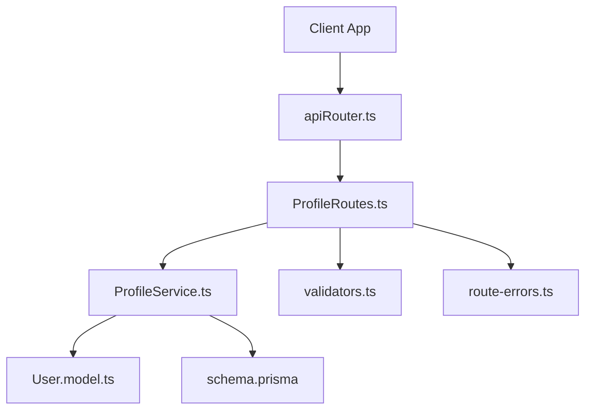
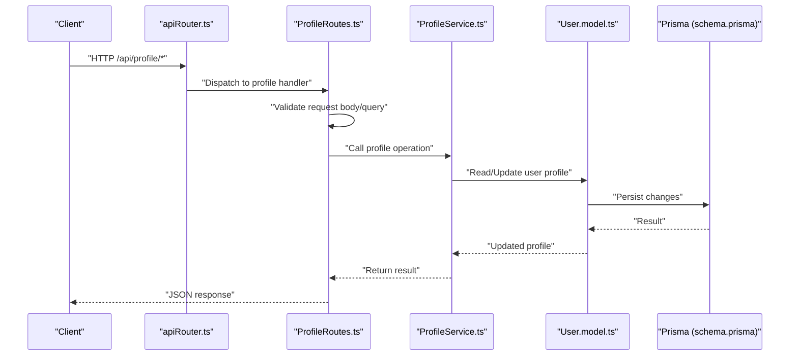
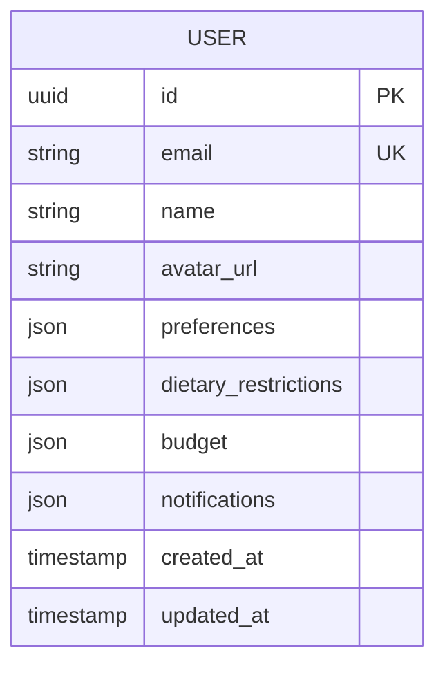
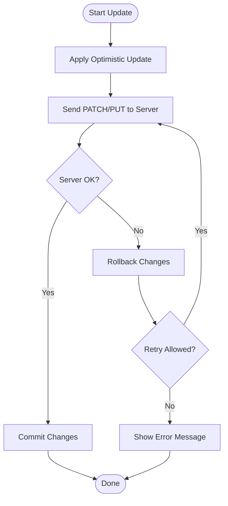
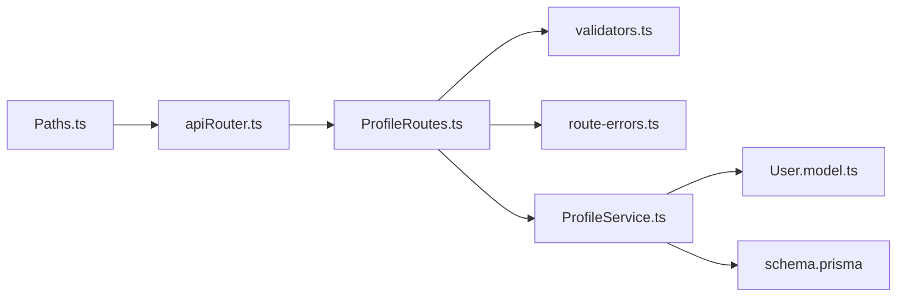

# Profile Management API

<cite>
**Referenced Files in This Document**
- [ProfileRoutes.ts](file://Backend/src/routes/ProfileRoutes.ts)
- [ProfileService.ts](file://Backend/src/services/ProfileService.ts)
- [User.model.ts](file://Backend/src/models/User.model.ts)
- [schema.prisma](file://Backend/prisma/schema.prisma)
- [Paths.ts](file://Backend/src/common/constants/Paths.ts)
- [validators.ts](file://Backend/src/common/utils/validators.ts)
- [route-errors.ts](file://Backend/src/common/utils/route-errors.ts)
- [apiRouter.ts](file://Backend/src/routes/apiRouter.ts)
</cite>

## Table of Contents
1. [Introduction](#introduction)
2. [Project Structure](#project-structure)
3. [Core Components](#core-components)
4. [Architecture Overview](#architecture-overview)
5. [Detailed Component Analysis](#detailed-component-analysis)
6. [Dependency Analysis](#dependency-analysis)
7. [Performance Considerations](#performance-considerations)
8. [Troubleshooting Guide](#troubleshooting-guide)
9. [Conclusion](#conclusion)

## Introduction
This document provides comprehensive API documentation for StudentBite’s profile management endpoints. It covers all profile-related HTTP methods, URL patterns under /api/profile/*, request and response schemas, preference objects, validation rules, and practical examples for common operations such as retrieving profile data, updating preferences, managing dietary restrictions, configuring budget settings, and adjusting notification preferences. It also includes synchronization patterns between client and server to ensure consistent state across updates.

## Project Structure
The profile management feature is implemented in the backend with a clear separation of concerns:
- Routes define HTTP endpoints and map them to service handlers.
- Services encapsulate business logic for profile operations.
- Models and Prisma schema define persistent data structures.
- Common utilities provide validation helpers and error formatting.

**Diagram sources**
- [apiRouter.ts](file://Backend/src/routes/apiRouter.ts)
- [ProfileRoutes.ts](file://Backend/src/routes/ProfileRoutes.ts)
- [ProfileService.ts](file://Backend/src/services/ProfileService.ts)
- [User.model.ts](file://Backend/src/models/User.model.ts)
- [schema.prisma](file://Backend/prisma/schema.prisma)
- [validators.ts](file://Backend/src/common/utils/validators.ts)
- [route-errors.ts](file://Backend/src/common/utils/route-errors.ts)

**Section sources**
- [ProfileRoutes.ts](file://Backend/src/routes/ProfileRoutes.ts)
- [ProfileService.ts](file://Backend/src/services/ProfileService.ts)
- [User.model.ts](file://Backend/src/models/User.model.ts)
- [schema.prisma](file://Backend/prisma/schema.prisma)
- [Paths.ts](file://Backend/src/common/constants/Paths.ts)
- [validators.ts](file://Backend/src/common/utils/validators.ts)
- [route-errors.ts](file://Backend/src/common/utils/route-errors.ts)
- [apiRouter.ts](file://Backend/src/routes/apiRouter.ts)

## Core Components
- ProfileRoutes: Defines HTTP endpoints for profile operations under /api/profile/*.
- ProfileService: Implements business logic for reading and updating profile data, preferences, dietary restrictions, budget, and notifications.
- User model and Prisma schema: Define the persisted profile structure and relationships.
- Validators: Provide input validation helpers used by routes or services.
- Route errors: Standardize error responses for invalid inputs and server-side failures.

Key responsibilities:
- GET endpoints return current profile and related settings.
- PUT/PATCH endpoints update specific fields or bulk-update preferences.
- Validation ensures required fields and constraints are met before persistence.
- Error handling returns structured error responses with actionable messages.

**Section sources**
- [ProfileRoutes.ts](file://Backend/src/routes/ProfileRoutes.ts)
- [ProfileService.ts](file://Backend/src/services/ProfileService.ts)
- [User.model.ts](file://Backend/src/models/User.model.ts)
- [schema.prisma](file://Backend/prisma/schema.prisma)
- [validators.ts](file://Backend/src/common/utils/validators.ts)
- [route-errors.ts](file://Backend/src/common/utils/route-errors.ts)

## Architecture Overview
The profile management flow follows a standard layered architecture:
- Client sends HTTP requests to /api/profile/* endpoints.
- Express router maps requests to route handlers.
- Route handlers validate inputs and delegate to ProfileService.
- ProfileService performs business logic and persists changes via the User model and Prisma.
- Responses are returned with standardized success or error payloads.

**Diagram sources**
- [apiRouter.ts](file://Backend/src/routes/apiRouter.ts)
- [ProfileRoutes.ts](file://Backend/src/routes/ProfileRoutes.ts)
- [ProfileService.ts](file://Backend/src/services/ProfileService.ts)
- [User.model.ts](file://Backend/src/models/User.model.ts)
- [schema.prisma](file://Backend/prisma/schema.prisma)

## Detailed Component Analysis

### Endpoints Overview
All profile endpoints are mounted under /api/profile. The following table summarizes available methods and their purposes:

- GET /api/profile
  - Purpose: Retrieve the authenticated user’s full profile including personal details, preferences, dietary restrictions, budget settings, and notification preferences.
  - Response: Profile object containing personal info, preferences, dietary restrictions, budget, and notifications.

- PUT /api/profile
  - Purpose: Full profile update. Replaces existing profile fields with provided values.
  - Request: Complete profile object; missing fields may be cleared depending on implementation.
  - Response: Updated profile object.

- PATCH /api/profile
  - Purpose: Partial profile update. Updates only provided fields without affecting others.
  - Request: Partial profile object with fields to update.
  - Response: Updated profile object.

- GET /api/profile/preferences
  - Purpose: Retrieve current preference settings.
  - Response: Preferences object.

- PUT /api/profile/preferences
  - Purpose: Replace entire preferences object.
  - Request: Full preferences object.
  - Response: Updated preferences object.

- PATCH /api/profile/preferences
  - Purpose: Bulk update specific preference keys.
  - Request: Partial preferences object.
  - Response: Updated preferences object.

- GET /api/profile/dietary-restrictions
  - Purpose: Retrieve current dietary restrictions list.
  - Response: Array of restriction identifiers.

- PUT /api/profile/dietary-restrictions
  - Purpose: Replace the entire dietary restrictions list.
  - Request: Array of restriction identifiers.
  - Response: Updated array.

- PATCH /api/profile/dietary-restrictions
  - Purpose: Add/remove individual restrictions.
  - Request: Object specifying additions/removals.
  - Response: Updated array.

- GET /api/profile/budget
  - Purpose: Retrieve current budget settings.
  - Response: Budget object with currency, limits, and frequency.

- PUT /api/profile/budget
  - Purpose: Replace entire budget configuration.
  - Request: Full budget object.
  - Response: Updated budget object.

- PATCH /api/profile/budget
  - Purpose: Update specific budget fields.
  - Request: Partial budget object.
  - Response: Updated budget object.

- GET /api/profile/notifications
  - Purpose: Retrieve current notification preferences.
  - Response: Notifications object with toggles and channels.

- PUT /api/profile/notifications
  - Purpose: Replace entire notification configuration.
  - Request: Full notifications object.
  - Response: Updated notifications object.

- PATCH /api/profile/notifications
  - Purpose: Update specific notification fields.
  - Request: Partial notifications object.
  - Response: Updated notifications object.

Note: Exact endpoint paths and behaviors depend on the implementation in ProfileRoutes.ts and ProfileService.ts. If certain sub-endpoints are not present, use the general profile endpoints with appropriate field names.

**Section sources**
- [ProfileRoutes.ts](file://Backend/src/routes/ProfileRoutes.ts)
- [ProfileService.ts](file://Backend/src/services/ProfileService.ts)

### Data Models and Schemas
Profile data is persisted through the User model and Prisma schema. Typical fields include:
- Personal information: name, email, avatar URL, contact details.
- Preferences: meal plan preferences, cuisine types, cooking skill level, favorite ingredients.
- Dietary restrictions: vegetarian, vegan, gluten-free, nut allergy, etc.
- Budget settings: currency code, weekly/monthly limit, spending thresholds.
- Notification preferences: email, push, in-app toggles and frequency.

**Diagram sources**
- [User.model.ts](file://Backend/src/models/User.model.ts)
- [schema.prisma](file://Backend/prisma/schema.prisma)

**Section sources**
- [User.model.ts](file://Backend/src/models/User.model.ts)
- [schema.prisma](file://Backend/prisma/schema.prisma)

### Request and Response Schemas
- Profile object:
  - Fields: personal info, preferences, dietary restrictions, budget, notifications.
  - Validation: Required fields enforced by validators; optional fields can be omitted in PATCH.

- Preferences object:
  - Keys: meal plan type, cuisine preferences, skill level, ingredient filters.
  - Validation: Enumerated values for known keys; custom keys allowed if supported.

- Dietary restrictions array:
  - Values: predefined restriction codes; additional codes may be rejected.

- Budget object:
  - Fields: currency, limit amount, period (weekly/monthly), alerts enabled.
  - Validation: numeric ranges and valid currency codes.

- Notifications object:
  - Fields: email, push, in-app booleans; frequency and quiet hours.
  - Validation: boolean flags and allowed frequency values.

Responses follow a consistent JSON structure:
- Success: { status: "ok", data: <object> }
- Error: { status: "error", message: "<description>", errors: [<field-specific errors>] }

**Section sources**
- [validators.ts](file://Backend/src/common/utils/validators.ts)
- [route-errors.ts](file://Backend/src/common/utils/route-errors.ts)

### Practical Examples

- Retrieve profile:
  - Method: GET
  - URL: /api/profile
  - Response: Full profile object with all sections.

- Update preferences partially:
  - Method: PATCH
  - URL: /api/profile/preferences
  - Request: { "cuisine": ["italian", "japanese"], "skill_level": "intermediate" }
  - Response: Updated preferences object.

- Replace entire budget:
  - Method: PUT
  - URL: /api/profile/budget
  - Request: { "currency": "USD", "limit": 200, "period": "monthly", "alerts": true }
  - Response: Updated budget object.

- Add dietary restriction:
  - Method: PATCH
  - URL: /api/profile/dietary-restrictions
  - Request: { "add": ["gluten-free"] }
  - Response: Updated restrictions array.

- Toggle notifications:
  - Method: PATCH
  - URL: /api/profile/notifications
  - Request: { "push": true, "email": false }
  - Response: Updated notifications object.

- Bulk preference update:
  - Method: PUT
  - URL: /api/profile/preferences
  - Request: Full preferences object replacing previous values.
  - Response: New preferences object.

- Validation error example:
  - Method: PATCH
  - URL: /api/profile/budget
  - Request: { "limit": -10 }
  - Response: { "status": "error", "message": "Validation failed", "errors": [{ "field": "budget.limit", "code": "invalid_number" }] }

**Section sources**
- [ProfileRoutes.ts](file://Backend/src/routes/ProfileRoutes.ts)
- [ProfileService.ts](file://Backend/src/services/ProfileService.ts)
- [validators.ts](file://Backend/src/common/utils/validators.ts)
- [route-errors.ts](file://Backend/src/common/utils/route-errors.ts)

### Synchronization Patterns
To keep client and server profile data synchronized:
- Use optimistic updates on the client for immediate UI feedback.
- On successful server response, commit optimistic changes; otherwise, rollback.
- For partial updates, send only changed fields to minimize payload size.
- Implement retry logic for failed network requests with exponential backoff.
- Validate client-side inputs before sending to reduce server errors.

[No sources needed since this diagram shows conceptual workflow, not actual code structure]

## Dependency Analysis
Profile management depends on routing, validation, service logic, and data persistence layers. The following diagram illustrates dependencies:

**Diagram sources**
- [Paths.ts](file://Backend/src/common/constants/Paths.ts)
- [apiRouter.ts](file://Backend/src/routes/apiRouter.ts)
- [ProfileRoutes.ts](file://Backend/src/routes/ProfileRoutes.ts)
- [validators.ts](file://Backend/src/common/utils/validators.ts)
- [route-errors.ts](file://Backend/src/common/utils/route-errors.ts)
- [ProfileService.ts](file://Backend/src/services/ProfileService.ts)
- [User.model.ts](file://Backend/src/models/User.model.ts)
- [schema.prisma](file://Backend/prisma/schema.prisma)

**Section sources**
- [Paths.ts](file://Backend/src/common/constants/Paths.ts)
- [apiRouter.ts](file://Backend/src/routes/apiRouter.ts)
- [ProfileRoutes.ts](file://Backend/src/routes/ProfileRoutes.ts)
- [validators.ts](file://Backend/src/common/utils/validators.ts)
- [route-errors.ts](file://Backend/src/common/utils/route-errors.ts)
- [ProfileService.ts](file://Backend/src/services/ProfileService.ts)
- [User.model.ts](file://Backend/src/models/User.model.ts)
- [schema.prisma](file://Backend/prisma/schema.prisma)

## Performance Considerations
- Prefer PATCH over PUT when only updating specific fields to reduce payload size and avoid unintended overwrites.
- Cache frequently accessed profile data on the client side to minimize repeated requests.
- Implement server-side caching for read-heavy endpoints if profile data is static for short periods.
- Validate inputs early to fail fast and avoid unnecessary database operations.
- Use pagination or selective field retrieval if profile objects grow large.

[No sources needed since this section provides general guidance]

## Troubleshooting Guide
Common issues and resolutions:
- Validation errors: Ensure request bodies match expected schemas; check enum values and numeric ranges.
- Unauthorized access: Verify authentication headers and session tokens.
- Conflict during updates: Use versioning or timestamps to detect concurrent modifications.
- Network failures: Implement retries and fallback states; log detailed error messages.

Use route-errors utilities to interpret error payloads and guide users toward corrective actions.

**Section sources**
- [route-errors.ts](file://Backend/src/common/utils/route-errors.ts)
- [validators.ts](file://Backend/src/common/utils/validators.ts)

## Conclusion
StudentBite’s profile management API provides a robust set of endpoints for retrieving and updating user profiles, preferences, dietary restrictions, budget settings, and notification preferences. By following the documented schemas, validation rules, and synchronization patterns, clients can maintain consistent state with the server while delivering a smooth user experience.