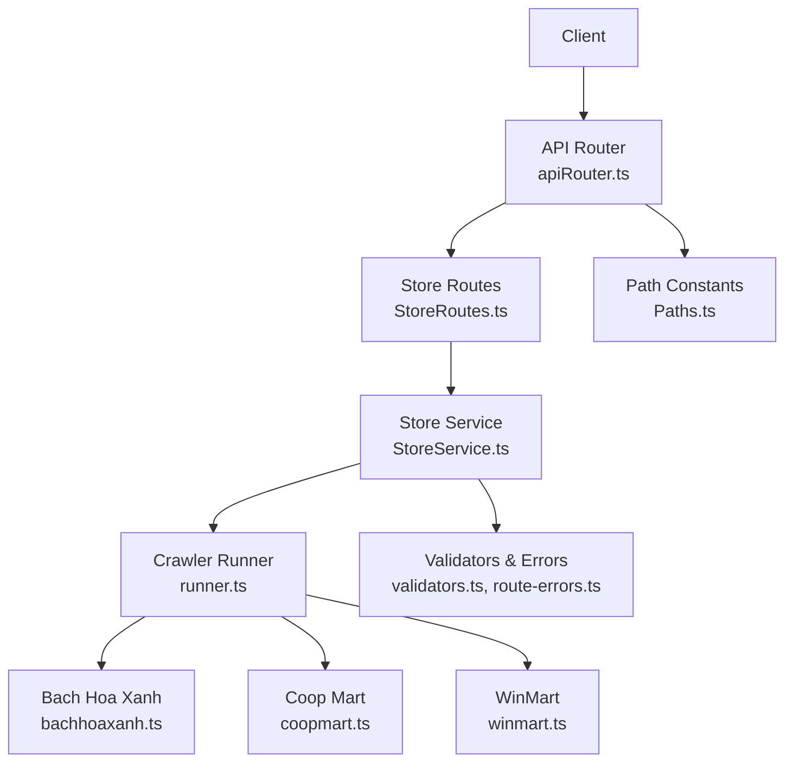
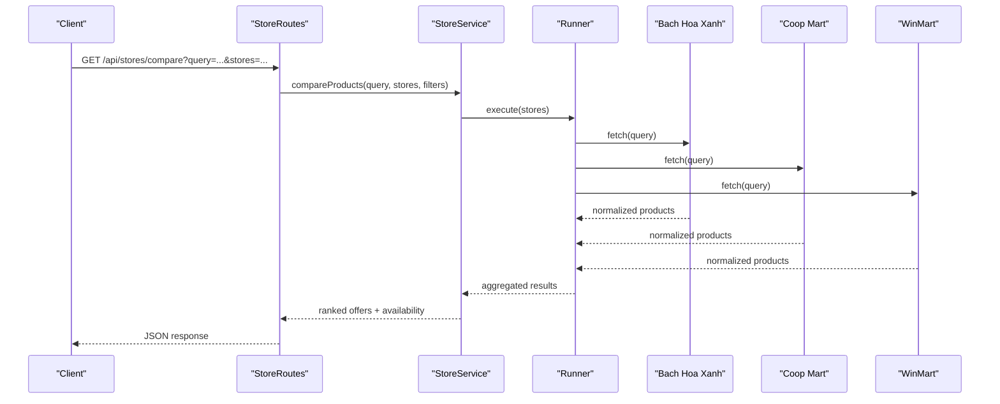
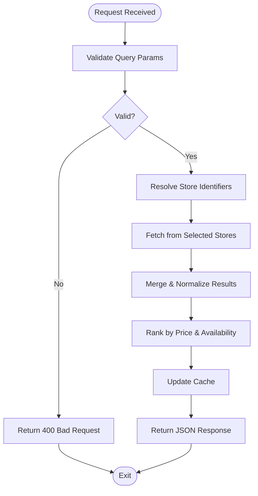
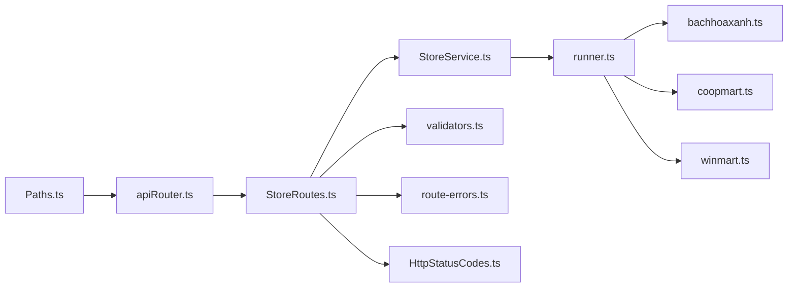

# Store Integration API

<cite>
**Referenced Files in This Document**
- [StoreRoutes.ts](file://Backend/src/routes/StoreRoutes.ts)
- [StoreService.ts](file://Backend/src/services/StoreService.ts)
- [runner.ts](file://Backend/src/crawlers/runner.ts)
- [bachhoaxanh.ts](file://Backend/src/crawlers/bachhoaxanh.ts)
- [coopmart.ts](file://Backend/src/crawlers/coopmart.ts)
- [winmart.ts](file://Backend/src/crawlers/winmart.ts)
- [common.ts](file://Backend/src/crawlers/common.ts)
- [apiRouter.ts](file://Backend/src/routes/apiRouter.ts)
- [Paths.ts](file://Backend/src/common/constants/Paths.ts)
- [HttpStatusCodes.ts](file://Backend/src/common/constants/HttpStatusCodes.ts)
- [route-errors.ts](file://Backend/src/common/utils/route-errors.ts)
- [validators.ts](file://Backend/src/common/utils/validators.ts)
</cite>

## Table of Contents
1. [Introduction](#introduction)
2. [Project Structure](#project-structure)
3. [Core Components](#core-components)
4. [Architecture Overview](#architecture-overview)
5. [Detailed Component Analysis](#detailed-component-analysis)
6. [Dependency Analysis](#dependency-analysis)
7. [Performance Considerations](#performance-considerations)
8. [Troubleshooting Guide](#troubleshooting-guide)
9. [Conclusion](#conclusion)
10. [Appendices](#appendices)

## Introduction
This document provides detailed API documentation for StudentBite’s store integration endpoints. It covers HTTP methods, URL patterns under /api/stores/*, request and response schemas, product data structures, store identifiers, pricing information, availability status, and practical examples for multi-store price comparisons, product search with filters, store-specific retrieval, caching strategies, rate limiting considerations, and error handling for failed store connections.

The backend exposes a RESTful interface that aggregates product data from multiple grocery stores via crawlers. The routes are mounted under the API router and delegate business logic to a dedicated store service, which orchestrates crawling, normalization, and response formatting.

## Project Structure
The store integration spans routes, services, and crawlers:
- Routes define HTTP endpoints and parse requests.
- Services implement business logic, including orchestration of crawlers and data aggregation.
- Crawlers fetch and normalize store-specific product data.
- Common utilities provide validation, error mapping, constants, and shared types.

**Diagram sources**
- [apiRouter.ts](file://Backend/src/routes/apiRouter.ts)
- [StoreRoutes.ts](file://Backend/src/routes/StoreRoutes.ts)
- [StoreService.ts](file://Backend/src/services/StoreService.ts)
- [runner.ts](file://Backend/src/crawlers/runner.ts)
- [bachhoaxanh.ts](file://Backend/src/crawlers/bachhoaxanh.ts)
- [coopmart.ts](file://Backend/src/crawlers/coopmart.ts)
- [winmart.ts](file://Backend/src/crawlers/winmart.ts)
- [validators.ts](file://Backend/src/common/utils/validators.ts)
- [route-errors.ts](file://Backend/src/common/utils/route-errors.ts)
- [Paths.ts](file://Backend/src/common/constants/Paths.ts)

**Section sources**
- [StoreRoutes.ts](file://Backend/src/routes/StoreRoutes.ts)
- [StoreService.ts](file://Backend/src/services/StoreService.ts)
- [apiRouter.ts](file://Backend/src/routes/apiRouter.ts)
- [Paths.ts](file://Backend/src/common/constants/Paths.ts)

## Core Components
- Store Routes: Define endpoints under /api/stores/* for price comparison, product search, store availability, deal recommendations, and real-time updates.
- Store Service: Implements core logic for querying stores, aggregating results, applying filters, and returning normalized responses.
- Crawler Runner: Coordinates concurrent or sequential fetching across store crawlers.
- Store Crawlers: Implement per-store scraping and normalization (Bach Hoa Xanh, Coop Mart, WinMart).
- Utilities: Validation helpers, error mapping, and HTTP status codes.

Key responsibilities:
- Request parsing and validation.
- Store identifier resolution and capability checks.
- Aggregation and ranking of offers by price and availability.
- Error handling and partial failure tolerance.

**Section sources**
- [StoreRoutes.ts](file://Backend/src/routes/StoreRoutes.ts)
- [StoreService.ts](file://Backend/src/services/StoreService.ts)
- [runner.ts](file://Backend/src/crawlers/runner.ts)
- [bachhoaxanh.ts](file://Backend/src/crawlers/bachhoaxanh.ts)
- [coopmart.ts](file://Backend/src/crawlers/coopmart.ts)
- [winmart.ts](file://Backend/src/crawlers/winmart.ts)
- [validators.ts](file://Backend/src/common/utils/validators.ts)
- [route-errors.ts](file://Backend/src/common/utils/route-errors.ts)
- [HttpStatusCodes.ts](file://Backend/src/common/constants/HttpStatusCodes.ts)

## Architecture Overview
The store integration follows a layered architecture:
- HTTP layer (routes) validates inputs and delegates to the service.
- Service layer orchestrates crawler execution, merges results, and applies business rules.
- Crawlers interact with external store sites and return normalized product records.

**Diagram sources**
- [StoreRoutes.ts](file://Backend/src/routes/StoreRoutes.ts)
- [StoreService.ts](file://Backend/src/services/StoreService.ts)
- [runner.ts](file://Backend/src/crawlers/runner.ts)
- [bachhoaxanh.ts](file://Backend/src/crawlers/bachhoaxanh.ts)
- [coopmart.ts](file://Backend/src/crawlers/coopmart.ts)
- [winmart.ts](file://Backend/src/crawlers/winmart.ts)

## Detailed Component Analysis

### API Endpoints: Price Comparison
- Method: GET
- URL: /api/stores/compare
- Query parameters:
  - query: string (product name or keywords)
  - stores: array of store identifiers (e.g., bachhoaxanh, coopmart, winmart)
  - filters: optional object (category, brand, minPrice, maxPrice, unitType)
- Response schema:
  - data: array of offer objects
    - productId: string
    - productName: string
    - storeId: string
    - storeName: string
    - price: number
    - currency: string
    - unit: string
    - availability: boolean
    - lastUpdated: timestamp
  - meta:
    - totalResults: number
    - storesQueried: array of strings
    - cacheStatus: string (hit|miss)
- Example usage:
  - Compare prices for “organic rice” across Bach Hoa Xanh and WinMart with a max price filter.

**Section sources**
- [StoreRoutes.ts](file://Backend/src/routes/StoreRoutes.ts)
- [StoreService.ts](file://Backend/src/services/StoreService.ts)
- [validators.ts](file://Backend/src/common/utils/validators.ts)

### API Endpoints: Product Search
- Method: GET
- URL: /api/stores/search
- Query parameters:
  - q: string (search term)
  - store: optional store identifier
  - category: optional string
  - brand: optional string
  - minPrice: optional number
  - maxPrice: optional number
  - unitType: optional string
  - limit: optional number
  - offset: optional number
- Response schema:
  - data: array of product objects
    - productId: string
    - productName: string
    - storeId: string
    - storeName: string
    - price: number
    - currency: string
    - unit: string
    - availability: boolean
    - imageUrl: string (optional)
    - lastUpdated: timestamp
  - pagination:
    - limit: number
    - offset: number
    - totalCount: number
- Example usage:
  - Search for “coconut milk” in Coop Mart within a price range.

**Section sources**
- [StoreRoutes.ts](file://Backend/src/routes/StoreRoutes.ts)
- [StoreService.ts](file://Backend/src/services/StoreService.ts)
- [validators.ts](file://Backend/src/common/utils/validators.ts)

### API Endpoints: Store Availability Check
- Method: GET
- URL: /api/stores/availability
- Query parameters:
  - productId: string
  - store: optional store identifier
- Response schema:
  - data: array of availability entries
    - productId: string
    - storeId: string
    - storeName: string
    - available: boolean
    - stockLevel: string (inStock|lowStock|outOfStock)
    - lastChecked: timestamp
- Example usage:
  - Check if a specific product is available at Bach Hoa Xanh.

**Section sources**
- [StoreRoutes.ts](file://Backend/src/routes/StoreRoutes.ts)
- [StoreService.ts](file://Backend/src/services/StoreService.ts)
- [validators.ts](file://Backend/src/common/utils/validators.ts)

### API Endpoints: Deal Recommendations
- Method: GET
- URL: /api/stores/deals
- Query parameters:
  - category: optional string
  - store: optional store identifier
  - minDiscount: optional number
  - limit: optional number
- Response schema:
  - data: array of deal objects
    - productId: string
    - productName: string
    - storeId: string
    - storeName: string
    - originalPrice: number
    - discountedPrice: number
    - discountPercent: number
    - availability: boolean
    - validUntil: timestamp
- Example usage:
  - Retrieve top deals in the dairy category from WinMart with at least 10% discount.

**Section sources**
- [StoreRoutes.ts](file://Backend/src/routes/StoreRoutes.ts)
- [StoreService.ts](file://Backend/src/services/StoreService.ts)
- [validators.ts](file://Backend/src/common/utils/validators.ts)

### API Endpoints: Real-Time Price Updates
- Method: POST
- URL: /api/stores/prices/update
- Request body:
  - productId: string
  - storeId: string
  - price: number
  - currency: string
  - unit: string
  - availability: boolean
- Response schema:
  - success: boolean
  - message: string
  - updatedAt: timestamp
- Example usage:
  - Push a new price for a product at Coop Mart after a promotion update.

**Section sources**
- [StoreRoutes.ts](file://Backend/src/routes/StoreRoutes.ts)
- [StoreService.ts](file://Backend/src/services/StoreService.ts)
- [validators.ts](file://Backend/src/common/utils/validators.ts)

### Data Models
Product Offer:
- Fields: productId, productName, storeId, storeName, price, currency, unit, availability, lastUpdated
- Complexity: O(1) access per field; sorting by price is O(n log n) over results.

Availability Entry:
- Fields: productId, storeId, storeName, available, stockLevel, lastChecked

Deal Object:
- Fields: productId, productName, storeId, storeName, originalPrice, discountedPrice, discountPercent, availability, validUntil

**Section sources**
- [StoreService.ts](file://Backend/src/services/StoreService.ts)
- [common.ts](file://Backend/src/crawlers/common.ts)

### Crawler Orchestration Flow

**Diagram sources**
- [StoreRoutes.ts](file://Backend/src/routes/StoreRoutes.ts)
- [StoreService.ts](file://Backend/src/services/StoreService.ts)
- [runner.ts](file://Backend/src/crawlers/runner.ts)
- [validators.ts](file://Backend/src/common/utils/validators.ts)

**Section sources**
- [runner.ts](file://Backend/src/crawlers/runner.ts)
- [StoreService.ts](file://Backend/src/services/StoreService.ts)

## Dependency Analysis
- Routes depend on validators and path constants.
- Service depends on runner and common crawler utilities.
- Runner coordinates store-specific crawlers.
- Error mapping uses route-error utilities and HTTP status codes.

**Diagram sources**
- [Paths.ts](file://Backend/src/common/constants/Paths.ts)
- [apiRouter.ts](file://Backend/src/routes/apiRouter.ts)
- [StoreRoutes.ts](file://Backend/src/routes/StoreRoutes.ts)
- [StoreService.ts](file://Backend/src/services/StoreService.ts)
- [runner.ts](file://Backend/src/crawlers/runner.ts)
- [bachhoaxanh.ts](file://Backend/src/crawlers/bachhoaxanh.ts)
- [coopmart.ts](file://Backend/src/crawlers/coopmart.ts)
- [winmart.ts](file://Backend/src/crawlers/winmart.ts)
- [validators.ts](file://Backend/src/common/utils/validators.ts)
- [route-errors.ts](file://Backend/src/common/utils/route-errors.ts)
- [HttpStatusCodes.ts](file://Backend/src/common/constants/HttpStatusCodes.ts)

**Section sources**
- [StoreRoutes.ts](file://Backend/src/routes/StoreRoutes.ts)
- [StoreService.ts](file://Backend/src/services/StoreService.ts)
- [runner.ts](file://Backend/src/crawlers/runner.ts)
- [validators.ts](file://Backend/src/common/utils/validators.ts)
- [route-errors.ts](file://Backend/src/common/utils/route-errors.ts)
- [HttpStatusCodes.ts](file://Backend/src/common/constants/HttpStatusCodes.ts)

## Performance Considerations
- Concurrency: Use parallel fetching across stores where possible to reduce latency.
- Caching: Implement short-lived caches keyed by query+filters+stores to avoid repeated crawling.
- Pagination: Enforce reasonable limits and offsets to prevent large payloads.
- Rate Limiting: Apply per-client throttling to protect external store endpoints.
- Partial Failures: Return best-effort results when some crawlers fail, marking unavailable stores.

[No sources needed since this section provides general guidance]

## Troubleshooting Guide
Common errors and handling:
- Invalid input: Return 400 with validation messages.
- Store not found: Return 404 with store identifier details.
- External crawl failures: Return 502/503 with retry hints and partial data when available.
- Rate limited: Return 429 with retry-after header.
- Internal server errors: Return 500 with sanitized error messages.

Use route-error utilities and HTTP status codes to standardize responses.

**Section sources**
- [route-errors.ts](file://Backend/src/common/utils/route-errors.ts)
- [HttpStatusCodes.ts](file://Backend/src/common/constants/HttpStatusCodes.ts)

## Conclusion
StudentBite’s store integration API provides a robust set of endpoints for price comparison, product search, availability checking, deal recommendations, and real-time price updates. By leveraging crawlers through a centralized service and enforcing validation and error handling, the system delivers consistent, normalized data across multiple stores while supporting performance optimizations like caching and concurrency.

[No sources needed since this section summarizes without analyzing specific files]

## Appendices

### Practical Examples

- Multi-store price comparison:
  - GET /api/stores/compare?query=organic+rice&stores=bachhoaxanh,winmart&filters[minPrice]=10&filters[maxPrice]=30
  - Expect ranked offers sorted by price with availability flags.

- Product search with filters:
  - GET /api/stores/search?q=coconut+milk&store=coopmart&minPrice=5&maxPrice=15&limit=10
  - Expect paginated results filtered by store and price range.

- Store-specific data retrieval:
  - GET /api/stores/availability?productId=SKU123&store=bachhoaxanh
  - Expect availability entry with stock level and last checked timestamp.

- Real-time price update:
  - POST /api/stores/prices/update with productId, storeId, price, currency, unit, availability
  - Expect success confirmation and updated timestamp.

[No sources needed since this section provides conceptual examples]