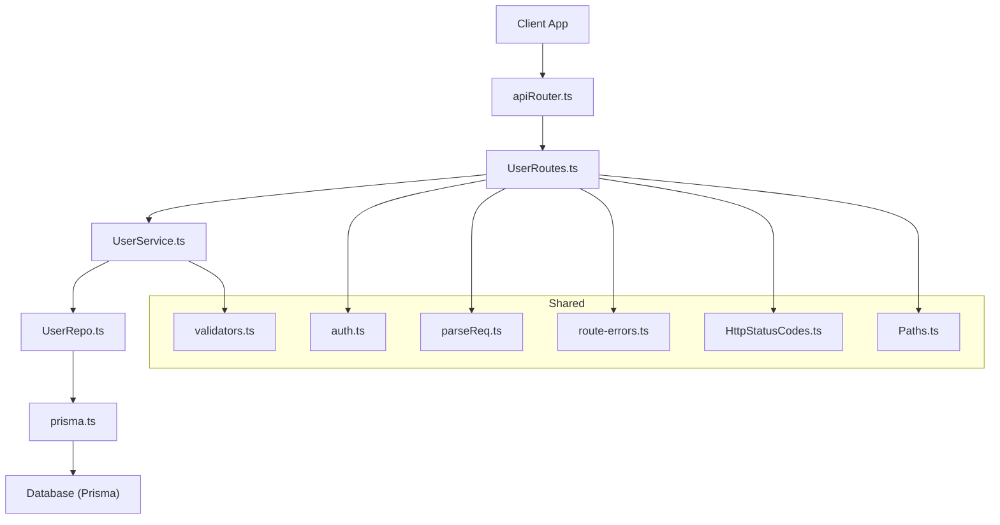
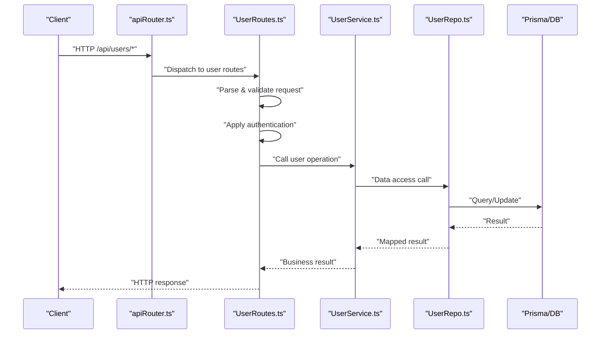
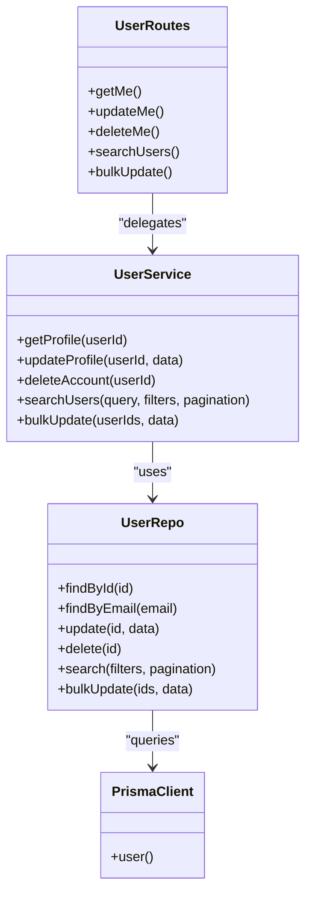
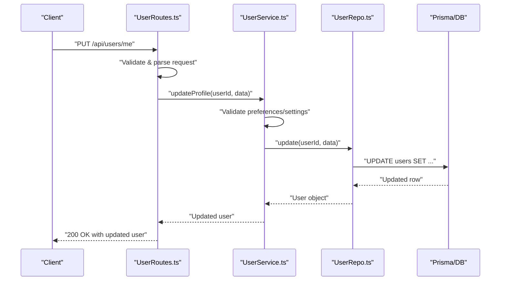
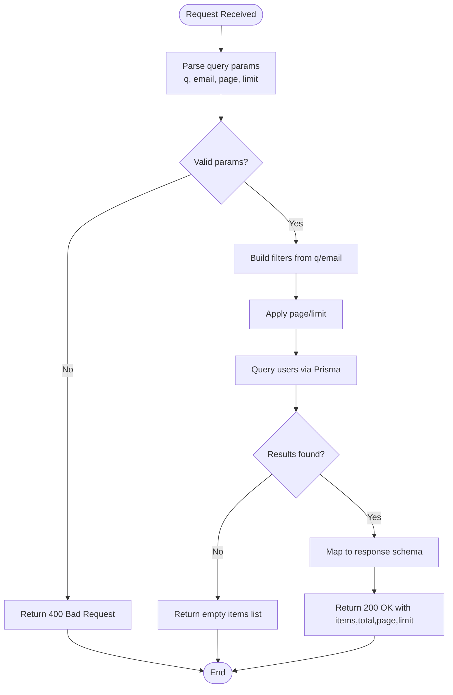

# User Management API

<cite>
**Referenced Files in This Document**
- [UserRoutes.ts](file://Backend/src/routes/UserRoutes.ts)
- [UserService.ts](file://Backend/src/services/UserService.ts)
- [User.model.ts](file://Backend/src/models/User.model.ts)
- [UserRepo.ts](file://Backend/src/repos/UserRepo.ts)
- [prisma.ts](file://Backend/src/repos/prisma.ts)
- [schema.prisma](file://Backend/prisma/schema.prisma)
- [auth.ts](file://Backend/src/routes/common/auth.ts)
- [parseReq.ts](file://Backend/src/routes/common/parseReq.ts)
- [route-errors.ts](file://Backend/src/common/utils/route-errors.ts)
- [validators.ts](file://Backend/src/common/utils/validators.ts)
- [HttpStatusCodes.ts](file://Backend/src/common/constants/HttpStatusCodes.ts)
- [Paths.ts](file://Backend/src/common/constants/Paths.ts)
- [apiRouter.ts](file://Backend/src/routes/apiRouter.ts)
- [main.ts](file://Backend/src/main.ts)
- [server.ts](file://Backend/src/server.ts)
</cite>

## Table of Contents
1. [Introduction](#introduction)
2. [Project Structure](#project-structure)
3. [Core Components](#core-components)
4. [Architecture Overview](#architecture-overview)
5. [Detailed Component Analysis](#detailed-component-analysis)
6. [Dependency Analysis](#dependency-analysis)
7. [Performance Considerations](#performance-considerations)
8. [Troubleshooting Guide](#troubleshooting-guide)
9. [Conclusion](#conclusion)
10. [Appendices](#appendices)

## Introduction
This document provides comprehensive API documentation for StudentBite’s user management endpoints. It covers HTTP methods, URL patterns under /api/users/*, request/response schemas, validation rules, authentication requirements, error codes, and practical examples for CRUD operations, bulk updates, search/filtering, pagination, and frontend integration patterns. The backend is a Node.js service using Prisma for data access, with route handlers delegating to services and repositories.

## Project Structure
The user management feature spans routes, services, repositories, models, and shared utilities:
- Routes define HTTP endpoints and parse requests.
- Services encapsulate business logic for user operations.
- Repositories implement data access via Prisma.
- Models and schema define the User entity and relationships.
- Shared utilities provide validation, error handling, and constants.

**Diagram sources**
- [apiRouter.ts](file://Backend/src/routes/apiRouter.ts)
- [UserRoutes.ts](file://Backend/src/routes/UserRoutes.ts)
- [UserService.ts](file://Backend/src/services/UserService.ts)
- [UserRepo.ts](file://Backend/src/repos/UserRepo.ts)
- [prisma.ts](file://Backend/src/repos/prisma.ts)
- [auth.ts](file://Backend/src/routes/common/auth.ts)
- [parseReq.ts](file://Backend/src/routes/common/parseReq.ts)
- [validators.ts](file://Backend/src/common/utils/validators.ts)
- [route-errors.ts](file://Backend/src/common/utils/route-errors.ts)
- [HttpStatusCodes.ts](file://Backend/src/common/constants/HttpStatusCodes.ts)
- [Paths.ts](file://Backend/src/common/constants/Paths.ts)

**Section sources**
- [apiRouter.ts](file://Backend/src/routes/apiRouter.ts)
- [UserRoutes.ts](file://Backend/src/routes/UserRoutes.ts)
- [UserService.ts](file://Backend/src/services/UserService.ts)
- [UserRepo.ts](file://Backend/src/repos/UserRepo.ts)
- [prisma.ts](file://Backend/src/repos/prisma.ts)
- [schema.prisma](file://Backend/prisma/schema.prisma)
- [auth.ts](file://Backend/src/routes/common/auth.ts)
- [parseReq.ts](file://Backend/src/routes/common/parseReq.ts)
- [validators.ts](file://Backend/src/common/utils/validators.ts)
- [route-errors.ts](file://Backend/src/common/utils/route-errors.ts)
- [HttpStatusCodes.ts](file://Backend/src/common/constants/HttpStatusCodes.ts)
- [Paths.ts](file://Backend/src/common/constants/Paths.ts)

## Core Components
- UserRoutes: Defines HTTP endpoints under /api/users/*, parses inputs, enforces auth, and delegates to UserService.
- UserService: Implements user business logic including profile retrieval, updates, settings/preferences, and queries.
- UserRepo: Data access layer over Prisma for user entities.
- User model and Prisma schema: Define fields, constraints, and relations for users.
- Shared utilities: Validation helpers, error formatting, status codes, and path constants.

Key responsibilities:
- Authentication middleware ensures requests are authorized before reaching user endpoints.
- Request parsing validates query parameters and payloads.
- Service layer orchestrates operations and returns structured responses.
- Repository abstracts database interactions.

**Section sources**
- [UserRoutes.ts](file://Backend/src/routes/UserRoutes.ts)
- [UserService.ts](file://Backend/src/services/UserService.ts)
- [UserRepo.ts](file://Backend/src/repos/UserRepo.ts)
- [User.model.ts](file://Backend/src/models/User.model.ts)
- [schema.prisma](file://Backend/prisma/schema.prisma)
- [auth.ts](file://Backend/src/routes/common/auth.ts)
- [parseReq.ts](file://Backend/src/routes/common/parseReq.ts)
- [validators.ts](file://Backend/src/common/utils/validators.ts)
- [route-errors.ts](file://Backend/src/common/utils/route-errors.ts)
- [HttpStatusCodes.ts](file://Backend/src/common/constants/HttpStatusCodes.ts)
- [Paths.ts](file://Backend/src/common/constants/Paths.ts)

## Architecture Overview
The user management flow follows a layered architecture:
- Client sends HTTP requests to /api/users/*.
- apiRouter mounts UserRoutes.
- UserRoutes validates and parses requests, applies authentication, and calls UserService.
- UserService performs business logic and uses UserRepo for data operations.
- UserRepo interacts with Prisma to read/write to the database.

**Diagram sources**
- [apiRouter.ts](file://Backend/src/routes/apiRouter.ts)
- [UserRoutes.ts](file://Backend/src/routes/UserRoutes.ts)
- [UserService.ts](file://Backend/src/services/UserService.ts)
- [UserRepo.ts](file://Backend/src/repos/UserRepo.ts)
- [prisma.ts](file://Backend/src/repos/prisma.ts)

## Detailed Component Analysis

### Authentication and Authorization
- All user endpoints require authentication. Requests must include valid credentials or tokens as enforced by the auth middleware.
- Unauthorized requests receive appropriate error responses.

Authentication requirements:
- Bearer token or session cookie depending on configuration.
- Token validation occurs before route handlers execute.

Error codes:
- 401 Unauthorized when authentication fails.
- 403 Forbidden if insufficient permissions.

**Section sources**
- [auth.ts](file://Backend/src/routes/common/auth.ts)
- [HttpStatusCodes.ts](file://Backend/src/common/constants/HttpStatusCodes.ts)

### Endpoints: GET /api/users/me
Retrieves the authenticated user’s profile.

- Method: GET
- URL: /api/users/me
- Authentication: Required
- Query params: None
- Response schema:
  - id: string (UUID)
  - email: string (email format)
  - name: string (max length defined by schema)
  - createdAt: datetime
  - updatedAt: datetime
  - preferences: object (see Preferences section)
  - settings: object (see Settings section)
- Validation:
  - Email must be valid format.
  - Name length within allowed bounds.
- Error codes:
  - 401 Unauthorized
  - 404 Not Found if user does not exist
  - 500 Internal Server Error

Example:
- GET /api/users/me
- Response: { id, email, name, createdAt, updatedAt, preferences, settings }

**Section sources**
- [UserRoutes.ts](file://Backend/src/routes/UserRoutes.ts)
- [UserService.ts](file://Backend/src/services/UserService.ts)
- [UserRepo.ts](file://Backend/src/repos/UserRepo.ts)
- [schema.prisma](file://Backend/prisma/schema.prisma)
- [HttpStatusCodes.ts](file://Backend/src/common/constants/HttpStatusCodes.ts)

### Endpoints: PUT /api/users/me
Updates the authenticated user’s profile fields.

- Method: PUT
- URL: /api/users/me
- Authentication: Required
- Request body schema:
  - name?: string (optional; max length per schema)
  - email?: string (optional; email format)
  - preferences?: Partial<Preferences>
  - settings?: Partial<Settings>
- Validation rules:
  - If provided, email must match email format.
  - Name length must be within allowed bounds.
  - Preference keys/values must conform to defined enums and ranges.
  - Settings keys/values must conform to allowed types.
- Response schema: Updated user object (same as GET /api/users/me)
- Error codes:
  - 400 Bad Request for invalid input
  - 401 Unauthorized
  - 404 Not Found
  - 409 Conflict if email already exists for another user
  - 500 Internal Server Error

Example:
- PUT /api/users/me
- Body: { name: "Jane Doe", preferences: { theme: "dark" }, settings: { notifications: true } }
- Response: Updated user object

**Section sources**
- [UserRoutes.ts](file://Backend/src/routes/UserRoutes.ts)
- [UserService.ts](file://Backend/src/services/UserService.ts)
- [validators.ts](file://Backend/src/common/utils/validators.ts)
- [route-errors.ts](file://Backend/src/common/utils/route-errors.ts)
- [HttpStatusCodes.ts](file://Backend/src/common/constants/HttpStatusCodes.ts)

### Endpoints: DELETE /api/users/me
Deletes the authenticated user’s account.

- Method: DELETE
- URL: /api/users/me
- Authentication: Required
- Request body: None
- Response: Success acknowledgment
- Error codes:
  - 401 Unauthorized
  - 404 Not Found
  - 500 Internal Server Error

Example:
- DELETE /api/users/me
- Response: { message: "Account deleted" }

**Section sources**
- [UserRoutes.ts](file://Backend/src/routes/UserRoutes.ts)
- [UserService.ts](file://Backend/src/services/UserService.ts)
- [HttpStatusCodes.ts](file://Backend/src/common/constants/HttpStatusCodes.ts)

### Endpoints: GET /api/users/search
Searches users with filtering and pagination.

- Method: GET
- URL: /api/users/search
- Authentication: Required
- Query parameters:
  - q: string (optional; text search across name/email)
  - email: string (optional; exact email filter)
  - page: number (default 1; min 1)
  - limit: number (default 10; max 100)
- Response schema:
  - items: array of user objects (subset fields)
  - total: number
  - page: number
  - limit: number
- Validation rules:
  - page >= 1
  - limit between 1 and 100
  - q and email formats validated
- Error codes:
  - 400 Bad Request for invalid parameters
  - 401 Unauthorized
  - 500 Internal Server Error

Example:
- GET /api/users/search?q=jane&email=jane@example.com&page=1&limit=10
- Response: { items: [...], total: 1, page: 1, limit: 10 }

**Section sources**
- [UserRoutes.ts](file://Backend/src/routes/UserRoutes.ts)
- [UserService.ts](file://Backend/src/services/UserService.ts)
- [parseReq.ts](file://Backend/src/routes/common/parseReq.ts)
- [validators.ts](file://Backend/src/common/utils/validators.ts)
- [HttpStatusCodes.ts](file://Backend/src/common/constants/HttpStatusCodes.ts)

### Endpoints: PUT /api/users/bulk
Bulk update user preferences/settings.

- Method: PUT
- URL: /api/users/bulk
- Authentication: Required
- Request body schema:
  - userIds: array<string> (non-empty; unique UUIDs)
  - preferences?: Partial<Preferences>
  - settings?: Partial<Settings>
- Validation rules:
  - userIds must be non-empty and contain valid UUIDs
  - preferences/settings must conform to allowed structures
- Response schema:
  - updatedCount: number
  - failedIds: array<string>
- Error codes:
  - 400 Bad Request for invalid payload
  - 401 Unauthorized
  - 500 Internal Server Error

Example:
- PUT /api/users/bulk
- Body: { userIds: ["uuid1", "uuid2"], preferences: { theme: "light" } }
- Response: { updatedCount: 2, failedIds: [] }

**Section sources**
- [UserRoutes.ts](file://Backend/src/routes/UserRoutes.ts)
- [UserService.ts](file://Backend/src/services/UserService.ts)
- [validators.ts](file://Backend/src/common/utils/validators.ts)
- [route-errors.ts](file://Backend/src/common/utils/route-errors.ts)
- [HttpStatusCodes.ts](file://Backend/src/common/constants/HttpStatusCodes.ts)

### Preferences and Settings Schema
- Preferences:
  - theme: enum ("light" | "dark")
  - language: string (ISO code)
  - dietaryRestrictions: array<string>
- Settings:
  - notifications: boolean
  - privacyLevel: enum ("public" | "private")
  - units: enum ("metric" | "imperial")
- Validation:
  - Enum values strictly enforced
  - Arrays must contain strings
  - Boolean fields must be true/false

**Section sources**
- [schema.prisma](file://Backend/prisma/schema.prisma)
- [validators.ts](file://Backend/src/common/utils/validators.ts)

### Data Model: User
- Fields:
  - id: string (UUID PK)
  - email: string (unique)
  - name: string
  - createdAt: datetime
  - updatedAt: datetime
  - preferences: JSON
  - settings: JSON
- Constraints:
  - Unique email
  - Non-null name
  - Valid JSON for preferences/settings

**Section sources**
- [User.model.ts](file://Backend/src/models/User.model.ts)
- [schema.prisma](file://Backend/prisma/schema.prisma)

### Class Diagram: User Management Components

**Diagram sources**
- [UserRoutes.ts](file://Backend/src/routes/UserRoutes.ts)
- [UserService.ts](file://Backend/src/services/UserService.ts)
- [UserRepo.ts](file://Backend/src/repos/UserRepo.ts)
- [prisma.ts](file://Backend/src/repos/prisma.ts)

### Sequence Diagram: Update Profile Flow

**Diagram sources**
- [UserRoutes.ts](file://Backend/src/routes/UserRoutes.ts)
- [UserService.ts](file://Backend/src/services/UserService.ts)
- [UserRepo.ts](file://Backend/src/repos/UserRepo.ts)
- [prisma.ts](file://Backend/src/repos/prisma.ts)

### Flowchart: Search and Pagination Logic

**Diagram sources**
- [UserRoutes.ts](file://Backend/src/routes/UserRoutes.ts)
- [UserService.ts](file://Backend/src/services/UserService.ts)
- [parseReq.ts](file://Backend/src/routes/common/parseReq.ts)
- [validators.ts](file://Backend/src/common/utils/validators.ts)

## Dependency Analysis
- UserRoutes depends on:
  - AuthService for authentication
  - ParseReq for request parsing
  - Validators for input validation
  - Route errors for consistent error responses
  - HttpStatusCodes for status mapping
  - Paths for endpoint definitions
- UserService depends on:
  - Validators for business rule enforcement
  - UserRepo for data operations
- UserRepo depends on:
  - Prisma client for database access

Potential circular dependencies:
- None detected between routes, services, and repos.

External dependencies:
- Prisma ORM for database interactions.
- Express for routing and middleware.

**Section sources**
- [UserRoutes.ts](file://Backend/src/routes/UserRoutes.ts)
- [UserService.ts](file://Backend/src/services/UserService.ts)
- [UserRepo.ts](file://Backend/src/repos/UserRepo.ts)
- [auth.ts](file://Backend/src/routes/common/auth.ts)
- [parseReq.ts](file://Backend/src/routes/common/parseReq.ts)
- [validators.ts](file://Backend/src/common/utils/validators.ts)
- [route-errors.ts](file://Backend/src/common/utils/route-errors.ts)
- [HttpStatusCodes.ts](file://Backend/src/common/constants/HttpStatusCodes.ts)
- [Paths.ts](file://Backend/src/common/constants/Paths.ts)
- [prisma.ts](file://Backend/src/repos/prisma.ts)

## Performance Considerations
- Use pagination to limit result sets for search endpoints.
- Avoid fetching full user objects when only subset fields are needed.
- Cache frequently accessed user profiles where appropriate.
- Optimize database queries with indexes on email and search fields.
- Batch updates via bulk endpoints to reduce round trips.

[No sources needed since this section provides general guidance]

## Troubleshooting Guide
Common errors and resolutions:
- 401 Unauthorized: Ensure valid authentication token or session.
- 400 Bad Request: Check input validation rules for required fields and formats.
- 404 Not Found: Verify user ID or email exists.
- 409 Conflict: Email uniqueness constraint violated; choose a different email.
- 500 Internal Server Error: Check server logs and database connectivity.

Debugging tips:
- Enable detailed logging in development.
- Validate request payloads against schemas.
- Inspect Prisma query logs for slow or failing queries.

**Section sources**
- [route-errors.ts](file://Backend/src/common/utils/route-errors.ts)
- [HttpStatusCodes.ts](file://Backend/src/common/constants/HttpStatusCodes.ts)
- [validators.ts](file://Backend/src/common/utils/validators.ts)

## Conclusion
StudentBite’s user management API provides robust endpoints for profile retrieval, updates, deletion, search, and bulk operations. With clear validation, authentication, and error handling, it supports efficient frontend integration and scalable user data management.

[No sources needed since this section summarizes without analyzing specific files]

## Appendices

### Frontend Integration Patterns
- Fetch user profile on app load using GET /api/users/me.
- Update profile on form submission via PUT /api/users/me.
- Implement search UI with debounced queries to GET /api/users/search.
- Handle pagination with page/limit parameters.
- Use bulk update for batch preference changes.

### Example Requests and Responses
- GET /api/users/me -> 200 OK with user object.
- PUT /api/users/me -> 200 OK with updated user.
- DELETE /api/users/me -> 204 No Content.
- GET /api/users/search?q=jane&page=1&limit=10 -> 200 OK with paginated results.
- PUT /api/users/bulk -> 200 OK with updatedCount and failedIds.

[No sources needed since this section provides general guidance]