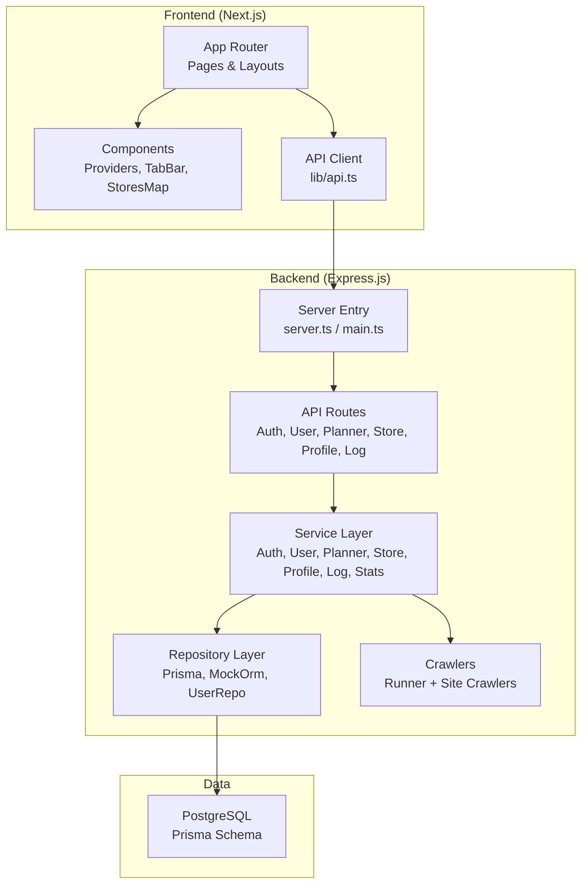
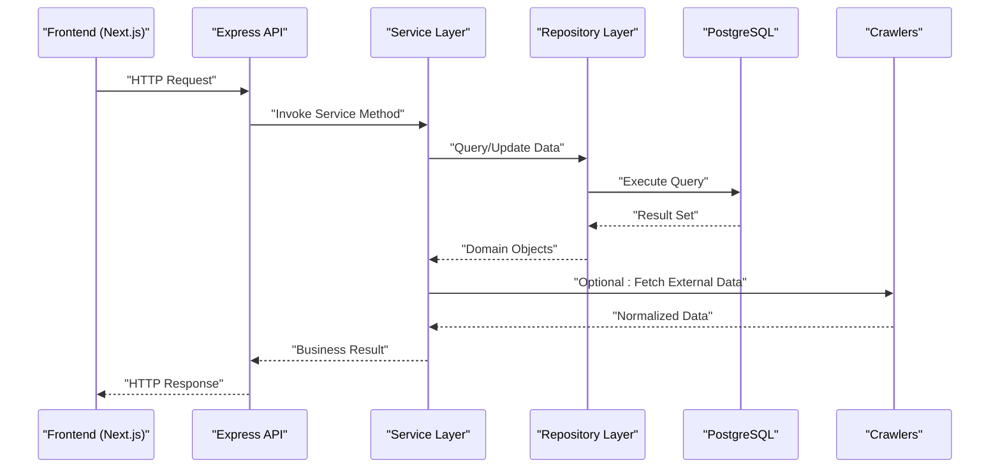
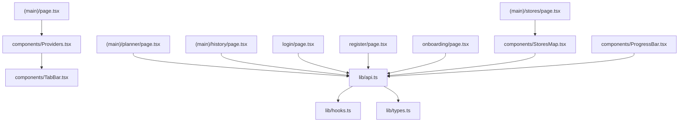
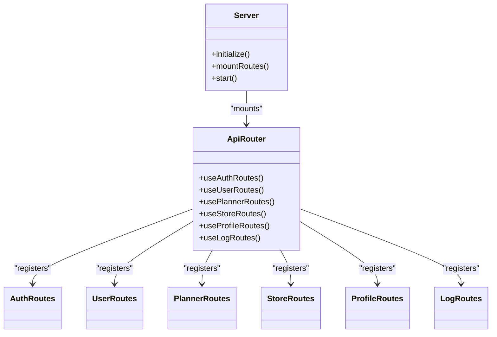
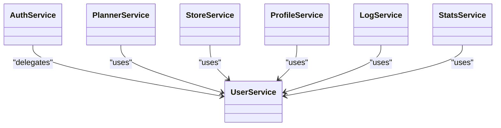
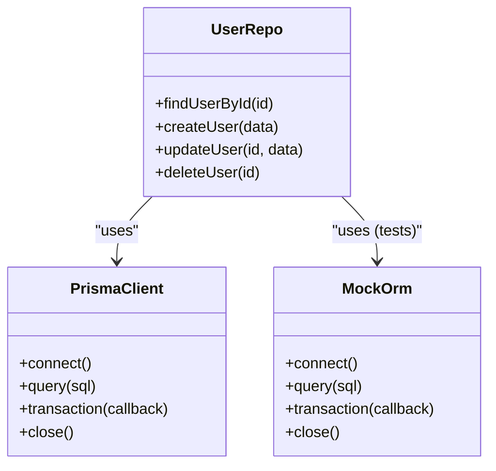
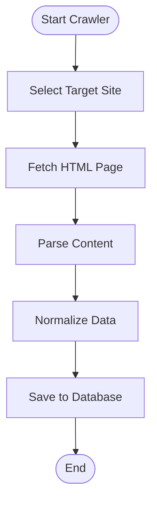
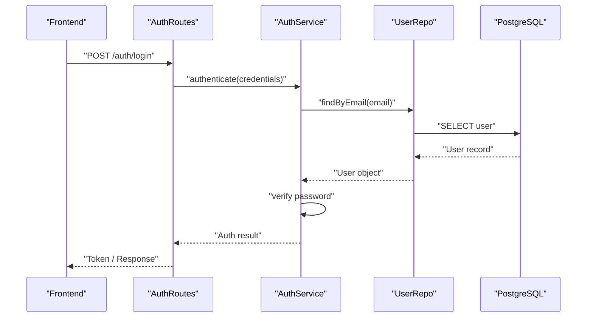
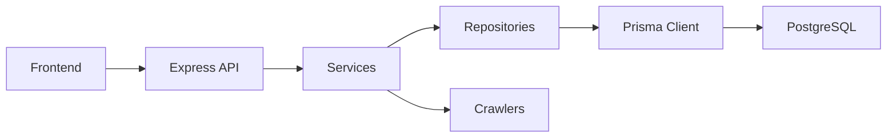

# Architecture Overview

<cite>
**Referenced Files in This Document**
- [main.ts](file://Backend/src/main.ts)
- [server.ts](file://Backend/src/server.ts)
- [apiRouter.ts](file://Backend/src/routes/apiRouter.ts)
- [AuthRoutes.ts](file://Backend/src/routes/AuthRoutes.ts)
- [UserRoutes.ts](file://Backend/src/routes/UserRoutes.ts)
- [PlannerRoutes.ts](file://Backend/src/routes/PlannerRoutes.ts)
- [StoreRoutes.ts](file://Backend/src/routes/StoreRoutes.ts)
- [ProfileRoutes.ts](file://Backend/src/routes/ProfileRoutes.ts)
- [LogRoutes.ts](file://Backend/src/routes/LogRoutes.ts)
- [AuthService.ts](file://Backend/src/services/AuthService.ts)
- [UserService.ts](file://Backend/src/services/UserService.ts)
- [PlannerService.ts](file://Backend/src/services/PlannerService.ts)
- [StoreService.ts](file://Backend/src/services/StoreService.ts)
- [ProfileService.ts](file://Backend/src/services/ProfileService.ts)
- [LogService.ts](file://Backend/src/services/LogService.ts)
- [StatsService.ts](file://Backend/src/services/StatsService.ts)
- [prisma.ts](file://Backend/src/repos/prisma.ts)
- [MockOrm.ts](file://Backend/src/repos/MockOrm.ts)
- [UserRepo.ts](file://Backend/src/repos/UserRepo.ts)
- [schema.prisma](file://Backend/prisma/schema.prisma)
- [runner.ts](file://Backend/src/crawlers/runner.ts)
- [bachhoaxanh.ts](file://Backend/src/crawlers/bachhoaxanh.ts)
- [coopmart.ts](file://Backend/src/crawlers/coopmart.ts)
- [winmart.ts](file://Backend/src/crawlers/winmart.ts)
- [common.ts](file://Backend/src/crawlers/common.ts)
- [layout.tsx](file://Frontend/studentbite/app/layout.tsx)
- [page.tsx](file://Frontend/studentbite/app/(main)/page.tsx)
- [planner/page.tsx](file://Frontend/studentbite/app/(main)/planner/page.tsx)
- [stores/page.tsx](file://Frontend/studentbite/app/(main)/stores/page.tsx)
- [history/page.tsx](file://Frontend/studentbite/app/(main)/history/page.tsx)
- [login/page.tsx](file://Frontend/studentbite/app/login/page.tsx)
- [register/page.tsx](file://Frontend/studentbite/app/register/page.tsx)
- [onboarding/page.tsx](file://Frontend/studentbite/app/onboarding/page.tsx)
- [Providers.tsx](file://Frontend/studentbite/components/Providers.tsx)
- [TabBar.tsx](file://Frontend/studentbite/components/TabBar.tsx)
- [StoresMap.tsx](file://Frontend/studentbite/components/StoresMap.tsx)
- [ProgressBar.tsx](file://Frontend/studentbite/components/ProgressBar.tsx)
- [api.ts](file://Frontend/studentbite/lib/api.ts)
- [hooks.ts](file://Frontend/studentbite/lib/hooks.ts)
- [types.ts](file://Frontend/studentbite/lib/types.ts)
</cite>

## Table of Contents
1. Introduction
2. Project Structure
3. Core Components
4. Architecture Overview
5. Detailed Component Analysis
6. Dependency Analysis
7. Performance Considerations
8. Troubleshooting Guide
9. Conclusion

## Introduction
This document presents the architecture of StudentBite, a full-stack application combining a Next.js frontend with an Express.js backend, PostgreSQL via Prisma ORM, and a web scraping subsystem for store data. It explains how layers communicate, the separation of concerns across routes, services, repositories, and database access, and highlights architectural patterns such as Repository Pattern and Service Layer Pattern. It also outlines technology stack decisions and provides diagrams to visualize system context and data flow.

## Project Structure
StudentBite is organized into two primary directories:
- Backend (Express.js + TypeScript): API routes, service layer, repository layer, crawlers, and Prisma configuration.
- Frontend (Next.js + TypeScript): App Router pages, shared components, and API client utilities.

Key responsibilities:
- Frontend: UI composition, routing, state management hooks, and HTTP calls to the backend API.
- Backend: HTTP endpoints, business logic in services, data access via repositories, and external integrations (crawlers).
- Database: PostgreSQL schema managed by Prisma migrations and seed scripts.

**Diagram sources**
- [server.ts](file://Backend/src/server.ts)
- [main.ts](file://Backend/src/main.ts)
- [apiRouter.ts](file://Backend/src/routes/apiRouter.ts)
- [AuthRoutes.ts](file://Backend/src/routes/AuthRoutes.ts)
- [UserRoutes.ts](file://Backend/src/routes/UserRoutes.ts)
- [PlannerRoutes.ts](file://Backend/src/routes/PlannerRoutes.ts)
- [StoreRoutes.ts](file://Backend/src/routes/StoreRoutes.ts)
- [ProfileRoutes.ts](file://Backend/src/routes/ProfileRoutes.ts)
- [LogRoutes.ts](file://Backend/src/routes/LogRoutes.ts)
- [AuthService.ts](file://Backend/src/services/AuthService.ts)
- [UserService.ts](file://Backend/src/services/UserService.ts)
- [PlannerService.ts](file://Backend/src/services/PlannerService.ts)
- [StoreService.ts](file://Backend/src/services/StoreService.ts)
- [ProfileService.ts](file://Backend/src/services/ProfileService.ts)
- [LogService.ts](file://Backend/src/services/LogService.ts)
- [StatsService.ts](file://Backend/src/services/StatsService.ts)
- [prisma.ts](file://Backend/src/repos/prisma.ts)
- [MockOrm.ts](file://Backend/src/repos/MockOrm.ts)
- [UserRepo.ts](file://Backend/src/repos/UserRepo.ts)
- [schema.prisma](file://Backend/prisma/schema.prisma)
- [runner.ts](file://Backend/src/crawlers/runner.ts)
- [bachhoaxanh.ts](file://Backend/src/crawlers/bachhoaxanh.ts)
- [coopmart.ts](file://Backend/src/crawlers/coopmart.ts)
- [winmart.ts](file://Backend/src/crawlers/winmart.ts)
- [common.ts](file://Backend/src/crawlers/common.ts)
- [layout.tsx](file://Frontend/studentbite/app/layout.tsx)
- [page.tsx](file://Frontend/studentbite/app/(main)/page.tsx)
- [planner/page.tsx](file://Frontend/studentbite/app/(main)/planner/page.tsx)
- [stores/page.tsx](file://Frontend/studentbite/app/(main)/stores/page.tsx)
- [history/page.tsx](file://Frontend/studentbite/app/(main)/history/page.tsx)
- [login/page.tsx](file://Frontend/studentbite/app/login/page.tsx)
- [register/page.tsx](file://Frontend/studentbite/app/register/page.tsx)
- [onboarding/page.tsx](file://Frontend/studentbite/app/onboarding/page.tsx)
- [Providers.tsx](file://Frontend/studentbite/components/Providers.tsx)
- [TabBar.tsx](file://Frontend/studentbite/components/TabBar.tsx)
- [StoresMap.tsx](file://Frontend/studentbite/components/StoresMap.tsx)
- [ProgressBar.tsx](file://Frontend/studentbite/components/ProgressBar.tsx)
- [api.ts](file://Frontend/studentbite/lib/api.ts)
- [hooks.ts](file://Frontend/studentbite/lib/hooks.ts)
- [types.ts](file://Frontend/studentbite/lib/types.ts)

**Section sources**
- [server.ts](file://Backend/src/server.ts)
- [main.ts](file://Backend/src/main.ts)
- [apiRouter.ts](file://Backend/src/routes/apiRouter.ts)
- [layout.tsx](file://Frontend/studentbite/app/layout.tsx)
- [page.tsx](file://Frontend/studentbite/app/(main)/page.tsx)

## Core Components
- Frontend Pages and Layouts: Organized under Next.js App Router; each route maps to a page component that composes reusable UI components and invokes API functions.
- API Client: Centralized HTTP client for calling backend endpoints, handling base URLs, headers, and error normalization.
- Backend Server: Express server initialization, middleware setup, and route registration.
- API Routes: Feature-scoped routers for authentication, users, planner, stores, profile, and logging.
- Services: Business logic encapsulation per feature, orchestrating repositories and external integrations.
- Repositories: Data access abstraction over Prisma or mock implementations for testing.
- Crawlers: Web scraping modules orchestrated by a runner to fetch store/product data from external sites.
- Database: PostgreSQL accessed through Prisma, with schema definitions and migrations.

**Section sources**
- [api.ts](file://Frontend/studentbite/lib/api.ts)
- [hooks.ts](file://Frontend/studentbite/lib/hooks.ts)
- [types.ts](file://Frontend/studentbite/lib/types.ts)
- [server.ts](file://Backend/src/server.ts)
- [apiRouter.ts](file://Backend/src/routes/apiRouter.ts)
- [AuthService.ts](file://Backend/src/services/AuthService.ts)
- [UserService.ts](file://Backend/src/services/UserService.ts)
- [PlannerService.ts](file://Backend/src/services/PlannerService.ts)
- [StoreService.ts](file://Backend/src/services/StoreService.ts)
- [ProfileService.ts](file://Backend/src/services/ProfileService.ts)
- [LogService.ts](file://Backend/src/services/LogService.ts)
- [StatsService.ts](file://Backend/src/services/StatsService.ts)
- [prisma.ts](file://Backend/src/repos/prisma.ts)
- [MockOrm.ts](file://Backend/src/repos/MockOrm.ts)
- [UserRepo.ts](file://Backend/src/repos/UserRepo.ts)
- [runner.ts](file://Backend/src/crawlers/runner.ts)
- [bachhoaxanh.ts](file://Backend/src/crawlers/bachhoaxanh.ts)
- [coopmart.ts](file://Backend/src/crawlers/coopmart.ts)
- [winmart.ts](file://Backend/src/crawlers/winmart.ts)
- [common.ts](file://Backend/src/crawlers/common.ts)
- [schema.prisma](file://Backend/prisma/schema.prisma)

## Architecture Overview
The system follows a layered architecture:
- Presentation Layer (Next.js): Renders pages and composes components; communicates with backend via REST APIs.
- API Layer (Express.js): Defines endpoints, validates input, delegates to services, and returns responses.
- Service Layer: Encapsulates domain logic, coordinates multiple repositories and external services (e.g., crawlers).
- Repository Layer: Abstracts data access using Prisma or mock implementations; ensures consistent data operations.
- Data Layer: PostgreSQL database with schema defined in Prisma.

**Diagram sources**
- [server.ts](file://Backend/src/server.ts)
- [apiRouter.ts](file://Backend/src/routes/apiRouter.ts)
- [AuthService.ts](file://Backend/src/services/AuthService.ts)
- [UserService.ts](file://Backend/src/services/UserService.ts)
- [PlannerService.ts](file://Backend/src/services/PlannerService.ts)
- [StoreService.ts](file://Backend/src/services/StoreService.ts)
- [ProfileService.ts](file://Backend/src/services/ProfileService.ts)
- [LogService.ts](file://Backend/src/services/LogService.ts)
- [StatsService.ts](file://Backend/src/services/StatsService.ts)
- [prisma.ts](file://Backend/src/repos/prisma.ts)
- [MockOrm.ts](file://Backend/src/repos/MockOrm.ts)
- [UserRepo.ts](file://Backend/src/repos/UserRepo.ts)
- [runner.ts](file://Backend/src/crawlers/runner.ts)
- [bachhoaxanh.ts](file://Backend/src/crawlers/bachhoaxanh.ts)
- [coopmart.ts](file://Backend/src/crawlers/coopmart.ts)
- [winmart.ts](file://Backend/src/crawlers/winmart.ts)
- [common.ts](file://Backend/src/crawlers/common.ts)
- [schema.prisma](file://Backend/prisma/schema.prisma)

## Detailed Component Analysis

### Frontend Application (Next.js)
- App Router organizes pages for main features (home, planner, stores, history), authentication flows (login, register), and onboarding.
- Shared components provide UI primitives and layout elements (tab bar, progress indicators, map visualization).
- The API client centralizes HTTP requests, while hooks abstract data fetching and caching patterns.

**Diagram sources**
- [page.tsx](file://Frontend/studentbite/app/(main)/page.tsx)
- [planner/page.tsx](file://Frontend/studentbite/app/(main)/planner/page.tsx)
- [stores/page.tsx](file://Frontend/studentbite/app/(main)/stores/page.tsx)
- [history/page.tsx](file://Frontend/studentbite/app/(main)/history/page.tsx)
- [login/page.tsx](file://Frontend/studentbite/app/login/page.tsx)
- [register/page.tsx](file://Frontend/studentbite/app/register/page.tsx)
- [onboarding/page.tsx](file://Frontend/studentbite/app/onboarding/page.tsx)
- [Providers.tsx](file://Frontend/studentbite/components/Providers.tsx)
- [TabBar.tsx](file://Frontend/studentbite/components/TabBar.tsx)
- [StoresMap.tsx](file://Frontend/studentbite/components/StoresMap.tsx)
- [ProgressBar.tsx](file://Frontend/studentbite/components/ProgressBar.tsx)
- [api.ts](file://Frontend/studentbite/lib/api.ts)
- [hooks.ts](file://Frontend/studentbite/lib/hooks.ts)
- [types.ts](file://Frontend/studentbite/lib/types.ts)

**Section sources**
- [layout.tsx](file://Frontend/studentbite/app/layout.tsx)
- [page.tsx](file://Frontend/studentbite/app/(main)/page.tsx)
- [planner/page.tsx](file://Frontend/studentbite/app/(main)/planner/page.tsx)
- [stores/page.tsx](file://Frontend/studentbite/app/(main)/stores/page.tsx)
- [history/page.tsx](file://Frontend/studentbite/app/(main)/history/page.tsx)
- [login/page.tsx](file://Frontend/studentbite/app/login/page.tsx)
- [register/page.tsx](file://Frontend/studentbite/app/register/page.tsx)
- [onboarding/page.tsx](file://Frontend/studentbite/app/onboarding/page.tsx)
- [Providers.tsx](file://Frontend/studentbite/components/Providers.tsx)
- [TabBar.tsx](file://Frontend/studentbite/components/TabBar.tsx)
- [StoresMap.tsx](file://Frontend/studentbite/components/StoresMap.tsx)
- [ProgressBar.tsx](file://Frontend/studentbite/components/ProgressBar.tsx)
- [api.ts](file://Frontend/studentbite/lib/api.ts)
- [hooks.ts](file://Frontend/studentbite/lib/hooks.ts)
- [types.ts](file://Frontend/studentbite/lib/types.ts)

### Backend Server and Routing
- Server entry initializes Express, configures middleware, and mounts routers.
- apiRouter aggregates feature-specific routers (auth, user, planner, store, profile, log).
- Each router defines endpoints that delegate to corresponding services.

**Diagram sources**
- [server.ts](file://Backend/src/server.ts)
- [main.ts](file://Backend/src/main.ts)
- [apiRouter.ts](file://Backend/src/routes/apiRouter.ts)
- [AuthRoutes.ts](file://Backend/src/routes/AuthRoutes.ts)
- [UserRoutes.ts](file://Backend/src/routes/UserRoutes.ts)
- [PlannerRoutes.ts](file://Backend/src/routes/PlannerRoutes.ts)
- [StoreRoutes.ts](file://Backend/src/routes/StoreRoutes.ts)
- [ProfileRoutes.ts](file://Backend/src/routes/ProfileRoutes.ts)
- [LogRoutes.ts](file://Backend/src/routes/LogRoutes.ts)

**Section sources**
- [server.ts](file://Backend/src/server.ts)
- [main.ts](file://Backend/src/main.ts)
- [apiRouter.ts](file://Backend/src/routes/apiRouter.ts)
- [AuthRoutes.ts](file://Backend/src/routes/AuthRoutes.ts)
- [UserRoutes.ts](file://Backend/src/routes/UserRoutes.ts)
- [PlannerRoutes.ts](file://Backend/src/routes/PlannerRoutes.ts)
- [StoreRoutes.ts](file://Backend/src/routes/StoreRoutes.ts)
- [ProfileRoutes.ts](file://Backend/src/routes/ProfileRoutes.ts)
- [LogRoutes.ts](file://Backend/src/routes/LogRoutes.ts)

### Service Layer
Services encapsulate business logic and coordinate repositories and external integrations:
- AuthService handles authentication workflows.
- UserService manages user-related operations.
- PlannerService implements planning algorithms and data orchestration.
- StoreService interacts with store data and crawlers.
- ProfileService manages user profiles.
- LogService records operational logs.
- StatsService computes statistics and aggregations.

**Diagram sources**
- [AuthService.ts](file://Backend/src/services/AuthService.ts)
- [UserService.ts](file://Backend/src/services/UserService.ts)
- [PlannerService.ts](file://Backend/src/services/PlannerService.ts)
- [StoreService.ts](file://Backend/src/services/StoreService.ts)
- [ProfileService.ts](file://Backend/src/services/ProfileService.ts)
- [LogService.ts](file://Backend/src/services/LogService.ts)
- [StatsService.ts](file://Backend/src/services/StatsService.ts)

**Section sources**
- [AuthService.ts](file://Backend/src/services/AuthService.ts)
- [UserService.ts](file://Backend/src/services/UserService.ts)
- [PlannerService.ts](file://Backend/src/services/PlannerService.ts)
- [StoreService.ts](file://Backend/src/services/StoreService.ts)
- [ProfileService.ts](file://Backend/src/services/ProfileService.ts)
- [LogService.ts](file://Backend/src/services/LogService.ts)
- [StatsService.ts](file://Backend/src/services/StatsService.ts)

### Repository Layer and Database Access
Repositories abstract data access:
- prisma.ts provides Prisma client instance.
- MockOrm offers a mock implementation for tests.
- UserRepo encapsulates user data operations.

**Diagram sources**
- [prisma.ts](file://Backend/src/repos/prisma.ts)
- [MockOrm.ts](file://Backend/src/repos/MockOrm.ts)
- [UserRepo.ts](file://Backend/src/repos/UserRepo.ts)
- [schema.prisma](file://Backend/prisma/schema.prisma)

**Section sources**
- [prisma.ts](file://Backend/src/repos/prisma.ts)
- [MockOrm.ts](file://Backend/src/repos/MockOrm.ts)
- [UserRepo.ts](file://Backend/src/repos/UserRepo.ts)
- [schema.prisma](file://Backend/prisma/schema.prisma)

### Web Scraping Infrastructure
Crawlers fetch data from external store websites:
- runner orchestrates crawling tasks.
- bachhoaxanh.ts, coopmart.ts, winmart.ts implement site-specific parsing.
- common.ts provides shared utilities for crawling.

**Diagram sources**
- [runner.ts](file://Backend/src/crawlers/runner.ts)
- [bachhoaxanh.ts](file://Backend/src/crawlers/bachhoaxanh.ts)
- [coopmart.ts](file://Backend/src/crawlers/coopmart.ts)
- [winmart.ts](file://Backend/src/crawlers/winmart.ts)
- [common.ts](file://Backend/src/crawlers/common.ts)

**Section sources**
- [runner.ts](file://Backend/src/crawlers/runner.ts)
- [bachhoaxanh.ts](file://Backend/src/crawlers/bachhoaxanh.ts)
- [coopmart.ts](file://Backend/src/crawlers/coopmart.ts)
- [winmart.ts](file://Backend/src/crawlers/winmart.ts)
- [common.ts](file://Backend/src/crawlers/common.ts)

### Authentication Flow Sequence
A typical authentication request involves frontend login, Express route handling, service validation, and database interaction.

**Diagram sources**
- [AuthRoutes.ts](file://Backend/src/routes/AuthRoutes.ts)
- [AuthService.ts](file://Backend/src/services/AuthService.ts)
- [UserRepo.ts](file://Backend/src/repos/UserRepo.ts)
- [schema.prisma](file://Backend/prisma/schema.prisma)

**Section sources**
- [AuthRoutes.ts](file://Backend/src/routes/AuthRoutes.ts)
- [AuthService.ts](file://Backend/src/services/AuthService.ts)
- [UserRepo.ts](file://Backend/src/repos/UserRepo.ts)
- [schema.prisma](file://Backend/prisma/schema.prisma)

## Dependency Analysis
The system exhibits clear separation of concerns:
- Frontend depends on backend API contracts.
- Backend routes depend on services.
- Services depend on repositories and external crawlers.
- Repositories depend on Prisma or mock implementations.
- Database schema is centralized in Prisma.

**Diagram sources**
- [api.ts](file://Frontend/studentbite/lib/api.ts)
- [server.ts](file://Backend/src/server.ts)
- [apiRouter.ts](file://Backend/src/routes/apiRouter.ts)
- [AuthService.ts](file://Backend/src/services/AuthService.ts)
- [UserService.ts](file://Backend/src/services/UserService.ts)
- [PlannerService.ts](file://Backend/src/services/PlannerService.ts)
- [StoreService.ts](file://Backend/src/services/StoreService.ts)
- [ProfileService.ts](file://Backend/src/services/ProfileService.ts)
- [LogService.ts](file://Backend/src/services/LogService.ts)
- [StatsService.ts](file://Backend/src/services/StatsService.ts)
- [prisma.ts](file://Backend/src/repos/prisma.ts)
- [MockOrm.ts](file://Backend/src/repos/MockOrm.ts)
- [UserRepo.ts](file://Backend/src/repos/UserRepo.ts)
- [schema.prisma](file://Backend/prisma/schema.prisma)
- [runner.ts](file://Backend/src/crawlers/runner.ts)
- [bachhoaxanh.ts](file://Backend/src/crawlers/bachhoaxanh.ts)
- [coopmart.ts](file://Backend/src/crawlers/coopmart.ts)
- [winmart.ts](file://Backend/src/crawlers/winmart.ts)
- [common.ts](file://Backend/src/crawlers/common.ts)

**Section sources**
- [api.ts](file://Frontend/studentbite/lib/api.ts)
- [server.ts](file://Backend/src/server.ts)
- [apiRouter.ts](file://Backend/src/routes/apiRouter.ts)
- [AuthService.ts](file://Backend/src/services/AuthService.ts)
- [UserService.ts](file://Backend/src/services/UserService.ts)
- [PlannerService.ts](file://Backend/src/services/PlannerService.ts)
- [StoreService.ts](file://Backend/src/services/StoreService.ts)
- [ProfileService.ts](file://Backend/src/services/ProfileService.ts)
- [LogService.ts](file://Backend/src/services/LogService.ts)
- [StatsService.ts](file://Backend/src/services/StatsService.ts)
- [prisma.ts](file://Backend/src/repos/prisma.ts)
- [MockOrm.ts](file://Backend/src/repos/MockOrm.ts)
- [UserRepo.ts](file://Backend/src/repos/UserRepo.ts)
- [schema.prisma](file://Backend/prisma/schema.prisma)
- [runner.ts](file://Backend/src/crawlers/runner.ts)
- [bachhoaxanh.ts](file://Backend/src/crawlers/bachhoaxanh.ts)
- [coopmart.ts](file://Backend/src/crawlers/coopmart.ts)
- [winmart.ts](file://Backend/src/crawlers/winmart.ts)
- [common.ts](file://Backend/src/crawlers/common.ts)

## Performance Considerations
- Use connection pooling for PostgreSQL via Prisma to handle concurrent requests efficiently.
- Cache frequently accessed data in services where appropriate to reduce database load.
- Optimize crawler concurrency to avoid overwhelming target sites while maintaining throughput.
- Implement pagination and selective field retrieval in repositories to minimize payload sizes.
- Leverage Next.js static generation and client-side caching for improved frontend performance.

[No sources needed since this section provides general guidance]

## Troubleshooting Guide
Common issues and resolutions:
- Database connectivity errors: Verify Prisma connection string and ensure PostgreSQL is running.
- CORS or network errors between frontend and backend: Check proxy settings and environment variables.
- Crawling failures: Inspect target site structure changes and update parsers accordingly.
- Authentication failures: Validate credentials handling and token generation logic.

**Section sources**
- [schema.prisma](file://Backend/prisma/schema.prisma)
- [api.ts](file://Frontend/studentbite/lib/api.ts)
- [runner.ts](file://Backend/src/crawlers/runner.ts)
- [AuthService.ts](file://Backend/src/services/AuthService.ts)

## Conclusion
StudentBite employs a well-structured layered architecture with clear separation of concerns across frontend, API, services, repositories, and database layers. The use of Repository Pattern and Service Layer Pattern promotes maintainability and testability. The integration of web scraping infrastructure enables dynamic data acquisition from external sources. This design supports scalability, modularity, and ease of evolution as requirements change.

[No sources needed since this section summarizes without analyzing specific files]