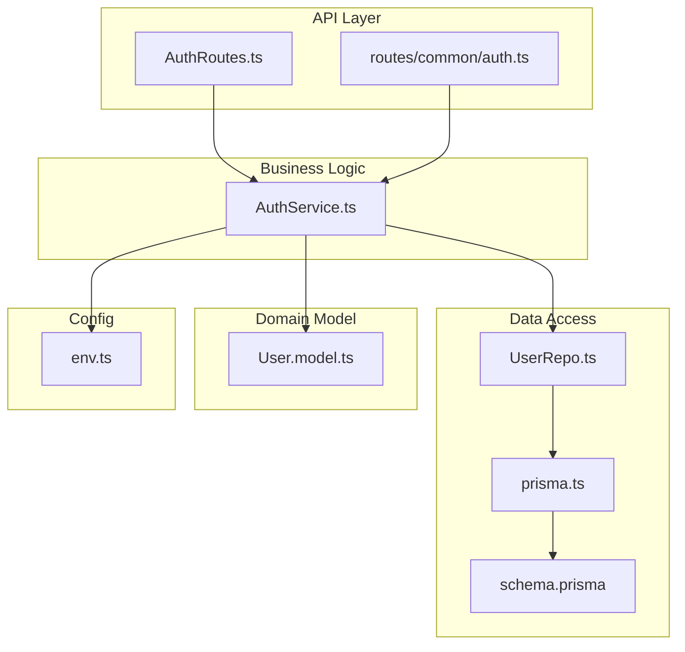
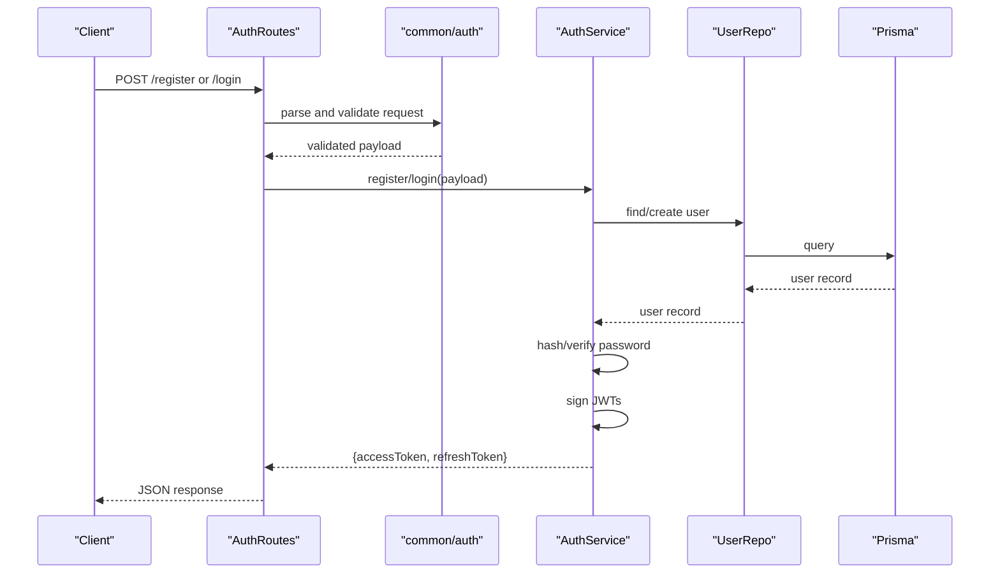
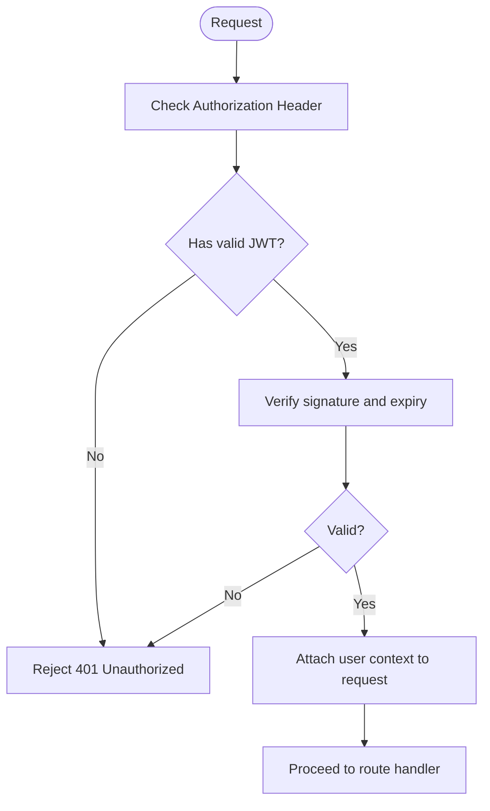
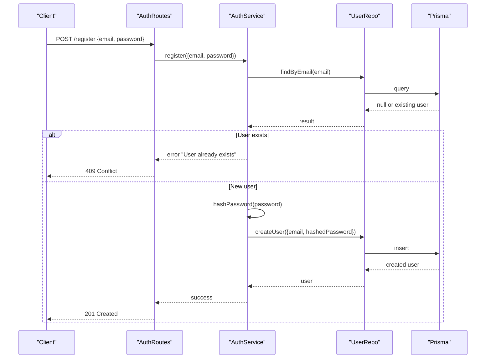
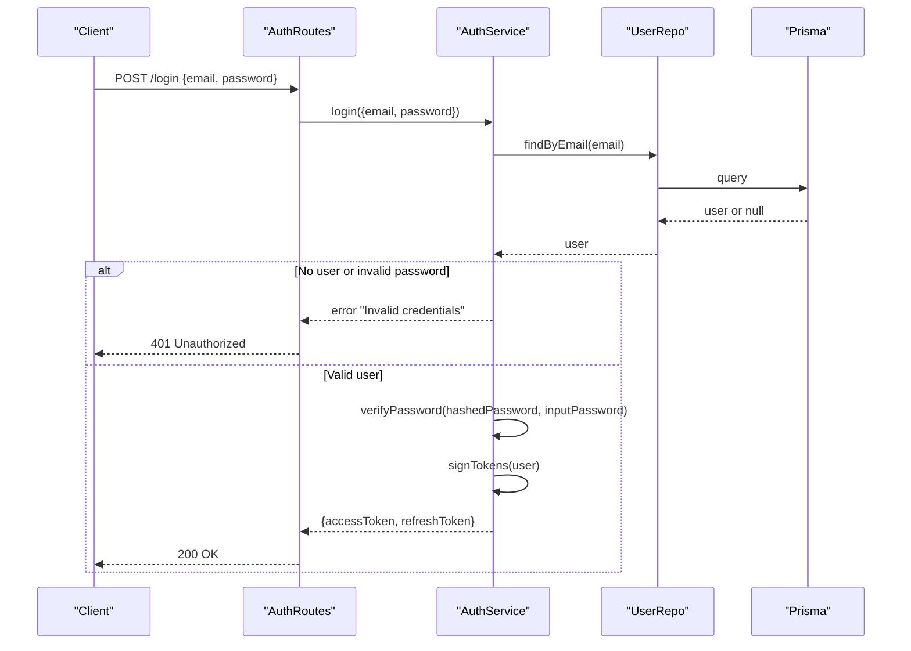
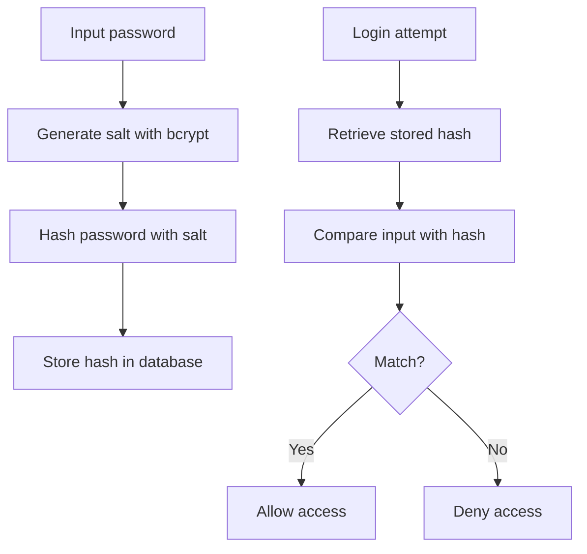
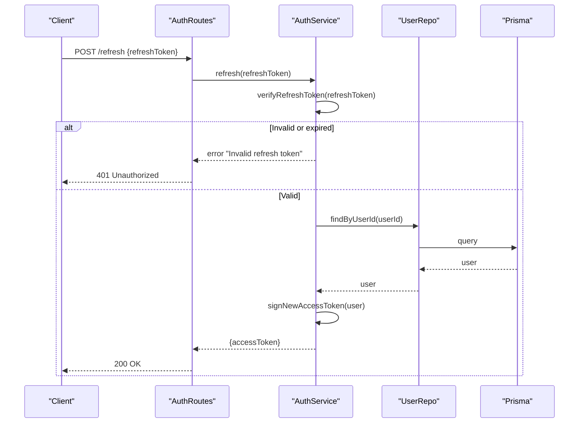
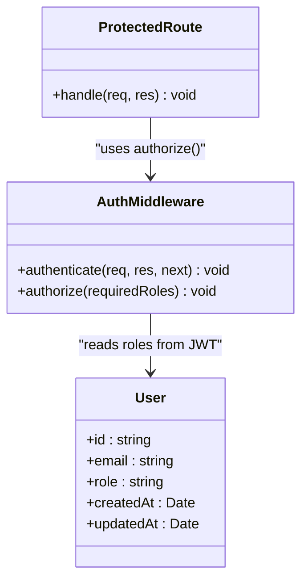
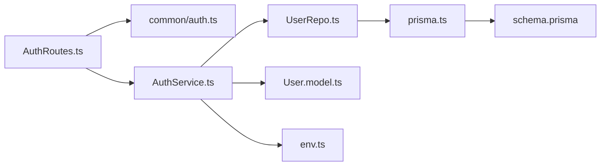

# Authentication System

<cite>
**Referenced Files in This Document**
- [AuthRoutes.ts](file://Backend/src/routes/AuthRoutes.ts)
- [AuthService.ts](file://Backend/src/services/AuthService.ts)
- [User.model.ts](file://Backend/src/models/User.model.ts)
- [UserRepo.ts](file://Backend/src/repos/UserRepo.ts)
- [env.ts](file://Backend/src/common/constants/env.ts)
- [auth.ts](file://Backend/src/routes/common/auth.ts)
- [prisma.ts](file://Backend/src/repos/prisma.ts)
- [schema.prisma](file://Backend/prisma/schema.prisma)
- [main.ts](file://Backend/src/main.ts)
- [server.ts](file://Backend/src/server.ts)
</cite>

## Table of Contents
1. [Introduction](#introduction)
2. [Project Structure](#project-structure)
3. [Core Components](#core-components)
4. [Architecture Overview](#architecture-overview)
5. [Detailed Component Analysis](#detailed-component-analysis)
6. [Dependency Analysis](#dependency-analysis)
7. [Performance Considerations](#performance-considerations)
8. [Security Best Practices](#security-best-practices)
9. [Troubleshooting Guide](#troubleshooting-guide)
10. [Conclusion](#conclusion)

## Introduction
This document explains the authentication system implemented in the project, focusing on JWT-based authentication, user registration and login flows, password hashing with bcrypt, token refresh mechanisms, and role-based access control (RBAC). It also covers the authentication middleware, session management strategies, and security best practices for protecting routes and validating tokens.

## Project Structure
The authentication logic is organized across routes, services, models, repositories, and configuration:
- Routes define HTTP endpoints for authentication actions (register, login, refresh, logout).
- Services encapsulate business logic for authentication workflows.
- Models represent domain entities (e.g., User).
- Repositories abstract data access (Prisma ORM).
- Configuration holds environment variables and constants.

**Diagram sources**
- [AuthRoutes.ts](file://Backend/src/routes/AuthRoutes.ts)
- [auth.ts](file://Backend/src/routes/common/auth.ts)
- [AuthService.ts](file://Backend/src/services/AuthService.ts)
- [UserRepo.ts](file://Backend/src/repos/UserRepo.ts)
- [prisma.ts](file://Backend/src/repos/prisma.ts)
- [schema.prisma](file://Backend/prisma/schema.prisma)
- [User.model.ts](file://Backend/src/models/User.model.ts)
- [env.ts](file://Backend/src/common/constants/env.ts)

**Section sources**
- [AuthRoutes.ts](file://Backend/src/routes/AuthRoutes.ts)
- [AuthService.ts](file://Backend/src/services/AuthService.ts)
- [User.model.ts](file://Backend/src/models/User.model.ts)
- [UserRepo.ts](file://Backend/src/repos/UserRepo.ts)
- [env.ts](file://Backend/src/common/constants/env.ts)

## Core Components
- AuthRoutes: Exposes endpoints for register, login, refresh, and logout; wires request parsing and response formatting.
- AuthService: Implements core authentication flows:
  - Registration: validates input, hashes password, creates user, issues tokens.
  - Login: verifies credentials, issues tokens.
  - Token refresh: validates refresh token, issues new access token.
  - Password operations: hash and compare using bcrypt.
  - Authorization helpers: role checks and permission guards.
- User model: Defines user schema fields and roles.
- UserRepo: Data access layer for user CRUD via Prisma.
- Prisma client: Database connection and query execution.
- Environment config: Secrets and runtime settings (JWT keys, token lifetimes, bcrypt cost).

Key responsibilities:
- Input validation and sanitization before persistence.
- Secure password storage with bcrypt.
- Stateless JWT access tokens with short lifetimes.
- Refresh tokens stored securely and validated server-side.
- Role-based authorization checks on protected routes.

**Section sources**
- [AuthService.ts](file://Backend/src/services/AuthService.ts)
- [User.model.ts](file://Backend/src/models/User.model.ts)
- [UserRepo.ts](file://Backend/src/repos/UserRepo.ts)
- [prisma.ts](file://Backend/src/repos/prisma.ts)
- [env.ts](file://Backend/src/common/constants/env.ts)

## Architecture Overview
The authentication flow follows a layered architecture:
- API layer receives requests and delegates to service layer.
- Service layer orchestrates business logic, interacts with repository, and handles token issuance/validation.
- Repository uses Prisma to read/write user data.
- Middleware enforces authentication and authorization on protected routes.

**Diagram sources**
- [AuthRoutes.ts](file://Backend/src/routes/AuthRoutes.ts)
- [auth.ts](file://Backend/src/routes/common/auth.ts)
- [AuthService.ts](file://Backend/src/services/AuthService.ts)
- [UserRepo.ts](file://Backend/src/repos/UserRepo.ts)
- [prisma.ts](file://Backend/src/repos/prisma.ts)

## Detailed Component Analysis

### JWT Implementation and Token Lifecycle
- Access tokens are short-lived and signed with a secret key from environment configuration.
- Refresh tokens are longer-lived and used to obtain new access tokens without re-authentication.
- Token payloads include minimal claims (e.g., user id, roles) to reduce exposure.
- Token verification occurs in middleware before route handlers execute.

**Diagram sources**
- [AuthService.ts](file://Backend/src/services/AuthService.ts)
- [auth.ts](file://Backend/src/routes/common/auth.ts)
- [env.ts](file://Backend/src/common/constants/env.ts)

**Section sources**
- [AuthService.ts](file://Backend/src/services/AuthService.ts)
- [auth.ts](file://Backend/src/routes/common/auth.ts)
- [env.ts](file://Backend/src/common/constants/env.ts)

### User Registration Flow
- Validates email uniqueness and password strength.
- Hashes password with bcrypt using configured cost factor.
- Persists user via repository and returns success response.
- Optionally issues initial tokens if immediate login is desired.

**Diagram sources**
- [AuthRoutes.ts](file://Backend/src/routes/AuthRoutes.ts)
- [AuthService.ts](file://Backend/src/services/AuthService.ts)
- [UserRepo.ts](file://Backend/src/repos/UserRepo.ts)
- [prisma.ts](file://Backend/src/repos/prisma.ts)

**Section sources**
- [AuthRoutes.ts](file://Backend/src/routes/AuthRoutes.ts)
- [AuthService.ts](file://Backend/src/services/AuthService.ts)
- [UserRepo.ts](file://Backend/src/repos/UserRepo.ts)

### Login Flow
- Verifies email and password.
- Issues access and refresh tokens upon successful authentication.
- Returns tokens to client for subsequent authenticated requests.

**Diagram sources**
- [AuthRoutes.ts](file://Backend/src/routes/AuthRoutes.ts)
- [AuthService.ts](file://Backend/src/services/AuthService.ts)
- [UserRepo.ts](file://Backend/src/repos/UserRepo.ts)
- [prisma.ts](file://Backend/src/repos/prisma.ts)

**Section sources**
- [AuthRoutes.ts](file://Backend/src/routes/AuthRoutes.ts)
- [AuthService.ts](file://Backend/src/services/AuthService.ts)
- [UserRepo.ts](file://Backend/src/repos/UserRepo.ts)

### Password Hashing with bcrypt
- Uses bcrypt to hash passwords before storing them.
- Configurable cost factor balances security and performance.
- Verification compares plaintext input against stored hash.

**Diagram sources**
- [AuthService.ts](file://Backend/src/services/AuthService.ts)
- [env.ts](file://Backend/src/common/constants/env.ts)

**Section sources**
- [AuthService.ts](file://Backend/src/services/AuthService.ts)
- [env.ts](file://Backend/src/common/constants/env.ts)

### Token Refresh Mechanism
- Client sends refresh token to a dedicated endpoint.
- Server validates the refresh token’s signature and expiry.
- On success, issues a new access token; optionally rotates refresh tokens for security.

**Diagram sources**
- [AuthRoutes.ts](file://Backend/src/routes/AuthRoutes.ts)
- [AuthService.ts](file://Backend/src/services/AuthService.ts)
- [UserRepo.ts](file://Backend/src/repos/UserRepo.ts)
- [prisma.ts](file://Backend/src/repos/prisma.ts)

**Section sources**
- [AuthRoutes.ts](file://Backend/src/routes/AuthRoutes.ts)
- [AuthService.ts](file://Backend/src/services/AuthService.ts)
- [UserRepo.ts](file://Backend/src/repos/UserRepo.ts)

### Role-Based Access Control (RBAC)
- Roles are attached to user records and included in JWT claims.
- Middleware checks required roles before allowing access to protected routes.
- Route handlers can further enforce fine-grained permissions.

**Diagram sources**
- [User.model.ts](file://Backend/src/models/User.model.ts)
- [auth.ts](file://Backend/src/routes/common/auth.ts)

**Section sources**
- [User.model.ts](file://Backend/src/models/User.model.ts)
- [auth.ts](file://Backend/src/routes/common/auth.ts)

### Session Management
- Stateless sessions using JWT eliminate server-side session stores.
- Short-lived access tokens minimize risk exposure.
- Refresh tokens provide secure renewal without repeated logins.
- Optional rotation of refresh tokens enhances security.

[No sources needed since this section provides general guidance]

## Dependency Analysis
Authentication components depend on each other as follows:
- Routes depend on common utilities for parsing and validation.
- Services depend on repositories for data access and on environment configuration for secrets.
- Repositories depend on Prisma client and schema definitions.
- Models define types used across layers.

**Diagram sources**
- [AuthRoutes.ts](file://Backend/src/routes/AuthRoutes.ts)
- [auth.ts](file://Backend/src/routes/common/auth.ts)
- [AuthService.ts](file://Backend/src/services/AuthService.ts)
- [UserRepo.ts](file://Backend/src/repos/UserRepo.ts)
- [prisma.ts](file://Backend/src/repos/prisma.ts)
- [schema.prisma](file://Backend/prisma/schema.prisma)
- [User.model.ts](file://Backend/src/models/User.model.ts)
- [env.ts](file://Backend/src/common/constants/env.ts)

**Section sources**
- [AuthRoutes.ts](file://Backend/src/routes/AuthRoutes.ts)
- [AuthService.ts](file://Backend/src/services/AuthService.ts)
- [UserRepo.ts](file://Backend/src/repos/UserRepo.ts)
- [prisma.ts](file://Backend/src/repos/prisma.ts)
- [schema.prisma](file://Backend/prisma/schema.prisma)
- [User.model.ts](file://Backend/src/models/User.model.ts)
- [env.ts](file://Backend/src/common/constants/env.ts)

## Performance Considerations
- Use appropriate bcrypt cost factor to balance security and latency.
- Keep JWT payloads small to reduce network overhead.
- Cache frequently accessed user data where appropriate (e.g., profile lookups).
- Implement rate limiting on authentication endpoints to prevent brute-force attacks.
- Ensure database indexes on email and foreign keys for fast queries.

[No sources needed since this section provides general guidance]

## Security Best Practices
- Store secrets (JWT secret, bcrypt cost) in environment variables; never hardcode.
- Enforce HTTPS for all authentication endpoints.
- Validate and sanitize all inputs rigorously.
- Set short expiration times for access tokens; rotate refresh tokens when possible.
- Implement account lockout or throttling after repeated failed attempts.
- Avoid logging sensitive data (passwords, tokens).
- Use least privilege principles for roles and permissions.

[No sources needed since this section provides general guidance]

## Troubleshooting Guide
Common issues and resolutions:
- Invalid or expired JWT:
  - Verify token signing algorithm and secret match configuration.
  - Check token expiry and ensure clients refresh tokens appropriately.
- Authentication failures:
  - Confirm bcrypt cost and hashing consistency.
  - Validate email/password format and uniqueness constraints.
- Permission denied errors:
  - Ensure roles are correctly assigned and included in JWT claims.
  - Review middleware authorization rules and route-level checks.
- Database connectivity problems:
  - Verify Prisma connection string and migration status.
  - Check network access and credentials.

**Section sources**
- [AuthService.ts](file://Backend/src/services/AuthService.ts)
- [auth.ts](file://Backend/src/routes/common/auth.ts)
- [env.ts](file://Backend/src/common/constants/env.ts)
- [prisma.ts](file://Backend/src/repos/prisma.ts)

## Conclusion
The authentication system implements a robust, stateless JWT-based approach with secure password hashing, token refresh capabilities, and role-based access control. By separating concerns across routes, services, repositories, and configuration, the system remains maintainable and scalable. Adhering to the outlined security best practices ensures strong protection against common threats while providing a smooth user experience.

[No sources needed since this section summarizes without analyzing specific files]