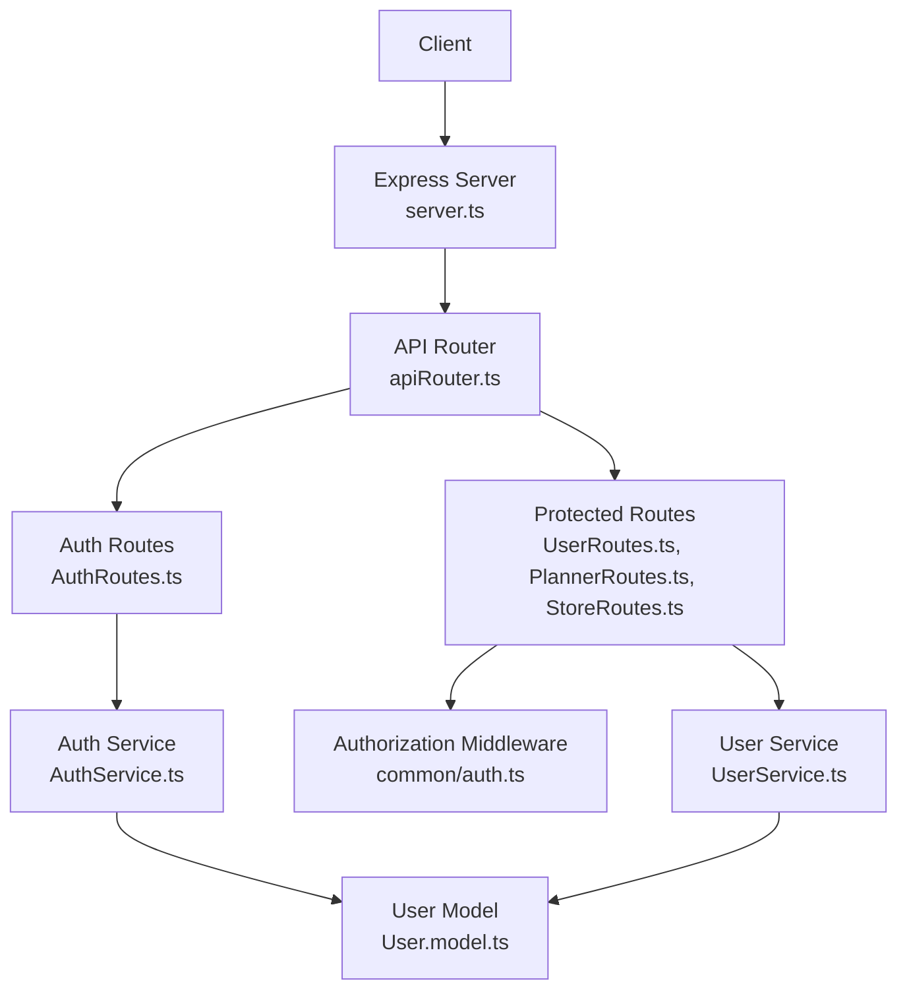
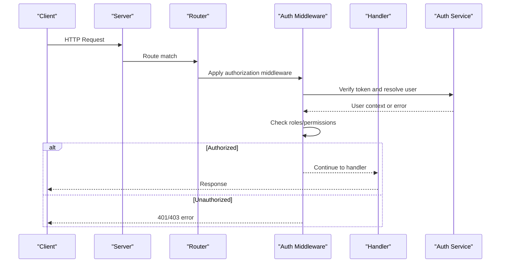
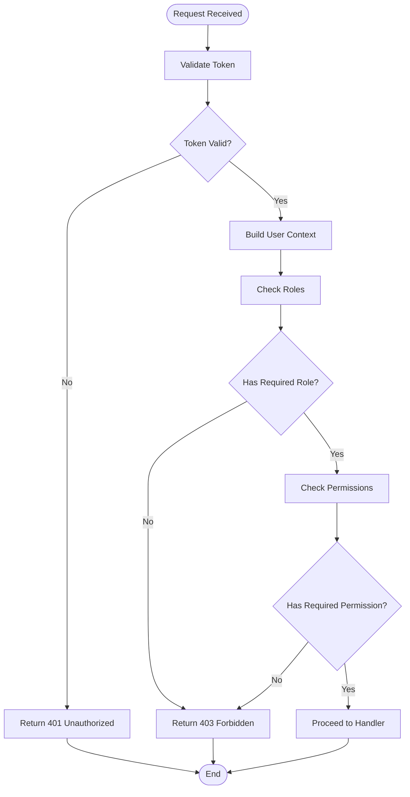
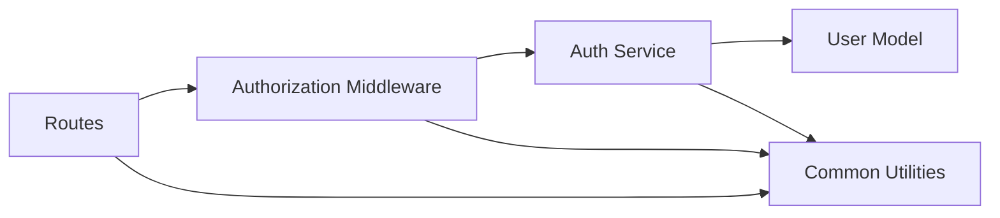

# Authorization Middleware

<cite>
**Referenced Files in This Document**
- [AuthRoutes.ts](file://Backend/src/routes/AuthRoutes.ts)
- [AuthService.ts](file://Backend/src/services/AuthService.ts)
- [User.model.ts](file://Backend/src/models/User.model.ts)
- [HttpStatusCodes.ts](file://Backend/src/common/constants/HttpStatusCodes.ts)
- [auth.ts](file://Backend/src/routes/common/auth.ts)
- [apiRouter.ts](file://Backend/src/routes/apiRouter.ts)
- [main.ts](file://Backend/src/main.ts)
- [server.ts](file://Backend/src/server.ts)
</cite>

## Table of Contents
1. [Introduction](#introduction)
2. [Project Structure](#project-structure)
3. [Core Components](#core-components)
4. [Architecture Overview](#architecture-overview)
5. [Detailed Component Analysis](#detailed-component-analysis)
6. [Dependency Analysis](#dependency-analysis)
7. [Performance Considerations](#performance-considerations)
8. [Troubleshooting Guide](#troubleshooting-guide)
9. [Conclusion](#conclusion)

## Introduction
This document explains how authorization middleware works in the project, focusing on role-based access control (RBAC), route protection, and permission checking. It covers middleware chain execution, custom decorators for protected routes, error handling for unauthorized access, and practical examples for implementing protected endpoints, assigning roles, and writing custom authorization logic.

## Project Structure
The authorization system spans several layers:
- Routes define endpoints and apply middleware/decorators to protect them
- Services encapsulate business logic for authentication and authorization decisions
- Models represent user entities and roles
- Common utilities include HTTP status codes and shared auth helpers
- The server wires up middleware globally and mounts routers

**Diagram sources**
- [server.ts](file://Backend/src/server.ts)
- [apiRouter.ts](file://Backend/src/routes/apiRouter.ts)
- [AuthRoutes.ts](file://Backend/src/routes/AuthRoutes.ts)
- [auth.ts](file://Backend/src/routes/common/auth.ts)
- [AuthService.ts](file://Backend/src/services/AuthService.ts)
- [User.model.ts](file://Backend/src/models/User.model.ts)

**Section sources**
- [server.ts](file://Backend/src/server.ts)
- [apiRouter.ts](file://Backend/src/routes/apiRouter.ts)

## Core Components
- Authorization middleware: validates tokens, resolves user context, checks roles/permissions, and short-circuits unauthorized requests
- Custom decorators: declarative annotations on route handlers to enforce RBAC and permissions
- Role and permission model: defines roles, permissions, and their relationships
- Error handling: standardized responses for unauthorized and forbidden scenarios
- Route protection: applying middleware/decorators to restrict access to specific endpoints

Key responsibilities:
- Parse and verify authentication tokens
- Attach user context to request objects
- Evaluate role and permission requirements
- Return consistent error responses for authorization failures

**Section sources**
- [auth.ts](file://Backend/src/routes/common/auth.ts)
- [AuthService.ts](file://Backend/src/services/AuthService.ts)
- [User.model.ts](file://Backend/src/models/User.model.ts)
- [HttpStatusCodes.ts](file://Backend/src/common/constants/HttpStatusCodes.ts)

## Architecture Overview
The authorization flow follows a layered approach:
- Global middleware initializes security headers and parses requests
- Route-level middleware verifies authentication and authorizes access
- Decorators provide declarative protection at handler level
- Services implement business rules for role and permission evaluation
- Consistent error responses are returned using standardized HTTP codes

**Diagram sources**
- [server.ts](file://Backend/src/server.ts)
- [apiRouter.ts](file://Backend/src/routes/apiRouter.ts)
- [auth.ts](file://Backend/src/routes/common/auth.ts)
- [AuthService.ts](file://Backend/src/services/AuthService.ts)

## Detailed Component Analysis

### Authorization Middleware Chain
The middleware chain enforces authentication and authorization before reaching route handlers:
- Authentication step: validate token presence and signature
- Context building: attach user profile and metadata to request
- Authorization step: evaluate roles and permissions against route requirements
- Short-circuit: return early with appropriate error if checks fail

**Diagram sources**
- [auth.ts](file://Backend/src/routes/common/auth.ts)
- [AuthService.ts](file://Backend/src/services/AuthService.ts)

**Section sources**
- [auth.ts](file://Backend/src/routes/common/auth.ts)

### Custom Decorators for Protected Routes
Decorators provide a declarative way to protect routes:
- @RequireRole decorator enforces minimum role levels
- @RequirePermission decorator enforces specific action permissions
- Decorators integrate with middleware chain to inject checks
- Configuration allows flexible role hierarchies and permission matrices

Usage patterns:
- Apply decorators directly above route handlers
- Combine multiple decorators for complex requirements
- Use parameterized decorators for dynamic role/permission checks

**Section sources**
- [auth.ts](file://Backend/src/routes/common/auth.ts)

### Role-Based Access Control (RBAC)
RBAC implementation includes:
- Role definitions with hierarchical relationships
- Permission assignments per role
- Runtime evaluation of user roles against route requirements
- Support for role inheritance and composite permissions

Data model considerations:
- User-role associations stored in database
- Role hierarchy defined in configuration
- Permission matrix mapping actions to resources

**Section sources**
- [User.model.ts](file://Backend/src/models/User.model.ts)
- [AuthService.ts](file://Backend/src/services/AuthService.ts)

### Permission Checking Logic
Permission checking evaluates user capabilities against required actions:
- Resource-based permissions (e.g., "user:read", "user:write")
- Action-based permissions (e.g., "create", "update", "delete")
- Context-aware permissions considering resource ownership
- Cache optimization for frequent permission checks

Implementation patterns:
- Centralized permission evaluator service
- Configurable permission rules
- Fallback mechanisms for missing permissions

**Section sources**
- [AuthService.ts](file://Backend/src/services/AuthService.ts)

### Error Handling for Unauthorized Access
Standardized error responses ensure consistent client behavior:
- 401 Unauthorized: invalid or missing authentication
- 403 Forbidden: valid authentication but insufficient permissions
- Structured error payloads with actionable messages
- Logging for security monitoring and debugging

Error response format:
- Standardized JSON structure
- Human-readable error messages
- Correlation IDs for tracing
- Security-conscious details (no sensitive information)

**Section sources**
- [HttpStatusCodes.ts](file://Backend/src/common/constants/HttpStatusCodes.ts)
- [auth.ts](file://Backend/src/routes/common/auth.ts)

## Dependency Analysis
The authorization system has clear dependency boundaries:
- Routes depend on middleware for protection
- Middleware depends on services for business logic
- Services depend on models for data operations
- All components use common utilities for consistency

**Diagram sources**
- [apiRouter.ts](file://Backend/src/routes/apiRouter.ts)
- [auth.ts](file://Backend/src/routes/common/auth.ts)
- [AuthService.ts](file://Backend/src/services/AuthService.ts)
- [User.model.ts](file://Backend/src/models/User.model.ts)

**Section sources**
- [apiRouter.ts](file://Backend/src/routes/apiRouter.ts)
- [auth.ts](file://Backend/src/routes/common/auth.ts)

## Performance Considerations
Optimization strategies for authorization middleware:
- Token validation caching to reduce repeated computations
- Permission check memoization for frequently accessed routes
- Database query optimization for user role lookups
- Connection pooling for database operations
- Lazy loading of permission matrices

Monitoring and metrics:
- Track authorization failure rates
- Measure middleware execution time
- Monitor token validation performance
- Alert on unusual authorization patterns

## Troubleshooting Guide
Common issues and solutions:
- Token validation failures: verify secret keys and token formats
- Permission denied errors: check role assignments and permission mappings
- Middleware not executing: verify route registration order
- Performance degradation: implement caching and optimize queries

Debugging techniques:
- Enable detailed logging for authorization decisions
- Use correlation IDs to trace requests through middleware
- Test with different user roles and permissions
- Monitor error logs for authorization failures

**Section sources**
- [HttpStatusCodes.ts](file://Backend/src/common/constants/HttpStatusCodes.ts)
- [auth.ts](file://Backend/src/routes/common/auth.ts)

## Conclusion
The authorization middleware system provides robust protection for API endpoints through role-based access control and permission checking. The modular architecture allows for flexible configuration and easy extension of authorization rules. By following the patterns outlined in this document, developers can implement secure, maintainable authorization logic that scales with application complexity.

Key benefits:
- Declarative route protection through decorators
- Flexible RBAC with role hierarchies
- Consistent error handling across all endpoints
- Performance optimizations for high-throughput scenarios
- Comprehensive logging and monitoring capabilities

[No sources needed since this section summarizes without analyzing specific files]