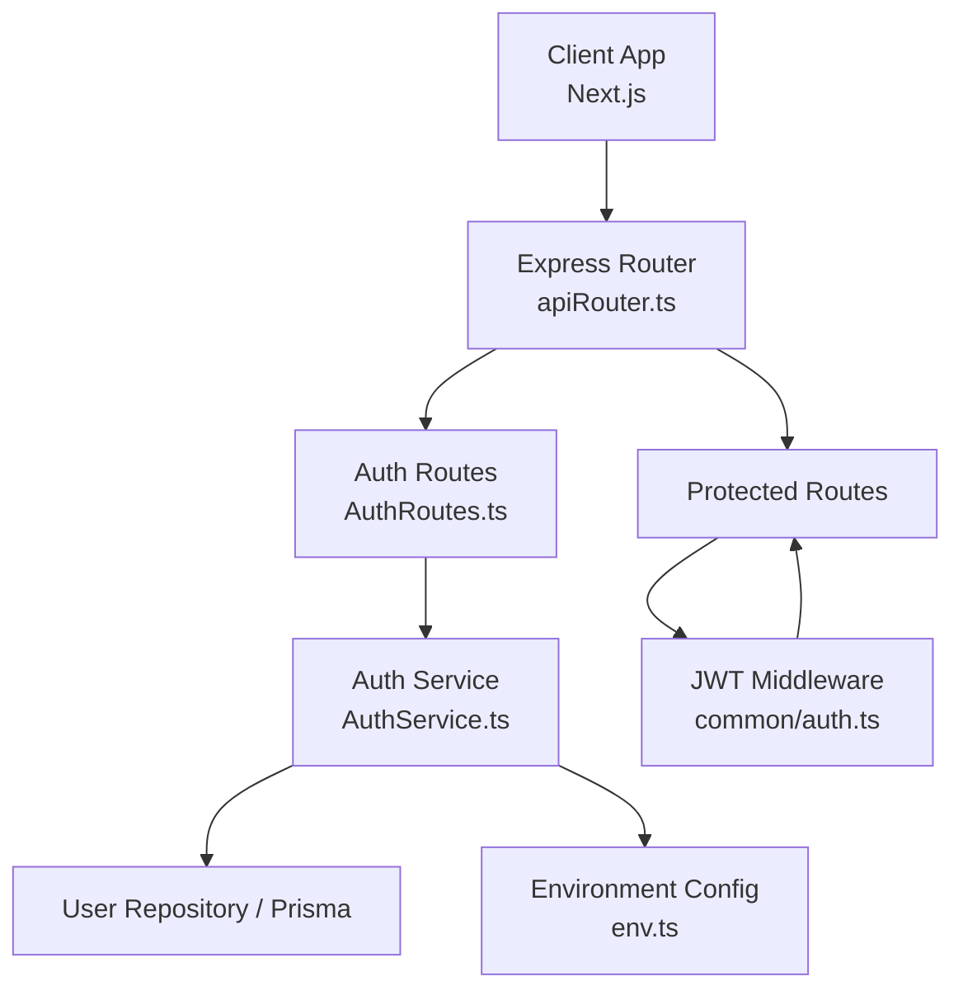
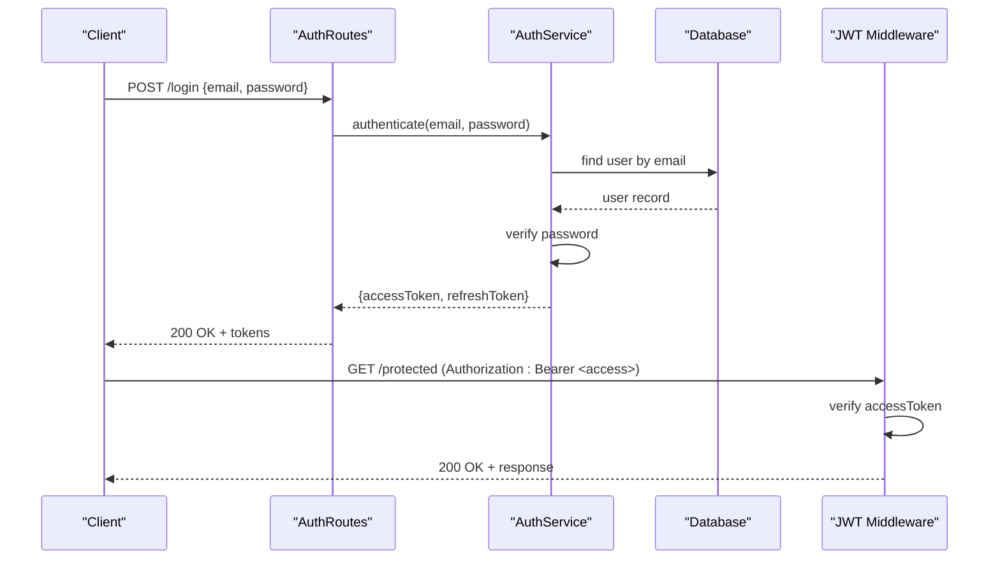
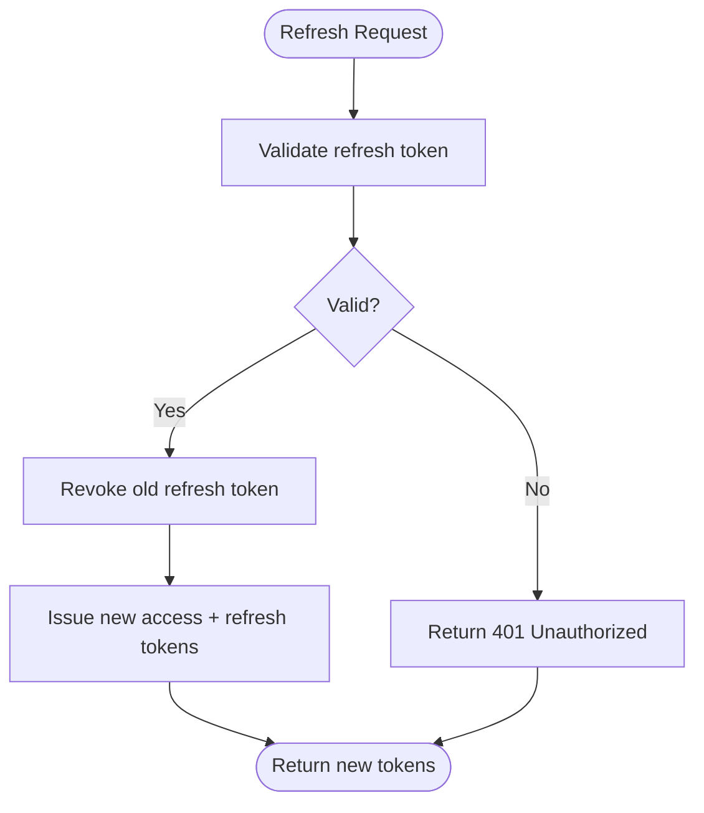
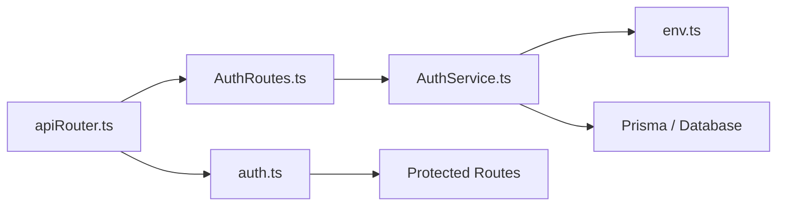

# JWT Implementation

<cite>
**Referenced Files in This Document**
- [AuthService.ts](file://Backend/src/services/AuthService.ts)
- [AuthRoutes.ts](file://Backend/src/routes/AuthRoutes.ts)
- [User.model.ts](file://Backend/src/models/User.model.ts)
- [env.ts](file://Backend/src/common/constants/env.ts)
- [auth.ts](file://Backend/src/routes/common/auth.ts)
- [apiRouter.ts](file://Backend/src/routes/apiRouter.ts)
- [main.ts](file://Backend/src/main.ts)
- [server.ts](file://Backend/src/server.ts)
- [package.json](file://Backend/package.json)
- [schema.prisma](file://Backend/prisma/schema.prisma)
</cite>

## Table of Contents
1. [Introduction](#introduction)
2. [Project Structure](#project-structure)
3. [Core Components](#core-components)
4. [Architecture Overview](#architecture-overview)
5. [Detailed Component Analysis](#detailed-component-analysis)
6. [Dependency Analysis](#dependency-analysis)
7. [Performance Considerations](#performance-considerations)
8. [Troubleshooting Guide](#troubleshooting-guide)
9. [Conclusion](#conclusion)
10. [Appendices](#appendices)

## Introduction
This document explains the JWT-based authentication system implemented in the backend and how the frontend manages tokens. It covers token generation, validation, refresh mechanisms, payload structure, expiration handling, security considerations, middleware usage, client-side storage strategies, refresh token rotation, and error handling patterns. Where applicable, it references concrete source files for deeper inspection.

## Project Structure
The authentication flow spans several layers:
- Routes define endpoints for login, register, and protected actions.
- Services implement business logic including token creation and validation.
- Models and Prisma schema define user data and relationships.
- Environment configuration holds secrets like signing keys and token lifetimes.
- Middleware validates requests using JWTs.
- The Next.js frontend stores tokens securely and attaches them to API calls.

**Diagram sources**
- [apiRouter.ts](file://Backend/src/routes/apiRouter.ts)
- [AuthRoutes.ts](file://Backend/src/routes/AuthRoutes.ts)
- [AuthService.ts](file://Backend/src/services/AuthService.ts)
- [auth.ts](file://Backend/src/routes/common/auth.ts)
- [env.ts](file://Backend/src/common/constants/env.ts)

**Section sources**
- [AuthRoutes.ts](file://Backend/src/routes/AuthRoutes.ts)
- [AuthService.ts](file://Backend/src/services/AuthService.ts)
- [auth.ts](file://Backend/src/routes/common/auth.ts)
- [env.ts](file://Backend/src/common/constants/env.ts)
- [apiRouter.ts](file://Backend/src/routes/apiRouter.ts)

## Core Components
- Authentication service: encapsulates token generation, verification, and refresh logic.
- Route handlers: expose endpoints for login/register and protected resources.
- JWT middleware: validates access tokens and attaches user context to requests.
- Environment configuration: centralizes secrets and token settings.
- Data layer: models and repository for user data and credentials.

Key responsibilities:
- Generate short-lived access tokens and longer-lived refresh tokens.
- Validate tokens on each request via middleware.
- Rotate refresh tokens and invalidate old ones upon use.
- Enforce secure defaults and clear error messages.

**Section sources**
- [AuthService.ts](file://Backend/src/services/AuthService.ts)
- [AuthRoutes.ts](file://Backend/src/routes/AuthRoutes.ts)
- [auth.ts](file://Backend/src/routes/common/auth.ts)
- [env.ts](file://Backend/src/common/constants/env.ts)

## Architecture Overview
The JWT architecture follows a standard pattern:
- On login, the server issues an access token and a refresh token.
- Access tokens are included in Authorization headers for subsequent requests.
- Refresh tokens are stored securely and used to obtain new access tokens without re-authentication.
- Middleware validates access tokens and populates request context with user identity.

**Diagram sources**
- [AuthRoutes.ts](file://Backend/src/routes/AuthRoutes.ts)
- [AuthService.ts](file://Backend/src/services/AuthService.ts)
- [auth.ts](file://Backend/src/routes/common/auth.ts)

## Detailed Component Analysis

### Token Generation and Validation
- Access tokens are short-lived and contain minimal claims (e.g., user id, roles).
- Refresh tokens are longer-lived and stored server-side or in secure storage depending on strategy.
- Signing uses a strong secret or private key; algorithms should be fixed to prevent downgrade attacks.
- Validation checks signature, issuer, audience, expiration, and optional custom claims.

Implementation pointers:
- Token creation and verification functions reside in the auth service.
- Constants for algorithm, issuer, and audiences are defined in environment config.
- Error handling returns standardized HTTP errors for invalid/expired tokens.

**Section sources**
- [AuthService.ts](file://Backend/src/services/AuthService.ts)
- [env.ts](file://Backend/src/common/constants/env.ts)

### Refresh Mechanism and Rotation
- Clients send the refresh token to a dedicated endpoint to obtain a new access token.
- Upon successful refresh, issue a new refresh token and invalidate the previous one (rotation).
- Maintain a revocation store or database table to track active refresh tokens.
- Implement sliding expiration if needed, but ensure maximum lifetime constraints.

Flow overview:

**Diagram sources**
- [AuthService.ts](file://Backend/src/services/AuthService.ts)

**Section sources**
- [AuthService.ts](file://Backend/src/services/AuthService.ts)

### Payload Structure and Expiration Handling
- Access token payload typically includes:
  - Sub (subject): user identifier
  - Roles or permissions
  - Issued at and expiration timestamps
  - Optional: tenant, device fingerprint
- Expiration handling:
  - Short TTL for access tokens (e.g., minutes)
  - Longer TTL for refresh tokens (e.g., days), with rotation
  - Reject expired tokens immediately and prompt refresh
- Security considerations:
  - Do not include sensitive data in payloads
  - Use strict algorithm allowlists
  - Validate issuer and audience claims

**Section sources**
- [AuthService.ts](file://Backend/src/services/AuthService.ts)
- [env.ts](file://Backend/src/common/constants/env.ts)

### Middleware for Token Verification
- Middleware extracts the Authorization header and verifies the access token.
- On success, attaches decoded user info to the request object.
- On failure, returns appropriate HTTP status codes (e.g., 401, 403).
- Should handle malformed headers and missing tokens gracefully.

Usage pattern:
- Apply middleware to protected routes.
- Combine with role-based authorization where necessary.

**Section sources**
- [auth.ts](file://Backend/src/routes/common/auth.ts)

### Route Handlers and Protected Endpoints
- Login/register endpoints call the auth service to authenticate users and return tokens.
- Protected endpoints rely on middleware to enforce authentication.
- Responses follow consistent error formats for easier client handling.

**Section sources**
- [AuthRoutes.ts](file://Backend/src/routes/AuthRoutes.ts)

### Data Model and Storage
- User model defines fields relevant to authentication (e.g., email, hashed password).
- Refresh token storage may use a database table with fields like token hash, user id, expiry, and revoked flag.
- Ensure indexes on frequently queried columns (e.g., user id, token hash).

**Section sources**
- [User.model.ts](file://Backend/src/models/User.model.ts)
- [schema.prisma](file://Backend/prisma/schema.prisma)

### Environment Configuration
- Centralize secrets and token parameters:
  - JWT secret or private key
  - Algorithm (e.g., HS256 or RS256)
  - Access token TTL
  - Refresh token TTL
  - Issuer and audience values
- Load environment variables safely and validate presence at startup.

**Section sources**
- [env.ts](file://Backend/src/common/constants/env.ts)

### Client-Side Token Management (Next.js)
- Store access tokens in memory or secure httpOnly cookies; avoid localStorage for sensitive tokens.
- Attach access tokens to outgoing requests via interceptors or fetch wrappers.
- Handle token expiration by refreshing via the refresh endpoint before retrying failed requests.
- Implement logout by clearing tokens and optionally calling a server-side revoke endpoint.

Best practices:
- Use centralized API client utilities to manage headers and error handling.
- Provide hooks for authenticated state and token refresh logic.
- Gracefully handle network errors and token rotation failures.

[No sources needed since this section provides general guidance]

## Dependency Analysis
The authentication subsystem depends on:
- Express router for route registration and middleware composition.
- Auth service for token operations and business logic.
- Database layer for user lookup and refresh token management.
- Environment configuration for secrets and token parameters.

**Diagram sources**
- [apiRouter.ts](file://Backend/src/routes/apiRouter.ts)
- [AuthRoutes.ts](file://Backend/src/routes/AuthRoutes.ts)
- [AuthService.ts](file://Backend/src/services/AuthService.ts)
- [auth.ts](file://Backend/src/routes/common/auth.ts)
- [env.ts](file://Backend/src/common/constants/env.ts)

**Section sources**
- [apiRouter.ts](file://Backend/src/routes/apiRouter.ts)
- [AuthRoutes.ts](file://Backend/src/routes/AuthRoutes.ts)
- [AuthService.ts](file://Backend/src/services/AuthService.ts)
- [auth.ts](file://Backend/src/routes/common/auth.ts)
- [env.ts](file://Backend/src/common/constants/env.ts)

## Performance Considerations
- Keep access tokens small to reduce bandwidth and parsing overhead.
- Cache validated user contexts when appropriate (e.g., per-request memoization).
- Use efficient hashing for refresh tokens and index lookup columns.
- Avoid synchronous crypto operations on the main thread; prefer async APIs where available.
- Monitor token validation latency and set timeouts to prevent bottlenecks.

[No sources needed since this section provides general guidance]

## Troubleshooting Guide
Common issues and resolutions:
- Invalid token signature: check secret/key configuration and algorithm consistency.
- Expired token: ensure client refreshes access tokens before expiration.
- Missing Authorization header: verify client sets headers correctly.
- Refresh token reuse: enforce rotation and revoke old tokens immediately.
- CORS or cookie issues: configure SameSite and Secure flags appropriately.

Error handling patterns:
- Return consistent HTTP status codes (401 for unauthorized, 403 for forbidden).
- Include structured error responses with actionable messages.
- Log validation failures without leaking sensitive details.

**Section sources**
- [auth.ts](file://Backend/src/routes/common/auth.ts)
- [AuthService.ts](file://Backend/src/services/AuthService.ts)

## Conclusion
The JWT-based authentication system separates concerns across routes, services, middleware, and configuration. By enforcing short-lived access tokens, rotating refresh tokens, and validating claims rigorously, the system balances usability and security. Proper client-side token management and robust error handling complete a resilient authentication flow.

[No sources needed since this section summarizes without analyzing specific files]

## Appendices

### Example Scenarios
- Creating an access token:
  - Call the authentication service with valid credentials.
  - Receive both access and refresh tokens.
- Verifying a token via middleware:
  - Include Authorization header with bearer token.
  - Middleware validates and attaches user context.
- Managing tokens on the client:
  - Store tokens securely.
  - Attach access tokens to requests.
  - Refresh tokens on expiration.

[No sources needed since this section provides general guidance]