# User Management

<cite>
**Referenced Files in This Document**
- [schema.prisma](file://Backend/prisma/schema.prisma)
- [User.model.ts](file://Backend/src/models/User.model.ts)
- [UserRepo.ts](file://Backend/src/repos/UserRepo.ts)
- [UserService.ts](file://Backend/src/services/UserService.ts)
- [AuthRoutes.ts](file://Backend/src/routes/AuthRoutes.ts)
- [ProfileRoutes.ts](file://Backend/src/routes/ProfileRoutes.ts)
- [UserRoutes.ts](file://Backend/src/routes/UserRoutes.ts)
- [AuthService.ts](file://Backend/src/services/AuthService.ts)
- [ProfileService.ts](file://Backend/src/services/ProfileService.ts)
- [validators.ts](file://Backend/src/common/utils/validators.ts)
- [env.ts](file://Backend/src/common/constants/env.ts)
- [prisma.ts](file://Backend/src/repos/prisma.ts)
- [auth.ts](file://Backend/src/routes/common/auth.ts)
- [parseReq.ts](file://Backend/src/routes/common/parseReq.ts)
- [users.test.ts](file://Backend/tests/users.test.ts)
</cite>

## Table of Contents
1. [Introduction](#introduction)
2. [Project Structure](#project-structure)
3. [Core Components](#core-components)
4. [Architecture Overview](#architecture-overview)
5. [Detailed Component Analysis](#detailed-component-analysis)
6. [Dependency Analysis](#dependency-analysis)
7. [Performance Considerations](#performance-considerations)
8. [Troubleshooting Guide](#troubleshooting-guide)
9. [Conclusion](#conclusion)
10. [Appendices](#appendices)

## Introduction
This document explains the user management system with a focus on registration, profile updates, and account lifecycle operations. It covers the User model schema, validation rules, database operations, password hashing using bcrypt, email verification processes, and security considerations. It also provides examples of CRUD operations, profile management, and account deletion workflows.

## Project Structure
The user management functionality spans several layers:
- Data layer: Prisma schema and repository for database operations
- Service layer: Business logic for users, authentication, and profiles
- Route layer: HTTP endpoints that expose APIs for clients
- Validation utilities: Input validation helpers
- Environment configuration: Secrets and runtime settings

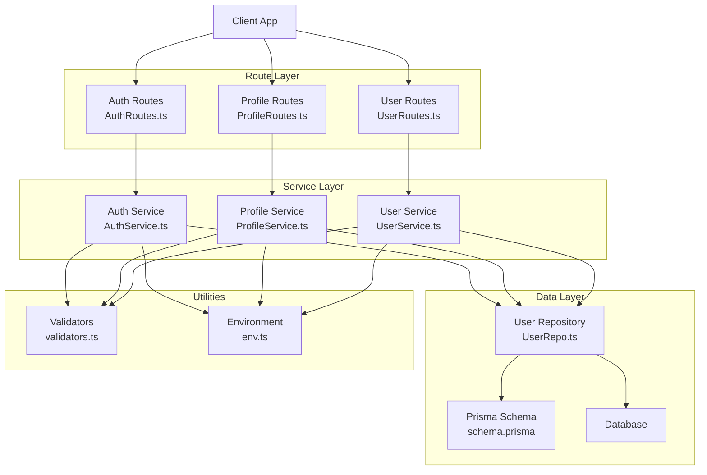

**Diagram sources**
- [schema.prisma](file://Backend/prisma/schema.prisma)
- [UserRepo.ts](file://Backend/src/repos/UserRepo.ts)
- [UserService.ts](file://Backend/src/services/UserService.ts)
- [AuthService.ts](file://Backend/src/services/AuthService.ts)
- [ProfileService.ts](file://Backend/src/services/ProfileService.ts)
- [AuthRoutes.ts](file://Backend/src/routes/AuthRoutes.ts)
- [ProfileRoutes.ts](file://Backend/src/routes/ProfileRoutes.ts)
- [UserRoutes.ts](file://Backend/src/routes/UserRoutes.ts)
- [validators.ts](file://Backend/src/common/utils/validators.ts)
- [env.ts](file://Backend/src/common/constants/env.ts)

**Section sources**
- [schema.prisma](file://Backend/prisma/schema.prisma)
- [UserRepo.ts](file://Backend/src/repos/UserRepo.ts)
- [UserService.ts](file://Backend/src/services/UserService.ts)
- [AuthService.ts](file://Backend/src/services/AuthService.ts)
- [ProfileService.ts](file://Backend/src/services/ProfileService.ts)
- [AuthRoutes.ts](file://Backend/src/routes/AuthRoutes.ts)
- [ProfileRoutes.ts](file://Backend/src/routes/ProfileRoutes.ts)
- [UserRoutes.ts](file://Backend/src/routes/UserRoutes.ts)
- [validators.ts](file://Backend/src/common/utils/validators.ts)
- [env.ts](file://Backend/src/common/constants/env.ts)

## Core Components
- User Model: Defines fields such as id, email, password, name, and optional profile attributes. The schema is defined in the Prisma schema file and reflected in the TypeScript model.
- Repository: Encapsulates database operations for creating, reading, updating, and deleting users via Prisma client.
- Services: Implement business logic for user registration, login, profile updates, and account deletion. They coordinate validation, hashing, and persistence.
- Routes: Expose HTTP endpoints for authentication, profile management, and user administration.
- Validators: Provide input validation helpers used across services and routes.
- Environment: Holds secrets like JWT tokens and bcrypt salt rounds.

Key responsibilities:
- Registration: Validate inputs, hash password, create user, handle duplicates, return minimal user data.
- Login: Verify credentials, generate token, return session or token payload.
- Profile Update: Authenticate request, validate fields, update user profile safely.
- Account Deletion: Authenticate request, remove user data, confirm deletion.

**Section sources**
- [User.model.ts](file://Backend/src/models/User.model.ts)
- [UserRepo.ts](file://Backend/src/repos/UserRepo.ts)
- [UserService.ts](file://Backend/src/services/UserService.ts)
- [AuthService.ts](file://Backend/src/services/AuthService.ts)
- [ProfileService.ts](file://Backend/src/services/ProfileService.ts)
- [validators.ts](file://Backend/src/common/utils/validators.ts)
- [env.ts](file://Backend/src/common/constants/env.ts)

## Architecture Overview
The user management flow follows a layered architecture:
- Routes receive HTTP requests and delegate to services.
- Services enforce business rules, validate inputs, and call repositories.
- Repositories perform database operations through Prisma.
- Utilities provide validation and environment access.

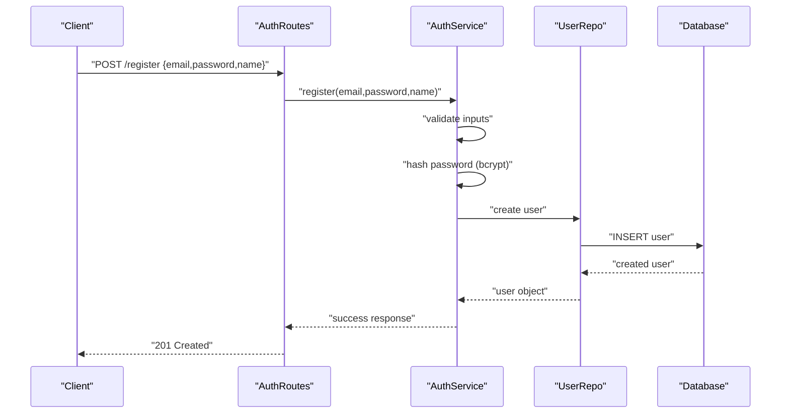

**Diagram sources**
- [AuthRoutes.ts](file://Backend/src/routes/AuthRoutes.ts)
- [AuthService.ts](file://Backend/src/services/AuthService.ts)
- [UserRepo.ts](file://Backend/src/repos/UserRepo.ts)
- [schema.prisma](file://Backend/prisma/schema.prisma)

## Detailed Component Analysis

### User Model and Schema
- Fields include unique identifiers, email, hashed password, and profile-related attributes.
- Constraints ensure uniqueness and required fields.
- The Prisma schema defines relationships and indexes for performance.

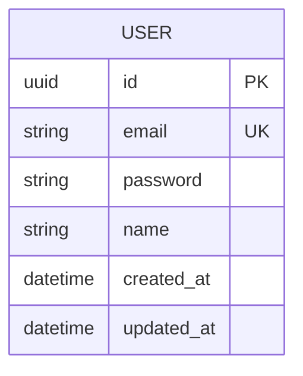

**Diagram sources**
- [schema.prisma](file://Backend/prisma/schema.prisma)

**Section sources**
- [schema.prisma](file://Backend/prisma/schema.prisma)
- [User.model.ts](file://Backend/src/models/User.model.ts)

### Password Hashing with bcrypt
- Passwords are hashed before storage using bcrypt.
- Salt rounds are configured via environment variables.
- Verification compares plaintext passwords against stored hashes securely.

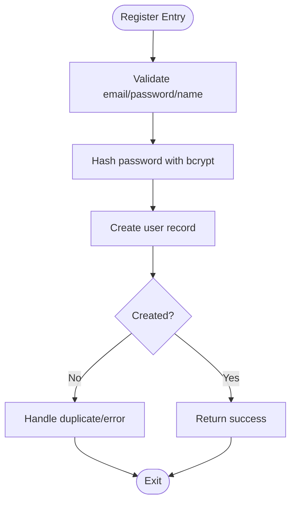

**Diagram sources**
- [AuthService.ts](file://Backend/src/services/AuthService.ts)
- [env.ts](file://Backend/src/common/constants/env.ts)
- [validators.ts](file://Backend/src/common/utils/validators.ts)

**Section sources**
- [AuthService.ts](file://Backend/src/services/AuthService.ts)
- [env.ts](file://Backend/src/common/constants/env.ts)
- [validators.ts](file://Backend/src/common/utils/validators.ts)

### Email Verification Process
- On registration, an email verification token can be generated and sent to the user’s email.
- The verification endpoint validates the token and marks the user as verified.
- Protected routes may require verified status.

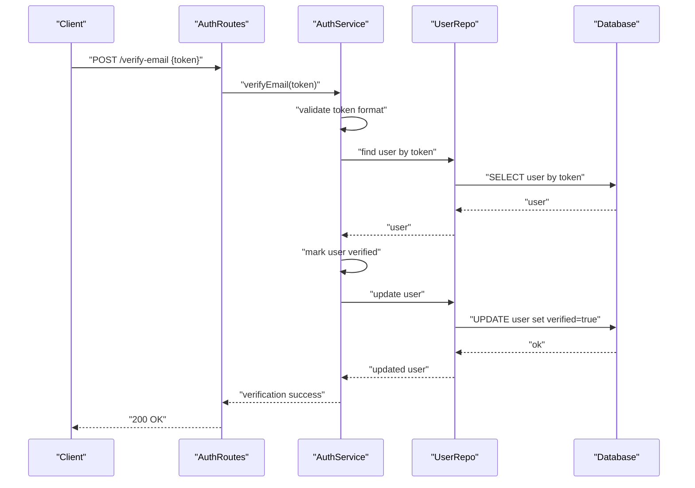

**Diagram sources**
- [AuthRoutes.ts](file://Backend/src/routes/AuthRoutes.ts)
- [AuthService.ts](file://Backend/src/services/AuthService.ts)
- [UserRepo.ts](file://Backend/src/repos/UserRepo.ts)
- [schema.prisma](file://Backend/prisma/schema.prisma)

**Section sources**
- [AuthRoutes.ts](file://Backend/src/routes/AuthRoutes.ts)
- [AuthService.ts](file://Backend/src/services/AuthService.ts)
- [UserRepo.ts](file://Backend/src/repos/UserRepo.ts)
- [schema.prisma](file://Backend/prisma/schema.prisma)

### User Registration Workflow
- Validates email uniqueness and password strength.
- Hashes password and creates user record.
- Returns minimal user info without sensitive data.

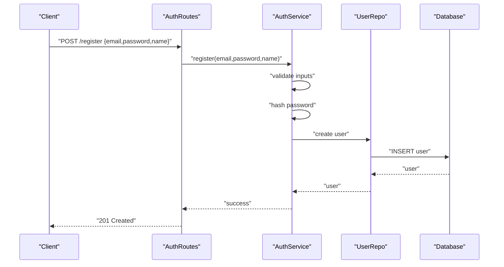

**Diagram sources**
- [AuthRoutes.ts](file://Backend/src/routes/AuthRoutes.ts)
- [AuthService.ts](file://Backend/src/services/AuthService.ts)
- [UserRepo.ts](file://Backend/src/repos/UserRepo.ts)
- [schema.prisma](file://Backend/prisma/schema.prisma)

**Section sources**
- [AuthRoutes.ts](file://Backend/src/routes/AuthRoutes.ts)
- [AuthService.ts](file://Backend/src/services/AuthService.ts)
- [UserRepo.ts](file://Backend/src/repos/UserRepo.ts)
- [schema.prisma](file://Backend/prisma/schema.prisma)

### Profile Updates
- Requires authenticated request.
- Validates allowed fields and constraints.
- Updates only permitted attributes to prevent overwriting sensitive data.

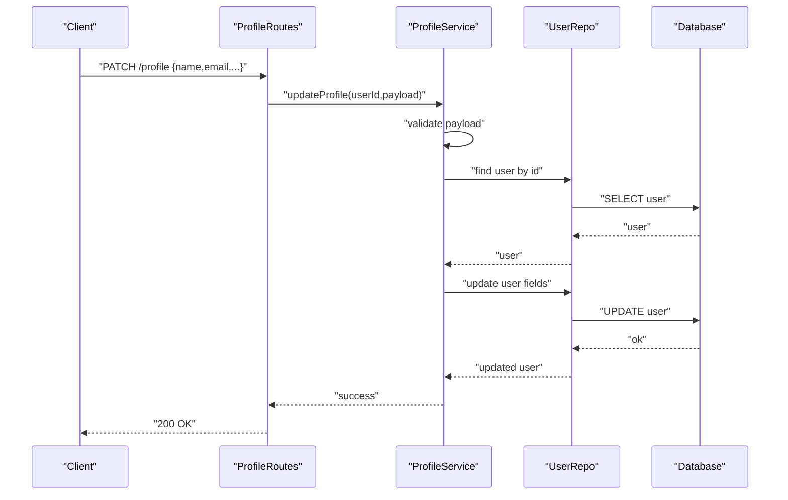

**Diagram sources**
- [ProfileRoutes.ts](file://Backend/src/routes/ProfileRoutes.ts)
- [ProfileService.ts](file://Backend/src/services/ProfileService.ts)
- [UserRepo.ts](file://Backend/src/repos/UserRepo.ts)
- [schema.prisma](file://Backend/prisma/schema.prisma)

**Section sources**
- [ProfileRoutes.ts](file://Backend/src/routes/ProfileRoutes.ts)
- [ProfileService.ts](file://Backend/src/services/ProfileService.ts)
- [UserRepo.ts](file://Backend/src/repos/UserRepo.ts)
- [schema.prisma](file://Backend/prisma/schema.prisma)

### Account Deletion Workflow
- Requires strong authentication (e.g., re-enter password or confirmation).
- Deletes user record and related data if cascading.
- Returns confirmation and ensures no residual sensitive data remains.

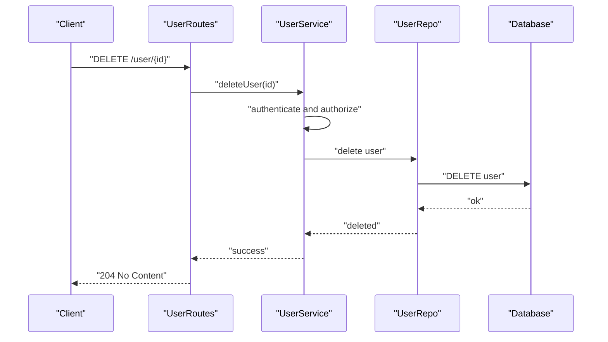

**Diagram sources**
- [UserRoutes.ts](file://Backend/src/routes/UserRoutes.ts)
- [UserService.ts](file://Backend/src/services/UserService.ts)
- [UserRepo.ts](file://Backend/src/repos/UserRepo.ts)
- [schema.prisma](file://Backend/prisma/schema.prisma)

**Section sources**
- [UserRoutes.ts](file://Backend/src/routes/UserRoutes.ts)
- [UserService.ts](file://Backend/src/services/UserService.ts)
- [UserRepo.ts](file://Backend/src/repos/UserRepo.ts)
- [schema.prisma](file://Backend/prisma/schema.prisma)

### Authentication Flow
- Login verifies credentials and issues a token.
- Token-based sessions protect subsequent requests.
- Middleware validates tokens and attaches user context.

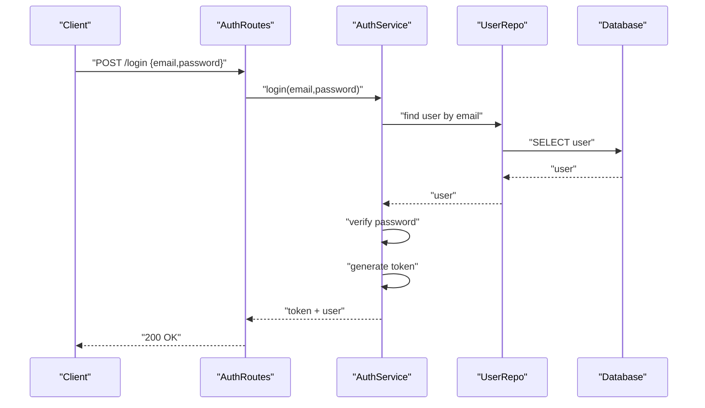

**Diagram sources**
- [AuthRoutes.ts](file://Backend/src/routes/AuthRoutes.ts)
- [AuthService.ts](file://Backend/src/services/AuthService.ts)
- [UserRepo.ts](file://Backend/src/repos/UserRepo.ts)
- [schema.prisma](file://Backend/prisma/schema.prisma)

**Section sources**
- [AuthRoutes.ts](file://Backend/src/routes/AuthRoutes.ts)
- [AuthService.ts](file://Backend/src/services/AuthService.ts)
- [UserRepo.ts](file://Backend/src/repos/UserRepo.ts)
- [schema.prisma](file://Backend/prisma/schema.prisma)

### Request Parsing and Validation
- Input parsing ensures correct types and formats.
- Validators enforce constraints like email format, password length, and field presence.
- Errors are standardized and returned consistently.

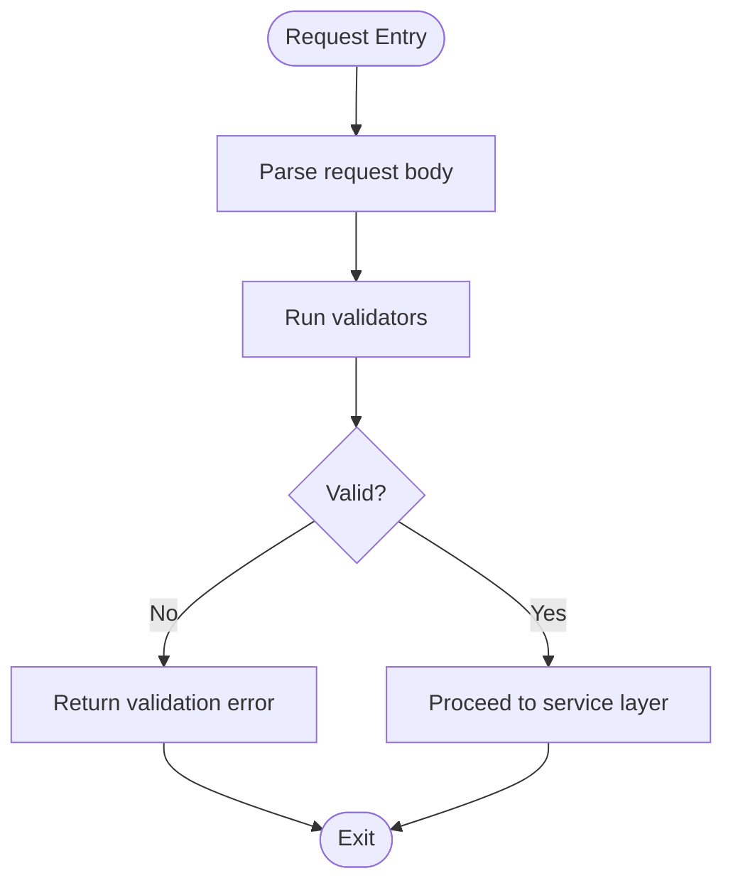

**Diagram sources**
- [parseReq.ts](file://Backend/src/routes/common/parseReq.ts)
- [validators.ts](file://Backend/src/common/utils/validators.ts)

**Section sources**
- [parseReq.ts](file://Backend/src/routes/common/parseReq.ts)
- [validators.ts](file://Backend/src/common/utils/validators.ts)

### Security Best Practices
- Use bcrypt with appropriate salt rounds from environment configuration.
- Never log or return sensitive fields like password or tokens.
- Enforce HTTPS and secure cookie policies for tokens.
- Apply rate limiting and account lockout strategies for login attempts.
- Validate and sanitize all inputs to prevent injection attacks.

[No sources needed since this section provides general guidance]

## Dependency Analysis
The user management components have clear dependencies:
- Routes depend on services for business logic.
- Services depend on repositories for data access.
- Repositories depend on Prisma schema and database.
- Utilities provide shared validation and environment access.

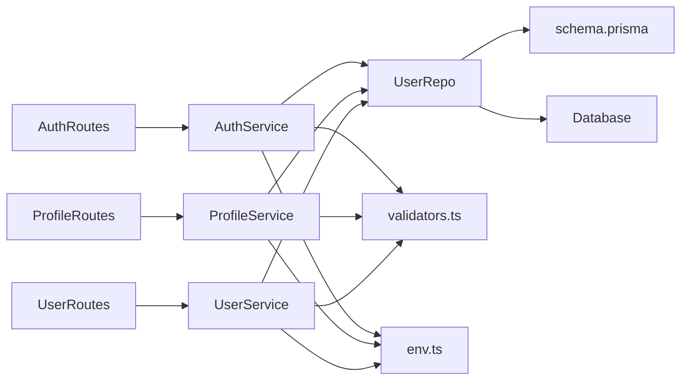

**Diagram sources**
- [AuthRoutes.ts](file://Backend/src/routes/AuthRoutes.ts)
- [ProfileRoutes.ts](file://Backend/src/routes/ProfileRoutes.ts)
- [UserRoutes.ts](file://Backend/src/routes/UserRoutes.ts)
- [AuthService.ts](file://Backend/src/services/AuthService.ts)
- [ProfileService.ts](file://Backend/src/services/ProfileService.ts)
- [UserService.ts](file://Backend/src/services/UserService.ts)
- [UserRepo.ts](file://Backend/src/repos/UserRepo.ts)
- [schema.prisma](file://Backend/prisma/schema.prisma)
- [validators.ts](file://Backend/src/common/utils/validators.ts)
- [env.ts](file://Backend/src/common/constants/env.ts)

**Section sources**
- [AuthRoutes.ts](file://Backend/src/routes/AuthRoutes.ts)
- [ProfileRoutes.ts](file://Backend/src/routes/ProfileRoutes.ts)
- [UserRoutes.ts](file://Backend/src/routes/UserRoutes.ts)
- [AuthService.ts](file://Backend/src/services/AuthService.ts)
- [ProfileService.ts](file://Backend/src/services/ProfileService.ts)
- [UserService.ts](file://Backend/src/services/UserService.ts)
- [UserRepo.ts](file://Backend/src/repos/UserRepo.ts)
- [schema.prisma](file://Backend/prisma/schema.prisma)
- [validators.ts](file://Backend/src/common/utils/validators.ts)
- [env.ts](file://Backend/src/common/constants/env.ts)

## Performance Considerations
- Index frequently queried fields like email to speed up lookups.
- Use Prisma transactions for multi-step operations to maintain consistency.
- Avoid returning large payloads; project only necessary fields.
- Cache tokens and session data where appropriate to reduce DB load.
- Monitor bcrypt cost factor to balance security and latency.

[No sources needed since this section provides general guidance]

## Troubleshooting Guide
Common issues and resolutions:
- Duplicate email during registration: Ensure uniqueness checks and return clear errors.
- Invalid token during verification: Validate token format and expiration.
- Permission denied on profile update: Confirm authentication middleware is applied.
- Database connection failures: Check Prisma client initialization and environment variables.

**Section sources**
- [UserService.ts](file://Backend/src/services/UserService.ts)
- [AuthService.ts](file://Backend/src/services/AuthService.ts)
- [ProfileService.ts](file://Backend/src/services/ProfileService.ts)
- [UserRepo.ts](file://Backend/src/repos/UserRepo.ts)
- [prisma.ts](file://Backend/src/repos/prisma.ts)

## Conclusion
The user management system implements secure registration, login, profile updates, and account deletion with robust validation and hashing. The layered architecture promotes clarity and maintainability. Following the best practices outlined here will help ensure reliability, security, and performance.

[No sources needed since this section summarizes without analyzing specific files]

## Appendices

### API Examples
- Register: POST /register with email, password, name
- Login: POST /login with email, password
- Verify Email: POST /verify-email with token
- Update Profile: PATCH /profile with allowed fields
- Delete Account: DELETE /user/{id}

[No sources needed since this section provides general guidance]

### Testing References
- Unit tests for user flows demonstrate expected behaviors and error handling.

**Section sources**
- [users.test.ts](file://Backend/tests/users.test.ts)