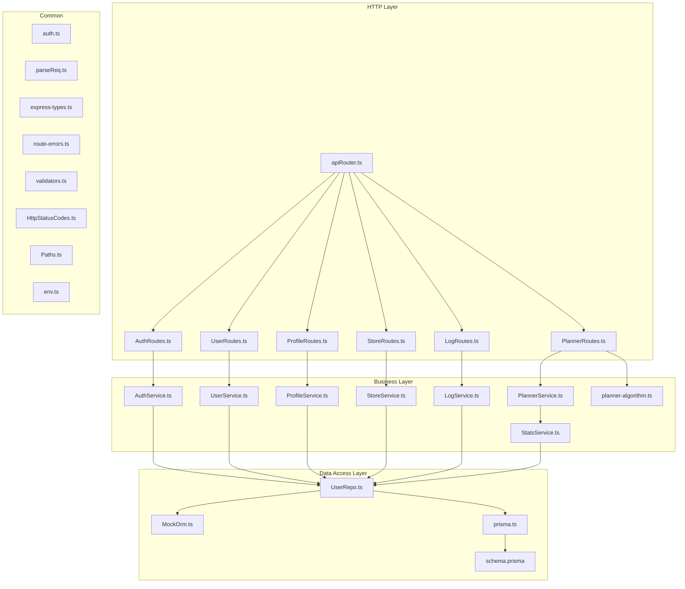
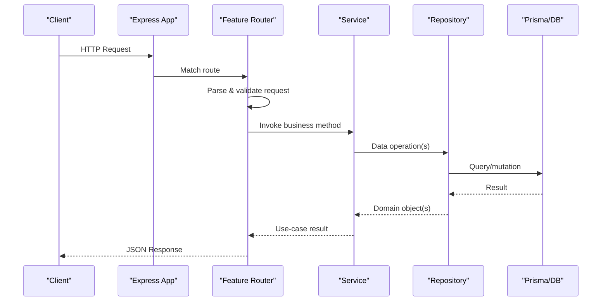
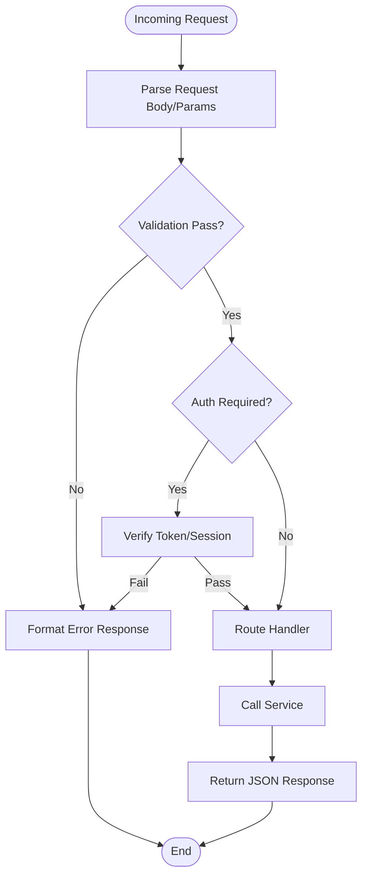
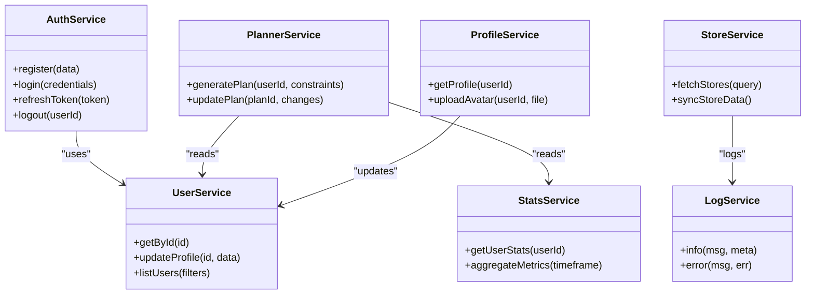
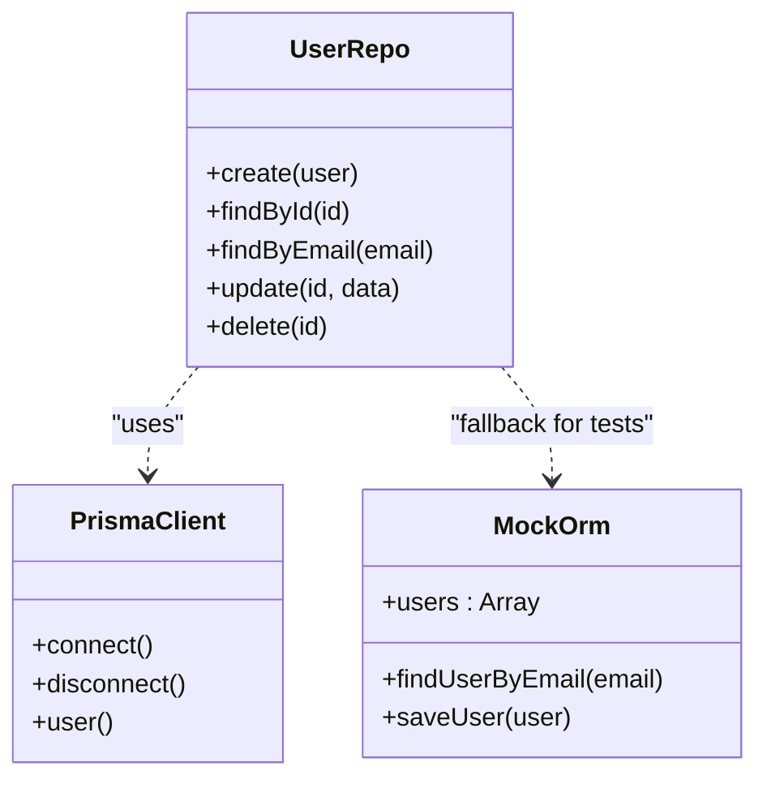
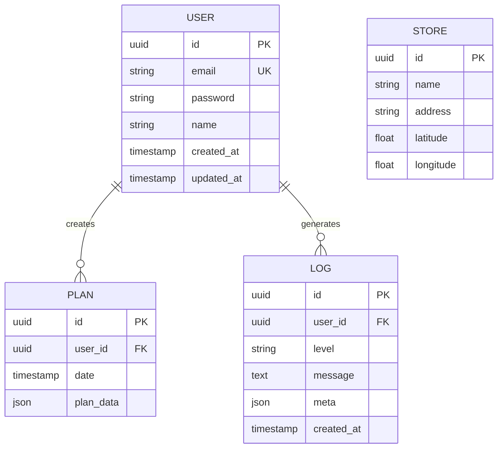
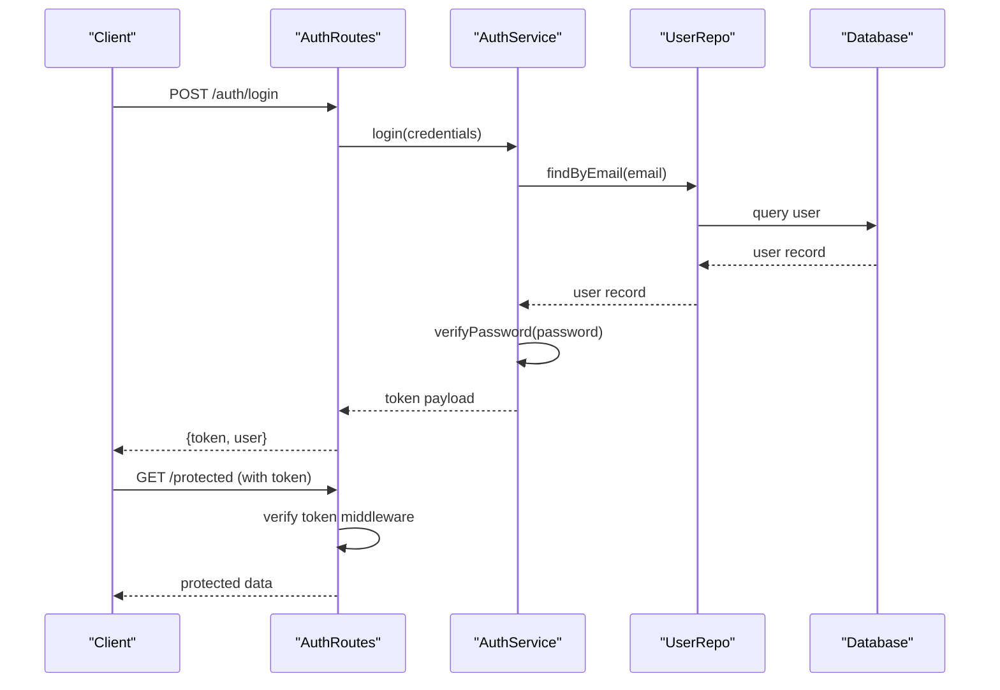
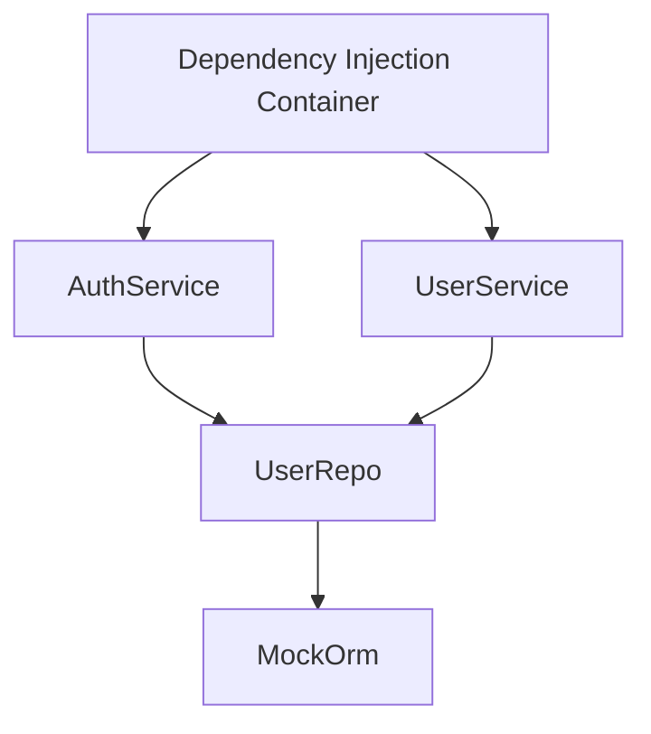
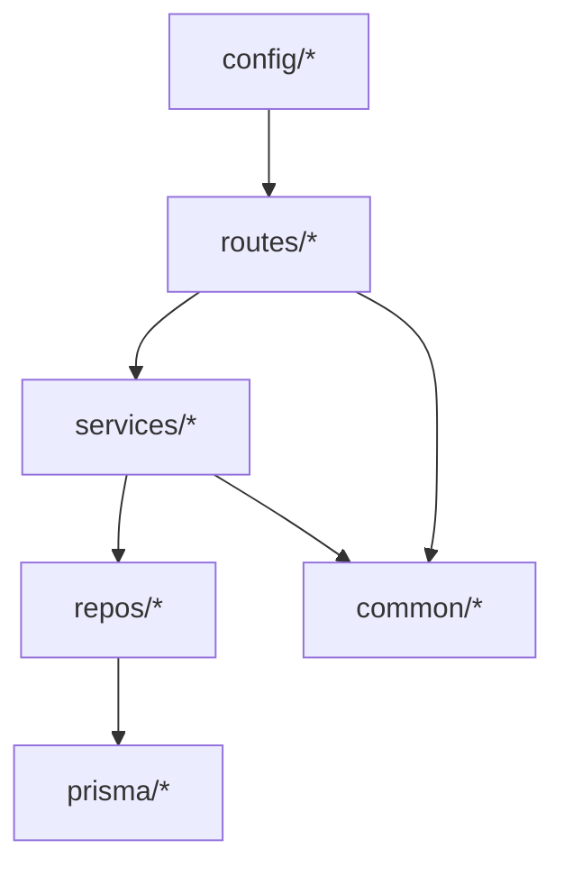
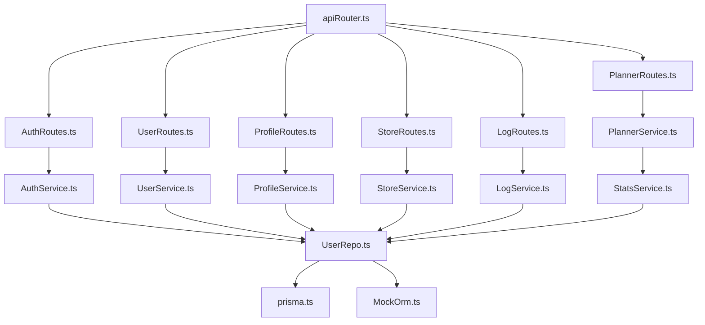

# Backend Architecture

<cite>
**Referenced Files in This Document**
- [main.ts](file://Backend/src/main.ts)
- [server.ts](file://Backend/src/server.ts)
- [apiRouter.ts](file://Backend/src/routes/apiRouter.ts)
- [AuthRoutes.ts](file://Backend/src/routes/AuthRoutes.ts)
- [UserRoutes.ts](file://Backend/src/routes/UserRoutes.ts)
- [PlannerRoutes.ts](file://Backend/src/routes/PlannerRoutes.ts)
- [ProfileRoutes.ts](file://Backend/src/routes/ProfileRoutes.ts)
- [StoreRoutes.ts](file://Backend/src/routes/StoreRoutes.ts)
- [LogRoutes.ts](file://Backend/src/routes/LogRoutes.ts)
- [AuthService.ts](file://Backend/src/services/AuthService.ts)
- [UserService.ts](file://Backend/src/services/UserService.ts)
- [PlannerService.ts](file://Backend/src/services/PlannerService.ts)
- [ProfileService.ts](file://Backend/src/services/ProfileService.ts)
- [StoreService.ts](file://Backend/src/services/StoreService.ts)
- [LogService.ts](file://Backend/src/services/LogService.ts)
- [StatsService.ts](file://Backend/src/services/StatsService.ts)
- [planner-algorithm.ts](file://Backend/src/services/planner-algorithm.ts)
- [UserRepo.ts](file://Backend/src/repos/UserRepo.ts)
- [MockOrm.ts](file://Backend/src/repos/MockOrm.ts)
- [prisma.ts](file://Backend/src/repos/prisma.ts)
- [auth.ts](file://Backend/src/routes/common/auth.ts)
- [parseReq.ts](file://Backend/src/routes/common/parseReq.ts)
- [express-types.ts](file://Backend/src/routes/common/express-types.ts)
- [route-errors.ts](file://Backend/src/common/utils/route-errors.ts)
- [validators.ts](file://Backend/src/common/utils/validators.ts)
- [HttpStatusCodes.ts](file://Backend/src/common/constants/HttpStatusCodes.ts)
- [Paths.ts](file://Backend/src/common/constants/Paths.ts)
- [env.ts](file://Backend/src/common/constants/env.ts)
- [schema.prisma](file://Backend/prisma/schema.prisma)
</cite>

## Table of Contents
1. [Introduction](#introduction)
2. [Project Structure](#project-structure)
3. [Core Components](#core-components)
4. [Architecture Overview](#architecture-overview)
5. [Detailed Component Analysis](#detailed-component-analysis)
6. [Dependency Analysis](#dependency-analysis)
7. [Performance Considerations](#performance-considerations)
8. [Troubleshooting Guide](#troubleshooting-guide)
9. [Conclusion](#conclusion)

## Introduction
This document describes the backend architecture of the Express.js server for the StudentBite application. It explains the layered design with routes, services, repositories, and database access, along with middleware configuration, error handling strategies, authentication flow, service layer design, dependency injection patterns, and module organization. The goal is to make the system understandable for both technical and non-technical readers while providing concrete references to source files.

## Project Structure
The backend follows a clear separation of concerns:
- Routes: HTTP endpoints that parse requests and delegate to services.
- Services: Business logic and orchestration, independent of HTTP concerns.
- Repositories: Data access abstractions over Prisma or mock implementations.
- Common utilities: Validation, constants, error helpers, and shared types.
- Configuration: Environment variables and app bootstrap.

**Diagram sources**
- [apiRouter.ts](file://Backend/src/routes/apiRouter.ts)
- [AuthRoutes.ts](file://Backend/src/routes/AuthRoutes.ts)
- [UserRoutes.ts](file://Backend/src/routes/UserRoutes.ts)
- [PlannerRoutes.ts](file://Backend/src/routes/PlannerRoutes.ts)
- [ProfileRoutes.ts](file://Backend/src/routes/ProfileRoutes.ts)
- [StoreRoutes.ts](file://Backend/src/routes/StoreRoutes.ts)
- [LogRoutes.ts](file://Backend/src/routes/LogRoutes.ts)
- [AuthService.ts](file://Backend/src/services/AuthService.ts)
- [UserService.ts](file://Backend/src/services/UserService.ts)
- [PlannerService.ts](file://Backend/src/services/PlannerService.ts)
- [ProfileService.ts](file://Backend/src/services/ProfileService.ts)
- [StoreService.ts](file://Backend/src/services/StoreService.ts)
- [LogService.ts](file://Backend/src/services/LogService.ts)
- [StatsService.ts](file://Backend/src/services/StatsService.ts)
- [planner-algorithm.ts](file://Backend/src/services/planner-algorithm.ts)
- [UserRepo.ts](file://Backend/src/repos/UserRepo.ts)
- [MockOrm.ts](file://Backend/src/repos/MockOrm.ts)
- [prisma.ts](file://Backend/src/repos/prisma.ts)
- [schema.prisma](file://Backend/prisma/schema.prisma)
- [auth.ts](file://Backend/src/routes/common/auth.ts)
- [parseReq.ts](file://Backend/src/routes/common/parseReq.ts)
- [express-types.ts](file://Backend/src/routes/common/express-types.ts)
- [route-errors.ts](file://Backend/src/common/utils/route-errors.ts)
- [validators.ts](file://Backend/src/common/utils/validators.ts)
- [HttpStatusCodes.ts](file://Backend/src/common/constants/HttpStatusCodes.ts)
- [Paths.ts](file://Backend/src/common/constants/Paths.ts)
- [env.ts](file://Backend/src/common/constants/env.ts)

**Section sources**
- [main.ts](file://Backend/src/main.ts)
- [server.ts](file://Backend/src/server.ts)
- [apiRouter.ts](file://Backend/src/routes/apiRouter.ts)

## Core Components
- Application bootstrap: Initializes environment, configures Express, registers middleware, mounts routers, and starts the server.
- Router composition: Central router aggregates feature-specific routers under defined paths.
- Middleware: Authentication guard, request parsing, validation, and error formatting.
- Services: Encapsulate business rules, coordinate multiple repositories, and return domain objects.
- Repositories: Abstract data operations behind interfaces; implement Prisma-based persistence and a mock ORM for tests.
- Database schema: Single source of truth for models and relations via Prisma.

Key responsibilities:
- Routes: Validate inputs, call services, format responses.
- Services: Implement use cases (e.g., login, user management, planning, store operations).
- Repositories: Provide CRUD and query methods; hide SQL/Prisma details from services.
- Common: Shared utilities, constants, and type definitions.

**Section sources**
- [server.ts](file://Backend/src/server.ts)
- [apiRouter.ts](file://Backend/src/routes/apiRouter.ts)
- [auth.ts](file://Backend/src/routes/common/auth.ts)
- [parseReq.ts](file://Backend/src/routes/common/parseReq.ts)
- [validators.ts](file://Backend/src/common/utils/validators.ts)
- [route-errors.ts](file://Backend/src/common/utils/route-errors.ts)
- [HttpStatusCodes.ts](file://Backend/src/common/constants/HttpStatusCodes.ts)
- [Paths.ts](file://Backend/src/common/constants/Paths.ts)
- [env.ts](file://Backend/src/common/constants/env.ts)

## Architecture Overview
The backend uses a layered architecture:
- HTTP Layer (routes) handles routing, input parsing, and response formatting.
- Service Layer encapsulates business logic and orchestrates repository calls.
- Repository Layer abstracts data access using Prisma or a mock implementation.
- Common utilities provide cross-cutting concerns like validation and error mapping.

**Diagram sources**
- [server.ts](file://Backend/src/server.ts)
- [apiRouter.ts](file://Backend/src/routes/apiRouter.ts)
- [AuthRoutes.ts](file://Backend/src/routes/AuthRoutes.ts)
- [AuthService.ts](file://Backend/src/services/AuthService.ts)
- [UserRepo.ts](file://Backend/src/repos/UserRepo.ts)
- [prisma.ts](file://Backend/src/repos/prisma.ts)

## Detailed Component Analysis

### HTTP Layer: Routers and Middleware
- Central router composes feature routers under base paths.
- Feature routers define endpoints for auth, users, planner, profile, stores, and logs.
- Common middleware includes authentication guards, request parsing, and validation helpers.

**Diagram sources**
- [apiRouter.ts](file://Backend/src/routes/apiRouter.ts)
- [AuthRoutes.ts](file://Backend/src/routes/AuthRoutes.ts)
- [UserRoutes.ts](file://Backend/src/routes/UserRoutes.ts)
- [PlannerRoutes.ts](file://Backend/src/routes/PlannerRoutes.ts)
- [ProfileRoutes.ts](file://Backend/src/routes/ProfileRoutes.ts)
- [StoreRoutes.ts](file://Backend/src/routes/StoreRoutes.ts)
- [LogRoutes.ts](file://Backend/src/routes/LogRoutes.ts)
- [auth.ts](file://Backend/src/routes/common/auth.ts)
- [parseReq.ts](file://Backend/src/routes/common/parseReq.ts)
- [validators.ts](file://Backend/src/common/utils/validators.ts)
- [route-errors.ts](file://Backend/src/common/utils/route-errors.ts)
- [HttpStatusCodes.ts](file://Backend/src/common/constants/HttpStatusCodes.ts)

**Section sources**
- [apiRouter.ts](file://Backend/src/routes/apiRouter.ts)
- [AuthRoutes.ts](file://Backend/src/routes/AuthRoutes.ts)
- [UserRoutes.ts](file://Backend/src/routes/UserRoutes.ts)
- [PlannerRoutes.ts](file://Backend/src/routes/PlannerRoutes.ts)
- [ProfileRoutes.ts](file://Backend/src/routes/ProfileRoutes.ts)
- [StoreRoutes.ts](file://Backend/src/routes/StoreRoutes.ts)
- [LogRoutes.ts](file://Backend/src/routes/LogRoutes.ts)
- [auth.ts](file://Backend/src/routes/common/auth.ts)
- [parseReq.ts](file://Backend/src/routes/common/parseReq.ts)
- [validators.ts](file://Backend/src/common/utils/validators.ts)
- [route-errors.ts](file://Backend/src/common/utils/route-errors.ts)
- [HttpStatusCodes.ts](file://Backend/src/common/constants/HttpStatusCodes.ts)

### Service Layer: Business Logic and Orchestration
Services implement domain use cases:
- AuthService: Handles registration, login, token issuance, and session management.
- UserService: Manages user profiles, preferences, and related data.
- PlannerService: Coordinates meal planning algorithms and data retrieval.
- ProfileService: Handles profile updates and avatar/media metadata.
- StoreService: Integrates with store data sources and caching.
- LogService: Records audit and diagnostic logs.
- StatsService: Aggregates metrics and analytics.

**Diagram sources**
- [AuthService.ts](file://Backend/src/services/AuthService.ts)
- [UserService.ts](file://Backend/src/services/UserService.ts)
- [PlannerService.ts](file://Backend/src/services/PlannerService.ts)
- [ProfileService.ts](file://Backend/src/services/ProfileService.ts)
- [StoreService.ts](file://Backend/src/services/StoreService.ts)
- [LogService.ts](file://Backend/src/services/LogService.ts)
- [StatsService.ts](file://Backend/src/services/StatsService.ts)

**Section sources**
- [AuthService.ts](file://Backend/src/services/AuthService.ts)
- [UserService.ts](file://Backend/src/services/UserService.ts)
- [PlannerService.ts](file://Backend/src/services/PlannerService.ts)
- [ProfileService.ts](file://Backend/src/services/ProfileService.ts)
- [StoreService.ts](file://Backend/src/services/StoreService.ts)
- [LogService.ts](file://Backend/src/services/LogService.ts)
- [StatsService.ts](file://Backend/src/services/StatsService.ts)

### Repository Layer: Data Abstraction
Repositories abstract data operations:
- UserRepo: Provides user-related queries and mutations.
- MockOrm: In-memory implementation used in tests.
- prisma.ts: Prisma client initialization and connection management.

**Diagram sources**
- [UserRepo.ts](file://Backend/src/repos/UserRepo.ts)
- [MockOrm.ts](file://Backend/src/repos/MockOrm.ts)
- [prisma.ts](file://Backend/src/repos/prisma.ts)

**Section sources**
- [UserRepo.ts](file://Backend/src/repos/UserRepo.ts)
- [MockOrm.ts](file://Backend/src/repos/MockOrm.ts)
- [prisma.ts](file://Backend/src/repos/prisma.ts)

### Database Schema and Models
- Prisma schema defines entities, relations, and constraints.
- Migrations manage schema evolution.
- Seed script populates initial data.

**Diagram sources**
- [schema.prisma](file://Backend/prisma/schema.prisma)

**Section sources**
- [schema.prisma](file://Backend/prisma/schema.prisma)

### Authentication Flow
Authentication is implemented via middleware and service methods:
- Routes protect endpoints using an auth guard.
- AuthService validates credentials and issues tokens.
- Tokens are verified on subsequent requests.

**Diagram sources**
- [AuthRoutes.ts](file://Backend/src/routes/AuthRoutes.ts)
- [AuthService.ts](file://Backend/src/services/AuthService.ts)
- [UserRepo.ts](file://Backend/src/repos/UserRepo.ts)
- [auth.ts](file://Backend/src/routes/common/auth.ts)

**Section sources**
- [AuthRoutes.ts](file://Backend/src/routes/AuthRoutes.ts)
- [AuthService.ts](file://Backend/src/services/AuthService.ts)
- [auth.ts](file://Backend/src/routes/common/auth.ts)

### Dependency Injection Patterns
- Services receive dependencies through constructor parameters or factory functions.
- Repositories are injected into services to decouple business logic from data access.
- Test environments can swap real repositories with mocks.

**Diagram sources**
- [AuthService.ts](file://Backend/src/services/AuthService.ts)
- [UserService.ts](file://Backend/src/services/UserService.ts)
- [UserRepo.ts](file://Backend/src/repos/UserRepo.ts)
- [MockOrm.ts](file://Backend/src/repos/MockOrm.ts)

**Section sources**
- [AuthService.ts](file://Backend/src/services/AuthService.ts)
- [UserService.ts](file://Backend/src/services/UserService.ts)
- [UserRepo.ts](file://Backend/src/repos/UserRepo.ts)
- [MockOrm.ts](file://Backend/src/repos/MockOrm.ts)

### Module Organization
- Routes grouped by feature with shared common utilities.
- Services encapsulated per domain area.
- Repositories abstracted per entity with consistent interfaces.
- Constants and validators centralized for reuse.

**Diagram sources**
- [apiRouter.ts](file://Backend/src/routes/apiRouter.ts)
- [AuthService.ts](file://Backend/src/services/AuthService.ts)
- [UserRepo.ts](file://Backend/src/repos/UserRepo.ts)
- [env.ts](file://Backend/src/common/constants/env.ts)
- [schema.prisma](file://Backend/prisma/schema.prisma)

**Section sources**
- [apiRouter.ts](file://Backend/src/routes/apiRouter.ts)
- [env.ts](file://Backend/src/common/constants/env.ts)
- [schema.prisma](file://Backend/prisma/schema.prisma)

## Dependency Analysis
The following diagram shows key dependencies between modules:

**Diagram sources**
- [apiRouter.ts](file://Backend/src/routes/apiRouter.ts)
- [AuthRoutes.ts](file://Backend/src/routes/AuthRoutes.ts)
- [UserRoutes.ts](file://Backend/src/routes/UserRoutes.ts)
- [PlannerRoutes.ts](file://Backend/src/routes/PlannerRoutes.ts)
- [ProfileRoutes.ts](file://Backend/src/routes/ProfileRoutes.ts)
- [StoreRoutes.ts](file://Backend/src/routes/StoreRoutes.ts)
- [LogRoutes.ts](file://Backend/src/routes/LogRoutes.ts)
- [AuthService.ts](file://Backend/src/services/AuthService.ts)
- [UserService.ts](file://Backend/src/services/UserService.ts)
- [PlannerService.ts](file://Backend/src/services/PlannerService.ts)
- [ProfileService.ts](file://Backend/src/services/ProfileService.ts)
- [StoreService.ts](file://Backend/src/services/StoreService.ts)
- [LogService.ts](file://Backend/src/services/LogService.ts)
- [StatsService.ts](file://Backend/src/services/StatsService.ts)
- [UserRepo.ts](file://Backend/src/repos/UserRepo.ts)
- [MockOrm.ts](file://Backend/src/repos/MockOrm.ts)
- [prisma.ts](file://Backend/src/repos/prisma.ts)

**Section sources**
- [apiRouter.ts](file://Backend/src/routes/apiRouter.ts)
- [AuthService.ts](file://Backend/src/services/AuthService.ts)
- [UserRepo.ts](file://Backend/src/repos/UserRepo.ts)
- [prisma.ts](file://Backend/src/repos/prisma.ts)

## Performance Considerations
- Connection pooling: Ensure Prisma client is reused across requests to minimize overhead.
- Caching: Introduce in-memory or external cache for frequently accessed data (e.g., store listings).
- Pagination: Apply pagination on list endpoints to reduce payload size.
- Validation: Keep validation lightweight and close to input boundaries.
- Logging: Use structured logging with sampling for high-volume endpoints.

[No sources needed since this section provides general guidance]

## Troubleshooting Guide
Common issues and resolutions:
- Authentication failures: Verify token presence, expiration, and secret configuration.
- Validation errors: Check request payloads against validators and ensure required fields.
- Database connectivity: Confirm environment variables and Prisma connection strings.
- Error formatting: Use centralized error utilities to map exceptions to HTTP responses.

**Section sources**
- [auth.ts](file://Backend/src/routes/common/auth.ts)
- [validators.ts](file://Backend/src/common/utils/validators.ts)
- [route-errors.ts](file://Backend/src/common/utils/route-errors.ts)
- [HttpStatusCodes.ts](file://Backend/src/common/constants/HttpStatusCodes.ts)
- [env.ts](file://Backend/src/common/constants/env.ts)

## Conclusion
The backend implements a robust layered architecture with clear separation between HTTP, business logic, and data access. Middleware and error handling are centralized for consistency. Services encapsulate domain logic and rely on repositories for data operations. Dependency injection enables testability and flexibility. The Prisma schema serves as the single source of truth for data models. This structure supports scalability, maintainability, and clarity for future enhancements.

[No sources needed since this section summarizes without analyzing specific files]