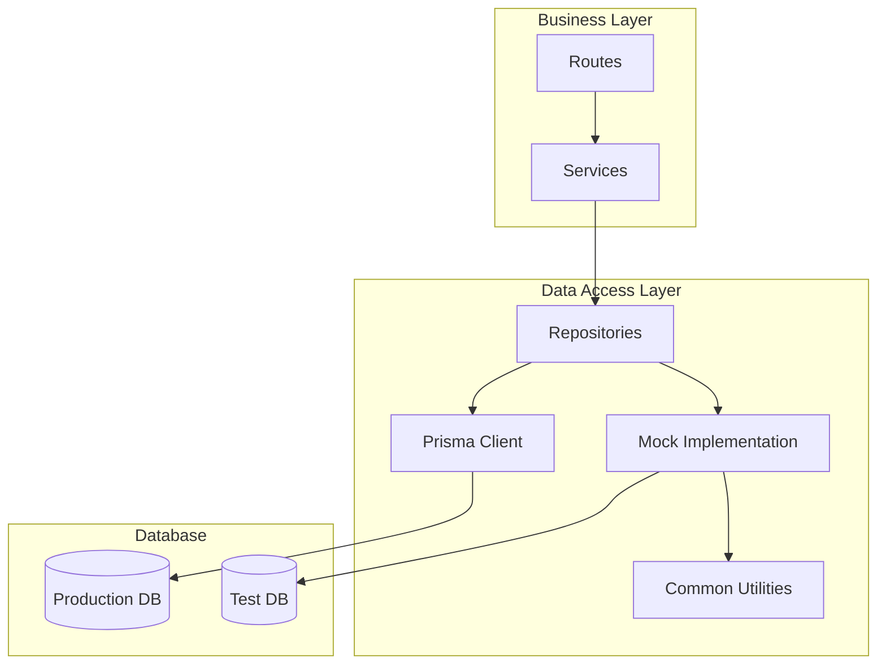
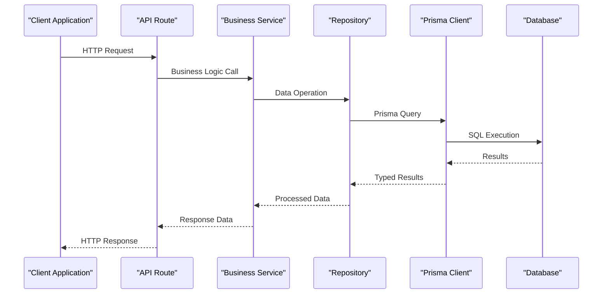
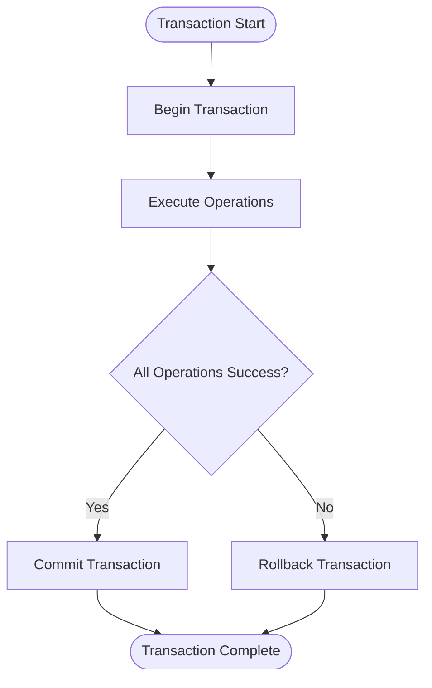
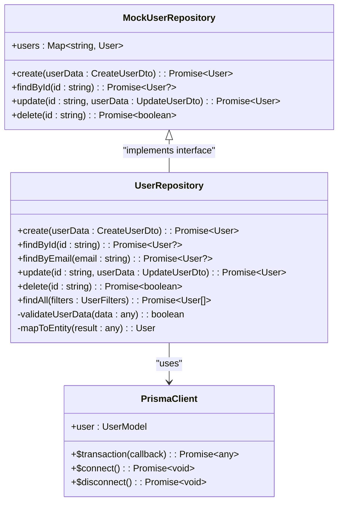
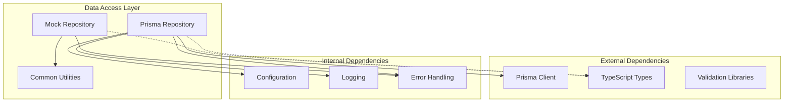

# Data Access Layer

<cite>
**Referenced Files in This Document**
- [schema.prisma](file://Backend/prisma/schema.prisma)
- [prisma.ts](file://Backend/src/repos/prisma.ts)
- [MockOrm.ts](file://Backend/src/repos/MockOrm.ts)
- [UserRepo.ts](file://Backend/src/repos/UserRepo.ts)
- [database.json](file://Backend/src/repos/common/database.json)
- [database.test.json](file://Backend/src/repos/common/database.test.json)
- [UserService.ts](file://Backend/src/services/UserService.ts)
- [main.ts](file://Backend/src/main.ts)
- [seed.ts](file://Backend/prisma/seed.ts)
</cite>

## Table of Contents
1. [Introduction](#introduction)
2. [Project Structure](#project-structure)
3. [Core Components](#core-components)
4. [Architecture Overview](#architecture-overview)
5. [Detailed Component Analysis](#detailed-component-analysis)
6. [Dependency Analysis](#dependency-analysis)
7. [Performance Considerations](#performance-considerations)
8. [Troubleshooting Guide](#troubleshooting-guide)
9. [Conclusion](#conclusion)
10. [Appendices](#appendices)

## Introduction

This document provides comprehensive documentation for the data access layer implementation in the StudentBite application. The system uses Prisma ORM as the primary database abstraction layer, implementing the repository pattern for clean separation of concerns and testability. The architecture supports both production database operations and mock implementations for testing scenarios.

The data access layer is designed with several key principles:
- **Abstraction**: Repository pattern isolates database logic from business logic
- **Testability**: Mock implementations enable comprehensive unit and integration testing
- **Type Safety**: TypeScript integration with Prisma's generated types
- **Connection Management**: Efficient database connection pooling and lifecycle management
- **Query Optimization**: Strategic use of Prisma's query capabilities for optimal performance

## Project Structure

The data access layer follows a modular architecture organized by functionality:

**Diagram sources**
- [prisma.ts](file://Backend/src/repos/prisma.ts)
- [MockOrm.ts](file://Backend/src/repos/MockOrm.ts)
- [UserRepo.ts](file://Backend/src/repos/UserRepo.ts)

**Section sources**
- [main.ts](file://Backend/src/main.ts)
- [package.json](file://Backend/package.json)

## Core Components

### Prisma Client Configuration

The Prisma client serves as the primary database connection manager, handling connection pooling, query execution, and type generation.

#### Connection Management
- **Singleton Pattern**: Ensures single instance across the application
- **Connection Pooling**: Optimizes database connections for concurrent requests
- **Environment-based Configuration**: Supports different configurations for development, staging, and production
- **Graceful Shutdown**: Proper cleanup of database connections during application shutdown

#### Type Safety Integration
- **Schema-driven Types**: Automatic TypeScript type generation from Prisma schema
- **Compile-time Validation**: Query validation at compile time prevents runtime errors
- **IntelliSense Support**: Full IDE support for queries and relationships

### Repository Pattern Implementation

The repository pattern abstracts database operations behind clean interfaces, providing consistent CRUD operations and complex queries.

#### Key Features
- **Interface Abstraction**: Consistent API across different data sources
- **Transaction Support**: Atomic operations with rollback capabilities
- **Error Handling**: Centralized error handling and logging
- **Caching Strategy**: Optional caching layer for frequently accessed data

### Mock Database Implementation

The mock implementation enables testing without external dependencies, providing deterministic behavior for unit tests.

#### Testing Capabilities
- **In-memory Storage**: Fast, isolated data storage for tests
- **Configurable Responses**: Customizable behavior for different test scenarios
- **State Management**: Controlled state changes during test execution
- **Assertion Helpers**: Built-in utilities for verifying database operations

**Section sources**
- [prisma.ts](file://Backend/src/repos/prisma.ts)
- [MockOrm.ts](file://Backend/src/repos/MockOrm.ts)
- [UserRepo.ts](file://Backend/src/repos/UserRepo.ts)

## Architecture Overview

The data access layer follows a layered architecture that promotes separation of concerns and maintainability:

**Diagram sources**
- [UserRepo.ts](file://Backend/src/repos/UserRepo.ts)
- [UserService.ts](file://Backend/src/services/UserService.ts)
- [prisma.ts](file://Backend/src/repos/prisma.ts)

### Data Flow Patterns

The system implements several key data flow patterns:

1. **Request Processing**: HTTP requests flow through routes to services to repositories
2. **Query Construction**: Repositories build optimized queries using Prisma's fluent API
3. **Response Mapping**: Database results are transformed into domain-specific models
4. **Error Propagation**: Errors bubble up through layers with appropriate context

### Transaction Management

Transactions ensure data consistency across multiple operations:

**Diagram sources**
- [UserRepo.ts](file://Backend/src/repos/UserRepo.ts)

**Section sources**
- [prisma.ts](file://Backend/src/repos/prisma.ts)
- [UserRepo.ts](file://Backend/src/repos/UserRepo.ts)

## Detailed Component Analysis

### Prisma Client Module

The Prisma client module handles database connection management and provides the foundation for all database operations.

#### Connection Lifecycle
- **Initialization**: Lazy initialization with environment detection
- **Pooling**: Configurable connection pool settings
- **Health Checks**: Periodic connection health monitoring
- **Shutdown**: Graceful connection cleanup

#### Query Execution Pipeline
- **Query Building**: Fluent API for constructing complex queries
- **Parameter Binding**: Safe parameter interpolation preventing SQL injection
- **Result Mapping**: Automatic type conversion and validation
- **Performance Monitoring**: Query execution time tracking

### User Repository Implementation

The User repository demonstrates the repository pattern implementation with comprehensive CRUD operations and relationship handling.

#### CRUD Operations
- **Create**: Insert new user records with validation
- **Read**: Retrieve users by ID, email, or custom filters
- **Update**: Modify existing user data with partial updates
- **Delete**: Remove users with cascade operations

#### Relationship Queries
- **Nested Queries**: Fetch related entities in single queries
- **Eager Loading**: Optimize N+1 query problems
- **Filtering**: Apply filters across relationships
- **Pagination**: Efficient pagination for large datasets

**Diagram sources**
- [UserRepo.ts](file://Backend/src/repos/UserRepo.ts)
- [MockOrm.ts](file://Backend/src/repos/MockOrm.ts)
- [prisma.ts](file://Backend/src/repos/prisma.ts)

### Mock Database Implementation

The mock database provides an in-memory implementation for testing scenarios, ensuring fast and deterministic test execution.

#### In-memory Storage
- **Map-based Storage**: Efficient key-value storage for test data
- **Isolation**: Each test gets fresh data instances
- **Persistence**: Optional persistence between test runs
- **Reset Functions**: Easy data cleanup between tests

#### Test Utilities
- **Factory Functions**: Generate realistic test data
- **Assertion Helpers**: Verify database operations
- **Mock Services**: Replace external dependencies
- **Time Control**: Freeze time for timestamp-dependent tests

**Section sources**
- [UserRepo.ts](file://Backend/src/repos/UserRepo.ts)
- [MockOrm.ts](file://Backend/src/repos/MockOrm.ts)
- [database.json](file://Backend/src/repos/common/database.json)

### Database Schema Design

The Prisma schema defines the database structure with relationships and constraints:

#### Entity Relationships
- **One-to-Many**: Users to posts, orders to items
- **Many-to-Many**: Tags to articles, roles to permissions
- **Self-referencing**: Hierarchical categories, user followers
- **Optional Relations**: Nullable foreign keys for flexible schemas

#### Data Validation
- **Field Constraints**: Required fields, length limits, format validation
- **Unique Constraints**: Email uniqueness, username availability
- **Custom Validators**: Business rule validation at schema level
- **Migration Safety**: Version-controlled schema evolution

**Section sources**
- [schema.prisma](file://Backend/prisma/schema.prisma)
- [seed.ts](file://Backend/prisma/seed.ts)

## Dependency Analysis

The data access layer has well-defined dependencies that promote loose coupling and high cohesion:

**Diagram sources**
- [prisma.ts](file://Backend/src/repos/prisma.ts)
- [MockOrm.ts](file://Backend/src/repos/MockOrm.ts)
- [UserRepo.ts](file://Backend/src/repos/UserRepo.ts)

### Coupling Analysis
- **Low Coupling**: Repositories depend only on interfaces, not concrete implementations
- **High Cohesion**: Related functionality grouped within modules
- **Dependency Injection**: External dependencies injected for testability
- **Interface Segregation**: Small, focused interfaces for specific responsibilities

### Circular Dependencies
- **Prevention Strategy**: Careful interface design prevents circular imports
- **Lazy Loading**: Dynamic imports for heavy dependencies
- **Event-driven Communication**: Decoupled components via events

**Section sources**
- [prisma.ts](file://Backend/src/repos/prisma.ts)
- [MockOrm.ts](file://Backend/src/repos/MockOrm.ts)

## Performance Considerations

### Query Optimization Strategies

#### N+1 Query Prevention
- **Eager Loading**: Use `include` and `select` to fetch related data efficiently
- **Batch Queries**: Group similar queries to reduce database round trips
- **Connection Pooling**: Reuse database connections for concurrent requests

#### Indexing Strategy
- **Primary Keys**: Automatic indexing on primary keys
- **Foreign Keys**: Index foreign key columns for join optimization
- **Composite Indexes**: Multi-column indexes for complex queries
- **Partial Indexes**: Conditional indexes for filtered queries

#### Caching Layers
- **Query Cache**: Cache frequent read operations
- **Connection Cache**: Maintain persistent database connections
- **Result Cache**: Store computed results for expensive operations

### Memory Management
- **Stream Processing**: Handle large datasets with streaming
- **Garbage Collection**: Proper cleanup of temporary objects
- **Memory Limits**: Configure memory usage for large queries

### Connection Pooling
- **Pool Size**: Configure based on database capacity and application load
- **Timeout Settings**: Prevent connection leaks with proper timeouts
- **Health Monitoring**: Monitor connection pool utilization

## Troubleshooting Guide

### Common Issues and Solutions

#### Connection Problems
- **Connection Refused**: Verify database server is running and accessible
- **Authentication Failed**: Check credentials and database permissions
- **Connection Timeout**: Increase timeout values or optimize queries

#### Query Performance Issues
- **Slow Queries**: Use EXPLAIN ANALYZE to identify bottlenecks
- **Missing Indexes**: Add appropriate indexes for frequently queried columns
- **N+1 Problems**: Implement eager loading or batch queries

#### Memory Leaks
- **Unclosed Connections**: Ensure proper connection cleanup
- **Large Result Sets**: Use pagination or streaming for large datasets
- **Circular References**: Break circular references in object graphs

### Debugging Techniques

#### Logging Strategy
- **Structured Logging**: JSON-formatted logs for easy parsing
- **Correlation IDs**: Track requests across service boundaries
- **Performance Metrics**: Log query execution times and resource usage

#### Error Handling
- **Centralized Error Handler**: Consistent error responses across the application
- **Stack Traces**: Detailed error information for debugging
- **Context Preservation**: Include relevant context in error messages

**Section sources**
- [UserRepo.ts](file://Backend/src/repos/UserRepo.ts)
- [MockOrm.ts](file://Backend/src/repos/MockOrm.ts)

## Conclusion

The data access layer implementation provides a robust, scalable, and maintainable foundation for database operations in the StudentBite application. The combination of Prisma ORM, repository pattern, and mock implementations creates a flexible architecture that supports both production deployments and comprehensive testing strategies.

Key benefits of this approach include:
- **Type Safety**: Compile-time validation reduces runtime errors
- **Testability**: Mock implementations enable thorough testing
- **Performance**: Optimized queries and connection management
- **Maintainability**: Clean separation of concerns and clear interfaces
- **Scalability**: Efficient resource utilization and horizontal scaling support

The architecture is designed to evolve with application requirements while maintaining backward compatibility and performance characteristics.

## Appendices

### Migration Management

Database migrations are managed through Prisma's migration system:

#### Migration Workflow
1. **Schema Changes**: Modify Prisma schema
2. **Generate Migration**: Create migration files
3. **Review Changes**: Validate migration SQL
4. **Apply Migration**: Deploy to target environments
5. **Seed Data**: Populate initial or updated data

#### Best Practices
- **Version Control**: Track all schema changes in version control
- **Backup Strategy**: Backup databases before applying migrations
- **Rollback Plan**: Prepare rollback procedures for failed migrations
- **Testing**: Test migrations in staging environments first

### Environment Configuration

Different environments require specific configurations:

#### Development Environment
- **Local Database**: SQLite or local PostgreSQL instance
- **Verbose Logging**: Detailed logs for debugging
- **Hot Reload**: Automatic restart on code changes

#### Production Environment
- **Managed Database**: Cloud-hosted database service
- **Optimized Settings**: Tuned connection pools and timeouts
- **Monitoring**: Comprehensive performance and error monitoring

**Section sources**
- [seed.ts](file://Backend/prisma/seed.ts)
- [database.json](file://Backend/src/repos/common/database.json)