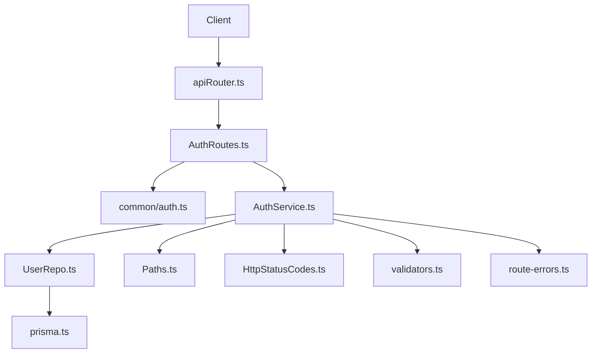
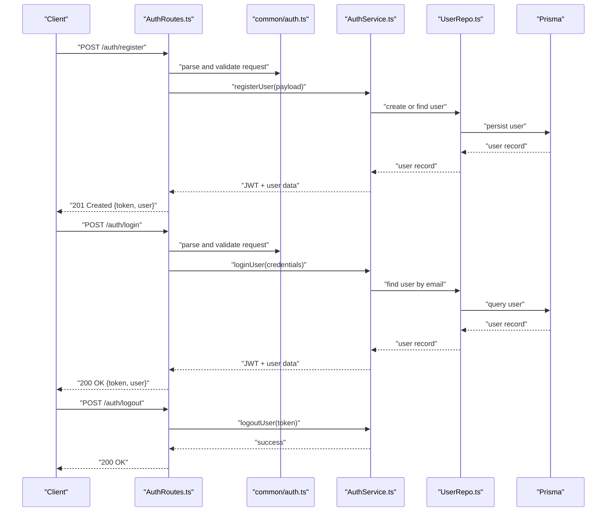
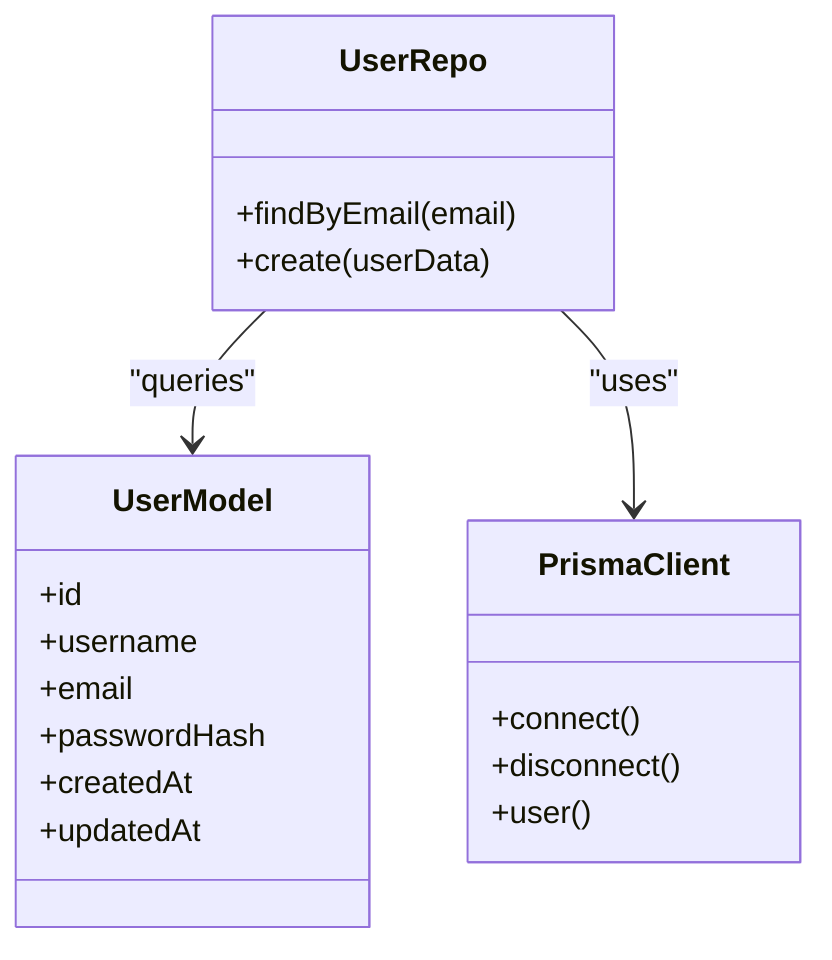
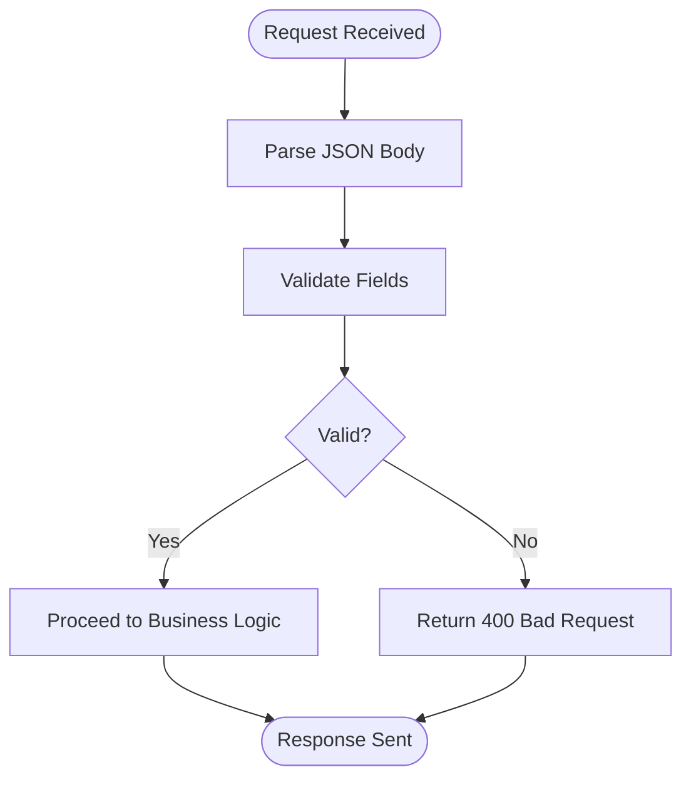
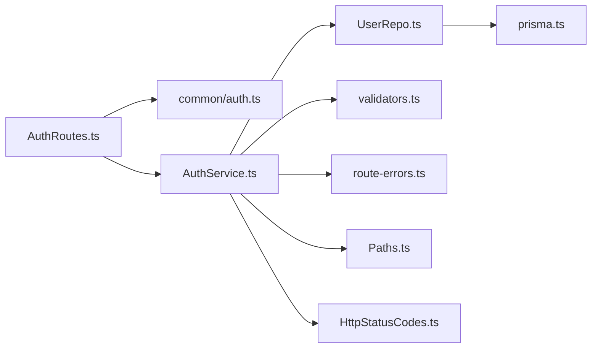

# Authentication Routes

<cite>
**Referenced Files in This Document**
- [AuthRoutes.ts](file://Backend/src/routes/AuthRoutes.ts)
- [auth.ts](file://Backend/src/routes/common/auth.ts)
- [AuthService.ts](file://Backend/src/services/AuthService.ts)
- [User.model.ts](file://Backend/src/models/User.model.ts)
- [UserRepo.ts](file://Backend/src/repos/UserRepo.ts)
- [prisma.ts](file://Backend/src/repos/prisma.ts)
- [apiRouter.ts](file://Backend/src/routes/apiRouter.ts)
- [main.ts](file://Backend/src/main.ts)
- [server.ts](file://Backend/src/server.ts)
- [Paths.ts](file://Backend/src/common/constants/Paths.ts)
- [HttpStatusCodes.ts](file://Backend/src/common/constants/HttpStatusCodes.ts)
- [route-errors.ts](file://Backend/src/common/utils/route-errors.ts)
- [validators.ts](file://Backend/src/common/utils/validators.ts)
</cite>

## Table of Contents
1. [Introduction](#introduction)
2. [Project Structure](#project-structure)
3. [Core Components](#core-components)
4. [Architecture Overview](#architecture-overview)
5. [Detailed Component Analysis](#detailed-component-analysis)
6. [Dependency Analysis](#dependency-analysis)
7. [Performance Considerations](#performance-considerations)
8. [Troubleshooting Guide](#troubleshooting-guide)
9. [Conclusion](#conclusion)

## Introduction
This document provides comprehensive API documentation for authentication endpoints, including user registration, login, logout, and token management. It explains HTTP methods, URL patterns, request/response schemas, JWT handling, password hashing, session management, middleware integration for route protection, and role-based access control. It also includes examples of authentication flows, error responses, and security considerations.

## Project Structure
The authentication feature is implemented across routes, services, models, repositories, and shared utilities:
- Routes define HTTP endpoints and handle request parsing/validation.
- Services encapsulate business logic (e.g., JWT issuance, password hashing).
- Models represent database entities.
- Repositories interact with the database via Prisma.
- Shared constants and utilities provide paths, status codes, validators, and error helpers.

**Diagram sources**
- [apiRouter.ts](file://Backend/src/routes/apiRouter.ts)
- [AuthRoutes.ts](file://Backend/src/routes/AuthRoutes.ts)
- [auth.ts](file://Backend/src/routes/common/auth.ts)
- [AuthService.ts](file://Backend/src/services/AuthService.ts)
- [UserRepo.ts](file://Backend/src/repos/UserRepo.ts)
- [prisma.ts](file://Backend/src/repos/prisma.ts)
- [Paths.ts](file://Backend/src/common/constants/Paths.ts)
- [HttpStatusCodes.ts](file://Backend/src/common/constants/HttpStatusCodes.ts)
- [validators.ts](file://Backend/src/common/utils/validators.ts)
- [route-errors.ts](file://Backend/src/common/utils/route-errors.ts)

**Section sources**
- [apiRouter.ts](file://Backend/src/routes/apiRouter.ts)
- [AuthRoutes.ts](file://Backend/src/routes/AuthRoutes.ts)
- [auth.ts](file://Backend/src/routes/common/auth.ts)
- [AuthService.ts](file://Backend/src/services/AuthService.ts)
- [UserRepo.ts](file://Backend/src/repos/UserRepo.ts)
- [prisma.ts](file://Backend/src/repos/prisma.ts)
- [Paths.ts](file://Backend/src/common/constants/Paths.ts)
- [HttpStatusCodes.ts](file://Backend/src/common/constants/HttpStatusCodes.ts)
- [validators.ts](file://Backend/src/common/utils/validators.ts)
- [route-errors.ts](file://Backend/src/common/utils/route-errors.ts)

## Core Components
- Authentication Routes: Define endpoints for register, login, logout, and token refresh.
- Common Auth Utilities: Helpers for parsing requests and building standardized responses.
- Auth Service: Implements JWT creation/verification, password hashing, and user operations.
- User Model: Defines the user entity schema.
- User Repository: Data access layer using Prisma to query and mutate users.
- Constants and Utils: Path definitions, HTTP status codes, validators, and error formatting.

Key responsibilities:
- Validate inputs and return consistent error responses.
- Hash passwords securely before storage.
- Issue and verify JWTs for authenticated sessions.
- Provide clear success/error payloads.

**Section sources**
- [AuthRoutes.ts](file://Backend/src/routes/AuthRoutes.ts)
- [auth.ts](file://Backend/src/routes/common/auth.ts)
- [AuthService.ts](file://Backend/src/services/AuthService.ts)
- [User.model.ts](file://Backend/src/models/User.model.ts)
- [UserRepo.ts](file://Backend/src/repos/UserRepo.ts)
- [Paths.ts](file://Backend/src/common/constants/Paths.ts)
- [HttpStatusCodes.ts](file://Backend/src/common/constants/HttpStatusCodes.ts)
- [validators.ts](file://Backend/src/common/utils/validators.ts)
- [route-errors.ts](file://Backend/src/common/utils/route-errors.ts)

## Architecture Overview
Authentication flow overview:
- Clients call authentication endpoints defined in AuthRoutes.
- Requests are parsed and validated using common utilities.
- AuthService handles business logic: password hashing, JWT issuance, and user lookups.
- UserRepo interacts with the database through Prisma.
- Responses follow a consistent structure with appropriate HTTP status codes.

**Diagram sources**
- [AuthRoutes.ts](file://Backend/src/routes/AuthRoutes.ts)
- [auth.ts](file://Backend/src/routes/common/auth.ts)
- [AuthService.ts](file://Backend/src/services/AuthService.ts)
- [UserRepo.ts](file://Backend/src/repos/UserRepo.ts)
- [prisma.ts](file://Backend/src/repos/prisma.ts)

## Detailed Component Analysis

### Authentication Endpoints
Endpoints exposed under the auth namespace:
- Register: POST /auth/register
- Login: POST /auth/login
- Logout: POST /auth/logout
- Token Refresh: POST /auth/token/refresh

Request/response schemas:
- Register Request
  - Fields: username, email, password
  - Validation: non-empty strings, valid email format, minimum password length
  - Response: 201 Created with JWT and minimal user profile
- Login Request
  - Fields: email, password
  - Validation: required fields present
  - Response: 200 OK with JWT and minimal user profile
- Logout Request
  - Headers: Authorization: Bearer <token>
  - Response: 200 OK
- Token Refresh Request
  - Headers: Authorization: Bearer <token>
  - Response: 200 OK with new JWT

Security notes:
- Passwords are hashed before storage.
- JWTs are issued upon successful authentication.
- Protected routes require a valid Authorization header.

**Section sources**
- [AuthRoutes.ts](file://Backend/src/routes/AuthRoutes.ts)
- [auth.ts](file://Backend/src/routes/common/auth.ts)
- [AuthService.ts](file://Backend/src/services/AuthService.ts)
- [Validators.ts](file://Backend/src/common/utils/validators.ts)
- [Paths.ts](file://Backend/src/common/constants/Paths.ts)
- [HttpStatusCodes.ts](file://Backend/src/common/constants/HttpStatusCodes.ts)

### JWT Token Handling
- Issuance: Tokens are created after successful registration or login.
- Verification: Middleware validates tokens on protected routes.
- Refresh: A dedicated endpoint issues new tokens without re-authentication.
- Expiration: Tokens have an expiration time; clients should handle refresh proactively.

Token payload typically includes:
- User identifier
- Roles or permissions
- Expiration timestamp

**Section sources**
- [AuthService.ts](file://Backend/src/services/AuthService.ts)
- [AuthRoutes.ts](file://Backend/src/routes/AuthRoutes.ts)

### Password Hashing
- Passwords are hashed using a secure algorithm before persistence.
- Comparison during login uses the same algorithm.
- Never store plaintext passwords.

Best practices:
- Use a strong salt and iteration count.
- Rotate hashing parameters periodically if supported.

**Section sources**
- [AuthService.ts](file://Backend/src/services/AuthService.ts)

### Session Management
- Stateless sessions via JWTs; no server-side session store is required.
- Clients must include Authorization headers for protected endpoints.
- Logout invalidates the current token on the client side; server may maintain a blacklist if needed.

**Section sources**
- [AuthService.ts](file://Backend/src/services/AuthService.ts)
- [AuthRoutes.ts](file://Backend/src/routes/AuthRoutes.ts)

### Middleware Integration and Role-Based Access Control
- Route protection: Middleware verifies JWT presence and validity.
- Role checks: Optional middleware enforces roles/permissions for specific routes.
- Error handling: Unauthorized or forbidden responses use standard status codes.

Integration points:
- Apply middleware at route level or globally for protected namespaces.
- Extend role checks by adding permission metadata to JWT payload.

**Section sources**
- [AuthRoutes.ts](file://Backend/src/routes/AuthRoutes.ts)
- [AuthService.ts](file://Backend/src/services/AuthService.ts)

### Data Models and Repository
- User model defines core attributes such as id, username, email, and hashed password.
- Repository abstracts database operations for user creation and lookup.
- Prisma client manages connections and queries.

**Diagram sources**
- [User.model.ts](file://Backend/src/models/User.model.ts)
- [UserRepo.ts](file://Backend/src/repos/UserRepo.ts)
- [prisma.ts](file://Backend/src/repos/prisma.ts)

**Section sources**
- [User.model.ts](file://Backend/src/models/User.model.ts)
- [UserRepo.ts](file://Backend/src/repos/UserRepo.ts)
- [prisma.ts](file://Backend/src/repos/prisma.ts)

### Request Parsing and Validation Flow

**Diagram sources**
- [auth.ts](file://Backend/src/routes/common/auth.ts)
- [validators.ts](file://Backend/src/common/utils/validators.ts)

**Section sources**
- [auth.ts](file://Backend/src/routes/common/auth.ts)
- [validators.ts](file://Backend/src/common/utils/validators.ts)

## Dependency Analysis
Authentication components depend on shared utilities and data layers:
- Routes depend on common auth helpers and service layer.
- Service depends on repository for data operations and utilities for validation/errors.
- Repository depends on Prisma client for database interactions.

**Diagram sources**
- [AuthRoutes.ts](file://Backend/src/routes/AuthRoutes.ts)
- [auth.ts](file://Backend/src/routes/common/auth.ts)
- [AuthService.ts](file://Backend/src/services/AuthService.ts)
- [UserRepo.ts](file://Backend/src/repos/UserRepo.ts)
- [prisma.ts](file://Backend/src/repos/prisma.ts)
- [validators.ts](file://Backend/src/common/utils/validators.ts)
- [route-errors.ts](file://Backend/src/common/utils/route-errors.ts)
- [Paths.ts](file://Backend/src/common/constants/Paths.ts)
- [HttpStatusCodes.ts](file://Backend/src/common/constants/HttpStatusCodes.ts)

**Section sources**
- [AuthRoutes.ts](file://Backend/src/routes/AuthRoutes.ts)
- [auth.ts](file://Backend/src/routes/common/auth.ts)
- [AuthService.ts](file://Backend/src/services/AuthService.ts)
- [UserRepo.ts](file://Backend/src/repos/UserRepo.ts)
- [prisma.ts](file://Backend/src/repos/prisma.ts)
- [validators.ts](file://Backend/src/common/utils/validators.ts)
- [route-errors.ts](file://Backend/src/common/utils/route-errors.ts)
- [Paths.ts](file://Backend/src/common/constants/Paths.ts)
- [HttpStatusCodes.ts](file://Backend/src/common/constants/HttpStatusCodes.ts)

## Performance Considerations
- Minimize database queries by caching frequent lookups where safe.
- Use connection pooling for Prisma client.
- Keep JWT payloads small to reduce overhead.
- Avoid synchronous blocking operations in request handlers.
- Implement rate limiting on authentication endpoints to prevent abuse.

[No sources needed since this section provides general guidance]

## Troubleshooting Guide
Common errors and resolutions:
- 400 Bad Request: Invalid or missing fields; check input validation rules.
- 401 Unauthorized: Missing or invalid Authorization header; ensure token is present and not expired.
- 403 Forbidden: Insufficient roles/permissions; verify user roles and route requirements.
- 409 Conflict: Duplicate email or username; update request payload.
- 500 Internal Server Error: Unexpected server issues; review logs and database connectivity.

Debugging tips:
- Log request payloads (sanitized) and responses.
- Verify environment variables for JWT secrets and database URLs.
- Test endpoints with tools like curl or Postman.

**Section sources**
- [route-errors.ts](file://Backend/src/common/utils/route-errors.ts)
- [HttpStatusCodes.ts](file://Backend/src/common/constants/HttpStatusCodes.ts)

## Conclusion
The authentication system provides secure registration, login, logout, and token refresh capabilities using JWTs and password hashing. Middleware protects routes and supports role-based access control. Consistent error handling and validation ensure reliable interactions. Follow best practices for security and performance to maintain a robust authentication experience.

[No sources needed since this section summarizes without analyzing specific files]