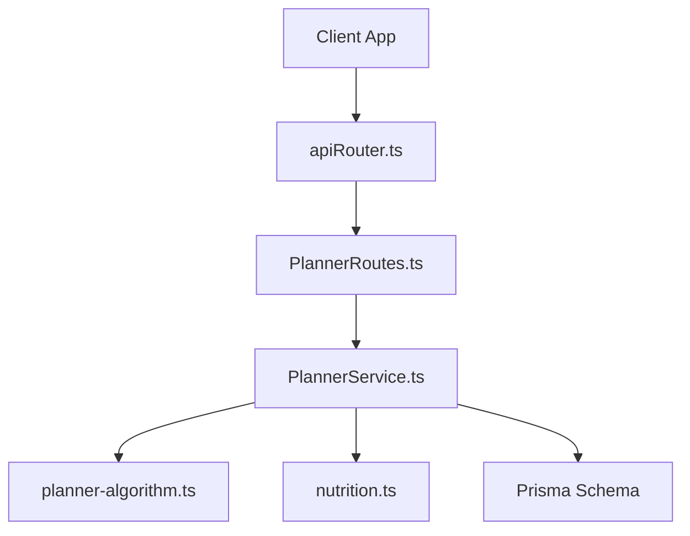
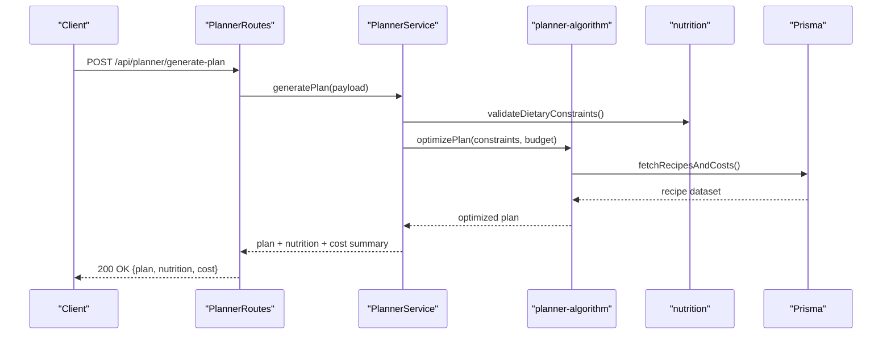
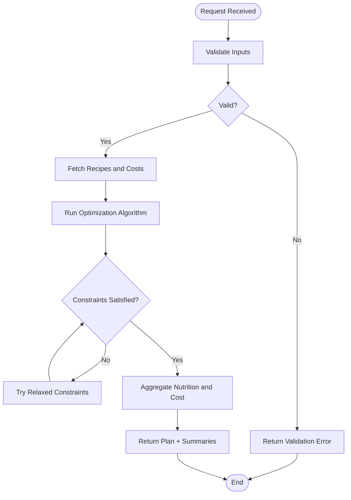
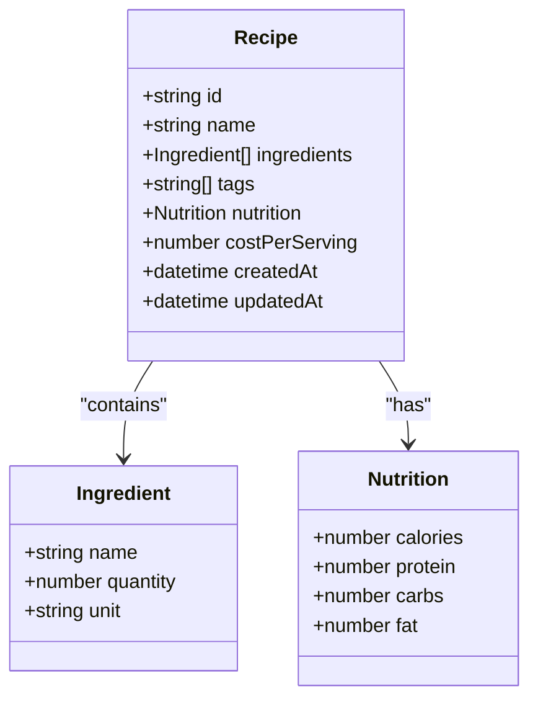
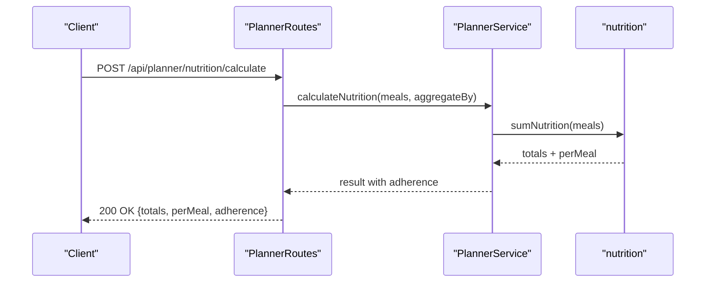
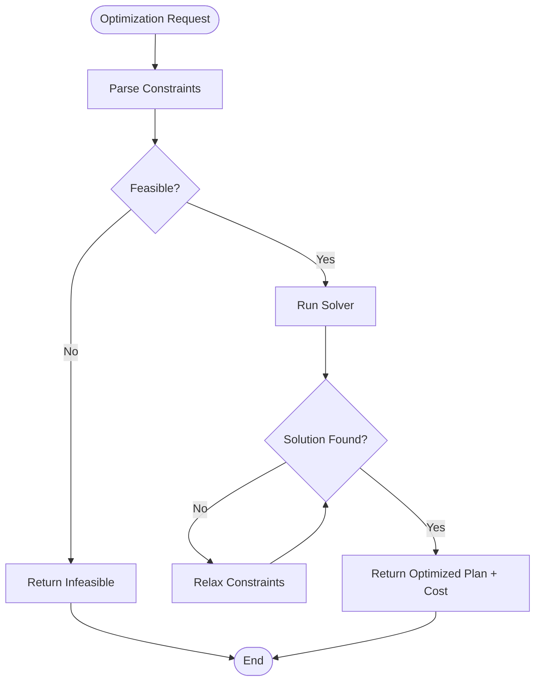
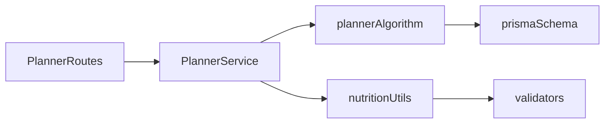

# Meal Planning Routes

<cite>
**Referenced Files in This Document**
- [PlannerRoutes.ts](file://Backend/src/routes/PlannerRoutes.ts)
- [PlannerService.ts](file://Backend/src/services/PlannerService.ts)
- [planner-algorithm.ts](file://Backend/src/services/planner-algorithm.ts)
- [nutrition.ts](file://Backend/src/common/utils/nutrition.ts)
- [Paths.ts](file://Backend/src/common/constants/Paths.ts)
- [apiRouter.ts](file://Backend/src/routes/apiRouter.ts)
- [schema.prisma](file://Backend/prisma/schema.prisma)
- [store.ts](file://Backend/src/crawlers/store.ts)
</cite>

## Table of Contents
1. Introduction
2. Project Structure
3. Core Components
4. Architecture Overview
5. Detailed Component Analysis
6. Dependency Analysis
7. Performance Considerations
8. Troubleshooting Guide
9. Conclusion

## Introduction
This document provides detailed API documentation for meal planning endpoints, covering plan generation, recipe management, nutritional calculations, and budget optimization. It explains request parameters (dietary restrictions, budget constraints, preference settings), response formats (meal plans, nutrition info, cost breakdowns), and example workflows for generating and customizing weekly meal plans.

## Project Structure
The meal planning feature is implemented in the backend with a clear separation between routes, services, algorithms, and utilities:
- Routes define HTTP endpoints and parse requests.
- Services orchestrate business logic and call algorithms.
- Algorithms implement core planning and optimization logic.
- Utilities provide shared helpers for nutrition and validation.
- Prisma schema defines persistent data models used by the planner.

**Diagram sources**
- [apiRouter.ts](file://Backend/src/routes/apiRouter.ts)
- [PlannerRoutes.ts](file://Backend/src/routes/PlannerRoutes.ts)
- [PlannerService.ts](file://Backend/src/services/PlannerService.ts)
- [planner-algorithm.ts](file://Backend/src/services/planner-algorithm.ts)
- [nutrition.ts](file://Backend/src/common/utils/nutrition.ts)
- [schema.prisma](file://Backend/prisma/schema.prisma)

**Section sources**
- [PlannerRoutes.ts](file://Backend/src/routes/PlannerRoutes.ts)
- [PlannerService.ts](file://Backend/src/services/PlannerService.ts)
- [planner-algorithm.ts](file://Backend/src/services/planner-algorithm.ts)
- [nutrition.ts](file://Backend/src/common/utils/nutrition.ts)
- [Paths.ts](file://Backend/src/common/constants/Paths.ts)
- [apiRouter.ts](file://Backend/src/routes/apiRouter.ts)
- [schema.prisma](file://Backend/prisma/schema.prisma)

## Core Components
- PlannerRoutes: Defines HTTP endpoints for meal planning operations, including plan generation, recipe CRUD, and budget queries.
- PlannerService: Orchestrates planning workflows, validates inputs, integrates with algorithm and nutrition utilities, and returns structured responses.
- planner-algorithm: Implements the core planning and optimization logic, including constraint satisfaction and cost minimization.
- nutrition: Provides helper functions to compute nutritional values and validate dietary constraints.
- Paths: Centralizes route path constants for consistency across the application.
- schema.prisma: Defines entities such as users, recipes, meals, and plan-related records used by the planner.

Key responsibilities:
- Plan Generation: Accepts preferences and constraints, runs the algorithm, and returns a weekly plan with meals and costs.
- Recipe Management: Create, read, update, delete recipes; associate them with dietary tags and nutritional profiles.
- Nutritional Calculations: Aggregate per-meal and per-day nutrition totals based on selected recipes.
- Budget Optimization: Minimize total cost while satisfying dietary and nutritional constraints within a given budget.

**Section sources**
- [PlannerRoutes.ts](file://Backend/src/routes/PlannerRoutes.ts)
- [PlannerService.ts](file://Backend/src/services/PlannerService.ts)
- [planner-algorithm.ts](file://Backend/src/services/planner-algorithm.ts)
- [nutrition.ts](file://Backend/src/common/utils/nutrition.ts)
- [Paths.ts](file://Backend/src/common/constants/Paths.ts)
- [schema.prisma](file://Backend/prisma/schema.prisma)

## Architecture Overview
The meal planning API follows a layered architecture:
- HTTP layer (routes) parses and validates requests.
- Service layer coordinates business logic and external dependencies.
- Algorithm layer performs optimization and constraint solving.
- Utility layer provides reusable helpers for nutrition and validation.
- Data layer uses Prisma to persist and retrieve plan and recipe data.

**Diagram sources**
- [PlannerRoutes.ts](file://Backend/src/routes/PlannerRoutes.ts)
- [PlannerService.ts](file://Backend/src/services/PlannerService.ts)
- [planner-algorithm.ts](file://Backend/src/services/planner-algorithm.ts)
- [nutrition.ts](file://Backend/src/common/utils/nutrition.ts)
- [schema.prisma](file://Backend/prisma/schema.prisma)

## Detailed Component Analysis

### Plan Generation API
- Endpoint: POST /api/planner/generate-plan
- Purpose: Generate a weekly meal plan based on user preferences, dietary restrictions, and budget constraints.
- Request Parameters:
  - days: number of days to plan (e.g., 7)
  - mealsPerDay: number of meals per day (e.g., 3)
  - dietaryRestrictions: array of tags (e.g., vegetarian, gluten-free)
  - budget: maximum total cost for the plan
  - preferences: object containing cuisine types, preferred ingredients, or excluded items
  - nutritionalTargets: optional daily targets (calories, protein, carbs, fat)
- Response Format:
  - plan: array of daily entries, each containing meals with recipe IDs and quantities
  - nutrition: aggregated daily totals and per-meal breakdown
  - cost: total cost and per-meal cost details
  - constraintsSatisfied: boolean indicating whether all constraints were met
- Example Workflow:
  - Client sends a generate-plan request with dietary restrictions and budget.
  - PlannerService validates inputs and calls the algorithm.
  - Algorithm selects recipes that satisfy constraints and minimize cost.
  - Service aggregates nutrition and cost summaries.
  - Client receives a complete plan with actionable details.

**Diagram sources**
- [PlannerService.ts](file://Backend/src/services/PlannerService.ts)
- [planner-algorithm.ts](file://Backend/src/services/planner-algorithm.ts)
- [nutrition.ts](file://Backend/src/common/utils/nutrition.ts)

**Section sources**
- [PlannerRoutes.ts](file://Backend/src/routes/PlannerRoutes.ts)
- [PlannerService.ts](file://Backend/src/services/PlannerService.ts)
- [planner-algorithm.ts](file://Backend/src/services/planner-algorithm.ts)
- [nutrition.ts](file://Backend/src/common/utils/nutrition.ts)

### Recipe Management API
- Endpoints:
  - POST /api/planner/recipes: Create a new recipe
  - GET /api/planner/recipes: List recipes with filters
  - GET /api/planner/recipes/:id: Get recipe details
  - PUT /api/planner/recipes/:id: Update recipe
  - DELETE /api/planner/recipes/:id: Delete recipe
- Request Parameters:
  - name: string
  - ingredients: array of ingredient objects (name, quantity, unit)
  - tags: array of dietary tags
  - nutrition: object with calories, protein, carbs, fat per serving
  - costPerServing: number
- Response Format:
  - Created/Updated: full recipe object with ID and timestamps
  - List: paginated array of recipes with metadata
  - Details: complete recipe including associated meals and usage stats
- Notes:
  - Tags are used by the planner to filter recipes during plan generation.
  - Nutrition fields must be provided for accurate nutritional aggregation.

**Diagram sources**
- [schema.prisma](file://Backend/prisma/schema.prisma)

**Section sources**
- [PlannerRoutes.ts](file://Backend/src/routes/PlannerRoutes.ts)
- [schema.prisma](file://Backend/prisma/schema.prisma)

### Nutritional Calculations API
- Endpoint: POST /api/planner/nutrition/calculate
- Purpose: Compute nutritional totals for a set of meals or a generated plan.
- Request Parameters:
  - meals: array of meal objects with recipe IDs and quantities
  - aggregateBy: "day" or "total"
- Response Format:
  - totals: aggregated nutrition values (calories, protein, carbs, fat)
  - perMeal: per-meal breakdown if requested
  - adherence: comparison against provided nutritional targets

**Diagram sources**
- [PlannerRoutes.ts](file://Backend/src/routes/PlannerRoutes.ts)
- [PlannerService.ts](file://Backend/src/services/PlannerService.ts)
- [nutrition.ts](file://Backend/src/common/utils/nutrition.ts)

**Section sources**
- [PlannerRoutes.ts](file://Backend/src/routes/PlannerRoutes.ts)
- [PlannerService.ts](file://Backend/src/services/PlannerService.ts)
- [nutrition.ts](file://Backend/src/common/utils/nutrition.ts)

### Budget Optimization API
- Endpoint: POST /api/planner/budget/optimize
- Purpose: Optimize a meal plan to minimize cost while meeting dietary and nutritional constraints within a specified budget.
- Request Parameters:
  - days: number of days
  - mealsPerDay: number of meals per day
  - dietaryRestrictions: array of tags
  - budget: maximum total cost
  - nutritionalTargets: optional daily targets
- Response Format:
  - plan: optimized weekly plan
  - costBreakdown: per-meal and total cost
  - savings: difference from baseline plan (if provided)
  - feasibility: boolean indicating if constraints could be satisfied

**Diagram sources**
- [planner-algorithm.ts](file://Backend/src/services/planner-algorithm.ts)
- [PlannerService.ts](file://Backend/src/services/PlannerService.ts)

**Section sources**
- [PlannerRoutes.ts](file://Backend/src/routes/PlannerRoutes.ts)
- [planner-algorithm.ts](file://Backend/src/services/planner-algorithm.ts)
- [PlannerService.ts](file://Backend/src/services/PlannerService.ts)

## Dependency Analysis
The meal planning system has well-defined dependencies:
- Routes depend on services for business logic.
- Services depend on algorithms for optimization and utilities for validation.
- Algorithms depend on data models defined in Prisma schema.
- Utilities are stateless and reused across services.

**Diagram sources**
- [PlannerRoutes.ts](file://Backend/src/routes/PlannerRoutes.ts)
- [PlannerService.ts](file://Backend/src/services/PlannerService.ts)
- [planner-algorithm.ts](file://Backend/src/services/planner-algorithm.ts)
- [nutrition.ts](file://Backend/src/common/utils/nutrition.ts)
- [schema.prisma](file://Backend/prisma/schema.prisma)

**Section sources**
- [PlannerRoutes.ts](file://Backend/src/routes/PlannerRoutes.ts)
- [PlannerService.ts](file://Backend/src/services/PlannerService.ts)
- [planner-algorithm.ts](file://Backend/src/services/planner-algorithm.ts)
- [nutrition.ts](file://Backend/src/common/utils/nutrition.ts)
- [schema.prisma](file://Backend/prisma/schema.prisma)

## Performance Considerations
- Caching: Cache frequently accessed recipes and their nutritional data to reduce database load.
- Pagination: Implement pagination for recipe lists to handle large datasets efficiently.
- Batch Operations: Use batch inserts/updates for creating multiple recipes or meals.
- Algorithm Tuning: Optimize solver parameters for faster convergence without sacrificing solution quality.
- Input Validation: Validate inputs early to avoid unnecessary processing.

[No sources needed since this section provides general guidance]

## Troubleshooting Guide
Common issues and resolutions:
- Invalid Dietary Restrictions: Ensure tags match predefined values in the schema.
- Budget Too Low: Increase budget or relax constraints to achieve feasibility.
- Missing Nutrition Data: Provide complete nutrition information for all recipes.
- Algorithm Timeouts: Reduce complexity by limiting days/meals or simplifying constraints.

**Section sources**
- [PlannerService.ts](file://Backend/src/services/PlannerService.ts)
- [planner-algorithm.ts](file://Backend/src/services/planner-algorithm.ts)
- [nutrition.ts](file://Backend/src/common/utils/nutrition.ts)

## Conclusion
The meal planning API provides a comprehensive set of endpoints for generating customized meal plans, managing recipes, calculating nutrition, and optimizing budgets. By following the documented request/response formats and leveraging the outlined workflows, developers can integrate robust meal planning functionality into their applications.

[No sources needed since this section summarizes without analyzing specific files]