# Route Handlers and API Endpoints

<cite>
**Referenced Files in This Document**
- [main.ts](file://Backend/src/main.ts)
- [server.ts](file://Backend/src/server.ts)
- [apiRouter.ts](file://Backend/src/routes/apiRouter.ts)
- [AuthRoutes.ts](file://Backend/src/routes/AuthRoutes.ts)
- [LogRoutes.ts](file://Backend/src/routes/LogRoutes.ts)
- [PlannerRoutes.ts](file://Backend/src/routes/PlannerRoutes.ts)
- [ProfileRoutes.ts](file://Backend/src/routes/ProfileRoutes.ts)
- [StoreRoutes.ts](file://Backend/src/routes/StoreRoutes.ts)
- [UserRoutes.ts](file://Backend/src/routes/UserRoutes.ts)
- [auth.ts](file://Backend/src/routes/common/auth.ts)
- [express-types.ts](file://Backend/src/routes/common/express-types.ts)
- [parseReq.ts](file://Backend/src/routes/common/parseReq.ts)
- [route-errors.ts](file://Backend/src/common/utils/route-errors.ts)
- [validators.ts](file://Backend/src/common/utils/validators.ts)
- [HttpStatusCodes.ts](file://Backend/src/common/constants/HttpStatusCodes.ts)
- [Paths.ts](file://Backend/src/common/constants/Paths.ts)
- [AuthService.ts](file://Backend/src/services/AuthService.ts)
- [UserService.ts](file://Backend/src/services/UserService.ts)
- [PlannerService.ts](file://Backend/src/services/PlannerService.ts)
- [ProfileService.ts](file://Backend/src/services/ProfileService.ts)
- [StoreService.ts](file://Backend/src/services/StoreService.ts)
- [LogService.ts](file://Backend/src/services/LogService.ts)
</cite>

## Table of Contents
1. [Introduction](#introduction)
2. [Project Structure](#project-structure)
3. [Core Components](#core-components)
4. [Architecture Overview](#architecture-overview)
5. [Detailed Component Analysis](#detailed-component-analysis)
6. [Dependency Analysis](#dependency-analysis)
7. [Performance Considerations](#performance-considerations)
8. [Troubleshooting Guide](#troubleshooting-guide)
9. [Conclusion](#conclusion)

## Introduction
This document explains the Express.js route handler architecture and API endpoint organization used by the backend. It covers how requests are processed, how parameters are validated, how errors are handled consistently, and how responses are formatted. It also details the router structure, middleware integration, and RESTful design principles applied across the application.

## Project Structure
The backend organizes routing into feature-based route modules under src/routes, with shared utilities for parsing, validation, error handling, and HTTP constants. The server entry wires up Express, mounts routers, and integrates global middleware. Services encapsulate business logic invoked by route handlers.

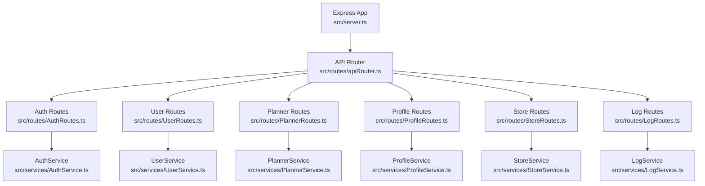

**Diagram sources**
- [server.ts:1-200](file://Backend/src/server.ts#L1-L200)
- [apiRouter.ts:1-200](file://Backend/src/routes/apiRouter.ts#L1-L200)
- [AuthRoutes.ts:1-200](file://Backend/src/routes/AuthRoutes.ts#L1-L200)
- [UserRoutes.ts:1-200](file://Backend/src/routes/UserRoutes.ts#L1-L200)
- [PlannerRoutes.ts:1-200](file://Backend/src/routes/PlannerRoutes.ts#L1-L200)
- [ProfileRoutes.ts:1-200](file://Backend/src/routes/ProfileRoutes.ts#L1-L200)
- [StoreRoutes.ts:1-200](file://Backend/src/routes/StoreRoutes.ts#L1-L200)
- [LogRoutes.ts:1-200](file://Backend/src/routes/LogRoutes.ts#L1-L200)
- [AuthService.ts:1-200](file://Backend/src/services/AuthService.ts#L1-L200)
- [UserService.ts:1-200](file://Backend/src/services/UserService.ts#L1-L200)
- [PlannerService.ts:1-200](file://Backend/src/services/PlannerService.ts#L1-L200)
- [ProfileService.ts:1-200](file://Backend/src/services/ProfileService.ts#L1-L200)
- [StoreService.ts:1-200](file://Backend/src/services/StoreService.ts#L1-L200)
- [LogService.ts:1-200](file://Backend/src/services/LogService.ts#L1-L200)

**Section sources**
- [server.ts:1-200](file://Backend/src/server.ts#L1-L200)
- [apiRouter.ts:1-200](file://Backend/src/routes/apiRouter.ts#L1-L200)

## Core Components
- Router assembly: The API router aggregates feature-specific route modules and applies common middleware such as authentication guards and request parsers.
- Route modules: Each feature (Auth, User, Planner, Profile, Store, Log) is defined in its own file to keep endpoints cohesive and maintainable.
- Middleware: Shared parsing and validation helpers live under routes/common and common/utils.
- Error handling: Centralized error utilities and HTTP status codes ensure consistent error responses.
- Services: Business logic is delegated to service modules, keeping routes thin and focused on I/O.

Key responsibilities:
- Request parsing and normalization via shared utilities.
- Parameter validation using reusable validators.
- Consistent error formatting and status mapping.
- Service-driven data operations and domain rules.

**Section sources**
- [apiRouter.ts:1-200](file://Backend/src/routes/apiRouter.ts#L1-L200)
- [parseReq.ts:1-200](file://Backend/src/routes/common/parseReq.ts#L1-L200)
- [validators.ts:1-200](file://Backend/src/common/utils/validators.ts#L1-L200)
- [route-errors.ts:1-200](file://Backend/src/common/utils/route-errors.ts#L1-L200)
- [HttpStatusCodes.ts:1-200](file://Backend/src/common/constants/HttpStatusCodes.ts#L1-L200)

## Architecture Overview
The request lifecycle follows a clear path from Express through the API router to feature-specific routes, then to services, and finally back to a standardized response shape. Global middleware handles parsing, logging, and authentication where applicable.

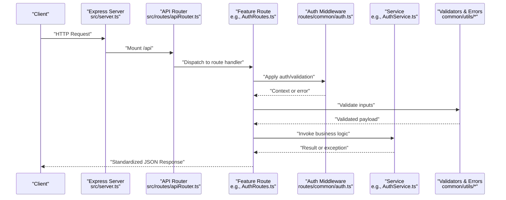

**Diagram sources**
- [server.ts:1-200](file://Backend/src/server.ts#L1-L200)
- [apiRouter.ts:1-200](file://Backend/src/routes/apiRouter.ts#L1-L200)
- [AuthRoutes.ts:1-200](file://Backend/src/routes/AuthRoutes.ts#L1-L200)
- [auth.ts:1-200](file://Backend/src/routes/common/auth.ts#L1-L200)
- [AuthService.ts:1-200](file://Backend/src/services/AuthService.ts#L1-L200)
- [validators.ts:1-200](file://Backend/src/common/utils/validators.ts#L1-L200)
- [route-errors.ts:1-200](file://Backend/src/common/utils/route-errors.ts#L1-L200)

## Detailed Component Analysis

### API Router and Mounting
- The API router centralizes route mounting and applies shared middleware before dispatching to feature routers.
- Paths are organized under a common prefix to support versioning and clarity.

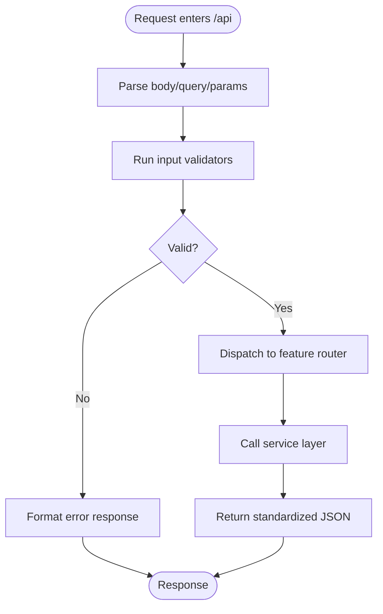

**Diagram sources**
- [apiRouter.ts:1-200](file://Backend/src/routes/apiRouter.ts#L1-L200)
- [parseReq.ts:1-200](file://Backend/src/routes/common/parseReq.ts#L1-L200)
- [validators.ts:1-200](file://Backend/src/common/utils/validators.ts#L1-L200)
- [route-errors.ts:1-200](file://Backend/src/common/utils/route-errors.ts#L1-L200)

**Section sources**
- [apiRouter.ts:1-200](file://Backend/src/routes/apiRouter.ts#L1-L200)

### Authentication Middleware
- Provides context injection and authorization checks for protected routes.
- Integrates with token/session handling and user resolution.

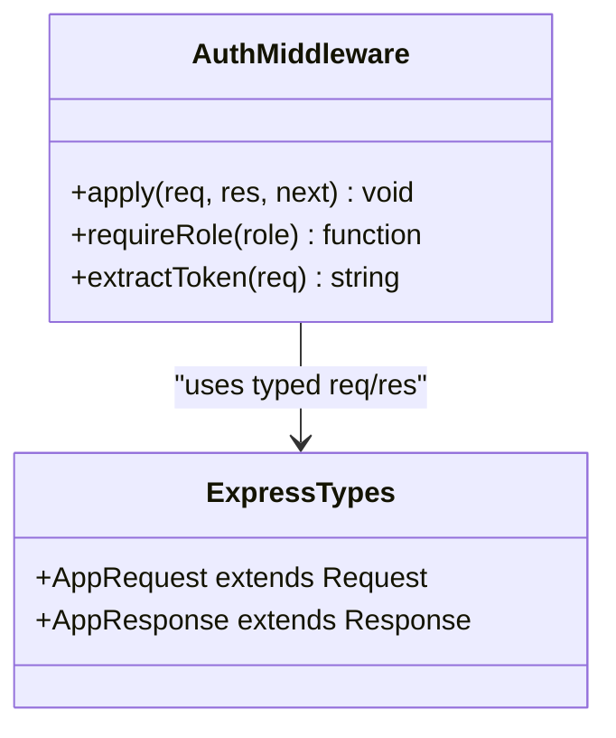

**Diagram sources**
- [auth.ts:1-200](file://Backend/src/routes/common/auth.ts#L1-200)
- [express-types.ts:1-200](file://Backend/src/routes/common/express-types.ts#L1-200)

**Section sources**
- [auth.ts:1-200](file://Backend/src/routes/common/auth.ts#L1-200)
- [express-types.ts:1-200](file://Backend/src/routes/common/express-types.ts#L1-200)

### Request Parsing Utilities
- Normalizes incoming payloads, extracts query parameters, and ensures consistent types.
- Used by route handlers to avoid duplicated parsing logic.

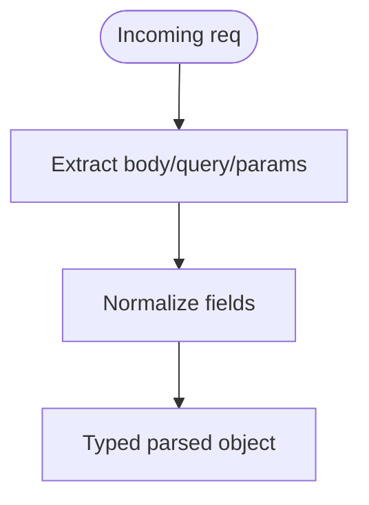

**Diagram sources**
- [parseReq.ts:1-200](file://Backend/src/routes/common/parseReq.ts#L1-200)

**Section sources**
- [parseReq.ts:1-200](file://Backend/src/routes/common/parseReq.ts#L1-200)

### Input Validation Patterns
- Validators enforce schema constraints and return structured errors.
- Applied before invoking services to fail fast and reduce downstream errors.

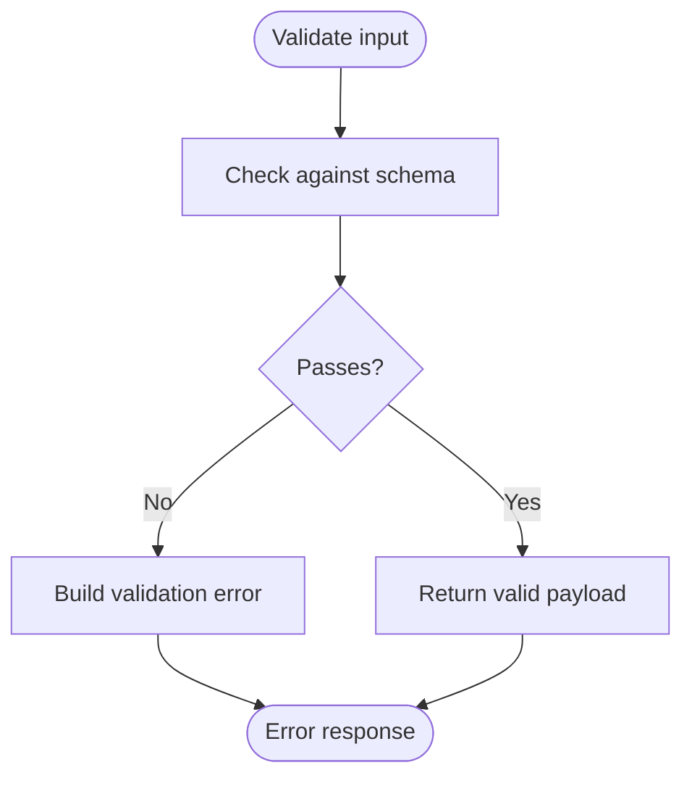

**Diagram sources**
- [validators.ts:1-200](file://Backend/src/common/utils/validators.ts#L1-200)
- [route-errors.ts:1-200](file://Backend/src/common/utils/route-errors.ts#L1-200)

**Section sources**
- [validators.ts:1-200](file://Backend/src/common/utils/validators.ts#L1-200)
- [route-errors.ts:1-200](file://Backend/src/common/utils/route-errors.ts#L1-200)

### Error Handling and Response Formatting
- Centralized utilities map exceptions to consistent JSON structures and HTTP status codes.
- Ensures predictable client behavior and easier debugging.

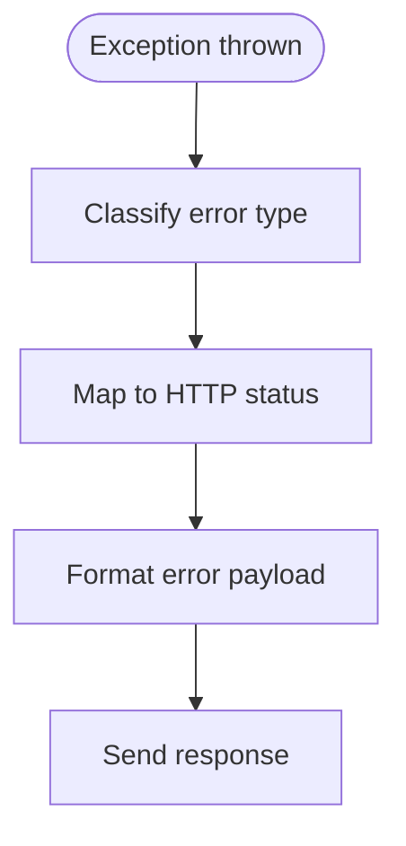

**Diagram sources**
- [route-errors.ts:1-200](file://Backend/src/common/utils/route-errors.ts#L1-200)
- [HttpStatusCodes.ts:1-200](file://Backend/src/common/constants/HttpStatusCodes.ts#L1-200)

**Section sources**
- [route-errors.ts:1-200](file://Backend/src/common/utils/route-errors.ts#L1-200)
- [HttpStatusCodes.ts:1-200](file://Backend/src/common/constants/HttpStatusCodes.ts#L1-200)

### Feature Routers and RESTful Design
- Each feature module defines endpoints following REST conventions: resource-oriented paths, appropriate HTTP methods, and consistent status usage.
- Examples include authentication flows, user management, planning features, profile updates, store operations, and logging.

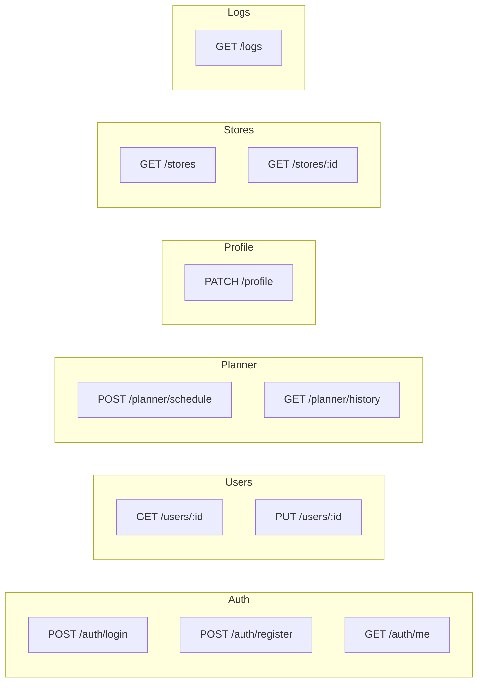

[No diagram sources since this diagram shows conceptual REST endpoints]

**Section sources**
- [AuthRoutes.ts:1-200](file://Backend/src/routes/AuthRoutes.ts#L1-200)
- [UserRoutes.ts:1-200](file://Backend/src/routes/UserRoutes.ts#L1-200)
- [PlannerRoutes.ts:1-200](file://Backend/src/routes/PlannerRoutes.ts#L1-200)
- [ProfileRoutes.ts:1-200](file://Backend/src/routes/ProfileRoutes.ts#L1-200)
- [StoreRoutes.ts:1-200](file://Backend/src/routes/StoreRoutes.ts#L1-200)
- [LogRoutes.ts:1-200](file://Backend/src/routes/LogRoutes.ts#L1-200)

### Example Request/Response Flow: Authentication
A typical login flow demonstrates parsing, validation, authentication, and standardized response formatting.

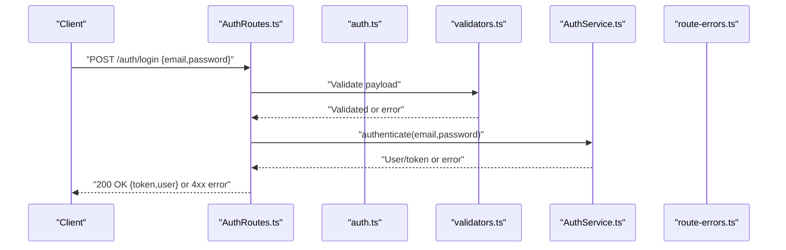

**Diagram sources**
- [AuthRoutes.ts:1-200](file://Backend/src/routes/AuthRoutes.ts#L1-200)
- [auth.ts:1-200](file://Backend/src/routes/common/auth.ts#L1-200)
- [validators.ts:1-200](file://Backend/src/common/utils/validators.ts#L1-200)
- [AuthService.ts:1-200](file://Backend/src/services/AuthService.ts#L1-200)
- [route-errors.ts:1-200](file://Backend/src/common/utils/route-errors.ts#L1-200)

**Section sources**
- [AuthRoutes.ts:1-200](file://Backend/src/routes/AuthRoutes.ts#L1-200)
- [AuthService.ts:1-200](file://Backend/src/services/AuthService.ts#L1-200)

### Example Request/Response Flow: User Management
Fetching and updating a user illustrates parameter extraction, validation, service calls, and consistent responses.

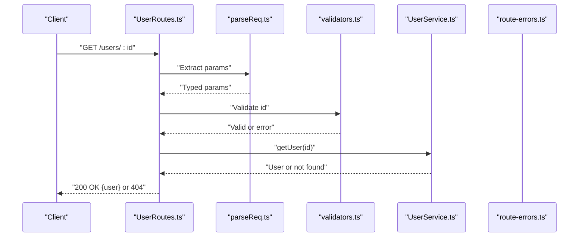

**Diagram sources**
- [UserRoutes.ts:1-200](file://Backend/src/routes/UserRoutes.ts#L1-200)
- [parseReq.ts:1-200](file://Backend/src/routes/common/parseReq.ts#L1-200)
- [validators.ts:1-200](file://Backend/src/common/utils/validators.ts#L1-200)
- [UserService.ts:1-200](file://Backend/src/services/UserService.ts#L1-200)
- [route-errors.ts:1-200](file://Backend/src/common/utils/route-errors.ts#L1-200)

**Section sources**
- [UserRoutes.ts:1-200](file://Backend/src/routes/UserRoutes.ts#L1-200)
- [UserService.ts:1-200](file://Backend/src/services/UserService.ts#L1-200)

## Dependency Analysis
Routers depend on shared middleware and utilities, while services encapsulate business logic. Constants define HTTP statuses and paths, ensuring consistency across the API.

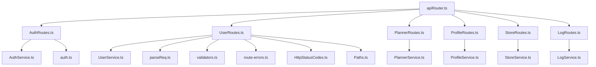

**Diagram sources**
- [apiRouter.ts:1-200](file://Backend/src/routes/apiRouter.ts#L1-200)
- [AuthRoutes.ts:1-200](file://Backend/src/routes/AuthRoutes.ts#L1-200)
- [UserRoutes.ts:1-200](file://Backend/src/routes/UserRoutes.ts#L1-200)
- [PlannerRoutes.ts:1-200](file://Backend/src/routes/PlannerRoutes.ts#L1-200)
- [ProfileRoutes.ts:1-200](file://Backend/src/routes/ProfileRoutes.ts#L1-200)
- [StoreRoutes.ts:1-200](file://Backend/src/routes/StoreRoutes.ts#L1-200)
- [LogRoutes.ts:1-200](file://Backend/src/routes/LogRoutes.ts#L1-200)
- [AuthService.ts:1-200](file://Backend/src/services/AuthService.ts#L1-200)
- [UserService.ts:1-200](file://Backend/src/services/UserService.ts#L1-200)
- [PlannerService.ts:1-200](file://Backend/src/services/PlannerService.ts#L1-200)
- [ProfileService.ts:1-200](file://Backend/src/services/ProfileService.ts#L1-200)
- [StoreService.ts:1-200](file://Backend/src/services/StoreService.ts#L1-200)
- [LogService.ts:1-200](file://Backend/src/services/LogService.ts#L1-200)
- [auth.ts:1-200](file://Backend/src/routes/common/auth.ts#L1-200)
- [parseReq.ts:1-200](file://Backend/src/routes/common/parseReq.ts#L1-200)
- [validators.ts:1-200](file://Backend/src/common/utils/validators.ts#L1-200)
- [route-errors.ts:1-200](file://Backend/src/common/utils/route-errors.ts#L1-200)
- [HttpStatusCodes.ts:1-200](file://Backend/src/common/constants/HttpStatusCodes.ts#L1-200)
- [Paths.ts:1-200](file://Backend/src/common/constants/Paths.ts#L1-200)

**Section sources**
- [apiRouter.ts:1-200](file://Backend/src/routes/apiRouter.ts#L1-200)
- [paths.ts:1-200](file://Backend/src/common/constants/Paths.ts#L1-200)
- [http-status-codes.ts:1-200](file://Backend/src/common/constants/HttpStatusCodes.ts#L1-200)

## Performance Considerations
- Keep route handlers thin; delegate heavy work to services.
- Use validators early to fail fast and avoid unnecessary processing.
- Avoid synchronous blocking operations within request handlers.
- Reuse parsing and validation utilities to minimize duplication and overhead.
- Apply caching at the service layer where appropriate for read-heavy endpoints.

[No sources needed since this section provides general guidance]

## Troubleshooting Guide
Common issues and resolutions:
- Invalid input: Ensure validators cover all required fields and provide clear messages.
- Authentication failures: Verify middleware order and token extraction logic.
- Unexpected status codes: Confirm error mapping uses correct HTTP status constants.
- Missing context: Confirm that parsing utilities populate req fields expected by handlers.

Use centralized error utilities to log and format errors consistently, aiding quick diagnosis.

**Section sources**
- [route-errors.ts:1-200](file://Backend/src/common/utils/route-errors.ts#L1-200)
- [validators.ts:1-200](file://Backend/src/common/utils/validators.ts#L1-200)
- [auth.ts:1-200](file://Backend/src/routes/common/auth.ts#L1-200)

## Conclusion
The backend’s Express architecture separates concerns cleanly: routers handle HTTP concerns, middleware standardizes parsing and security, validators enforce correctness, and services encapsulate business logic. Consistent error handling and response formatting make the API predictable and developer-friendly. Following these patterns ensures maintainability, scalability, and a robust RESTful interface.