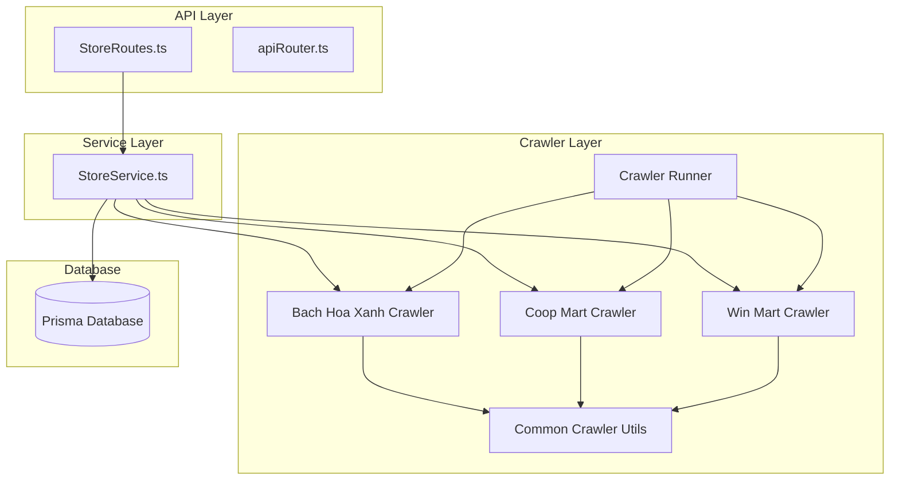
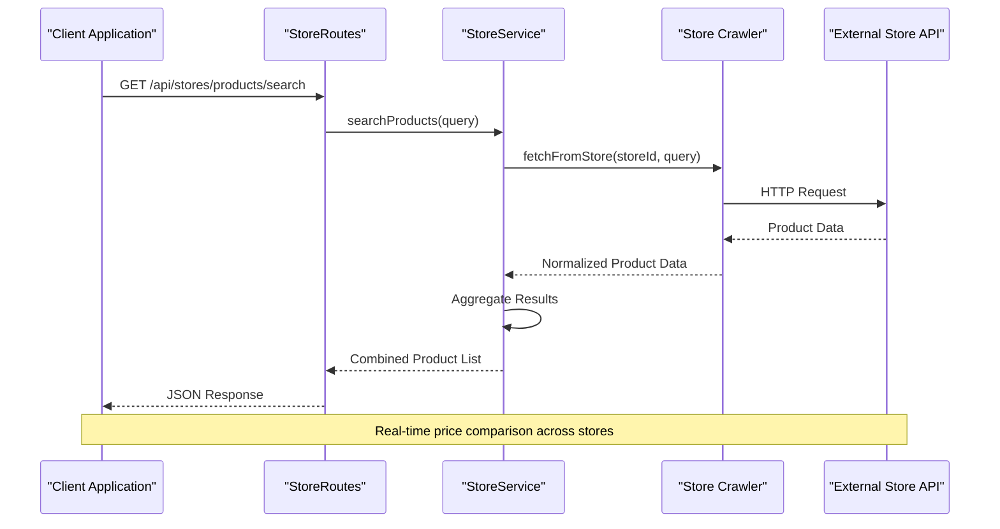
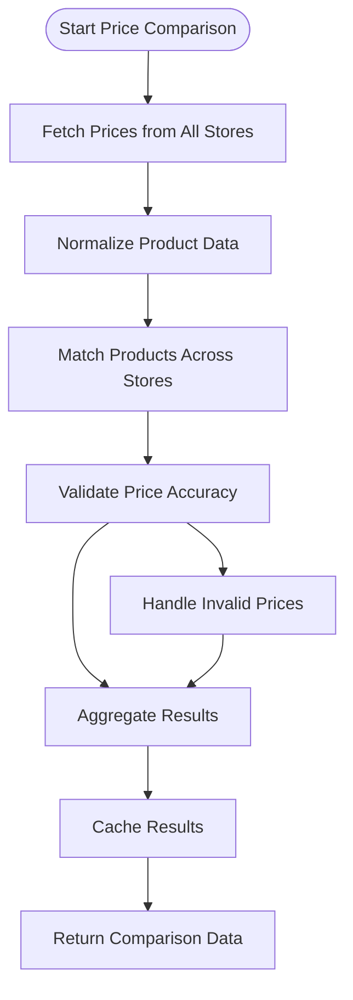

# Store Integration Routes

<cite>
**Referenced Files in This Document**
- [StoreRoutes.ts](file://Backend/src/routes/StoreRoutes.ts)
- [StoreService.ts](file://Backend/src/services/StoreService.ts)
- [bachhoaxanh.ts](file://Backend/src/crawlers/bachhoaxanh.ts)
- [coopmart.ts](file://Backend/src/crawlers/coopmart.ts)
- [winmart.ts](file://Backend/src/crawlers/winmart.ts)
- [common.ts](file://Backend/src/crawlers/common.ts)
- [runner.ts](file://Backend/src/crawlers/runner.ts)
- [apiRouter.ts](file://Backend/src/routes/apiRouter.ts)
- [Paths.ts](file://Backend/src/common/constants/Paths.ts)
</cite>

## Table of Contents
1. [Introduction](#introduction)
2. [Project Structure](#project-structure)
3. [Core Components](#core-components)
4. [Architecture Overview](#architecture-overview)
5. [Detailed Component Analysis](#detailed-component-analysis)
6. [API Endpoints Documentation](#api-endpoints-documentation)
7. [Data Models and Schemas](#data-models-and-schemas)
8. [Price Comparison Implementation](#price-comparison-implementation)
9. [Product Search Functionality](#product-search-functionality)
10. [Availability Checking](#availability-checking)
11. [Store-Specific Integrations](#store-specific-integrations)
12. [Error Handling and Validation](#error-handling-and-validation)
13. [Performance Considerations](#performance-considerations)
14. [Troubleshooting Guide](#troubleshooting-guide)
15. [Conclusion](#conclusion)

## Introduction

This document provides comprehensive documentation for the store integration API endpoints that enable price comparison, product search, and availability checking across multiple grocery stores including Bach Hoa Xanh, Coop Mart, and Win Mart. The system is designed to aggregate product information from various grocery store sources, normalize the data, and provide unified APIs for clients to compare prices, search products, and check availability across different retailers.

The backend implementation uses TypeScript with Express.js for routing, Prisma ORM for database operations, and custom crawlers for each store integration. The system supports real-time price fetching, product matching algorithms, and deal recommendation services.

## Project Structure

The store integration functionality is organized within a modular architecture:



**Diagram sources**
- [StoreRoutes.ts](file://Backend/src/routes/StoreRoutes.ts)
- [StoreService.ts](file://Backend/src/services/StoreService.ts)
- [bachhoaxanh.ts](file://Backend/src/crawlers/bachhoaxanh.ts)
- [coopmart.ts](file://Backend/src/crawlers/coopmart.ts)
- [winmart.ts](file://Backend/src/crawlers/winmart.ts)

**Section sources**
- [StoreRoutes.ts](file://Backend/src/routes/StoreRoutes.ts)
- [StoreService.ts](file://Backend/src/services/StoreService.ts)

## Core Components

The store integration system consists of several key components working together:

### Store Routes Handler
The main entry point for all store-related API endpoints, handling HTTP requests and delegating to appropriate service methods.

### Store Service Layer
Business logic layer that orchestrates calls to different store crawlers, handles data normalization, and manages caching strategies.

### Store Crawlers
Individual implementations for each grocery store (Bach Hoa Xanh, Coop Mart, Win Mart) that handle store-specific scraping, authentication, and data parsing.

### Common Utilities
Shared functionality used across all crawlers including request handling, error management, and data transformation utilities.

**Section sources**
- [StoreRoutes.ts](file://Backend/src/routes/StoreRoutes.ts)
- [StoreService.ts](file://Backend/src/services/StoreService.ts)
- [common.ts](file://Backend/src/crawlers/common.ts)

## Architecture Overview

The system follows a layered architecture pattern with clear separation of concerns:



**Diagram sources**
- [StoreRoutes.ts](file://Backend/src/routes/StoreRoutes.ts)
- [StoreService.ts](file://Backend/src/services/StoreService.ts)
- [runner.ts](file://Backend/src/crawlers/runner.ts)

## Detailed Component Analysis

### Store Routes Component
The routes component defines all HTTP endpoints for store integration functionality. It handles request validation, parameter parsing, and response formatting.

### Store Service Component
The service layer implements the core business logic for price comparison, product search, and availability checking. It coordinates between multiple store crawlers and manages data aggregation.

### Crawler Implementations
Each store crawler implements specific logic for interacting with different grocery store APIs or web interfaces, handling authentication, rate limiting, and data extraction.

**Section sources**
- [StoreRoutes.ts](file://Backend/src/routes/StoreRoutes.ts)
- [StoreService.ts](file://Backend/src/services/StoreService.ts)
- [bachhoaxanh.ts](file://Backend/src/crawlers/bachhoaxanh.ts)
- [coopmart.ts](file://Backend/src/crawlers/coopmart.ts)
- [winmart.ts](file://Backend/src/crawlers/winmart.ts)

## API Endpoints Documentation

### Product Search Endpoints

#### Search Products Across All Stores
- **Endpoint**: `GET /api/stores/products/search`
- **Query Parameters**:
  - `q`: Product name or description (required)
  - `category`: Product category filter (optional)
  - `min_price`: Minimum price filter (optional)
  - `max_price`: Maximum price filter (optional)
  - `in_stock_only`: Boolean flag for stock availability (optional)
- **Response**: Array of product objects with pricing from all stores

#### Search Products by Store
- **Endpoint**: `GET /api/stores/{storeId}/products/search`
- **Path Parameters**:
  - `storeId`: Store identifier (bachhoaxanh, coopmart, winmart)
- **Query Parameters**: Same as global search
- **Response**: Array of product objects from specific store

### Price Comparison Endpoints

#### Compare Product Prices
- **Endpoint**: `GET /api/stores/products/{productId}/prices`
- **Path Parameters**:
  - `productId`: Product identifier
- **Response**: Price comparison object with store-specific pricing

#### Get Best Deal
- **Endpoint**: `GET /api/stores/products/{productId}/best-deal`
- **Path Parameters**:
  - `productId`: Product identifier
- **Response**: Best deal information including lowest price and store details

### Availability Checking Endpoints

#### Check Product Availability
- **Endpoint**: `GET /api/stores/{storeId}/products/{productId}/availability`
- **Path Parameters**:
  - `storeId`: Store identifier
  - `productId`: Product identifier
- **Response**: Availability status and stock information

#### Bulk Availability Check
- **Endpoint**: `POST /api/stores/products/availability/bulk`
- **Request Body**: Array of product IDs
- **Response**: Availability status for all requested products

**Section sources**
- [StoreRoutes.ts](file://Backend/src/routes/StoreRoutes.ts)
- [Paths.ts](file://Backend/src/common/constants/Paths.ts)

## Data Models and Schemas

### Product Model
```typescript
interface Product {
  id: string;
  name: string;
  description?: string;
  category: string;
  brand?: string;
  sku?: string;
  image_url?: string;
  specifications?: Record<string, any>;
  created_at: Date;
  updated_at: Date;
}
```

### Pricing Model
```typescript
interface Pricing {
  product_id: string;
  store_id: string;
  price: number;
  currency: string;
  discount_percentage?: number;
  original_price?: number;
  sale_start_date?: Date;
  sale_end_date?: Date;
  last_updated: Date;
}
```

### Store Model
```typescript
interface Store {
  id: string;
  name: string;
  type: 'bachhoaxanh' | 'coopmart' | 'winmart';
  base_url: string;
  api_endpoint?: string;
  auth_required: boolean;
  rate_limit_per_minute: number;
  status: 'active' | 'maintenance' | 'inactive';
  last_sync: Date;
}
```

### Availability Model
```typescript
interface Availability {
  product_id: string;
  store_id: string;
  in_stock: boolean;
  stock_quantity?: number;
  availability_status: 'available' | 'out_of_stock' | 'limited' | 'preorder';
  pickup_available: boolean;
  delivery_available: boolean;
  estimated_delivery_date?: Date;
  last_checked: Date;
}
```

**Section sources**
- [StoreService.ts](file://Backend/src/services/StoreService.ts)
- [common.ts](file://Backend/src/crawlers/common.ts)

## Price Comparison Implementation

The price comparison system aggregates pricing data from multiple stores and provides unified access through consistent APIs.

### Price Aggregation Algorithm
The system implements a multi-step process for accurate price comparison:

1. **Data Collection**: Fetch current prices from all enabled stores
2. **Normalization**: Standardize currency, units, and product identifiers
3. **Validation**: Verify price accuracy and remove outliers
4. **Aggregation**: Combine results into unified format
5. **Caching**: Store results for performance optimization

### Price Matching Strategy
Product matching across stores uses multiple criteria:

- **Exact Match**: SKU or barcode matching when available
- **Name Similarity**: Fuzzy matching for product names
- **Category Hierarchy**: Category-based grouping
- **Brand Recognition**: Brand and model identification
- **Specification Matching**: Technical specifications comparison



**Diagram sources**
- [StoreService.ts](file://Backend/src/services/StoreService.ts)
- [common.ts](file://Backend/src/crawlers/common.ts)

**Section sources**
- [StoreService.ts](file://Backend/src/services/StoreService.ts)
- [common.ts](file://Backend/src/crawlers/common.ts)

## Product Search Functionality

The product search system provides intelligent search capabilities across all integrated stores with advanced filtering and sorting options.

### Search Features
- **Full-text Search**: Natural language product descriptions
- **Category Filtering**: Hierarchical category navigation
- **Price Range Filtering**: Min/max price constraints
- **Brand Filtering**: Specific brand or manufacturer selection
- **Availability Filtering**: In-stock only options
- **Sorting Options**: Price, relevance, rating, popularity

### Search Algorithm
The search implementation combines multiple ranking factors:

1. **Text Relevance**: Keyword matching and semantic similarity
2. **Price Competitiveness**: Lower prices ranked higher
3. **Availability Priority**: In-stock products prioritized
4. **Store Reputation**: Higher-rated stores given preference
5. **Delivery Speed**: Faster delivery options favored

### Search Response Format
Search results include enriched product information with cross-store comparisons and deal recommendations.

**Section sources**
- [StoreService.ts](file://Backend/src/services/StoreService.ts)
- [bachhoaxanh.ts](file://Backend/src/crawlers/bachhoaxanh.ts)
- [coopmart.ts](file://Backend/src/crawlers/coopmart.ts)
- [winmart.ts](file://Backend/src/crawlers/winmart.ts)

## Availability Checking

The availability checking system provides real-time stock information across all integrated stores with predictive analytics for stock levels.

### Stock Status Categories
- **Available**: Product is currently in stock
- **Out of Stock**: Product is temporarily unavailable
- **Limited Stock**: Low quantity remaining
- **Pre-order**: Product available for future delivery
- **Discontinued**: Product no longer available

### Stock Level Predictions
The system analyzes historical data to predict stock availability:

- **Trend Analysis**: Purchase patterns and seasonal variations
- **Supplier Lead Times**: Expected restock dates
- **Demand Forecasting**: Anticipated customer demand
- **Inventory Optimization**: Smart stock level recommendations

### Bulk Operations
Support for bulk availability checks to optimize API usage and reduce network overhead.

**Section sources**
- [StoreService.ts](file://Backend/src/services/StoreService.ts)
- [common.ts](file://Backend/src/crawlers/common.ts)

## Store-Specific Integrations

### Bach Hoa Xanh Integration
Bach Hoa Xanh integration provides access to Vietnam's largest retail chain with extensive product catalog and competitive pricing.

#### Authentication Method
- **API Key**: Bearer token authentication
- **Rate Limiting**: 100 requests per minute
- **Data Format**: JSON with Vietnamese product descriptions

#### Product Catalog Features
- **Categories**: Electronics, groceries, household items, personal care
- **Special Offers**: Daily deals and promotional pricing
- **Location-Based**: Store-specific availability and pricing
- **Mobile App Integration**: Real-time inventory updates

### Coop Mart Integration
Coop Mart integration focuses on fresh produce and organic products with emphasis on quality and sustainability.

#### Authentication Method
- **OAuth 2.0**: Standard OAuth flow
- **Session Management**: Cookie-based sessions
- **Web Scraping**: HTML parsing for product data

#### Product Catalog Features
- **Organic Products**: Certified organic food items
- **Fresh Produce**: Daily fresh deliveries
- **Local Suppliers**: Support for local farmers
- **Seasonal Items**: Seasonal fruit and vegetable offerings

### Win Mart Integration
Win Mart integration provides access to convenience store products with focus on everyday essentials and quick shopping solutions.

#### Authentication Method
- **Basic Auth**: Username/password authentication
- **Mobile API**: Mobile-specific endpoints
- **Geolocation**: Location-based product availability

#### Product Catalog Features
- **Convenience Items**: Quick purchase essentials
- **Ready-to-eat**: Prepared food and beverages
- **Household Staples**: Basic home supplies
- **Impulse Buys**: Small affordable items

**Section sources**
- [bachhoaxanh.ts](file://Backend/src/crawlers/bachhoaxanh.ts)
- [coopmart.ts](file://Backend/src/crawlers/coopmart.ts)
- [winmart.ts](file://Backend/src/crawlers/winmart.ts)

## Error Handling and Validation

### Error Response Format
All API endpoints return standardized error responses:

```typescript
interface ErrorResponse {
  success: false;
  error: {
    code: string;
    message: string;
    details?: any;
    timestamp: Date;
    request_id: string;
  };
}
```

### Validation Rules
- **Input Validation**: Request parameter validation with detailed error messages
- **Business Logic Validation**: Store-specific validation rules
- **Rate Limiting**: Prevents API abuse with configurable limits
- **Circuit Breaker**: Automatic fallback when stores are unavailable

### Retry Mechanisms
- **Exponential Backoff**: Progressive delay between retry attempts
- **Fallback Stores**: Alternative store selection when primary fails
- **Graceful Degradation**: Partial responses when some stores fail
- **Health Checks**: Continuous monitoring of store availability

**Section sources**
- [StoreService.ts](file://Backend/src/services/StoreService.ts)
- [common.ts](file://Backend/src/crawlers/common.ts)

## Performance Considerations

### Caching Strategy
- **Redis Cache**: In-memory caching for frequently accessed data
- **CDN Integration**: Static asset caching for images and documents
- **Database Query Optimization**: Indexed queries and connection pooling
- **Response Compression**: Gzip compression for large payloads

### Concurrency Control
- **Request Queuing**: Ordered processing of concurrent requests
- **Resource Pooling**: Efficient use of external API connections
- **Memory Management**: Proper cleanup of temporary data
- **Load Balancing**: Distribution of requests across multiple instances

### Monitoring and Metrics
- **Performance Metrics**: Response times, error rates, and throughput
- **Store Health Monitoring**: Real-time status of store integrations
- **Usage Analytics**: API consumption patterns and trends
- **Alerting System**: Automated notifications for critical issues

**Section sources**
- [StoreService.ts](file://Backend/src/services/StoreService.ts)
- [runner.ts](file://Backend/src/crawlers/runner.ts)

## Troubleshooting Guide

### Common Issues and Solutions

#### Store Connection Failures
- **Symptoms**: Timeout errors or connection refused messages
- **Causes**: Network connectivity issues, store API downtime, or authentication failures
- **Solutions**: Check network connectivity, verify API credentials, implement retry logic

#### Rate Limiting Errors
- **Symptoms**: 429 Too Many Requests responses
- **Causes**: Exceeding store API rate limits
- **Solutions**: Implement exponential backoff, cache responses, distribute requests

#### Data Parsing Errors
- **Symptoms**: Missing product information or malformed data
- **Causes**: Changes in store website structure or API format changes
- **Solutions**: Update parsing logic, add data validation, implement fallback formats

#### Performance Issues
- **Symptoms**: Slow response times or high memory usage
- **Causes**: Inefficient queries, missing indexes, or memory leaks
- **Solutions**: Optimize database queries, implement proper caching, monitor resource usage

### Debugging Tools
- **Request Logging**: Detailed logging of all API requests and responses
- **Error Tracking**: Centralized error collection and analysis
- **Performance Profiling**: Identification of bottlenecks and slow operations
- **Health Check Endpoints**: Monitoring service status and dependencies

**Section sources**
- [StoreService.ts](file://Backend/src/services/StoreService.ts)
- [common.ts](file://Backend/src/crawlers/common.ts)

## Conclusion

The store integration API system provides a comprehensive solution for price comparison, product search, and availability checking across multiple grocery stores. The modular architecture ensures scalability and maintainability while the robust error handling and performance optimizations guarantee reliable operation.

Key benefits of the system include:
- **Unified API Interface**: Consistent access to multiple store APIs
- **Real-time Data**: Current pricing and availability information
- **Intelligent Search**: Advanced product discovery and matching
- **Scalable Architecture**: Easy addition of new store integrations
- **High Availability**: Redundant systems and graceful degradation

Future enhancements could include machine learning for price prediction, mobile app integration, and expanded store coverage. The system provides a solid foundation for building sophisticated grocery shopping applications with comprehensive market coverage.