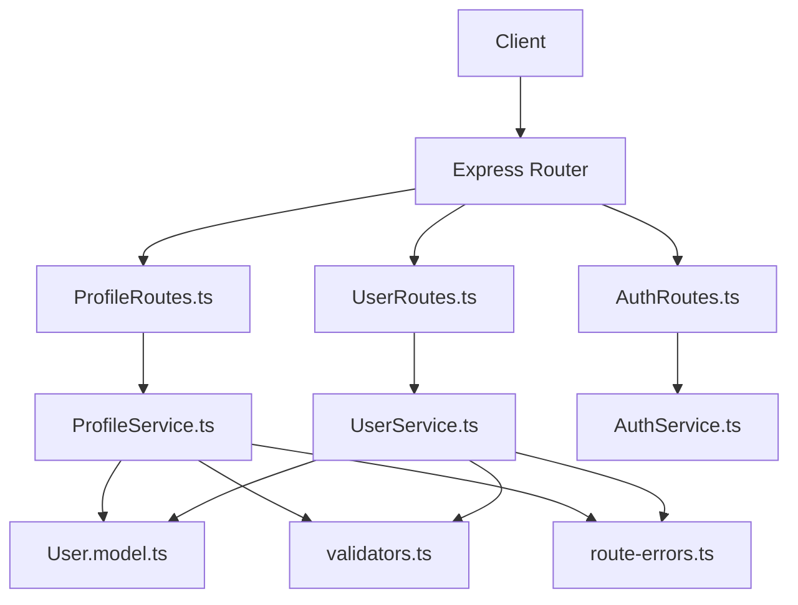
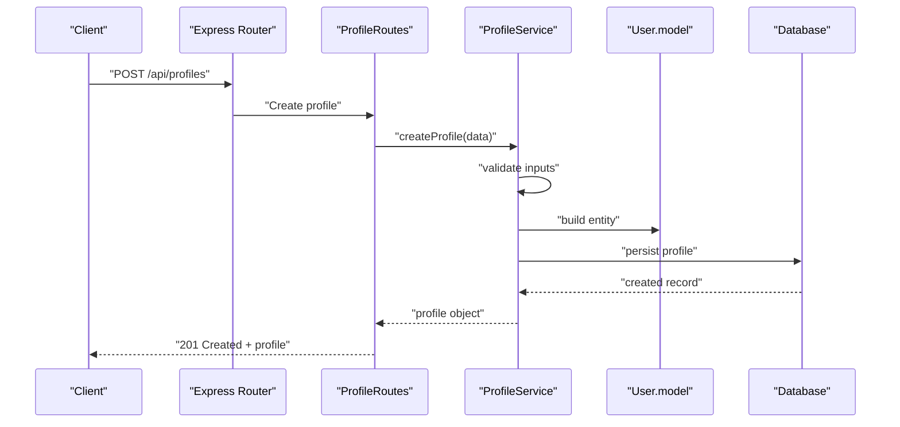
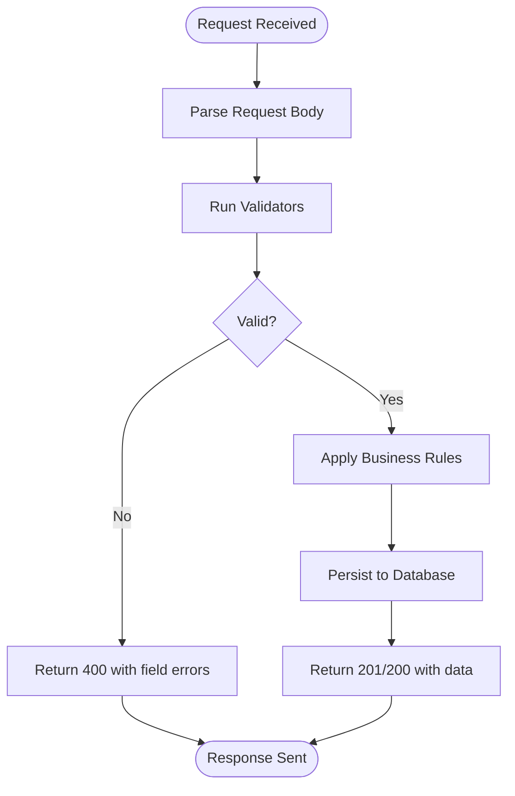
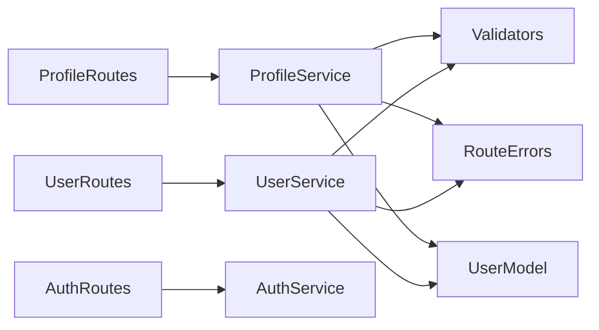

# User Management Routes

<cite>
**Referenced Files in This Document**
- [ProfileRoutes.ts](file://Backend/src/routes/ProfileRoutes.ts)
- [UserRoutes.ts](file://Backend/src/routes/UserRoutes.ts)
- [ProfileService.ts](file://Backend/src/services/ProfileService.ts)
- [UserService.ts](file://Backend/src/services/UserService.ts)
- [User.model.ts](file://Backend/src/models/User.model.ts)
- [AuthRoutes.ts](file://Backend/src/routes/AuthRoutes.ts)
- [AuthService.ts](file://Backend/src/services/AuthService.ts)
- [route-errors.ts](file://Backend/src/common/utils/route-errors.ts)
- [validators.ts](file://Backend/src/common/utils/validators.ts)
- [Paths.ts](file://Backend/src/common/constants/Paths.ts)
- [HttpStatusCodes.ts](file://Backend/src/common/constants/HttpStatusCodes.ts)
- [schema.prisma](file://Backend/prisma/schema.prisma)
</cite>

## Table of Contents
1. [Introduction](#introduction)
2. [Project Structure](#project-structure)
3. [Core Components](#core-components)
4. [Architecture Overview](#architecture-overview)
5. [Detailed Component Analysis](#detailed-component-analysis)
6. [Dependency Analysis](#dependency-analysis)
7. [Performance Considerations](#performance-considerations)
8. [Troubleshooting Guide](#troubleshooting-guide)
9. [Conclusion](#conclusion)

## Introduction
This document describes the user management API endpoints for profile creation, updates, dietary preferences, and account settings. It covers HTTP methods, request/response formats, validation rules, data constraints, examples of operations, error handling, and security measures for protecting user data. The backend is implemented in TypeScript with Express routes and services, using Prisma for data access.

## Project Structure
The user management functionality spans route definitions, service logic, models, and shared utilities:
- Routes define HTTP endpoints and parse requests.
- Services encapsulate business logic and orchestrate data operations.
- Models define entity structures and constraints.
- Utilities provide validation helpers and standardized error responses.
- Constants define paths and HTTP status codes.

**Diagram sources**
- [ProfileRoutes.ts](file://Backend/src/routes/ProfileRoutes.ts)
- [UserRoutes.ts](file://Backend/src/routes/UserRoutes.ts)
- [AuthRoutes.ts](file://Backend/src/routes/AuthRoutes.ts)
- [ProfileService.ts](file://Backend/src/services/ProfileService.ts)
- [UserService.ts](file://Backend/src/services/UserService.ts)
- [AuthService.ts](file://Backend/src/services/AuthService.ts)
- [User.model.ts](file://Backend/src/models/User.model.ts)
- [validators.ts](file://Backend/src/common/utils/validators.ts)
- [route-errors.ts](file://Backend/src/common/utils/route-errors.ts)

**Section sources**
- [ProfileRoutes.ts](file://Backend/src/routes/ProfileRoutes.ts)
- [UserRoutes.ts](file://Backend/src/routes/UserRoutes.ts)
- [AuthRoutes.ts](file://Backend/src/routes/AuthRoutes.ts)
- [ProfileService.ts](file://Backend/src/services/ProfileService.ts)
- [UserService.ts](file://Backend/src/services/UserService.ts)
- [AuthService.ts](file://Backend/src/services/AuthService.ts)
- [User.model.ts](file://Backend/src/models/User.model.ts)
- [validators.ts](file://Backend/src/common/utils/validators.ts)
- [route-errors.ts](file://Backend/src/common/utils/route-errors.ts)

## Core Components
- ProfileRoutes: Endpoints for creating, retrieving, updating, and deleting user profiles; managing dietary preferences and account settings.
- UserRoutes: Endpoints for user lifecycle operations such as registration, authentication, password changes, and account deactivation.
- ProfileService: Implements profile CRUD and preference management logic, including validation and persistence.
- UserService: Handles user account operations, including creation, retrieval, updates, and deletion.
- User.model: Defines the user entity structure and constraints used by services and database schema.
- AuthService: Manages authentication flows (login, token issuance, refresh).
- validators: Shared validation functions for input sanitization and constraint checks.
- route-errors: Standardized error response formatting for consistent client feedback.
- Paths and HttpStatusCodes: Centralized constants for endpoint paths and HTTP status codes.

**Section sources**
- [ProfileRoutes.ts](file://Backend/src/routes/ProfileRoutes.ts)
- [UserRoutes.ts](file://Backend/src/routes/UserRoutes.ts)
- [ProfileService.ts](file://Backend/src/services/ProfileService.ts)
- [UserService.ts](file://Backend/src/services/UserService.ts)
- [User.model.ts](file://Backend/src/models/User.model.ts)
- [AuthService.ts](file://Backend/src/services/AuthService.ts)
- [validators.ts](file://Backend/src/common/utils/validators.ts)
- [route-errors.ts](file://Backend/src/common/utils/route-errors.ts)
- [Paths.ts](file://Backend/src/common/constants/Paths.ts)
- [HttpStatusCodes.ts](file://Backend/src/common/constants/HttpStatusCodes.ts)

## Architecture Overview
The user management API follows a layered architecture:
- Routes receive HTTP requests, validate inputs via shared validators, and delegate to services.
- Services enforce business rules, perform validations, and interact with data through models and Prisma.
- Errors are normalized into consistent responses using route-error utilities.
- Authentication is handled by dedicated auth routes and services, ensuring protected endpoints require valid credentials.

**Diagram sources**
- [ProfileRoutes.ts](file://Backend/src/routes/ProfileRoutes.ts)
- [ProfileService.ts](file://Backend/src/services/ProfileService.ts)
- [User.model.ts](file://Backend/src/models/User.model.ts)
- [schema.prisma](file://Backend/prisma/schema.prisma)

## Detailed Component Analysis

### Profile Creation and Updates
Endpoints for creating and updating user profiles typically include:
- POST /api/profiles: Create a new profile with fields such as name, email, age, gender, height, weight, activity level, and dietary preferences.
- PATCH /api/profiles/:id: Update existing profile fields with partial updates.
- GET /api/profiles/:id: Retrieve a specific profile.
- DELETE /api/profiles/:id: Delete a profile (subject to authorization).

Request/response format highlights:
- Request body includes validated fields; missing required fields result in validation errors.
- Response returns the created or updated profile object with appropriate HTTP status codes.

Validation rules and constraints:
- Required fields enforced via validators (e.g., non-empty strings, numeric ranges).
- Email format validation and uniqueness checks.
- Age and BMI-related fields constrained within acceptable ranges.
- Dietary preferences must be from an allowed set.

Security measures:
- Authorization checks ensure users can only modify their own profiles.
- Sensitive fields are not returned unless explicitly requested.

Example operations:
- Create a profile with all required fields and preferred dietary options.
- Update only the activity level and dietary preferences without touching other fields.

**Section sources**
- [ProfileRoutes.ts](file://Backend/src/routes/ProfileRoutes.ts)
- [ProfileService.ts](file://Backend/src/services/ProfileService.ts)
- [validators.ts](file://Backend/src/common/utils/validators.ts)
- [User.model.ts](file://Backend/src/models/User.model.ts)
- [route-errors.ts](file://Backend/src/common/utils/route-errors.ts)

### Dietary Preferences Management
Dietary preferences allow users to specify restrictions and preferences such as vegetarian, vegan, gluten-free, allergies, and cuisine preferences.

Endpoints:
- PUT /api/profiles/:id/preferences: Replace the entire preferences object.
- PATCH /api/profiles/:id/preferences: Partially update preferences.
- GET /api/profiles/:id/preferences: Retrieve current preferences.

Data constraints:
- Allowed values defined in constants or enums.
- Allergy lists validated against known allergens.
- Cuisine preferences limited to supported categories.

Error handling:
- Invalid preference values return 400 Bad Request with field-level errors.
- Unauthorized access returns 401/403.

**Section sources**
- [ProfileRoutes.ts](file://Backend/src/routes/ProfileRoutes.ts)
- [ProfileService.ts](file://Backend/src/services/ProfileService.ts)
- [validators.ts](file://Backend/src/common/utils/validators.ts)
- [route-errors.ts](file://Backend/src/common/utils/route-errors.ts)

### Account Settings
Account settings cover non-profile-specific configuration such as notification preferences, privacy settings, and language/locale.

Endpoints:
- GET /api/users/:id/settings: Retrieve current settings.
- PATCH /api/users/:id/settings: Update settings fields.
- PUT /api/users/:id/settings: Replace entire settings object.

Validation and constraints:
- Boolean flags for toggling features.
- Locale codes validated against supported languages.
- Privacy flags restricted to predefined values.

Security:
- Only the account owner can modify settings.
- Audit logging may be enabled for sensitive changes.

**Section sources**
- [UserRoutes.ts](file://Backend/src/routes/UserRoutes.ts)
- [UserService.ts](file://Backend/src/services/UserService.ts)
- [validators.ts](file://Backend/src/common/utils/validators.ts)
- [route-errors.ts](file://Backend/src/common/utils/route-errors.ts)

### User Lifecycle Endpoints
Lifecycle endpoints manage registration, authentication, password changes, and account deactivation.

Endpoints:
- POST /api/auth/register: Register a new user with email, password, and basic info.
- POST /api/auth/login: Authenticate and return tokens.
- POST /api/auth/refresh: Refresh access tokens.
- PATCH /api/users/:id/password: Change password after verifying current password.
- DELETE /api/users/:id: Deactivate or delete account.

Request/response format:
- Registration requires email, password, and optional profile data.
- Login returns access and refresh tokens; refresh endpoint reissues tokens.
- Password change validates current password and enforces complexity rules.
- Account deletion removes or soft-deletes the user depending on policy.

Validation rules:
- Password strength requirements (length, complexity).
- Email uniqueness and format validation.
- Token expiration and refresh policies.

Security measures:
- Password hashing before storage.
- JWT-based session management with secure cookie handling.
- Rate limiting on authentication endpoints.

**Section sources**
- [AuthRoutes.ts](file://Backend/src/routes/AuthRoutes.ts)
- [AuthService.ts](file://Backend/src/services/AuthService.ts)
- [UserService.ts](file://Backend/src/services/UserService.ts)
- [validators.ts](file://Backend/src/common/utils/validators.ts)
- [route-errors.ts](file://Backend/src/common/utils/route-errors.ts)
- [schema.prisma](file://Backend/prisma/schema.prisma)

### Data Validation Flow
Input validation ensures data integrity and prevents invalid states.

**Diagram sources**
- [validators.ts](file://Backend/src/common/utils/validators.ts)
- [route-errors.ts](file://Backend/src/common/utils/route-errors.ts)

**Section sources**
- [validators.ts](file://Backend/src/common/utils/validators.ts)
- [route-errors.ts](file://Backend/src/common/utils/route-errors.ts)

## Dependency Analysis
The user management components have clear dependencies:
- Routes depend on services for business logic.
- Services depend on models and validators.
- Services use route-error utilities for consistent error responses.
- Constants centralize paths and status codes.

**Diagram sources**
- [ProfileRoutes.ts](file://Backend/src/routes/ProfileRoutes.ts)
- [UserRoutes.ts](file://Backend/src/routes/UserRoutes.ts)
- [AuthRoutes.ts](file://Backend/src/routes/AuthRoutes.ts)
- [ProfileService.ts](file://Backend/src/services/ProfileService.ts)
- [UserService.ts](file://Backend/src/services/UserService.ts)
- [AuthService.ts](file://Backend/src/services/AuthService.ts)
- [User.model.ts](file://Backend/src/models/User.model.ts)
- [validators.ts](file://Backend/src/common/utils/validators.ts)
- [route-errors.ts](file://Backend/src/common/utils/route-errors.ts)

**Section sources**
- [ProfileRoutes.ts](file://Backend/src/routes/ProfileRoutes.ts)
- [UserRoutes.ts](file://Backend/src/routes/UserRoutes.ts)
- [AuthRoutes.ts](file://Backend/src/routes/AuthRoutes.ts)
- [ProfileService.ts](file://Backend/src/services/ProfileService.ts)
- [UserService.ts](file://Backend/src/services/UserService.ts)
- [AuthService.ts](file://Backend/src/services/AuthService.ts)
- [User.model.ts](file://Backend/src/models/User.model.ts)
- [validators.ts](file://Backend/src/common/utils/validators.ts)
- [route-errors.ts](file://Backend/src/common/utils/route-errors.ts)

## Performance Considerations
- Use partial updates (PATCH) to minimize payload size and database writes.
- Cache frequently accessed profile data where appropriate.
- Implement rate limiting on authentication endpoints to prevent abuse.
- Optimize database queries by selecting only necessary fields.
- Avoid returning sensitive data unless explicitly requested.

[No sources needed since this section provides general guidance]

## Troubleshooting Guide
Common issues and resolutions:
- Validation errors: Check request payloads against validator rules; ensure required fields are present and correctly formatted.
- Unauthorized access: Verify authentication tokens and ensure the requesting user owns the resource.
- Duplicate email: Ensure unique email addresses during registration and updates.
- Invalid preferences: Confirm preference values match allowed sets.
- Database errors: Inspect Prisma schema constraints and migration state.

Error response format:
- Consistent structure with status code, message, and field-level details when applicable.

**Section sources**
- [route-errors.ts](file://Backend/src/common/utils/route-errors.ts)
- [validators.ts](file://Backend/src/common/utils/validators.ts)
- [schema.prisma](file://Backend/prisma/schema.prisma)

## Conclusion
The user management API provides comprehensive endpoints for profile creation, updates, dietary preferences, and account settings. Robust validation, standardized error handling, and security measures protect user data. Following the documented request/response formats and constraints ensures reliable integration and maintainable client implementations.

[No sources needed since this section summarizes without analyzing specific files]