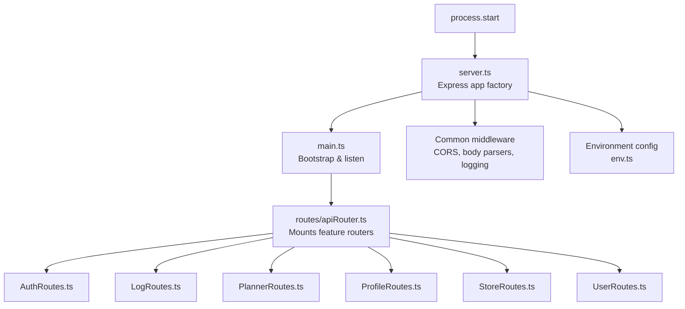
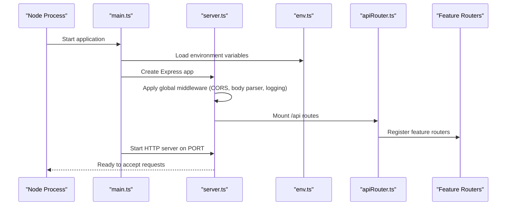
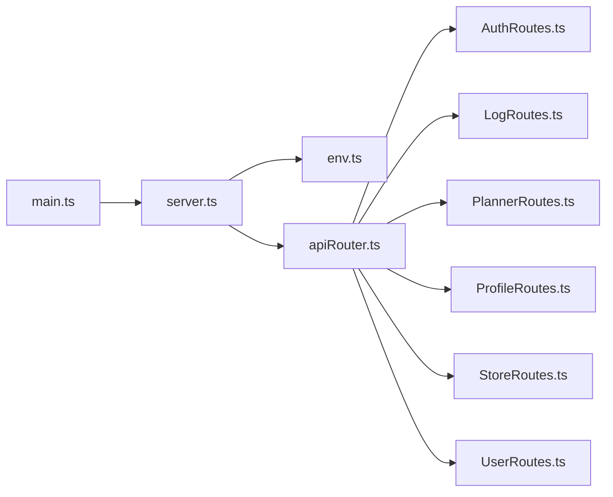

# Server Setup and Configuration

<cite>
**Referenced Files in This Document**
- [server.ts](file://Backend/src/server.ts)
- [main.ts](file://Backend/src/main.ts)
- [env.ts](file://Backend/src/common/constants/env.ts)
- [apiRouter.ts](file://Backend/src/routes/apiRouter.ts)
- [AuthRoutes.ts](file://Backend/src/routes/AuthRoutes.ts)
- [LogRoutes.ts](file://Backend/src/routes/LogRoutes.ts)
- [PlannerRoutes.ts](file://Backend/src/routes/PlannerRoutes.ts)
- [ProfileRoutes.ts](file://Backend/src/routes/ProfileRoutes.ts)
- [StoreRoutes.ts](file://Backend/src/routes/StoreRoutes.ts)
- [UserRoutes.ts](file://Backend/src/routes/UserRoutes.ts)
- [package.json](file://Backend/package.json)
</cite>

## Table of Contents
1. [Introduction](#introduction)
2. [Project Structure](#project-structure)
3. [Core Components](#core-components)
4. [Architecture Overview](#architecture-overview)
5. [Detailed Component Analysis](#detailed-component-analysis)
6. [Dependency Analysis](#dependency-analysis)
7. [Performance Considerations](#performance-considerations)
8. [Troubleshooting Guide](#troubleshooting-guide)
9. [Conclusion](#conclusion)

## Introduction
This document explains the Express.js server setup and configuration for the backend application. It covers how the server is initialized, how middleware is configured (CORS, request parsing, logging), environment variable management, and the bootstrap sequence from process start to listening on a port. It also includes guidance for development versus production settings and examples of typical startup flows.

## Project Structure
The Express server lives under Backend/src with a clear separation between entry points, configuration, routes, services, and utilities:
- Entry points: server.ts and main.ts
- Environment variables: common/constants/env.ts
- API router and route modules: routes/*
- Supporting services and repositories: services/*, repos/*
- Static assets and views: public/*, views/*

**Diagram sources**
- [server.ts](file://Backend/src/server.ts)
- [main.ts](file://Backend/src/main.ts)
- [env.ts](file://Backend/src/common/constants/env.ts)
- [apiRouter.ts](file://Backend/src/routes/apiRouter.ts)
- [AuthRoutes.ts](file://Backend/src/routes/AuthRoutes.ts)
- [LogRoutes.ts](file://Backend/src/routes/LogRoutes.ts)
- [PlannerRoutes.ts](file://Backend/src/routes/PlannerRoutes.ts)
- [ProfileRoutes.ts](file://Backend/src/routes/ProfileRoutes.ts)
- [StoreRoutes.ts](file://Backend/src/routes/StoreRoutes.ts)
- [UserRoutes.ts](file://Backend/src/routes/UserRoutes.ts)

**Section sources**
- [server.ts](file://Backend/src/server.ts)
- [main.ts](file://Backend/src/main.ts)
- [env.ts](file://Backend/src/common/constants/env.ts)
- [apiRouter.ts](file://Backend/src/routes/apiRouter.ts)

## Core Components
- Express app factory: Creates the Express application instance and wires global middleware such as CORS, body parsing, and logging.
- Bootstrap and listener: Loads environment variables, initializes dependencies, mounts routers, and starts the HTTP server on a configured port.
- Environment configuration: Centralizes access to environment variables with validation or defaults.
- API router: Aggregates feature-specific routers into a single mount path.
- Feature routers: Organize endpoints by domain (auth, logs, planner, profile, stores, users).

Key responsibilities:
- server.ts: App creation, middleware stack, error handling wiring.
- main.ts: Process bootstrap, env loading, dependency initialization, server.listen().
- env.ts: Typed accessors for environment variables.
- apiRouter.ts: Mounting sub-routers under a base path.
- Route files: Domain-scoped endpoint definitions.

**Section sources**
- [server.ts](file://Backend/src/server.ts)
- [main.ts](file://Backend/src/main.ts)
- [env.ts](file://Backend/src/common/constants/env.ts)
- [apiRouter.ts](file://Backend/src/routes/apiRouter.ts)

## Architecture Overview
The server bootstraps by importing the Express app factory, configuring environment variables, mounting routers, and starting the HTTP server. Middleware is applied globally before routing, ensuring consistent behavior across all requests.

**Diagram sources**
- [main.ts](file://Backend/src/main.ts)
- [server.ts](file://Backend/src/server.ts)
- [env.ts](file://Backend/src/common/constants/env.ts)
- [apiRouter.ts](file://Backend/src/routes/apiRouter.ts)

## Detailed Component Analysis

### Server Initialization and Bootstrap
- The bootstrap sequence loads environment variables, constructs the Express app, mounts routers, and listens on a port.
- Port selection typically falls back to a default when not provided via environment variables.
- Development vs production differences are commonly controlled through environment flags that toggle features like verbose logging, CORS origins, and debug output.

Typical flow:
- Read environment variables for port, host, and feature flags.
- Initialize database or external clients if required.
- Create the Express app and apply middleware.
- Mount route groups under a base path.
- Start the HTTP server and log readiness.

**Section sources**
- [main.ts](file://Backend/src/main.ts)
- [env.ts](file://Backend/src/common/constants/env.ts)

### Middleware Stack Configuration
Global middleware is applied early in the app lifecycle to ensure consistent behavior:
- CORS: Configure allowed origins, methods, headers, and credentials based on environment.
- Request parsing: Enable JSON and URL-encoded body parsing with size limits appropriate for the API.
- Logging: Attach request logging middleware to capture method, path, status, and duration.
- Error handling: Install an error-handling middleware at the end of the stack to normalize responses and logs.

Best practices:
- Keep CORS strict in production; allow specific origins only.
- Set explicit body size limits to prevent abuse.
- Use structured logging with correlation IDs for traceability.
- Ensure error middleware returns safe payloads without leaking internals.

**Section sources**
- [server.ts](file://Backend/src/server.ts)

### Environment Variable Management
Centralized environment configuration provides typed accessors and defaults:
- Common variables include server port, host, CORS origins, logging level, and feature toggles.
- Validation should fail fast on missing critical variables during development.
- Defaults should be sensible for local development while enforcing stricter values in production.

Usage patterns:
- Access variables via a dedicated module rather than direct process.env reads.
- Provide runtime checks for required keys.
- Expose helpers for boolean flags and numeric ports.

**Section sources**
- [env.ts](file://Backend/src/common/constants/env.ts)

### API Router and Route Organization
A central router aggregates feature routers under a common prefix:
- apiRouter.ts mounts sub-routers for auth, logs, planner, profile, stores, and users.
- Each route file exports Express router instances scoped to its domain.
- This structure keeps endpoints organized and simplifies testing and versioning.

Mounting pattern:
- Create a root router.
- Import feature routers.
- Use app.use('/api', router) to register them.

**Section sources**
- [apiRouter.ts](file://Backend/src/routes/apiRouter.ts)
- [AuthRoutes.ts](file://Backend/src/routes/AuthRoutes.ts)
- [LogRoutes.ts](file://Backend/src/routes/LogRoutes.ts)
- [PlannerRoutes.ts](file://Backend/src/routes/PlannerRoutes.ts)
- [ProfileRoutes.ts](file://Backend/src/routes/ProfileRoutes.ts)
- [StoreRoutes.ts](file://Backend/src/routes/StoreRoutes.ts)
- [UserRoutes.ts](file://Backend/src/routes/UserRoutes.ts)

### CORS Setup
CORS configuration controls cross-origin requests:
- Allowed origins can be a single origin or a list parsed from environment.
- Methods and headers should reflect the API’s needs.
- Credentials support requires careful origin configuration.

Recommendations:
- In development, allow localhost origins for frontend integration.
- In production, restrict to known domains and enforce HTTPS.

**Section sources**
- [server.ts](file://Backend/src/server.ts)
- [env.ts](file://Backend/src/common/constants/env.ts)

### Request Parsing
Body parsing middleware handles incoming payloads:
- JSON bodies are parsed with a maximum size limit.
- URL-encoded bodies may be enabled for form submissions.
- Content-Type validation ensures expected formats.

Security considerations:
- Enforce reasonable size limits to mitigate DoS.
- Reject unsupported content types early.

**Section sources**
- [server.ts](file://Backend/src/server.ts)

### Logging Configuration
Request logging captures essential telemetry:
- Log entries include timestamp, method, path, status code, and response time.
- Structured logs facilitate aggregation and analysis.
- Sensitive fields should be redacted.

Integration:
- Attach logging middleware after CORS and parsing but before route handlers.
- Optionally add correlation IDs for distributed tracing.

**Section sources**
- [server.ts](file://Backend/src/server.ts)

### Error Handling Middleware
Error middleware standardizes error responses:
- Captures thrown errors and unhandled rejections within the Express pipeline.
- Returns consistent JSON error shapes with appropriate HTTP status codes.
- Logs full stack traces in development; sanitized messages in production.

Patterns:
- Place error middleware last in the middleware chain.
- Use next(error) to signal errors from route handlers.

**Section sources**
- [server.ts](file://Backend/src/server.ts)

### Server Startup Examples
Typical startup scenarios:
- Local development: Run with default port and permissive CORS for frontend debugging.
- Production: Bind to a specific host/port, enable strict CORS, and set minimal logging verbosity.

Process:
- Start Node process.
- Load environment variables.
- Initialize Express app and middleware.
- Mount routers.
- Listen on port and log readiness.

**Section sources**
- [main.ts](file://Backend/src/main.ts)
- [package.json](file://Backend/package.json)

## Dependency Analysis
The server depends on core Express components and internal modules:
- Express app factory and middleware stack.
- Environment configuration module.
- API router and feature routers.
- Optional integrations (e.g., database client) initialized during bootstrap.

**Diagram sources**
- [main.ts](file://Backend/src/main.ts)
- [server.ts](file://Backend/src/server.ts)
- [env.ts](file://Backend/src/common/constants/env.ts)
- [apiRouter.ts](file://Backend/src/routes/apiRouter.ts)
- [AuthRoutes.ts](file://Backend/src/routes/AuthRoutes.ts)
- [LogRoutes.ts](file://Backend/src/routes/LogRoutes.ts)
- [PlannerRoutes.ts](file://Backend/src/routes/PlannerRoutes.ts)
- [ProfileRoutes.ts](file://Backend/src/routes/ProfileRoutes.ts)
- [StoreRoutes.ts](file://Backend/src/routes/StoreRoutes.ts)
- [UserRoutes.ts](file://Backend/src/routes/UserRoutes.ts)

**Section sources**
- [main.ts](file://Backend/src/main.ts)
- [server.ts](file://Backend/src/server.ts)
- [apiRouter.ts](file://Backend/src/routes/apiRouter.ts)

## Performance Considerations
- Minimize middleware overhead by enabling only necessary parsers and loggers.
- Use connection pooling for databases and external services.
- Tune body size limits and timeouts to balance security and usability.
- Enable compression for large responses where appropriate.
- Monitor memory usage and handle long-running tasks asynchronously.

[No sources needed since this section provides general guidance]

## Troubleshooting Guide
Common issues and resolutions:
- CORS errors: Verify allowed origins and credentials settings match the caller’s scheme and domain.
- 404 Not Found: Ensure routes are mounted under the correct base path and that static assets are served if needed.
- Body parsing failures: Check Content-Type headers and payload size limits.
- Unhandled errors: Confirm error middleware is registered last and that async errors are properly caught and passed to next.

Debugging steps:
- Increase logging verbosity in development.
- Inspect request/response headers and payloads using network tools.
- Validate environment variables for required keys and correct values.

**Section sources**
- [server.ts](file://Backend/src/server.ts)

## Conclusion
The Express server is structured around a clean separation of concerns: environment configuration, app factory with middleware, centralized routing, and feature-specific route modules. By following the documented patterns for CORS, parsing, logging, and error handling, you can maintain a secure, observable, and scalable API. Use environment-driven settings to tailor behavior across development and production environments.