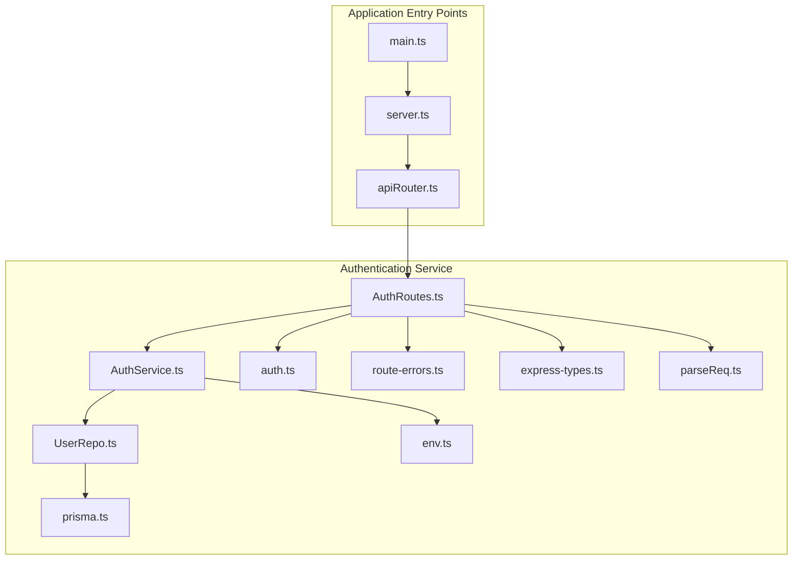
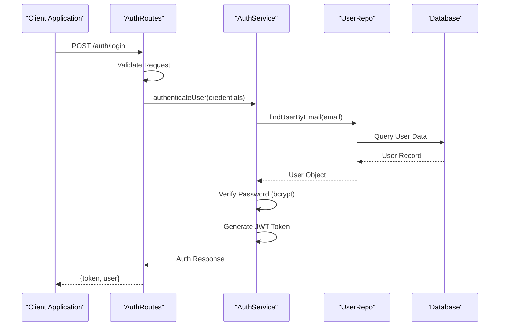
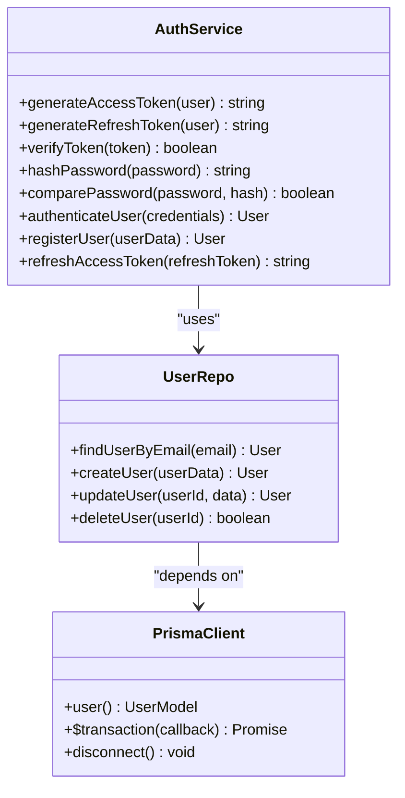
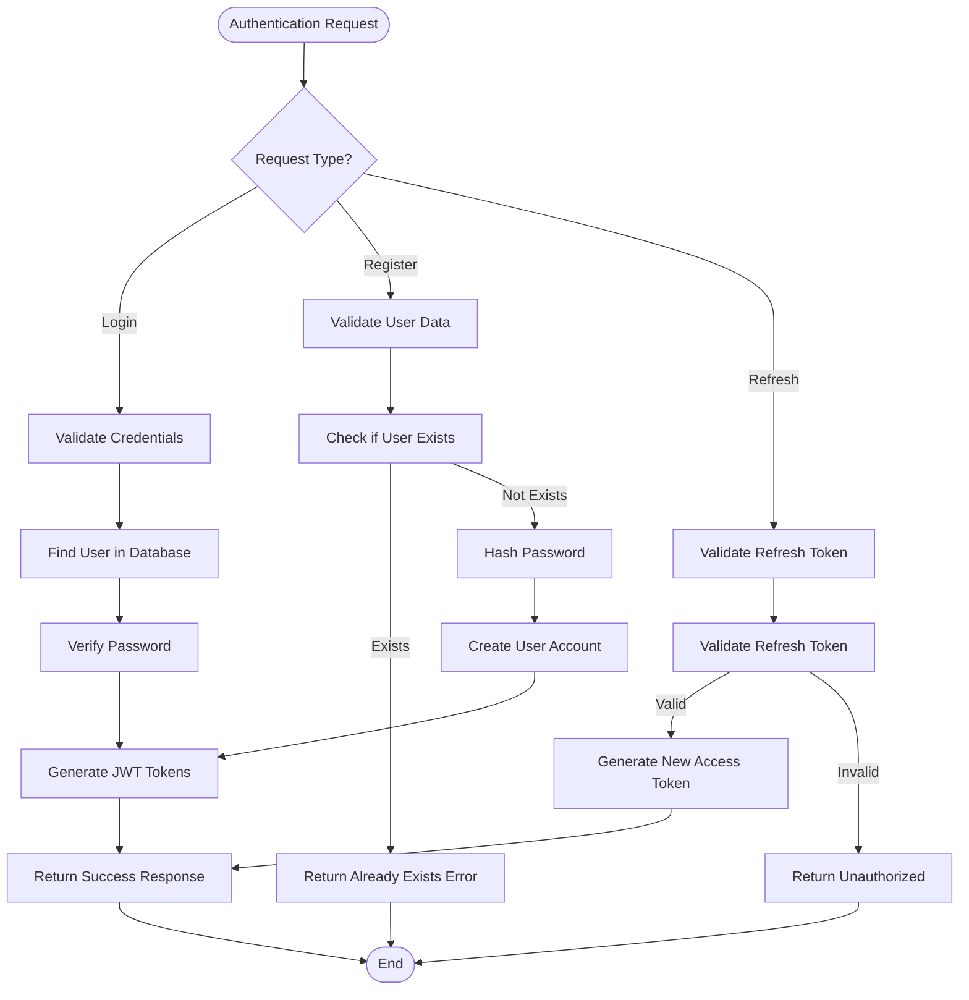
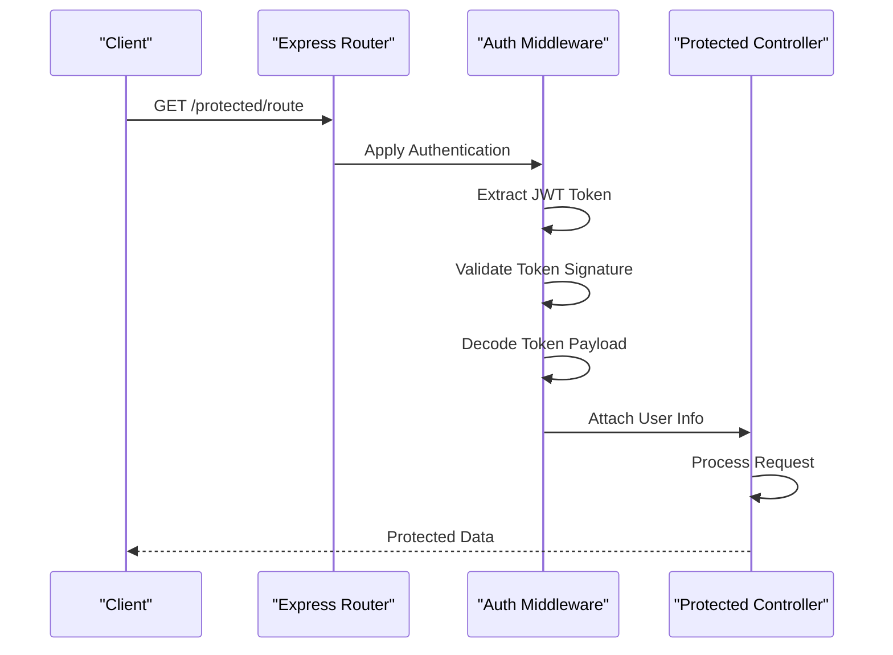
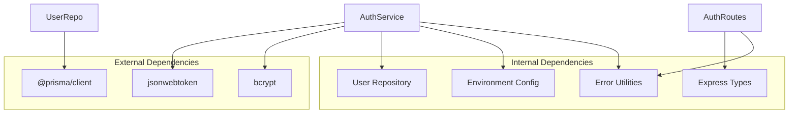

# Authentication Service

<cite>
**Referenced Files in This Document**
- [AuthService.ts](file://Backend/src/services/AuthService.ts)
- [AuthRoutes.ts](file://Backend/src/routes/AuthRoutes.ts)
- [auth.ts](file://Backend/src/routes/common/auth.ts)
- [UserRepo.ts](file://Backend/src/repos/UserRepo.ts)
- [prisma.ts](file://Backend/src/repos/prisma.ts)
- [env.ts](file://Backend/src/common/constants/env.ts)
- [route-errors.ts](file://Backend/src/common/utils/route-errors.ts)
- [express-types.ts](file://Backend/src/routes/common/express-types.ts)
- [parseReq.ts](file://Backend/src/routes/common/parseReq.ts)
- [main.ts](file://Backend/src/main.ts)
- [server.ts](file://Backend/src/server.ts)
- [apiRouter.ts](file://Backend/src/routes/apiRouter.ts)
</cite>

## Table of Contents
1. [Introduction](#introduction)
2. [Project Structure](#project-structure)
3. [Core Components](#core-components)
4. [Architecture Overview](#architecture-overview)
5. [Detailed Component Analysis](#detailed-component-analysis)
6. [Dependency Analysis](#dependency-analysis)
7. [Performance Considerations](#performance-considerations)
8. [Troubleshooting Guide](#troubleshooting-guide)
9. [Conclusion](#conclusion)

## Introduction
This document provides comprehensive documentation for the Authentication Service, focusing on JWT token generation and validation, password hashing with bcrypt, user session management, and authentication middleware implementation. It also covers the login flow, registration process, token refresh mechanism, security best practices, protected route implementation, error handling for authentication failures, and integration with the User repository layer.

## Project Structure
The Authentication Service is implemented within the Backend directory and integrates with Prisma for database operations. The key files involved in authentication include:
- AuthService.ts: Core authentication logic including JWT handling and password hashing
- AuthRoutes.ts: HTTP endpoints for authentication operations
- auth.ts: Common authentication utilities and middleware
- UserRepo.ts: Database operations for user data
- prisma.ts: Prisma client configuration
- env.ts: Environment variable configuration
- route-errors.ts: Error handling utilities
- express-types.ts: TypeScript type definitions for Express
- parseReq.ts: Request parsing utilities
- main.ts and server.ts: Application entry points
- apiRouter.ts: API routing configuration

**Diagram sources**
- [AuthRoutes.ts](file://Backend/src/routes/AuthRoutes.ts)
- [AuthService.ts](file://Backend/src/services/AuthService.ts)
- [auth.ts](file://Backend/src/routes/common/auth.ts)
- [UserRepo.ts](file://Backend/src/repos/UserRepo.ts)
- [prisma.ts](file://Backend/src/repos/prisma.ts)
- [env.ts](file://Backend/src/common/constants/env.ts)
- [route-errors.ts](file://Backend/src/common/utils/route-errors.ts)
- [express-types.ts](file://Backend/src/routes/common/express-types.ts)
- [parseReq.ts](file://Backend/src/routes/common/parseReq.ts)
- [main.ts](file://Backend/src/main.ts)
- [server.ts](file://Backend/src/server.ts)
- [apiRouter.ts](file://Backend/src/routes/apiRouter.ts)

**Section sources**
- [AuthRoutes.ts](file://Backend/src/routes/AuthRoutes.ts)
- [AuthService.ts](file://Backend/src/services/AuthService.ts)
- [auth.ts](file://Backend/src/routes/common/auth.ts)
- [UserRepo.ts](file://Backend/src/repos/UserRepo.ts)
- [prisma.ts](file://Backend/src/repos/prisma.ts)
- [env.ts](file://Backend/src/common/constants/env.ts)
- [route-errors.ts](file://Backend/src/common/utils/route-errors.ts)
- [express-types.ts](file://Backend/src/routes/common/express-types.ts)
- [parseReq.ts](file://Backend/src/routes/common/parseReq.ts)
- [main.ts](file://Backend/src/main.ts)
- [server.ts](file://Backend/src/server.ts)
- [apiRouter.ts](file://Backend/src/routes/apiRouter.ts)

## Core Components
The Authentication Service consists of several core components that work together to provide secure authentication functionality:

### AuthService Component
The AuthService handles the core authentication logic including JWT token generation and validation, password hashing with bcrypt, and user authentication operations.

### AuthRoutes Component  
AuthRoutes defines the HTTP endpoints for authentication operations such as login, registration, and token refresh.

### Authentication Middleware
The authentication middleware validates JWT tokens and manages user sessions for protected routes.

### User Repository Integration
The service integrates with the User repository layer for database operations through Prisma ORM.

**Section sources**
- [AuthService.ts](file://Backend/src/services/AuthService.ts)
- [AuthRoutes.ts](file://Backend/src/routes/AuthRoutes.ts)
- [auth.ts](file://Backend/src/routes/common/auth.ts)
- [UserRepo.ts](file://Backend/src/repos/UserRepo.ts)

## Architecture Overview
The Authentication Service follows a layered architecture pattern with clear separation of concerns between routing, business logic, and data access layers.

**Diagram sources**
- [AuthRoutes.ts](file://Backend/src/routes/AuthRoutes.ts)
- [AuthService.ts](file://Backend/src/services/AuthService.ts)
- [UserRepo.ts](file://Backend/src/repos/UserRepo.ts)

## Detailed Component Analysis

### AuthService Implementation
The AuthService component implements the core authentication logic with JWT token management and password hashing capabilities.

#### JWT Token Generation and Validation
The service generates JSON Web Tokens for authenticated users and validates them for subsequent requests.

#### Password Hashing with bcrypt
User passwords are securely hashed using bcrypt before storage and verified during authentication.

#### User Session Management
The service manages user sessions through JWT tokens, eliminating the need for server-side session storage.

**Diagram sources**
- [AuthService.ts](file://Backend/src/services/AuthService.ts)
- [UserRepo.ts](file://Backend/src/repos/UserRepo.ts)
- [prisma.ts](file://Backend/src/repos/prisma.ts)

### Authentication Flow
The authentication flow encompasses login, registration, and token refresh processes.

#### Login Process
Users authenticate by providing email and password credentials, which are validated against stored user data.

#### Registration Process
New users can register by providing required information, which is validated and stored securely.

#### Token Refresh Mechanism
The service implements a refresh token system to maintain user sessions without frequent re-authentication.

**Diagram sources**
- [AuthService.ts](file://Backend/src/services/AuthService.ts)
- [AuthRoutes.ts](file://Backend/src/routes/AuthRoutes.ts)

### Protected Route Implementation
Protected routes use authentication middleware to verify user identity before granting access to sensitive resources.

#### Middleware Implementation
The authentication middleware validates JWT tokens and attaches user information to request objects.

#### Route Protection Strategy
Routes are protected by applying the authentication middleware to ensure only authenticated users can access them.

**Diagram sources**
- [auth.ts](file://Backend/src/routes/common/auth.ts)
- [AuthRoutes.ts](file://Backend/src/routes/AuthRoutes.ts)

### Error Handling for Authentication Failures
The service implements comprehensive error handling for various authentication failure scenarios.

#### Common Error Scenarios
- Invalid credentials during login
- Expired or invalid tokens
- Missing or malformed request data
- Database connection errors

#### Error Response Format
Standardized error responses provide consistent feedback to clients about authentication failures.

**Section sources**
- [AuthService.ts](file://Backend/src/services/AuthService.ts)
- [AuthRoutes.ts](file://Backend/src/routes/AuthRoutes.ts)
- [auth.ts](file://Backend/src/routes/common/auth.ts)
- [route-errors.ts](file://Backend/src/common/utils/route-errors.ts)

## Dependency Analysis
The Authentication Service has well-defined dependencies on external services and internal modules.

**Diagram sources**
- [AuthService.ts](file://Backend/src/services/AuthService.ts)
- [UserRepo.ts](file://Backend/src/repos/UserRepo.ts)
- [env.ts](file://Backend/src/common/constants/env.ts)
- [route-errors.ts](file://Backend/src/common/utils/route-errors.ts)
- [express-types.ts](file://Backend/src/routes/common/express-types.ts)

**Section sources**
- [AuthService.ts](file://Backend/src/services/AuthService.ts)
- [UserRepo.ts](file://Backend/src/repos/UserRepo.ts)
- [env.ts](file://Backend/src/common/constants/env.ts)
- [route-errors.ts](file://Backend/src/common/utils/route-errors.ts)
- [express-types.ts](file://Backend/src/routes/common/express-types.ts)

## Performance Considerations
The Authentication Service is designed with performance optimization in mind:

### JWT Token Efficiency
JWT tokens are stateless, reducing server memory usage and enabling horizontal scaling.

### Password Hashing Optimization
bcrypt is configured with appropriate cost factors to balance security and performance.

### Database Query Optimization
Efficient database queries minimize response times for authentication operations.

### Caching Strategies
Potential caching strategies for frequently accessed user data can further improve performance.

## Troubleshooting Guide
Common authentication issues and their solutions:

### JWT Token Issues
- **Expired Tokens**: Implement automatic token refresh mechanisms
- **Invalid Signatures**: Verify secret key configuration
- **Malformed Tokens**: Ensure proper token formatting in client requests

### Password Verification Problems
- **Hash Comparison Failures**: Verify bcrypt salt rounds configuration
- **Encoding Issues**: Ensure consistent character encoding throughout the application

### Database Connection Errors
- **Connection Pool Exhaustion**: Monitor and adjust connection pool settings
- **Migration Issues**: Ensure database schema matches Prisma model definitions

### Security Best Practices
- **Secret Key Management**: Store JWT secrets in environment variables
- **Input Validation**: Implement comprehensive input validation
- **Rate Limiting**: Protect against brute force attacks
- **HTTPS Enforcement**: Always use HTTPS in production environments

**Section sources**
- [AuthService.ts](file://Backend/src/services/AuthService.ts)
- [env.ts](file://Backend/src/common/constants/env.ts)
- [route-errors.ts](file://Backend/src/common/utils/route-errors.ts)

## Conclusion
The Authentication Service provides a robust and secure foundation for user authentication in the StudentBite application. Through the implementation of JWT tokens, bcrypt password hashing, and comprehensive error handling, it ensures both security and usability. The modular architecture allows for easy maintenance and future enhancements while maintaining clear separation of concerns between different layers of the application.