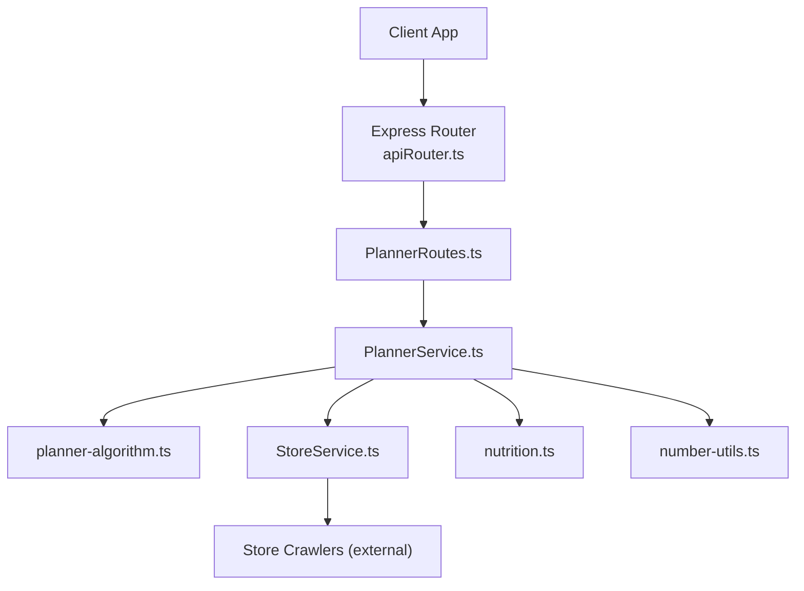
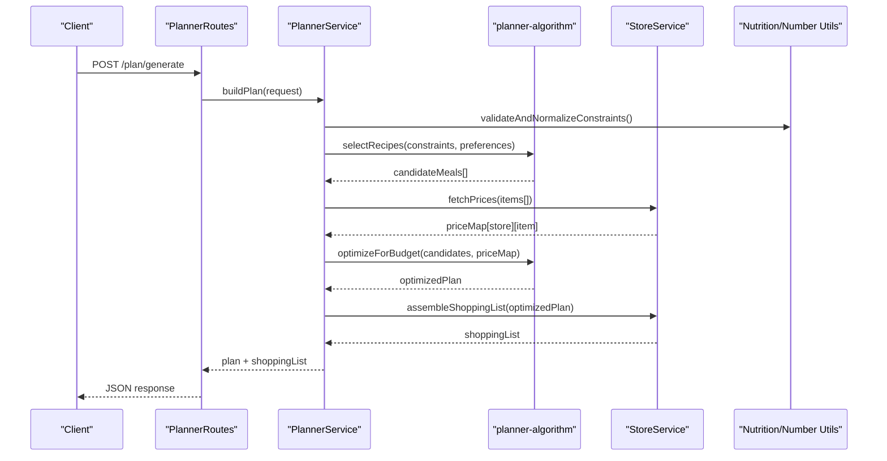
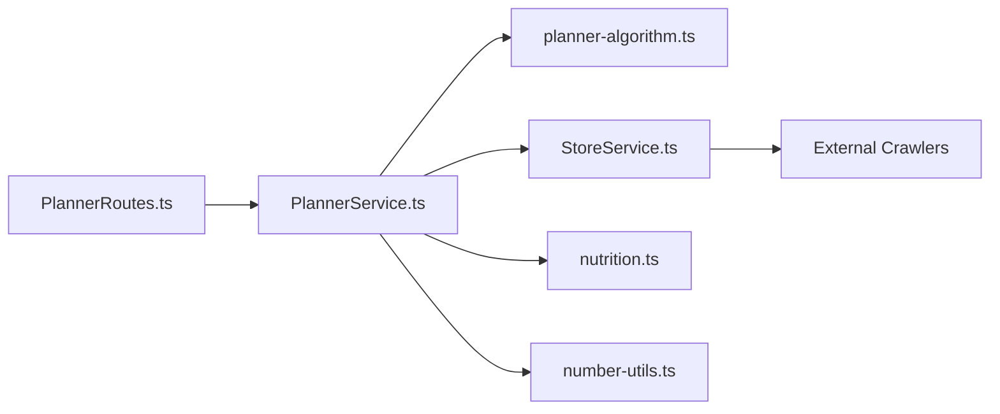
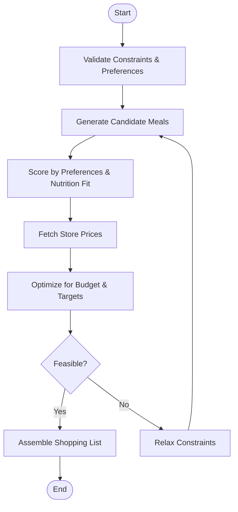

# Meal Planning Service

<cite>
**Referenced Files in This Document**
- [PlannerRoutes.ts](file://Backend/src/routes/PlannerRoutes.ts)
- [PlannerService.ts](file://Backend/src/services/PlannerService.ts)
- [planner-algorithm.ts](file://Backend/src/services/planner-algorithm.ts)
- [StoreService.ts](file://Backend/src/services/StoreService.ts)
- [nutrition.ts](file://Backend/src/common/utils/nutrition.ts)
- [number-utils.ts](file://Backend/src/common/utils/number-utils.ts)
- [apiRouter.ts](file://Backend/src/routes/apiRouter.ts)
- [main.ts](file://Backend/src/main.ts)
- [server.ts](file://Backend/src/server.ts)
- [package.json](file://Backend/package.json)
</cite>

## Table of Contents
1. [Introduction](#introduction)
2. [Project Structure](#project-structure)
3. [Core Components](#core-components)
4. [Architecture Overview](#architecture-overview)
5. [Detailed Component Analysis](#detailed-component-analysis)
6. [Dependency Analysis](#dependency-analysis)
7. [Performance Considerations](#performance-considerations)
8. [Troubleshooting Guide](#troubleshooting-guide)
9. [Conclusion](#conclusion)
10. [Appendices](#appendices)

## Introduction
This document explains the Meal Planning Service that orchestrates meal plan generation. It coordinates with a planner algorithm engine to produce weekly or daily plans based on nutritional constraints, budget optimization, and user preferences. The service integrates with store price comparison services to optimize shopping costs and generate actionable shopping lists. It also provides configuration examples for custom constraints and outlines performance optimization techniques.

## Project Structure
The Meal Planning Service is implemented in the Backend module:
- Routes expose HTTP endpoints for planning operations.
- Services encapsulate business logic for planning, store integration, and utilities.
- A dedicated planner algorithm module implements core selection and optimization logic.
- Common utilities provide nutrition calculations and number helpers.

**Diagram sources**
- [apiRouter.ts](file://Backend/src/routes/apiRouter.ts)
- [PlannerRoutes.ts](file://Backend/src/routes/PlannerRoutes.ts)
- [PlannerService.ts](file://Backend/src/services/PlannerService.ts)
- [planner-algorithm.ts](file://Backend/src/services/planner-algorithm.ts)
- [StoreService.ts](file://Backend/src/services/StoreService.ts)
- [nutrition.ts](file://Backend/src/common/utils/nutrition.ts)
- [number-utils.ts](file://Backend/src/common/utils/number-utils.ts)

**Section sources**
- [apiRouter.ts](file://Backend/src/routes/apiRouter.ts)
- [PlannerRoutes.ts](file://Backend/src/routes/PlannerRoutes.ts)
- [PlannerService.ts](file://Backend/src/services/PlannerService.ts)
- [planner-algorithm.ts](file://Backend/src/services/planner-algorithm.ts)
- [StoreService.ts](file://Backend/src/services/StoreService.ts)
- [nutrition.ts](file://Backend/src/common/utils/nutrition.ts)
- [number-utils.ts](file://Backend/src/common/utils/number-utils.ts)

## Core Components
- PlannerRoutes: Defines HTTP endpoints for generating plans, fetching suggestions, and retrieving shopping lists.
- PlannerService: Orchestrates plan generation by combining user constraints, algorithmic selection, and store pricing.
- planner-algorithm: Implements constraint satisfaction, preference scoring, and optimization heuristics for recipe selection.
- StoreService: Aggregates prices from multiple stores and supports price comparison and best-store selection.
- nutrition: Provides macros/micros aggregation and constraint validation helpers.
- number-utils: Offers rounding, normalization, and numeric formatting used across planning logic.

Key responsibilities:
- Input validation and normalization for constraints and preferences.
- Constraint propagation and feasibility checks before invoking the algorithm.
- Iterative refinement using store prices to minimize cost while meeting targets.
- Shopping list assembly with store-specific itemization and quantities.

**Section sources**
- [PlannerRoutes.ts](file://Backend/src/routes/PlannerRoutes.ts)
- [PlannerService.ts](file://Backend/src/services/PlannerService.ts)
- [planner-algorithm.ts](file://Backend/src/services/planner-algorithm.ts)
- [StoreService.ts](file://Backend/src/services/StoreService.ts)
- [nutrition.ts](file://Backend/src/common/utils/nutrition.ts)
- [number-utils.ts](file://Backend/src/common/utils/number-utils.ts)

## Architecture Overview
The service follows a layered architecture:
- Presentation layer: Express routes handle requests and responses.
- Application layer: PlannerService coordinates workflows and delegates to specialized modules.
- Domain layer: planner-algorithm contains the core planning logic; StoreService encapsulates external integrations.
- Infrastructure layer: External crawlers fetch store prices; database persistence is handled elsewhere.

**Diagram sources**
- [PlannerRoutes.ts](file://Backend/src/routes/PlannerRoutes.ts)
- [PlannerService.ts](file://Backend/src/services/PlannerService.ts)
- [planner-algorithm.ts](file://Backend/src/services/planner-algorithm.ts)
- [StoreService.ts](file://Backend/src/services/StoreService.ts)
- [nutrition.ts](file://Backend/src/common/utils/nutrition.ts)
- [number-utils.ts](file://Backend/src/common/utils/number-utils.ts)

## Detailed Component Analysis

### PlannerRoutes
- Exposes endpoints for plan generation, suggestions, and shopping list retrieval.
- Validates request payloads and forwards them to PlannerService.
- Returns standardized JSON responses including plan details and shopping list.

Responsibilities:
- Route registration under the API router.
- Request parsing and error mapping.
- Response serialization.

**Section sources**
- [PlannerRoutes.ts](file://Backend/src/routes/PlannerRoutes.ts)
- [apiRouter.ts](file://Backend/src/routes/apiRouter.ts)

### PlannerService
Orchestrates end-to-end plan generation:
- Normalizes inputs (calories, macros, dietary restrictions, budget).
- Invokes planner-algorithm to generate candidate meals.
- Integrates StoreService to compare prices and optimize cost.
- Produces final plan and shopping list.

Workflow highlights:
- Constraint validation and fallback strategies when no feasible solution exists.
- Preference weighting to rank candidates before optimization.
- Budget-aware selection using price maps from StoreService.

**Section sources**
- [PlannerService.ts](file://Backend/src/services/PlannerService.ts)
- [planner-algorithm.ts](file://Backend/src/services/planner-algorithm.ts)
- [StoreService.ts](file://Backend/src/services/StoreService.ts)
- [nutrition.ts](file://Backend/src/common/utils/nutrition.ts)
- [number-utils.ts](file://Backend/src/common/utils/number-utils.ts)

### planner-algorithm
Implements the core planning engine:
- Candidate generation based on recipes and constraints.
- Scoring function incorporating preferences and nutritional fit.
- Optimization loop to meet budget and macro targets.
- Feasibility checks and iterative refinement.

Algorithm characteristics:
- Heuristic-based search with pruning for infeasible branches.
- Preference-weighted ranking to align with user tastes.
- Constraint propagation to reduce search space early.

**Section sources**
- [planner-algorithm.ts](file://Backend/src/services/planner-algorithm.ts)
- [nutrition.ts](file://Backend/src/common/utils/nutrition.ts)

### StoreService
Handles store price comparison and shopping list creation:
- Fetches current prices from multiple stores via crawlers.
- Builds a price map keyed by store and item.
- Selects optimal stores per item to minimize total cost.
- Generates a consolidated shopping list with quantities and store assignments.

Integration points:
- External crawlers supply raw price data.
- PlannerService consumes price maps for budget optimization.

**Section sources**
- [StoreService.ts](file://Backend/src/services/StoreService.ts)

### Utilities: nutrition and number-utils
- nutrition: Aggregates nutritional values, validates macro/micro constraints, and computes deviations from targets.
- number-utils: Provides rounding, normalization, and formatting helpers used throughout planning and reporting.

**Section sources**
- [nutrition.ts](file://Backend/src/common/utils/nutrition.ts)
- [number-utils.ts](file://Backend/src/common/utils/number-utils.ts)

### Entry Points and Routing
- main.ts initializes application lifecycle and dependencies.
- server.ts configures Express middleware and mounts routers.
- apiRouter.ts aggregates route modules, including PlannerRoutes.

**Section sources**
- [main.ts](file://Backend/src/main.ts)
- [server.ts](file://Backend/src/server.ts)
- [apiRouter.ts](file://Backend/src/routes/apiRouter.ts)

## Dependency Analysis
The Meal Planning Service has clear separation of concerns:
- PlannerRoutes depends on PlannerService.
- PlannerService depends on planner-algorithm and StoreService.
- StoreService depends on external crawlers for price data.
- PlannerService uses nutrition and number-utils for validation and computation.

**Diagram sources**
- [PlannerRoutes.ts](file://Backend/src/routes/PlannerRoutes.ts)
- [PlannerService.ts](file://Backend/src/services/PlannerService.ts)
- [planner-algorithm.ts](file://Backend/src/services/planner-algorithm.ts)
- [StoreService.ts](file://Backend/src/services/StoreService.ts)
- [nutrition.ts](file://Backend/src/common/utils/nutrition.ts)
- [number-utils.ts](file://Backend/src/common/utils/number-utils.ts)

**Section sources**
- [PlannerRoutes.ts](file://Backend/src/routes/PlannerRoutes.ts)
- [PlannerService.ts](file://Backend/src/services/PlannerService.ts)
- [planner-algorithm.ts](file://Backend/src/services/planner-algorithm.ts)
- [StoreService.ts](file://Backend/src/services/StoreService.ts)
- [nutrition.ts](file://Backend/src/common/utils/nutrition.ts)
- [number-utils.ts](file://Backend/src/common/utils/number-utils.ts)

## Performance Considerations
- Cache price maps: Reuse StoreService price results within a short TTL to avoid repeated crawling.
- Precompute nutrition profiles: Memoize recipe nutrition to reduce recomputation during scoring.
- Limit search space: Apply strict constraint propagation early to prune infeasible candidates.
- Batch requests: Group store price queries to reduce network overhead.
- Parallel processing: Run independent steps (e.g., fetching multiple stores) concurrently where safe.
- Adaptive granularity: Adjust macro tolerance thresholds to balance accuracy and speed.
- Pagination and limits: Cap candidate set size to maintain responsiveness under high load.

[No sources needed since this section provides general guidance]

## Troubleshooting Guide
Common issues and resolutions:
- No feasible plan found:
  - Relax constraints incrementally (increase calorie range, broaden dietary filters).
  - Check nutrition validation outputs for impossible combinations.
- Budget exceeded:
  - Verify price map completeness and freshness.
  - Increase budget or adjust preference weights toward cheaper items.
- Inconsistent shopping list:
  - Ensure item normalization matches store catalog naming conventions.
  - Confirm quantity aggregation logic handles duplicates correctly.
- Slow response times:
  - Enable caching for prices and nutrition profiles.
  - Reduce candidate set size and tighten constraint propagation.

**Section sources**
- [PlannerService.ts](file://Backend/src/services/PlannerService.ts)
- [planner-algorithm.ts](file://Backend/src/services/planner-algorithm.ts)
- [StoreService.ts](file://Backend/src/services/StoreService.ts)
- [nutrition.ts](file://Backend/src/common/utils/nutrition.ts)

## Conclusion
The Meal Planning Service delivers robust, constraint-driven meal plan generation by integrating an algorithm engine with real-time store pricing. It balances nutritional goals, user preferences, and budget constraints while producing actionable shopping lists. With careful configuration of constraints and performance optimizations, it can scale to serve diverse user needs efficiently.

[No sources needed since this section summarizes without analyzing specific files]

## Appendices

### Plan Generation Workflow

[No sources needed since this diagram shows conceptual workflow, not actual code structure]

### Custom Constraint Configuration Examples
- Nutritional targets:
  - Set daily calories, macro ratios, and micro nutrient floors/ceilings.
  - Example: 2000 kcal/day, protein 30%, carbs 50%, fat 20%.
- Dietary restrictions:
  - Exclude allergens, enforce vegetarian/vegan, halal/kosher preferences.
- Budget settings:
  - Define maximum weekly spend and per-meal caps.
- Preference weights:
  - Prioritize cuisines, cooking time, or ingredient availability.

[No sources needed since this section provides general guidance]

### Integration Notes
- Store crawlers:
  - Ensure consistent item normalization and currency handling.
- Error resilience:
  - Fallback to cached prices if crawlers fail.
- Monitoring:
  - Track plan feasibility rates, average cost, and runtime metrics.

[No sources needed since this section provides general guidance]