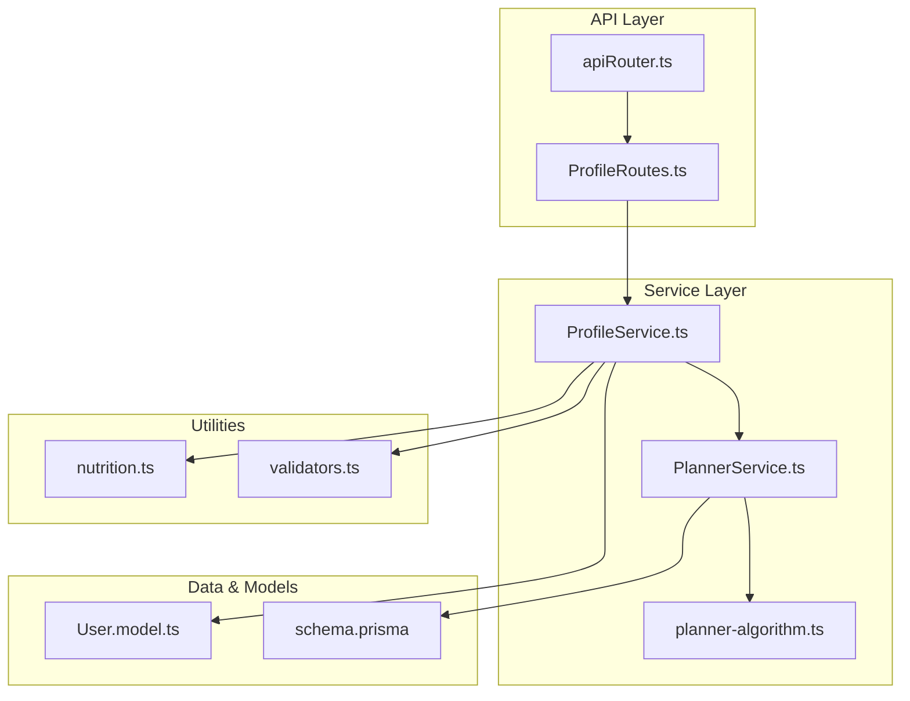
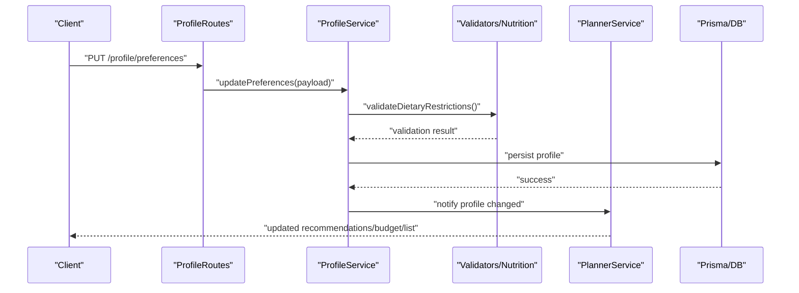
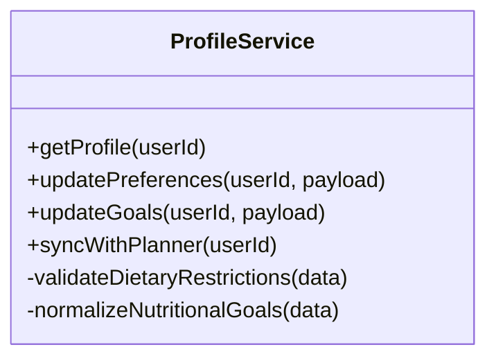
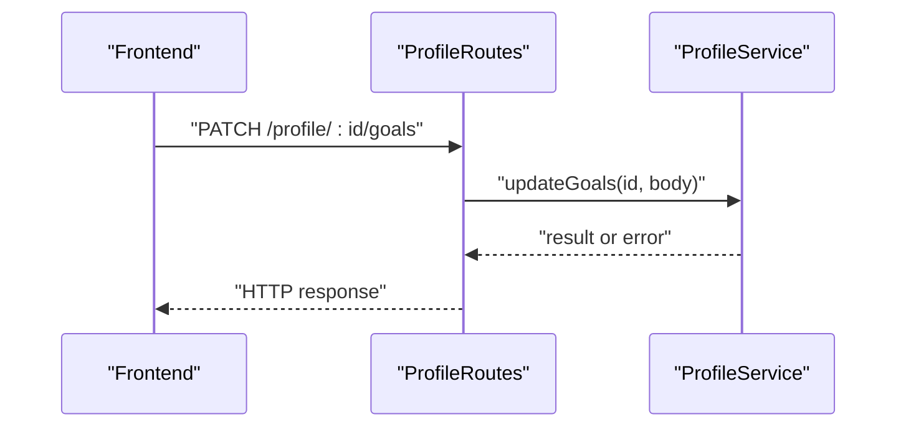
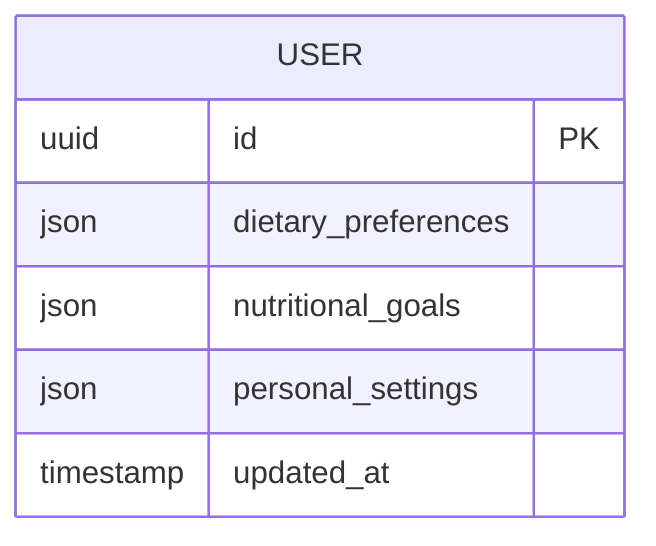
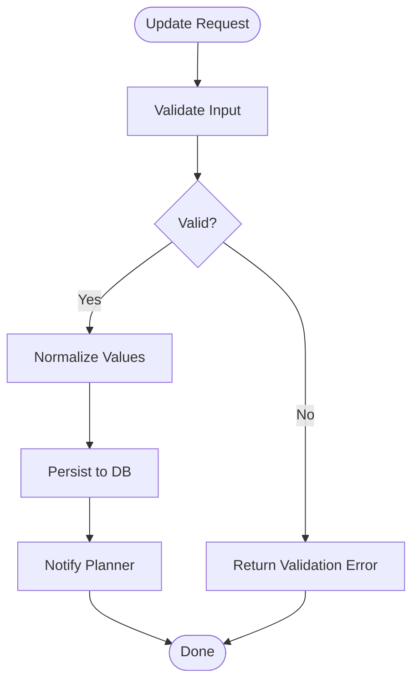
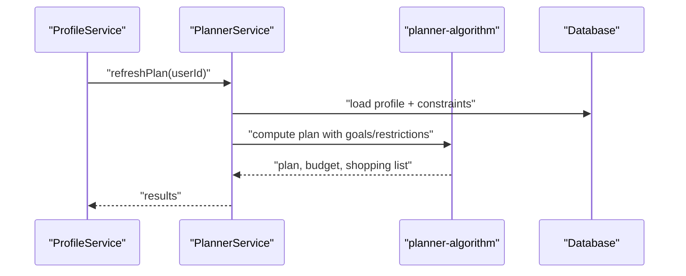
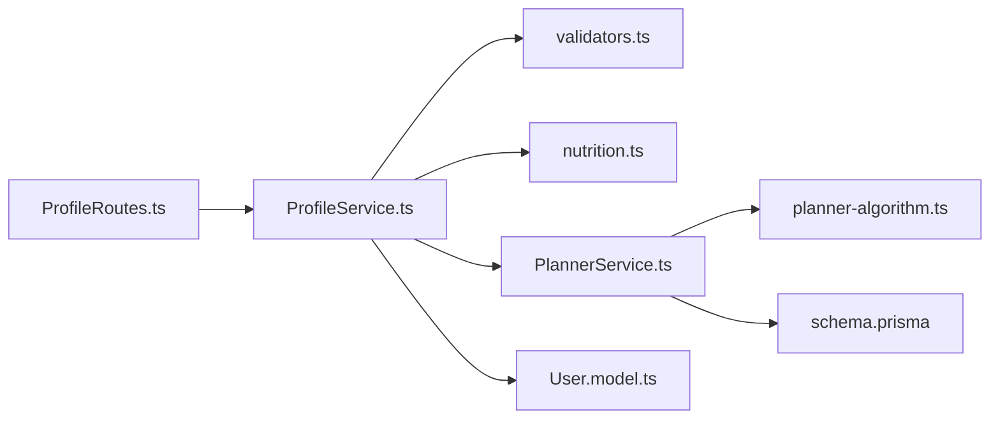

# Profile Management Service

<cite>
**Referenced Files in This Document**
- [ProfileService.ts](file://Backend/src/services/ProfileService.ts)
- [ProfileRoutes.ts](file://Backend/src/routes/ProfileRoutes.ts)
- [User.model.ts](file://Backend/src/models/User.model.ts)
- [PlannerService.ts](file://Backend/src/services/PlannerService.ts)
- [planner-algorithm.ts](file://Backend/src/services/planner-algorithm.ts)
- [schema.prisma](file://Backend/prisma/schema.prisma)
- [nutrition.ts](file://Backend/src/common/utils/nutrition.ts)
- [validators.ts](file://Backend/src/common/utils/validators.ts)
- [apiRouter.ts](file://Backend/src/routes/apiRouter.ts)
</cite>

## Table of Contents
1. [Introduction](#introduction)
2. [Project Structure](#project-structure)
3. [Core Components](#core-components)
4. [Architecture Overview](#architecture-overview)
5. [Detailed Component Analysis](#detailed-component-analysis)
6. [Dependency Analysis](#dependency-analysis)
7. [Performance Considerations](#performance-considerations)
8. [Troubleshooting Guide](#troubleshooting-guide)
9. [Conclusion](#conclusion)
10. [Appendices](#appendices)

## Introduction
This document describes the Profile Management Service that manages user dietary preferences, nutritional goals, and personal settings. It explains how profile data is stored, validated, and consumed by downstream systems such as meal planning, budget calculations, and shopping list generation. It also provides examples of preference updates and profile synchronization flows.

## Project Structure
The Profile Management Service resides in the backend layer and integrates with:
- Data models and persistence schema for user profiles
- Route handlers exposing REST endpoints
- A service layer implementing business logic
- Shared utilities for validation and nutrition calculations
- The planner subsystem for generating recommendations based on profile data

**Diagram sources**
- [ProfileRoutes.ts](file://Backend/src/routes/ProfileRoutes.ts)
- [apiRouter.ts](file://Backend/src/routes/apiRouter.ts)
- [ProfileService.ts](file://Backend/src/services/ProfileService.ts)
- [PlannerService.ts](file://Backend/src/services/PlannerService.ts)
- [planner-algorithm.ts](file://Backend/src/services/planner-algorithm.ts)
- [User.model.ts](file://Backend/src/models/User.model.ts)
- [schema.prisma](file://Backend/prisma/schema.prisma)
- [nutrition.ts](file://Backend/src/common/utils/nutrition.ts)
- [validators.ts](file://Backend/src/common/utils/validators.ts)

**Section sources**
- [ProfileRoutes.ts](file://Backend/src/routes/ProfileRoutes.ts)
- [ProfileService.ts](file://Backend/src/services/ProfileService.ts)
- [User.model.ts](file://Backend/src/models/User.model.ts)
- [schema.prisma](file://Backend/prisma/schema.prisma)
- [apiRouter.ts](file://Backend/src/routes/apiRouter.ts)

## Core Components
- ProfileService: Encapsulates all profile-related business logic including reading, updating, and validating dietary preferences and nutritional goals.
- ProfileRoutes: Exposes HTTP endpoints to create, read, update, and delete profile data.
- User model: Defines the shape of user profile data persisted to the database.
- Planner integration: Consumes profile data to influence meal recommendations, budgeting, and shopping lists.
- Utilities: Provide validation rules and nutrition calculations used across services.

Key responsibilities:
- Validate dietary restrictions and nutritional targets before persisting changes
- Normalize and store preferences consistently
- Supply profile context to the planner for personalized outputs
- Ensure consistency when synchronizing profile updates across features

**Section sources**
- [ProfileService.ts](file://Backend/src/services/ProfileService.ts)
- [ProfileRoutes.ts](file://Backend/src/routes/ProfileRoutes.ts)
- [User.model.ts](file://Backend/src/models/User.model.ts)
- [nutrition.ts](file://Backend/src/common/utils/nutrition.ts)
- [validators.ts](file://Backend/src/common/utils/validators.ts)

## Architecture Overview
The Profile Management Service follows a layered architecture:
- API routes receive requests and delegate to the service layer
- The service layer enforces validation and orchestrates data operations
- The planner consumes profile data to generate recommendations and budgets
- Persistence is handled via Prisma schema and associated models

**Diagram sources**
- [ProfileRoutes.ts](file://Backend/src/routes/ProfileRoutes.ts)
- [ProfileService.ts](file://Backend/src/services/ProfileService.ts)
- [validators.ts](file://Backend/src/common/utils/validators.ts)
- [nutrition.ts](file://Backend/src/common/utils/nutrition.ts)
- [PlannerService.ts](file://Backend/src/services/PlannerService.ts)
- [schema.prisma](file://Backend/prisma/schema.prisma)

## Detailed Component Analysis

### Profile Service (ProfileService.ts)
Responsibilities:
- Read current profile state
- Update dietary preferences, nutritional goals, and personal settings
- Validate inputs against allowed values and constraints
- Trigger planner recomputation when relevant fields change
- Return consistent responses and errors

Validation and normalization:
- Enforce allowed dietary restriction values
- Ensure nutritional goals are within reasonable bounds
- Normalize units and formats for consistency

Integration points:
- Calls planner to refresh recommendations and derived artifacts after profile updates
- Uses shared validators and nutrition utilities for cross-cutting concerns

**Diagram sources**
- [ProfileService.ts](file://Backend/src/services/ProfileService.ts)

**Section sources**
- [ProfileService.ts](file://Backend/src/services/ProfileService.ts)

### Profile Routes (ProfileRoutes.ts)
Responsibilities:
- Define endpoints for profile CRUD operations
- Parse and forward payloads to ProfileService
- Handle basic request-level validation and error mapping

Typical endpoints:
- GET /profile/:userId
- PUT /profile/:userId/preferences
- PATCH /profile/:userId/goals
- DELETE /profile/:userId (if supported)

**Diagram sources**
- [ProfileRoutes.ts](file://Backend/src/routes/ProfileRoutes.ts)
- [ProfileService.ts](file://Backend/src/services/ProfileService.ts)

**Section sources**
- [ProfileRoutes.ts](file://Backend/src/routes/ProfileRoutes.ts)

### Data Model and Schema (User.model.ts, schema.prisma)
- User model defines the structure of profile data including dietary preferences, nutritional goals, and personal settings.
- Prisma schema defines tables, relationships, and constraints ensuring data integrity.

Key aspects:
- Dietary restrictions stored as an array or enum set
- Nutritional goals include daily targets (e.g., calories, macros)
- Personal settings may include units, currency, and locale

**Diagram sources**
- [User.model.ts](file://Backend/src/models/User.model.ts)
- [schema.prisma](file://Backend/prisma/schema.prisma)

**Section sources**
- [User.model.ts](file://Backend/src/models/User.model.ts)
- [schema.prisma](file://Backend/prisma/schema.prisma)

### Validation and Nutrition Utilities (validators.ts, nutrition.ts)
- Validators enforce allowed values for dietary restrictions and ensure goal ranges are valid.
- Nutrition utilities provide helpers for unit conversions, macro balancing checks, and calorie computations.

Usage patterns:
- Called by ProfileService during updates to prevent invalid states
- Used by planner to interpret profile-driven constraints

**Diagram sources**
- [validators.ts](file://Backend/src/common/utils/validators.ts)
- [nutrition.ts](file://Backend/src/common/utils/nutrition.ts)
- [ProfileService.ts](file://Backend/src/services/ProfileService.ts)

**Section sources**
- [validators.ts](file://Backend/src/common/utils/validators.ts)
- [nutrition.ts](file://Backend/src/common/utils/nutrition.ts)

### Integration with Meal Planning (PlannerService.ts, planner-algorithm.ts)
How profile data influences planning:
- Dietary restrictions filter eligible meals and ingredients
- Nutritional goals guide macro and calorie targets per day
- Personal settings affect budget currency, units, and store selection

Recommendation flow:
- Planner reads current profile
- Applies constraints and goals to algorithm
- Generates meal plans, estimated costs, and shopping lists

**Diagram sources**
- [PlannerService.ts](file://Backend/src/services/PlannerService.ts)
- [planner-algorithm.ts](file://Backend/src/services/planner-algorithm.ts)
- [schema.prisma](file://Backend/prisma/schema.prisma)

**Section sources**
- [PlannerService.ts](file://Backend/src/services/PlannerService.ts)
- [planner-algorithm.ts](file://Backend/src/services/planner-algorithm.ts)

## Dependency Analysis
Profile management depends on:
- Route layer for API exposure
- Validation and nutrition utilities for correctness
- Planner subsystem for downstream effects
- Database schema for persistence

**Diagram sources**
- [ProfileRoutes.ts](file://Backend/src/routes/ProfileRoutes.ts)
- [ProfileService.ts](file://Backend/src/services/ProfileService.ts)
- [validators.ts](file://Backend/src/common/utils/validators.ts)
- [nutrition.ts](file://Backend/src/common/utils/nutrition.ts)
- [PlannerService.ts](file://Backend/src/services/PlannerService.ts)
- [planner-algorithm.ts](file://Backend/src/services/planner-algorithm.ts)
- [User.model.ts](file://Backend/src/models/User.model.ts)
- [schema.prisma](file://Backend/prisma/schema.prisma)

**Section sources**
- [apiRouter.ts](file://Backend/src/routes/apiRouter.ts)
- [ProfileRoutes.ts](file://Backend/src/routes/ProfileRoutes.ts)
- [ProfileService.ts](file://Backend/src/services/ProfileService.ts)
- [PlannerService.ts](file://Backend/src/services/PlannerService.ts)

## Performance Considerations
- Batch updates: Combine multiple preference changes into a single transaction to reduce round trips.
- Lazy recomputation: Only trigger planner refresh when relevant fields change.
- Caching: Cache computed recommendations for a short TTL to avoid repeated heavy computations.
- Validation early: Fail fast with lightweight validations before DB writes.

[No sources needed since this section provides general guidance]

## Troubleshooting Guide
Common issues and resolutions:
- Invalid dietary restrictions: Ensure values match allowed enums; check validator definitions.
- Out-of-range nutritional goals: Verify min/max thresholds enforced by utilities.
- Stale recommendations: Re-run planner refresh after profile updates.
- Inconsistent units/currency: Confirm personal settings are normalized before use.

Debugging steps:
- Inspect route logs for request payloads and responses
- Validate inputs using shared validators
- Check planner logs for constraint application results
- Review database records for correct persistence

**Section sources**
- [validators.ts](file://Backend/src/common/utils/validators.ts)
- [nutrition.ts](file://Backend/src/common/utils/nutrition.ts)
- [ProfileService.ts](file://Backend/src/services/ProfileService.ts)
- [PlannerService.ts](file://Backend/src/services/PlannerService.ts)

## Conclusion
The Profile Management Service centralizes user dietary preferences, nutritional goals, and personal settings. It ensures data validity, persists consistent profiles, and drives personalized meal planning outcomes. By integrating tightly with validation and planner components, it enables accurate recommendations, budget calculations, and shopping list generation tailored to each user’s needs.

[No sources needed since this section summarizes without analyzing specific files]

## Appendices

### Preference Storage Structure
- Dietary preferences: Array or set of restriction codes
- Nutritional goals: Object containing daily targets (calories, macros)
- Personal settings: Units, currency, locale, and other user-specific options

**Section sources**
- [User.model.ts](file://Backend/src/models/User.model.ts)
- [schema.prisma](file://Backend/prisma/schema.prisma)

### Dietary Restriction Validation Rules
- Allowed values must be from a predefined set
- Conflicting restrictions should be rejected
- Unknown or malformed values return validation errors

**Section sources**
- [validators.ts](file://Backend/src/common/utils/validators.ts)

### How Profile Data Influences Planning
- Restrictions filter eligible meals and ingredients
- Goals drive macro and calorie targets
- Settings adjust currency and units for budget and shopping lists

**Section sources**
- [PlannerService.ts](file://Backend/src/services/PlannerService.ts)
- [planner-algorithm.ts](file://Backend/src/services/planner-algorithm.ts)

### Examples of Preference Updates and Sync
- Update dietary restrictions: Send PATCH/PUT to profile endpoint; service validates and persists; planner refreshes recommendations
- Adjust nutritional goals: Submit new targets; service normalizes and saves; planner recalculates plans and budgets
- Change personal settings: Update units/currency; planner re-runs cost and list generation accordingly

**Section sources**
- [ProfileRoutes.ts](file://Backend/src/routes/ProfileRoutes.ts)
- [ProfileService.ts](file://Backend/src/services/ProfileService.ts)
- [PlannerService.ts](file://Backend/src/services/PlannerService.ts)