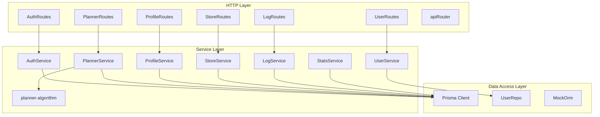
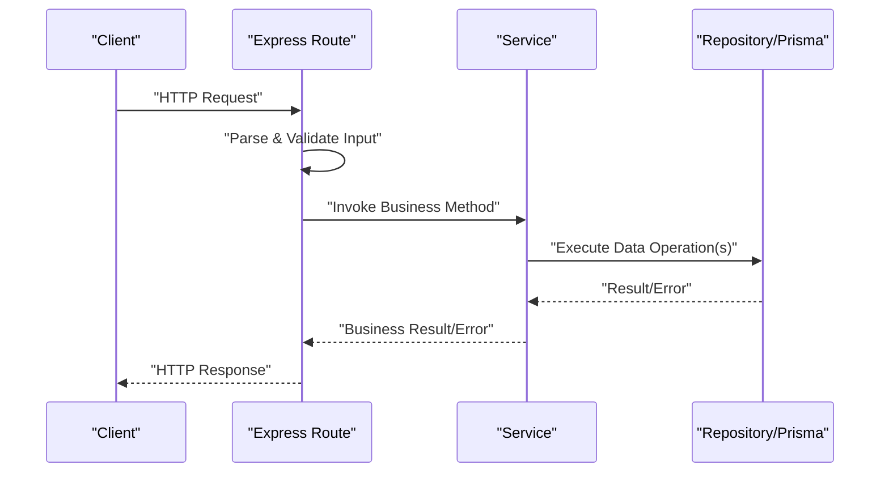
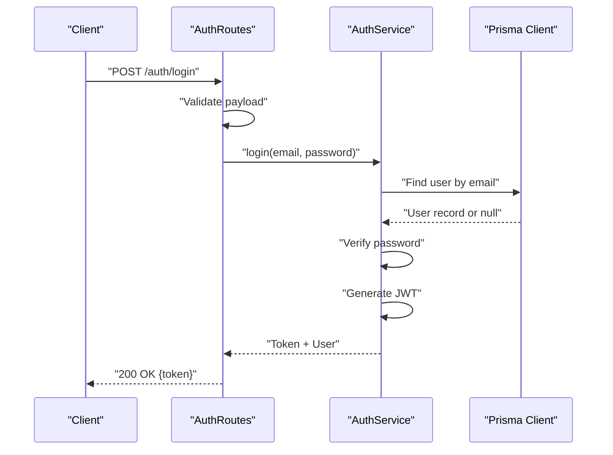
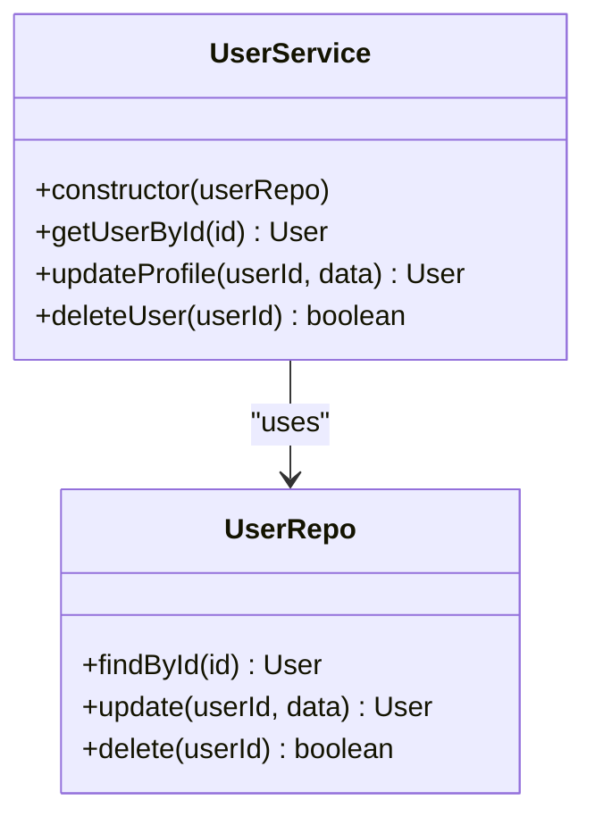
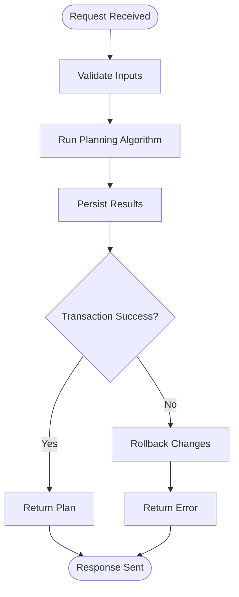
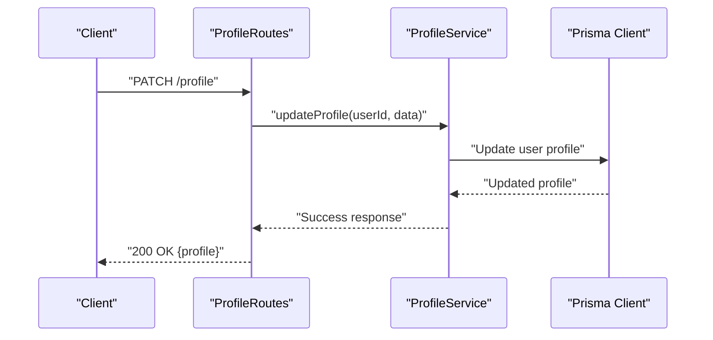
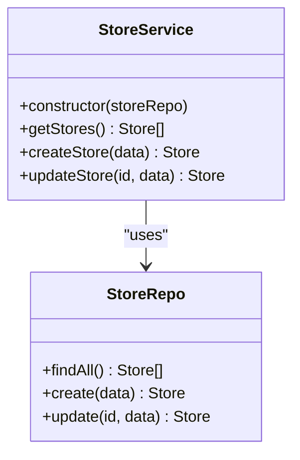
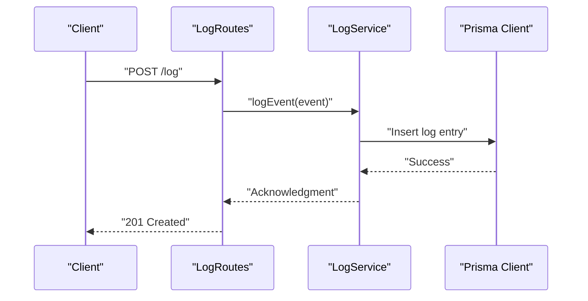
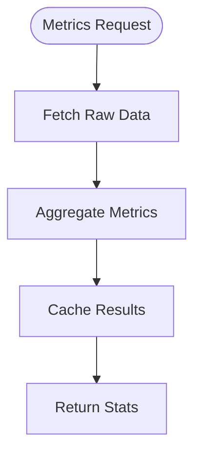
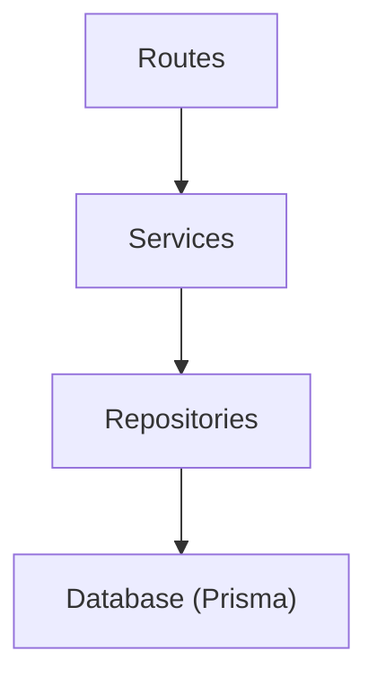

# Service Layer Architecture

<cite>
**Referenced Files in This Document**
- [AuthService.ts](file://Backend/src/services/AuthService.ts)
- [UserService.ts](file://Backend/src/services/UserService.ts)
- [PlannerService.ts](file://Backend/src/services/PlannerService.ts)
- [ProfileService.ts](file://Backend/src/services/ProfileService.ts)
- [StoreService.ts](file://Backend/src/services/StoreService.ts)
- [LogService.ts](file://Backend/src/services/LogService.ts)
- [StatsService.ts](file://Backend/src/services/StatsService.ts)
- [planner-algorithm.ts](file://Backend/src/services/planner-algorithm.ts)
- [AuthRoutes.ts](file://Backend/src/routes/AuthRoutes.ts)
- [UserRoutes.ts](file://Backend/src/routes/UserRoutes.ts)
- [PlannerRoutes.ts](file://Backend/src/routes/PlannerRoutes.ts)
- [ProfileRoutes.ts](file://Backend/src/routes/ProfileRoutes.ts)
- [StoreRoutes.ts](file://Backend/src/routes/StoreRoutes.ts)
- [LogRoutes.ts](file://Backend/src/routes/LogRoutes.ts)
- [apiRouter.ts](file://Backend/src/routes/apiRouter.ts)
- [prisma.ts](file://Backend/src/repos/prisma.ts)
- [MockOrm.ts](file://Backend/src/repos/MockOrm.ts)
- [UserRepo.ts](file://Backend/src/repos/UserRepo.ts)
- [route-errors.ts](file://Backend/src/common/utils/route-errors.ts)
- [env.ts](file://Backend/src/common/constants/env.ts)
- [main.ts](file://Backend/src/main.ts)
- [server.ts](file://Backend/src/server.ts)
</cite>

## Table of Contents
1. [Introduction](#introduction)
2. [Project Structure](#project-structure)
3. [Core Components](#core-components)
4. [Architecture Overview](#architecture-overview)
5. [Detailed Component Analysis](#detailed-component-analysis)
6. [Dependency Analysis](#dependency-analysis)
7. [Performance Considerations](#performance-considerations)
8. [Troubleshooting Guide](#troubleshooting-guide)
9. [Conclusion](#conclusion)

## Introduction
This document explains the service layer architecture pattern implemented in the backend. It focuses on how business logic is separated from routes and data access layers, detailing constructor patterns for services, dependency injection approaches, error handling strategies, transaction handling, and inter-service communication patterns. The goal is to provide a clear understanding of how the application organizes its core logic and how different layers interact.

## Project Structure
The backend follows a layered architecture:
- Routes handle HTTP requests and delegate to services.
- Services encapsulate business logic and coordinate with repositories or external systems.
- Repositories abstract data access (e.g., Prisma ORM).
- Common utilities provide shared functionality like validation and error formatting.

**Diagram sources**
- [AuthRoutes.ts](file://Backend/src/routes/AuthRoutes.ts)
- [UserRoutes.ts](file://Backend/src/routes/UserRoutes.ts)
- [PlannerRoutes.ts](file://Backend/src/routes/PlannerRoutes.ts)
- [ProfileRoutes.ts](file://Backend/src/routes/ProfileRoutes.ts)
- [StoreRoutes.ts](file://Backend/src/routes/StoreRoutes.ts)
- [LogRoutes.ts](file://Backend/src/routes/LogRoutes.ts)
- [apiRouter.ts](file://Backend/src/routes/apiRouter.ts)
- [AuthService.ts](file://Backend/src/services/AuthService.ts)
- [UserService.ts](file://Backend/src/services/UserService.ts)
- [PlannerService.ts](file://Backend/src/services/PlannerService.ts)
- [ProfileService.ts](file://Backend/src/services/ProfileService.ts)
- [StoreService.ts](file://Backend/src/services/StoreService.ts)
- [LogService.ts](file://Backend/src/services/LogService.ts)
- [StatsService.ts](file://Backend/src/services/StatsService.ts)
- [planner-algorithm.ts](file://Backend/src/services/planner-algorithm.ts)
- [prisma.ts](file://Backend/src/repos/prisma.ts)
- [UserRepo.ts](file://Backend/src/repos/UserRepo.ts)
- [MockOrm.ts](file://Backend/src/repos/MockOrm.ts)

**Section sources**
- [main.ts](file://Backend/src/main.ts)
- [server.ts](file://Backend/src/server.ts)
- [apiRouter.ts](file://Backend/src/routes/apiRouter.ts)

## Core Components
- Services encapsulate domain-specific business logic and are instantiated with dependencies such as repositories or configuration.
- Routes remain thin, focusing on request parsing, validation, and delegating to services.
- Repositories abstract database operations using Prisma or mock implementations for testing.
- Shared utilities standardize error responses and input validation across services.

Key responsibilities:
- AuthService: authentication flows, token management, and user session handling.
- UserService: user profile CRUD operations and related business rules.
- PlannerService: planning algorithms and scheduling logic.
- ProfileService: profile updates and preferences.
- StoreService: store-related operations and integrations.
- LogService: logging and audit trails.
- StatsService: analytics and metrics aggregation.

**Section sources**
- [AuthService.ts](file://Backend/src/services/AuthService.ts)
- [UserService.ts](file://Backend/src/services/UserService.ts)
- [PlannerService.ts](file://Backend/src/services/PlannerService.ts)
- [ProfileService.ts](file://Backend/src/services/ProfileService.ts)
- [StoreService.ts](file://Backend/src/services/StoreService.ts)
- [LogService.ts](file://Backend/src/services/LogService.ts)
- [StatsService.ts](file://Backend/src/services/StatsService.ts)

## Architecture Overview
The service layer acts as an intermediary between HTTP routes and data access layers. It centralizes business logic, enforces domain rules, and coordinates transactions when necessary. Dependency injection is used to supply repositories and configuration objects to services at construction time.

**Diagram sources**
- [AuthRoutes.ts](file://Backend/src/routes/AuthRoutes.ts)
- [AuthService.ts](file://Backend/src/services/AuthService.ts)
- [prisma.ts](file://Backend/src/repos/prisma.ts)

**Section sources**
- [apiRouter.ts](file://Backend/src/routes/apiRouter.ts)
- [env.ts](file://Backend/src/common/constants/env.ts)

## Detailed Component Analysis

### Authentication Flow (AuthService)
AuthService handles login, registration, and token issuance. It typically receives dependencies via constructor injection, such as a repository or configuration object. Error handling ensures consistent HTTP error responses.

**Diagram sources**
- [AuthRoutes.ts](file://Backend/src/routes/AuthRoutes.ts)
- [AuthService.ts](file://Backend/src/services/AuthService.ts)
- [prisma.ts](file://Backend/src/repos/prisma.ts)

**Section sources**
- [AuthService.ts](file://Backend/src/services/AuthService.ts)
- [AuthRoutes.ts](file://Backend/src/routes/AuthRoutes.ts)
- [route-errors.ts](file://Backend/src/common/utils/route-errors.ts)

### User Management (UserService)
UserService manages user profiles and related operations. It may use a dedicated repository (UserRepo) to abstract database interactions. Constructor injection provides the repository instance.

**Diagram sources**
- [UserService.ts](file://Backend/src/services/UserService.ts)
- [UserRepo.ts](file://Backend/src/repos/UserRepo.ts)

**Section sources**
- [UserService.ts](file://Backend/src/services/UserService.ts)
- [UserRepo.ts](file://Backend/src/repos/UserRepo.ts)

### Planning Logic (PlannerService and planner-algorithm)
PlannerService orchestrates planning tasks and delegates algorithmic computations to planner-algorithm. Transactions may be used to ensure consistency when updating multiple entities.

**Diagram sources**
- [PlannerService.ts](file://Backend/src/services/PlannerService.ts)
- [planner-algorithm.ts](file://Backend/src/services/planner-algorithm.ts)
- [prisma.ts](file://Backend/src/repos/prisma.ts)

**Section sources**
- [PlannerService.ts](file://Backend/src/services/PlannerService.ts)
- [planner-algorithm.ts](file://Backend/src/services/planner-algorithm.ts)

### Profile Updates (ProfileService)
ProfileService handles profile modifications, enforcing business rules and validating inputs before persisting changes.

**Diagram sources**
- [ProfileRoutes.ts](file://Backend/src/routes/ProfileRoutes.ts)
- [ProfileService.ts](file://Backend/src/services/ProfileService.ts)
- [prisma.ts](file://Backend/src/repos/prisma.ts)

**Section sources**
- [ProfileService.ts](file://Backend/src/services/ProfileService.ts)
- [ProfileRoutes.ts](file://Backend/src/routes/ProfileRoutes.ts)

### Store Operations (StoreService)
StoreService manages store-related business logic, potentially integrating with external APIs or databases through repositories.

**Diagram sources**
- [StoreService.ts](file://Backend/src/services/StoreService.ts)
- [prisma.ts](file://Backend/src/repos/prisma.ts)

**Section sources**
- [StoreService.ts](file://Backend/src/services/StoreService.ts)
- [StoreRoutes.ts](file://Backend/src/routes/StoreRoutes.ts)

### Logging and Auditing (LogService)
LogService records system events and audit trails, often writing to persistent storage or external logging services.

**Diagram sources**
- [LogRoutes.ts](file://Backend/src/routes/LogRoutes.ts)
- [LogService.ts](file://Backend/src/services/LogService.ts)
- [prisma.ts](file://Backend/src/repos/prisma.ts)

**Section sources**
- [LogService.ts](file://Backend/src/services/LogService.ts)
- [LogRoutes.ts](file://Backend/src/routes/LogRoutes.ts)

### Analytics Aggregation (StatsService)
StatsService computes metrics and aggregates data for reporting dashboards.

**Diagram sources**
- [StatsService.ts](file://Backend/src/services/StatsService.ts)
- [prisma.ts](file://Backend/src/repos/prisma.ts)

**Section sources**
- [StatsService.ts](file://Backend/src/services/StatsService.ts)

## Dependency Analysis
Services depend on repositories or external clients via constructor injection. This promotes loose coupling and testability. Routes depend on services, not directly on data access layers.

**Diagram sources**
- [apiRouter.ts](file://Backend/src/routes/apiRouter.ts)
- [AuthService.ts](file://Backend/src/services/AuthService.ts)
- [UserService.ts](file://Backend/src/services/UserService.ts)
- [prisma.ts](file://Backend/src/repos/prisma.ts)

**Section sources**
- [apiRouter.ts](file://Backend/src/routes/apiRouter.ts)
- [env.ts](file://Backend/src/common/constants/env.ts)

## Performance Considerations
- Use connection pooling for database operations.
- Implement caching for frequently accessed data.
- Avoid N+1 queries by batching data fetches.
- Offload heavy computations to background jobs where possible.

[No sources needed since this section provides general guidance]

## Troubleshooting Guide
Common issues include:
- Invalid input payloads: Ensure validation middleware is applied before calling services.
- Database errors: Check Prisma client configuration and connection strings.
- Transaction failures: Verify rollback logic and error propagation.

Error handling strategies:
- Centralized error formatting using route-errors utility.
- Consistent HTTP status codes for different error types.
- Logging critical errors for debugging.

**Section sources**
- [route-errors.ts](file://Backend/src/common/utils/route-errors.ts)
- [env.ts](file://Backend/src/common/constants/env.ts)

## Conclusion
The service layer architecture effectively separates concerns between HTTP routing, business logic, and data access. Constructor-based dependency injection enables modular and testable code. Robust error handling and transaction management ensure reliability. Following these patterns enhances maintainability and scalability.

[No sources needed since this section summarizes without analyzing specific files]