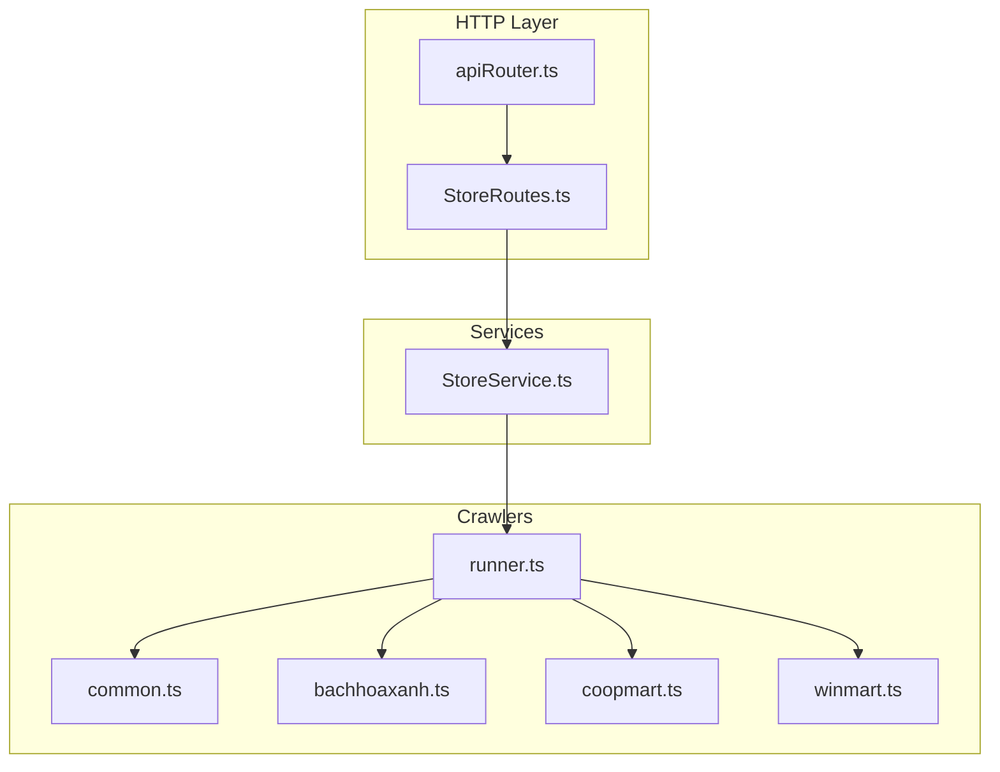
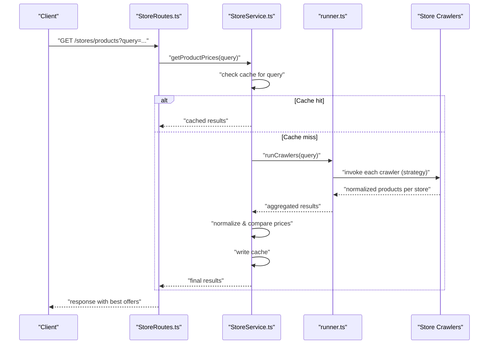
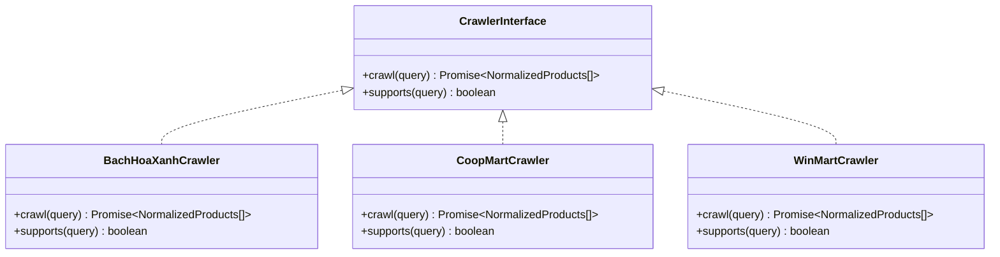
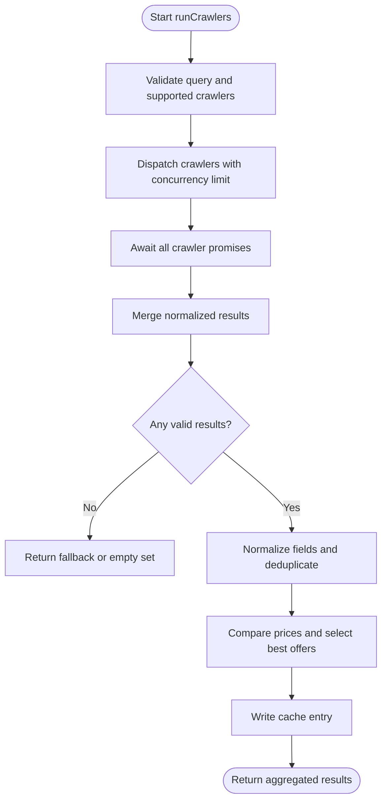
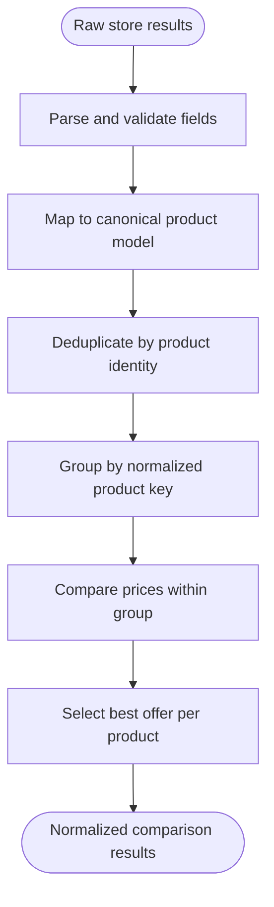
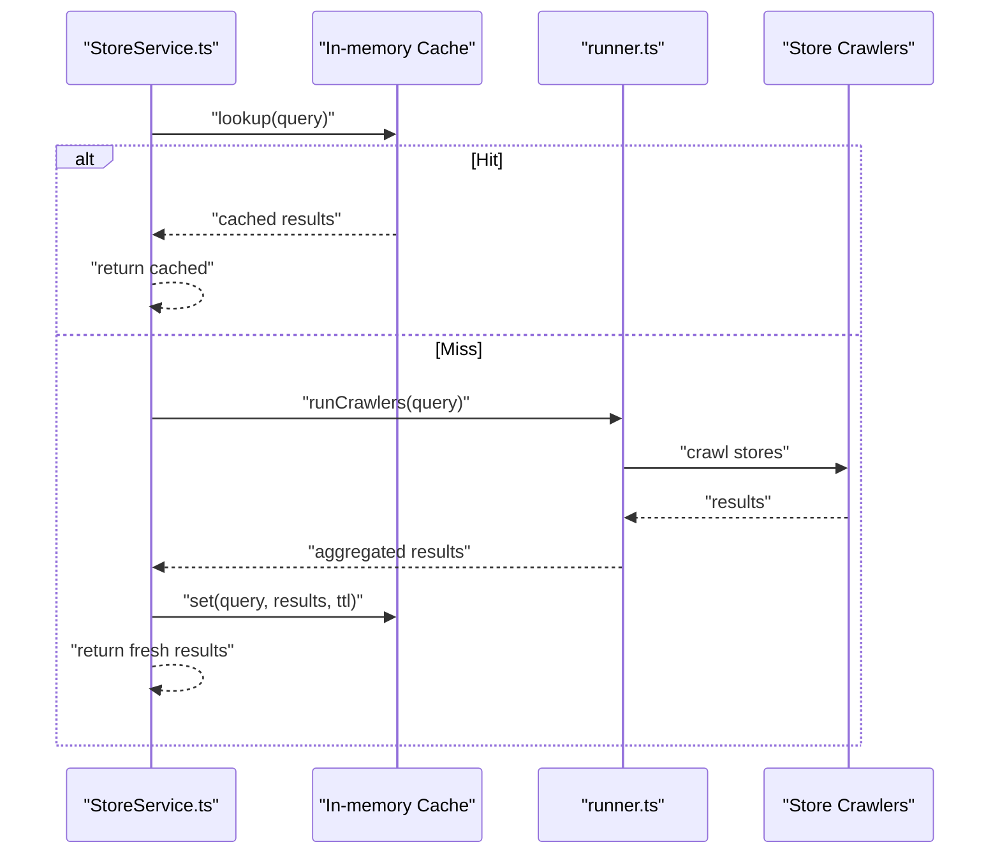
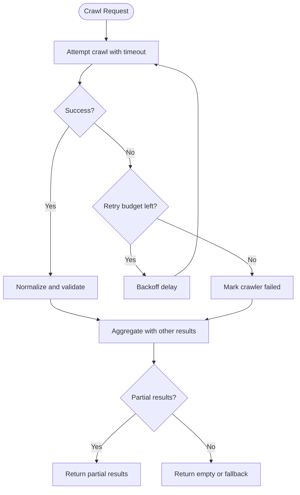
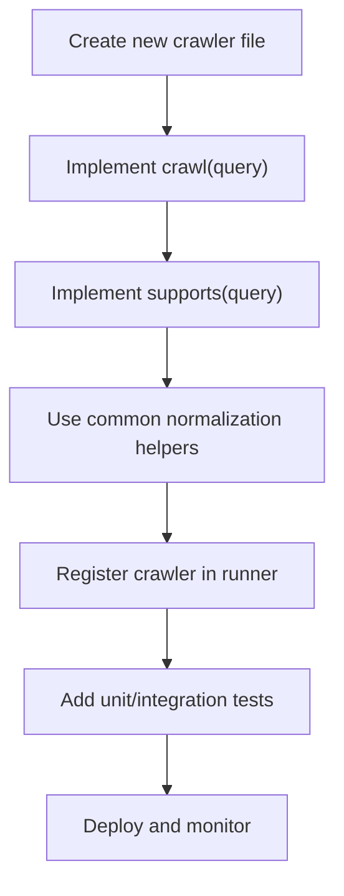
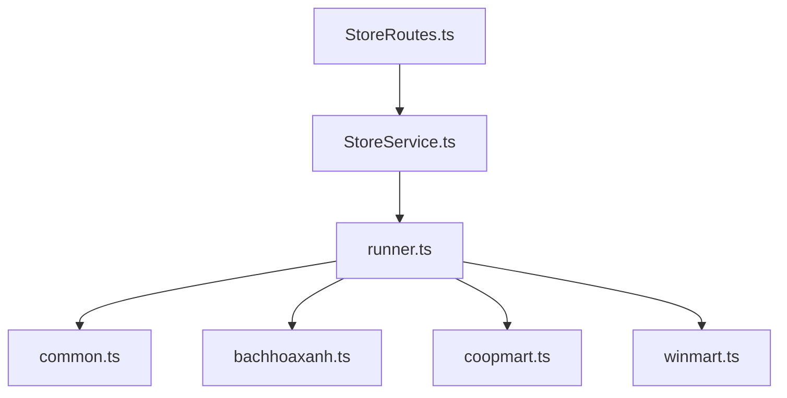

# Store Integration Service

<cite>
**Referenced Files in This Document**
- [StoreService.ts](file://Backend/src/services/StoreService.ts)
- [runner.ts](file://Backend/src/crawlers/runner.ts)
- [common.ts](file://Backend/src/crawlers/common.ts)
- [bachhoaxanh.ts](file://Backend/src/crawlers/bachhoaxanh.ts)
- [coopmart.ts](file://Backend/src/crawlers/coopmart.ts)
- [winmart.ts](file://Backend/src/crawlers/winmart.ts)
- [StoreRoutes.ts](file://Backend/src/routes/StoreRoutes.ts)
- [apiRouter.ts](file://Backend/src/routes/apiRouter.ts)
- [main.ts](file://Backend/src/main.ts)
- [server.ts](file://Backend/src/server.ts)
</cite>

## Table of Contents
1. [Introduction](#introduction)
2. [Project Structure](#project-structure)
3. [Core Components](#core-components)
4. [Architecture Overview](#architecture-overview)
5. [Detailed Component Analysis](#detailed-component-analysis)
6. [Dependency Analysis](#dependency-analysis)
7. [Performance Considerations](#performance-considerations)
8. [Troubleshooting Guide](#troubleshooting-guide)
9. [Conclusion](#conclusion)
10. [Appendices](#appendices)

## Introduction
This document explains the Store Integration Service that orchestrates crawling multiple grocery stores, normalizes product data, compares prices, and checks availability across different store formats. It covers the strategy pattern used for store crawlers, caching mechanisms for price data, error handling for failed scrapes, and guidance for adding new store integrations and monitoring crawler performance.

## Project Structure
The Store Integration Service is implemented primarily in the Backend module:
- Crawlers directory contains per-store implementations and a common base plus an orchestration runner.
- Services layer exposes business logic to routes and other services.
- Routes expose HTTP endpoints for clients to trigger crawls and retrieve normalized results.

**Diagram sources**
- [StoreRoutes.ts](file://Backend/src/routes/StoreRoutes.ts)
- [apiRouter.ts](file://Backend/src/routes/apiRouter.ts)
- [StoreService.ts](file://Backend/src/services/StoreService.ts)
- [runner.ts](file://Backend/src/crawlers/runner.ts)
- [common.ts](file://Backend/src/crawlers/common.ts)
- [bachhoaxanh.ts](file://Backend/src/crawlers/bachhoaxanh.ts)
- [coopmart.ts](file://Backend/src/crawlers/coopmart.ts)
- [winmart.ts](file://Backend/src/crawlers/winmart.ts)

**Section sources**
- [StoreRoutes.ts](file://Backend/src/routes/StoreRoutes.ts)
- [apiRouter.ts](file://Backend/src/routes/apiRouter.ts)
- [StoreService.ts](file://Backend/src/services/StoreService.ts)
- [runner.ts](file://Backend/src/crawlers/runner.ts)
- [common.ts](file://Backend/src/crawlers/common.ts)
- [bachhoaxanh.ts](file://Backend/src/crawlers/bachhoaxanh.ts)
- [coopmart.ts](file://Backend/src/crawlers/coopmart.ts)
- [winmart.ts](file://Backend/src/crawlers/winmart.ts)

## Core Components
- StoreService: Orchestrates store crawls, aggregates results, performs price comparison, and manages caching and error handling.
- Crawler Runner: Executes crawlers concurrently with concurrency limits, retries, and timeouts.
- Common Crawler Utilities: Shared parsing helpers, normalization utilities, and retry/backoff helpers.
- Per-Store Crawlers: Implement store-specific scraping and normalization into a unified product schema.

Key responsibilities:
- Crawler orchestration: scheduling, concurrency control, and result aggregation.
- Price comparison: aggregating normalized prices across stores and selecting best offers.
- Availability checking: mapping store availability signals to a consistent boolean or status.
- Data normalization: converting heterogeneous store responses into a canonical product model.
- Caching: storing recent price snapshots to reduce load and improve response times.
- Error handling: robust handling of network errors, parse failures, and partial results.

**Section sources**
- [StoreService.ts](file://Backend/src/services/StoreService.ts)
- [runner.ts](file://Backend/src/crawlers/runner.ts)
- [common.ts](file://Backend/src/crawlers/common.ts)
- [bachhoaxanh.ts](file://Backend/src/crawlers/bachhoaxanh.ts)
- [coopmart.ts](file://Backend/src/crawlers/coopmart.ts)
- [winmart.ts](file://Backend/src/crawlers/winmart.ts)

## Architecture Overview
The service follows a layered architecture with a clear separation between HTTP endpoints, service logic, and crawler implementations. The strategy pattern enables pluggable store crawlers behind a common interface.

**Diagram sources**
- [StoreRoutes.ts](file://Backend/src/routes/StoreRoutes.ts)
- [StoreService.ts](file://Backend/src/services/StoreService.ts)
- [runner.ts](file://Backend/src/crawlers/runner.ts)
- [common.ts](file://Backend/src/crawlers/common.ts)
- [bachhoaxanh.ts](file://Backend/src/crawlers/bachhoaxanh.ts)
- [coopmart.ts](file://Backend/src/crawlers/coopmart.ts)
- [winmart.ts](file://Backend/src/crawlers/winmart.ts)

## Detailed Component Analysis

### Strategy Pattern for Store Crawlers
Each store crawler implements a common interface so the runner can invoke them uniformly. This allows easy addition of new stores without changing orchestration logic.

**Diagram sources**
- [common.ts](file://Backend/src/crawlers/common.ts)
- [bachhoaxanh.ts](file://Backend/src/crawlers/bachhoaxanh.ts)
- [coopmart.ts](file://Backend/src/crawlers/coopmart.ts)
- [winmart.ts](file://Backend/src/crawlers/winmart.ts)

**Section sources**
- [common.ts](file://Backend/src/crawlers/common.ts)
- [bachhoaxanh.ts](file://Backend/src/crawlers/bachhoaxanh.ts)
- [coopmart.ts](file://Backend/src/crawlers/coopmart.ts)
- [winmart.ts](file://Backend/src/crawlers/winmart.ts)

### Crawler Orchestration and Concurrency Control
The runner coordinates concurrent execution of supported crawlers with configurable concurrency, timeouts, and retries. It aggregates partial results and handles failures gracefully.

**Diagram sources**
- [runner.ts](file://Backend/src/crawlers/runner.ts)
- [common.ts](file://Backend/src/crawlers/common.ts)

**Section sources**
- [runner.ts](file://Backend/src/crawlers/runner.ts)
- [common.ts](file://Backend/src/crawlers/common.ts)

### Price Comparison and Normalization Logic
Normalization converts store-specific product fields into a canonical schema. Price comparison aggregates normalized entries by product identity and selects the lowest price among available options.

**Diagram sources**
- [StoreService.ts](file://Backend/src/services/StoreService.ts)
- [common.ts](file://Backend/src/crawlers/common.ts)

**Section sources**
- [StoreService.ts](file://Backend/src/services/StoreService.ts)
- [common.ts](file://Backend/src/crawlers/common.ts)

### Caching Mechanism for Price Data
Caching reduces repeated crawling by storing recent price snapshots keyed by query parameters and time-based expiration. On cache hits, the service returns immediately; on misses, it triggers crawls and updates the cache.

**Diagram sources**
- [StoreService.ts](file://Backend/src/services/StoreService.ts)
- [runner.ts](file://Backend/src/crawlers/runner.ts)

**Section sources**
- [StoreService.ts](file://Backend/src/services/StoreService.ts)
- [runner.ts](file://Backend/src/crawlers/runner.ts)

### Error Handling for Failed Scrapes
Error handling ensures resilience against network issues, parsing failures, and inconsistent store pages. The runner and service implement retries, timeouts, and partial result aggregation.

**Diagram sources**
- [runner.ts](file://Backend/src/crawlers/runner.ts)
- [common.ts](file://Backend/src/crawlers/common.ts)

**Section sources**
- [runner.ts](file://Backend/src/crawlers/runner.ts)
- [common.ts](file://Backend/src/crawlers/common.ts)

### Adding New Store Integrations
To add a new store crawler:
- Implement the crawler interface with crawl and supports methods.
- Use common utilities for parsing, normalization, and retry/backoff.
- Register the crawler in the runner’s supported list.
- Add tests to verify normalization and error paths.

[No sources needed since this diagram shows conceptual workflow, not actual code structure]

**Section sources**
- [common.ts](file://Backend/src/crawlers/common.ts)
- [runner.ts](file://Backend/src/crawlers/runner.ts)

### Monitoring Crawler Performance
Monitoring should capture:
- Latency per crawler and overall request duration.
- Success/failure rates and retry counts.
- Cache hit ratio and TTL usage.
- Partial result ratios indicating degraded stores.

Recommended metrics:
- Histograms for crawl durations.
- Counters for successes, failures, retries, and cache hits/misses.
- Gauges for active crawls and queue sizes.

[No sources needed since this section provides general guidance]

## Dependency Analysis
The service exhibits low coupling through the strategy interface and clear boundaries between layers. Dependencies flow from routes to services to runners to crawlers.

**Diagram sources**
- [StoreRoutes.ts](file://Backend/src/routes/StoreRoutes.ts)
- [StoreService.ts](file://Backend/src/services/StoreService.ts)
- [runner.ts](file://Backend/src/crawlers/runner.ts)
- [common.ts](file://Backend/src/crawlers/common.ts)
- [bachhoaxanh.ts](file://Backend/src/crawlers/bachhoaxanh.ts)
- [coopmart.ts](file://Backend/src/crawlers/coopmart.ts)
- [winmart.ts](file://Backend/src/crawlers/winmart.ts)

**Section sources**
- [StoreRoutes.ts](file://Backend/src/routes/StoreRoutes.ts)
- [StoreService.ts](file://Backend/src/services/StoreService.ts)
- [runner.ts](file://Backend/src/crawlers/runner.ts)
- [common.ts](file://Backend/src/crawlers/common.ts)
- [bachhoaxanh.ts](file://Backend/src/crawlers/bachhoaxanh.ts)
- [coopmart.ts](file://Backend/src/crawlers/coopmart.ts)
- [winmart.ts](file://Backend/src/crawlers/winmart.ts)

## Performance Considerations
- Concurrency tuning: Adjust parallel crawler executions based on server capacity and store rate limits.
- Timeouts and retries: Configure per-crawler timeouts and retry budgets to balance responsiveness and reliability.
- Cache sizing: Set appropriate TTLs and memory limits to avoid stale data and excessive memory usage.
- Deduplication: Ensure robust product identity resolution to minimize redundant comparisons.
- Streaming/pagination: For large catalogs, consider streaming results and paginated queries where applicable.

[No sources needed since this section provides general guidance]

## Troubleshooting Guide
Common issues and resolutions:
- Network errors: Increase retry budget or adjust backoff strategy; check DNS and proxy settings.
- Parsing failures: Inspect store page changes and update selectors; add defensive parsing and fallbacks.
- Partial results: Investigate failing crawlers individually; log detailed error messages and stack traces.
- Cache misses: Verify TTL configuration and cache key generation; ensure consistent query normalization.
- Slow responses: Profile crawler latency; optimize concurrency and consider pre-warming caches.

**Section sources**
- [runner.ts](file://Backend/src/crawlers/runner.ts)
- [common.ts](file://Backend/src/crawlers/common.ts)
- [StoreService.ts](file://Backend/src/services/StoreService.ts)

## Conclusion
The Store Integration Service provides a robust, extensible framework for crawling multiple grocery stores, normalizing product data, comparing prices, and checking availability. Its strategy-based design simplifies adding new stores, while caching and resilient orchestration ensure performance and reliability. Monitoring and troubleshooting guidelines help maintain high-quality operations over time.

[No sources needed since this section summarizes without analyzing specific files]

## Appendices

### API Endpoints Overview
- GET /stores/products: Query normalized product prices across stores.
- POST /stores/crawl: Trigger manual crawl for a given query.

[No sources needed since this section provides general guidance]

### Example Flow: Adding a New Store
1. Create a new crawler implementing the shared interface.
2. Use common utilities for parsing and normalization.
3. Register the crawler in the runner.
4. Write tests covering success, failure, and edge cases.
5. Deploy and monitor metrics.

[No sources needed since this section provides general guidance]