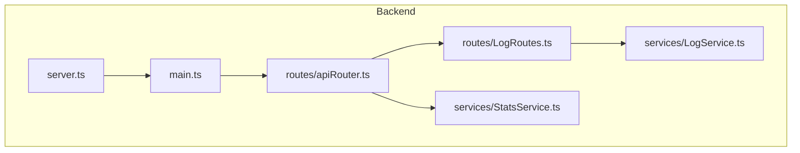
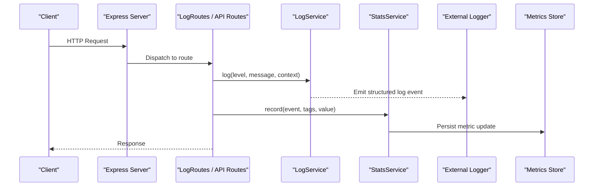
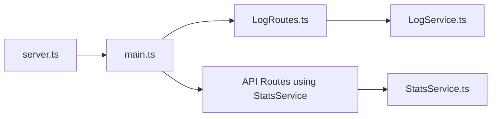

# Supporting Services

<cite>
**Referenced Files in This Document**
- [LogService.ts](file://Backend/src/services/LogService.ts)
- [StatsService.ts](file://Backend/src/services/StatsService.ts)
- [LogRoutes.ts](file://Backend/src/routes/LogRoutes.ts)
- [server.ts](file://Backend/src/server.ts)
- [main.ts](file://Backend/src/main.ts)
</cite>

## Table of Contents
1. [Introduction](#introduction)
2. [Project Structure](#project-structure)
3. [Core Components](#core-components)
4. [Architecture Overview](#architecture-overview)
5. [Detailed Component Analysis](#detailed-component-analysis)
6. [Dependency Analysis](#dependency-analysis)
7. [Performance Considerations](#performance-considerations)
8. [Troubleshooting Guide](#troubleshooting-guide)
9. [Conclusion](#conclusion)

## Introduction
This document explains the supporting services that provide application logging and analytics/reporting capabilities: LogService and StatsService. It covers the logging strategy, log levels, structured logging format, integration points with external systems, statistics collection methods, report generation, data aggregation patterns, and performance metrics tracking. It also includes examples of how to implement custom log handlers and statistical analysis logic within the service layer.

## Project Structure
The relevant code for these services resides under Backend/src/services, with routing exposed via Backend/src/routes. The server entry points initialize middleware and routes that integrate with these services.

**Diagram sources**
- [server.ts](file://Backend/src/server.ts)
- [main.ts](file://Backend/src/main.ts)
- [LogRoutes.ts](file://Backend/src/routes/LogRoutes.ts)
- [LogService.ts](file://Backend/src/services/LogService.ts)
- [StatsService.ts](file://Backend/src/services/StatsService.ts)

**Section sources**
- [server.ts](file://Backend/src/server.ts)
- [main.ts](file://Backend/src/main.ts)
- [LogRoutes.ts](file://Backend/src/routes/LogRoutes.ts)
- [LogService.ts](file://Backend/src/services/LogService.ts)
- [StatsService.ts](file://Backend/src/services/StatsService.ts)

## Core Components
- LogService: Centralized logging abstraction providing structured logs, configurable levels, and pluggable sinks (console, file, or external systems).
- StatsService: Analytics and reporting engine that collects events, aggregates metrics, and exposes endpoints for dashboards and exports.

Key responsibilities:
- LogService
  - Define and enforce log levels (e.g., debug, info, warn, error).
  - Build structured log records with consistent fields (timestamp, level, message, context, correlationId).
  - Route logs to multiple destinations via a handler pipeline.
  - Provide sampling, batching, and redaction utilities.
- StatsService
  - Collect counters, gauges, histograms, and traces.
  - Aggregate time-windowed metrics and compute summaries.
  - Generate reports (JSON, CSV) and expose them through API routes.
  - Integrate with external analytics backends when configured.

**Section sources**
- [LogService.ts](file://Backend/src/services/LogService.ts)
- [StatsService.ts](file://Backend/src/services/StatsService.ts)

## Architecture Overview
The services are integrated into the Express-based backend via routes and middleware. LogService is used across controllers and services to emit structured logs. StatsService is invoked by business logic to record events and by route handlers to serve reports.

**Diagram sources**
- [LogRoutes.ts](file://Backend/src/routes/LogRoutes.ts)
- [LogService.ts](file://Backend/src/services/LogService.ts)
- [StatsService.ts](file://Backend/src/services/StatsService.ts)

## Detailed Component Analysis

### LogService
Responsibilities:
- Structured logging with consistent schema.
- Configurable log levels and filtering.
- Pluggable sinks (console, file, HTTP exporters).
- Sampling and batching for high-throughput scenarios.
- Redaction of sensitive fields.

Typical usage pattern:
- Initialize LogService with configuration (levels, sinks, sampling rate).
- Use logger instances per module with contextual metadata.
- Register custom handlers to forward logs to third-party systems.

Example: Custom log handler
- Implement a handler that transforms log records and forwards them to an external logging platform via HTTP.
- Register the handler in the LogService pipeline so all logs flow through it.

Example: Custom log formatter
- Create a formatter that enriches logs with request IDs, user IDs, and environment details.
- Attach the formatter to the LogService instance to standardize output.

Integration points:
- Middleware can inject correlation IDs and request context into logs.
- Error boundaries can capture stack traces and route errors to LogService.

Operational considerations:
- Avoid synchronous I/O in hot paths; prefer async sinks.
- Use sampling for debug-level logs in production.
- Ensure redaction rules cover PII and secrets.

**Section sources**
- [LogService.ts](file://Backend/src/services/LogService.ts)

### StatsService
Responsibilities:
- Event ingestion for counters, gauges, histograms, and traces.
- Time-windowed aggregation and summary computation.
- Report generation (in-memory snapshots, persisted exports).
- Optional export to external analytics systems.

Data model overview:
- Metrics: name, type, tags, timestamp, value.
- Aggregates: window start/end, count, sum, min, max, percentiles.
- Reports: aggregated datasets with filters and formatting options.

Report generation workflow:
- Accept query parameters (time range, dimensions, filters).
- Compute aggregations over stored metrics.
- Serialize results to JSON or CSV and return via API.

Example: Statistical analysis implementation
- Implement a function that computes rolling averages and detects anomalies based on thresholds.
- Expose this function through a StatsService method and call it from a route handler.

Performance characteristics:
- Prefer lock-free structures or batched updates for high cardinality metrics.
- Use sliding windows to bound memory usage.
- Debounce heavy computations and cache frequent queries.

**Section sources**
- [StatsService.ts](file://Backend/src/services/StatsService.ts)

### LogRoutes
Purpose:
- Exposes endpoints for health checks, log retrieval, and log configuration.
- Integrates with LogService to stream or fetch structured logs.

Typical endpoints:
- GET /logs: Retrieve recent logs with filters (level, time range).
- POST /logs/config: Update runtime logging configuration (levels, sinks).
- GET /health: Health check including logging subsystem status.

Integration:
- Uses LogService to read buffered logs or subscribe to live streams.
- Applies authentication and rate limiting where applicable.

**Section sources**
- [LogRoutes.ts](file://Backend/src/routes/LogRoutes.ts)

### Server Integration
Initialization:
- server.ts sets up Express app, middleware, and mounts routers.
- main.ts bootstraps services, including LogService and StatsService initialization.

Middleware hooks:
- Request logging middleware uses LogService to emit structured access logs.
- Error handling middleware captures exceptions and emits error logs.

**Section sources**
- [server.ts](file://Backend/src/server.ts)
- [main.ts](file://Backend/src/main.ts)

## Dependency Analysis
Relationships between components:
- LogRoutes depends on LogService for log operations.
- Business routes depend on StatsService for recording metrics and generating reports.
- server.ts and main.ts orchestrate service initialization and wiring.

**Diagram sources**
- [server.ts](file://Backend/src/server.ts)
- [main.ts](file://Backend/src/main.ts)
- [LogRoutes.ts](file://Backend/src/routes/LogRoutes.ts)
- [LogService.ts](file://Backend/src/services/LogService.ts)
- [StatsService.ts](file://Backend/src/services/StatsService.ts)

**Section sources**
- [server.ts](file://Backend/src/server.ts)
- [main.ts](file://Backend/src/main.ts)
- [LogRoutes.ts](file://Backend/src/routes/LogRoutes.ts)
- [LogService.ts](file://Backend/src/services/LogService.ts)
- [StatsService.ts](file://Backend/src/services/StatsService.ts)

## Performance Considerations
- Logging
  - Use async sinks and avoid blocking I/O in hot paths.
  - Apply sampling for verbose logs in production.
  - Batch log writes to reduce overhead.
- Statistics
  - Use efficient data structures for counters and histograms.
  - Limit cardinality of tags to prevent memory growth.
  - Cache frequent aggregations and invalidate on changes.
- Exporters
  - Back off on failures and use exponential backoff for retries.
  - Stream large reports instead of loading entirely into memory.

[No sources needed since this section provides general guidance]

## Troubleshooting Guide
Common issues and resolutions:
- Missing logs
  - Verify log level configuration and ensure the desired level is enabled.
  - Check sink connectivity and permissions for file outputs.
- High CPU usage
  - Reduce log verbosity or enable sampling.
  - Inspect expensive aggregations and optimize windows.
- Memory growth
  - Review metric cardinality and tag values.
  - Enable retention policies and periodic cleanup.
- External integrations failing
  - Validate credentials and endpoints.
  - Monitor exporter queues and retry policies.

**Section sources**
- [LogService.ts](file://Backend/src/services/LogService.ts)
- [StatsService.ts](file://Backend/src/services/StatsService.ts)

## Conclusion
LogService and StatsService form the backbone of observability and analytics in the application. By enforcing structured logging, configurable levels, and pluggable sinks, LogService ensures consistent diagnostics. StatsService enables robust metrics collection, aggregation, and reporting, supporting both operational insights and business analytics. Proper configuration, performance tuning, and integration practices will maximize reliability and scalability.

[No sources needed since this section summarizes without analyzing specific files]