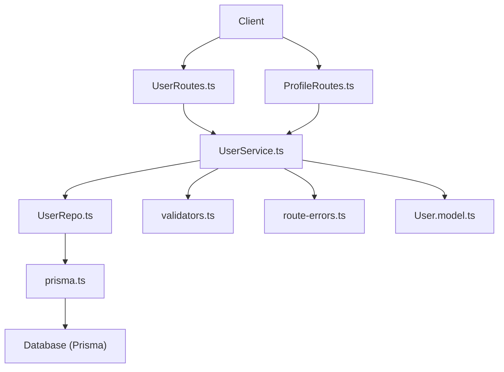
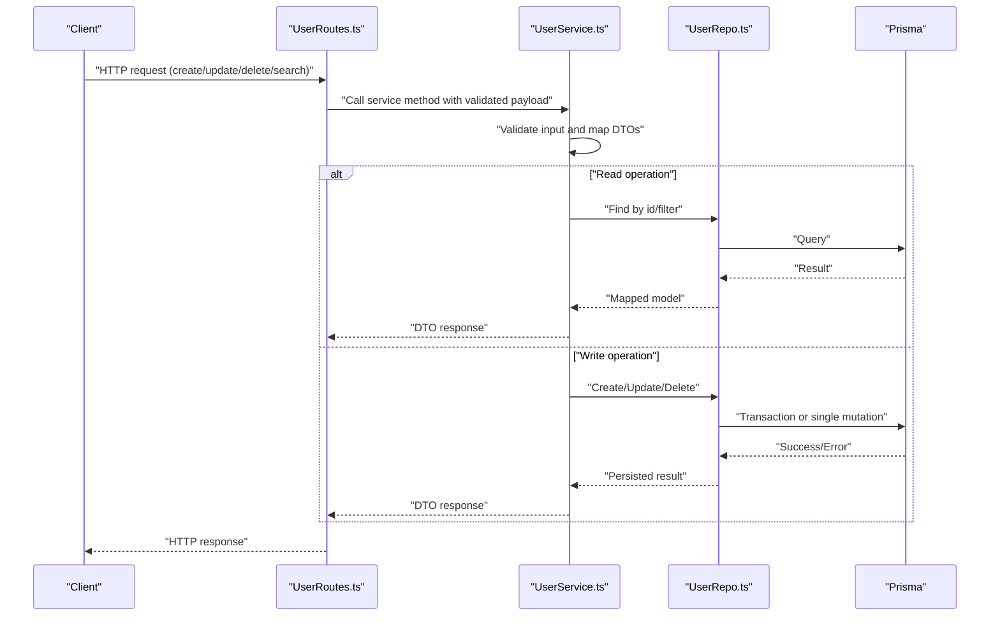
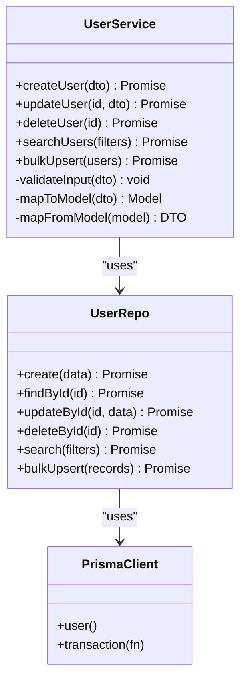
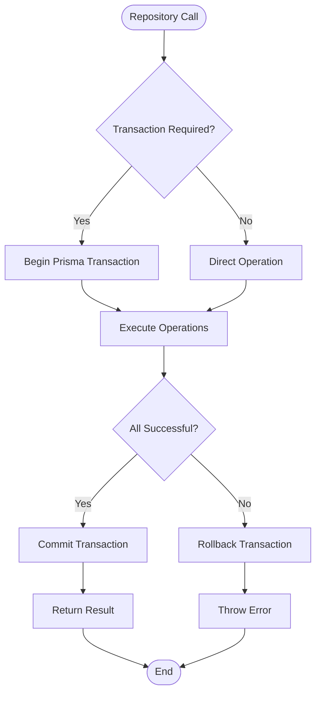
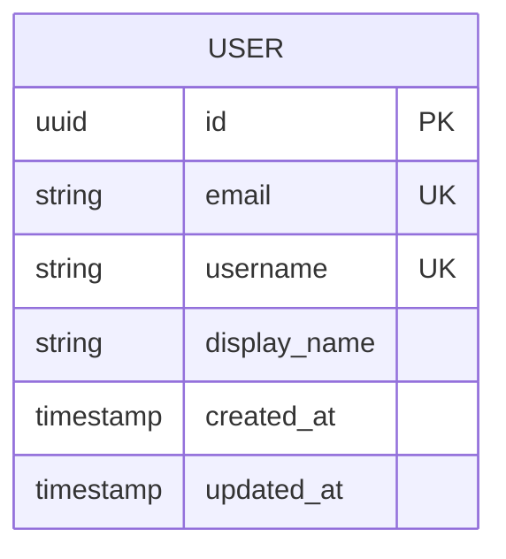
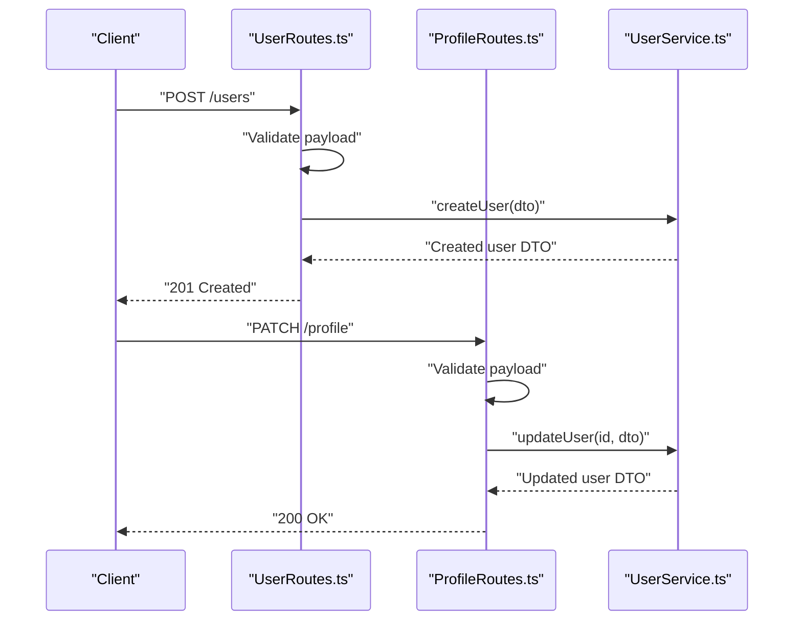
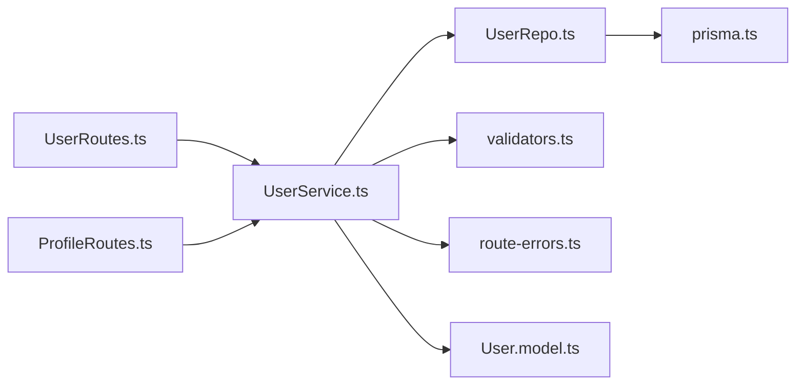

# User Management Service

<cite>
**Referenced Files in This Document**
- [UserService.ts](file://Backend/src/services/UserService.ts)
- [UserRepo.ts](file://Backend/src/repos/UserRepo.ts)
- [prisma.ts](file://Backend/src/repos/prisma.ts)
- [User.model.ts](file://Backend/src/models/User.model.ts)
- [UserRoutes.ts](file://Backend/src/routes/UserRoutes.ts)
- [ProfileRoutes.ts](file://Backend/src/routes/ProfileRoutes.ts)
- [validators.ts](file://Backend/src/common/utils/validators.ts)
- [route-errors.ts](file://Backend/src/common/utils/route-errors.ts)
- [schema.prisma](file://Backend/prisma/schema.prisma)
</cite>

## Table of Contents
1. [Introduction](#introduction)
2. [Project Structure](#project-structure)
3. [Core Components](#core-components)
4. [Architecture Overview](#architecture-overview)
5. [Detailed Component Analysis](#detailed-component-analysis)
6. [Dependency Analysis](#dependency-analysis)
7. [Performance Considerations](#performance-considerations)
8. [Troubleshooting Guide](#troubleshooting-guide)
9. [Conclusion](#conclusion)

## Introduction
This document describes the User Management Service responsible for creating, reading, updating, and deleting user data. It explains how the service integrates with the User repository, handles transactions for complex operations, validates input data, and transforms between DTOs and database models. It also covers search functionality, bulk operations, and error handling strategies used across the user management flow.

## Project Structure
The user management feature spans several layers:
- Routes expose HTTP endpoints for user profile and user CRUD operations.
- The UserService encapsulates business logic, validation, and orchestration.
- The UserRepo abstracts persistence using Prisma.
- Models define shared types and DTOs used by routes and services.
- Validation utilities ensure request payloads are correct before processing.
- Error utilities standardize error responses.

**Diagram sources**
- [UserRoutes.ts](file://Backend/src/routes/UserRoutes.ts)
- [ProfileRoutes.ts](file://Backend/src/routes/ProfileRoutes.ts)
- [UserService.ts](file://Backend/src/services/UserService.ts)
- [UserRepo.ts](file://Backend/src/repos/UserRepo.ts)
- [prisma.ts](file://Backend/src/repos/prisma.ts)
- [validators.ts](file://Backend/src/common/utils/validators.ts)
- [route-errors.ts](file://Backend/src/common/utils/route-errors.ts)
- [User.model.ts](file://Backend/src/models/User.model.ts)

**Section sources**
- [UserService.ts](file://Backend/src/services/UserService.ts)
- [UserRepo.ts](file://Backend/src/repos/UserRepo.ts)
- [UserRoutes.ts](file://Backend/src/routes/UserRoutes.ts)
- [ProfileRoutes.ts](file://Backend/src/routes/ProfileRoutes.ts)
- [validators.ts](file://Backend/src/common/utils/validators.ts)
- [route-errors.ts](file://Backend/src/common/utils/route-errors.ts)
- [User.model.ts](file://Backend/src/models/User.model.ts)

## Core Components
- UserService: Implements user CRUD, search, updates, deletion, and orchestrates transactions when needed. It applies validation rules and maps DTOs to domain models.
- UserRepo: Encapsulates all persistence interactions via Prisma, including find, create, update, delete, and bulk operations.
- Validators: Provide reusable validation helpers for user inputs.
- Route Errors: Standardize error responses and status codes.
- Models: Define shared types and DTOs used across routes and services.

Key responsibilities:
- Input validation and sanitization before persistence.
- Mapping between DTOs and database models.
- Transactional operations for multi-step writes.
- Consistent error handling and response shaping.

**Section sources**
- [UserService.ts](file://Backend/src/services/UserService.ts)
- [UserRepo.ts](file://Backend/src/repos/UserRepo.ts)
- [validators.ts](file://Backend/src/common/utils/validators.ts)
- [route-errors.ts](file://Backend/src/common/utils/route-errors.ts)
- [User.model.ts](file://Backend/src/models/User.model.ts)

## Architecture Overview
The user management architecture follows a layered approach:
- Routes receive HTTP requests and delegate to the service layer.
- The service enforces business rules, validates inputs, and coordinates with the repository.
- The repository performs database operations through Prisma.
- Errors are normalized and returned as consistent responses.

**Diagram sources**
- [UserRoutes.ts](file://Backend/src/routes/UserRoutes.ts)
- [UserService.ts](file://Backend/src/services/UserService.ts)
- [UserRepo.ts](file://Backend/src/repos/UserRepo.ts)
- [prisma.ts](file://Backend/src/repos/prisma.ts)

## Detailed Component Analysis

### UserService Analysis
Responsibilities:
- Create user profiles with validated DTOs.
- Update existing users with partial updates and validation.
- Delete users and handle cascading effects if applicable.
- Search users by filters (e.g., name, email).
- Perform bulk operations where supported by the repository.
- Manage transactions for multi-step writes.

Validation patterns:
- Centralized validation using helper utilities.
- Early return on invalid inputs with standardized errors.

Data transformation:
- Converts incoming DTOs to internal models before persistence.
- Maps database results back to DTOs for API responses.

Error handling:
- Wraps repository errors into consistent route errors.
- Distinguishes between client errors (validation) and server errors (database).

**Diagram sources**
- [UserService.ts](file://Backend/src/services/UserService.ts)
- [UserRepo.ts](file://Backend/src/repos/UserRepo.ts)
- [prisma.ts](file://Backend/src/repos/prisma.ts)

**Section sources**
- [UserService.ts](file://Backend/src/services/UserService.ts)
- [UserRepo.ts](file://Backend/src/repos/UserRepo.ts)
- [validators.ts](file://Backend/src/common/utils/validators.ts)
- [route-errors.ts](file://Backend/src/common/utils/route-errors.ts)

### User Repository Analysis
Responsibilities:
- Encapsulate all Prisma queries for user entities.
- Provide methods for single and bulk operations.
- Handle transaction boundaries when multiple writes must succeed together.

Transaction handling:
- Uses Prisma transactions to ensure atomicity for complex operations.
- Rolls back on any failure within the transaction block.

Search functionality:
- Supports filtering by fields such as name, email, and other attributes.
- Returns mapped results suitable for service consumption.

Bulk operations:
- Upserts multiple records efficiently.
- Minimizes round-trips to the database.

**Diagram sources**
- [UserRepo.ts](file://Backend/src/repos/UserRepo.ts)
- [prisma.ts](file://Backend/src/repos/prisma.ts)

**Section sources**
- [UserRepo.ts](file://Backend/src/repos/UserRepo.ts)
- [prisma.ts](file://Backend/src/repos/prisma.ts)

### Data Models and DTOs
Models define shared types and DTOs used by routes and services. They ensure consistency across the application and facilitate mapping between API payloads and database models.

**Diagram sources**
- [schema.prisma](file://Backend/prisma/schema.prisma)
- [User.model.ts](file://Backend/src/models/User.model.ts)

**Section sources**
- [User.model.ts](file://Backend/src/models/User.model.ts)
- [schema.prisma](file://Backend/prisma/schema.prisma)

### Routes Integration
Routes expose endpoints for user management:
- UserRoutes: Handles user CRUD endpoints.
- ProfileRoutes: Manages profile-specific operations.

Request flow:
- Validate request body using validators.
- Delegate to UserService for business logic.
- Map service responses to HTTP responses.

**Diagram sources**
- [UserRoutes.ts](file://Backend/src/routes/UserRoutes.ts)
- [ProfileRoutes.ts](file://Backend/src/routes/ProfileRoutes.ts)
- [UserService.ts](file://Backend/src/services/UserService.ts)
- [validators.ts](file://Backend/src/common/utils/validators.ts)

**Section sources**
- [UserRoutes.ts](file://Backend/src/routes/UserRoutes.ts)
- [ProfileRoutes.ts](file://Backend/src/routes/ProfileRoutes.ts)
- [validators.ts](file://Backend/src/common/utils/validators.ts)

## Dependency Analysis
The user management system has clear dependencies:
- Routes depend on the service layer for business logic.
- The service depends on the repository for persistence.
- The repository depends on Prisma for database access.
- Validation and error utilities are shared across layers.

**Diagram sources**
- [UserRoutes.ts](file://Backend/src/routes/UserRoutes.ts)
- [ProfileRoutes.ts](file://Backend/src/routes/ProfileRoutes.ts)
- [UserService.ts](file://Backend/src/services/UserService.ts)
- [UserRepo.ts](file://Backend/src/repos/UserRepo.ts)
- [prisma.ts](file://Backend/src/repos/prisma.ts)
- [validators.ts](file://Backend/src/common/utils/validators.ts)
- [route-errors.ts](file://Backend/src/common/utils/route-errors.ts)
- [User.model.ts](file://Backend/src/models/User.model.ts)

**Section sources**
- [UserService.ts](file://Backend/src/services/UserService.ts)
- [UserRepo.ts](file://Backend/src/repos/UserRepo.ts)
- [UserRoutes.ts](file://Backend/src/routes/UserRoutes.ts)
- [ProfileRoutes.ts](file://Backend/src/routes/ProfileRoutes.ts)

## Performance Considerations
- Use batch operations for bulk upserts to reduce database round-trips.
- Apply selective field projections in read operations to minimize payload size.
- Leverage Prisma transactions to avoid unnecessary retries and ensure consistency.
- Cache frequently accessed user data at the service layer when appropriate.
- Index commonly queried fields in the database schema to improve search performance.

[No sources needed since this section provides general guidance]

## Troubleshooting Guide
Common issues and resolutions:
- Validation failures: Ensure request payloads conform to expected schemas; check validator functions.
- Database errors: Inspect Prisma transaction logs and rollback scenarios.
- Mapping errors: Verify DTO-to-model transformations and field names.
- Error responses: Use standardized error utilities to diagnose and communicate failures.

**Section sources**
- [validators.ts](file://Backend/src/common/utils/validators.ts)
- [route-errors.ts](file://Backend/src/common/utils/route-errors.ts)
- [UserService.ts](file://Backend/src/services/UserService.ts)
- [UserRepo.ts](file://Backend/src/repos/UserRepo.ts)

## Conclusion
The User Management Service provides a robust, layered implementation for user CRUD operations. It emphasizes validation, data transformation, transactional integrity, and consistent error handling. By separating concerns across routes, services, and repositories, the system remains maintainable and scalable. Following the patterns outlined here ensures reliable user data management and a smooth developer experience.