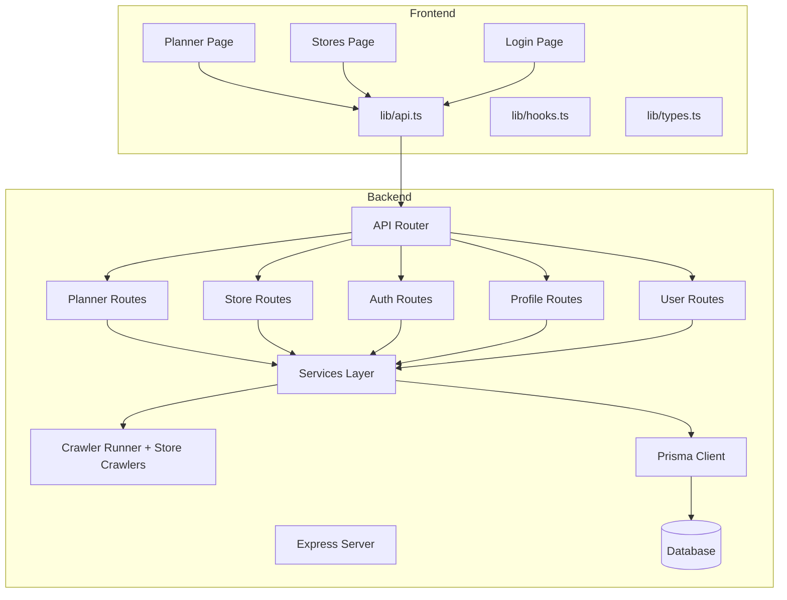
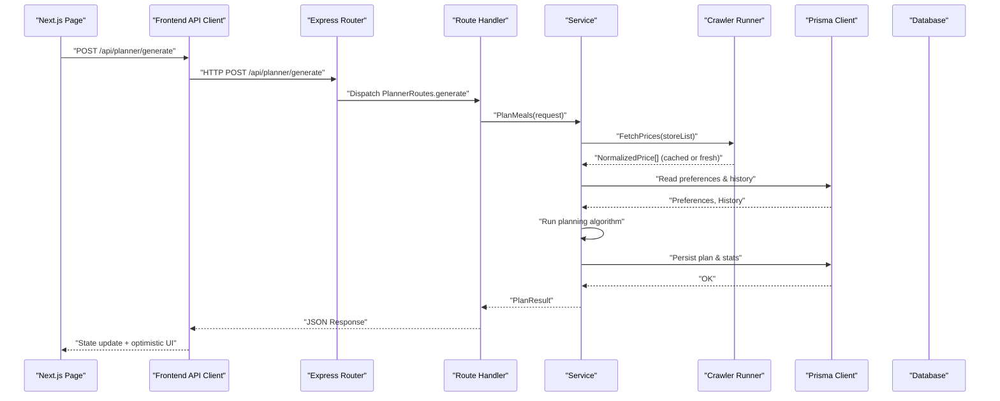
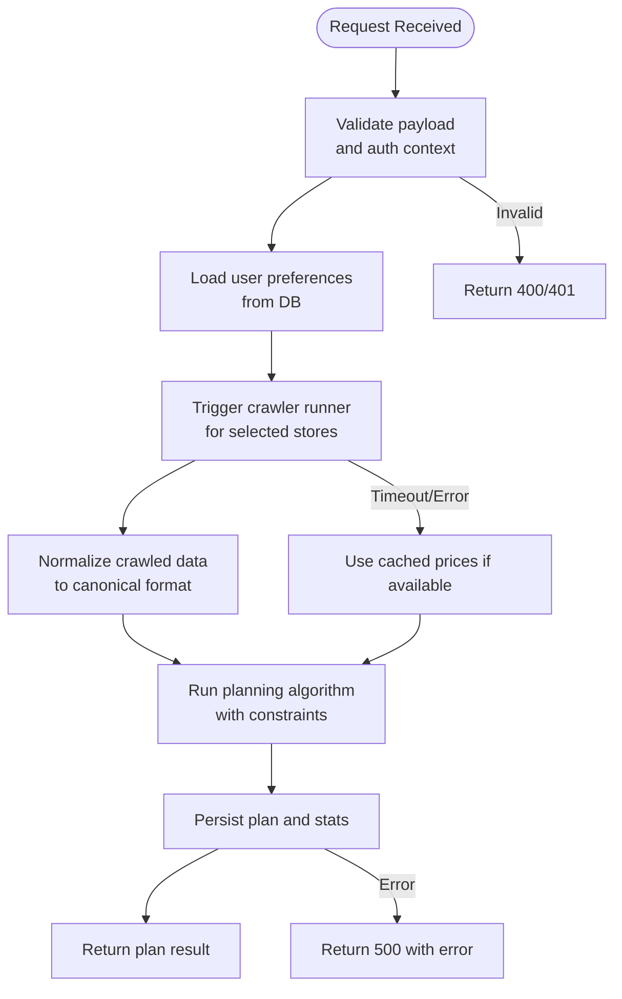
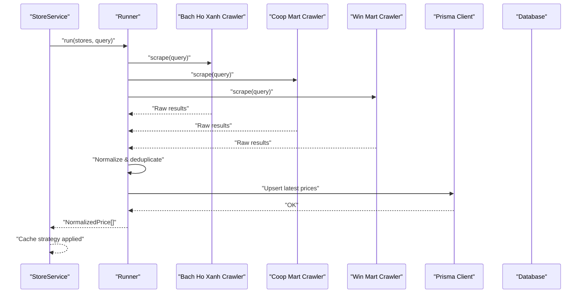
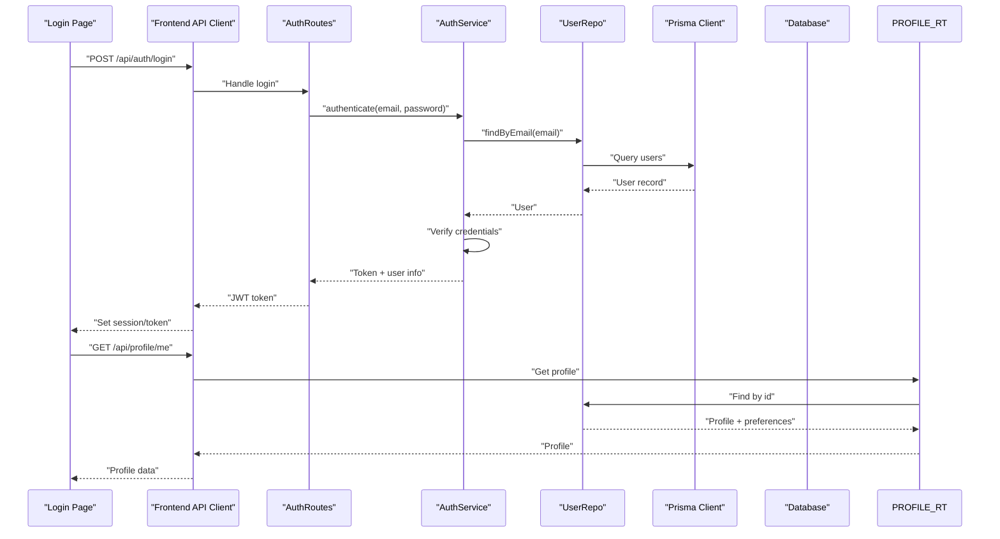
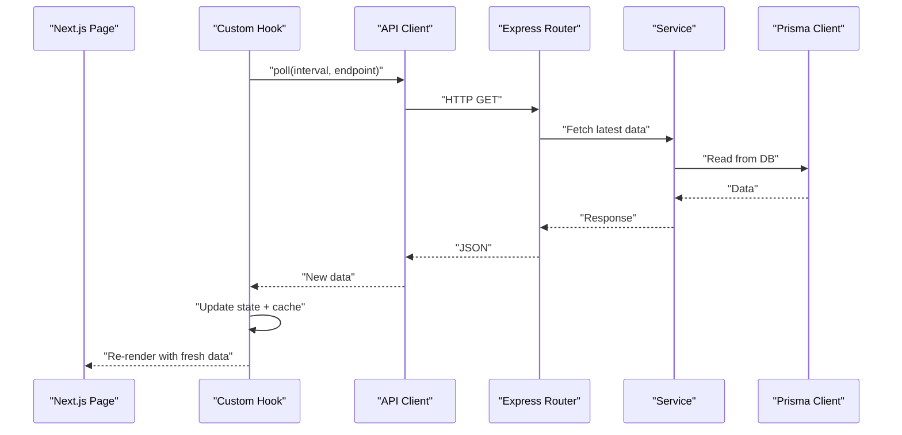
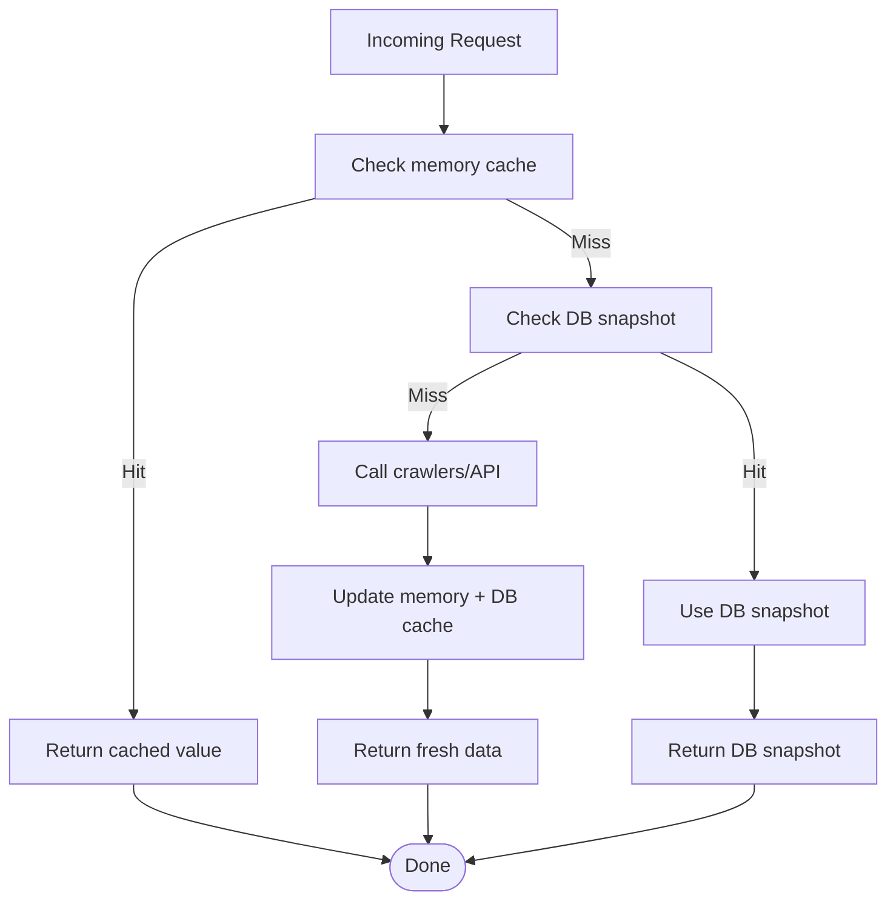
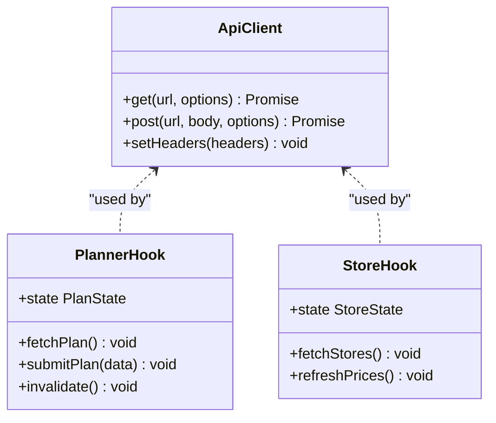
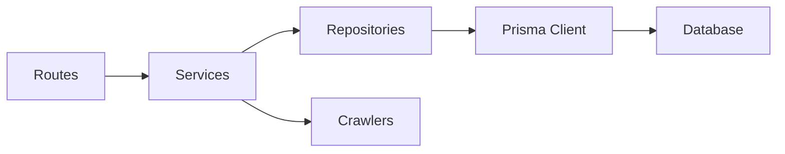

# Data Flow Patterns

<cite>
**Referenced Files in This Document**
- [main.ts](file://Backend/src/main.ts)
- [server.ts](file://Backend/src/server.ts)
- [apiRouter.ts](file://Backend/src/routes/apiRouter.ts)
- [PlannerRoutes.ts](file://Backend/src/routes/PlannerRoutes.ts)
- [StoreRoutes.ts](file://Backend/src/routes/StoreRoutes.ts)
- [AuthRoutes.ts](file://Backend/src/routes/AuthRoutes.ts)
- [ProfileRoutes.ts](file://Backend/src/routes/ProfileRoutes.ts)
- [UserRoutes.ts](file://Backend/src/routes/UserRoutes.ts)
- [planner-algorithm.ts](file://Backend/src/services/planner-algorithm.ts)
- [PlannerService.ts](file://Backend/src/services/PlannerService.ts)
- [StoreService.ts](file://Backend/src/services/StoreService.ts)
- [AuthService.ts](file://Backend/src/services/AuthService.ts)
- [UserService.ts](file://Backend/src/services/UserService.ts)
- [runner.ts](file://Backend/src/crawlers/runner.ts)
- [bachhoaxanh.ts](file://Backend/src/crawlers/bachhoaxanh.ts)
- [coopmart.ts](file://Backend/src/crawlers/coopmart.ts)
- [winmart.ts](file://Backend/src/crawlers/winmart.ts)
- [schema.prisma](file://Backend/prisma/schema.prisma)
- [prisma.ts](file://Backend/src/repos/prisma.ts)
- [MockOrm.ts](file://Backend/src/repos/MockOrm.ts)
- [UserRepo.ts](file://Backend/src/repos/UserRepo.ts)
- [api.ts](file://Frontend/studentbite/lib/api.ts)
- [hooks.ts](file://Frontend/studentbite/lib/hooks.ts)
- [types.ts](file://Frontend/studentbite/lib/types.ts)
- [page.tsx](file://Frontend/studentbite/app/(main)/planner/page.tsx)
- [page.tsx](file://Frontend/studentbite/app/(main)/stores/page.tsx)
- [page.tsx](file://Frontend/studentbite/app/login/page.tsx)
</cite>

## Table of Contents
1. Introduction
2. Project Structure
3. Core Components
4. Architecture Overview
5. Detailed Component Analysis
6. Dependency Analysis
7. Performance Considerations
8. Troubleshooting Guide
9. Conclusion

## Introduction
This document explains the end-to-end data flow patterns in StudentBite, covering request-response cycles from Next.js frontend components through Express API routes to database operations. It also details real-time synchronization strategies, caching approaches, state management patterns, and the data flows for meal planning, price comparison across stores, and user preference handling. Sequence diagrams illustrate transformations at each layer and how errors propagate.

## Project Structure
StudentBite is a full-stack application:
- Frontend: Next.js app with pages and reusable hooks/libraries for API calls and types.
- Backend: Express server with typed routes, services, crawlers for store price data, Prisma ORM for persistence, and shared utilities.

**Diagram sources**
- [server.ts](file://Backend/src/server.ts)
- [apiRouter.ts](file://Backend/src/routes/apiRouter.ts)
- [PlannerRoutes.ts](file://Backend/src/routes/PlannerRoutes.ts)
- [StoreRoutes.ts](file://Backend/src/routes/StoreRoutes.ts)
- [AuthRoutes.ts](file://Backend/src/routes/AuthRoutes.ts)
- [ProfileRoutes.ts](file://Backend/src/routes/ProfileRoutes.ts)
- [UserRoutes.ts](file://Backend/src/routes/UserRoutes.ts)
- [api.ts](file://Frontend/studentbite/lib/api.ts)
- [hooks.ts](file://Frontend/studentbite/lib/hooks.ts)
- [types.ts](file://Frontend/studentbite/lib/types.ts)

**Section sources**
- [server.ts](file://Backend/src/server.ts)
- [apiRouter.ts](file://Backend/src/routes/apiRouter.ts)
- [api.ts](file://Frontend/studentbite/lib/api.ts)

## Core Components
- Frontend API client: Centralized HTTP client with typed requests and response normalization.
- Hooks: Stateful data fetching, caching, and revalidation using React state and local storage.
- Routes: Express routers mapping endpoints to service handlers.
- Services: Business logic orchestration (auth, planner, store data, user profile).
- Crawlers: Asynchronous scraping pipeline for store prices and product availability.
- Repositories: Abstraction over Prisma client for DB access; includes mock implementation for tests.
- Database schema: Prisma model definitions defining entities and relations.

Key responsibilities:
- Request validation and transformation occur early in routes or middleware.
- Services coordinate external calls (crawlers), DB reads/writes, and business rules.
- Frontend manages optimistic UI updates and error states.

**Section sources**
- [api.ts](file://Frontend/studentbite/lib/api.ts)
- [hooks.ts](file://Frontend/studentbite/lib/hooks.ts)
- [PlannerRoutes.ts](file://Backend/src/routes/PlannerRoutes.ts)
- [StoreRoutes.ts](file://Backend/src/routes/StoreRoutes.ts)
- [AuthService.ts](file://Backend/src/services/AuthService.ts)
- [PlannerService.ts](file://Backend/src/services/PlannerService.ts)
- [StoreService.ts](file://Backend/src/services/StoreService.ts)
- [UserRepo.ts](file://Backend/src/repos/UserRepo.ts)
- [prisma.ts](file://Backend/src/repos/prisma.ts)
- [schema.prisma](file://Backend/prisma/schema.prisma)

## Architecture Overview
The system follows a layered architecture:
- Presentation: Next.js pages and components.
- API Client: Typed fetch wrapper and hooks for stateful data access.
- Routing: Express router dispatches to route handlers.
- Service Layer: Encapsulates domain logic and orchestrates crawlers and repositories.
- Data Access: Prisma client abstracts SQL queries; mock ORM supports testing.
- External Systems: Store websites via crawlers.

**Diagram sources**
- [api.ts](file://Frontend/studentbite/lib/api.ts)
- [apiRouter.ts](file://Backend/src/routes/apiRouter.ts)
- [PlannerRoutes.ts](file://Backend/src/routes/PlannerRoutes.ts)
- [PlannerService.ts](file://Backend/src/services/PlannerService.ts)
- [planner-algorithm.ts](file://Backend/src/services/planner-algorithm.ts)
- [runner.ts](file://Backend/src/crawlers/runner.ts)
- [prisma.ts](file://Backend/src/repos/prisma.ts)
- [schema.prisma](file://Backend/prisma/schema.prisma)

## Detailed Component Analysis

### Meal Planning Data Flow
The planner endpoint coordinates user preferences, historical data, and live store prices to produce an optimized weekly plan.

**Diagram sources**
- [PlannerRoutes.ts](file://Backend/src/routes/PlannerRoutes.ts)
- [PlannerService.ts](file://Backend/src/services/PlannerService.ts)
- [planner-algorithm.ts](file://Backend/src/services/planner-algorithm.ts)
- [runner.ts](file://Backend/src/crawlers/runner.ts)
- [prisma.ts](file://Backend/src/repos/prisma.ts)

**Section sources**
- [PlannerRoutes.ts](file://Backend/src/routes/PlannerRoutes.ts)
- [PlannerService.ts](file://Backend/src/services/PlannerService.ts)
- [planner-algorithm.ts](file://Backend/src/services/planner-algorithm.ts)
- [runner.ts](file://Backend/src/crawlers/runner.ts)

### Price Comparison Data Processing
Store crawlers run concurrently to collect pricing and availability. Results are normalized and optionally cached before being used by services.

**Diagram sources**
- [StoreService.ts](file://Backend/src/services/StoreService.ts)
- [runner.ts](file://Backend/src/crawlers/runner.ts)
- [bachhoaxanh.ts](file://Backend/src/crawlers/bachhoaxanh.ts)
- [coopmart.ts](file://Backend/src/crawlers/coopmart.ts)
- [winmart.ts](file://Backend/src/crawlers/winmart.ts)
- [prisma.ts](file://Backend/src/repos/prisma.ts)

**Section sources**
- [StoreService.ts](file://Backend/src/services/StoreService.ts)
- [runner.ts](file://Backend/src/crawlers/runner.ts)
- [bachhoaxanh.ts](file://Backend/src/crawlers/bachhoaxanh.ts)
- [coopmart.ts](file://Backend/src/crawlers/coopmart.ts)
- [winmart.ts](file://Backend/src/crawlers/winmart.ts)

### Authentication and User Preference Handling
Authentication routes manage login/register sessions and attach user context to subsequent requests. Preferences are stored and retrieved per user.

**Diagram sources**
- [AuthRoutes.ts](file://Backend/src/routes/AuthRoutes.ts)
- [AuthService.ts](file://Backend/src/services/AuthService.ts)
- [UserRepo.ts](file://Backend/src/repos/UserRepo.ts)
- [prisma.ts](file://Backend/src/repos/prisma.ts)
- [ProfileRoutes.ts](file://Backend/src/routes/ProfileRoutes.ts)

**Section sources**
- [AuthRoutes.ts](file://Backend/src/routes/AuthRoutes.ts)
- [AuthService.ts](file://Backend/src/services/AuthService.ts)
- [UserRepo.ts](file://Backend/src/repos/UserRepo.ts)
- [ProfileRoutes.ts](file://Backend/src/routes/ProfileRoutes.ts)

### Real-Time Data Synchronization
Real-time updates can be achieved via short polling or WebSocket channels. The current codebase uses HTTP-based APIs; real-time behavior on the frontend is implemented through periodic refetching and optimistic updates.

[No sources needed since this diagram shows conceptual workflow, not actual code structure]

### Caching Strategies
- In-memory cache: Short-lived cache for frequently accessed data (e.g., normalized prices).
- Database-backed cache: Persisted snapshots of crawled prices for fallback when crawlers fail.
- Frontend cache: Local storage and React state for optimistic UI and reduced network calls.

[No sources needed since this diagram shows conceptual workflow, not actual code structure]

### State Management Patterns
- Frontend: Custom hooks encapsulate fetch, loading, error, and cache states. Optimistic updates improve perceived performance.
- Backend: Stateless services; state is persisted via Prisma. No in-process global mutable state beyond caches.

**Diagram sources**
- [api.ts](file://Frontend/studentbite/lib/api.ts)
- [hooks.ts](file://Frontend/studentbite/lib/hooks.ts)
- [types.ts](file://Frontend/studentbite/lib/types.ts)

**Section sources**
- [hooks.ts](file://Frontend/studentbite/lib/hooks.ts)
- [api.ts](file://Frontend/studentbite/lib/api.ts)
- [types.ts](file://Frontend/studentbite/lib/types.ts)

## Dependency Analysis
The backend organizes dependencies by layers: routes depend on services; services depend on repositories and crawlers; repositories depend on Prisma.

**Diagram sources**
- [apiRouter.ts](file://Backend/src/routes/apiRouter.ts)
- [PlannerRoutes.ts](file://Backend/src/routes/PlannerRoutes.ts)
- [StoreRoutes.ts](file://Backend/src/routes/StoreRoutes.ts)
- [AuthService.ts](file://Backend/src/services/AuthService.ts)
- [PlannerService.ts](file://Backend/src/services/PlannerService.ts)
- [StoreService.ts](file://Backend/src/services/StoreService.ts)
- [UserRepo.ts](file://Backend/src/repos/UserRepo.ts)
- [prisma.ts](file://Backend/src/repos/prisma.ts)
- [runner.ts](file://Backend/src/crawlers/runner.ts)

**Section sources**
- [apiRouter.ts](file://Backend/src/routes/apiRouter.ts)
- [PlannerRoutes.ts](file://Backend/src/routes/PlannerRoutes.ts)
- [StoreRoutes.ts](file://Backend/src/routes/StoreRoutes.ts)
- [AuthService.ts](file://Backend/src/services/AuthService.ts)
- [PlannerService.ts](file://Backend/src/services/PlannerService.ts)
- [StoreService.ts](file://Backend/src/services/StoreService.ts)
- [UserRepo.ts](file://Backend/src/repos/UserRepo.ts)
- [prisma.ts](file://Backend/src/repos/prisma.ts)
- [runner.ts](file://Backend/src/crawlers/runner.ts)

## Performance Considerations
- Concurrency: Run multiple store crawlers concurrently to reduce latency.
- Caching: Implement multi-level caching (memory + DB snapshot) to avoid repeated crawling.
- Pagination: For large datasets (store listings, plans), paginate responses.
- Debounce: Debounce frequent UI-triggered requests (e.g., search).
- Idempotency: Ensure write operations are idempotent where possible.
- Connection pooling: Configure Prisma connection pool appropriately for load.

[No sources needed since this section provides general guidance]

## Troubleshooting Guide
Common issues and resolution paths:
- Network timeouts during crawling:
  - Verify crawler endpoints and rate limits.
  - Enable fallback to cached prices.
  - Log detailed errors per store.
- Authentication failures:
  - Validate JWT configuration and expiration.
  - Ensure consistent secret keys across services.
- Database errors:
  - Check migration status and schema consistency.
  - Inspect transaction boundaries and rollback behavior.
- Frontend state inconsistencies:
  - Revalidate data after mutations.
  - Handle stale cache entries gracefully.

**Section sources**
- [runner.ts](file://Backend/src/crawlers/runner.ts)
- [AuthService.ts](file://Backend/src/services/AuthService.ts)
- [prisma.ts](file://Backend/src/repos/prisma.ts)
- [hooks.ts](file://Frontend/studentbite/lib/hooks.ts)

## Conclusion
StudentBite’s data flow emphasizes clear separation of concerns: frontend hooks manage state and caching, Express routes delegate to services, and services orchestrate crawlers and databases. The planner leverages real-time price data and user preferences to generate optimized plans. Robust caching and error propagation ensure reliability and responsiveness. Future enhancements may include WebSockets for true real-time sync and more sophisticated caching policies.