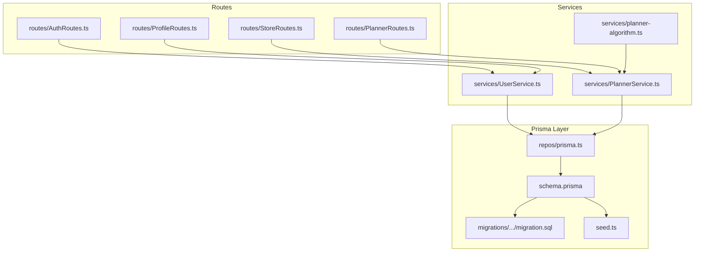
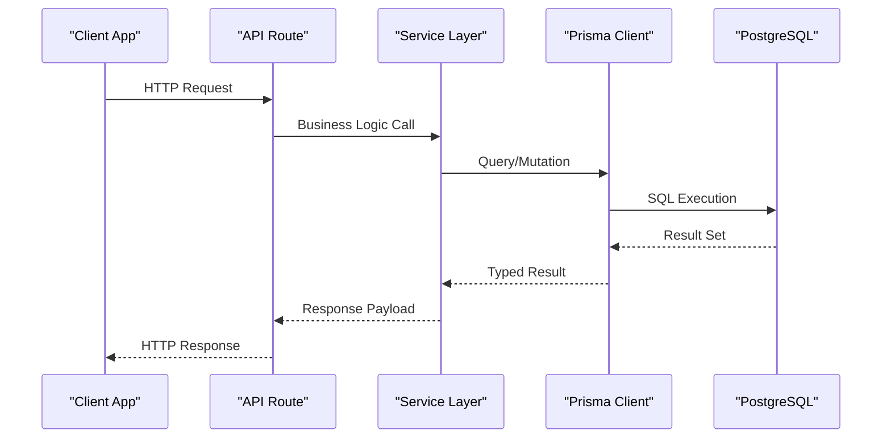
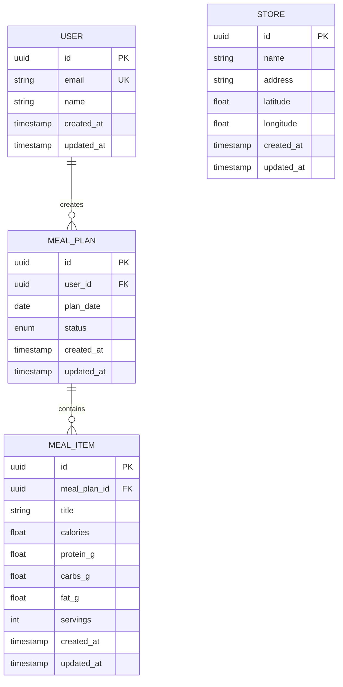
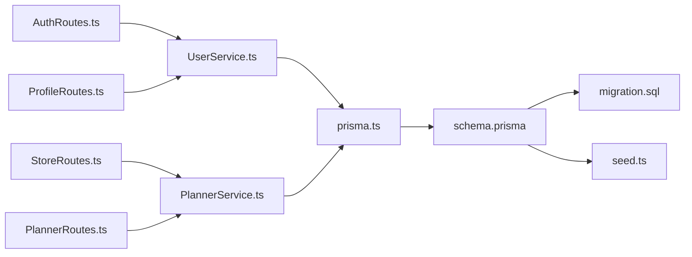

# Database Design

<cite>
**Referenced Files in This Document**
- [schema.prisma](file://Backend/prisma/schema.prisma)
- [migration.sql](file://Backend/prisma/migrations/20260801133844_init/migration.sql)
- [seed.ts](file://Backend/prisma/seed.ts)
- [prisma.ts](file://Backend/src/repos/prisma.ts)
- [User.model.ts](file://Backend/src/models/User.model.ts)
- [UserService.ts](file://Backend/src/services/UserService.ts)
- [PlannerService.ts](file://Backend/src/services/PlannerService.ts)
- [planner-algorithm.ts](file://Backend/src/services/planner-algorithm.ts)
- [AuthRoutes.ts](file://Backend/src/routes/AuthRoutes.ts)
- [ProfileRoutes.ts](file://Backend/src/routes/ProfileRoutes.ts)
- [StoreRoutes.ts](file://Backend/src/routes/StoreRoutes.ts)
- [PlannerRoutes.ts](file://Backend/src/routes/PlannerRoutes.ts)
</cite>

## Table of Contents
1. [Introduction](#introduction)
2. [Project Structure](#project-structure)
3. [Core Components](#core-components)
4. [Architecture Overview](#architecture-overview)
5. [Detailed Component Analysis](#detailed-component-analysis)
6. [Dependency Analysis](#dependency-analysis)
7. [Performance Considerations](#performance-considerations)
8. [Troubleshooting Guide](#troubleshooting-guide)
9. [Conclusion](#conclusion)
10. [Appendices](#appendices)

## Introduction
This document provides comprehensive database design documentation for the PostgreSQL schema used by the application. It focuses on entity relationships, model definitions, constraints, and indexes defined via Prisma. It also explains data types, validation rules, business constraints, migration strategy, seed data management, and schema evolution patterns. The meal planning and user management features are highlighted with sample queries and performance considerations.

## Project Structure
The database layer is implemented using Prisma ORM over PostgreSQL. The key files include:
- Prisma schema defining models, relations, and constraints
- Migration SQL generated from the schema
- Seed script for initial data
- Prisma client initialization and usage across services and routes

**Diagram sources**
- [schema.prisma](file://Backend/prisma/schema.prisma)
- [migration.sql](file://Backend/prisma/migrations/20260801133844_init/migration.sql)
- [seed.ts](file://Backend/prisma/seed.ts)
- [prisma.ts](file://Backend/src/repos/prisma.ts)
- [UserService.ts](file://Backend/src/services/UserService.ts)
- [PlannerService.ts](file://Backend/src/services/PlannerService.ts)
- [planner-algorithm.ts](file://Backend/src/services/planner-algorithm.ts)
- [AuthRoutes.ts](file://Backend/src/routes/AuthRoutes.ts)
- [ProfileRoutes.ts](file://Backend/src/routes/ProfileRoutes.ts)
- [StoreRoutes.ts](file://Backend/src/routes/StoreRoutes.ts)
- [PlannerRoutes.ts](file://Backend/src/routes/PlannerRoutes.ts)

**Section sources**
- [schema.prisma](file://Backend/prisma/schema.prisma)
- [migration.sql](file://Backend/prisma/migrations/20260801133844_init/migration.sql)
- [seed.ts](file://Backend/prisma/seed.ts)
- [prisma.ts](file://Backend/src/repos/prisma.ts)

## Core Components
- Prisma Schema: Defines all entities (models), fields, relations, and constraints that map to PostgreSQL tables, columns, keys, and indexes.
- Migration System: Ensures schema changes are versioned and applied consistently across environments.
- Seed Data: Provides deterministic initial data for development and testing.
- Client Initialization: Centralized Prisma client configuration and connection management.

Key responsibilities:
- Enforce data integrity through constraints and validations at the database level.
- Provide a type-safe query interface via Prisma Client.
- Support meal planning workflows and user management operations.

**Section sources**
- [schema.prisma](file://Backend/prisma/schema.prisma)
- [migration.sql](file://Backend/prisma/migrations/20260801133844_init/migration.sql)
- [seed.ts](file://Backend/prisma/seed.ts)
- [prisma.ts](file://Backend/src/repos/prisma.ts)

## Architecture Overview
The database architecture centers around Prisma as the ORM layer over PostgreSQL. Services interact with the database through Prisma Client, while routes expose APIs that orchestrate service calls.

**Diagram sources**
- [AuthRoutes.ts](file://Backend/src/routes/AuthRoutes.ts)
- [ProfileRoutes.ts](file://Backend/src/routes/ProfileRoutes.ts)
- [StoreRoutes.ts](file://Backend/src/routes/StoreRoutes.ts)
- [PlannerRoutes.ts](file://Backend/src/routes/PlannerRoutes.ts)
- [UserService.ts](file://Backend/src/services/UserService.ts)
- [PlannerService.ts](file://Backend/src/services/PlannerService.ts)
- [prisma.ts](file://Backend/src/repos/prisma.ts)

## Detailed Component Analysis

### Entity Relationship Model
The Prisma schema defines the core entities and their relationships. Typical entities include User, MealPlan, MealItem, Store, and related associations. Relations are enforced via foreign keys and constraints.

**Diagram sources**
- [schema.prisma](file://Backend/prisma/schema.prisma)

**Section sources**
- [schema.prisma](file://Backend/prisma/schema.prisma)

### Model Definitions and Constraints
- Primary Keys: Each model has a unique identifier field serving as the primary key.
- Unique Constraints: Email addresses are typically unique to ensure single-user identity.
- Foreign Key Constraints: Relationships between MealPlan and User, and MealItem and MealPlan enforce referential integrity.
- Validation Rules: Field-level validations such as non-null constraints and numeric ranges are defined in the schema.
- Indexes: Commonly indexed fields include foreign keys and frequently queried attributes like dates and names.

Data types:
- UUIDs for identifiers
- Strings for names and emails
- Dates for plan dates
- Floats for nutritional values
- Enums for statuses where applicable

Business constraints:
- A user can own multiple meal plans.
- A meal plan contains multiple meal items.
- Nutritional totals should be validated at the application layer before persistence.

**Section sources**
- [schema.prisma](file://Backend/prisma/schema.prisma)

### Migration Strategy
- Versioned migrations: Each schema change generates a migration file with SQL statements to evolve the database.
- Apply migrations: Use Prisma migrate commands to apply changes consistently across environments.
- Rollback strategy: Maintain backward-compatible changes when possible; use safe DDL operations.
- Lock file: The migration lock ensures consistent dependency resolution.

Operational steps:
- Generate migration after schema updates.
- Review generated SQL for safety and correctness.
- Apply migrations in CI/CD pipelines.
- Seed data after initial migration or reset.

**Section sources**
- [migration.sql](file://Backend/prisma/migrations/20260801133844_init/migration.sql)
- [schema.prisma](file://Backend/prisma/schema.prisma)

### Seed Data Management
Seed scripts populate the database with initial records for development and testing. Typical seeds include:
- Default users
- Sample meal plans and items
- Representative stores

Best practices:
- Idempotent seeding to avoid duplicates.
- Clear separation of seed data from production data.
- Environment-specific seeds for local vs. test databases.

**Section sources**
- [seed.ts](file://Backend/prisma/seed.ts)

### Prisma Client Initialization
Centralized client setup ensures consistent connection configuration and error handling. Usage across services promotes reusability and reduces duplication.

Responsibilities:
- Configure connection parameters.
- Enable logging in development.
- Provide typed access to models.

**Section sources**
- [prisma.ts](file://Backend/src/repos/prisma.ts)

### User Management Feature
User-related operations include registration, authentication, profile updates, and retrieval. Services encapsulate business logic and validate inputs before interacting with the database.

Typical flows:
- Create user with unique email.
- Authenticate user credentials.
- Update profile details.
- Fetch user data with related meal plans.

**Section sources**
- [UserService.ts](file://Backend/src/services/UserService.ts)
- [AuthRoutes.ts](file://Backend/src/routes/AuthRoutes.ts)
- [ProfileRoutes.ts](file://Backend/src/routes/ProfileRoutes.ts)
- [User.model.ts](file://Backend/src/models/User.model.ts)

### Meal Planning Feature
Meal planning involves creating plans, adding items, calculating nutritional totals, and associating plans with users. Services coordinate algorithmic calculations and persist results.

Typical flows:
- Create a new meal plan for a user and date.
- Add meal items with nutritional data.
- Compute totals and validate against goals.
- Retrieve plans and items for display.

Algorithm integration:
- Planner algorithms compute recommendations based on constraints and preferences.
- Results are persisted as meal plans and items.

**Section sources**
- [PlannerService.ts](file://Backend/src/services/PlannerService.ts)
- [planner-algorithm.ts](file://Backend/src/services/planner-algorithm.ts)
- [PlannerRoutes.ts](file://Backend/src/routes/PlannerRoutes.ts)

## Dependency Analysis
The database dependencies are primarily driven by Prisma models and relations. Services depend on the Prisma client, which depends on the schema and migrations. Routes depend on services to perform database operations.

**Diagram sources**
- [schema.prisma](file://Backend/prisma/schema.prisma)
- [migration.sql](file://Backend/prisma/migrations/20260801133844_init/migration.sql)
- [seed.ts](file://Backend/prisma/seed.ts)
- [prisma.ts](file://Backend/src/repos/prisma.ts)
- [UserService.ts](file://Backend/src/services/UserService.ts)
- [PlannerService.ts](file://Backend/src/services/PlannerService.ts)
- [AuthRoutes.ts](file://Backend/src/routes/AuthRoutes.ts)
- [ProfileRoutes.ts](file://Backend/src/routes/ProfileRoutes.ts)
- [StoreRoutes.ts](file://Backend/src/routes/StoreRoutes.ts)
- [PlannerRoutes.ts](file://Backend/src/routes/PlannerRoutes.ts)

**Section sources**
- [schema.prisma](file://Backend/prisma/schema.prisma)
- [prisma.ts](file://Backend/src/repos/prisma.ts)
- [UserService.ts](file://Backend/src/services/UserService.ts)
- [PlannerService.ts](file://Backend/src/services/PlannerService.ts)

## Performance Considerations
- Indexing: Ensure foreign keys and frequently filtered columns (e.g., plan_date, email) are indexed.
- Query Optimization: Use selective projections to fetch only needed fields; avoid N+1 queries by including related data where appropriate.
- Connection Pooling: Configure Prisma client with appropriate pool sizes for concurrent workloads.
- Transactions: Wrap multi-step operations (e.g., creating plans and items) in transactions to maintain consistency.
- Caching: Consider caching frequent reads (e.g., store listings) at the application layer.

[No sources needed since this section provides general guidance]

## Troubleshooting Guide
Common issues and resolutions:
- Migration failures: Review generated SQL for syntax errors and constraint conflicts; rollback if necessary.
- Constraint violations: Validate input data to prevent duplicate emails or invalid references.
- Connection errors: Check environment variables and network connectivity; verify Prisma client configuration.
- Seed data conflicts: Ensure idempotent seeding and clear existing data before re-seeding.

Debugging tips:
- Enable Prisma query logging in development.
- Inspect transaction logs for failed operations.
- Use database inspection tools to verify schema state.

**Section sources**
- [migration.sql](file://Backend/prisma/migrations/20260801133844_init/migration.sql)
- [prisma.ts](file://Backend/src/repos/prisma.ts)

## Conclusion
The database design leverages Prisma to define a robust, type-safe schema over PostgreSQL. Entities and relationships support user management and meal planning features with clear constraints and indexes. Migrations and seed data provide a reliable evolution path and reproducible environments. Following the performance and troubleshooting guidelines ensures efficient and maintainable operations.

[No sources needed since this section summarizes without analyzing specific files]

## Appendices

### Sample Queries
- Retrieve a user’s meal plans for a given date range.
- Calculate total nutritional values per meal plan.
- List stores near a location for shopping integration.

[No sources needed since this section provides general guidance]