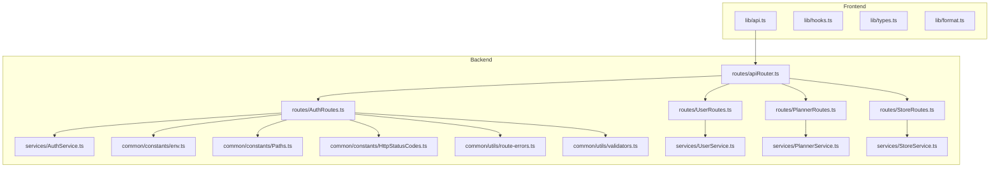
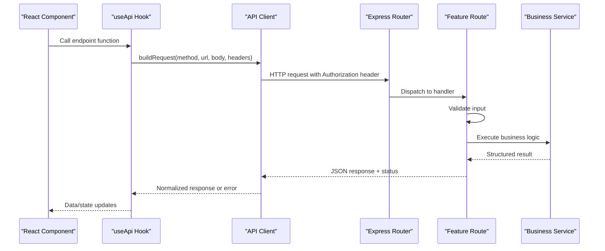
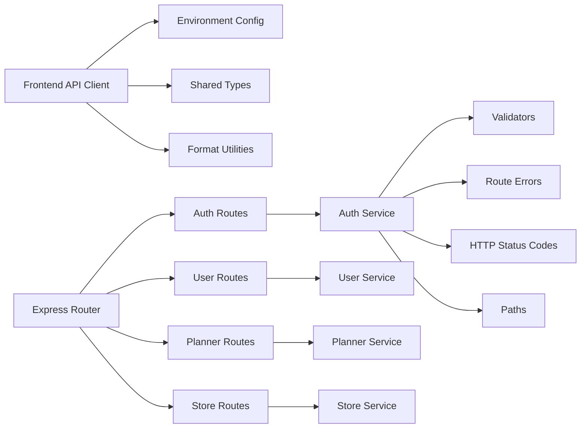

# API Integration

<cite>
**Referenced Files in This Document**
- [api.ts](file://Frontend/studentbite/lib/api.ts)
- [hooks.ts](file://Frontend/studentbite/lib/hooks.ts)
- [types.ts](file://Frontend/studentbite/lib/types.ts)
- [format.ts](file://Frontend/studentbite/lib/format.ts)
- [AuthRoutes.ts](file://Backend/src/routes/AuthRoutes.ts)
- [PlannerRoutes.ts](file://Backend/src/routes/PlannerRoutes.ts)
- [ProfileRoutes.ts](file://Backend/src/routes/ProfileRoutes.ts)
- [StoreRoutes.ts](file://Backend/src/routes/StoreRoutes.ts)
- [UserRoutes.ts](file://Backend/src/routes/UserRoutes.ts)
- [apiRouter.ts](file://Backend/src/routes/apiRouter.ts)
- [AuthService.ts](file://Backend/src/services/AuthService.ts)
- [UserService.ts](file://Backend/src/services/UserService.ts)
- [PlannerService.ts](file://Backend/src/services/PlannerService.ts)
- [StoreService.ts](file://Backend/src/services/StoreService.ts)
- [env.ts](file://Backend/src/common/constants/env.ts)
- [Paths.ts](file://Backend/src/common/constants/Paths.ts)
- [HttpStatusCodes.ts](file://Backend/src/common/constants/HttpStatusCodes.ts)
- [route-errors.ts](file://Backend/src/common/utils/route-errors.ts)
- [validators.ts](file://Backend/src/common/utils/validators.ts)
</cite>

## Table of Contents
1. [Introduction](#introduction)
2. [Project Structure](#project-structure)
3. [Core Components](#core-components)
4. [Architecture Overview](#architecture-overview)
5. [Detailed Component Analysis](#detailed-component-analysis)
6. [Dependency Analysis](#dependency-analysis)
7. [Performance Considerations](#performance-considerations)
8. [Troubleshooting Guide](#troubleshooting-guide)
9. [Conclusion](#conclusion)
10. [Appendices](#appendices)

## Introduction
This document explains the API integration patterns and client implementation across the frontend and backend. It covers the API client architecture, request/response handling, error management, data transformation utilities, authentication token handling, request interceptors, caching strategies, and practical examples of API calls with error handling and response formatting. The goal is to help developers integrate consistently and robustly with the application’s REST APIs.

## Project Structure
The project consists of a Next.js frontend and a Node/Express backend:
- Frontend API client lives under lib/api.ts and related utilities (hooks, types, format).
- Backend routes are organized by feature under routes/* and delegate to services/*.
- Shared constants and utilities live under common/constants and common/utils.

**Diagram sources**
- [api.ts](file://Frontend/studentbite/lib/api.ts)
- [apiRouter.ts](file://Backend/src/routes/apiRouter.ts)
- [AuthRoutes.ts](file://Backend/src/routes/AuthRoutes.ts)
- [UserRoutes.ts](file://Backend/src/routes/UserRoutes.ts)
- [PlannerRoutes.ts](file://Backend/src/routes/PlannerRoutes.ts)
- [StoreRoutes.ts](file://Backend/src/routes/StoreRoutes.ts)
- [AuthService.ts](file://Backend/src/services/AuthService.ts)
- [UserService.ts](file://Backend/src/services/UserService.ts)
- [PlannerService.ts](file://Backend/src/services/PlannerService.ts)
- [StoreService.ts](file://Backend/src/services/StoreService.ts)
- [env.ts](file://Backend/src/common/constants/env.ts)
- [Paths.ts](file://Backend/src/common/constants/Paths.ts)
- [HttpStatusCodes.ts](file://Backend/src/common/constants/HttpStatusCodes.ts)
- [route-errors.ts](file://Backend/src/common/utils/route-errors.ts)
- [validators.ts](file://Backend/src/common/utils/validators.ts)

**Section sources**
- [api.ts](file://Frontend/studentbite/lib/api.ts)
- [apiRouter.ts](file://Backend/src/routes/apiRouter.ts)

## Core Components
- Frontend API Client: Centralized HTTP client for making requests, handling headers, tokens, errors, and optional caching.
- Request Hooks: React hooks that encapsulate fetching logic, loading states, and error handling for components.
- Types: Shared TypeScript definitions for request payloads and responses.
- Format Utilities: Helpers to normalize or transform server responses into UI-friendly shapes.
- Backend Router: Express router aggregating feature routes and applying shared middleware.
- Feature Routes: Auth, User, Planner, Store endpoints delegating to services.
- Services: Business logic implementations interacting with data sources.
- Constants and Utils: HTTP status codes, paths, environment variables, validation helpers, and error utilities.

**Section sources**
- [api.ts](file://Frontend/studentbite/lib/api.ts)
- [hooks.ts](file://Frontend/studentbite/lib/hooks.ts)
- [types.ts](file://Frontend/studentbite/lib/types.ts)
- [format.ts](file://Frontend/studentbite/lib/format.ts)
- [apiRouter.ts](file://Backend/src/routes/apiRouter.ts)
- [AuthRoutes.ts](file://Backend/src/routes/AuthRoutes.ts)
- [UserRoutes.ts](file://Backend/src/routes/UserRoutes.ts)
- [PlannerRoutes.ts](file://Backend/src/routes/PlannerRoutes.ts)
- [StoreRoutes.ts](file://Backend/src/routes/StoreRoutes.ts)
- [AuthService.ts](file://Backend/src/services/AuthService.ts)
- [UserService.ts](file://Backend/src/services/UserService.ts)
- [PlannerService.ts](file://Backend/src/services/PlannerService.ts)
- [StoreService.ts](file://Backend/src/services/StoreService.ts)
- [env.ts](file://Backend/src/common/constants/env.ts)
- [Paths.ts](file://Backend/src/common/constants/Paths.ts)
- [HttpStatusCodes.ts](file://Backend/src/common/constants/HttpStatusCodes.ts)
- [route-errors.ts](file://Backend/src/common/utils/route-errors.ts)
- [validators.ts](file://Backend/src/common/utils/validators.ts)

## Architecture Overview
The client-server interaction follows a layered pattern:
- Frontend uses a single API client to perform HTTP requests with consistent headers, token injection, and error normalization.
- Requests are routed through a central Express router to feature-specific route handlers.
- Route handlers validate inputs and delegate business logic to services.
- Services return structured responses mapped to standardized HTTP status codes.

**Diagram sources**
- [api.ts](file://Frontend/studentbite/lib/api.ts)
- [hooks.ts](file://Frontend/studentbite/lib/hooks.ts)
- [apiRouter.ts](file://Backend/src/routes/apiRouter.ts)
- [AuthRoutes.ts](file://Backend/src/routes/AuthRoutes.ts)
- [AuthService.ts](file://Backend/src/services/AuthService.ts)

## Detailed Component Analysis

### Frontend API Client
Responsibilities:
- Build base URL from environment configuration.
- Attach authentication tokens via Authorization header.
- Serialize request bodies and parse JSON responses.
- Normalize network and server errors into a consistent shape.
- Provide methods for GET, POST, PUT, PATCH, DELETE.
- Optional caching layer for read-only endpoints.

Key behaviors:
- Token handling: Reads token from secure storage and injects it into headers.
- Interceptors: Centralized error mapping and retry policy for transient failures.
- Response formatting: Converts server payloads into typed structures using format utilities.
- Cache strategy: In-memory cache keyed by URL and query params; supports TTL and invalidation on mutations.

Example usage patterns:
- Authentication call: POST /auth/login returns a token stored securely.
- Protected call: GET /user/me includes Authorization header.
- Mutation call: POST /planner/schedule triggers cache invalidation.

Error handling patterns:
- Network errors: Timeout, offline, DNS resolution failures.
- Server errors: Non-2xx status codes mapped to domain-specific error messages.
- Validation errors: Field-level errors aggregated for UI display.

Caching strategies:
- Read endpoints cached with TTL; write endpoints invalidate relevant keys.
- Stale-while-revalidate for improved UX without sacrificing freshness.

**Section sources**
- [api.ts](file://Frontend/studentbite/lib/api.ts)
- [format.ts](file://Frontend/studentbite/lib/format.ts)
- [types.ts](file://Frontend/studentbite/lib/types.ts)

### Request Hooks
Responsibilities:
- Encapsulate fetch lifecycle: loading, success, error states.
- Manage optimistic updates and rollback on failure.
- Provide reusable functions for components to trigger API calls.

Patterns:
- useGet: Fetches data with caching and background refresh.
- useMutation: Executes mutations with automatic invalidation and error handling.
- useAuth: Manages login/logout flows and token persistence.

Example flows:
- Login flow: useAuth.login sends credentials, stores token, redirects.
- Data fetch: useGet.fetchUsers retrieves users, handles pagination, and errors.

**Section sources**
- [hooks.ts](file://Frontend/studentbite/lib/hooks.ts)
- [api.ts](file://Frontend/studentbite/lib/api.ts)

### Types and Formatting
Types:
- Define request payloads and response schemas for each endpoint.
- Enforce strict typing across client and server contracts.

Formatting:
- Transform server timestamps to user-friendly dates.
- Normalize nested objects and arrays for UI consumption.
- Map server error codes to human-readable messages.

**Section sources**
- [types.ts](file://Frontend/studentbite/lib/types.ts)
- [format.ts](file://Frontend/studentbite/lib/format.ts)

### Backend Router and Routes
Router:
- Centralizes route registration and applies global middleware (e.g., CORS, logging).
- Mounts feature routers under versioned prefixes.

Routes:
- AuthRoutes: Handles login, register, token refresh.
- UserRoutes: CRUD operations for user profiles.
- PlannerRoutes: Planning algorithms and schedule management.
- StoreRoutes: Store listings and location queries.

Each route validates inputs, delegates to services, and returns standardized JSON responses.

**Section sources**
- [apiRouter.ts](file://Backend/src/routes/apiRouter.ts)
- [AuthRoutes.ts](file://Backend/src/routes/AuthRoutes.ts)
- [UserRoutes.ts](file://Backend/src/routes/UserRoutes.ts)
- [PlannerRoutes.ts](file://Backend/src/routes/PlannerRoutes.ts)
- [StoreRoutes.ts](file://Backend/src/routes/StoreRoutes.ts)

### Services
Services implement business logic:
- AuthService: Authentication workflows, token generation/validation.
- UserService: Profile management and user data operations.
- PlannerService: Algorithm-driven planning and scheduling.
- StoreService: Store data retrieval and filtering.

They interact with repositories or external systems and return domain models.

**Section sources**
- [AuthService.ts](file://Backend/src/services/AuthService.ts)
- [UserService.ts](file://Backend/src/services/UserService.ts)
- [PlannerService.ts](file://Backend/src/services/PlannerService.ts)
- [StoreService.ts](file://Backend/src/services/StoreService.ts)

### Constants and Utilities
Constants:
- env.ts: Environment variables such as API base URLs, JWT secrets, and timeouts.
- Paths.ts: Centralized route path definitions.
- HttpStatusCodes.ts: Standard HTTP status codes used across responses.

Utilities:
- validators.ts: Input validation helpers for request payloads.
- route-errors.ts: Error mapping and response formatting for route handlers.

**Section sources**
- [env.ts](file://Backend/src/common/constants/env.ts)
- [Paths.ts](file://Backend/src/common/constants/Paths.ts)
- [HttpStatusCodes.ts](file://Backend/src/common/constants/HttpStatusCodes.ts)
- [validators.ts](file://Backend/src/common/utils/validators.ts)
- [route-errors.ts](file://Backend/src/common/utils/route-errors.ts)

## Dependency Analysis
The client depends on environment configuration and type definitions, while the backend routes depend on services and shared utilities.

**Diagram sources**
- [api.ts](file://Frontend/studentbite/lib/api.ts)
- [types.ts](file://Frontend/studentbite/lib/types.ts)
- [format.ts](file://Frontend/studentbite/lib/format.ts)
- [apiRouter.ts](file://Backend/src/routes/apiRouter.ts)
- [AuthRoutes.ts](file://Backend/src/routes/AuthRoutes.ts)
- [UserRoutes.ts](file://Backend/src/routes/UserRoutes.ts)
- [PlannerRoutes.ts](file://Backend/src/routes/PlannerRoutes.ts)
- [StoreRoutes.ts](file://Backend/src/routes/StoreRoutes.ts)
- [AuthService.ts](file://Backend/src/services/AuthService.ts)
- [UserService.ts](file://Backend/src/services/UserService.ts)
- [PlannerService.ts](file://Backend/src/services/PlannerService.ts)
- [StoreService.ts](file://Backend/src/services/StoreService.ts)
- [validators.ts](file://Backend/src/common/utils/validators.ts)
- [route-errors.ts](file://Backend/src/common/utils/route-errors.ts)
- [HttpStatusCodes.ts](file://Backend/src/common/constants/HttpStatusCodes.ts)
- [Paths.ts](file://Backend/src/common/constants/Paths.ts)

**Section sources**
- [api.ts](file://Frontend/studentbite/lib/api.ts)
- [apiRouter.ts](file://Backend/src/routes/apiRouter.ts)

## Performance Considerations
- Use caching for read-heavy endpoints to reduce latency and server load.
- Implement stale-while-revalidate to improve perceived performance.
- Debounce search queries and paginate large datasets.
- Avoid unnecessary re-fetches by leveraging hook state and cache invalidation.
- On the backend, apply input validation early to fail fast and minimize processing.

[No sources needed since this section provides general guidance]

## Troubleshooting Guide
Common issues and resolutions:
- Authentication failures: Ensure token is present and valid; handle 401 by refreshing or re-authenticating.
- Network errors: Check connectivity, timeouts, and CORS settings; log detailed error context.
- Validation errors: Inspect field-level error messages returned by validators; update UI forms accordingly.
- Cache inconsistencies: Invalidate cache on mutations; verify TTL and key uniqueness.

Diagnostic steps:
- Inspect request headers and payload serialization.
- Verify environment variables for base URLs and secrets.
- Review backend logs and error mappings for root causes.

**Section sources**
- [route-errors.ts](file://Backend/src/common/utils/route-errors.ts)
- [validators.ts](file://Backend/src/common/utils/validators.ts)
- [env.ts](file://Backend/src/common/constants/env.ts)

## Conclusion
The API integration pattern combines a robust frontend client with well-structured backend routes and services. Consistent error handling, token management, and caching ensure reliable and performant interactions. By following the documented patterns, developers can extend functionality safely and maintain clarity across the codebase.

[No sources needed since this section summarizes without analyzing specific files]

## Appendices

### Example API Calls
- Login: Send credentials to the auth endpoint; store token securely; subsequent requests include Authorization header.
- Fetch profile: GET user profile with token; handle 401 by redirecting to login.
- Create planner entry: POST new entry; invalidate related caches; show success feedback.

### Error Handling Patterns
- Network errors: Retry with exponential backoff for transient failures.
- Server errors: Map status codes to user-friendly messages; log details for debugging.
- Validation errors: Aggregate field errors and display inline in forms.

### Response Formatting
- Normalize timestamps to local time zones.
- Flatten nested structures for UI consumption.
- Map error codes to descriptive messages.

[No sources needed since this section provides general guidance]