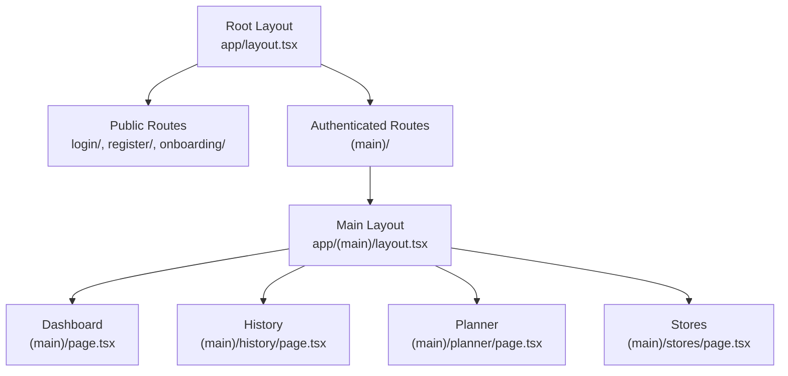
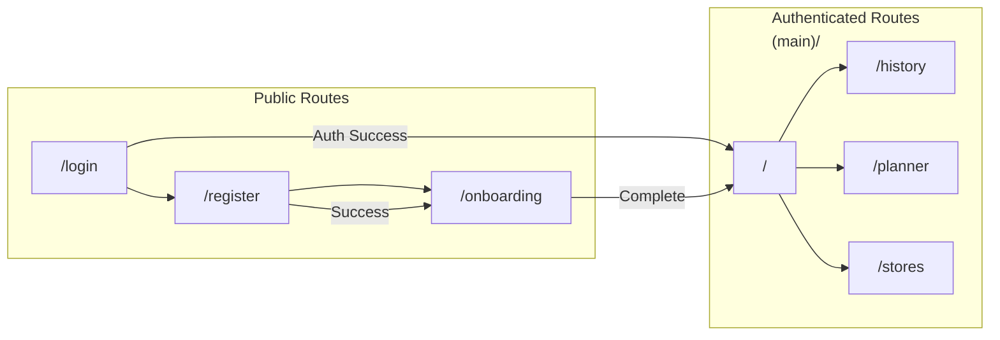
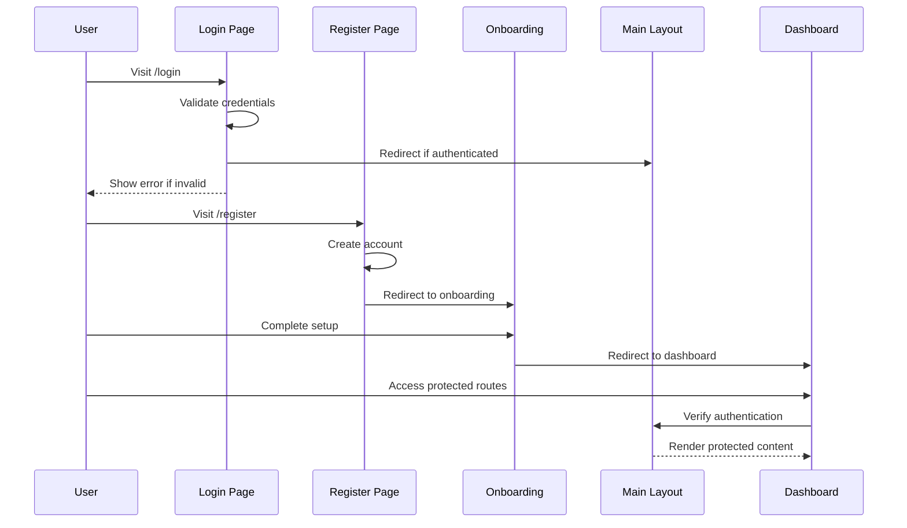
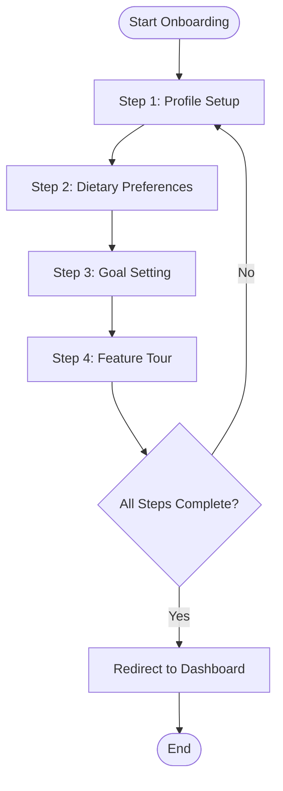
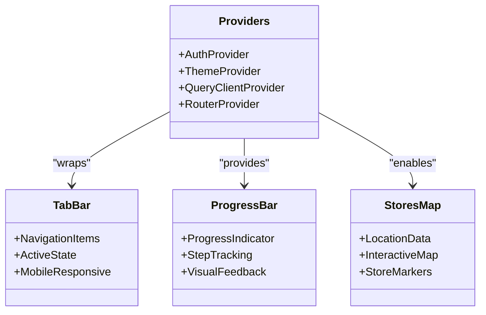
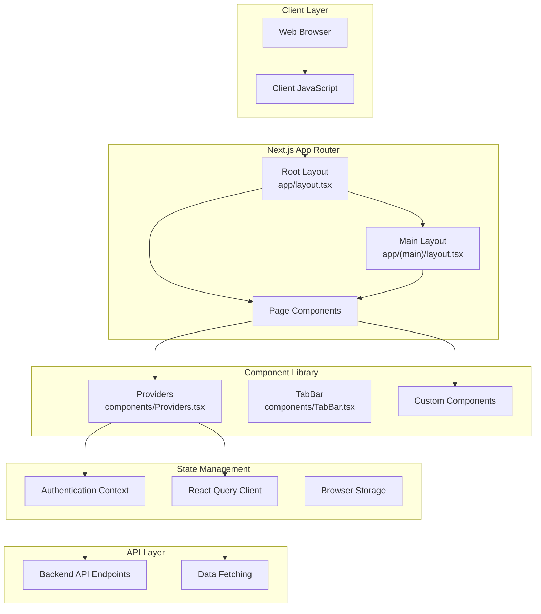
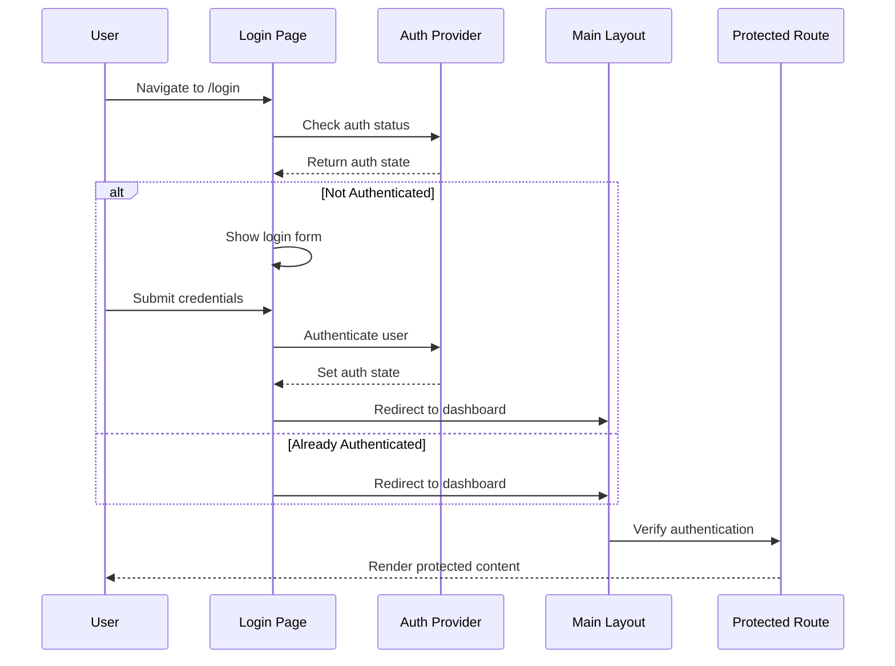

# App Router Structure

<cite>
**Referenced Files in This Document**
- [app/layout.tsx](file://Frontend/studentbite/app/layout.tsx)
- [app/(main)/layout.tsx](file://Frontend/studentbite/app/(main)/layout.tsx)
- [app/(main)/page.tsx](file://Frontend/studentbite/app/(main)/page.tsx)
- [app/login/page.tsx](file://Frontend/studentbite/app/login/page.tsx)
- [app/register/page.tsx](file://Frontend/studentbite/app/register/page.tsx)
- [app/onboarding/page.tsx](file://Frontend/studentbite/app/onboarding/page.tsx)
- [components/Providers.tsx](file://Frontend/studentbite/components/Providers.tsx)
- [components/TabBar.tsx](file://Frontend/studentbite/components/TabBar.tsx)
- [lib/hooks.ts](file://Frontend/studentbite/lib/hooks.ts)
</cite>

## Table of Contents
1. [Introduction](#introduction)
2. [Project Structure Overview](#project-structure-overview)
3. [Layout Hierarchy](#layout-hierarchy)
4. [Route Groups and Organization](#route-groups-and-organization)
5. [Authentication Flow](#authentication-flow)
6. [Onboarding Process](#onboarding-process)
7. [Nested Layouts and Shared Components](#nested-layouts-and-shared-components)
8. [Route-Based Code Splitting](#route-based-code-splitting)
9. [URL Routing Mapping](#url-routing-mapping)
10. [Architecture Diagrams](#architecture-diagrams)
11. [Best Practices](#best-practices)
12. [Troubleshooting Guide](#troubleshooting-guide)

## Introduction

This document provides comprehensive documentation for the Next.js App Router structure in the StudentBite application. The project follows modern Next.js conventions using the App Router introduced in Next.js 13+, which offers a file-system based routing approach with enhanced features like layouts, nested routes, and server components.

The StudentBite application is a nutrition planning platform that demonstrates advanced Next.js patterns including authentication flows, onboarding processes, route groups, and component organization.

## Project Structure Overview

The Next.js App Router structure follows a hierarchical file-system based approach where each directory represents a route segment and files define the behavior and presentation of those routes.

```mermaid
graph TB
subgraph "App Directory Structure"
A[app/] --> B[layout.tsx]
A --> C[(main)/]
A --> D[login/]
A --> E[register/]
A --> F[onboarding/]
C --> G[layout.tsx]
C --> H[page.tsx]
C --> I[history/]
C --> J[planner/]
C --> K[stores/]
I --> L[page.tsx]
J --> M[page.tsx]
K --> N[page.tsx]
end
subgraph "Components"
O[components/] --> P[Providers.tsx]
O --> Q[TabBar.tsx]
O --> R[ProgressBar.tsx]
O --> S[StoresMap.tsx]
end
```

**Diagram sources**
- [app/layout.tsx](file://Frontend/studentbite/app/layout.tsx)
- [app/(main)/layout.tsx](file://Frontend/studentbite/app/(main)/layout.tsx)
- [app/(main)/page.tsx](file://Frontend/studentbite/app/(main)/page.tsx)

**Section sources**
- [app/layout.tsx](file://Frontend/studentbite/app/layout.tsx)
- [app/(main)/layout.tsx](file://Frontend/studentbite/app/(main)/layout.tsx)

## Layout Hierarchy

The application implements a two-level layout hierarchy that separates public routes from authenticated content:

### Root Layout (app/layout.tsx)
The root layout serves as the foundation for all pages, providing global styles, providers, and common metadata. It wraps the entire application and handles global state management.

### Main Layout (app/(main)/layout.tsx)
The main layout wraps authenticated routes within the `(main)` route group. This layout typically includes navigation elements, authentication guards, and shared UI components that should be present across all authenticated pages.



**Diagram sources**
- [app/layout.tsx](file://Frontend/studentbite/app/layout.tsx)
- [app/(main)/layout.tsx](file://Frontend/studentbite/app/(main)/layout.tsx)

**Section sources**
- [app/layout.tsx](file://Frontend/studentbite/app/layout.tsx)
- [app/(main)/layout.tsx](file://Frontend/studentbite/app/(main)/layout.tsx)

## Route Groups and Organization

Route groups are implemented using parentheses around directory names, allowing for logical grouping without affecting the URL structure.

### Main Route Group ((main)/)
The `(main)` route group contains all authenticated routes:
- `/` - Dashboard/Home page
- `/history` - Food history tracking
- `/planner` - Meal planning interface
- `/stores` - Store locator functionality

### Public Routes
Public routes that don't require authentication:
- `/login` - User authentication
- `/register` - New user registration
- `/onboarding` - First-time user setup process



**Diagram sources**
- [app/login/page.tsx](file://Frontend/studentbite/app/login/page.tsx)
- [app/register/page.tsx](file://Frontend/studentbite/app/register/page.tsx)
- [app/onboarding/page.tsx](file://Frontend/studentbite/app/onboarding/page.tsx)
- [app/(main)/page.tsx](file://Frontend/studentbite/app/(main)/page.tsx)

**Section sources**
- [app/(main)/page.tsx](file://Frontend/studentbite/app/(main)/page.tsx)
- [app/login/page.tsx](file://Frontend/studentbite/app/login/page.tsx)
- [app/register/page.tsx](file://Frontend/studentbite/app/register/page.tsx)
- [app/onboarding/page.tsx](file://Frontend/studentbite/app/onboarding/page.tsx)

## Authentication Flow

The application implements a complete authentication flow with proper routing and state management:

### Authentication States
1. **Unauthenticated**: Users see login/register pages
2. **Authenticated**: Users have access to main dashboard and features
3. **Onboarding**: New users go through setup process

### Flow Sequence


**Diagram sources**
- [app/login/page.tsx](file://Frontend/studentbite/app/login/page.tsx)
- [app/register/page.tsx](file://Frontend/studentbite/app/register/page.tsx)
- [app/onboarding/page.tsx](file://Frontend/studentbite/app/onboarding/page.tsx)
- [app/(main)/layout.tsx](file://Frontend/studentbite/app/(main)/layout.tsx)

**Section sources**
- [app/login/page.tsx](file://Frontend/studentbite/app/login/page.tsx)
- [app/register/page.tsx](file://Frontend/studentbite/app/register/page.tsx)
- [app/onboarding/page.tsx](file://Frontend/studentbite/app/onboarding/page.tsx)

## Onboarding Process

The onboarding process guides new users through essential setup steps before accessing the main application features.

### Onboarding Steps
1. **User Profile Setup**: Basic information collection
2. **Dietary Preferences**: Food restrictions and preferences
3. **Goal Setting**: Weight and health objectives
4. **Feature Introduction**: Tour of key application features

### State Management
The onboarding process uses local state management to track progress and persist completion status.



**Diagram sources**
- [app/onboarding/page.tsx](file://Frontend/studentbite/app/onboarding/page.tsx)

**Section sources**
- [app/onboarding/page.tsx](file://Frontend/studentbite/app/onboarding/page.tsx)

## Nested Layouts and Shared Components

The application leverages nested layouts and shared components to maintain consistency and reduce code duplication.

### Component Architecture


**Diagram sources**
- [components/Providers.tsx](file://Frontend/studentbite/components/Providers.tsx)
- [components/TabBar.tsx](file://Frontend/studentbite/components/TabBar.tsx)
- [components/ProgressBar.tsx](file://Frontend/studentbite/components/ProgressBar.tsx)
- [components/StoresMap.tsx](file://Frontend/studentbite/components/StoresMap.tsx)

### Shared Component Usage
- **Providers**: Global state management and context providers
- **TabBar**: Navigation component used across authenticated routes
- **ProgressBar**: Visual feedback for multi-step processes
- **StoresMap**: Location-based functionality for store discovery

**Section sources**
- [components/Providers.tsx](file://Frontend/studentbite/components/Providers.tsx)
- [components/TabBar.tsx](file://Frontend/studentbite/components/TabBar.tsx)
- [components/ProgressBar.tsx](file://Frontend/studentbite/components/ProgressBar.tsx)
- [components/StoresMap.tsx](file://Frontend/studentbite/components/StoresMap.tsx)

## Route-Based Code Splitting

Next.js automatically implements code splitting at the route level, ensuring optimal performance by loading only the necessary code for each page.

### Code Splitting Benefits
- **Faster Initial Load**: Only essential code loads first
- **Lazy Loading**: Additional features load on demand
- **Bundle Optimization**: Reduced JavaScript bundle size
- **Improved Performance**: Better user experience with faster page transitions

### Route-Level Optimization
Each route in the App Router is automatically split into separate bundles:
- `app/layout.tsx` - Global layout and providers
- `app/(main)/layout.tsx` - Authenticated layout
- `app/login/page.tsx` - Login functionality
- `app/(main)/page.tsx` - Dashboard and main features

```mermaid
graph TB
subgraph "Initial Bundle"
A[app/layout.tsx] --> B[Global Styles]
A --> C[Core Providers]
end
subgraph "Login Bundle"
D[app/login/page.tsx] --> E[Auth Logic]
D --> F[Form Handling]
end
subgraph "Main Bundle"
G[app/(main)/layout.tsx] --> H[Auth Guard]
G --> I[Navigations]
J[app/(main)/page.tsx] --> K[Dashboard Features]
end
subgraph "Feature Bundles"
L[app/(main)/history/page.tsx] --> M[History Logic]
N[app/(main)/planner/page.tsx] --> O[Planning Features]
P[app/(main)/stores/page.tsx] --> Q[Location Services]
end
```

**Diagram sources**
- [app/layout.tsx](file://Frontend/studentbite/app/layout.tsx)
- [app/(main)/layout.tsx](file://Frontend/studentbite/app/(main)/layout.tsx)
- [app/(main)/page.tsx](file://Frontend/studentbite/app/(main)/page.tsx)

**Section sources**
- [app/layout.tsx](file://Frontend/studentbite/app/layout.tsx)
- [app/(main)/layout.tsx](file://Frontend/studentbite/app/(main)/layout.tsx)
- [app/(main)/page.tsx](file://Frontend/studentbite/app/(main)/page.tsx)

## URL Routing Mapping

The Next.js App Router maps file paths directly to URL routes with predictable patterns:

### File Path to URL Mapping
| File Path | URL Route | Description |
|-----------|-----------|-------------|
| `app/layout.tsx` | `/` | Root layout (not a route) |
| `app/(main)/layout.tsx` | `/` | Main layout (not a route) |
| `app/(main)/page.tsx` | `/` | Dashboard/Home |
| `app/(main)/history/page.tsx` | `/history` | History tracking |
| `app/(main)/planner/page.tsx` | `/planner` | Meal planner |
| `app/(main)/stores/page.tsx` | `/stores` | Store locator |
| `app/login/page.tsx` | `/login` | Login page |
| `app/register/page.tsx` | `/register` | Registration page |
| `app/onboarding/page.tsx` | `/onboarding` | Onboarding flow |

### Dynamic Routes
The current structure uses static routes, but the App Router supports dynamic segments:
- `[id]/page.tsx` → `/user/[id]`
- `[...slug]/page.tsx` → `/blog/[...slug]`

```mermaid
graph LR
subgraph "File System"
A[app/] --> B[(main)/]
A --> C[login/]
A --> D[register/]
A --> E[onboarding/]
B --> F[page.tsx]
B --> G[history/]
B --> H[planner/]
B --> I[stores/]
end
subgraph "URL Routes"
J[/] --> K[/history]
J --> L[/planner]
J --> M[/stores]
N[/login] --> O[/register]
O --> P[/onboarding]
end
```

**Diagram sources**
- [app/(main)/page.tsx](file://Frontend/studentbite/app/(main)/page.tsx)
- [app/(main)/history/page.tsx](file://Frontend/studentbite/app/(main)/history/page.tsx)
- [app/(main)/planner/page.tsx](file://Frontend/studentbite/app/(main)/planner/page.tsx)
- [app/(main)/stores/page.tsx](file://Frontend/studentbite/app/(main)/stores/page.tsx)

**Section sources**
- [app/(main)/page.tsx](file://Frontend/studentbite/app/(main)/page.tsx)
- [app/login/page.tsx](file://Frontend/studentbite/app/login/page.tsx)
- [app/register/page.tsx](file://Frontend/studentbite/app/register/page.tsx)
- [app/onboarding/page.tsx](file://Frontend/studentbite/app/onboarding/page.tsx)

## Architecture Diagrams

### Complete Application Architecture


**Diagram sources**
- [app/layout.tsx](file://Frontend/studentbite/app/layout.tsx)
- [app/(main)/layout.tsx](file://Frontend/studentbite/app/(main)/layout.tsx)
- [components/Providers.tsx](file://Frontend/studentbite/components/Providers.tsx)
- [components/TabBar.tsx](file://Frontend/studentbite/components/TabBar.tsx)

### Authentication Flow Architecture


**Diagram sources**
- [app/login/page.tsx](file://Frontend/studentbite/app/login/page.tsx)
- [app/(main)/layout.tsx](file://Frontend/studentbite/app/(main)/layout.tsx)
- [components/Providers.tsx](file://Frontend/studentbite/components/Providers.tsx)

## Best Practices

### Layout Organization
- Use root layout for global providers and styles
- Implement route-specific layouts for consistent UI patterns
- Keep layouts focused on presentation and navigation
- Avoid heavy logic in layout components

### Component Design
- Create reusable components in the `components/` directory
- Use TypeScript for type safety
- Implement proper prop interfaces
- Follow single responsibility principle

### Authentication Implementation
- Centralize auth logic in providers
- Use route guards for protected routes
- Handle loading states appropriately
- Implement proper error handling

### Performance Optimization
- Leverage automatic code splitting
- Use React.lazy for heavy components
- Implement proper caching strategies
- Optimize images and assets

## Troubleshooting Guide

### Common Issues and Solutions

#### Layout Not Rendering
- Ensure layout files export default components
- Check for proper component structure
- Verify file naming conventions

#### Authentication Redirects Not Working
- Verify auth state management
- Check redirect logic in layouts
- Ensure proper route protection

#### Route Not Found Errors
- Confirm file path matches expected URL
- Check for typos in route definitions
- Verify route group syntax

#### Component Import Issues
- Check relative import paths
- Ensure proper file extensions
- Verify TypeScript configuration

**Section sources**
- [app/layout.tsx](file://Frontend/studentbite/app/layout.tsx)
- [app/(main)/layout.tsx](file://Frontend/studentbite/app/(main)/layout.tsx)
- [components/Providers.tsx](file://Frontend/studentbite/components/Providers.tsx)

## Conclusion

The StudentBite application demonstrates a well-structured Next.js App Router implementation with clear separation between public and authenticated routes. The use of route groups, nested layouts, and shared components creates a maintainable and scalable architecture.

Key strengths of this implementation include:
- Clear separation of concerns between public and authenticated routes
- Reusable components and layouts
- Proper authentication flow with onboarding
- Efficient code splitting and performance optimization
- Maintainable file structure following Next.js conventions

This structure provides a solid foundation for scaling the application while maintaining code quality and developer experience.