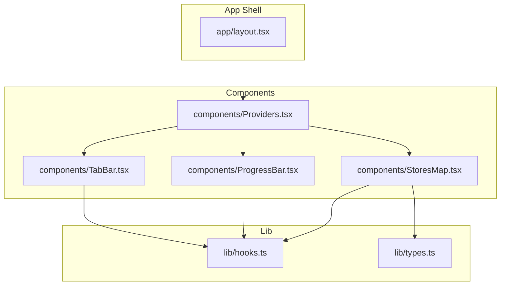
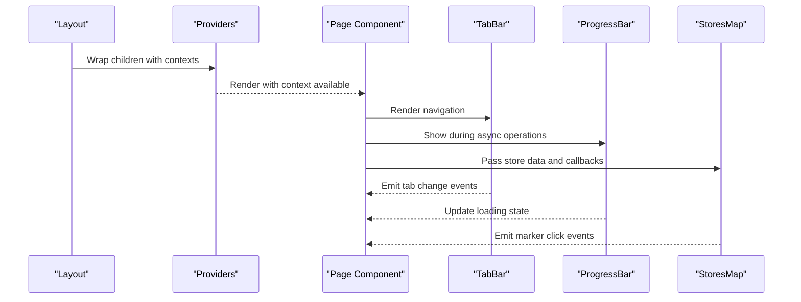
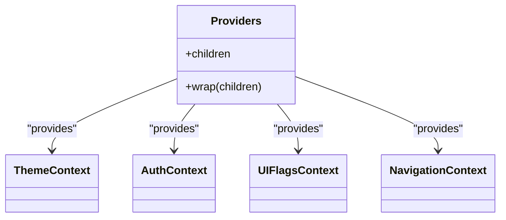
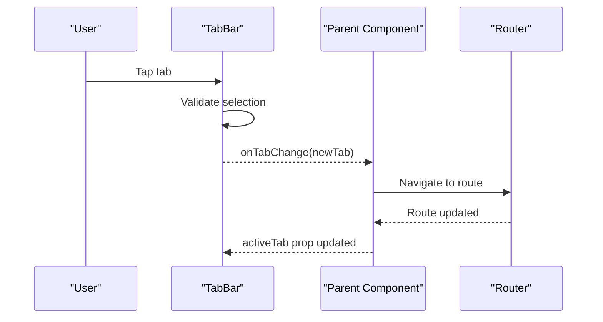
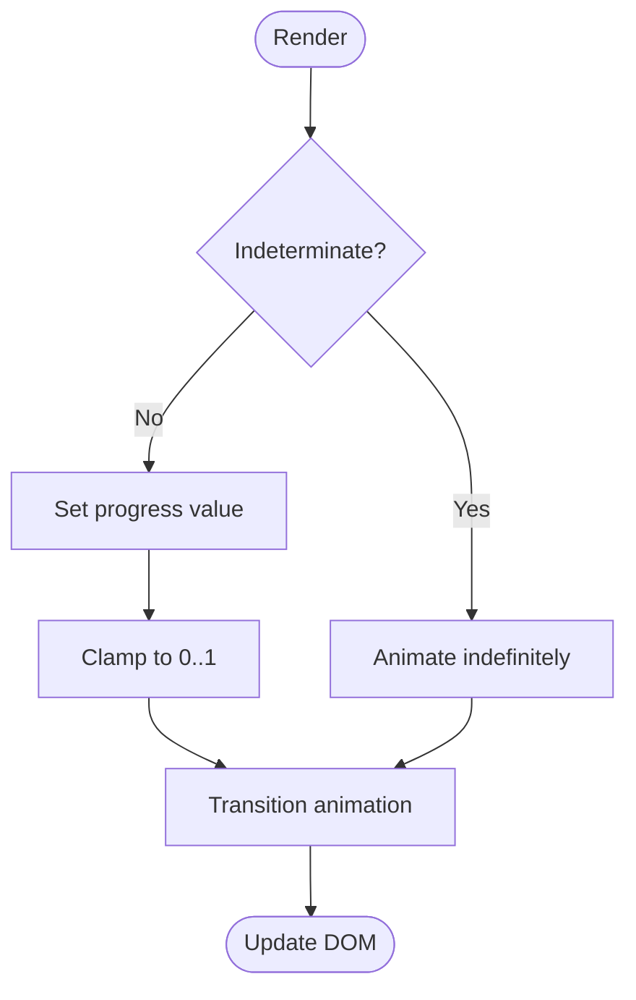
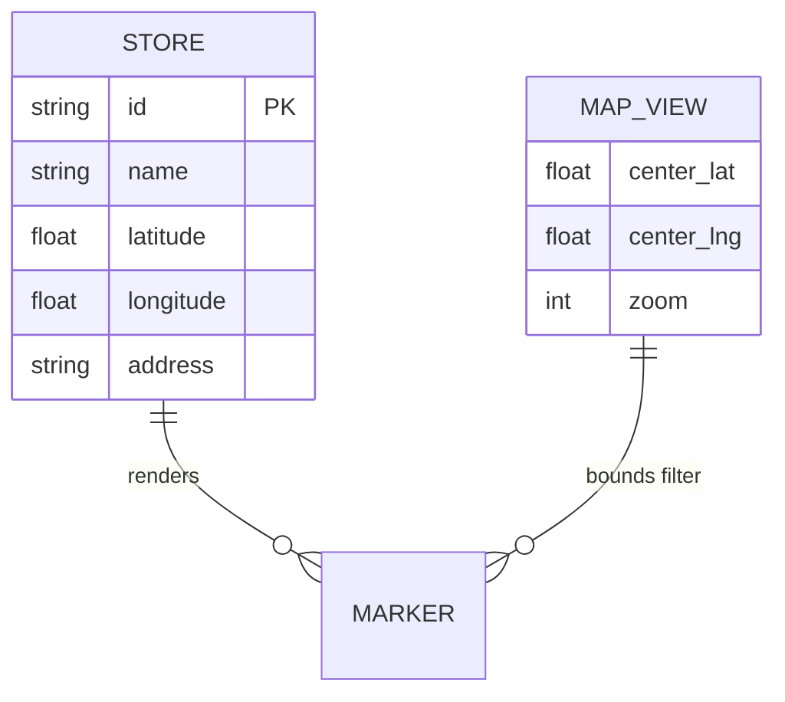
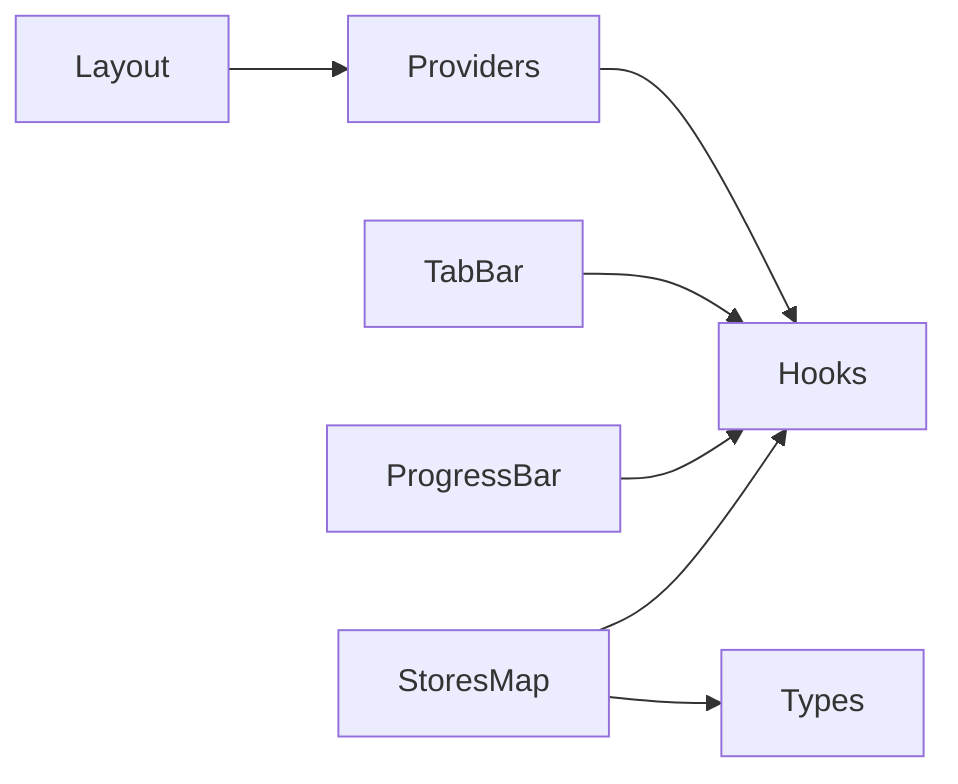

# Component Hierarchy

<cite>
**Referenced Files in This Document**
- [Providers.tsx](file://Frontend/studentbite/components/Providers.tsx)
- [TabBar.tsx](file://Frontend/studentbite/components/TabBar.tsx)
- [ProgressBar.tsx](file://Frontend/studentbite/components/ProgressBar.tsx)
- [StoresMap.tsx](file://Frontend/studentbite/components/StoresMap.tsx)
- [layout.tsx](file://Frontend/studentbite/app/layout.tsx)
- [hooks.ts](file://Frontend/studentbite/lib/hooks.ts)
- [types.ts](file://Frontend/studentbite/lib/types.ts)
</cite>

## Table of Contents
1. [Introduction](#introduction)
2. [Project Structure](#project-structure)
3. [Core Components](#core-components)
4. [Architecture Overview](#architecture-overview)
5. [Detailed Component Analysis](#detailed-component-analysis)
6. [Dependency Analysis](#dependency-analysis)
7. [Performance Considerations](#performance-considerations)
8. [Troubleshooting Guide](#troubleshooting-guide)
9. [Conclusion](#conclusion)

## Introduction
This document explains the React component hierarchy and architecture for the StudentBite frontend, focusing on:
- Providers component for global state management via context providers
- TabBar navigation system for bottom tab navigation
- ProgressBar for loading states
- StoresMap for store visualization

It also covers component composition patterns, prop interfaces, event handling, reusability strategies, and examples of custom hooks usage and context providers.

## Project Structure
The relevant frontend code resides under Frontend/studentbite with a Next.js App Router structure. The key components are located in components/, shared utilities and types in lib/, and layout configuration in app/.

**Diagram sources**
- [layout.tsx](file://Frontend/studentbite/app/layout.tsx)
- [Providers.tsx](file://Frontend/studentbite/components/Providers.tsx)
- [TabBar.tsx](file://Frontend/studentbite/components/TabBar.tsx)
- [ProgressBar.tsx](file://Frontend/studentbite/components/ProgressBar.tsx)
- [StoresMap.tsx](file://Frontend/studentbite/components/StoresMap.tsx)
- [hooks.ts](file://Frontend/studentbite/lib/hooks.ts)
- [types.ts](file://Frontend/studentbite/lib/types.ts)

**Section sources**
- [layout.tsx](file://Frontend/studentbite/app/layout.tsx)
- [Providers.tsx](file://Frontend/studentbite/components/Providers.tsx)
- [TabBar.tsx](file://Frontend/studentbite/components/TabBar.tsx)
- [ProgressBar.tsx](file://Frontend/studentbite/components/ProgressBar.tsx)
- [StoresMap.tsx](file://Frontend/studentbite/components/StoresMap.tsx)
- [hooks.ts](file://Frontend/studentbite/lib/hooks.ts)
- [types.ts](file://Frontend/studentbite/lib/types.ts)

## Core Components
- Providers: A root-level wrapper that composes multiple context providers to supply global state (e.g., theme, auth, navigation, UI flags). It ensures child components can consume these contexts without prop drilling.
- TabBar: A reusable bottom navigation bar that renders tabs based on configuration, manages active tab state, and handles navigation events.
- ProgressBar: A lightweight indicator for loading states, supporting determinate and indeterminate modes and optional text labels.
- StoresMap: A map visualization component for stores, accepting data props and rendering interactive markers or clusters.

Key responsibilities:
- Providers centralizes cross-cutting concerns and reduces coupling between pages and state.
- TabBar encapsulates navigation logic and styling, enabling consistent UX across routes.
- ProgressBar abstracts loading feedback, improving perceived performance.
- StoresMap isolates mapping logic and data transformation from page components.

**Section sources**
- [Providers.tsx](file://Frontend/studentbite/components/Providers.tsx)
- [TabBar.tsx](file://Frontend/studentbite/components/TabBar.tsx)
- [ProgressBar.tsx](file://Frontend/studentbite/components/ProgressBar.tsx)
- [StoresMap.tsx](file://Frontend/studentbite/components/StoresMap.tsx)

## Architecture Overview
The application uses a layered architecture:
- App shell (layout) wraps the entire tree with Providers.
- Providers injects contexts consumed by feature components.
- Feature components (TabBar, ProgressBar, StoresMap) remain pure and focused on presentation and local behavior.
- Custom hooks in lib/hooks provide reusable logic for state, effects, and API interactions.

**Diagram sources**
- [layout.tsx](file://Frontend/studentbite/app/layout.tsx)
- [Providers.tsx](file://Frontend/studentbite/components/Providers.tsx)
- [TabBar.tsx](file://Frontend/studentbite/components/TabBar.tsx)
- [ProgressBar.tsx](file://Frontend/studentbite/components/ProgressBar.tsx)
- [StoresMap.tsx](file://Frontend/studentbite/components/StoresMap.tsx)

## Detailed Component Analysis

### Providers Component
Purpose:
- Compose multiple context providers (e.g., theme, auth, UI flags, navigation).
- Provide default values and ensure type safety through typed contexts.
- Centralize initialization logic for global state.

Composition pattern:
- Uses nested provider components to encapsulate distinct domains of state.
- Exposes a single wrapper to simplify usage at the app root.

Context usage:
- Consumers access state via custom hooks that read from the corresponding context.
- Avoids direct context consumption in deep trees to reduce re-renders.

Reusability strategy:
- Providers is agnostic to specific features; it only wires up contexts.
- New contexts can be added without changing consumer code.

Event handling:
- Context setters expose functions to update state safely.
- Events are typically triggered by user actions or side effects within consumers.

Prop interface:
- Accepts children elements and optional initial configuration for contexts.

Custom hooks usage:
- Consumers use hooks like useTheme, useAuth, useUIFlags to interact with contexts.

**Section sources**
- [Providers.tsx](file://Frontend/studentbite/components/Providers.tsx)
- [hooks.ts](file://Frontend/studentbite/lib/hooks.ts)

#### Class Diagram (Conceptual)

[No diagram sources since this is conceptual]

### TabBar Component
Purpose:
- Renders a bottom navigation bar with configurable tabs.
- Manages active tab state and emits navigation events.

Props:
- tabs: Array of tab definitions (label, icon, route/key).
- activeTab: Current active tab identifier.
- onTabChange: Callback invoked when a tab is selected.

Navigation pattern:
- Uses client-side routing or internal state to switch views.
- Emits events rather than directly invoking router methods to stay decoupled.

Styling:
- Consistent visual style across platforms with responsive layout.

Accessibility:
- Keyboard navigation support and proper ARIA attributes.

Reusability:
- Can be embedded in any page requiring bottom navigation.

Custom hooks usage:
- May use useActiveTab or similar hooks to sync with global navigation state.

**Section sources**
- [TabBar.tsx](file://Frontend/studentbite/components/TabBar.tsx)
- [hooks.ts](file://Frontend/studentbite/lib/hooks.ts)

#### Sequence Diagram (Tab Selection Flow)

**Diagram sources**
- [TabBar.tsx](file://Frontend/studentbite/components/TabBar.tsx)

### ProgressBar Component
Purpose:
- Displays loading indicators for async operations.
- Supports determinate progress (percentage) and indeterminate mode.

Props:
- value: Number between 0 and 1 for determinate mode.
- indeterminate: Boolean to enable infinite animation.
- label: Optional text description.
- size: Visual scale (small, medium, large).

Behavior:
- Animates smoothly using CSS transitions or requestAnimationFrame.
- Hides automatically when not needed.

Integration:
- Used around data fetching blocks or heavy computations.

Accessibility:
- Announces progress to screen readers when appropriate.

Custom hooks usage:
- Often paired with useLoading hook to manage loading state centrally.

**Section sources**
- [ProgressBar.tsx](file://Frontend/studentbite/components/ProgressBar.tsx)
- [hooks.ts](file://Frontend/studentbite/lib/hooks.ts)

#### Flowchart (Progress Update Logic)

**Diagram sources**
- [ProgressBar.tsx](file://Frontend/studentbite/components/ProgressBar.tsx)

### StoresMap Component
Purpose:
- Visualizes store locations on an interactive map.
- Handles marker rendering, clustering, and user interactions.

Props:
- stores: Array of store objects with location data.
- onMarkerClick: Callback for marker interaction.
- center: Initial map center coordinates.
- zoom: Initial zoom level.

Data flow:
- Receives normalized store data from parent.
- Transforms coordinates into map markers.

Interactions:
- Clicking a marker triggers onMarkerClick with store details.
- Supports pan, zoom, and fit-to-bounds behaviors.

Performance:
- Memoizes marker lists and avoids unnecessary re-renders.

Custom hooks usage:
- May use useMapBounds or useStoreMarkers to derive map state.

Types:
- Relies on lib/types.ts for store shape and coordinate definitions.

**Section sources**
- [StoresMap.tsx](file://Frontend/studentbite/components/StoresMap.tsx)
- [types.ts](file://Frontend/studentbite/lib/types.ts)
- [hooks.ts](file://Frontend/studentbite/lib/hooks.ts)

#### Data Model Diagram

**Diagram sources**
- [StoresMap.tsx](file://Frontend/studentbite/components/StoresMap.tsx)
- [types.ts](file://Frontend/studentbite/lib/types.ts)

## Dependency Analysis
Component dependencies:
- Providers depends on context definitions and custom hooks.
- TabBar depends on navigation hooks and may depend on global UI state.
- ProgressBar depends on loading hooks and styling utilities.
- StoresMap depends on data types and map-related hooks.

Coupling and cohesion:
- High cohesion within each component; low coupling via props and hooks.
- Providers centralizes coupling to contexts, keeping feature components clean.

External dependencies:
- Map library integration (e.g., Leaflet or Google Maps) abstracted behind StoresMap.
- Routing handled by Next.js App Router or client-side navigation.

Potential circular dependencies:
- Avoid importing components into hooks that import those same components.
- Keep hooks pure and free of component imports where possible.

**Diagram sources**
- [Providers.tsx](file://Frontend/studentbite/components/Providers.tsx)
- [TabBar.tsx](file://Frontend/studentbite/components/TabBar.tsx)
- [ProgressBar.tsx](file://Frontend/studentbite/components/ProgressBar.tsx)
- [StoresMap.tsx](file://Frontend/studentbite/components/StoresMap.tsx)
- [hooks.ts](file://Frontend/studentbite/lib/hooks.ts)
- [types.ts](file://Frontend/studentbite/lib/types.ts)
- [layout.tsx](file://Frontend/studentbite/app/layout.tsx)

**Section sources**
- [Providers.tsx](file://Frontend/studentbite/components/Providers.tsx)
- [TabBar.tsx](file://Frontend/studentbite/components/TabBar.tsx)
- [ProgressBar.tsx](file://Frontend/studentbite/components/ProgressBar.tsx)
- [StoresMap.tsx](file://Frontend/studentbite/components/StoresMap.tsx)
- [hooks.ts](file://Frontend/studentbite/lib/hooks.ts)
- [types.ts](file://Frontend/studentbite/lib/types.ts)
- [layout.tsx](file://Frontend/studentbite/app/layout.tsx)

## Performance Considerations
- Memoization: Use React.memo for pure components like ProgressBar and StoresMap markers to prevent unnecessary re-renders.
- Context updates: Split contexts by domain to minimize re-renders; avoid updating large context objects frequently.
- Lazy loading: Defer heavy components (e.g., map initialization) until needed.
- Event throttling: Debounce map interactions and tab changes to reduce work.
- Data normalization: Normalize store data to avoid duplicate computations.

[No sources needed since this section provides general guidance]

## Troubleshooting Guide
Common issues:
- Missing context provider: Ensure Providers wraps all consumers.
- Incorrect prop types: Validate Store and Tab shapes against lib/types.ts.
- Loading state not clearing: Verify async hooks properly set loading flags on success/error.
- Map not rendering: Check coordinates format and map library initialization.

Debugging tips:
- Log context values in development to verify state propagation.
- Use browser dev tools to inspect component props and state.
- Add error boundaries around map and navigation components.

**Section sources**
- [Providers.tsx](file://Frontend/studentbite/components/Providers.tsx)
- [TabBar.tsx](file://Frontend/studentbite/components/TabBar.tsx)
- [ProgressBar.tsx](file://Frontend/studentbite/components/ProgressBar.tsx)
- [StoresMap.tsx](file://Frontend/studentbite/components/StoresMap.tsx)
- [hooks.ts](file://Frontend/studentbite/lib/hooks.ts)
- [types.ts](file://Frontend/studentbite/lib/types.ts)

## Conclusion
The StudentBite frontend follows a clear component hierarchy centered around Providers for global state, with focused, reusable components for navigation, loading, and data visualization. Composition patterns, typed props, and custom hooks promote maintainability and scalability. By adhering to these architectural principles, the application remains modular, testable, and performant.

[No sources needed since this section summarizes without analyzing specific files]