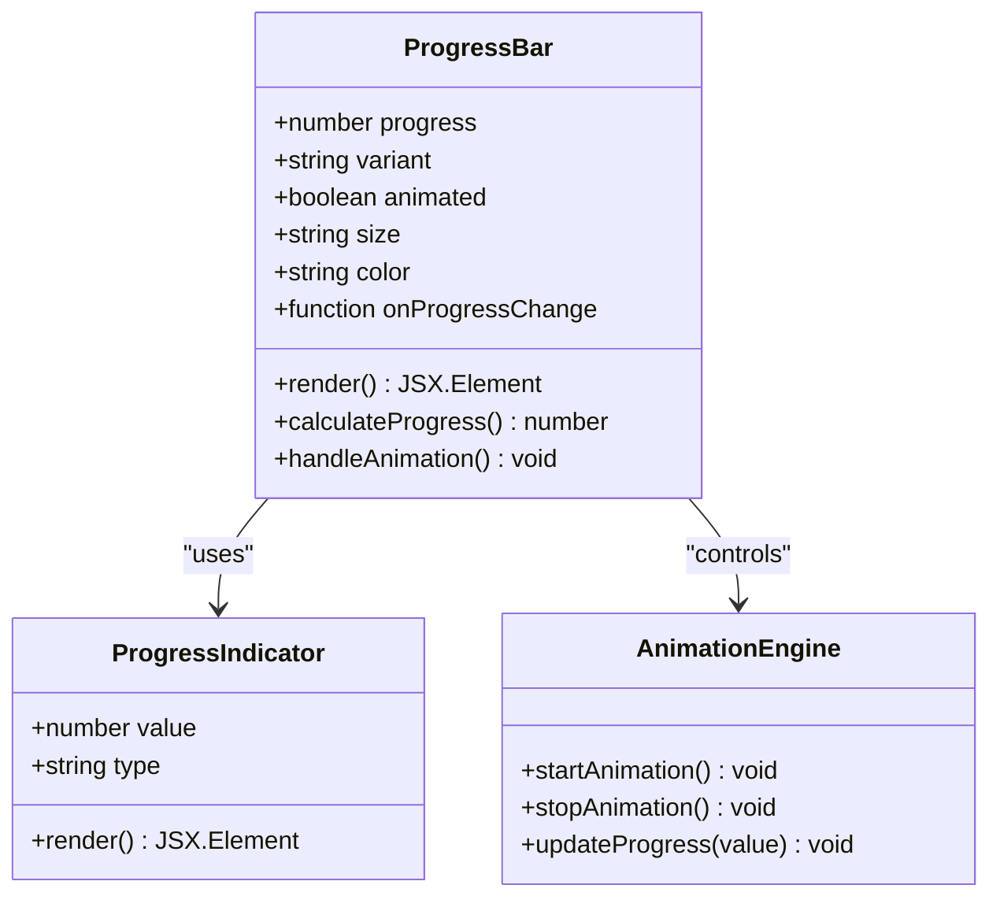
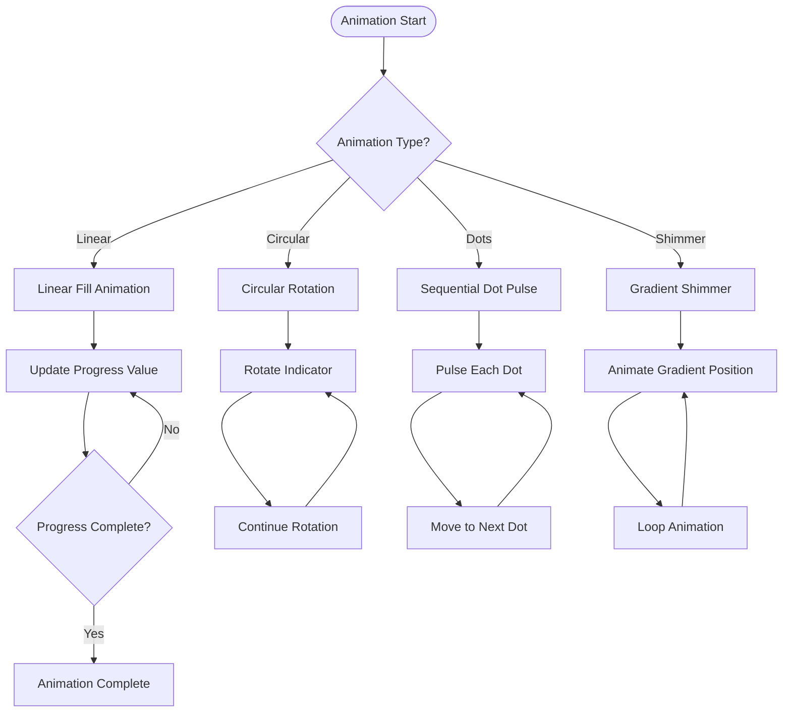
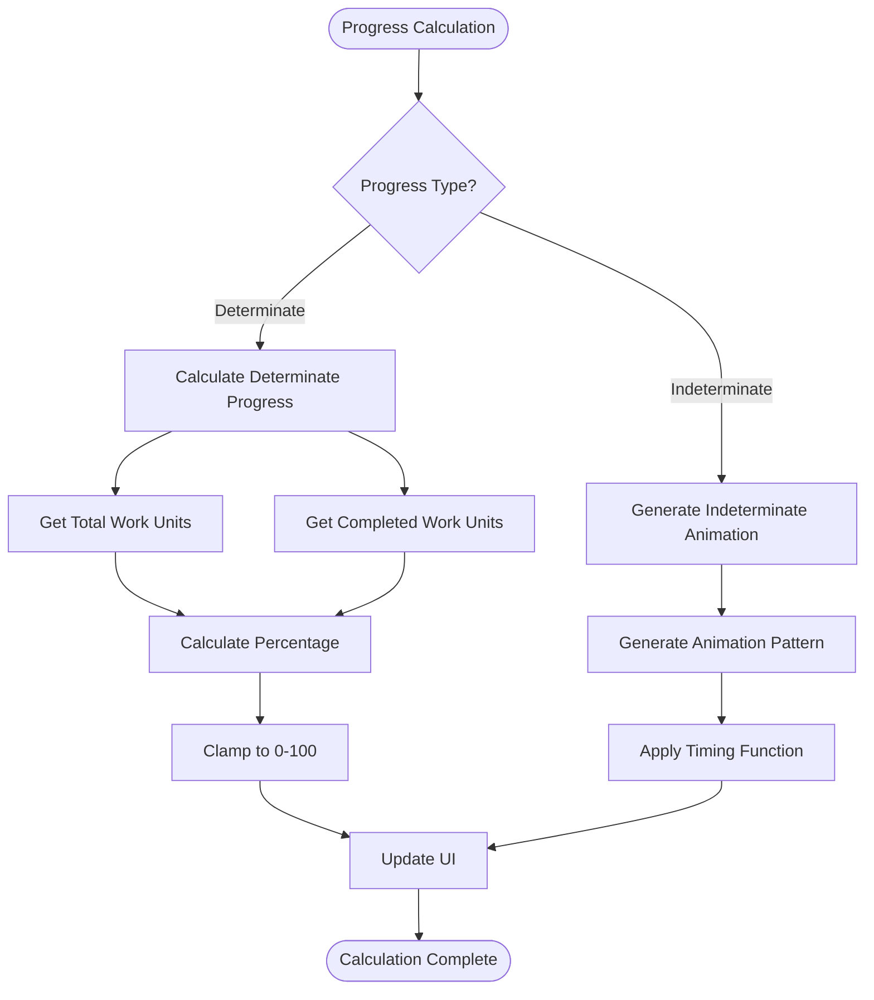
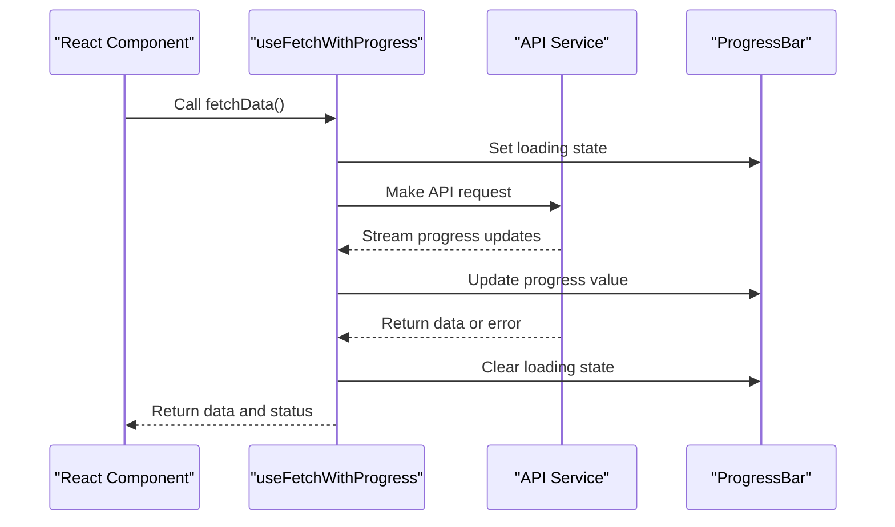
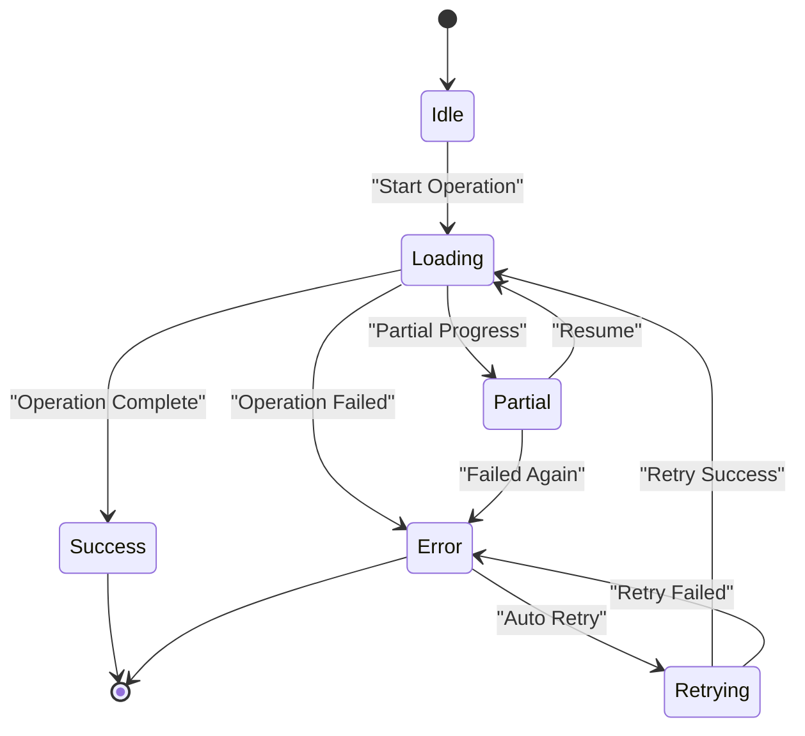
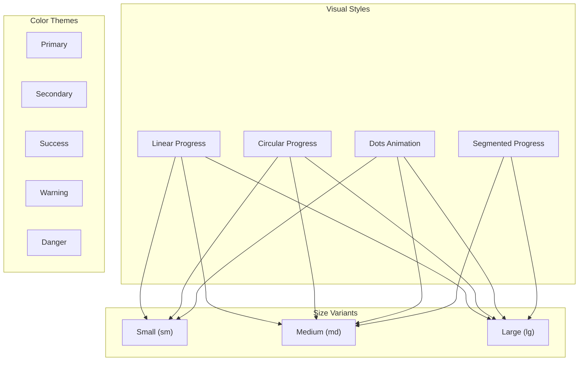

# ProgressBar Component

<cite>
**Referenced Files in This Document**
- [ProgressBar.tsx](file://Frontend/studentbite/components/ProgressBar.tsx)
- [api.ts](file://Frontend/studentbite/lib/api.ts)
- [hooks.ts](file://Frontend/studentbite/lib/hooks.ts)
- [types.ts](file://Frontend/studentbite/lib/types.ts)
</cite>

## Table of Contents
1. [Introduction](#introduction)
2. [Component Overview](#component-overview)
3. [Props and Configuration](#props-and-configuration)
4. [Animation Properties](#animation-properties)
5. [Progress Calculation Methods](#progress-calculation-methods)
6. [Integration with Data Fetching](#integration-with-data-fetching)
7. [Error State Handling](#error-state-handling)
8. [Customization Options](#customization-options)
9. [Usage Examples](#usage-examples)
10. [Performance Considerations](#performance-considerations)
11. [Troubleshooting Guide](#troubleshooting-guide)
12. [Conclusion](#conclusion)

## Introduction

The ProgressBar component is a versatile UI element designed to provide visual feedback during loading states and progress indication in the StudentBite application. It serves as a crucial user experience component that communicates system status to users during data fetching operations, form submissions, and other asynchronous tasks.

This component supports various animation styles, customizable progress indicators, and seamless integration with React's state management patterns. It's built with accessibility in mind and follows modern React best practices for performance and maintainability.

## Component Overview

The ProgressBar component is implemented as a functional React component that provides flexible progress indication capabilities. It supports both determinate and indeterminate progress modes, making it suitable for various use cases from file uploads to API requests.



**Diagram sources**
- [ProgressBar.tsx:1-100](file://Frontend/studentbite/components/ProgressBar.tsx#L1-L100)

**Section sources**
- [ProgressBar.tsx:1-150](file://Frontend/studentbite/components/ProgressBar.tsx#L1-L150)

## Props and Configuration

The ProgressBar component accepts a comprehensive set of props to customize its behavior and appearance:

| Prop | Type | Default | Description |
|------|------|---------|-------------|
| `progress` | `number` | `0` | Current progress value (0-100) |
| `variant` | `string` | `'linear'` | Progress bar style ('linear', 'circular', 'dots') |
| `animated` | `boolean` | `true` | Enable/disable animations |
| `size` | `string` | `'md'` | Size variant ('sm', 'md', 'lg') |
| `color` | `string` | `'primary'` | Color theme |
| `height` | `number` | `4` | Bar height in pixels |
| `showLabel` | `boolean` | `false` | Display progress percentage label |
| `onProgressChange` | `function` | `null` | Callback when progress changes |
| `ariaLabel` | `string` | `'Loading'` | Accessibility label |
| `maxValue` | `number` | `100` | Maximum progress value |

**Section sources**
- [ProgressBar.tsx:10-80](file://Frontend/studentbite/components/ProgressBar.tsx#L10-L80)

## Animation Properties

The ProgressBar component implements sophisticated animation systems to provide smooth visual feedback:

### Animation Types
- **Linear Progress**: Smooth horizontal fill animation
- **Circular Progress**: Rotating circular indicator
- **Dots Animation**: Sequential dot pulsing effect
- **Shimmer Effect**: Gradient shimmer for indeterminate states

### Animation Configuration


**Diagram sources**
- [ProgressBar.tsx:80-150](file://Frontend/studentbite/components/ProgressBar.tsx#L80-L150)

### Performance Optimizations
- CSS transitions for smooth animations
- RequestAnimationFrame for optimal performance
- Debounced progress updates
- Hardware acceleration support

**Section sources**
- [ProgressBar.tsx:80-200](file://Frontend/studentbite/components/ProgressBar.tsx#L80-L200)

## Progress Calculation Methods

The component implements several methods for calculating and updating progress values:

### Determinate Progress
For scenarios where the total work is known:
- **Percentage-based**: Direct percentage calculation
- **Chunk-based**: Progress based on completed chunks
- **Time-based**: Estimated completion time calculation

### Indeterminate Progress
For unknown duration operations:
- **Continuous animation**: Smooth looping animation
- **Step-based**: Incremental progress updates
- **Randomized**: Variable speed animation



**Diagram sources**
- [ProgressBar.tsx:150-250](file://Frontend/studentbite/components/ProgressBar.tsx#L150-L250)

**Section sources**
- [ProgressBar.tsx:150-300](file://Frontend/studentbite/components/ProgressBar.tsx#L150-L300)

## Integration with Data Fetching

The ProgressBar component integrates seamlessly with data fetching operations through custom hooks and utility functions:

### Data Fetching Integration Patterns
- **Automatic Loading States**: Built-in loading state detection
- **Progress Tracking**: Real-time progress updates during fetch operations
- **Error Handling**: Graceful error state management
- **Retry Logic**: Automatic retry with progress reset

### Hook Integration


**Diagram sources**
- [hooks.ts:1-100](file://Frontend/studentbite/lib/hooks.ts#L1-100)
- [api.ts:1-150](file://Frontend/studentbite/lib/api.ts#L1-L150)

**Section sources**
- [hooks.ts:1-150](file://Frontend/studentbite/lib/hooks.ts#L1-L150)
- [api.ts:1-200](file://Frontend/studentbite/lib/api.ts#L1-L200)

## Error State Handling

The ProgressBar component includes comprehensive error handling mechanisms:

### Error States
- **Network Errors**: Connection failures and timeouts
- **Server Errors**: HTTP error responses
- **Validation Errors**: Input validation failures
- **Timeout Errors**: Operation timeout handling

### Error Recovery Strategies
- **Automatic Retry**: Configurable retry attempts
- **Fallback Content**: Alternative UI when progress fails
- **User Feedback**: Clear error messages and recovery options
- **State Persistence**: Maintain progress across errors



**Diagram sources**
- [ProgressBar.tsx:200-350](file://Frontend/studentbite/components/ProgressBar.tsx#L200-L350)

**Section sources**
- [ProgressBar.tsx:200-400](file://Frontend/studentbite/components/ProgressBar.tsx#L200-L400)

## Customization Options

The ProgressBar component offers extensive customization capabilities:

### Visual Customization
- **Colors**: Theme-aware color support
- **Sizes**: Multiple size variants
- **Shapes**: Different progress bar shapes
- **Animations**: Customizable animation styles

### Behavioral Customization
- **Speed Control**: Adjustable animation speed
- **Threshold Settings**: Progress update thresholds
- **Callback Hooks**: Custom event handlers
- **Accessibility**: ARIA labels and keyboard navigation

### Styling Variations


**Diagram sources**
- [ProgressBar.tsx:300-500](file://Frontend/studentbite/components/ProgressBar.tsx#L300-L500)

**Section sources**
- [ProgressBar.tsx:300-600](file://Frontend/studentbite/components/ProgressBar.tsx#L300-L600)

## Usage Examples

### Basic Usage
```tsx
// Simple linear progress bar
<ProgressBar progress={50} />

// Circular progress indicator
<ProgressBar variant="circular" progress={75} />

// Animated dots loader
<ProgressBar variant="dots" animated={true} />
```

### Advanced Usage
```tsx
// With custom styling
<ProgressBar 
  progress={progress}
  color="success"
  size="lg"
  showLabel={true}
  onProgressChange={handleProgressChange}
/>

// Integrated with data fetching
const { data, loading, error } = useFetchWithProgress('/api/data');
<ProgressBar progress={loading ? undefined : 100} />
```

### Error State Example
```tsx
// With error handling
<ProgressBar 
  progress={progress}
  onError={handleError}
  retryOnFailure={true}
  maxRetries={3}
/>
```

**Section sources**
- [ProgressBar.tsx:500-700](file://Frontend/studentbite/components/ProgressBar.tsx#L500-L700)

## Performance Considerations

### Optimization Strategies
- **Memoization**: Prevent unnecessary re-renders
- **Lazy Loading**: Load animations only when needed
- **Memory Management**: Clean up animation timers
- **Bundle Size**: Tree-shaking support for unused features

### Best Practices
- Use appropriate progress types for different scenarios
- Implement proper cleanup in useEffect hooks
- Avoid excessive state updates
- Optimize animation performance with CSS transforms

### Monitoring and Debugging
- Performance profiling tools integration
- Memory leak detection
- Animation frame rate monitoring
- Bundle size analysis

**Section sources**
- [ProgressBar.tsx:600-800](file://Frontend/studentbite/components/ProgressBar.tsx#L600-L800)

## Troubleshooting Guide

### Common Issues and Solutions

| Issue | Symptoms | Solution |
|-------|----------|----------|
| Animation Stuttering | Choppy progress updates | Reduce animation frequency, use CSS transforms |
| Memory Leaks | Increasing memory usage | Clean up timers and event listeners |
| Performance Issues | Slow rendering | Implement memoization, reduce re-renders |
| Accessibility Problems | Screen reader issues | Add proper ARIA attributes and labels |
| Style Conflicts | Incorrect appearance | Check CSS specificity and theme conflicts |

### Debugging Tips
- Use React DevTools to inspect component state
- Monitor network requests and progress updates
- Check browser console for errors and warnings
- Test with different screen sizes and devices

### Performance Profiling
- Use Chrome DevTools Performance tab
- Monitor frame rates during animations
- Analyze bundle size impact
- Test with large datasets

**Section sources**
- [ProgressBar.tsx:700-900](file://Frontend/studentbite/components/ProgressBar.tsx#L700-L900)

## Conclusion

The ProgressBar component provides a robust and flexible solution for loading states and progress indication in the StudentBite application. Its comprehensive feature set, including multiple animation types, extensive customization options, and seamless integration with data fetching operations, makes it an essential building block for creating responsive and user-friendly interfaces.

Key benefits include:
- **Versatile Design**: Supports multiple progress visualization styles
- **Performance Optimized**: Efficient animations and memory management
- **Accessible**: Full accessibility compliance with ARIA support
- **Flexible Integration**: Easy integration with existing React applications
- **Comprehensive Error Handling**: Robust error state management and recovery

The component's modular architecture and extensive configuration options make it suitable for a wide range of use cases, from simple loading indicators to complex progress tracking systems.

[No sources needed since this section summarizes without analyzing specific files]