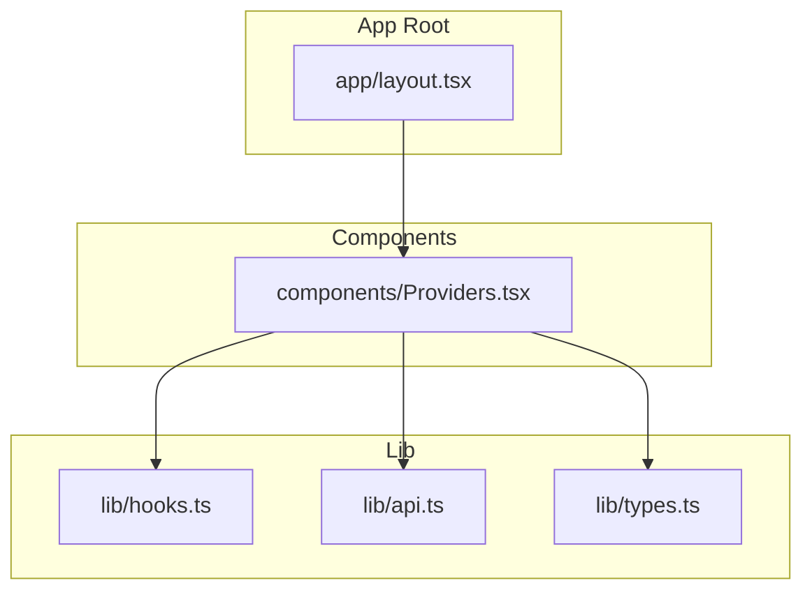
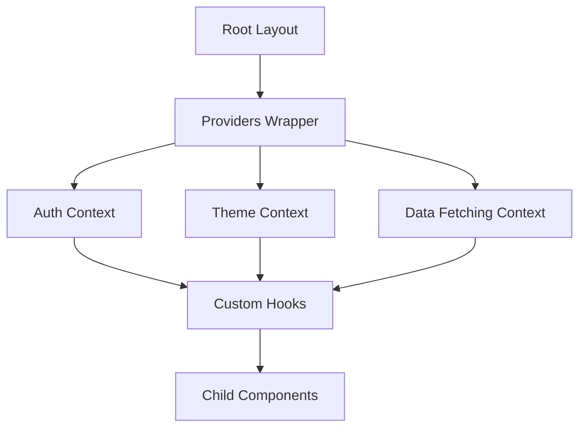
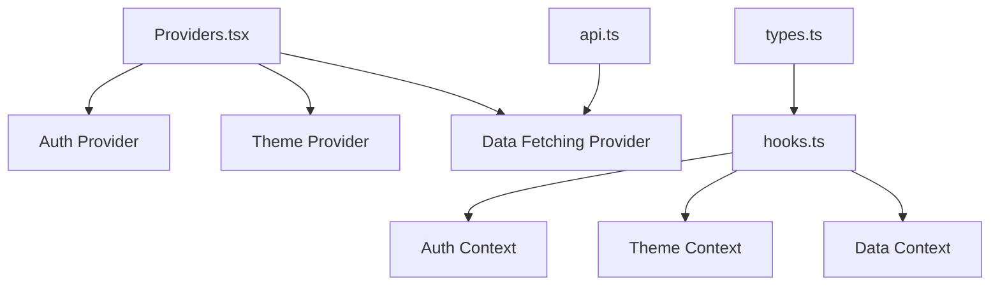

# Providers Component

<cite>
**Referenced Files in This Document**
- [Providers.tsx](file://Frontend/studentbite/components/Providers.tsx)
- [layout.tsx](file://Frontend/studentbite/app/layout.tsx)
- [hooks.ts](file://Frontend/studentbite/lib/hooks.ts)
- [api.ts](file://Frontend/studentbite/lib/api.ts)
- [types.ts](file://Frontend/studentbite/lib/types.ts)
</cite>

## Table of Contents
1. [Introduction](#introduction)
2. [Project Structure](#project-structure)
3. [Core Components](#core-components)
4. [Architecture Overview](#architecture-overview)
5. [Detailed Component Analysis](#detailed-component-analysis)
6. [Dependency Analysis](#dependency-analysis)
7. [Performance Considerations](#performance-considerations)
8. [Troubleshooting Guide](#troubleshooting-guide)
9. [Conclusion](#conclusion)

## Introduction
This document explains the Providers component that wraps the application with global contexts such as authentication, theme, and data fetching. It covers how child components access global state, the prop interfaces used by Providers, and common patterns for consuming context via custom hooks. The goal is to make it easy for both new and experienced developers to understand how global state is structured and consumed across the app.

## Project Structure
The Providers component lives under the Frontend’s components directory and is typically composed at the root layout level to ensure all routes have access to shared contexts. Related utilities like hooks and types are located under lib.

**Diagram sources**
- [layout.tsx](file://Frontend/studentbite/app/layout.tsx)
- [Providers.tsx](file://Frontend/studentbite/components/Providers.tsx)
- [hooks.ts](file://Frontend/studentbite/lib/hooks.ts)
- [api.ts](file://Frontend/studentbite/lib/api.ts)
- [types.ts](file://Frontend/studentbite/lib/types.ts)

**Section sources**
- [layout.tsx](file://Frontend/studentbite/app/layout.tsx)
- [Providers.tsx](file://Frontend/studentbite/components/Providers.tsx)
- [hooks.ts](file://Frontend/studentbite/lib/hooks.ts)
- [api.ts](file://Frontend/studentbite/lib/api.ts)
- [types.ts](file://Frontend/studentbite/lib/types.ts)

## Core Components
- Providers: The top-level wrapper that composes multiple context providers (e.g., auth, theme, data fetching). It accepts props to configure behavior and initializes provider-specific state.
- Custom Hooks: Thin abstractions over contexts that provide typed access to global state and actions.
- Types: Shared TypeScript definitions used across providers and hooks to ensure consistency.

Key responsibilities:
- Compose and order providers correctly to avoid cross-context timing issues.
- Provide default values and error boundaries where appropriate.
- Expose a clean API through hooks for child components.

**Section sources**
- [Providers.tsx](file://Frontend/studentbite/components/Providers.tsx)
- [hooks.ts](file://Frontend/studentbite/lib/hooks.ts)
- [types.ts](file://Frontend/studentbite/lib/types.ts)

## Architecture Overview
The Providers component sits at the root of the React tree and ensures that every page and component has access to shared state and services. Typical layers include:
- Authentication Provider: Manages user session, login/logout, and permissions.
- Theme Provider: Manages UI theme settings and preferences.
- Data Fetching Provider: Centralizes caching, loading states, and error handling for API calls.

**Diagram sources**
- [layout.tsx](file://Frontend/studentbite/app/layout.tsx)
- [Providers.tsx](file://Frontend/studentbite/components/Providers.tsx)
- [hooks.ts](file://Frontend/studentbite/lib/hooks.ts)

## Detailed Component Analysis

### Providers Component
Providers composes multiple context providers and exposes their APIs via custom hooks. It should:
- Initialize each provider with sensible defaults.
- Handle asynchronous initialization (e.g., checking auth status or fetching initial theme).
- Wrap children with necessary error boundaries if required.

Prop interface highlights:
- Configuration flags for enabling/disabling specific providers.
- Initial state overrides for theme or data fetching cache.
- Optional callbacks for lifecycle events (e.g., onAuthChange).

Common usage pattern:
- Render Providers at the app root so all routes inherit contexts.
- Pass minimal configuration; let providers manage internal state.

**Section sources**
- [Providers.tsx](file://Frontend/studentbite/components/Providers.tsx)

### Authentication Context and Hooks
Authentication context typically provides:
- Current user/session state.
- Login, logout, and refresh methods.
- Permission checks and role-based guards.

Custom hook usage:
- Use a dedicated useAuth hook to consume auth state and actions.
- Avoid direct context consumption to maintain type safety and encapsulation.

Typical flow:
- On app start, verify session validity.
- Update UI based on authenticated state.
- Redirect unauthenticated users to login when needed.

**Section sources**
- [hooks.ts](file://Frontend/studentbite/lib/hooks.ts)
- [types.ts](file://Frontend/studentbite/lib/types.ts)

### Theme Context and Hooks
Theme context manages:
- Current theme mode (e.g., light/dark).
- Theme toggling and persistence.
- CSS variables or class names applied to the root element.

Custom hook usage:
- Use a useTheme hook to read and update theme state.
- Ensure theme changes propagate efficiently without unnecessary re-renders.

**Section sources**
- [hooks.ts](file://Frontend/studentbite/lib/hooks.ts)
- [types.ts](file://Frontend/studentbite/lib/types.ts)

### Data Fetching Context and Hooks
Data fetching context centralizes:
- Request/response handling.
- Caching strategies and invalidation.
- Loading and error states.

Custom hook usage:
- Use a useFetch or similar hook to trigger requests and consume results.
- Leverage built-in retry, debounce, or cancellation features as provided.

Typical flow:
- Trigger request via hook.
- Observe loading and error states.
- Access cached data and invalidate when necessary.

**Section sources**
- [api.ts](file://Frontend/studentbite/lib/api.ts)
- [hooks.ts](file://Frontend/studentbite/lib/hooks.ts)
- [types.ts](file://Frontend/studentbite/lib/types.ts)

### Context Consumption Patterns
Recommended patterns:
- Prefer custom hooks over direct context consumption for better typing and encapsulation.
- Keep consumer components small and focused on presentation logic.
- Use memoization to prevent unnecessary re-renders when consuming large context trees.

Example patterns:
- useAuth() returns user state and actions.
- useTheme() returns current theme and toggle function.
- useFetch() returns data, loading, and error states.

**Section sources**
- [hooks.ts](file://Frontend/studentbite/lib/hooks.ts)
- [types.ts](file://Frontend/studentbite/lib/types.ts)

## Dependency Analysis
Providers depends on:
- Authentication provider implementation.
- Theme provider implementation.
- Data fetching provider implementation.
- Shared types and utilities.

Hooks depend on:
- Their respective contexts.
- Utility functions for validation and formatting.

**Diagram sources**
- [Providers.tsx](file://Frontend/studentbite/components/Providers.tsx)
- [hooks.ts](file://Frontend/studentbite/lib/hooks.ts)
- [api.ts](file://Frontend/studentbite/lib/api.ts)
- [types.ts](file://Frontend/studentbite/lib/types.ts)

**Section sources**
- [Providers.tsx](file://Frontend/studentbite/components/Providers.tsx)
- [hooks.ts](file://Frontend/studentbite/lib/hooks.ts)
- [api.ts](file://Frontend/studentbite/lib/api.ts)
- [types.ts](file://Frontend/studentbite/lib/types.ts)

## Performance Considerations
- Minimize context updates by batching state changes.
- Use memoized selectors or derived state to avoid unnecessary re-renders.
- Lazy-load heavy providers if they are not needed immediately.
- Implement proper cleanup for subscriptions and timers within providers.

[No sources needed since this section provides general guidance]

## Troubleshooting Guide
Common issues and resolutions:
- Context not found: Ensure Providers wraps the entire app tree and hooks are called within the correct scope.
- Stale data: Invalidate caches appropriately after mutations or navigation.
- Theme flicker: Initialize theme synchronously or apply a default class early.
- Auth redirects loops: Verify redirect logic and guard conditions.

Debugging tips:
- Log context state changes during development.
- Use React DevTools to inspect provider hierarchies.
- Add error boundaries around critical sections.

**Section sources**
- [hooks.ts](file://Frontend/studentbite/lib/hooks.ts)
- [api.ts](file://Frontend/studentbite/lib/api.ts)

## Conclusion
The Providers component is the backbone of global state management in the application. By composing authentication, theme, and data fetching contexts, it enables consistent access to shared state across components. Using custom hooks ensures type safety, encapsulation, and maintainability. Following the patterns outlined here will help you build robust, scalable features while keeping the codebase organized and performant.

[No sources needed since this section summarizes without analyzing specific files]