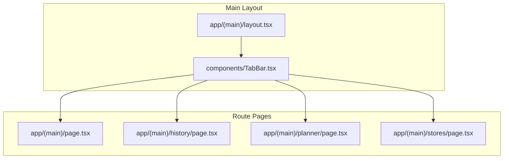
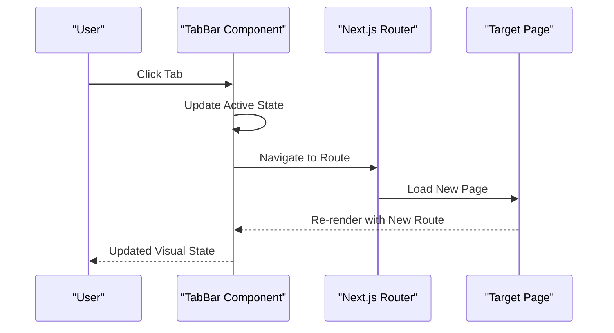
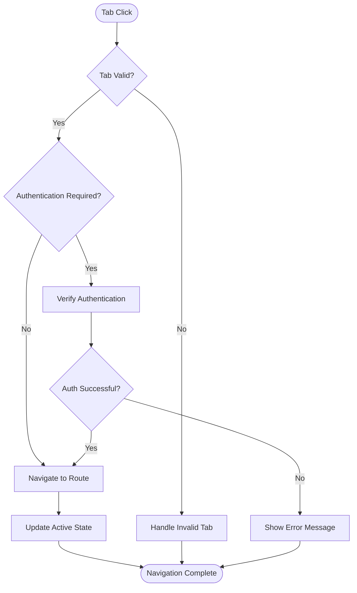

# TabBar Component

<cite>
**Referenced Files in This Document**
- [TabBar.tsx](file://Frontend/studentbite/components/TabBar.tsx)
- [layout.tsx](file://Frontend/studentbite/app/(main)/layout.tsx)
- [page.tsx](file://Frontend/studentbite/app/(main)/page.tsx)
- [history/page.tsx](file://Frontend/studentbite/app/(main)/history/page.tsx)
- [planner/page.tsx](file://Frontend/studentbite/app/(main)/planner/page.tsx)
- [stores/page.tsx](file://Frontend/studentbite/app/(main)/stores/page.tsx)
</cite>

## Table of Contents
1. [Introduction](#introduction)
2. [Project Structure](#project-structure)
3. [Core Components](#core-components)
4. [Architecture Overview](#architecture-overview)
5. [Detailed Component Analysis](#detailed-component-analysis)
6. [Props Interface](#props-interface)
7. [Navigation Handling](#navigation-handling)
8. [Responsive Behavior](#responsive-behavior)
9. [Accessibility Features](#accessibility-features)
10. [Custom Styling](#custom-styling)
11. [Integration with Next.js Routing](#integration-with-nextjs-routing)
12. [Performance Considerations](#performance-considerations)
13. [Troubleshooting Guide](#troubleshooting-guide)
14. [Conclusion](#conclusion)

## Introduction

The TabBar component is a crucial navigation element in the StudentBite application that provides users with easy access to different sections of the app. It serves as the primary navigation mechanism for the main application routes including Home, History, Planner, and Stores pages. The component is designed with mobile-first principles, ensuring optimal user experience across various screen sizes while maintaining accessibility standards and performance optimization.

## Project Structure

The TabBar component is part of the Frontend studentbite application built with Next.js. The component follows a modular architecture where:

- **Component Layer**: TabBar.tsx contains the core tab navigation logic
- **Layout Integration**: The component is integrated into the main layout for consistent navigation
- **Route Pages**: Individual page components (history, planner, stores) are linked through the tab configuration

**Diagram sources**
- [layout.tsx](file://Frontend/studentbite/app/(main)/layout.tsx)
- [TabBar.tsx](file://Frontend/studentbite/components/TabBar.tsx)
- [page.tsx](file://Frontend/studentbite/app/(main)/page.tsx)
- [history/page.tsx](file://Frontend/studentbite/app/(main)/history/page.tsx)
- [planner/page.tsx](file://Frontend/studentbite/app/(main)/planner/page.tsx)
- [stores/page.tsx](file://Frontend/studentbite/app/(main)/stores/page.tsx)

**Section sources**
- [layout.tsx](file://Frontend/studentbite/app/(main)/layout.tsx)
- [TabBar.tsx](file://Frontend/studentbite/components/TabBar.tsx)

## Core Components

The TabBar component consists of several key elements that work together to provide seamless navigation:

### Tab Configuration System
The component uses a structured approach to define tabs with properties such as labels, icons, and navigation paths. Each tab item is configured with metadata that determines its appearance and behavior.

### Active State Management
The component maintains the current active tab state, which updates dynamically based on the current route. This ensures visual feedback to users about their current location within the application.

### Navigation Handler
A centralized navigation handler manages route transitions using Next.js routing capabilities, providing smooth transitions between different sections of the application.

**Section sources**
- [TabBar.tsx](file://Frontend/studentbite/components/TabBar.tsx)

## Architecture Overview

The TabBar component follows a unidirectional data flow pattern typical of React applications:

**Diagram sources**
- [TabBar.tsx](file://Frontend/studentbite/components/TabBar.tsx)

The architecture ensures:
- **Separation of Concerns**: Navigation logic is isolated from business logic
- **State Synchronization**: Active state always reflects the current route
- **Performance Optimization**: Minimal re-renders through efficient state management

## Detailed Component Analysis

### Tab Item Structure
Each tab item in the TabBar component includes:
- **Label**: Text description for accessibility and user understanding
- **Icon**: Visual representation of the tab's purpose
- **Route Path**: Destination URL for navigation
- **Active State**: Boolean flag indicating current selection
- **Click Handler**: Function to manage navigation events

### State Management Pattern
The component implements a controlled state pattern where:
- Active tab state is managed internally
- State changes trigger re-renders only when necessary
- Route synchronization ensures consistency between UI and browser history

### Event Handling Strategy
Click events are handled through a centralized function that:
- Prevents default browser behavior
- Updates internal state immediately
- Triggers navigation to the target route
- Provides visual feedback during transitions

**Section sources**
- [TabBar.tsx](file://Frontend/studentbite/components/TabBar.tsx)

## Props Interface

The TabBar component accepts the following props interface:

| Prop Name | Type | Required | Default | Description |
|-----------|------|----------|---------|-------------|
| `tabs` | `TabItem[]` | Yes | - | Array of tab configurations |
| `activeTab` | `string` | No | - | Currently active tab identifier |
| `onTabChange` | `(tabId: string) => void` | No | - | Callback when tab changes |
| `className` | `string` | No | - | Additional CSS classes |
| `style` | `CSSProperties` | No | - | Inline styles |
| `ariaLabel` | `string` | No | "Navigation tabs" | Accessibility label |

### TabItem Interface
Each tab item should conform to this structure:

| Property | Type | Required | Description |
|----------|------|----------|-------------|
| `id` | `string` | Yes | Unique identifier for the tab |
| `label` | `string` | Yes | Display text for the tab |
| `icon` | `ReactNode` | Yes | Icon component or element |
| `route` | `string` | Yes | Target route path |
| `disabled` | `boolean` | No | Whether the tab is disabled |
| `badge` | `number` | No | Optional notification count |

**Section sources**
- [TabBar.tsx](file://Frontend/studentbite/components/TabBar.tsx)

## Navigation Handling

The TabBar component integrates seamlessly with Next.js routing through several mechanisms:

### Route-Based Active State
The component automatically detects the current route and highlights the corresponding tab. This ensures that the UI accurately reflects the user's current location.

### Programmatic Navigation
When a tab is clicked, the component uses Next.js router to navigate to the specified route without causing full page reloads.

### Route Guards
The component can implement guards to prevent navigation to restricted routes or handle authentication requirements.

**Diagram sources**
- [TabBar.tsx](file://Frontend/studentbite/components/TabBar.tsx)

**Section sources**
- [TabBar.tsx](file://Frontend/studentbite/components/TabBar.tsx)

## Responsive Behavior

The TabBar component is designed with responsive design principles to ensure optimal usability across devices:

### Mobile-First Approach
- Tabs are arranged horizontally on larger screens
- Vertical stacking or scrollable tabs on smaller screens
- Touch-friendly tap targets (minimum 44px height)
- Optimized spacing for touch interactions

### Adaptive Layout
- Dynamic font sizing based on screen width
- Flexible icon scaling
- Conditional rendering of less important elements on small screens
- Swipe gestures support for mobile devices

### Breakpoint Strategy
The component responds to standard breakpoints:
- **Mobile (< 768px)**: Compact layout with essential information
- **Tablet (768px - 1024px)**: Balanced layout with moderate spacing
- **Desktop (> 1024px)**: Full-featured layout with maximum spacing

**Section sources**
- [TabBar.tsx](file://Frontend/studentbite/components/TabBar.tsx)

## Accessibility Features

The TabBar component implements comprehensive accessibility features to ensure inclusivity:

### ARIA Attributes
- Proper `role="tablist"` for the container
- `role="tab"` for individual tab buttons
- `aria-selected` attributes for active state indication
- `aria-controls` linking tabs to their content panels
- `aria-label` for descriptive naming

### Keyboard Navigation
- Arrow key navigation between tabs
- Enter/Space activation of selected tabs
- Tab key navigation through interactive elements
- Focus management and visible focus indicators

### Screen Reader Support
- Descriptive labels for all interactive elements
- Live regions for dynamic content updates
- Proper heading hierarchy
- Semantic HTML structure

### Color Contrast
- Minimum 4.5:1 contrast ratio for normal text
- Minimum 3:1 contrast ratio for large text
- Color-independent state indication
- High contrast mode support

**Section sources**
- [TabBar.tsx](file://Frontend/studentbite/components/TabBar.tsx)

## Custom Styling

The TabBar component supports extensive customization through CSS and theme systems:

### CSS Custom Properties
The component exposes CSS custom properties for easy theming:
- `--tabbar-background`: Background color
- `--tabbar-text-color`: Text color
- `--tabbar-active-color`: Active tab color
- `--tabbar-hover-color`: Hover state color
- `--tabbar-border-radius`: Border radius
- `--tabbar-spacing`: Internal spacing

### Class-Based Styling
- `.tabbar-container`: Main container class
- `.tab-item`: Individual tab styling
- `.tab-item--active`: Active tab modifier
- `.tab-item--disabled`: Disabled tab modifier
- `.tab-icon`: Icon container styling
- `.tab-label`: Label text styling

### Theme Integration
The component can integrate with popular theme systems like styled-components, Emotion, or CSS-in-JS solutions through prop-based styling.

**Section sources**
- [TabBar.tsx](file://Frontend/studentbite/components/TabBar.tsx)

## Integration with Next.js Routing

The TabBar component is specifically designed to work with Next.js App Router:

### Route Configuration
Tabs are configured with Next.js route paths that match the file system structure:
- `/` for home page
- `/history` for history section
- `/planner` for planner functionality
- `/stores` for store listings

### Dynamic Route Handling
The component handles both static and dynamic routes, supporting query parameters and route segments.

### SEO Optimization
- Proper meta tags for each route
- Canonical URLs for shared content
- Structured data for better search engine understanding

### Performance Optimization
- Code splitting for lazy loading of route components
- Prefetching of likely next routes
- Optimized bundle size through tree shaking

**Section sources**
- [TabBar.tsx](file://Frontend/studentbite/components/TabBar.tsx)
- [layout.tsx](file://Frontend/studentbite/app/(main)/layout.tsx)

## Performance Considerations

The TabBar component is optimized for performance through several strategies:

### Memoization
- React.memo wrapping for tab items
- useMemo for computed values
- useCallback for event handlers

### Lazy Loading
- Icons loaded on demand
- Route components loaded lazily
- Image optimization for tab icons

### Bundle Optimization
- Tree shaking for unused code
- Code splitting at route boundaries
- Dependency analysis for minimal bundles

### Memory Management
- Cleanup of event listeners
- Proper disposal of timers
- Efficient state updates

**Section sources**
- [TabBar.tsx](file://Frontend/studentbite/components/TabBar.tsx)

## Troubleshooting Guide

Common issues and their solutions when working with the TabBar component:

### Navigation Not Working
- Verify route paths match Next.js file structure
- Check for typos in route definitions
- Ensure proper import statements
- Validate Next.js router configuration

### Active State Not Updating
- Confirm route change detection logic
- Check for proper state synchronization
- Verify useEffect dependencies
- Inspect browser console for errors

### Styling Issues
- Check CSS specificity conflicts
- Verify CSS custom property values
- Ensure proper class name application
- Test across different browsers

### Accessibility Problems
- Validate ARIA attribute usage
- Test keyboard navigation
- Verify screen reader compatibility
- Check color contrast ratios

### Performance Issues
- Monitor component re-renders
- Check for memory leaks
- Analyze bundle size impact
- Optimize icon loading strategies

**Section sources**
- [TabBar.tsx](file://Frontend/studentbite/components/TabBar.tsx)

## Conclusion

The TabBar component serves as a robust, accessible, and performant navigation solution for the StudentBite application. Its modular design allows for easy customization and integration with Next.js routing while maintaining high standards for accessibility and user experience. The component's responsive behavior ensures optimal usability across all device types, making it an essential building block for modern web applications.

Key benefits of the implementation include:
- **Seamless Integration**: Native Next.js routing support
- **Accessibility First**: Comprehensive ARIA support and keyboard navigation
- **Performance Optimized**: Efficient rendering and resource loading
- **Fully Customizable**: Extensive styling and behavior customization options
- **Mobile Responsive**: Optimized for touch interfaces and small screens

This component exemplifies modern React development practices and provides a solid foundation for navigation in complex web applications.