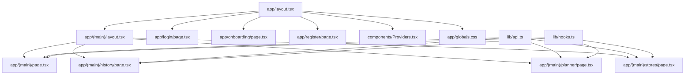
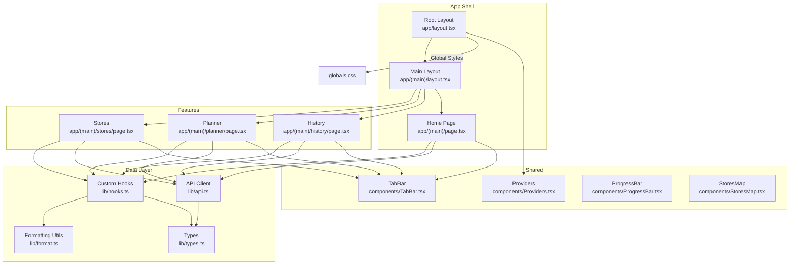
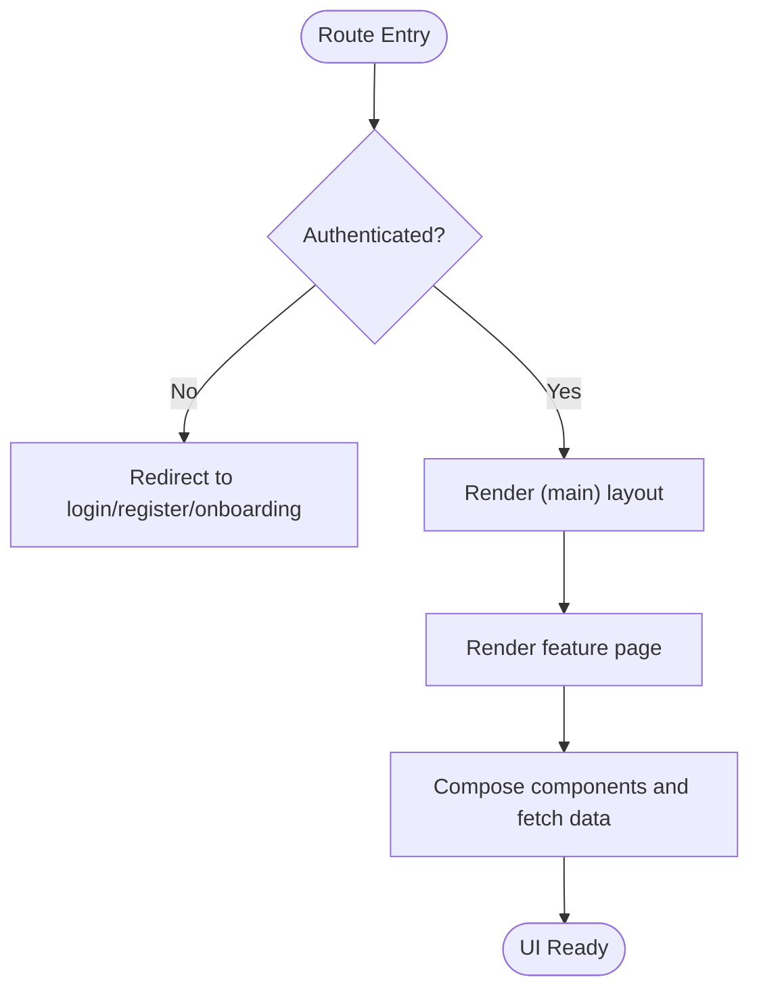
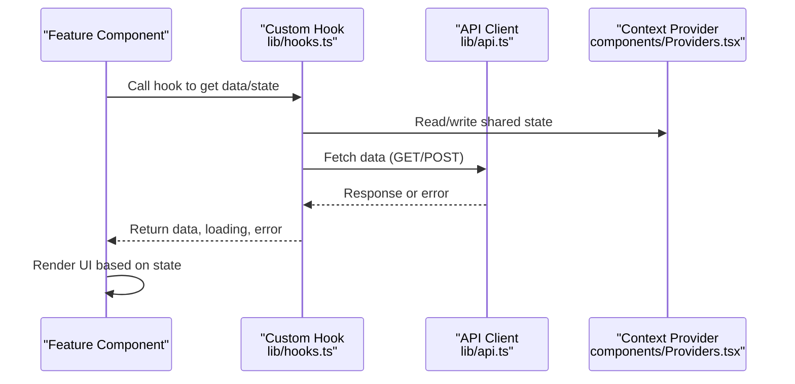
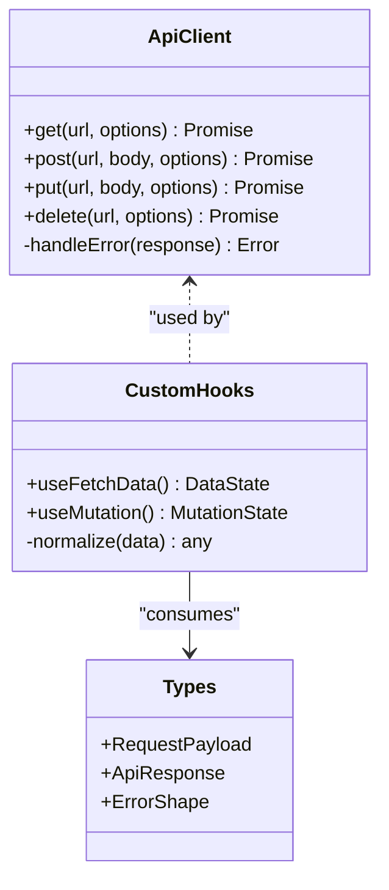
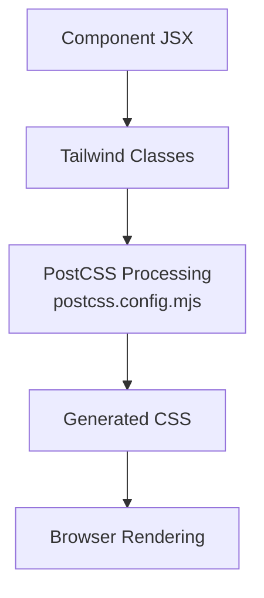
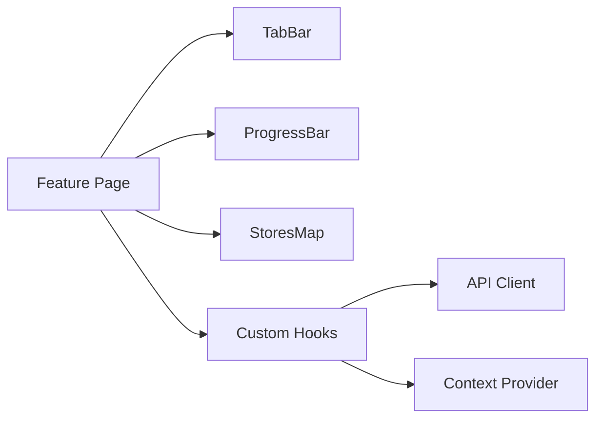
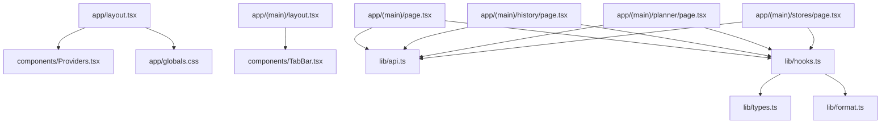

# Frontend Architecture

<cite>
**Referenced Files in This Document**
- [layout.tsx](file://Frontend/studentbite/app/layout.tsx)
- [page.tsx](file://Frontend/studentbite/app/(main)/page.tsx)
- [layout.tsx](file://Frontend/studentbite/app/(main)/layout.tsx)
- [page.tsx](file://Frontend/studentbite/app/(main)/history/page.tsx)
- [page.tsx](file://Frontend/studentbite/app/(main)/planner/page.tsx)
- [page.tsx](file://Frontend/studentbite/app/(main)/stores/page.tsx)
- [page.tsx](file://Frontend/studentbite/app/login/page.tsx)
- [page.tsx](file://Frontend/studentbite/app/onboarding/page.tsx)
- [page.tsx](file://Frontend/studentbite/app/register/page.tsx)
- [globals.css](file://Frontend/studentbite/app/globals.css)
- [Providers.tsx](file://Frontend/studentbite/components/Providers.tsx)
- [TabBar.tsx](file://Frontend/studentbite/components/TabBar.tsx)
- [ProgressBar.tsx](file://Frontend/studentbite/components/ProgressBar.tsx)
- [StoresMap.tsx](file://Frontend/studentbite/components/StoresMap.tsx)
- [api.ts](file://Frontend/studentbite/lib/api.ts)
- [hooks.ts](file://Frontend/studentbite/lib/hooks.ts)
- [format.ts](file://Frontend/studentbite/lib/format.ts)
- [types.ts](file://Frontend/studentbite/lib/types.ts)
- [next.config.ts](file://Frontend/studentbite/next.config.ts)
- [postcss.config.mjs](file://Frontend/studentbite/postcss.config.mjs)
</cite>

## Table of Contents
1. Introduction
2. Project Structure
3. Core Components
4. Architecture Overview
5. Detailed Component Analysis
6. Dependency Analysis
7. Performance Considerations
8. Troubleshooting Guide
9. Conclusion

## Introduction
This document describes the frontend architecture of the Next.js application located under Frontend/studentbite. It explains the App Router structure, component hierarchy, state management using React Context and custom hooks, API client implementation, routing strategy, component composition patterns, styling with Tailwind CSS, responsive design, and performance optimizations. It also includes examples of component usage, data fetching strategies, and error handling patterns.

## Project Structure
The project follows the Next.js App Router convention:
- app/: Route segments and layouts
  - (main)/: Grouped routes for authenticated sections
    - layout.tsx: Shared shell for main features
    - page.tsx: Home/dashboard entry
    - history/page.tsx: History feature
    - planner/page.tsx: Planner feature
    - stores/page.tsx: Stores feature
  - login/page.tsx: Login flow
  - onboarding/page.tsx: Onboarding flow
  - register/page.tsx: Registration flow
  - layout.tsx: Root layout with global providers and styles
  - globals.css: Global styles and Tailwind directives
- components/: Reusable UI components
- lib/: Utilities, types, hooks, and API client
- next.config.ts: Next.js configuration
- postcss.config.mjs: PostCSS/Tailwind configuration

**Diagram sources**
- [layout.tsx](file://Frontend/studentbite/app/layout.tsx)
- [layout.tsx](file://Frontend/studentbite/app/(main)/layout.tsx)
- [page.tsx](file://Frontend/studentbite/app/(main)/page.tsx)
- [page.tsx](file://Frontend/studentbite/app/(main)/history/page.tsx)
- [page.tsx](file://Frontend/studentbite/app/(main)/planner/page.tsx)
- [page.tsx](file://Frontend/studentbite/app/(main)/stores/page.tsx)
- [page.tsx](file://Frontend/studentbite/app/login/page.tsx)
- [page.tsx](file://Frontend/studentbite/app/onboarding/page.tsx)
- [page.tsx](file://Frontend/studentbite/app/register/page.tsx)
- [globals.css](file://Frontend/studentbite/app/globals.css)
- [Providers.tsx](file://Frontend/studentbite/components/Providers.tsx)
- [api.ts](file://Frontend/studentbite/lib/api.ts)
- [hooks.ts](file://Frontend/studentbite/lib/hooks.ts)

**Section sources**
- [layout.tsx](file://Frontend/studentbite/app/layout.tsx)
- [layout.tsx](file://Frontend/studentbite/app/(main)/layout.tsx)
- [page.tsx](file://Frontend/studentbite/app/(main)/page.tsx)
- [page.tsx](file://Frontend/studentbite/app/(main)/history/page.tsx)
- [page.tsx](file://Frontend/studentbite/app/(main)/planner/page.tsx)
- [page.tsx](file://Frontend/studentbite/app/(main)/stores/page.tsx)
- [page.tsx](file://Frontend/studentbite/app/login/page.tsx)
- [page.tsx](file://Frontend/studentbite/app/onboarding/page.tsx)
- [page.tsx](file://Frontend/studentbite/app/register/page.tsx)
- [globals.css](file://Frontend/studentbite/app/globals.css)

## Core Components
- Providers.tsx: Centralized context provider(s) wrapping the app to share global state and services across components.
- TabBar.tsx: Bottom navigation/tab bar used within the main shell for quick navigation between features.
- ProgressBar.tsx: Visual progress indicator used during loading or multi-step flows.
- StoresMap.tsx: Map-based visualization for store locations and related data.

These components are composed by route pages and shared layouts to build feature screens. They rely on Tailwind CSS classes for styling and may consume context from Providers.tsx via custom hooks in lib/hooks.ts.

**Section sources**
- [Providers.tsx](file://Frontend/studentbite/components/Providers.tsx)
- [TabBar.tsx](file://Frontend/studentbite/components/TabBar.tsx)
- [ProgressBar.tsx](file://Frontend/studentbite/components/ProgressBar.tsx)
- [StoresMap.tsx](file://Frontend/studentbite/components/StoresMap.tsx)

## Architecture Overview
The application uses the Next.js App Router for file-based routing and server-side rendering where applicable. The root layout sets up global providers and styles, while the (main) group provides a consistent shell for authenticated routes. Feature pages encapsulate business logic and compose reusable components. Data is fetched through a centralized API client and consumed via custom hooks that manage loading and error states.

**Diagram sources**
- [layout.tsx](file://Frontend/studentbite/app/layout.tsx)
- [layout.tsx](file://Frontend/studentbite/app/(main)/layout.tsx)
- [page.tsx](file://Frontend/studentbite/app/(main)/page.tsx)
- [page.tsx](file://Frontend/studentbite/app/(main)/history/page.tsx)
- [page.tsx](file://Frontend/studentbite/app/(main)/planner/page.tsx)
- [page.tsx](file://Frontend/studentbite/app/(main)/stores/page.tsx)
- [Providers.tsx](file://Frontend/studentbite/components/Providers.tsx)
- [TabBar.tsx](file://Frontend/studentbite/components/TabBar.tsx)
- [ProgressBar.tsx](file://Frontend/studentbite/components/ProgressBar.tsx)
- [StoresMap.tsx](file://Frontend/studentbite/components/StoresMap.tsx)
- [api.ts](file://Frontend/studentbite/lib/api.ts)
- [hooks.ts](file://Frontend/studentbite/lib/hooks.ts)
- [format.ts](file://Frontend/studentbite/lib/format.ts)
- [types.ts](file://Frontend/studentbite/lib/types.ts)
- [globals.css](file://Frontend/studentbite/app/globals.css)

## Detailed Component Analysis

### App Router and Routing Strategy
- Root layout establishes global providers and imports global styles.
- (main) group defines a shared layout for authenticated routes, including a tab bar and content area.
- Feature pages implement specific functionality and compose shared components.
- Authentication-related pages (login, register, onboarding) sit at the top level for easy access.

**Section sources**
- [layout.tsx](file://Frontend/studentbite/app/layout.tsx)
- [layout.tsx](file://Frontend/studentbite/app/(main)/layout.tsx)
- [page.tsx](file://Frontend/studentbite/app/(main)/page.tsx)
- [page.tsx](file://Frontend/studentbite/app/(main)/history/page.tsx)
- [page.tsx](file://Frontend/studentbite/app/(main)/planner/page.tsx)
- [page.tsx](file://Frontend/studentbite/app/(main)/stores/page.tsx)
- [page.tsx](file://Frontend/studentbite/app/login/page.tsx)
- [page.tsx](file://Frontend/studentbite/app/onboarding/page.tsx)
- [page.tsx](file://Frontend/studentbite/app/register/page.tsx)

### State Management with React Context and Custom Hooks
- Providers.tsx wraps the application with context providers to share global state and services.
- Custom hooks in lib/hooks.ts encapsulate stateful logic, data fetching, and side effects, exposing typed APIs to components.
- Components consume context via these hooks to avoid prop drilling and keep logic cohesive.

**Diagram sources**
- [Providers.tsx](file://Frontend/studentbite/components/Providers.tsx)
- [hooks.ts](file://Frontend/studentbite/lib/hooks.ts)
- [api.ts](file://Frontend/studentbite/lib/api.ts)

**Section sources**
- [Providers.tsx](file://Frontend/studentbite/components/Providers.tsx)
- [hooks.ts](file://Frontend/studentbite/lib/hooks.ts)

### API Client Implementation
- lib/api.ts centralizes HTTP requests, base URLs, headers, and error normalization.
- Custom hooks call the API client and handle loading/error states consistently.
- Types in lib/types.ts define request/response shapes for strong typing.

**Diagram sources**
- [api.ts](file://Frontend/studentbite/lib/api.ts)
- [hooks.ts](file://Frontend/studentbite/lib/hooks.ts)
- [types.ts](file://Frontend/studentbite/lib/types.ts)

**Section sources**
- [api.ts](file://Frontend/studentbite/lib/api.ts)
- [hooks.ts](file://Frontend/studentbite/lib/hooks.ts)
- [types.ts](file://Frontend/studentbite/lib/types.ts)

### Styling System with Tailwind CSS
- Tailwind CSS is configured via postcss.config.mjs and applied through app/globals.css.
- Utility-first classes are used throughout components for consistent, responsive design.
- Global styles and theme tokens can be extended in globals.css.

**Diagram sources**
- [postcss.config.mjs](file://Frontend/studentbite/postcss.config.mjs)
- [globals.css](file://Frontend/studentbite/app/globals.css)

**Section sources**
- [postcss.config.mjs](file://Frontend/studentbite/postcss.config.mjs)
- [globals.css](file://Frontend/studentbite/app/globals.css)

### Responsive Design Patterns
- Use Tailwind’s responsive prefixes (sm:, md:, lg:) to adapt layouts across devices.
- Flexible grids and spacing utilities ensure consistent alignment and readability.
- Mobile-first approach prioritizes small-screen experiences and progressively enhances for larger screens.

[No sources needed since this section provides general guidance]

### Performance Optimizations
- Leverage Next.js App Router benefits like code splitting, static generation, and streaming where applicable.
- Minimize re-renders by memoizing expensive computations and using stable references in contexts.
- Defer non-critical operations and use skeleton loaders for perceived performance improvements.

[No sources needed since this section provides general guidance]

### Component Composition Patterns
- Feature pages compose shared components (TabBar, ProgressBar, StoresMap) to assemble screens.
- Providers wrap the app to supply global state and services without prop drilling.
- Custom hooks abstract complex logic and expose simple interfaces to components.

**Diagram sources**
- [page.tsx](file://Frontend/studentbite/app/(main)/page.tsx)
- [TabBar.tsx](file://Frontend/studentbite/components/TabBar.tsx)
- [ProgressBar.tsx](file://Frontend/studentbite/components/ProgressBar.tsx)
- [StoresMap.tsx](file://Frontend/studentbite/components/StoresMap.tsx)
- [hooks.ts](file://Frontend/studentbite/lib/hooks.ts)
- [api.ts](file://Frontend/studentbite/lib/api.ts)
- [Providers.tsx](file://Frontend/studentbite/components/Providers.tsx)

**Section sources**
- [page.tsx](file://Frontend/studentbite/app/(main)/page.tsx)
- [TabBar.tsx](file://Frontend/studentbite/components/TabBar.tsx)
- [ProgressBar.tsx](file://Frontend/studentbite/components/ProgressBar.tsx)
- [StoresMap.tsx](file://Frontend/studentbite/components/StoresMap.tsx)
- [hooks.ts](file://Frontend/studentbite/lib/hooks.ts)
- [api.ts](file://Frontend/studentbite/lib/api.ts)
- [Providers.tsx](file://Frontend/studentbite/components/Providers.tsx)

## Dependency Analysis
The following diagram shows how core modules depend on each other:

**Diagram sources**
- [layout.tsx](file://Frontend/studentbite/app/layout.tsx)
- [Providers.tsx](file://Frontend/studentbite/components/Providers.tsx)
- [globals.css](file://Frontend/studentbite/app/globals.css)
- [layout.tsx](file://Frontend/studentbite/app/(main)/layout.tsx)
- [TabBar.tsx](file://Frontend/studentbite/components/TabBar.tsx)
- [page.tsx](file://Frontend/studentbite/app/(main)/page.tsx)
- [api.ts](file://Frontend/studentbite/lib/api.ts)
- [hooks.ts](file://Frontend/studentbite/lib/hooks.ts)
- [page.tsx](file://Frontend/studentbite/app/(main)/history/page.tsx)
- [page.tsx](file://Frontend/studentbite/app/(main)/planner/page.tsx)
- [page.tsx](file://Frontend/studentbite/app/(main)/stores/page.tsx)
- [types.ts](file://Frontend/studentbite/lib/types.ts)
- [format.ts](file://Frontend/studentbite/lib/format.ts)

**Section sources**
- [layout.tsx](file://Frontend/studentbite/app/layout.tsx)
- [Providers.tsx](file://Frontend/studentbite/components/Providers.tsx)
- [globals.css](file://Frontend/studentbite/app/globals.css)
- [layout.tsx](file://Frontend/studentbite/app/(main)/layout.tsx)
- [TabBar.tsx](file://Frontend/studentbite/components/TabBar.tsx)
- [page.tsx](file://Frontend/studentbite/app/(main)/page.tsx)
- [api.ts](file://Frontend/studentbite/lib/api.ts)
- [hooks.ts](file://Frontend/studentbite/lib/hooks.ts)
- [page.tsx](file://Frontend/studentbite/app/(main)/history/page.tsx)
- [page.tsx](file://Frontend/studentbite/app/(main)/planner/page.tsx)
- [page.tsx](file://Frontend/studentbite/app/(main)/stores/page.tsx)
- [types.ts](file://Frontend/studentbite/lib/types.ts)
- [format.ts](file://Frontend/studentbite/lib/format.ts)

## Performance Considerations
- Prefer server-side rendering and static generation where possible to reduce client workload.
- Use lazy loading for heavy components and defer non-critical scripts.
- Optimize images and assets; leverage Next.js built-in image optimization.
- Keep context updates minimal and avoid unnecessary re-renders by memoization and stable references.

[No sources needed since this section provides general guidance]

## Troubleshooting Guide
Common issues and resolutions:
- Network errors: Ensure the API client handles HTTP status codes and returns normalized errors to hooks and components.
- Loading states: Verify that hooks expose loading flags and that components render skeletons or spinners appropriately.
- Styling conflicts: Confirm Tailwind directives are present in globals.css and that PostCSS is configured correctly.
- Routing problems: Validate route files exist under app/ and that grouped routes are properly defined.

**Section sources**
- [api.ts](file://Frontend/studentbite/lib/api.ts)
- [hooks.ts](file://Frontend/studentbite/lib/hooks.ts)
- [globals.css](file://Frontend/studentbite/app/globals.css)
- [postcss.config.mjs](file://Frontend/studentbite/postcss.config.mjs)

## Conclusion
The Next.js frontend leverages the App Router for structured routing, React Context and custom hooks for scalable state management, and Tailwind CSS for efficient styling. The centralized API client and typed models ensure consistent data handling across features. By composing reusable components and following responsive, performance-oriented practices, the application delivers a maintainable and user-friendly experience.

[No sources needed since this section summarizes without analyzing specific files]