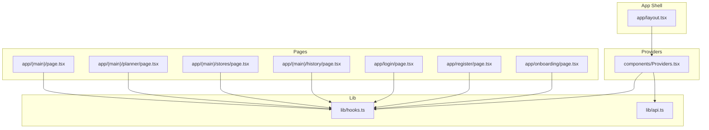
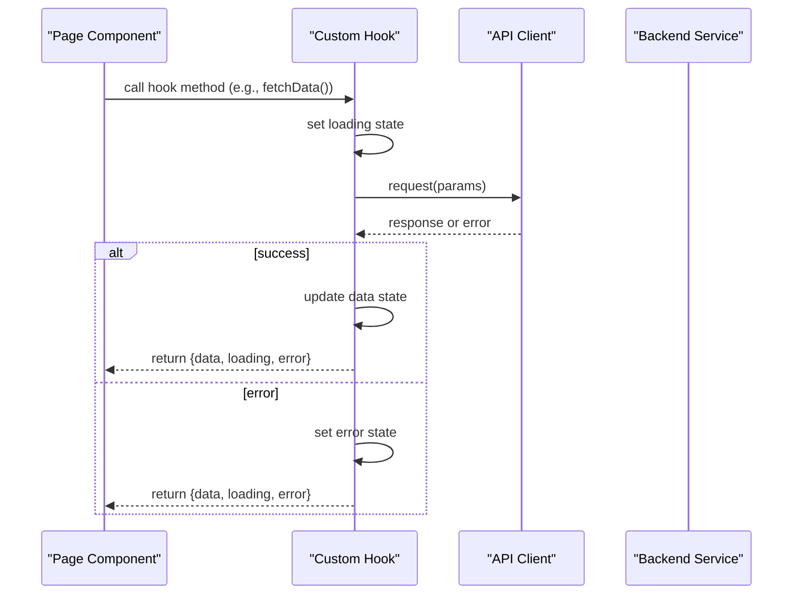
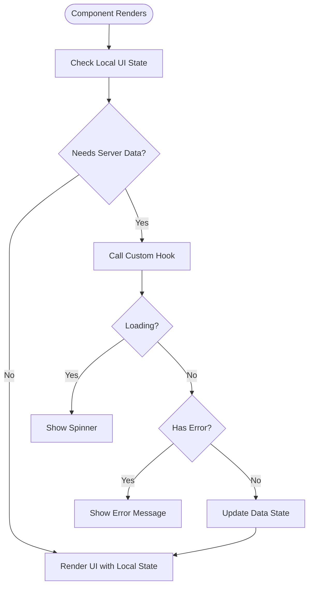
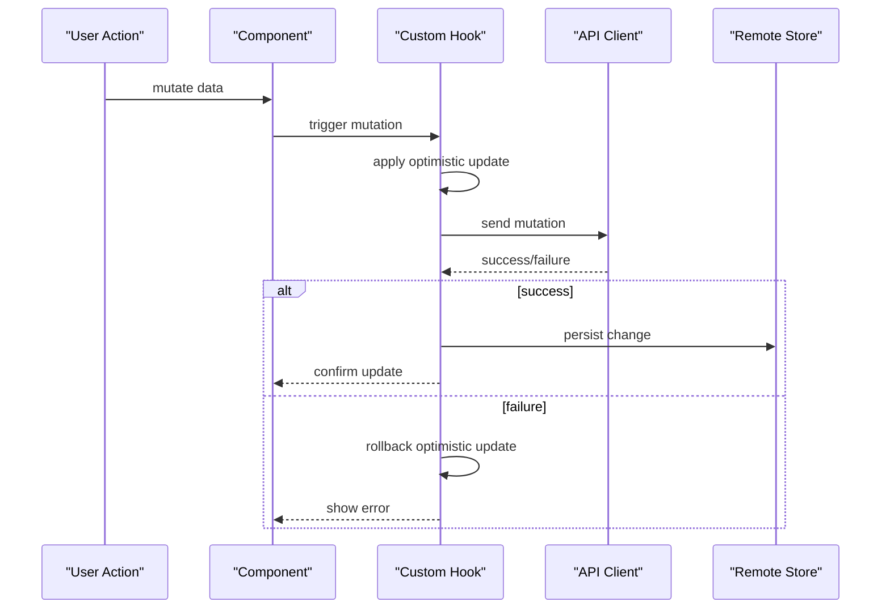
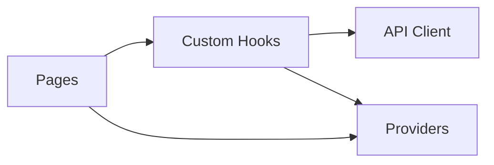

# State Management

<cite>
**Referenced Files in This Document**
- [Providers.tsx](file://Frontend/studentbite/components/Providers.tsx)
- [hooks.ts](file://Frontend/studentbite/lib/hooks.ts)
- [api.ts](file://Frontend/studentbite/lib/api.ts)
- [layout.tsx](file://Frontend/studentbite/app/layout.tsx)
- [page.tsx](file://Frontend/studentbite/app/(main)/page.tsx)
- [planner/page.tsx](file://Frontend/studentbite/app/(main)/planner/page.tsx)
- [stores/page.tsx](file://Frontend/studentbite/app/(main)/stores/page.tsx)
- [history/page.tsx](file://Frontend/studentbite/app/(main)/history/page.tsx)
- [login/page.tsx](file://Frontend/studentbite/app/login/page.tsx)
- [register/page.tsx](file://Frontend/studentbite/app/register/page.tsx)
- [onboarding/page.tsx](file://Frontend/studentbite/app/onboarding/page.tsx)
</cite>

## Table of Contents
1. Introduction
2. Project Structure
3. Core Components
4. Architecture Overview
5. Detailed Component Analysis
6. Dependency Analysis
7. Performance Considerations
8. Troubleshooting Guide
9. Conclusion

## Introduction
This document explains the state management approach used in the application, focusing on custom hooks, React Context usage, and local state patterns. It covers data flow between components, persistence strategies, performance considerations, async state handling, error boundaries, and synchronization patterns. The goal is to make the state model clear for both new contributors and maintainers.

## Project Structure
The frontend follows a Next.js App Router layout with shared providers and utilities:
- Providers are centralized in a single component to wrap the app with global context and services.
- Custom hooks encapsulate reusable logic for fetching, caching, and syncing state.
- API calls are abstracted behind a typed client for consistency and testability.
- Pages use local state for UI concerns and lift state up when needed for cross-component sharing.

**Diagram sources**
- [layout.tsx](file://Frontend/studentbite/app/layout.tsx)
- [Providers.tsx](file://Frontend/studentbite/components/Providers.tsx)
- [hooks.ts](file://Frontend/studentbite/lib/hooks.ts)
- [api.ts](file://Frontend/studentbite/lib/api.ts)
- [page.tsx](file://Frontend/studentbite/app/(main)/page.tsx)
- [planner/page.tsx](file://Frontend/studentbite/app/(main)/planner/page.tsx)
- [stores/page.tsx](file://Frontend/studentbite/app/(main)/stores/page.tsx)
- [history/page.tsx](file://Frontend/studentbite/app/(main)/history/page.tsx)
- [login/page.tsx](file://Frontend/studentbite/app/login/page.tsx)
- [register/page.tsx](file://Frontend/studentbite/app/register/page.tsx)
- [onboarding/page.tsx](file://Frontend/studentbite/app/onboarding/page.tsx)

**Section sources**
- [layout.tsx](file://Frontend/studentbite/app/layout.tsx)
- [Providers.tsx](file://Frontend/studentbite/components/Providers.tsx)
- [hooks.ts](file://Frontend/studentbite/lib/hooks.ts)
- [api.ts](file://Frontend/studentbite/lib/api.ts)

## Core Components
- Providers: Centralizes global context and any required services or configuration for the app.
- Custom Hooks: Encapsulate data fetching, caching, retries, and side effects; expose a stable interface to components.
- API Client: Provides typed methods for backend communication, centralizing error handling and request/response transformations.
- Page Components: Use local state for UI interactions and compose custom hooks to manage server state.

Key responsibilities:
- Global state via React Context (e.g., user session, theme, feature flags).
- Server state via custom hooks that handle loading, success, and error states.
- Local UI state within components using standard React state patterns.

**Section sources**
- [Providers.tsx](file://Frontend/studentbite/components/Providers.tsx)
- [hooks.ts](file://Frontend/studentbite/lib/hooks.ts)
- [api.ts](file://Frontend/studentbite/lib/api.ts)

## Architecture Overview
The state architecture separates concerns into layers:
- Presentation layer (pages and components) holds minimal UI state.
- Business logic and data access live in custom hooks.
- Network requests go through a centralized API client.
- Global context provides cross-cutting concerns like authentication and preferences.

**Diagram sources**
- [hooks.ts](file://Frontend/studentbite/lib/hooks.ts)
- [api.ts](file://Frontend/studentbite/lib/api.ts)

## Detailed Component Analysis

### Providers and Global Context
- Purpose: Provide global state and services to all components under the provider tree.
- Typical contents: Authentication context, theme settings, language/locale, and any app-wide configuration.
- Usage pattern: Wrap the root layout with the provider to ensure availability across pages.

Best practices:
- Keep context values immutable where possible; prefer updater functions over raw objects.
- Split large contexts into focused ones to reduce unnecessary re-renders.
- Initialize defaults safely to avoid null checks in consumers.

**Section sources**
- [Providers.tsx](file://Frontend/studentbite/components/Providers.tsx)
- [layout.tsx](file://Frontend/studentbite/app/layout.tsx)

### Custom Hooks for Async State Handling
- Responsibilities:
  - Manage loading, success, and error states consistently.
  - Handle retries, cancellation, and debouncing/throttling where appropriate.
  - Normalize responses and map errors to user-friendly messages.
- Patterns:
  - Fetch-on-mount with optional manual triggers.
  - Cache invalidation based on dependencies.
  - Optimistic updates with rollback on failure.

Example flows:
- Data fetching lifecycle: initialize -> loading -> success/error -> retry.
- Mutation lifecycle: start mutation -> optimistic update -> commit/rollback -> final state.

Performance tips:
- Memoize expensive computations derived from state.
- Avoid creating new objects/functions on every render; stabilize references.
- Use selectors or derived state to minimize re-renders.

**Section sources**
- [hooks.ts](file://Frontend/studentbite/lib/hooks.ts)
- [api.ts](file://Frontend/studentbite/lib/api.ts)

### API Client and Error Handling
- Centralizes HTTP requests, headers, base URLs, and error normalization.
- Provides typed methods for each domain endpoint.
- Handles network failures, timeouts, and non-2xx responses uniformly.

Error boundary integration:
- Catch unhandled promise rejections at the page level when necessary.
- Surface user-facing errors via toast or inline feedback.

**Section sources**
- [api.ts](file://Frontend/studentbite/lib/api.ts)

### Page-Level State Patterns
- Local state for form inputs, toggles, pagination, and filters.
- Lift state up only when multiple siblings need shared state.
- Compose custom hooks to keep pages lean and declarative.

Common patterns:
- Controlled forms with validation hooks.
- Debounced search input tied to API queries.
- Conditional rendering based on loading and error states.

**Section sources**
- [page.tsx](file://Frontend/studentbite/app/(main)/page.tsx)
- [planner/page.tsx](file://Frontend/studentbite/app/(main)/planner/page.tsx)
- [stores/page.tsx](file://Frontend/studentbite/app/(main)/stores/page.tsx)
- [history/page.tsx](file://Frontend/studentbite/app/(main)/history/page.tsx)
- [login/page.tsx](file://Frontend/studentbite/app/login/page.tsx)
- [register/page.tsx](file://Frontend/studentbite/app/register/page.tsx)
- [onboarding/page.tsx](file://Frontend/studentbite/app/onboarding/page.tsx)

### Data Flow Between Components
- One-way data flow: props down, events up.
- Shared server state via custom hooks; local UI state remains scoped to components.
- Global context for cross-cutting concerns; avoid putting heavy per-page state there.

**Diagram sources**
- [hooks.ts](file://Frontend/studentbite/lib/hooks.ts)

### State Persistence Strategies
- Session storage for transient app state (e.g., draft forms).
- Local storage for user preferences and lightweight settings.
- Cookies or tokens for authentication managed by the API client.
- Syncing persisted values with React state on mount and changes.

Guidelines:
- Serialize/deserialize carefully; handle versioning for schema changes.
- Debounce writes to avoid excessive I/O.
- Validate persisted data before applying to state.

**Section sources**
- [hooks.ts](file://Frontend/studentbite/lib/hooks.ts)
- [api.ts](file://Frontend/studentbite/lib/api.ts)

### Synchronization Patterns
- Bi-directional sync between local and remote state:
  - Optimistic updates for immediate feedback.
  - Rollback on failure; reconcile conflicts on success.
- Event-driven updates:
  - Invalidate caches on mutations.
  - Listen for real-time events if applicable.

**Diagram sources**
- [hooks.ts](file://Frontend/studentbite/lib/hooks.ts)
- [api.ts](file://Frontend/studentbite/lib/api.ts)

## Dependency Analysis
- Pages depend on custom hooks for data and actions.
- Custom hooks depend on the API client for network operations.
- Providers supply global context consumed by hooks and pages.
- Minimal coupling between pages; shared logic lives in hooks.

**Diagram sources**
- [hooks.ts](file://Frontend/studentbite/lib/hooks.ts)
- [api.ts](file://Frontend/studentbite/lib/api.ts)
- [Providers.tsx](file://Frontend/studentbite/components/Providers.tsx)

**Section sources**
- [hooks.ts](file://Frontend/studentbite/lib/hooks.ts)
- [api.ts](file://Frontend/studentbite/lib/api.ts)
- [Providers.tsx](file://Frontend/studentbite/components/Providers.tsx)

## Performance Considerations
- Minimize re-renders:
  - Memoize derived state and callbacks.
  - Split contexts to avoid broadcasting updates.
- Efficient data fetching:
  - Deduplicate requests; cache responses.
  - Use pagination and virtualization for large lists.
- Optimize UI updates:
  - Batch state updates.
  - Defer heavy computations off the main thread when feasible.
- Network efficiency:
  - Retry with exponential backoff.
  - Cancel in-flight requests on unmount or dependency change.

[No sources needed since this section provides general guidance]

## Troubleshooting Guide
Common issues and resolutions:
- Stale data:
  - Ensure cache invalidation after mutations.
  - Verify dependency arrays in hooks.
- Memory leaks:
  - Clean up subscriptions and timers in useEffect.
  - Abort pending requests on unmount.
- Error visibility:
  - Normalize backend errors to consistent shapes.
  - Provide actionable error messages to users.
- Performance regressions:
  - Profile renders with React DevTools.
  - Identify unnecessary context updates.

**Section sources**
- [hooks.ts](file://Frontend/studentbite/lib/hooks.ts)
- [api.ts](file://Frontend/studentbite/lib/api.ts)

## Conclusion
The application uses a layered state management strategy:
- Global context for cross-cutting concerns via Providers.
- Custom hooks for encapsulating async state, caching, and side effects.
- Local state for UI-specific concerns within components.
This separation improves readability, testability, and performance while providing robust error handling and synchronization patterns.

[No sources needed since this section summarizes without analyzing specific files]