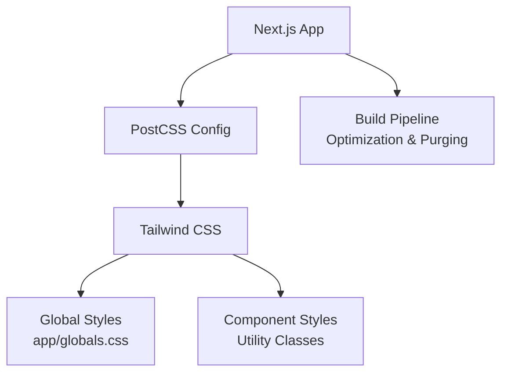
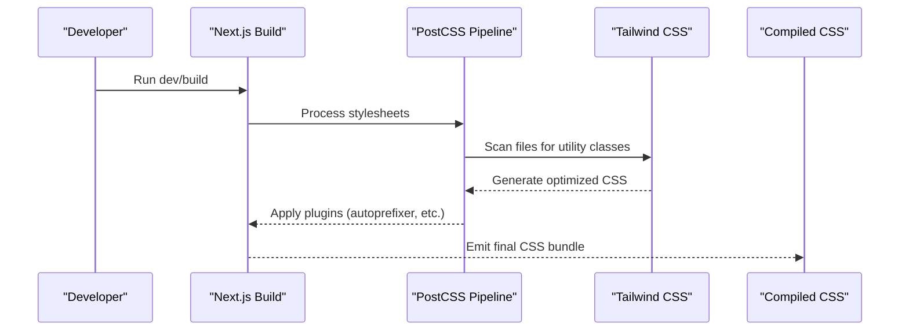
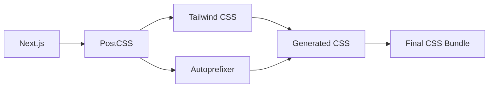

# Styling System

<cite>
**Referenced Files in This Document**
- [postcss.config.mjs](file://Frontend/studentbite/postcss.config.mjs)
- [globals.css](file://Frontend/studentbite/app/globals.css)
- [package.json](file://Frontend/studentbite/package.json)
- [next.config.ts](file://Frontend/studentbite/next.config.ts)
- [layout.tsx](file://Frontend/studentbite/app/layout.tsx)
- [page.tsx](file://Frontend/studentbite/app/(main)/page.tsx)
</cite>

## Table of Contents
1. [Introduction](#introduction)
2. [Project Structure](#project-structure)
3. [Core Components](#core-components)
4. [Architecture Overview](#architecture-overview)
5. [Detailed Component Analysis](#detailed-component-analysis)
6. [Dependency Analysis](#dependency-analysis)
7. [Performance Considerations](#performance-considerations)
8. [Troubleshooting Guide](#troubleshooting-guide)
9. [Conclusion](#conclusion)

## Introduction
This document explains the styling system built with Tailwind CSS and PostCSS in the Next.js frontend. It covers global styles, responsive design patterns, theme customization, CSS-in-JS approaches used across components, build configuration, style optimization, and cross-browser compatibility strategies. It also includes practical examples of utility class usage, custom themes, and responsive breakpoints.

## Project Structure
The styling system is centered around:
- Global styles defined in the app’s root stylesheet
- PostCSS configuration for processing styles
- Tailwind CSS utilities applied via classes throughout components
- Next.js integration for efficient bundling and optimization

**Diagram sources**
- [postcss.config.mjs](file://Frontend/studentbite/postcss.config.mjs)
- [globals.css](file://Frontend/studentbite/app/globals.css)
- [next.config.ts](file://Frontend/studentbite/next.config.ts)

**Section sources**
- [postcss.config.mjs](file://Frontend/studentbite/postcss.config.mjs)
- [globals.css](file://Frontend/studentbite/app/globals.css)
- [next.config.ts](file://Frontend/studentbite/next.config.ts)

## Core Components
- PostCSS configuration orchestrates the style pipeline (e.g., Tailwind CSS plugin, autoprefixer).
- Global stylesheet defines base typography, color tokens, and layout resets.
- Tailwind CSS provides utility-first classes for spacing, colors, typography, responsiveness, and more.
- Next.js integrates Tailwind and PostCSS during development and production builds.

Key responsibilities:
- PostCSS config: register plugins and processors
- Globals: define CSS variables, base styles, and global rules
- Components: compose UI using Tailwind utilities and minimal custom CSS when needed

**Section sources**
- [postcss.config.mjs](file://Frontend/studentbite/postcss.config.mjs)
- [globals.css](file://Frontend/studentbite/app/globals.css)

## Architecture Overview
The styling architecture follows a layered approach:
- Build layer: Next.js invokes PostCSS; Tailwind scans source files to generate optimized CSS
- Global layer: Base styles and design tokens are centralized
- Utility layer: Components use Tailwind utilities for consistent, maintainable styling
- Optimization layer: Unused styles are purged and assets are minified for production

**Diagram sources**
- [postcss.config.mjs](file://Frontend/studentbite/postcss.config.mjs)
- [next.config.ts](file://Frontend/studentbite/next.config.ts)

## Detailed Component Analysis

### PostCSS Configuration
Responsibilities:
- Register Tailwind CSS plugin
- Enable autoprefixer for cross-browser compatibility
- Optionally include other processors (e.g., cssnano in production)

Best practices:
- Keep dependencies up-to-date
- Ensure Tailwind paths include all relevant directories
- Use environment-specific settings if needed

**Section sources**
- [postcss.config.mjs](file://Frontend/studentbite/postcss.config.mjs)

### Global Styles (app/globals.css)
Responsibilities:
- Define CSS custom properties for theme tokens (colors, fonts, spacing)
- Set base typography and layout resets
- Include global utility overrides or component-level base styles

Responsive patterns:
- Use CSS media queries sparingly; prefer Tailwind utilities for most cases
- Centralize breakpoints in Tailwind config rather than ad-hoc CSS

Theme customization:
- Extend Tailwind theme via configuration to add brand colors, fonts, and spacing scales
- Reference tokens in components through Tailwind classes

**Section sources**
- [globals.css](file://Frontend/studentbite/app/globals.css)

### Tailwind CSS Usage Patterns
Common patterns:
- Layout: flexbox and grid utilities
- Spacing: consistent margin/padding scale
- Typography: font sizes, weights, line heights
- Colors: semantic color tokens mapped to Tailwind palette
- Responsive: mobile-first breakpoints with sm/md/lg/xl variants
- States: hover, focus, active, disabled modifiers

Examples of utility class usage:
- Container centering and max-width
- Card-like surfaces with rounded corners and shadows
- Buttons with primary/secondary variants
- Grid layouts for lists and dashboards

**Section sources**
- [globals.css](file://Frontend/studentbite/app/globals.css)

### CSS-in-JS Approaches
While Tailwind is the primary styling mechanism, some components may use inline styles or CSS modules when necessary:
- Inline styles for dynamic values not covered by utilities
- CSS modules for scoped styles when Tailwind cannot express complex interactions
- Theme hooks or context to supply dynamic tokens at runtime

Recommendations:
- Prefer Tailwind utilities for static styling
- Limit CSS-in-JS to truly dynamic scenarios
- Keep component styles small and composable

**Section sources**
- [layout.tsx](file://Frontend/studentbite/app/layout.tsx)
- [page.tsx](file://Frontend/studentbite/app/(main)/page.tsx)

### Build Configuration and Optimization
Next.js and PostCSS integration:
- Development: fast refresh and incremental compilation
- Production: tree-shaking, purging unused CSS, minification, and asset hashing

Style optimization strategies:
- Configure Tailwind content paths to scan only necessary files
- Avoid large unscoped CSS imports
- Use lazy loading for heavy pages where applicable

Cross-browser compatibility:
- Autoprefixer ensures vendor prefixes based on target browsers
- Test critical flows across major browsers and devices

**Section sources**
- [next.config.ts](file://Frontend/studentbite/next.config.ts)
- [postcss.config.mjs](file://Frontend/studentbite/postcss.config.mjs)

## Dependency Analysis
Styling dependencies typically include:
- Tailwind CSS for utility classes
- PostCSS for processing and optimization
- Autoprefixer for browser compatibility
- Next.js for build-time integration

**Diagram sources**
- [postcss.config.mjs](file://Frontend/studentbite/postcss.config.mjs)
- [next.config.ts](file://Frontend/studentbite/next.config.ts)

**Section sources**
- [package.json](file://Frontend/studentbite/package.json)
- [postcss.config.mjs](file://Frontend/studentbite/postcss.config.mjs)

## Performance Considerations
- Purge unused styles: ensure Tailwind content paths cover all templates and components
- Minimize global CSS size: keep globals focused on base styles and tokens
- Leverage responsive utilities: avoid writing custom media queries when possible
- Defer non-critical styles: load heavy page-specific styles lazily
- Monitor bundle size: track CSS growth over time and refactor as needed

[No sources needed since this section provides general guidance]

## Troubleshooting Guide
Common issues and resolutions:
- Styles not applying: verify Tailwind content paths include all relevant files
- Missing utilities: ensure Tailwind is installed and configured correctly
- Autoprefixer not working: confirm PostCSS setup and target browsers
- Large CSS bundle: review content scanning and remove unused imports
- Inconsistent breakpoints: align Tailwind breakpoints with design system

Debugging tips:
- Inspect generated CSS in development to verify utilities are present
- Use browser devtools to check computed styles and media query activation
- Validate PostCSS pipeline order and plugin configurations

**Section sources**
- [postcss.config.mjs](file://Frontend/studentbite/postcss.config.mjs)
- [globals.css](file://Frontend/studentbite/app/globals.css)

## Conclusion
The styling system combines Tailwind CSS utilities with PostCSS processing within Next.js to deliver a scalable, maintainable, and performant approach to UI styling. By centralizing global styles, leveraging responsive utilities, and optimizing the build pipeline, the system supports rapid development while ensuring cross-browser compatibility and efficient delivery.

[No sources needed since this section summarizes without analyzing specific files]