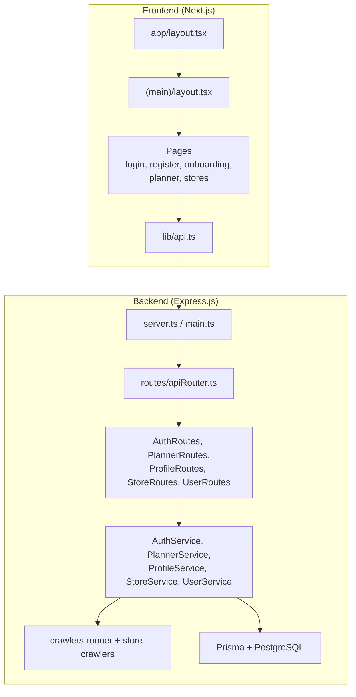
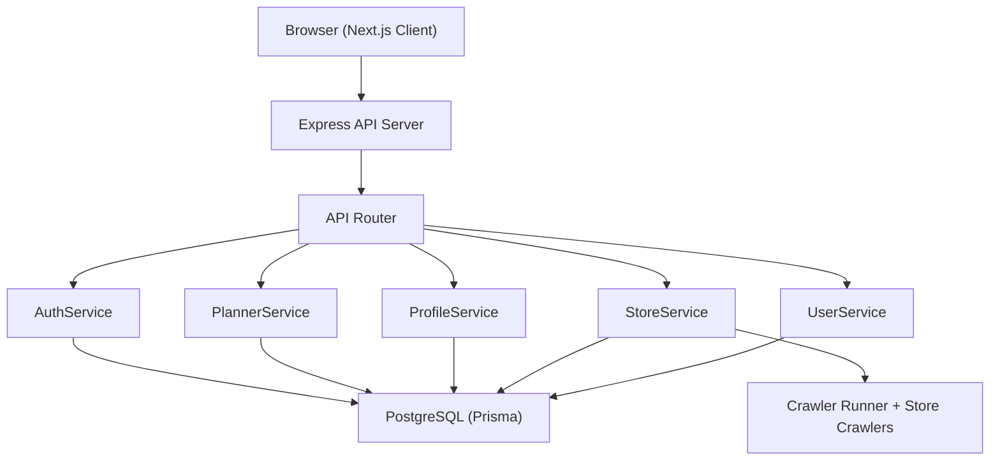
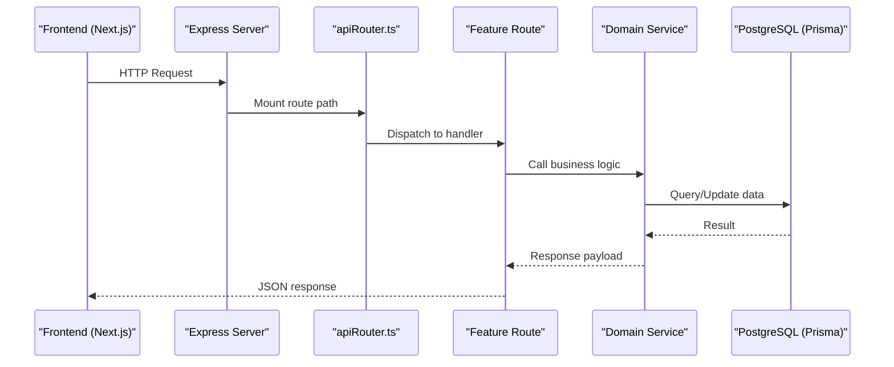
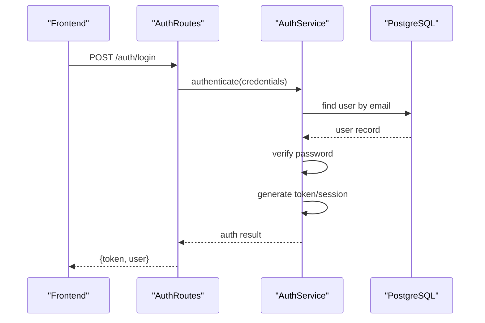
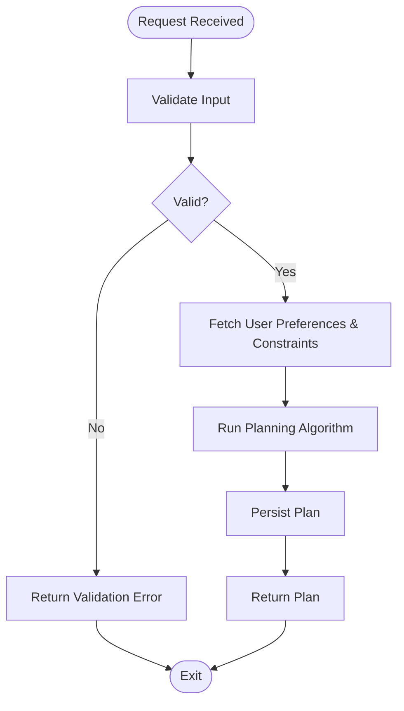
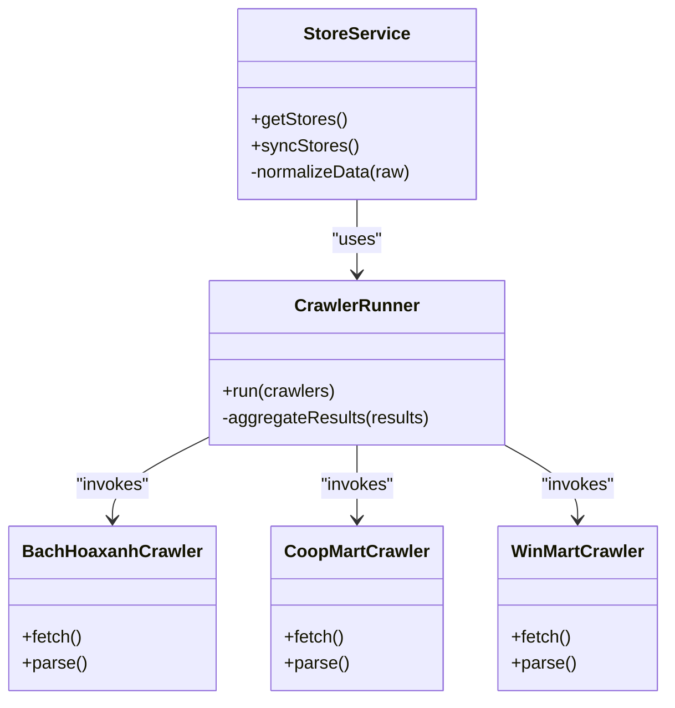
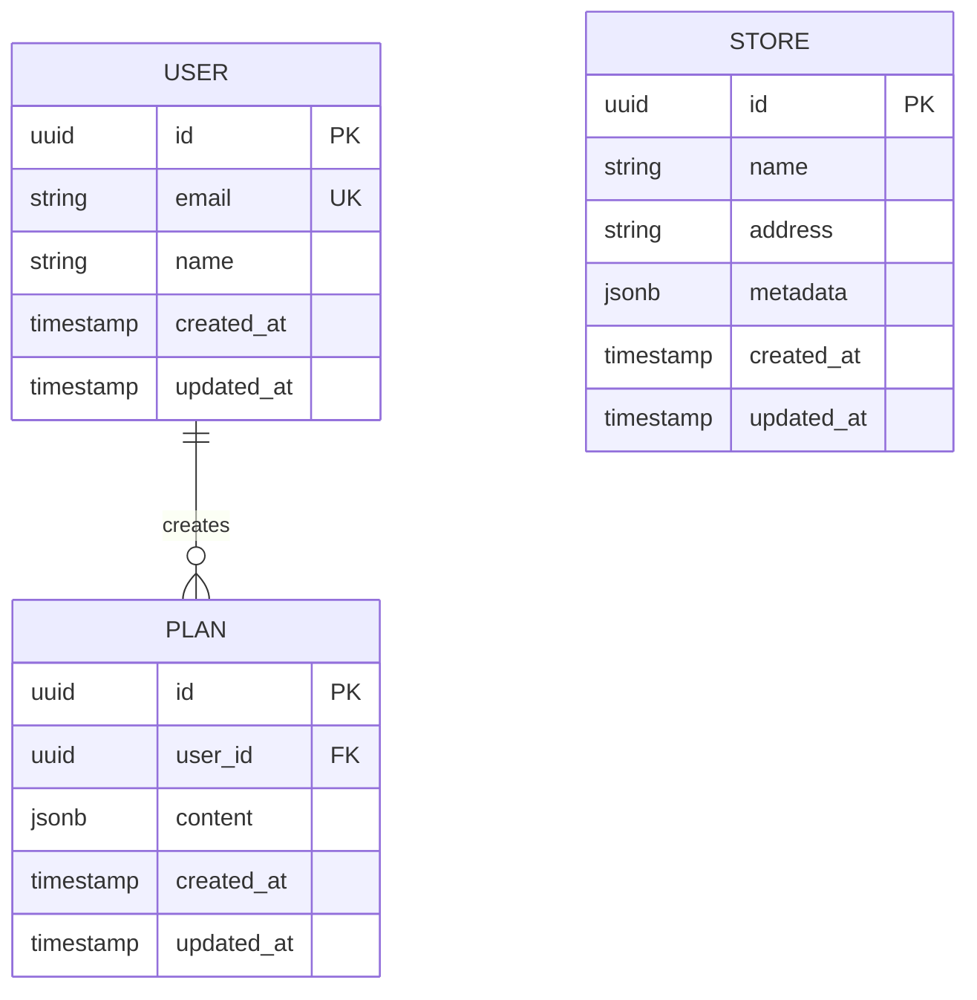
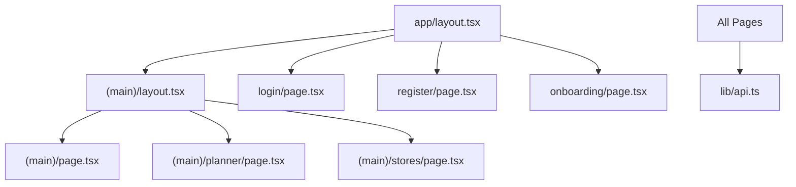
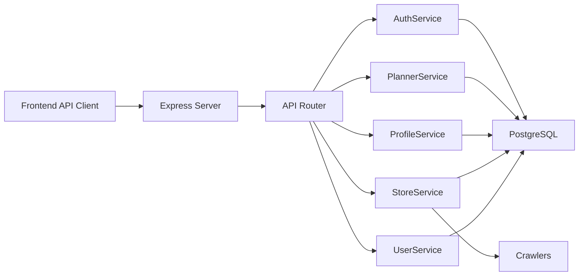

# System Architecture

<cite>
**Referenced Files in This Document**
- [README.md](file://README.md)
- [Backend/src/main.ts](file://Backend/src/main.ts)
- [Backend/src/server.ts](file://Backend/src/server.ts)
- [Backend/src/routes/apiRouter.ts](file://Backend/src/routes/apiRouter.ts)
- [Backend/src/routes/AuthRoutes.ts](file://Backend/src/routes/AuthRoutes.ts)
- [Backend/src/routes/PlannerRoutes.ts](file://Backend/src/routes/PlannerRoutes.ts)
- [Backend/src/routes/ProfileRoutes.ts](file://Backend/src/routes/ProfileRoutes.ts)
- [Backend/src/routes/StoreRoutes.ts](file://Backend/src/routes/StoreRoutes.ts)
- [Backend/src/routes/UserRoutes.ts](file://Backend/src/routes/UserRoutes.ts)
- [Backend/src/services/AuthService.ts](file://Backend/src/services/AuthService.ts)
- [Backend/src/services/PlannerService.ts](file://Backend/src/services/PlannerService.ts)
- [Backend/src/services/ProfileService.ts](file://Backend/src/services/ProfileService.ts)
- [Backend/src/services/StoreService.ts](file://Backend/src/services/StoreService.ts)
- [Backend/src/services/UserService.ts](file://Backend/src/services/UserService.ts)
- [Backend/src/crawlers/runner.ts](file://Backend/src/crawlers/runner.ts)
- [Backend/src/crawlers/common.ts](file://Backend/src/crawlers/common.ts)
- [Backend/src/crawlers/bachhoaxanh.ts](file://Backend/src/crawlers/bachhoaxanh.ts)
- [Backend/src/crawlers/coopmart.ts](file://Backend/src/crawlers/coopmart.ts)
- [Backend/src/crawlers/winmart.ts](file://Backend/src/crawlers/winmart.ts)
- [Backend/prisma/schema.prisma](file://Backend/prisma/schema.prisma)
- [Backend/docker-compose.yml](file://Backend/docker-compose.yml)
- [Frontend/studentbite/app/layout.tsx](file://Frontend/studentbite/app/layout.tsx)
- [Frontend/studentbite/app/(main)/layout.tsx](file://Frontend/studentbite/app/(main)/layout.tsx)
- [Frontend/studentbite/app/(main)/page.tsx](file://Frontend/studentbite/app/(main)/page.tsx)
- [Frontend/studentbite/app/login/page.tsx](file://Frontend/studentbite/app/login/page.tsx)
- [Frontend/studentbite/app/register/page.tsx](file://Frontend/studentbite/app/register/page.tsx)
- [Frontend/studentbite/app/onboarding/page.tsx](file://Frontend/studentbite/app/onboarding/page.tsx)
- [Frontend/studentbite/app/(main)/planner/page.tsx](file://Frontend/studentbite/app/(main)/planner/page.tsx)
- [Frontend/studentbite/app/(main)/stores/page.tsx](file://Frontend/studentbite/app/(main)/stores/page.tsx)
- [Frontend/studentbite/lib/api.ts](file://Frontend/studentbite/lib/api.ts)
- [Frontend/studentbite/components/Providers.tsx](file://Frontend/studentbite/components/Providers.tsx)
</cite>

## Table of Contents
1. [Introduction](#introduction)
2. [Project Structure](#project-structure)
3. [Core Components](#core-components)
4. [Architecture Overview](#architecture-overview)
5. [Detailed Component Analysis](#detailed-component-analysis)
6. [Dependency Analysis](#dependency-analysis)
7. [Performance Considerations](#performance-considerations)
8. [Troubleshooting Guide](#troubleshooting-guide)
9. [Conclusion](#conclusion)
10. [Appendices](#appendices)

## Introduction
This document presents the system architecture for StudentBite, a web application that combines a Next.js frontend with an Express.js backend, a PostgreSQL database, and a web scraping subsystem to aggregate store data. The design emphasizes clear separation of concerns across layers (presentation, API gateway, services, data access), well-defined microservice boundaries within the backend, and robust client-server communication patterns via REST APIs. It also outlines deployment topology using Docker Compose and highlights integration points such as authentication, planning algorithms, and store crawlers.

## Project Structure
StudentBite is organized into two primary subprojects:
- Backend: An Express.js server with TypeScript, Prisma ORM, modular routes, services, and crawlers.
- Frontend: A Next.js application using App Router, client components, and a centralized API client.

Key directories and responsibilities:
- Backend/src: Application entry points, routing, services, crawlers, models, and shared utilities.
- Backend/prisma: Database schema and migrations.
- Frontend/studentbite/app: Next.js pages and layouts defining the UI structure and navigation.
- Frontend/studentbite/lib: Shared client-side utilities including the API client.

**Diagram sources**
- [Backend/src/server.ts](file://Backend/src/server.ts)
- [Backend/src/main.ts](file://Backend/src/main.ts)
- [Backend/src/routes/apiRouter.ts](file://Backend/src/routes/apiRouter.ts)
- [Backend/src/routes/AuthRoutes.ts](file://Backend/src/routes/AuthRoutes.ts)
- [Backend/src/routes/PlannerRoutes.ts](file://Backend/src/routes/PlannerRoutes.ts)
- [Backend/src/routes/ProfileRoutes.ts](file://Backend/src/routes/ProfileRoutes.ts)
- [Backend/src/routes/StoreRoutes.ts](file://Backend/src/routes/StoreRoutes.ts)
- [Backend/src/routes/UserRoutes.ts](file://Backend/src/routes/UserRoutes.ts)
- [Backend/src/services/AuthService.ts](file://Backend/src/services/AuthService.ts)
- [Backend/src/services/PlannerService.ts](file://Backend/src/services/PlannerService.ts)
- [Backend/src/services/ProfileService.ts](file://Backend/src/services/ProfileService.ts)
- [Backend/src/services/StoreService.ts](file://Backend/src/services/StoreService.ts)
- [Backend/src/services/UserService.ts](file://Backend/src/services/UserService.ts)
- [Backend/src/crawlers/runner.ts](file://Backend/src/crawlers/runner.ts)
- [Backend/prisma/schema.prisma](file://Backend/prisma/schema.prisma)
- [Frontend/studentbite/app/layout.tsx](file://Frontend/studentbite/app/layout.tsx)
- [Frontend/studentbite/app/(main)/layout.tsx](file://Frontend/studentbite/app/(main)/layout.tsx)
- [Frontend/studentbite/lib/api.ts](file://Frontend/studentbite/lib/api.ts)

**Section sources**
- [README.md](file://README.md)
- [Backend/src/main.ts](file://Backend/src/main.ts)
- [Backend/src/server.ts](file://Backend/src/server.ts)
- [Backend/prisma/schema.prisma](file://Backend/prisma/schema.prisma)
- [Frontend/studentbite/app/layout.tsx](file://Frontend/studentbite/app/layout.tsx)
- [Frontend/studentbite/app/(main)/layout.tsx](file://Frontend/studentbite/app/(main)/layout.tsx)
- [Frontend/studentbite/lib/api.ts](file://Frontend/studentbite/lib/api.ts)

## Core Components
- Frontend (Next.js): Provides user interfaces for login, registration, onboarding, planner, and stores. Uses a centralized API client to communicate with the backend.
- Backend API Gateway (Express.js): Centralizes HTTP endpoints, delegates business logic to domain-specific services, and manages cross-cutting concerns like logging and error handling.
- Services Layer: Encapsulates business logic for authentication, planning, profiles, stores, and users.
- Crawlers Subsystem: Scrapes external store websites to enrich store data used by the application.
- Data Access Layer: Uses Prisma ORM to interact with PostgreSQL, ensuring type-safe queries and migrations.

Key responsibilities:
- Client-Server Communication: JSON over REST, handled by the frontend API client and Express routes.
- Separation of Concerns: Routes handle HTTP concerns; services implement business logic; crawlers encapsulate external integrations; Prisma abstracts database operations.
- Microservice Boundaries: Logical boundaries between Auth, Planner, Profile, Store, and User domains within the backend service.

**Section sources**
- [Backend/src/routes/apiRouter.ts](file://Backend/src/routes/apiRouter.ts)
- [Backend/src/services/AuthService.ts](file://Backend/src/services/AuthService.ts)
- [Backend/src/services/PlannerService.ts](file://Backend/src/services/PlannerService.ts)
- [Backend/src/services/ProfileService.ts](file://Backend/src/services/ProfileService.ts)
- [Backend/src/services/StoreService.ts](file://Backend/src/services/StoreService.ts)
- [Backend/src/services/UserService.ts](file://Backend/src/services/UserService.ts)
- [Backend/src/crawlers/runner.ts](file://Backend/src/crawlers/runner.ts)
- [Backend/prisma/schema.prisma](file://Backend/prisma/schema.prisma)
- [Frontend/studentbite/lib/api.ts](file://Frontend/studentbite/lib/api.ts)

## Architecture Overview
The system follows a layered architecture:
- Presentation Layer: Next.js app renders UI and collects user input.
- API Gateway Layer: Express server exposes REST endpoints grouped by feature.
- Business Logic Layer: Domain services orchestrate operations and enforce rules.
- Integration Layer: Crawlers fetch external data from store websites.
- Data Layer: Prisma ORM interacts with PostgreSQL.

Deployment topology uses Docker Compose to run the backend and database together, while the frontend can be served statically or via a Node server.

**Diagram sources**
- [Backend/src/server.ts](file://Backend/src/server.ts)
- [Backend/src/routes/apiRouter.ts](file://Backend/src/routes/apiRouter.ts)
- [Backend/src/services/AuthService.ts](file://Backend/src/services/AuthService.ts)
- [Backend/src/services/PlannerService.ts](file://Backend/src/services/PlannerService.ts)
- [Backend/src/services/ProfileService.ts](file://Backend/src/services/ProfileService.ts)
- [Backend/src/services/StoreService.ts](file://Backend/src/services/StoreService.ts)
- [Backend/src/services/UserService.ts](file://Backend/src/services/UserService.ts)
- [Backend/src/crawlers/runner.ts](file://Backend/src/crawlers/runner.ts)
- [Backend/prisma/schema.prisma](file://Backend/prisma/schema.prisma)

## Detailed Component Analysis

### API Gateway and Routing
The Express server initializes middleware and mounts feature routers under a common prefix. Each router maps HTTP methods to handlers that delegate to corresponding services.

**Diagram sources**
- [Backend/src/server.ts](file://Backend/src/server.ts)
- [Backend/src/routes/apiRouter.ts](file://Backend/src/routes/apiRouter.ts)
- [Backend/src/routes/AuthRoutes.ts](file://Backend/src/routes/AuthRoutes.ts)
- [Backend/src/routes/PlannerRoutes.ts](file://Backend/src/routes/PlannerRoutes.ts)
- [Backend/src/routes/ProfileRoutes.ts](file://Backend/src/routes/ProfileRoutes.ts)
- [Backend/src/routes/StoreRoutes.ts](file://Backend/src/routes/StoreRoutes.ts)
- [Backend/src/routes/UserRoutes.ts](file://Backend/src/routes/UserRoutes.ts)

**Section sources**
- [Backend/src/server.ts](file://Backend/src/server.ts)
- [Backend/src/routes/apiRouter.ts](file://Backend/src/routes/apiRouter.ts)
- [Backend/src/routes/AuthRoutes.ts](file://Backend/src/routes/AuthRoutes.ts)
- [Backend/src/routes/PlannerRoutes.ts](file://Backend/src/routes/PlannerRoutes.ts)
- [Backend/src/routes/ProfileRoutes.ts](file://Backend/src/routes/ProfileRoutes.ts)
- [Backend/src/routes/StoreRoutes.ts](file://Backend/src/routes/StoreRoutes.ts)
- [Backend/src/routes/UserRoutes.ts](file://Backend/src/routes/UserRoutes.ts)

### Authentication Flow
Authentication routes coordinate login and registration flows, delegating to AuthService for validation, token generation, and session management.

**Diagram sources**
- [Backend/src/routes/AuthRoutes.ts](file://Backend/src/routes/AuthRoutes.ts)
- [Backend/src/services/AuthService.ts](file://Backend/src/services/AuthService.ts)
- [Backend/prisma/schema.prisma](file://Backend/prisma/schema.prisma)

**Section sources**
- [Backend/src/routes/AuthRoutes.ts](file://Backend/src/routes/AuthRoutes.ts)
- [Backend/src/services/AuthService.ts](file://Backend/src/services/AuthService.ts)
- [Backend/prisma/schema.prisma](file://Backend/prisma/schema.prisma)

### Planner Service and Algorithm
The planner service orchestrates meal planning logic, potentially invoking algorithmic helpers to generate plans based on user preferences and constraints.

**Diagram sources**
- [Backend/src/routes/PlannerRoutes.ts](file://Backend/src/routes/PlannerRoutes.ts)
- [Backend/src/services/PlannerService.ts](file://Backend/src/services/PlannerService.ts)
- [Backend/prisma/schema.prisma](file://Backend/prisma/schema.prisma)

**Section sources**
- [Backend/src/routes/PlannerRoutes.ts](file://Backend/src/routes/PlannerRoutes.ts)
- [Backend/src/services/PlannerService.ts](file://Backend/src/services/PlannerService.ts)
- [Backend/prisma/schema.prisma](file://Backend/prisma/schema.prisma)

### Store Service and Crawlers
Store service integrates with crawlers to fetch and normalize store data from external websites. The crawler runner coordinates execution and aggregation.

**Diagram sources**
- [Backend/src/services/StoreService.ts](file://Backend/src/services/StoreService.ts)
- [Backend/src/crawlers/runner.ts](file://Backend/src/crawlers/runner.ts)
- [Backend/src/crawlers/common.ts](file://Backend/src/crawlers/common.ts)
- [Backend/src/crawlers/bachhoaxanh.ts](file://Backend/src/crawlers/bachhoaxanh.ts)
- [Backend/src/crawlers/coopmart.ts](file://Backend/src/crawlers/coopmart.ts)
- [Backend/src/crawlers/winmart.ts](file://Backend/src/crawlers/winmart.ts)

**Section sources**
- [Backend/src/services/StoreService.ts](file://Backend/src/services/StoreService.ts)
- [Backend/src/crawlers/runner.ts](file://Backend/src/crawlers/runner.ts)
- [Backend/src/crawlers/common.ts](file://Backend/src/crawlers/common.ts)
- [Backend/src/crawlers/bachhoaxanh.ts](file://Backend/src/crawlers/bachhoaxanh.ts)
- [Backend/src/crawlers/coopmart.ts](file://Backend/src/crawlers/coopmart.ts)
- [Backend/src/crawlers/winmart.ts](file://Backend/src/crawlers/winmart.ts)

### Data Models and Database Schema
Prisma defines entities and relationships for users, plans, stores, and related data. Migrations manage schema evolution.

**Diagram sources**
- [Backend/prisma/schema.prisma](file://Backend/prisma/schema.prisma)

**Section sources**
- [Backend/prisma/schema.prisma](file://Backend/prisma/schema.prisma)

### Frontend Pages and Navigation
Next.js App Router organizes pages and layouts. The root layout sets global providers and styles, while feature layouts group related pages.

**Diagram sources**
- [Frontend/studentbite/app/layout.tsx](file://Frontend/studentbite/app/layout.tsx)
- [Frontend/studentbite/app/(main)/layout.tsx](file://Frontend/studentbite/app/(main)/layout.tsx)
- [Frontend/studentbite/app/(main)/page.tsx](file://Frontend/studentbite/app/(main)/page.tsx)
- [Frontend/studentbite/app/(main)/planner/page.tsx](file://Frontend/studentbite/app/(main)/planner/page.tsx)
- [Frontend/studentbite/app/(main)/stores/page.tsx](file://Frontend/studentbite/app/(main)/stores/page.tsx)
- [Frontend/studentbite/app/login/page.tsx](file://Frontend/studentbite/app/login/page.tsx)
- [Frontend/studentbite/app/register/page.tsx](file://Frontend/studentbite/app/register/page.tsx)
- [Frontend/studentbite/app/onboarding/page.tsx](file://Frontend/studentbite/app/onboarding/page.tsx)
- [Frontend/studentbite/lib/api.ts](file://Frontend/studentbite/lib/api.ts)

**Section sources**
- [Frontend/studentbite/app/layout.tsx](file://Frontend/studentbite/app/layout.tsx)
- [Frontend/studentbite/app/(main)/layout.tsx](file://Frontend/studentbite/app/(main)/layout.tsx)
- [Frontend/studentbite/app/(main)/page.tsx](file://Frontend/studentbite/app/(main)/page.tsx)
- [Frontend/studentbite/app/(main)/planner/page.tsx](file://Frontend/studentbite/app/(main)/planner/page.tsx)
- [Frontend/studentbite/app/(main)/stores/page.tsx](file://Frontend/studentbite/app/(main)/stores/page.tsx)
- [Frontend/studentbite/app/login/page.tsx](file://Frontend/studentbite/app/login/page.tsx)
- [Frontend/studentbite/app/register/page.tsx](file://Frontend/studentbite/app/register/page.tsx)
- [Frontend/studentbite/app/onboarding/page.tsx](file://Frontend/studentbite/app/onboarding/page.tsx)
- [Frontend/studentbite/lib/api.ts](file://Frontend/studentbite/lib/api.ts)

## Dependency Analysis
The backend exhibits clear layering and dependency direction:
- Routes depend on services.
- Services depend on data access (Prisma) and external integrations (crawlers).
- Crawlers are isolated modules invoked by services.
- Frontend depends only on the API client.

**Diagram sources**
- [Backend/src/server.ts](file://Backend/src/server.ts)
- [Backend/src/routes/apiRouter.ts](file://Backend/src/routes/apiRouter.ts)
- [Backend/src/services/AuthService.ts](file://Backend/src/services/AuthService.ts)
- [Backend/src/services/PlannerService.ts](file://Backend/src/services/PlannerService.ts)
- [Backend/src/services/ProfileService.ts](file://Backend/src/services/ProfileService.ts)
- [Backend/src/services/StoreService.ts](file://Backend/src/services/StoreService.ts)
- [Backend/src/services/UserService.ts](file://Backend/src/services/UserService.ts)
- [Backend/src/crawlers/runner.ts](file://Backend/src/crawlers/runner.ts)
- [Backend/prisma/schema.prisma](file://Backend/prisma/schema.prisma)

**Section sources**
- [Backend/src/server.ts](file://Backend/src/server.ts)
- [Backend/src/routes/apiRouter.ts](file://Backend/src/routes/apiRouter.ts)
- [Backend/src/services/AuthService.ts](file://Backend/src/services/AuthService.ts)
- [Backend/src/services/PlannerService.ts](file://Backend/src/services/PlannerService.ts)
- [Backend/src/services/ProfileService.ts](file://Backend/src/services/ProfileService.ts)
- [Backend/src/services/StoreService.ts](file://Backend/src/services/StoreService.ts)
- [Backend/src/services/UserService.ts](file://Backend/src/services/UserService.ts)
- [Backend/src/crawlers/runner.ts](file://Backend/src/crawlers/runner.ts)
- [Backend/prisma/schema.prisma](file://Backend/prisma/schema.prisma)

## Performance Considerations
- Database Queries: Use Prisma query optimization, avoid N+1 problems, and leverage indexes where appropriate.
- Crawling: Implement rate limiting, retries, and caching to reduce load on external sites and improve response times.
- API Responses: Paginate large datasets and minimize payload size by selecting only necessary fields.
- Concurrency: Use connection pooling for database and crawler requests to handle concurrent traffic efficiently.
- Frontend Optimization: Leverage Next.js static generation and client-side caching to reduce server load.

[No sources needed since this section provides general guidance]

## Troubleshooting Guide
Common issues and strategies:
- Authentication Failures: Verify credentials, check token generation, and ensure session state consistency.
- Planner Errors: Validate inputs, inspect algorithm steps, and log intermediate states.
- Store Sync Failures: Monitor crawler logs, handle network errors gracefully, and retry failed requests.
- Database Connectivity: Confirm environment variables, migration status, and connection pool settings.

**Section sources**
- [Backend/src/services/AuthService.ts](file://Backend/src/services/AuthService.ts)
- [Backend/src/services/PlannerService.ts](file://Backend/src/services/PlannerService.ts)
- [Backend/src/services/StoreService.ts](file://Backend/src/services/StoreService.ts)
- [Backend/src/crawlers/runner.ts](file://Backend/src/crawlers/runner.ts)
- [Backend/prisma/schema.prisma](file://Backend/prisma/schema.prisma)

## Conclusion
StudentBite’s architecture cleanly separates presentation, API gateway, business logic, integration, and data layers. The Express backend organizes functionality into domain services, while the Next.js frontend provides a responsive interface. The crawler subsystem enables dynamic store data enrichment. Docker Compose simplifies local development and deployment. This design supports scalability, maintainability, and clear ownership of responsibilities across components.

[No sources needed since this section summarizes without analyzing specific files]

## Appendices
- Deployment Topology: Docker Compose orchestrates backend and database; frontend can be deployed as a static site or Node server.
- Technology Stack Decisions: Next.js for modern React-based UI, Express for flexible API layer, Prisma for type-safe database access, and crawlers for external data integration.

**Section sources**
- [Backend/docker-compose.yml](file://Backend/docker-compose.yml)
- [README.md](file://README.md)