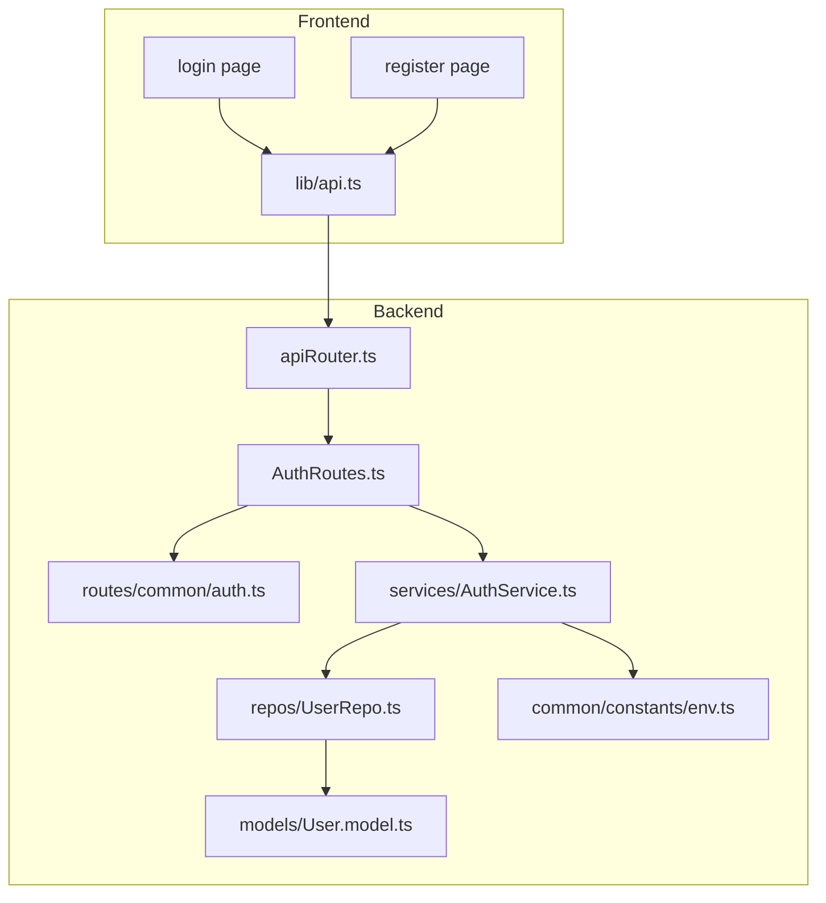
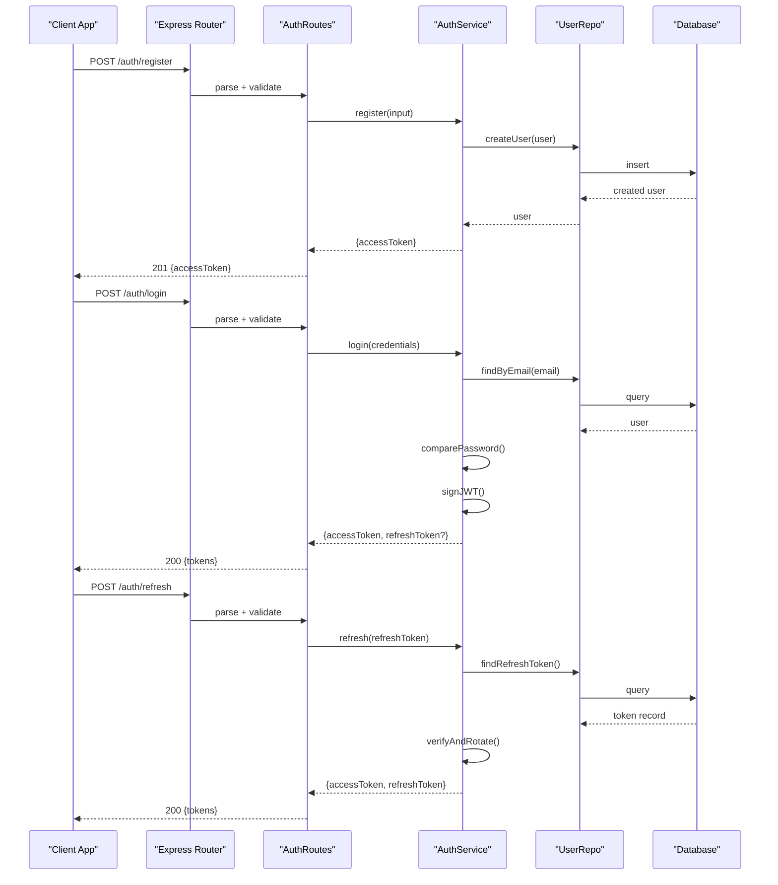
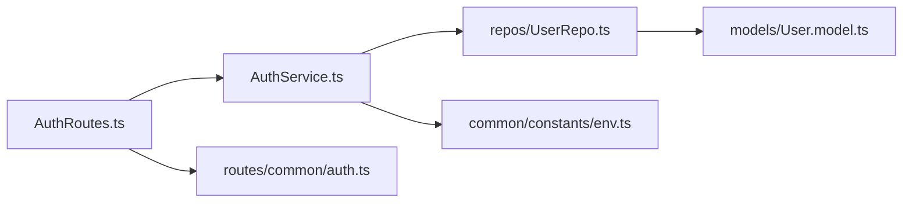

# Authentication System

<cite>
**Referenced Files in This Document**
- [AuthRoutes.ts](file://Backend/src/routes/AuthRoutes.ts)
- [AuthService.ts](file://Backend/src/services/AuthService.ts)
- [User.model.ts](file://Backend/src/models/User.model.ts)
- [UserRepo.ts](file://Backend/src/repos/UserRepo.ts)
- [env.ts](file://Backend/src/common/constants/env.ts)
- [auth.ts](file://Backend/src/routes/common/auth.ts)
- [apiRouter.ts](file://Backend/src/routes/apiRouter.ts)
- [package.json](file://Backend/package.json)
</cite>

## Table of Contents
1. [Introduction](#introduction)
2. [Project Structure](#project-structure)
3. [Core Components](#core-components)
4. [Architecture Overview](#architecture-overview)
5. [Detailed Component Analysis](#detailed-component-analysis)
6. [Dependency Analysis](#dependency-analysis)
7. [Performance Considerations](#performance-considerations)
8. [Troubleshooting Guide](#troubleshooting-guide)
9. [Conclusion](#conclusion)

## Introduction
This document explains the authentication system implementation across the backend and frontend. It covers JWT token generation and validation, user registration and login flows, password hashing with bcrypt, session management, role-based access control, auth middleware, request protection strategies, security best practices, protected routes, token refresh mechanisms, and common authentication patterns.

## Project Structure
The authentication system is primarily implemented in the backend under Backend/src with supporting types, constants, and repositories. The frontend integrates via API calls and manages tokens in client storage.

**Diagram sources**
- [apiRouter.ts](file://Backend/src/routes/apiRouter.ts)
- [AuthRoutes.ts](file://Backend/src/routes/AuthRoutes.ts)
- [auth.ts](file://Backend/src/routes/common/auth.ts)
- [AuthService.ts](file://Backend/src/services/AuthService.ts)
- [UserRepo.ts](file://Backend/src/repos/UserRepo.ts)
- [User.model.ts](file://Backend/src/models/User.model.ts)
- [env.ts](file://Backend/src/common/constants/env.ts)

**Section sources**
- [AuthRoutes.ts](file://Backend/src/routes/AuthRoutes.ts)
- [AuthService.ts](file://Backend/src/services/AuthService.ts)
- [User.model.ts](file://Backend/src/models/User.model.ts)
- [UserRepo.ts](file://Backend/src/repos/UserRepo.ts)
- [env.ts](file://Backend/src/common/constants/env.ts)
- [apiRouter.ts](file://Backend/src/routes/apiRouter.ts)

## Core Components
- AuthRoutes: HTTP endpoints for register, login, logout, and token refresh; wires request parsing and response formatting.
- AuthService: Business logic for user creation, credential verification, JWT issuance, and token refresh.
- UserRepo: Data access layer for user persistence (via Prisma or mock ORM).
- UserModel: Type definitions for user entities.
- Common auth utilities: Shared helpers for request parsing and error handling.
- Environment configuration: Secrets such as JWT secret and expiration settings.

Key responsibilities:
- Register: validate input, hash password, create user, return minimal profile.
- Login: verify credentials, issue access and optional refresh tokens.
- Token refresh: validate refresh token, rotate if needed, return new tokens.
- Logout: invalidate refresh token if stored server-side.

**Section sources**
- [AuthRoutes.ts](file://Backend/src/routes/AuthRoutes.ts)
- [AuthService.ts](file://Backend/src/services/AuthService.ts)
- [UserRepo.ts](file://Backend/src/repos/UserRepo.ts)
- [User.model.ts](file://Backend/src/models/User.model.ts)
- [env.ts](file://Backend/src/common/constants/env.ts)

## Architecture Overview
The authentication flow uses stateless JWTs for authorization and optional server-side refresh token storage for rotation and revocation.

**Diagram sources**
- [AuthRoutes.ts](file://Backend/src/routes/AuthRoutes.ts)
- [AuthService.ts](file://Backend/src/services/AuthService.ts)
- [UserRepo.ts](file://Backend/src/repos/UserRepo.ts)

## Detailed Component Analysis

### Auth Routes
Responsibilities:
- Define endpoints for register, login, logout, and refresh.
- Parse and validate requests using shared utilities.
- Delegate to AuthService for business logic.
- Return standardized responses and errors.

Security considerations:
- Input validation before calling service methods.
- Consistent error messages to avoid leaking sensitive info.
- Secure cookie flags for refresh tokens when used.

Protected route pattern:
- Middleware extracts and validates JWT from Authorization header.
- Attaches authenticated user to request context.
- Optional role checks for admin-only endpoints.

**Section sources**
- [AuthRoutes.ts](file://Backend/src/routes/AuthRoutes.ts)
- [auth.ts](file://Backend/src/routes/common/auth.ts)
- [apiRouter.ts](file://Backend/src/routes/apiRouter.ts)

### Auth Service
Responsibilities:
- User registration: validate inputs, hash password, persist user, generate access token.
- Login: lookup user by email, verify password, issue tokens.
- Token refresh: validate refresh token, rotate if necessary, return new tokens.
- Password hashing: use bcrypt with appropriate salt rounds.
- JWT signing and verification: secure secret, short-lived access tokens, optional long-lived refresh tokens.

Error handling:
- Distinguish between invalid credentials and server errors.
- Normalize database errors into user-friendly messages.

Best practices:
- Never log secrets or tokens.
- Use environment variables for secrets and expirations.
- Rotate refresh tokens on each use.

**Section sources**
- [AuthService.ts](file://Backend/src/services/AuthService.ts)
- [UserRepo.ts](file://Backend/src/repos/UserRepo.ts)
- [User.model.ts](file://Backend/src/models/User.model.ts)
- [env.ts](file://Backend/src/common/constants/env.ts)

### User Repository and Model
Responsibilities:
- Encapsulate data operations for users and optional refresh tokens.
- Provide type-safe interfaces aligned with UserModel.
- Abstract underlying storage (Prisma or mock).

Design notes:
- Keep repository methods focused and testable.
- Map domain models to persistence models.

**Section sources**
- [UserRepo.ts](file://Backend/src/repos/UserRepo.ts)
- [User.model.ts](file://Backend/src/models/User.model.ts)

### Environment Configuration
Responsibilities:
- Centralize secrets and runtime settings.
- Validate presence of required env vars at startup.

Recommended keys:
- JWT_SECRET: strong random string.
- ACCESS_TOKEN_EXPIRES_IN: short TTL (e.g., minutes).
- REFRESH_TOKEN_EXPIRES_IN: longer TTL (e.g., days).
- BCRYPT_SALT_ROUNDS: typically 10–12.
- DATABASE_URL: connection string.

**Section sources**
- [env.ts](file://Backend/src/common/constants/env.ts)

### Request Protection and Role-Based Access Control
Patterns:
- Extract JWT from Authorization header (Bearer scheme).
- Verify signature and expiry; attach decoded payload to request.
- Optional role check: require specific roles for sensitive routes.
- Reject unauthorized requests with consistent status codes.

Implementation tips:
- Cache verified tokens only if necessary; prefer stateless verification.
- Log failed attempts for audit without exposing details.

**Section sources**
- [auth.ts](file://Backend/src/routes/common/auth.ts)
- [AuthService.ts](file://Backend/src/services/AuthService.ts)

### Token Refresh Mechanism
Flow:
- Client sends refresh token (cookie or body).
- Server verifies token and checks revocation list if stored.
- On success, issue new access token and optionally rotate refresh token.
- On failure, respond with 401 and instruct client to re-authenticate.

Security:
- Store refresh tokens securely (httpOnly cookies recommended).
- Bind refresh tokens to user and device metadata if possible.
- Revoke tokens on logout or suspicious activity.

**Section sources**
- [AuthService.ts](file://Backend/src/services/AuthService.ts)
- [UserRepo.ts](file://Backend/src/repos/UserRepo.ts)

### Protected Routes Examples
Examples of protected endpoints:
- GET /profile: requires valid JWT.
- PUT /profile: requires valid JWT and ownership check.
- DELETE /account: requires admin role.

Middleware usage:
- Apply auth middleware to all protected routes.
- Add role guards where necessary.

**Section sources**
- [apiRouter.ts](file://Backend/src/routes/apiRouter.ts)
- [auth.ts](file://Backend/src/routes/common/auth.ts)

## Dependency Analysis
High-level dependencies:
- AuthRoutes depends on AuthService and common utilities.
- AuthService depends on UserRepo and environment config.
- UserRepo abstracts persistence (Prisma or mock).
- Frontend depends on backend APIs and stores tokens securely.

**Diagram sources**
- [AuthRoutes.ts](file://Backend/src/routes/AuthRoutes.ts)
- [AuthService.ts](file://Backend/src/services/AuthService.ts)
- [UserRepo.ts](file://Backend/src/repos/UserRepo.ts)
- [User.model.ts](file://Backend/src/models/User.model.ts)
- [env.ts](file://Backend/src/common/constants/env.ts)
- [auth.ts](file://Backend/src/routes/common/auth.ts)

**Section sources**
- [AuthRoutes.ts](file://Backend/src/routes/AuthRoutes.ts)
- [AuthService.ts](file://Backend/src/services/AuthService.ts)
- [UserRepo.ts](file://Backend/src/repos/UserRepo.ts)
- [User.model.ts](file://Backend/src/models/User.model.ts)
- [env.ts](file://Backend/src/common/constants/env.ts)
- [auth.ts](file://Backend/src/routes/common/auth.ts)

## Performance Considerations
- Keep JWT payloads small; store only necessary claims.
- Use short-lived access tokens to reduce risk and improve cache behavior.
- Avoid synchronous crypto operations on the main thread; ensure async bcrypt usage.
- Index user lookups by email and any unique identifiers.
- Consider caching frequent read operations behind a cache layer if needed.

[No sources needed since this section provides general guidance]

## Troubleshooting Guide
Common issues and resolutions:
- Invalid token errors:
  - Check JWT_SECRET matches between issuer and verifier.
  - Ensure token has not expired; implement refresh flow.
- Password comparison failures:
  - Confirm bcrypt salt rounds are consistent.
  - Verify stored hashes were generated correctly.
- Missing environment variables:
  - Validate required keys at startup and fail fast with clear messages.
- CORS and cookie issues:
  - Configure allowed origins and cookie attributes (secure, httpOnly, sameSite).
- Database connectivity:
  - Validate DATABASE_URL and network access.

Operational tips:
- Log structured events for auth failures without sensitive data.
- Add health checks for external dependencies.
- Monitor token issuance and refresh rates for anomalies.

[No sources needed since this section provides general guidance]

## Conclusion
The authentication system follows modern best practices: stateless JWTs for authorization, bcrypt for password hashing, and an optional refresh token mechanism for secure sessions. Clear separation of concerns across routes, services, and repositories enables maintainability and testability. Applying robust middleware and environment-driven configuration ensures security and scalability.

[No sources needed since this section summarizes without analyzing specific files]

## Appendices

### Security Best Practices Checklist
- Use strong, randomly generated JWT_SECRET.
- Set short ACCESS_TOKEN_EXPIRES_IN and longer REFRESH_TOKEN_EXPIRES_IN.
- Hash passwords with bcrypt using adequate salt rounds.
- Enforce HTTPS and secure cookie flags for refresh tokens.
- Implement rate limiting on auth endpoints.
- Validate and sanitize all inputs.
- Log security-relevant events without sensitive data.
- Rotate secrets and tokens periodically.

[No sources needed since this section provides general guidance]