# Backend Documentation

<cite>
**Referenced Files in This Document**
- [server.ts](file://Backend/src/server.ts)
- [main.ts](file://Backend/src/main.ts)
- [apiRouter.ts](file://Backend/src/routes/apiRouter.ts)
- [AuthRoutes.ts](file://Backend/src/routes/AuthRoutes.ts)
- [PlannerRoutes.ts](file://Backend/src/routes/PlannerRoutes.ts)
- [StoreRoutes.ts](file://Backend/src/routes/StoreRoutes.ts)
- [UserRoutes.ts](file://Backend/src/routes/UserRoutes.ts)
- [ProfileRoutes.ts](file://Backend/src/routes/ProfileRoutes.ts)
- [LogRoutes.ts](file://Backend/src/routes/LogRoutes.ts)
- [AuthService.ts](file://Backend/src/services/AuthService.ts)
- [PlannerService.ts](file://Backend/src/services/PlannerService.ts)
- [StoreService.ts](file://Backend/src/services/StoreService.ts)
- [UserService.ts](file://Backend/src/services/UserService.ts)
- [ProfileService.ts](file://Backend/src/services/ProfileService.ts)
- [StatsService.ts](file://Backend/src/services/StatsService.ts)
- [LogService.ts](file://Backend/src/services/LogService.ts)
- [planner-algorithm.ts](file://Backend/src/services/planner-algorithm.ts)
- [prisma.ts](file://Backend/src/repos/prisma.ts)
- [MockOrm.ts](file://Backend/src/repos/MockOrm.ts)
- [UserRepo.ts](file://Backend/src/repos/UserRepo.ts)
- [database.json](file://Backend/src/repos/common/database.json)
- [database.test.json](file://Backend/src/repos/common/database.test.json)
- [auth.ts](file://Backend/src/routes/common/auth.ts)
- [express-types.ts](file://Backend/src/routes/common/express-types.ts)
- [parseReq.ts](file://Backend/src/routes/common/parseReq.ts)
- [env.ts](file://Backend/src/common/constants/env.ts)
- [HttpStatusCodes.ts](file://Backend/src/common/constants/HttpStatusCodes.ts)
- [Paths.ts](file://Backend/src/common/constants/Paths.ts)
- [route-errors.ts](file://Backend/src/common/utils/route-errors.ts)
- [validators.ts](file://Backend/src/common/utils/validators.ts)
- [number-utils.ts](file://Backend/src/common/utils/number-utils.ts)
- [nutrition.ts](file://Backend/src/common/utils/nutrition.ts)
- [structure-utils.ts](file://Backend/src/common/types/structure-utils.ts)
- [schema.prisma](file://Backend/prisma/schema.prisma)
- [seed.ts](file://Backend/prisma/seed.ts)
</cite>

## Table of Contents
1. [Introduction](#introduction)
2. [Project Structure](#project-structure)
3. [Core Components](#core-components)
4. [Architecture Overview](#architecture-overview)
5. [Detailed Component Analysis](#detailed-component-analysis)
6. [Dependency Analysis](#dependency-analysis)
7. [Performance Considerations](#performance-considerations)
8. [Troubleshooting Guide](#troubleshooting-guide)
9. [Conclusion](#conclusion)
10. [Appendices](#appendices)

## Introduction
This document provides comprehensive backend documentation for the StudentBite Express.js API server. It covers server initialization, middleware configuration, error handling strategy, routing structure, service layer architecture (including AuthService, PlannerService, StoreService, and other business logic services), repository pattern implementation with Prisma ORM, database connection management, authentication flow, request processing pipeline, and logging strategies. The goal is to make the system understandable for both technical and non-technical readers while providing precise references to source files.

## Project Structure
The backend follows a layered architecture:
- Entry points initialize the Express application, configure middleware, and mount routers.
- Routes define HTTP endpoints and delegate to services.
- Services encapsulate business logic and orchestrate repositories.
- Repositories abstract data access using Prisma ORM or mock implementations for testing.
- Common utilities provide validation, constants, and shared helpers.
- Prisma schema defines the data model and migrations are managed under prisma/migrations.

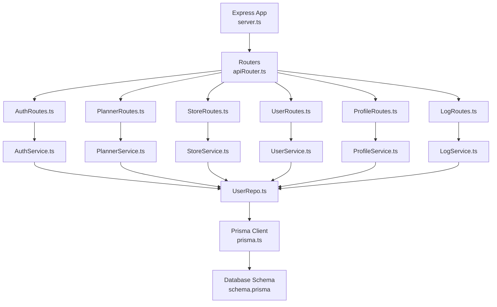

**Diagram sources**
- [server.ts](file://Backend/src/server.ts)
- [apiRouter.ts](file://Backend/src/routes/apiRouter.ts)
- [AuthRoutes.ts](file://Backend/src/routes/AuthRoutes.ts)
- [PlannerRoutes.ts](file://Backend/src/routes/PlannerRoutes.ts)
- [StoreRoutes.ts](file://Backend/src/routes/StoreRoutes.ts)
- [UserRoutes.ts](file://Backend/src/routes/UserRoutes.ts)
- [ProfileRoutes.ts](file://Backend/src/routes/ProfileRoutes.ts)
- [LogRoutes.ts](file://Backend/src/routes/LogRoutes.ts)
- [AuthService.ts](file://Backend/src/services/AuthService.ts)
- [PlannerService.ts](file://Backend/src/services/PlannerService.ts)
- [StoreService.ts](file://Backend/src/services/StoreService.ts)
- [UserService.ts](file://Backend/src/services/UserService.ts)
- [ProfileService.ts](file://Backend/src/services/ProfileService.ts)
- [LogService.ts](file://Backend/src/services/LogService.ts)
- [UserRepo.ts](file://Backend/src/repos/UserRepo.ts)
- [prisma.ts](file://Backend/src/repos/prisma.ts)
- [schema.prisma](file://Backend/prisma/schema.prisma)

**Section sources**
- [server.ts](file://Backend/src/server.ts)
- [apiRouter.ts](file://Backend/src/routes/apiRouter.ts)
- [schema.prisma](file://Backend/prisma/schema.prisma)

## Core Components
- Server Initialization: Express app setup, environment configuration, global middleware, and router mounting.
- Middleware Configuration: Request parsing, validation, authentication guards, and error-handling middleware.
- Error Handling Strategy: Centralized error responses with consistent status codes and messages.
- Routing Structure: Modular route files grouped by feature, mounted via a central apiRouter.
- Service Layer: Business logic encapsulated in dedicated services that coordinate repositories.
- Repository Pattern: Data access abstraction over Prisma ORM with a mock implementation for tests.
- Authentication Flow: Token-based authentication with guard middleware protecting routes.
- Logging Strategies: Structured logging via LogService and route-level logging.

**Section sources**
- [server.ts](file://Backend/src/server.ts)
- [apiRouter.ts](file://Backend/src/routes/apiRouter.ts)
- [auth.ts](file://Backend/src/routes/common/auth.ts)
- [route-errors.ts](file://Backend/src/common/utils/route-errors.ts)
- [HttpStatusCodes.ts](file://Backend/src/common/constants/HttpStatusCodes.ts)
- [LogService.ts](file://Backend/src/services/LogService.ts)

## Architecture Overview
The backend uses a clear separation of concerns:
- Express server initializes and configures middleware.
- Routers handle HTTP requests and map them to service methods.
- Services implement business rules and call repositories.
- Repositories interact with Prisma ORM for data operations.
- Prisma manages database schema and migrations.

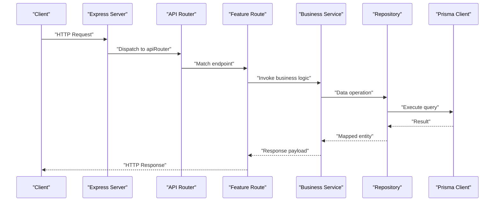

**Diagram sources**
- [server.ts](file://Backend/src/server.ts)
- [apiRouter.ts](file://Backend/src/routes/apiRouter.ts)
- [AuthRoutes.ts](file://Backend/src/routes/AuthRoutes.ts)
- [AuthService.ts](file://Backend/src/services/AuthService.ts)
- [UserRepo.ts](file://Backend/src/repos/UserRepo.ts)
- [prisma.ts](file://Backend/src/repos/prisma.ts)

## Detailed Component Analysis

### Server Initialization and Middleware
- Express app creation and configuration.
- Global middleware: JSON parsing, URL-encoded parsing, CORS, helmet, rate limiting (if configured).
- Environment variables loaded from common constants.
- Mounting of feature routers under a base path.
- Error-handling middleware registered last.

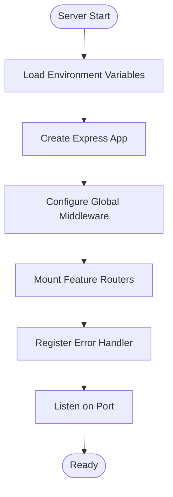

**Diagram sources**
- [server.ts](file://Backend/src/server.ts)
- [env.ts](file://Backend/src/common/constants/env.ts)

**Section sources**
- [server.ts](file://Backend/src/server.ts)
- [env.ts](file://Backend/src/common/constants/env.ts)

### Routing Structure
- Central apiRouter aggregates all feature routers.
- Each feature router defines endpoints and delegates to services.
- Common route utilities include request parsing and type definitions.

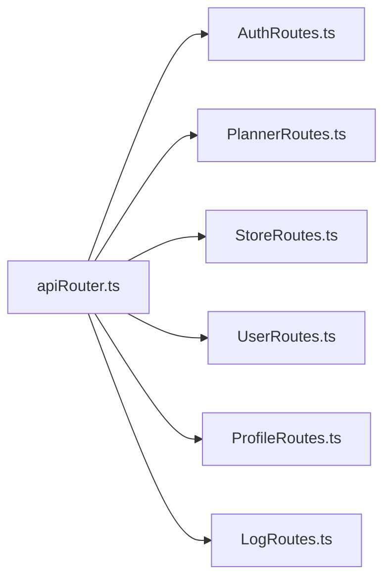

**Diagram sources**
- [apiRouter.ts](file://Backend/src/routes/apiRouter.ts)
- [AuthRoutes.ts](file://Backend/src/routes/AuthRoutes.ts)
- [PlannerRoutes.ts](file://Backend/src/routes/PlannerRoutes.ts)
- [StoreRoutes.ts](file://Backend/src/routes/StoreRoutes.ts)
- [UserRoutes.ts](file://Backend/src/routes/UserRoutes.ts)
- [ProfileRoutes.ts](file://Backend/src/routes/ProfileRoutes.ts)
- [LogRoutes.ts](file://Backend/src/routes/LogRoutes.ts)

**Section sources**
- [apiRouter.ts](file://Backend/src/routes/apiRouter.ts)
- [express-types.ts](file://Backend/src/routes/common/express-types.ts)
- [parseReq.ts](file://Backend/src/routes/common/parseReq.ts)

### Authentication Flow
- Guard middleware validates tokens and attaches user context.
- Protected routes require authentication before invoking services.
- Login/register flows create or verify credentials and issue tokens.

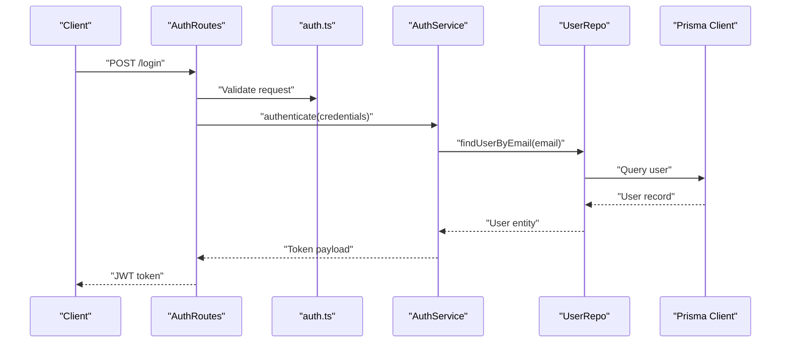

**Diagram sources**
- [AuthRoutes.ts](file://Backend/src/routes/AuthRoutes.ts)
- [auth.ts](file://Backend/src/routes/common/auth.ts)
- [AuthService.ts](file://Backend/src/services/AuthService.ts)
- [UserRepo.ts](file://Backend/src/repos/UserRepo.ts)
- [prisma.ts](file://Backend/src/repos/prisma.ts)

**Section sources**
- [AuthRoutes.ts](file://Backend/src/routes/AuthRoutes.ts)
- [auth.ts](file://Backend/src/routes/common/auth.ts)
- [AuthService.ts](file://Backend/src/services/AuthService.ts)

### Service Layer Architecture
- AuthService: Handles authentication and authorization logic.
- PlannerService: Implements meal planning algorithms and scheduling.
- StoreService: Manages store-related business operations.
- UserService: Encapsulates user CRUD and profile management.
- ProfileService: Handles profile-specific updates and validations.
- StatsService: Aggregates analytics and statistics.
- LogService: Provides structured logging across the application.

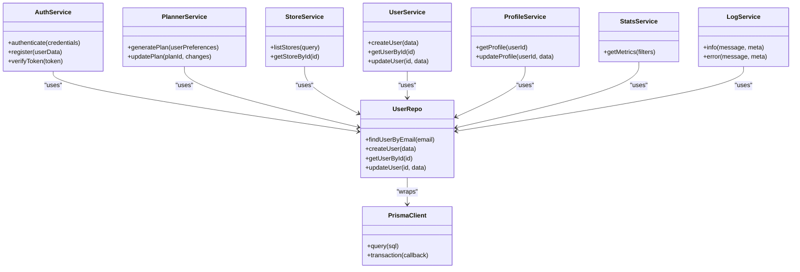

**Diagram sources**
- [AuthService.ts](file://Backend/src/services/AuthService.ts)
- [PlannerService.ts](file://Backend/src/services/PlannerService.ts)
- [StoreService.ts](file://Backend/src/services/StoreService.ts)
- [UserService.ts](file://Backend/src/services/UserService.ts)
- [ProfileService.ts](file://Backend/src/services/ProfileService.ts)
- [StatsService.ts](file://Backend/src/services/StatsService.ts)
- [LogService.ts](file://Backend/src/services/LogService.ts)
- [UserRepo.ts](file://Backend/src/repos/UserRepo.ts)
- [prisma.ts](file://Backend/src/repos/prisma.ts)

**Section sources**
- [AuthService.ts](file://Backend/src/services/AuthService.ts)
- [PlannerService.ts](file://Backend/src/services/PlannerService.ts)
- [StoreService.ts](file://Backend/src/services/StoreService.ts)
- [UserService.ts](file://Backend/src/services/UserService.ts)
- [ProfileService.ts](file://Backend/src/services/ProfileService.ts)
- [StatsService.ts](file://Backend/src/services/StatsService.ts)
- [LogService.ts](file://Backend/src/services/LogService.ts)

### Repository Pattern and Prisma ORM
- UserRepo implements repository methods for user data access.
- MockOrm provides a test double for repository operations.
- prisma.ts initializes and exports the Prisma client instance.
- Database configurations are stored in JSON files for different environments.

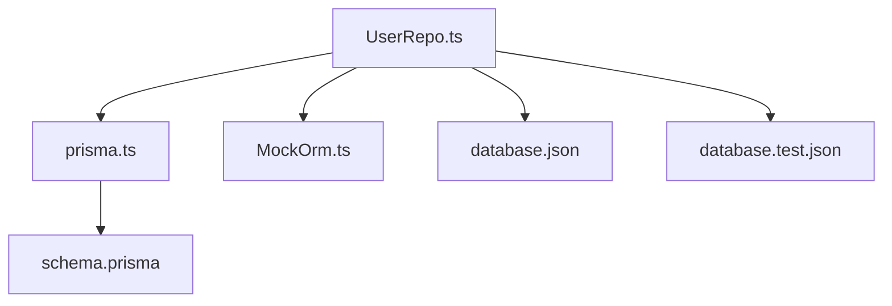

**Diagram sources**
- [UserRepo.ts](file://Backend/src/repos/UserRepo.ts)
- [prisma.ts](file://Backend/src/repos/prisma.ts)
- [MockOrm.ts](file://Backend/src/repos/MockOrm.ts)
- [database.json](file://Backend/src/repos/common/database.json)
- [database.test.json](file://Backend/src/repos/common/database.test.json)
- [schema.prisma](file://Backend/prisma/schema.prisma)

**Section sources**
- [UserRepo.ts](file://Backend/src/repos/UserRepo.ts)
- [prisma.ts](file://Backend/src/repos/prisma.ts)
- [MockOrm.ts](file://Backend/src/repos/MockOrm.ts)
- [database.json](file://Backend/src/repos/common/database.json)
- [database.test.json](file://Backend/src/repos/common/database.test.json)
- [schema.prisma](file://Backend/prisma/schema.prisma)

### Request Processing Pipeline
- Requests enter Express, pass through global middleware.
- Routers match endpoints and invoke service methods.
- Services validate inputs, perform business logic, and call repositories.
- Repositories execute queries via Prisma and return entities.
- Responses are standardized with consistent status codes and error formats.

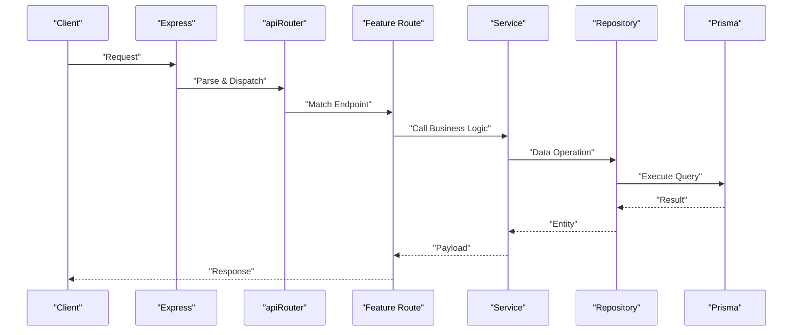

**Diagram sources**
- [server.ts](file://Backend/src/server.ts)
- [apiRouter.ts](file://Backend/src/routes/apiRouter.ts)
- [AuthService.ts](file://Backend/src/services/AuthService.ts)
- [UserRepo.ts](file://Backend/src/repos/UserRepo.ts)
- [prisma.ts](file://Backend/src/repos/prisma.ts)

**Section sources**
- [server.ts](file://Backend/src/server.ts)
- [apiRouter.ts](file://Backend/src/routes/apiRouter.ts)
- [AuthService.ts](file://Backend/src/services/AuthService.ts)
- [UserRepo.ts](file://Backend/src/repos/UserRepo.ts)
- [prisma.ts](file://Backend/src/repos/prisma.ts)

### Logging Strategies
- LogService provides structured logging methods for info and error levels.
- Route handlers log incoming requests and outgoing responses.
- Errors are captured and logged with contextual metadata.

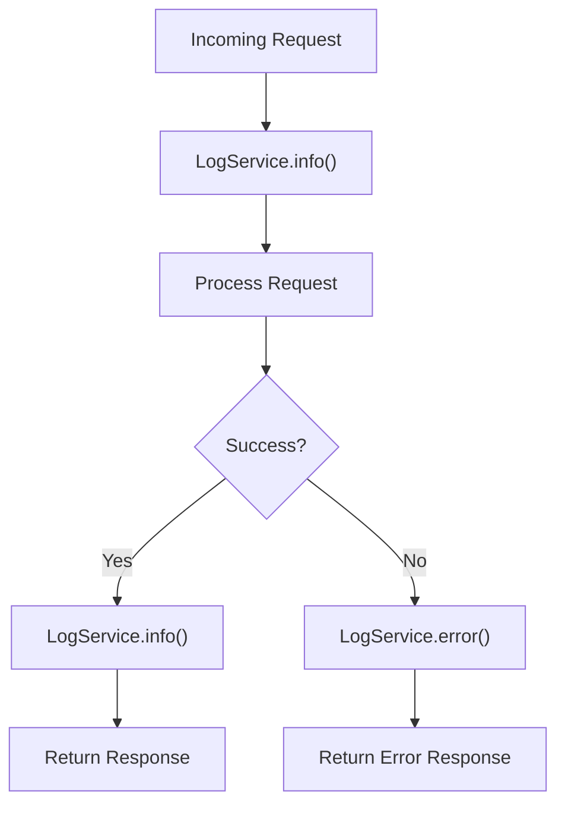

**Diagram sources**
- [LogService.ts](file://Backend/src/services/LogService.ts)
- [route-errors.ts](file://Backend/src/common/utils/route-errors.ts)

**Section sources**
- [LogService.ts](file://Backend/src/services/LogService.ts)
- [route-errors.ts](file://Backend/src/common/utils/route-errors.ts)

## Dependency Analysis
- Express depends on routers which depend on services.
- Services depend on repositories for data access.
- Repositories depend on Prisma ORM for database operations.
- Common utilities provide shared functionality across layers.

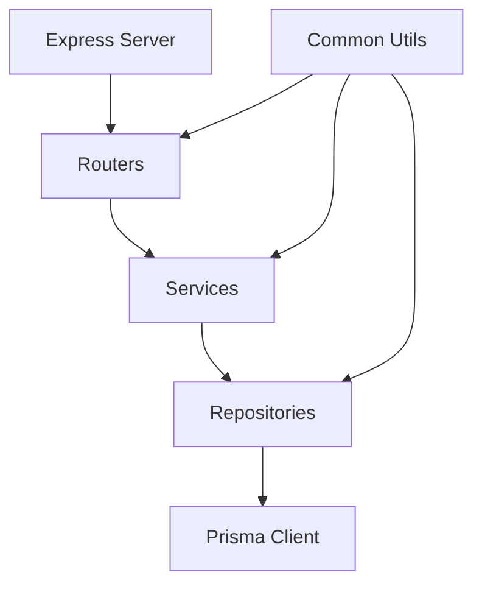

**Diagram sources**
- [server.ts](file://Backend/src/server.ts)
- [apiRouter.ts](file://Backend/src/routes/apiRouter.ts)
- [AuthService.ts](file://Backend/src/services/AuthService.ts)
- [UserRepo.ts](file://Backend/src/repos/UserRepo.ts)
- [prisma.ts](file://Backend/src/repos/prisma.ts)

**Section sources**
- [server.ts](file://Backend/src/server.ts)
- [apiRouter.ts](file://Backend/src/routes/apiRouter.ts)
- [AuthService.ts](file://Backend/src/services/AuthService.ts)
- [UserRepo.ts](file://Backend/src/repos/UserRepo.ts)
- [prisma.ts](file://Backend/src/repos/prisma.ts)

## Performance Considerations
- Use connection pooling with Prisma for efficient database access.
- Implement caching strategies for frequently accessed data.
- Optimize queries with proper indexing and selective field retrieval.
- Avoid unnecessary object transformations between layers.
- Monitor memory usage and garbage collection patterns.
- Consider async processing for heavy computations like meal planning.

[No sources needed since this section provides general guidance]

## Troubleshooting Guide
- Check environment variables for correct database URLs and secrets.
- Verify Prisma migrations are applied and schema matches the database.
- Inspect logs for detailed error messages and stack traces.
- Validate input data using provided validators.
- Test repository methods with MockOrm in isolation.
- Review HTTP status codes and error response formats.

**Section sources**
- [route-errors.ts](file://Backend/src/common/utils/route-errors.ts)
- [validators.ts](file://Backend/src/common/utils/validators.ts)
- [HttpStatusCodes.ts](file://Backend/src/common/constants/HttpStatusCodes.ts)
- [MockOrm.ts](file://Backend/src/repos/MockOrm.ts)

## Conclusion
The StudentBite backend follows a well-structured, layered architecture with clear separation of concerns. The Express server initializes middleware and routes, services encapsulate business logic, and repositories abstract data access through Prisma ORM. Authentication is handled securely with token-based guards, and logging provides comprehensive visibility into application behavior. This design promotes maintainability, testability, and scalability.

[No sources needed since this section summarizes without analyzing specific files]

## Appendices

### Database Schema Overview
The Prisma schema defines core entities and relationships used throughout the application.

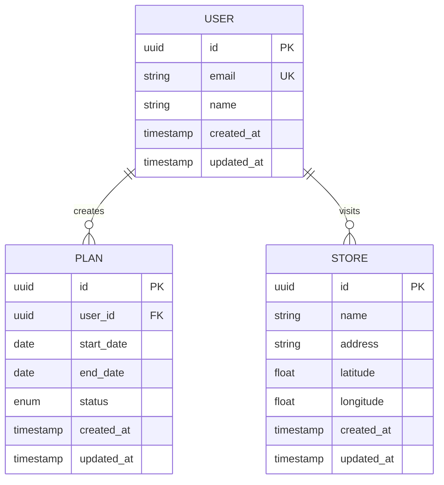

**Diagram sources**
- [schema.prisma](file://Backend/prisma/schema.prisma)

**Section sources**
- [schema.prisma](file://Backend/prisma/schema.prisma)
- [seed.ts](file://Backend/prisma/seed.ts)