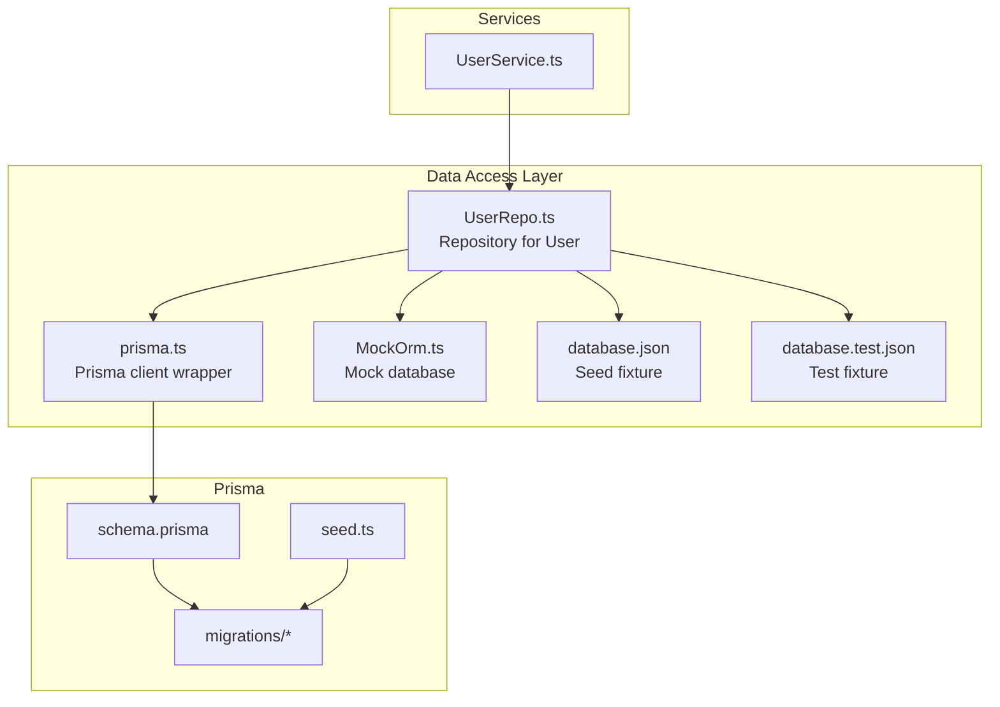
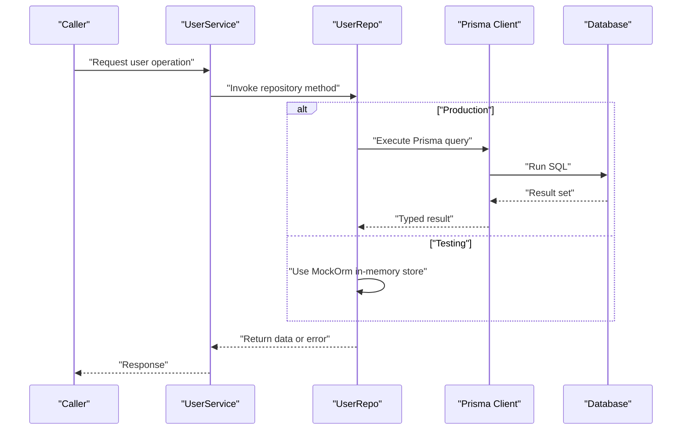
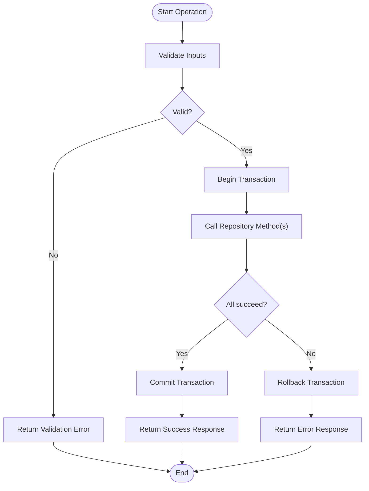
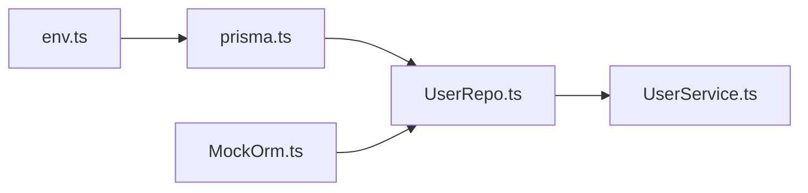

# Data Access Layer

<cite>
**Referenced Files in This Document**
- [schema.prisma](file://Backend/prisma/schema.prisma)
- [seed.ts](file://Backend/prisma/seed.ts)
- [migration.sql](file://Backend/prisma/migrations/20260801133844_init/migration.sql)
- [prisma.ts](file://Backend/src/repos/prisma.ts)
- [MockOrm.ts](file://Backend/src/repos/MockOrm.ts)
- [UserRepo.ts](file://Backend/src/repos/UserRepo.ts)
- [database.json](file://Backend/src/repos/common/database.json)
- [database.test.json](file://Backend/src/repos/common/database.test.json)
- [UserService.ts](file://Backend/src/services/UserService.ts)
- [env.ts](file://Backend/src/common/constants/env.ts)
</cite>

## Table of Contents
1. [Introduction](#introduction)
2. [Project Structure](#project-structure)
3. [Core Components](#core-components)
4. [Architecture Overview](#architecture-overview)
5. [Detailed Component Analysis](#detailed-component-analysis)
6. [Dependency Analysis](#dependency-analysis)
7. [Performance Considerations](#performance-considerations)
8. [Troubleshooting Guide](#troubleshooting-guide)
9. [Conclusion](#conclusion)

## Introduction
This document explains the data access layer implemented with the repository pattern and Prisma ORM. It covers database connection management, query building, transaction handling, and a mock database implementation for testing. It also documents the Prisma schema design, migration strategy, seed data management, and data validation patterns. Examples include CRUD operations, complex queries, and optimization techniques used throughout the backend.

## Project Structure
The data access layer is organized under Backend/src/repos and Backend/prisma:
- Prisma configuration and migrations live under Backend/prisma.
- Repository implementations and the Prisma client wrapper are under Backend/src/repos.
- Services consume repositories to implement business logic.
- Common constants (including environment variables) are under Backend/src/common/constants.

**Diagram sources**
- [schema.prisma](file://Backend/prisma/schema.prisma)
- [seed.ts](file://Backend/prisma/seed.ts)
- [prisma.ts](file://Backend/src/repos/prisma.ts)
- [MockOrm.ts](file://Backend/src/repos/MockOrm.ts)
- [UserRepo.ts](file://Backend/src/repos/UserRepo.ts)
- [database.json](file://Backend/src/repos/common/database.json)
- [database.test.json](file://Backend/src/repos/common/database.test.json)
- [UserService.ts](file://Backend/src/services/UserService.ts)

**Section sources**
- [schema.prisma](file://Backend/prisma/schema.prisma)
- [seed.ts](file://Backend/prisma/seed.ts)
- [prisma.ts](file://Backend/src/repos/prisma.ts)
- [MockOrm.ts](file://Backend/src/repos/MockOrm.ts)
- [UserRepo.ts](file://Backend/src/repos/UserRepo.ts)
- [database.json](file://Backend/src/repos/common/database.json)
- [database.test.json](file://Backend/src/repos/common/database.test.json)
- [UserService.ts](file://Backend/src/services/UserService.ts)

## Core Components
- Prisma Client wrapper: Centralizes connection lifecycle and provides a typed client instance.
- Repository interface and implementation: Encapsulates all data operations for an entity (e.g., User).
- Mock ORM: In-memory store that mimics the repository interface for tests.
- Seed fixtures: JSON files used to populate the mock database or test databases.
- Service layer: Consumes repositories to implement domain logic and orchestrate transactions.

Key responsibilities:
- Connection management via environment-driven configuration.
- Query building using Prisma’s type-safe API.
- Transaction boundaries managed at the repository or service level.
- Testability through a pluggable mock implementation.

**Section sources**
- [prisma.ts](file://Backend/src/repos/prisma.ts)
- [UserRepo.ts](file://Backend/src/repos/UserRepo.ts)
- [MockOrm.ts](file://Backend/src/repos/MockOrm.ts)
- [database.json](file://Backend/src/repos/common/database.json)
- [database.test.json](file://Backend/src/repos/common/database.test.json)
- [UserService.ts](file://Backend/src/services/UserService.ts)

## Architecture Overview
The data access layer follows a layered architecture:
- Services call repositories.
- Repositories abstract the underlying storage (Prisma or mock).
- Prisma client manages connections and executes queries.
- Migrations and seeds maintain schema consistency and initial/test data.

**Diagram sources**
- [UserService.ts](file://Backend/src/services/UserService.ts)
- [UserRepo.ts](file://Backend/src/repos/UserRepo.ts)
- [prisma.ts](file://Backend/src/repos/prisma.ts)
- [MockOrm.ts](file://Backend/src/repos/MockOrm.ts)

## Detailed Component Analysis

### Prisma Schema Design
- The schema defines entities, relations, and constraints that drive code generation and type safety.
- Indexes and unique constraints are declared to support efficient queries and enforce data integrity.
- Enums and composite types model domain concepts consistently across the application.

Best practices applied:
- Explicit field types and defaults.
- Relations defined with clear foreign key semantics.
- Validation rules aligned with application constraints.

**Section sources**
- [schema.prisma](file://Backend/prisma/schema.prisma)

### Migration Strategy
- Migrations are stored under prisma/migrations and reflect incremental changes to the schema.
- Each migration contains a SQL file describing the transformation.
- The migration lock ensures deterministic execution across environments.

Operational flow:
- Modify schema.prisma.
- Generate migration files.
- Apply migrations to target databases.
- Keep migration_lock.toml under version control.

**Section sources**
- [schema.prisma](file://Backend/prisma/schema.prisma)
- [migration.sql](file://Backend/prisma/migrations/20260801133844_init/migration.sql)

### Seed Data Management
- Seed script populates initial or test data based on the current schema.
- JSON fixtures provide structured seed payloads for both production-like and test scenarios.
- Separation of database.json and database.test.json allows distinct datasets for different environments.

Usage patterns:
- Run seed during local development and CI pipelines.
- Use test fixtures to reset state before each test suite.

**Section sources**
- [seed.ts](file://Backend/prisma/seed.ts)
- [database.json](file://Backend/src/repos/common/database.json)
- [database.test.json](file://Backend/src/repos/common/database.test.json)

### Database Connection Management
- A centralized Prisma client instance is created and reused to avoid connection churn.
- Environment variables configure connection strings and pool settings.
- Graceful shutdown hooks ensure connections are closed when the process exits.

Configuration highlights:
- Read from env.ts for DATABASE_URL and other runtime settings.
- Optional logging and performance tuning flags.

**Section sources**
- [prisma.ts](file://Backend/src/repos/prisma.ts)
- [env.ts](file://Backend/src/common/constants/env.ts)

### Repository Pattern Implementation
- UserRepo encapsulates all user-related data operations behind a clean interface.
- Methods cover CRUD, filtering, sorting, and pagination.
- Transactions are exposed where multiple writes must be atomic.

Design considerations:
- Input validation occurs before issuing queries.
- Errors are normalized and propagated to services.
- The repository can be swapped with MockOrm in tests.

**Section sources**
- [UserRepo.ts](file://Backend/src/repos/UserRepo.ts)

### Mock Database Implementation
- MockOrm implements the same interface as the real repository to enable unit tests without a database.
- In-memory stores mimic collections with basic persistence within a process lifetime.
- Fixtures are loaded into the mock store to simulate realistic datasets.

Benefits:
- Fast, deterministic tests.
- Isolation from external dependencies.
- Easy assertion of side effects and state transitions.

**Section sources**
- [MockOrm.ts](file://Backend/src/repos/MockOrm.ts)
- [database.json](file://Backend/src/repos/common/database.json)
- [database.test.json](file://Backend/src/repos/common/database.test.json)

### Service Integration and Transactions
- UserService orchestrates business workflows by calling UserRepo methods.
- For multi-step operations, services wrap repository calls in transactions to ensure consistency.
- Error handling centralizes rollback and response formatting.

Typical flow:
- Validate inputs.
- Begin transaction.
- Execute repository operations.
- Commit or rollback based on outcome.
- Return standardized responses.

**Section sources**
- [UserService.ts](file://Backend/src/services/UserService.ts)
- [UserRepo.ts](file://Backend/src/repos/UserRepo.ts)

### Data Validation Patterns
- Input validation is performed prior to repository calls to prevent invalid states.
- Validation utilities enforce required fields, formats, and business rules.
- Errors are mapped to consistent HTTP or application-level error codes.

Patterns observed:
- Early return on validation failure.
- Centralized error mapping for callers.
- Reusable validators across endpoints and services.

**Section sources**
- [UserRepo.ts](file://Backend/src/repos/UserRepo.ts)
- [UserService.ts](file://Backend/src/services/UserService.ts)

### Example Workflows

#### CRUD Operations
- Create: Validate payload, insert via repository, return created entity.
- Read: Fetch by ID or list with filters; project only needed fields.
- Update: Load entity, apply partial updates, persist changes.
- Delete: Soft delete or hard delete depending on policy; cascade if needed.

Implementation references:
- [UserRepo.ts](file://Backend/src/repos/UserRepo.ts)

#### Complex Queries
- Joins and aggregations built with Prisma’s relation loading and groupBy.
- Pagination using skip/take or cursor-based approaches.
- Filtering and sorting with dynamic query builders.

Implementation references:
- [UserRepo.ts](file://Backend/src/repos/UserRepo.ts)

#### Transaction Handling
- Atomic sequences for create-then-link or update-then-audit steps.
- Rollback on any failure to maintain consistency.

Implementation references:
- [UserService.ts](file://Backend/src/services/UserService.ts)
- [UserRepo.ts](file://Backend/src/repos/UserRepo.ts)

**Diagram sources**
- [UserService.ts](file://Backend/src/services/UserService.ts)
- [UserRepo.ts](file://Backend/src/repos/UserRepo.ts)

## Dependency Analysis
The data access layer has clear separation of concerns:
- Services depend on repositories, not directly on Prisma.
- Repositories depend on the Prisma client wrapper or mock implementation.
- Configuration depends on environment variables.

**Diagram sources**
- [env.ts](file://Backend/src/common/constants/env.ts)
- [prisma.ts](file://Backend/src/repos/prisma.ts)
- [UserRepo.ts](file://Backend/src/repos/UserRepo.ts)
- [MockOrm.ts](file://Backend/src/repos/MockOrm.ts)
- [UserService.ts](file://Backend/src/services/UserService.ts)

**Section sources**
- [env.ts](file://Backend/src/common/constants/env.ts)
- [prisma.ts](file://Backend/src/repos/prisma.ts)
- [UserRepo.ts](file://Backend/src/repos/UserRepo.ts)
- [MockOrm.ts](file://Backend/src/repos/MockOrm.ts)
- [UserService.ts](file://Backend/src/services/UserService.ts)

## Performance Considerations
- Connection pooling: Configure pool size and timeouts via environment variables to match workload.
- Query projection: Select only necessary fields to reduce payload size.
- Indexing: Add indexes on frequently filtered or joined columns.
- Pagination: Use cursor-based pagination for large datasets.
- N+1 prevention: Use Prisma’s relation loading strategies to batch joins.
- Transaction batching: Group related writes to minimize round trips.

[No sources needed since this section provides general guidance]

## Troubleshooting Guide
Common issues and resolutions:
- Connection failures: Verify DATABASE_URL and network reachability; check pool limits.
- Migration errors: Ensure migration order and idempotency; review generated SQL.
- Seed mismatches: Align seed fixtures with current schema; re-run seed after schema changes.
- Mock inconsistencies: Ensure MockOrm reflects repository contract; refresh fixtures between tests.
- Validation errors: Inspect input shapes and validator rules; log detailed messages.

**Section sources**
- [prisma.ts](file://Backend/src/repos/prisma.ts)
- [schema.prisma](file://Backend/prisma/schema.prisma)
- [seed.ts](file://Backend/prisma/seed.ts)
- [MockOrm.ts](file://Backend/src/repos/MockOrm.ts)

## Conclusion
The data access layer combines Prisma ORM with a repository pattern to deliver a robust, testable, and maintainable approach to database interactions. Clear separation between services, repositories, and storage details enables focused development and reliable testing. With thoughtful schema design, disciplined migrations, and strategic use of transactions and indexing, the system supports scalable and performant data operations.