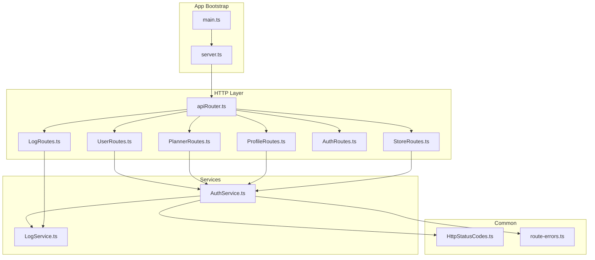
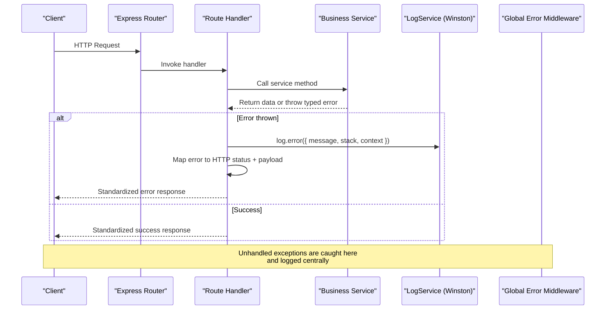
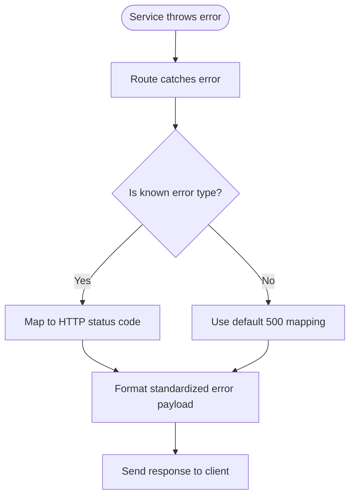
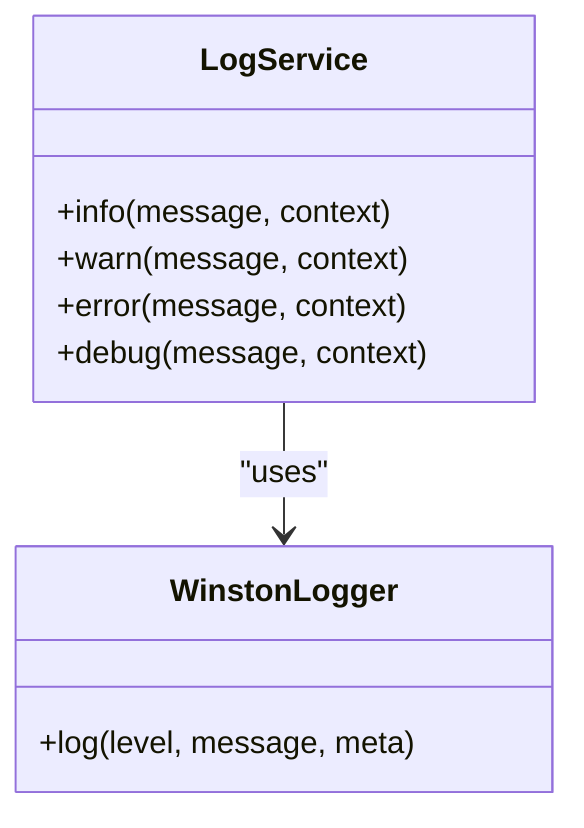
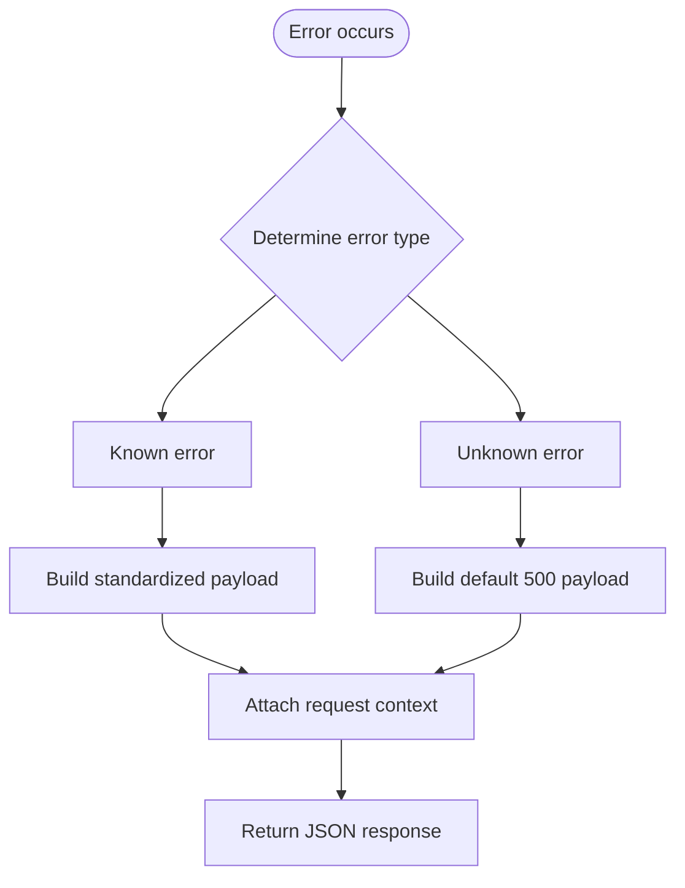
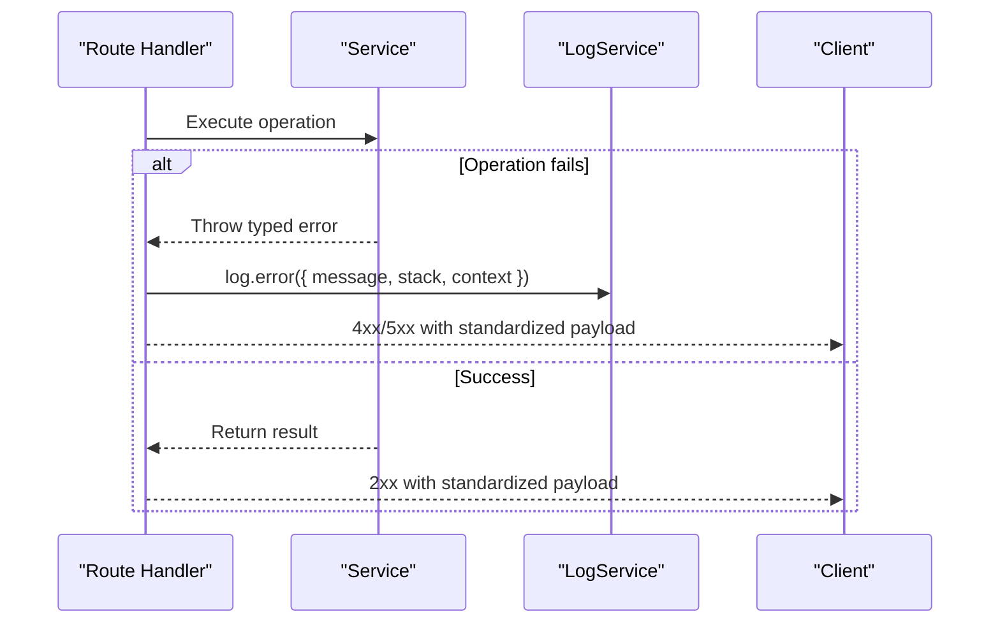
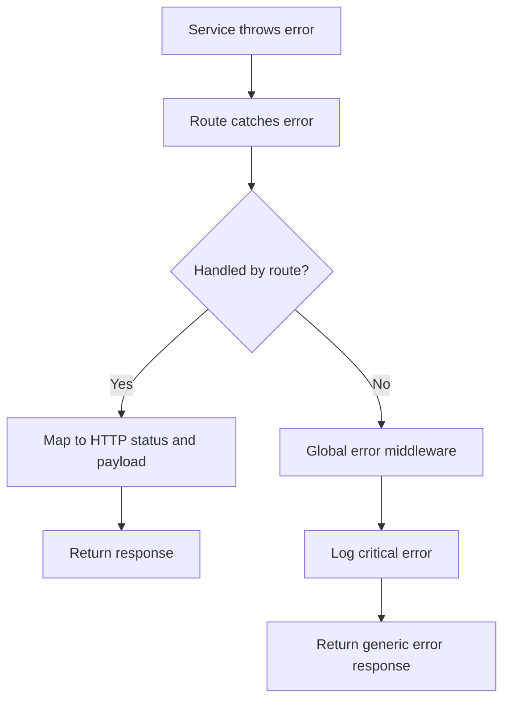
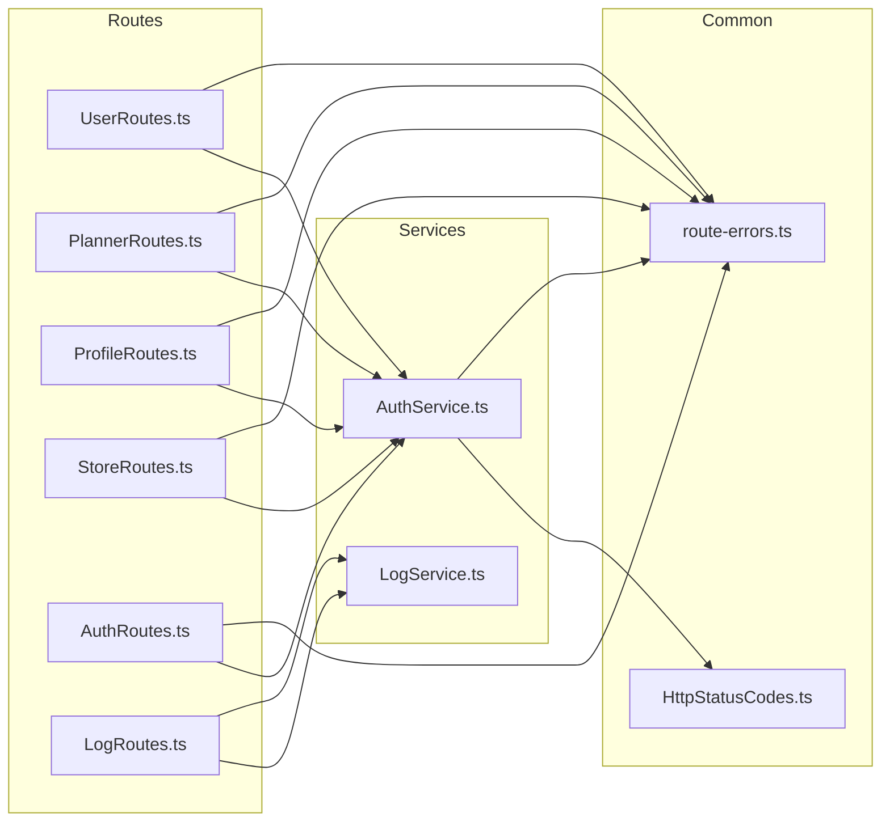

# Error Handling and Logging

<cite>
**Referenced Files in This Document**
- [main.ts](file://Backend/src/main.ts)
- [server.ts](file://Backend/src/server.ts)
- [route-errors.ts](file://Backend/src/common/utils/route-errors.ts)
- [HttpStatusCodes.ts](file://Backend/src/common/constants/HttpStatusCodes.ts)
- [LogService.ts](file://Backend/src/services/LogService.ts)
- [LogRoutes.ts](file://Backend/src/routes/LogRoutes.ts)
- [apiRouter.ts](file://Backend/src/routes/apiRouter.ts)
- [AuthService.ts](file://Backend/src/services/AuthService.ts)
- [UserRoutes.ts](file://Backend/src/routes/UserRoutes.ts)
- [PlannerRoutes.ts](file://Backend/src/routes/PlannerRoutes.ts)
- [ProfileRoutes.ts](file://Backend/src/routes/ProfileRoutes.ts)
- [StoreRoutes.ts](file://Backend/src/routes/StoreRoutes.ts)
- [AuthRoutes.ts](file://Backend/src/routes/AuthRoutes.ts)
</cite>

## Table of Contents
1. [Introduction](#introduction)
2. [Project Structure](#project-structure)
3. [Core Components](#core-components)
4. [Architecture Overview](#architecture-overview)
5. [Detailed Component Analysis](#detailed-component-analysis)
6. [Dependency Analysis](#dependency-analysis)
7. [Performance Considerations](#performance-considerations)
8. [Troubleshooting Guide](#troubleshooting-guide)
9. [Conclusion](#conclusion)

## Introduction
This document explains the centralized error handling strategy and logging implementation across the backend application. It covers custom error classes, HTTP status code mapping, error response formatting, structured logging with Winston, exception handling in routes and services, error propagation patterns, debugging techniques, and monitoring error rates. The goal is to provide a clear, consistent approach for raising, handling, and logging errors throughout the system.

## Project Structure
The error handling and logging features are implemented primarily in the Backend directory:
- Common utilities define HTTP status codes and route-level error helpers.
- Services encapsulate business logic and throw typed errors.
- Routes handle requests and delegate to services, catching and transforming errors into standardized responses.
- A dedicated logging service centralizes structured logs using Winston.
- An API router wires up routes and global error middleware.

**Diagram sources**
- [apiRouter.ts](file://Backend/src/routes/apiRouter.ts)
- [UserRoutes.ts](file://Backend/src/routes/UserRoutes.ts)
- [PlannerRoutes.ts](file://Backend/src/routes/PlannerRoutes.ts)
- [ProfileRoutes.ts](file://Backend/src/routes/ProfileRoutes.ts)
- [StoreRoutes.ts](file://Backend/src/routes/StoreRoutes.ts)
- [AuthRoutes.ts](file://Backend/src/routes/AuthRoutes.ts)
- [LogRoutes.ts](file://Backend/src/routes/LogRoutes.ts)
- [AuthService.ts](file://Backend/src/services/AuthService.ts)
- [LogService.ts](file://Backend/src/services/LogService.ts)
- [HttpStatusCodes.ts](file://Backend/src/common/constants/HttpStatusCodes.ts)
- [route-errors.ts](file://Backend/src/common/utils/route-errors.ts)
- [server.ts](file://Backend/src/server.ts)
- [main.ts](file://Backend/src/main.ts)

**Section sources**
- [apiRouter.ts](file://Backend/src/routes/apiRouter.ts)
- [server.ts](file://Backend/src/server.ts)
- [main.ts](file://Backend/src/main.ts)

## Core Components
- Custom error types and HTTP status mapping:
  - Centralized HTTP status constants ensure consistent status codes across the app.
  - Route-level error utilities standardize error payloads and status codes returned by controllers.
- Structured logging:
  - A logging service wraps Winston to emit structured logs with context (e.g., request ID, user ID).
- Global error middleware:
  - Express error handler normalizes unhandled exceptions into safe JSON responses and logs them centrally.
- Service-layer error propagation:
  - Services throw typed errors that propagate to routes, where they are caught and transformed into HTTP responses.

Key responsibilities:
- Define error shapes and status mappings in common utilities.
- Use the logging service consistently for all operational and error events.
- Ensure routes catch service errors and return standardized responses.
- Provide an endpoint for emitting logs from other services or external callers.

**Section sources**
- [HttpStatusCodes.ts](file://Backend/src/common/constants/HttpStatusCodes.ts)
- [route-errors.ts](file://Backend/src/common/utils/route-errors.ts)
- [LogService.ts](file://Backend/src/services/LogService.ts)
- [LogRoutes.ts](file://Backend/src/routes/LogRoutes.ts)

## Architecture Overview
The error handling architecture follows a layered pattern:
- Routes receive requests and call services.
- Services perform business logic and throw typed errors on failure.
- Routes catch errors, map them to HTTP status codes, and format responses.
- A global error middleware handles unexpected exceptions and ensures consistent logging and response shape.
- All components use the logging service to emit structured logs.

**Diagram sources**
- [apiRouter.ts](file://Backend/src/routes/apiRouter.ts)
- [UserRoutes.ts](file://Backend/src/routes/UserRoutes.ts)
- [AuthService.ts](file://Backend/src/services/AuthService.ts)
- [LogService.ts](file://Backend/src/services/LogService.ts)

## Detailed Component Analysis

### Custom Error Classes and HTTP Status Mapping
- Purpose:
  - Provide domain-specific error types with consistent properties (message, code, details).
  - Map internal errors to appropriate HTTP status codes for clients.
- Implementation highlights:
  - Centralized HTTP status constants define valid codes and groupings (client vs server errors).
  - Route error utilities convert service errors into standardized JSON responses with correct status codes.
- Usage pattern:
  - Services throw typed errors.
  - Routes catch these errors and use the utility to build the response.

**Diagram sources**
- [route-errors.ts](file://Backend/src/common/utils/route-errors.ts)
- [HttpStatusCodes.ts](file://Backend/src/common/constants/HttpStatusCodes.ts)

**Section sources**
- [HttpStatusCodes.ts](file://Backend/src/common/constants/HttpStatusCodes.ts)
- [route-errors.ts](file://Backend/src/common/utils/route-errors.ts)

### Structured Logging with Winston
- Purpose:
  - Emit consistent, searchable logs with contextual fields (timestamp, level, message, request metadata).
- Implementation highlights:
  - A logging service abstracts Winston configuration and provides methods for different severity levels.
  - Routes and services call the logging service for both operational and error events.
- Best practices:
  - Include correlation IDs (e.g., request ID) for tracing across layers.
  - Avoid logging sensitive data; sanitize inputs before logging.

**Diagram sources**
- [LogService.ts](file://Backend/src/services/LogService.ts)

**Section sources**
- [LogService.ts](file://Backend/src/services/LogService.ts)

### Error Response Formatting
- Purpose:
  - Ensure all error responses have a uniform structure for predictable client behavior.
- Implementation highlights:
  - Route error utilities enforce a consistent shape (status, message, code, optional details).
  - Global error middleware ensures even unhandled exceptions follow this shape.

**Diagram sources**
- [route-errors.ts](file://Backend/src/common/utils/route-errors.ts)

**Section sources**
- [route-errors.ts](file://Backend/src/common/utils/route-errors.ts)

### Exception Handling in Routes and Services
- Routes:
  - Wrap async handlers to catch thrown errors.
  - Map errors to HTTP status codes and formatted responses.
  - Log errors with context via the logging service.
- Services:
  - Throw typed errors for validation failures, not found cases, conflicts, etc.
  - Do not send HTTP responses directly; rely on routes for transport concerns.

**Diagram sources**
- [UserRoutes.ts](file://Backend/src/routes/UserRoutes.ts)
- [AuthService.ts](file://Backend/src/services/AuthService.ts)
- [LogService.ts](file://Backend/src/services/LogService.ts)

**Section sources**
- [UserRoutes.ts](file://Backend/src/routes/UserRoutes.ts)
- [AuthService.ts](file://Backend/src/services/AuthService.ts)

### Error Propagation Patterns
- Upward propagation:
  - Services throw typed errors; routes catch and transform them.
- Downward context:
  - Pass request-scoped context (e.g., request ID) through calls for traceability.
- Global fallback:
  - Global error middleware catches anything not handled explicitly and returns a safe response.

**Diagram sources**
- [apiRouter.ts](file://Backend/src/routes/apiRouter.ts)
- [route-errors.ts](file://Backend/src/common/utils/route-errors.ts)

**Section sources**
- [apiRouter.ts](file://Backend/src/routes/apiRouter.ts)
- [route-errors.ts](file://Backend/src/common/utils/route-errors.ts)

### Debugging Techniques
- Enable verbose logging in development:
  - Use debug-level logs for detailed traces around error paths.
- Correlation IDs:
  - Generate and attach request IDs to logs for end-to-end tracing.
- Inspect error payloads:
  - Validate that error responses include actionable messages and codes.
- Local reproduction:
  - Reproduce errors with minimal payloads and capture full stack traces.

[No sources needed since this section provides general guidance]

### Monitoring Error Rates
- Emit metrics alongside logs:
  - Increment counters per error code or category.
- Aggregate logs:
  - Forward logs to a central system for dashboards and alerts.
- Alerting:
  - Set thresholds for error rate spikes to trigger notifications.

[No sources needed since this section provides general guidance]

## Dependency Analysis
The following diagram shows how routes depend on services and common utilities, and how logging is integrated across layers.

**Diagram sources**
- [UserRoutes.ts](file://Backend/src/routes/UserRoutes.ts)
- [PlannerRoutes.ts](file://Backend/src/routes/PlannerRoutes.ts)
- [ProfileRoutes.ts](file://Backend/src/routes/ProfileRoutes.ts)
- [StoreRoutes.ts](file://Backend/src/routes/StoreRoutes.ts)
- [AuthRoutes.ts](file://Backend/src/routes/AuthRoutes.ts)
- [LogRoutes.ts](file://Backend/src/routes/LogRoutes.ts)
- [AuthService.ts](file://Backend/src/services/AuthService.ts)
- [LogService.ts](file://Backend/src/services/LogService.ts)
- [HttpStatusCodes.ts](file://Backend/src/common/constants/HttpStatusCodes.ts)
- [route-errors.ts](file://Backend/src/common/utils/route-errors.ts)

**Section sources**
- [UserRoutes.ts](file://Backend/src/routes/UserRoutes.ts)
- [PlannerRoutes.ts](file://Backend/src/routes/PlannerRoutes.ts)
- [ProfileRoutes.ts](file://Backend/src/routes/ProfileRoutes.ts)
- [StoreRoutes.ts](file://Backend/src/routes/StoreRoutes.ts)
- [AuthRoutes.ts](file://Backend/src/routes/AuthRoutes.ts)
- [LogRoutes.ts](file://Backend/src/routes/LogRoutes.ts)
- [AuthService.ts](file://Backend/src/services/AuthService.ts)
- [LogService.ts](file://Backend/src/services/LogService.ts)
- [HttpStatusCodes.ts](file://Backend/src/common/constants/HttpStatusCodes.ts)
- [route-errors.ts](file://Backend/src/common/utils/route-errors.ts)

## Performance Considerations
- Avoid heavy logging in hot paths:
  - Use sampling or conditional logging for high-frequency operations.
- Minimize object allocations in error paths:
  - Reuse error instances where possible to reduce GC pressure.
- Keep error payloads small:
  - Exclude large stacks in production unless necessary.
- Batch logs if supported by your sink:
  - Reduce I/O overhead by batching log writes.

[No sources needed since this section provides general guidance]

## Troubleshooting Guide
- Symptom: Missing or inconsistent error responses
  - Check route error mapping utilities and ensure all branches return standardized payloads.
- Symptom: Logs missing context
  - Verify that request-scoped context (e.g., request ID) is attached before calling the logging service.
- Symptom: Unhandled exceptions causing crashes
  - Confirm global error middleware is registered and catches all unhandled rejections.
- Symptom: High error rate alerts
  - Review recent deployments and correlated logs; look for new error codes or categories.

**Section sources**
- [route-errors.ts](file://Backend/src/common/utils/route-errors.ts)
- [LogService.ts](file://Backend/src/services/LogService.ts)
- [apiRouter.ts](file://Backend/src/routes/apiRouter.ts)

## Conclusion
The backend implements a robust, centralized error handling and logging strategy:
- Typed errors and consistent HTTP status mapping ensure predictable client behavior.
- Structured logging with Winston enables effective debugging and observability.
- Clear separation of concerns between services and routes simplifies maintenance and testing.
Adhering to these patterns will improve reliability, maintainability, and operational visibility across the application.