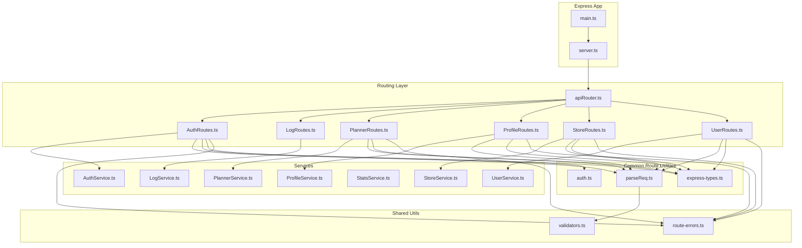
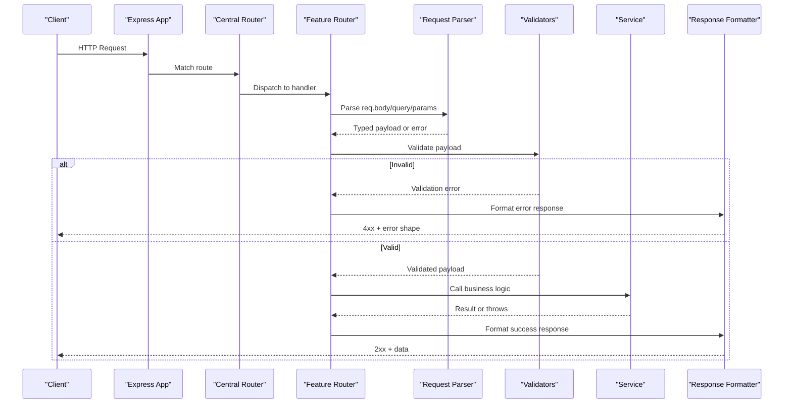
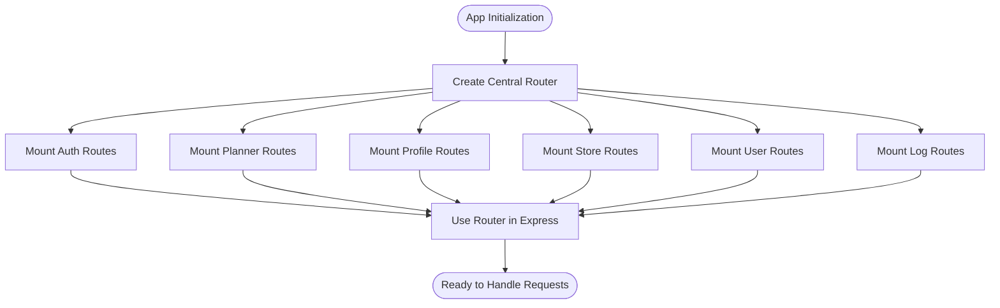
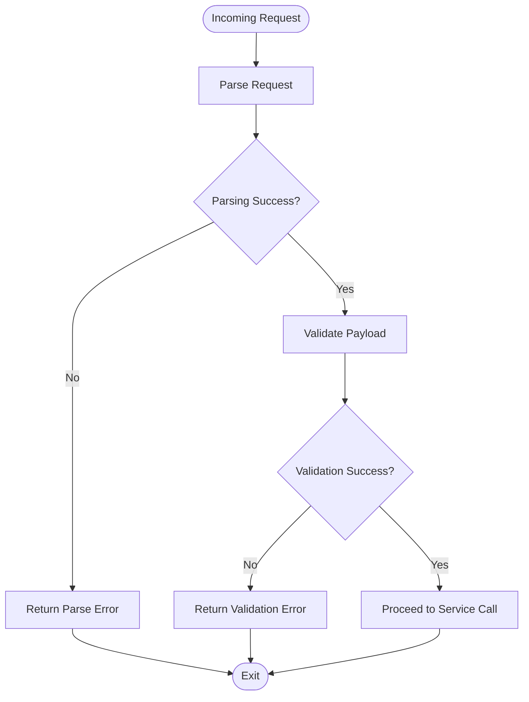
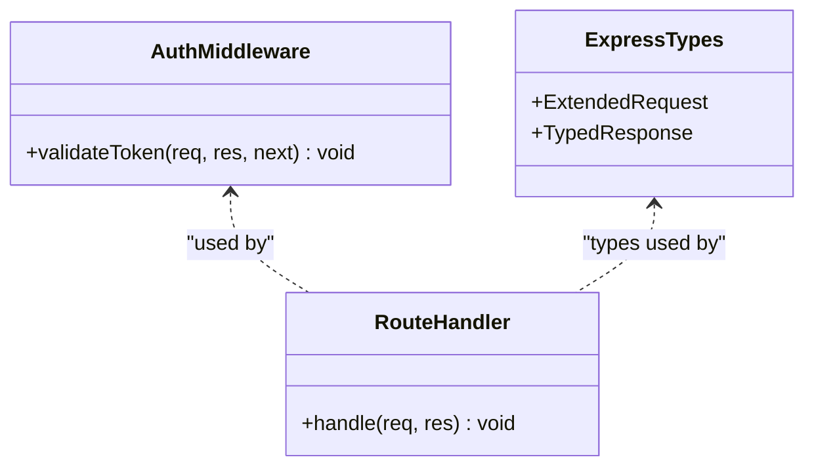
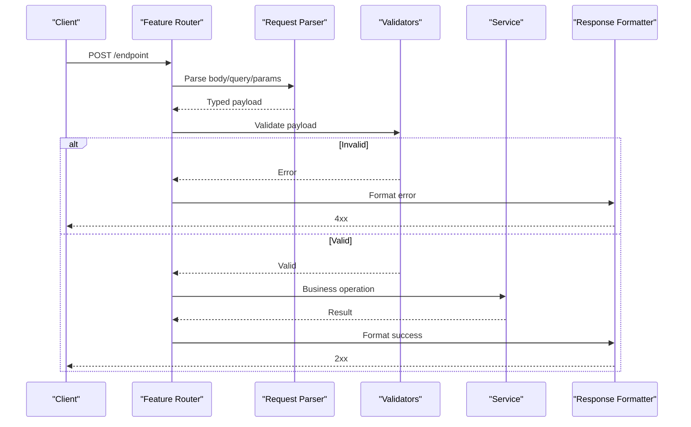
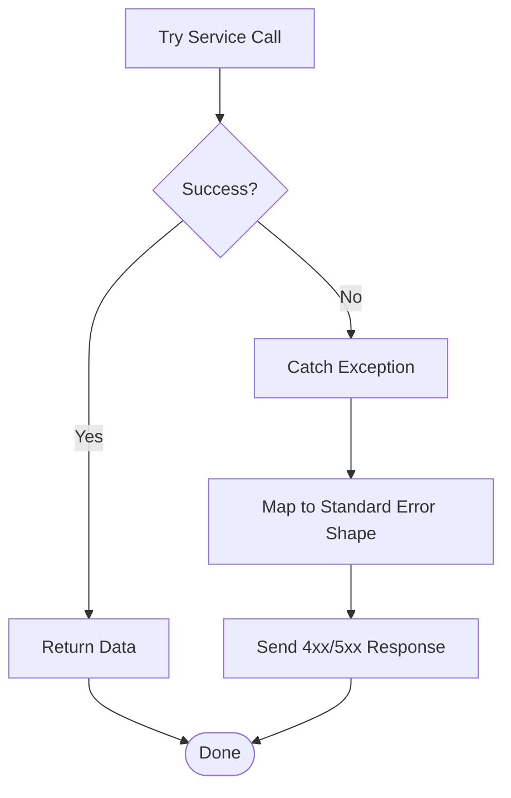
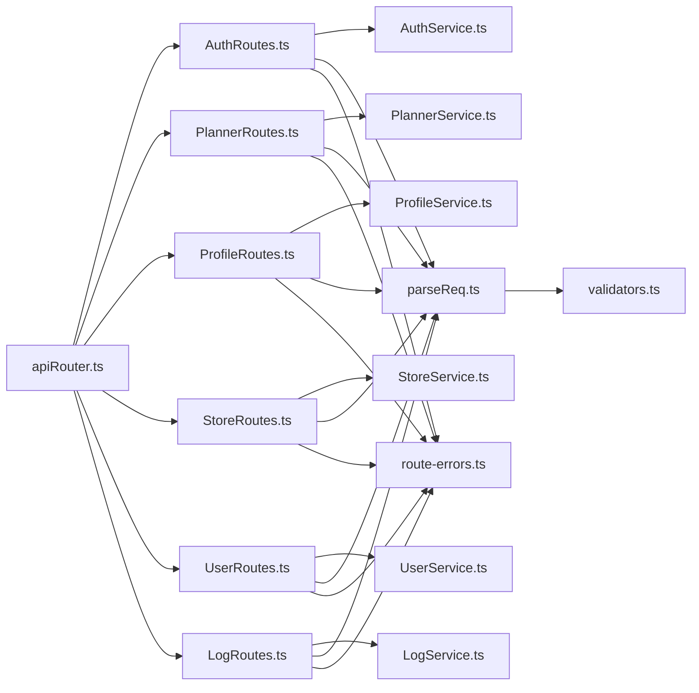

# Routing System

<cite>
**Referenced Files in This Document**
- [apiRouter.ts](file://Backend/src/routes/apiRouter.ts)
- [AuthRoutes.ts](file://Backend/src/routes/AuthRoutes.ts)
- [LogRoutes.ts](file://Backend/src/routes/LogRoutes.ts)
- [PlannerRoutes.ts](file://Backend/src/routes/PlannerRoutes.ts)
- [ProfileRoutes.ts](file://Backend/src/routes/ProfileRoutes.ts)
- [StoreRoutes.ts](file://Backend/src/routes/StoreRoutes.ts)
- [UserRoutes.ts](file://Backend/src/routes/UserRoutes.ts)
- [auth.ts](file://Backend/src/routes/common/auth.ts)
- [express-types.ts](file://Backend/src/routes/common/express-types.ts)
- [parseReq.ts](file://Backend/src/routes/common/parseReq.ts)
- [AuthService.ts](file://Backend/src/services/AuthService.ts)
- [LogService.ts](file://Backend/src/services/LogService.ts)
- [PlannerService.ts](file://Backend/src/services/PlannerService.ts)
- [ProfileService.ts](file://Backend/src/services/ProfileService.ts)
- [StatsService.ts](file://Backend/src/services/StatsService.ts)
- [StoreService.ts](file://Backend/src/services/StoreService.ts)
- [UserService.ts](file://Backend/src/services/UserService.ts)
- [route-errors.ts](file://Backend/src/common/utils/route-errors.ts)
- [validators.ts](file://Backend/src/common/utils/validators.ts)
- [main.ts](file://Backend/src/main.ts)
- [server.ts](file://Backend/src/server.ts)
</cite>

## Table of Contents
1. [Introduction](#introduction)
2. [Project Structure](#project-structure)
3. [Core Components](#core-components)
4. [Architecture Overview](#architecture-overview)
5. [Detailed Component Analysis](#detailed-component-analysis)
6. [Dependency Analysis](#dependency-analysis)
7. [Performance Considerations](#performance-considerations)
8. [Troubleshooting Guide](#troubleshooting-guide)
9. [Conclusion](#conclusion)
10. [Appendices](#appendices)

## Introduction
This document explains the Express.js routing system architecture used by the backend. It covers how routes are organized, how requests are parsed and validated, how responses are formatted, how routes connect to services, error handling strategies, and API versioning approaches. It also provides guidance on creating new endpoints following established patterns.

## Project Structure
The routing layer is implemented under Backend/src/routes with a central router that mounts feature-specific route modules. Common utilities for request parsing, authentication, and types live under Backend/src/routes/common. Services encapsulate business logic and data access, while shared utilities provide validation and error helpers.

**Diagram sources**
- [main.ts](file://Backend/src/main.ts)
- [server.ts](file://Backend/src/server.ts)
- [apiRouter.ts](file://Backend/src/routes/apiRouter.ts)
- [AuthRoutes.ts](file://Backend/src/routes/AuthRoutes.ts)
- [LogRoutes.ts](file://Backend/src/routes/LogRoutes.ts)
- [PlannerRoutes.ts](file://Backend/src/routes/PlannerRoutes.ts)
- [ProfileRoutes.ts](file://Backend/src/routes/ProfileRoutes.ts)
- [StoreRoutes.ts](file://Backend/src/routes/StoreRoutes.ts)
- [UserRoutes.ts](file://Backend/src/routes/UserRoutes.ts)
- [parseReq.ts](file://Backend/src/routes/common/parseReq.ts)
- [auth.ts](file://Backend/src/routes/common/auth.ts)
- [express-types.ts](file://Backend/src/routes/common/express-types.ts)
- [AuthService.ts](file://Backend/src/services/AuthService.ts)
- [LogService.ts](file://Backend/src/services/LogService.ts)
- [PlannerService.ts](file://Backend/src/services/PlannerService.ts)
- [ProfileService.ts](file://Backend/src/services/ProfileService.ts)
- [StatsService.ts](file://Backend/src/services/StatsService.ts)
- [StoreService.ts](file://Backend/src/services/StoreService.ts)
- [UserService.ts](file://Backend/src/services/UserService.ts)
- [validators.ts](file://Backend/src/common/utils/validators.ts)
- [route-errors.ts](file://Backend/src/common/utils/route-errors.ts)

**Section sources**
- [apiRouter.ts](file://Backend/src/routes/apiRouter.ts)
- [AuthRoutes.ts](file://Backend/src/routes/AuthRoutes.ts)
- [LogRoutes.ts](file://Backend/src/routes/LogRoutes.ts)
- [PlannerRoutes.ts](file://Backend/src/routes/PlannerRoutes.ts)
- [ProfileRoutes.ts](file://Backend/src/routes/ProfileRoutes.ts)
- [StoreRoutes.ts](file://Backend/src/routes/StoreRoutes.ts)
- [UserRoutes.ts](file://Backend/src/routes/UserRoutes.ts)
- [parseReq.ts](file://Backend/src/routes/common/parseReq.ts)
- [auth.ts](file://Backend/src/routes/common/auth.ts)
- [express-types.ts](file://Backend/src/routes/common/express-types.ts)
- [AuthService.ts](file://Backend/src/services/AuthService.ts)
- [LogService.ts](file://Backend/src/services/LogService.ts)
- [PlannerService.ts](file://Backend/src/services/PlannerService.ts)
- [ProfileService.ts](file://Backend/src/services/ProfileService.ts)
- [StatsService.ts](file://Backend/src/services/StatsService.ts)
- [StoreService.ts](file://Backend/src/services/StoreService.ts)
- [UserService.ts](file://Backend/src/services/UserService.ts)
- [validators.ts](file://Backend/src/common/utils/validators.ts)
- [route-errors.ts](file://Backend/src/common/utils/route-errors.ts)
- [main.ts](file://Backend/src/main.ts)
- [server.ts](file://Backend/src/server.ts)

## Core Components
- Central Router: A single router module aggregates and mounts all feature routers, providing a consistent base path and enabling versioned prefixes if needed.
- Feature Routers: Each domain (Auth, Planner, Profile, Store, User, Log) has its own router file defining HTTP verbs, paths, and handlers.
- Request Parsing: A shared utility normalizes and extracts body, query, params, and headers, returning typed payloads or errors.
- Validation: Shared validators enforce input schemas before calling service methods.
- Response Formatting: Routes return structured JSON responses with consistent status codes and error shapes.
- Error Handling: Centralized error utilities standardize error responses and logging.
- Service Integration: Routes delegate business logic to corresponding service modules.

Key responsibilities:
- Route files define endpoints and orchestrate parsing/validation, service calls, and response formatting.
- Services implement domain logic and data access.
- Common utilities ensure consistency across routes.

**Section sources**
- [apiRouter.ts](file://Backend/src/routes/apiRouter.ts)
- [AuthRoutes.ts](file://Backend/src/routes/AuthRoutes.ts)
- [PlannerRoutes.ts](file://Backend/src/routes/PlannerRoutes.ts)
- [ProfileRoutes.ts](file://Backend/src/routes/ProfileRoutes.ts)
- [StoreRoutes.ts](file://Backend/src/routes/StoreRoutes.ts)
- [UserRoutes.ts](file://Backend/src/routes/UserRoutes.ts)
- [parseReq.ts](file://Backend/src/routes/common/parseReq.ts)
- [validators.ts](file://Backend/src/common/utils/validators.ts)
- [route-errors.ts](file://Backend/src/common/utils/route-errors.ts)

## Architecture Overview
The routing architecture follows a layered approach:
- Entry points initialize the Express app and mount the central router.
- The central router mounts feature routers under a common prefix.
- Each feature router defines endpoints that parse inputs, validate them, call services, and format responses.
- Services encapsulate business logic and interact with repositories or external systems.
- Shared utilities provide consistent parsing, validation, and error handling.

**Diagram sources**
- [apiRouter.ts](file://Backend/src/routes/apiRouter.ts)
- [AuthRoutes.ts](file://Backend/src/routes/AuthRoutes.ts)
- [PlannerRoutes.ts](file://Backend/src/routes/PlannerRoutes.ts)
- [ProfileRoutes.ts](file://Backend/src/routes/ProfileRoutes.ts)
- [StoreRoutes.ts](file://Backend/src/routes/StoreRoutes.ts)
- [UserRoutes.ts](file://Backend/src/routes/UserRoutes.ts)
- [parseReq.ts](file://Backend/src/routes/common/parseReq.ts)
- [validators.ts](file://Backend/src/common/utils/validators.ts)
- [AuthService.ts](file://Backend/src/services/AuthService.ts)
- [PlannerService.ts](file://Backend/src/services/PlannerService.ts)
- [ProfileService.ts](file://Backend/src/services/ProfileService.ts)
- [StoreService.ts](file://Backend/src/services/StoreService.ts)
- [UserService.ts](file://Backend/src/services/UserService.ts)

## Detailed Component Analysis

### Central Router and Mounting Strategy
- Purpose: Aggregates feature routers and applies a common base path.
- Behavior: Exports an Express router instance; feature routers are mounted under this instance.
- Versioning: If API versioning is required, it can be applied at this level by mounting versioned prefixes.

**Diagram sources**
- [apiRouter.ts](file://Backend/src/routes/apiRouter.ts)
- [AuthRoutes.ts](file://Backend/src/routes/AuthRoutes.ts)
- [PlannerRoutes.ts](file://Backend/src/routes/PlannerRoutes.ts)
- [ProfileRoutes.ts](file://Backend/src/routes/ProfileRoutes.ts)
- [StoreRoutes.ts](file://Backend/src/routes/StoreRoutes.ts)
- [UserRoutes.ts](file://Backend/src/routes/UserRoutes.ts)
- [LogRoutes.ts](file://Backend/src/routes/LogRoutes.ts)

**Section sources**
- [apiRouter.ts](file://Backend/src/routes/apiRouter.ts)

### Request Parsing and Validation Pipeline
- Parsing: The shared parser extracts and normalizes request parts into typed structures.
- Validation: Validators enforce schema constraints and return standardized errors.
- Flow: Routes call the parser first, then validators, ensuring only valid payloads reach services.

**Diagram sources**
- [parseReq.ts](file://Backend/src/routes/common/parseReq.ts)
- [validators.ts](file://Backend/src/common/utils/validators.ts)

**Section sources**
- [parseReq.ts](file://Backend/src/routes/common/parseReq.ts)
- [validators.ts](file://Backend/src/common/utils/validators.ts)

### Authentication Middleware and Types
- Authentication: Common middleware validates tokens and attaches user context to requests.
- Types: Shared Express type extensions ensure consistent typing across route handlers.

**Diagram sources**
- [auth.ts](file://Backend/src/routes/common/auth.ts)
- [express-types.ts](file://Backend/src/routes/common/express-types.ts)

**Section sources**
- [auth.ts](file://Backend/src/routes/common/auth.ts)
- [express-types.ts](file://Backend/src/routes/common/express-types.ts)

### Feature Routers and Service Integration
Each feature router defines endpoints and delegates to services:
- Auth: Handles login, registration, token management via AuthService.
- Planner: Manages planning operations via PlannerService.
- Profile: Updates and retrieves user profiles via ProfileService.
- Store: Interacts with store-related data via StoreService.
- User: CRUD operations for users via UserService.
- Log: Logging endpoints via LogService.

**Diagram sources**
- [AuthRoutes.ts](file://Backend/src/routes/AuthRoutes.ts)
- [PlannerRoutes.ts](file://Backend/src/routes/PlannerRoutes.ts)
- [ProfileRoutes.ts](file://Backend/src/routes/ProfileRoutes.ts)
- [StoreRoutes.ts](file://Backend/src/routes/StoreRoutes.ts)
- [UserRoutes.ts](file://Backend/src/routes/UserRoutes.ts)
- [LogRoutes.ts](file://Backend/src/routes/LogRoutes.ts)
- [parseReq.ts](file://Backend/src/routes/common/parseReq.ts)
- [validators.ts](file://Backend/src/common/utils/validators.ts)
- [AuthService.ts](file://Backend/src/services/AuthService.ts)
- [PlannerService.ts](file://Backend/src/services/PlannerService.ts)
- [ProfileService.ts](file://Backend/src/services/ProfileService.ts)
- [StoreService.ts](file://Backend/src/services/StoreService.ts)
- [UserService.ts](file://Backend/src/services/UserService.ts)
- [LogService.ts](file://Backend/src/services/LogService.ts)

**Section sources**
- [AuthRoutes.ts](file://Backend/src/routes/AuthRoutes.ts)
- [PlannerRoutes.ts](file://Backend/src/routes/PlannerRoutes.ts)
- [ProfileRoutes.ts](file://Backend/src/routes/ProfileRoutes.ts)
- [StoreRoutes.ts](file://Backend/src/routes/StoreRoutes.ts)
- [UserRoutes.ts](file://Backend/src/routes/UserRoutes.ts)
- [LogRoutes.ts](file://Backend/src/routes/LogRoutes.ts)
- [AuthService.ts](file://Backend/src/services/AuthService.ts)
- [PlannerService.ts](file://Backend/src/services/PlannerService.ts)
- [ProfileService.ts](file://Backend/src/services/ProfileService.ts)
- [StoreService.ts](file://Backend/src/services/StoreService.ts)
- [UserService.ts](file://Backend/src/services/UserService.ts)
- [LogService.ts](file://Backend/src/services/LogService.ts)

### Error Handling Patterns
- Standardized Errors: Shared utilities define error shapes and status codes.
- Route-Level Handling: Routes catch service exceptions and convert them to consistent JSON responses.
- Global Handling: Application-level error middleware ensures unhandled errors are formatted uniformly.

**Diagram sources**
- [route-errors.ts](file://Backend/src/common/utils/route-errors.ts)

**Section sources**
- [route-errors.ts](file://Backend/src/common/utils/route-errors.ts)

### API Versioning Approaches
- Base Path Versioning: Mount routers under versioned prefixes (e.g., /api/v1).
- Header-Based Versioning: Accept version headers and dispatch accordingly.
- Content Negotiation: Use Accept headers to select versions.

Implementation options:
- Central Router: Add versioned mounts for each API version.
- Feature Routers: Keep version-specific routes within feature modules if needed.

[No sources needed since this section provides general guidance]

## Dependency Analysis
The routing layer depends on:
- Central router for mounting feature routers.
- Request parser and validators for input normalization and validation.
- Services for business logic.
- Shared error utilities for consistent error responses.

**Diagram sources**
- [apiRouter.ts](file://Backend/src/routes/apiRouter.ts)
- [AuthRoutes.ts](file://Backend/src/routes/AuthRoutes.ts)
- [PlannerRoutes.ts](file://Backend/src/routes/PlannerRoutes.ts)
- [ProfileRoutes.ts](file://Backend/src/routes/ProfileRoutes.ts)
- [StoreRoutes.ts](file://Backend/src/routes/StoreRoutes.ts)
- [UserRoutes.ts](file://Backend/src/routes/UserRoutes.ts)
- [LogRoutes.ts](file://Backend/src/routes/LogRoutes.ts)
- [parseReq.ts](file://Backend/src/routes/common/parseReq.ts)
- [validators.ts](file://Backend/src/common/utils/validators.ts)
- [route-errors.ts](file://Backend/src/common/utils/route-errors.ts)
- [AuthService.ts](file://Backend/src/services/AuthService.ts)
- [PlannerService.ts](file://Backend/src/services/PlannerService.ts)
- [ProfileService.ts](file://Backend/src/services/ProfileService.ts)
- [StoreService.ts](file://Backend/src/services/StoreService.ts)
- [UserService.ts](file://Backend/src/services/UserService.ts)
- [LogService.ts](file://Backend/src/services/LogService.ts)

**Section sources**
- [apiRouter.ts](file://Backend/src/routes/apiRouter.ts)
- [AuthRoutes.ts](file://Backend/src/routes/AuthRoutes.ts)
- [PlannerRoutes.ts](file://Backend/src/routes/PlannerRoutes.ts)
- [ProfileRoutes.ts](file://Backend/src/routes/ProfileRoutes.ts)
- [StoreRoutes.ts](file://Backend/src/routes/StoreRoutes.ts)
- [UserRoutes.ts](file://Backend/src/routes/UserRoutes.ts)
- [LogRoutes.ts](file://Backend/src/routes/LogRoutes.ts)
- [parseReq.ts](file://Backend/src/routes/common/parseReq.ts)
- [validators.ts](file://Backend/src/common/utils/validators.ts)
- [route-errors.ts](file://Backend/src/common/utils/route-errors.ts)
- [AuthService.ts](file://Backend/src/services/AuthService.ts)
- [PlannerService.ts](file://Backend/src/services/PlannerService.ts)
- [ProfileService.ts](file://Backend/src/services/ProfileService.ts)
- [StoreService.ts](file://Backend/src/services/StoreService.ts)
- [UserService.ts](file://Backend/src/services/UserService.ts)
- [LogService.ts](file://Backend/src/services/LogService.ts)

## Performance Considerations
- Minimize parsing overhead: Reuse parsers and avoid redundant transformations.
- Validate early: Fail fast with clear errors to reduce downstream work.
- Avoid blocking operations in routes: Delegate heavy tasks to services and consider async processing where appropriate.
- Cache frequently accessed data in services when safe.
- Keep route handlers thin: Focus on orchestration, not business logic.

[No sources needed since this section provides general guidance]

## Troubleshooting Guide
Common issues and resolutions:
- Invalid Input: Ensure parsers and validators are configured correctly and handle edge cases.
- Authentication Failures: Verify token validation middleware and header usage.
- Service Errors: Inspect service logs and map exceptions to standard error shapes.
- Response Mismatches: Confirm response formatting matches client expectations.

Debugging steps:
- Enable detailed logging in route handlers and services.
- Use test suites to validate parsing and validation flows.
- Check global error middleware for unhandled exceptions.

**Section sources**
- [route-errors.ts](file://Backend/src/common/utils/route-errors.ts)
- [parseReq.ts](file://Backend/src/routes/common/parseReq.ts)
- [validators.ts](file://Backend/src/common/utils/validators.ts)

## Conclusion
The Express.js routing system is organized around a central router that mounts feature-specific routers. Each route parses and validates inputs, delegates to services, and formats responses consistently. Shared utilities ensure uniform behavior across endpoints. Following these patterns simplifies adding new endpoints and maintaining consistency.

[No sources needed since this section summarizes without analyzing specific files]

## Appendices

### Creating New Endpoints: Step-by-Step
- Define the endpoint in the relevant feature router file.
- Use the shared request parser to extract and normalize inputs.
- Apply validators to ensure payload integrity.
- Call the corresponding service method for business logic.
- Format responses using consistent status codes and shapes.
- Handle errors using shared error utilities.

Example pattern references:
- Endpoint definition and service call: [AuthRoutes.ts](file://Backend/src/routes/AuthRoutes.ts), [PlannerRoutes.ts](file://Backend/src/routes/PlannerRoutes.ts), [ProfileRoutes.ts](file://Backend/src/routes/ProfileRoutes.ts), [StoreRoutes.ts](file://Backend/src/routes/StoreRoutes.ts), [UserRoutes.ts](file://Backend/src/routes/UserRoutes.ts), [LogRoutes.ts](file://Backend/src/routes/LogRoutes.ts)
- Request parsing: [parseReq.ts](file://Backend/src/routes/common/parseReq.ts)
- Validation: [validators.ts](file://Backend/src/common/utils/validators.ts)
- Error handling: [route-errors.ts](file://Backend/src/common/utils/route-errors.ts)

**Section sources**
- [AuthRoutes.ts](file://Backend/src/routes/AuthRoutes.ts)
- [PlannerRoutes.ts](file://Backend/src/routes/PlannerRoutes.ts)
- [ProfileRoutes.ts](file://Backend/src/routes/ProfileRoutes.ts)
- [StoreRoutes.ts](file://Backend/src/routes/StoreRoutes.ts)
- [UserRoutes.ts](file://Backend/src/routes/UserRoutes.ts)
- [LogRoutes.ts](file://Backend/src/routes/LogRoutes.ts)
- [parseReq.ts](file://Backend/src/routes/common/parseReq.ts)
- [validators.ts](file://Backend/src/common/utils/validators.ts)
- [route-errors.ts](file://Backend/src/common/utils/route-errors.ts)