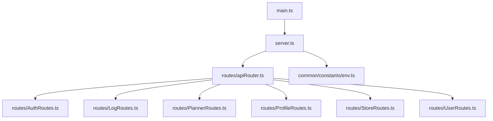
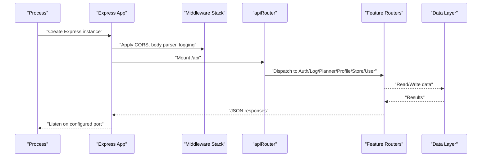
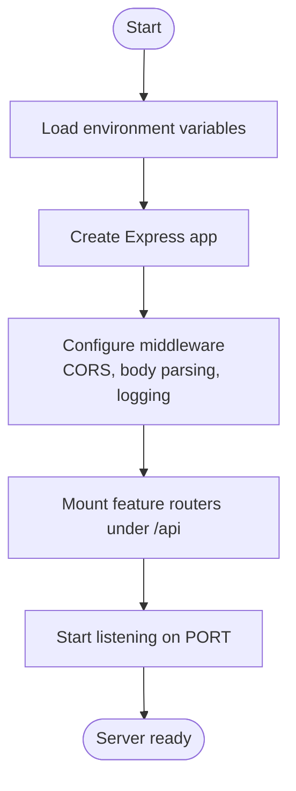
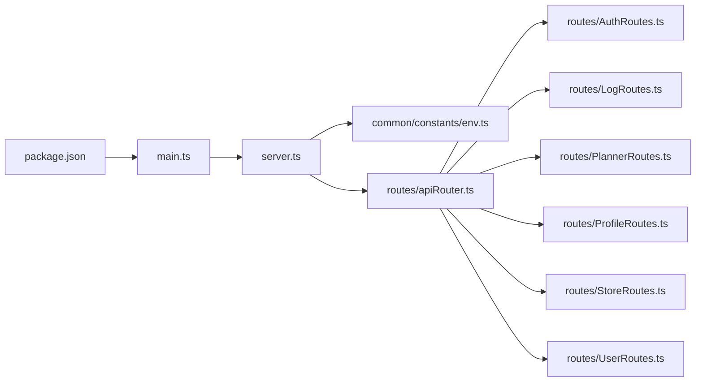

# Server Setup and Configuration

<cite>
**Referenced Files in This Document**
- [main.ts](file://Backend/src/main.ts)
- [server.ts](file://Backend/src/server.ts)
- [env.ts](file://Backend/src/common/constants/env.ts)
- [apiRouter.ts](file://Backend/src/routes/apiRouter.ts)
- [AuthRoutes.ts](file://Backend/src/routes/AuthRoutes.ts)
- [LogRoutes.ts](file://Backend/src/routes/LogRoutes.ts)
- [PlannerRoutes.ts](file://Backend/src/routes/PlannerRoutes.ts)
- [ProfileRoutes.ts](file://Backend/src/routes/ProfileRoutes.ts)
- [StoreRoutes.ts](file://Backend/src/routes/StoreRoutes.ts)
- [UserRoutes.ts](file://Backend/src/routes/UserRoutes.ts)
- [package.json](file://Backend/package.json)
</cite>

## Table of Contents
1. [Introduction](#introduction)
2. [Project Structure](#project-structure)
3. [Core Components](#core-components)
4. [Architecture Overview](#architecture-overview)
5. [Detailed Component Analysis](#detailed-component-analysis)
6. [Dependency Analysis](#dependency-analysis)
7. [Performance Considerations](#performance-considerations)
8. [Troubleshooting Guide](#troubleshooting-guide)
9. [Conclusion](#conclusion)

## Introduction
This document explains the Express.js server setup and configuration for the project, focusing on initialization, middleware stack, environment variables, startup sequence, CORS, body parsing, and error handling. It also provides guidance on extending the middleware stack and integrating additional services.

## Project Structure
The backend is organized under Backend/src with clear separation between entry points, routes, services, and shared utilities:
- Entry points: main.ts and server.ts
- Environment configuration: common/constants/env.ts
- API routing: routes/apiRouter.ts and feature-specific route modules
- Package metadata and scripts: package.json

**Diagram sources**
- [main.ts](file://Backend/src/main.ts)
- [server.ts](file://Backend/src/server.ts)
- [apiRouter.ts](file://Backend/src/routes/apiRouter.ts)
- [AuthRoutes.ts](file://Backend/src/routes/AuthRoutes.ts)
- [LogRoutes.ts](file://Backend/src/routes/LogRoutes.ts)
- [PlannerRoutes.ts](file://Backend/src/routes/PlannerRoutes.ts)
- [ProfileRoutes.ts](file://Backend/src/routes/ProfileRoutes.ts)
- [StoreRoutes.ts](file://Backend/src/routes/StoreRoutes.ts)
- [UserRoutes.ts](file://Backend/src/routes/UserRoutes.ts)
- [env.ts](file://Backend/src/common/constants/env.ts)

**Section sources**
- [main.ts](file://Backend/src/main.ts)
- [server.ts](file://Backend/src/server.ts)
- [env.ts](file://Backend/src/common/constants/env.ts)
- [apiRouter.ts](file://Backend/src/routes/apiRouter.ts)
- [AuthRoutes.ts](file://Backend/src/routes/AuthRoutes.ts)
- [LogRoutes.ts](file://Backend/src/routes/LogRoutes.ts)
- [PlannerRoutes.ts](file://Backend/src/routes/PlannerRoutes.ts)
- [ProfileRoutes.ts](file://Backend/src/routes/ProfileRoutes.ts)
- [StoreRoutes.ts](file://Backend/src/routes/StoreRoutes.ts)
- [UserRoutes.ts](file://Backend/src/routes/UserRoutes.ts)

## Core Components
- Application entry point: Initializes the Express app, loads environment variables, configures middleware, mounts routes, and starts the HTTP server.
- Server bootstrap: Creates the Express instance, applies global middleware (CORS, body parsing, logging), sets up error handling, and binds to a port.
- Environment variables: Centralized constants for runtime configuration such as port, host, CORS origins, and secrets.
- Routing layer: A central router aggregates feature routers for clean URL namespaces.

Key responsibilities:
- Startup sequence: Load env → create app → configure middleware → mount routes → start listening.
- Middleware stack order: Security/CORS → body parsing → request logging → route handlers → error handler.
- Extensibility: Add new middleware before or after existing ones; register new routes via the central router.

**Section sources**
- [main.ts](file://Backend/src/main.ts)
- [server.ts](file://Backend/src/server.ts)
- [env.ts](file://Backend/src/common/constants/env.ts)
- [apiRouter.ts](file://Backend/src/routes/apiRouter.ts)

## Architecture Overview
The server follows a layered architecture:
- Presentation layer: Express app and middleware
- Routing layer: apiRouter and feature routers
- Service layer: Business logic modules (outside this document’s scope)
- Data layer: Database access via repositories/services (outside this document’s scope)

**Diagram sources**
- [server.ts](file://Backend/src/server.ts)
- [apiRouter.ts](file://Backend/src/routes/apiRouter.ts)
- [AuthRoutes.ts](file://Backend/src/routes/AuthRoutes.ts)
- [LogRoutes.ts](file://Backend/src/routes/LogRoutes.ts)
- [PlannerRoutes.ts](file://Backend/src/routes/PlannerRoutes.ts)
- [ProfileRoutes.ts](file://Backend/src/routes/ProfileRoutes.ts)
- [StoreRoutes.ts](file://Backend/src/routes/StoreRoutes.ts)
- [UserRoutes.ts](file://Backend/src/routes/UserRoutes.ts)

## Detailed Component Analysis

### Server Initialization and Startup Sequence
- The application bootstraps by creating an Express app, loading environment variables, configuring middleware, mounting routes, and starting the HTTP listener.
- The startup sequence ensures that all required configuration is available before accepting requests.

**Diagram sources**
- [main.ts](file://Backend/src/main.ts)
- [server.ts](file://Backend/src/server.ts)
- [env.ts](file://Backend/src/common/constants/env.ts)

**Section sources**
- [main.ts](file://Backend/src/main.ts)
- [server.ts](file://Backend/src/server.ts)
- [env.ts](file://Backend/src/common/constants/env.ts)

### Environment Variable Management
- Centralized environment constants are defined for runtime configuration such as port, host, CORS origins, and secrets.
- These values are consumed during server initialization to configure middleware and services.

Typical usage patterns:
- Read-only access to environment values at startup
- Validation or defaults applied where appropriate
- Consistent naming across modules

**Section sources**
- [env.ts](file://Backend/src/common/constants/env.ts)

### Middleware Stack Configuration
- Global middleware includes security headers, CORS, body parsing, and request logging.
- Order matters: CORS and body parsing must precede route handlers; error handling should be last.

Common middleware categories:
- Security and CORS
- Body parsing (JSON, URL-encoded, multipart if needed)
- Request logging and tracing
- Route handlers
- Error handling

Extending the stack:
- Insert custom middleware before route mounting for cross-cutting concerns (authentication, rate limiting).
- Use per-route or per-router middleware for domain-specific behavior.

**Section sources**
- [server.ts](file://Backend/src/server.ts)
- [apiRouter.ts](file://Backend/src/routes/apiRouter.ts)

### CORS Settings
- CORS is configured globally to allow or restrict cross-origin requests based on environment settings.
- Typical options include allowed origins, methods, headers, credentials, and preflight caching.

Configuration considerations:
- Restrict origins in production
- Enable credentials only when necessary
- Cache preflight responses to reduce overhead

**Section sources**
- [server.ts](file://Backend/src/server.ts)
- [env.ts](file://Backend/src/common/constants/env.ts)

### Body Parsing
- JSON and URL-encoded bodies are parsed automatically for incoming requests.
- Ensure size limits are set appropriately to prevent abuse.

Best practices:
- Set explicit limits for payload sizes
- Validate content types early
- Handle malformed payloads gracefully

**Section sources**
- [server.ts](file://Backend/src/server.ts)

### Error Handling Middleware
- A centralized error-handling middleware captures unhandled errors and returns consistent JSON responses.
- It should log errors and avoid leaking sensitive information to clients.

Error flow:
- Route or service throws an error
- Express passes control to the error-handling middleware
- Response includes standardized error shape and status code

**Section sources**
- [server.ts](file://Backend/src/server.ts)

### Routing Layer
- A central router aggregates feature routers under a common base path.
- Each feature module encapsulates its own routes and handlers.

Routing structure:
- Base path: /api
- Feature paths: auth, log, planner, profile, store, user

Adding new routes:
- Create a new router module
- Register it under the central router with a descriptive path

**Section sources**
- [apiRouter.ts](file://Backend/src/routes/apiRouter.ts)
- [AuthRoutes.ts](file://Backend/src/routes/AuthRoutes.ts)
- [LogRoutes.ts](file://Backend/src/routes/LogRoutes.ts)
- [PlannerRoutes.ts](file://Backend/src/routes/PlannerRoutes.ts)
- [ProfileRoutes.ts](file://Backend/src/routes/ProfileRoutes.ts)
- [StoreRoutes.ts](file://Backend/src/routes/StoreRoutes.ts)
- [UserRoutes.ts](file://Backend/src/routes/UserRoutes.ts)

### Application Startup Sequence
- The process begins by loading environment variables and initializing the Express app.
- Middleware is applied, routes are mounted, and the server starts listening.

Startup checklist:
- Verify environment variables are present
- Confirm middleware order
- Ensure routes are registered
- Validate port binding and readiness

**Section sources**
- [main.ts](file://Backend/src/main.ts)
- [server.ts](file://Backend/src/server.ts)

## Dependency Analysis
The server depends on core Express functionality and several internal modules:
- Express app and middleware
- Central router and feature routers
- Environment configuration constants
- Package scripts for running and building

**Diagram sources**
- [package.json](file://Backend/package.json)
- [main.ts](file://Backend/src/main.ts)
- [server.ts](file://Backend/src/server.ts)
- [env.ts](file://Backend/src/common/constants/env.ts)
- [apiRouter.ts](file://Backend/src/routes/apiRouter.ts)
- [AuthRoutes.ts](file://Backend/src/routes/AuthRoutes.ts)
- [LogRoutes.ts](file://Backend/src/routes/LogRoutes.ts)
- [PlannerRoutes.ts](file://Backend/src/routes/PlannerRoutes.ts)
- [ProfileRoutes.ts](file://Backend/src/routes/ProfileRoutes.ts)
- [StoreRoutes.ts](file://Backend/src/routes/StoreRoutes.ts)
- [UserRoutes.ts](file://Backend/src/routes/UserRoutes.ts)

**Section sources**
- [package.json](file://Backend/package.json)
- [main.ts](file://Backend/src/main.ts)
- [server.ts](file://Backend/src/server.ts)
- [env.ts](file://Backend/src/common/constants/env.ts)
- [apiRouter.ts](file://Backend/src/routes/apiRouter.ts)

## Performance Considerations
- Keep middleware minimal and efficient; avoid heavy operations in global middleware.
- Use connection pooling for database clients and cache frequently accessed data.
- Tune body parser limits and enable compression where appropriate.
- Monitor memory usage and handle large payloads carefully.

[No sources needed since this section provides general guidance]

## Troubleshooting Guide
Common issues and resolutions:
- Port already in use: Change PORT or stop conflicting processes.
- CORS errors: Verify allowed origins and headers match client requests.
- Body parsing failures: Check content-type and payload size limits.
- Unhandled errors: Ensure error-handling middleware is registered last and logs details.

Debugging tips:
- Inspect request/response headers and payloads
- Add request logging around critical endpoints
- Validate environment variables at startup

**Section sources**
- [server.ts](file://Backend/src/server.ts)
- [env.ts](file://Backend/src/common/constants/env.ts)

## Conclusion
The Express.js server is initialized through a clear startup sequence that loads environment variables, configures middleware, mounts feature routes, and starts listening. The modular routing and centralized environment management make it straightforward to extend the middleware stack and integrate new services. Following the best practices outlined here will help maintain a robust, secure, and performant server.

[No sources needed since this section summarizes without analyzing specific files]