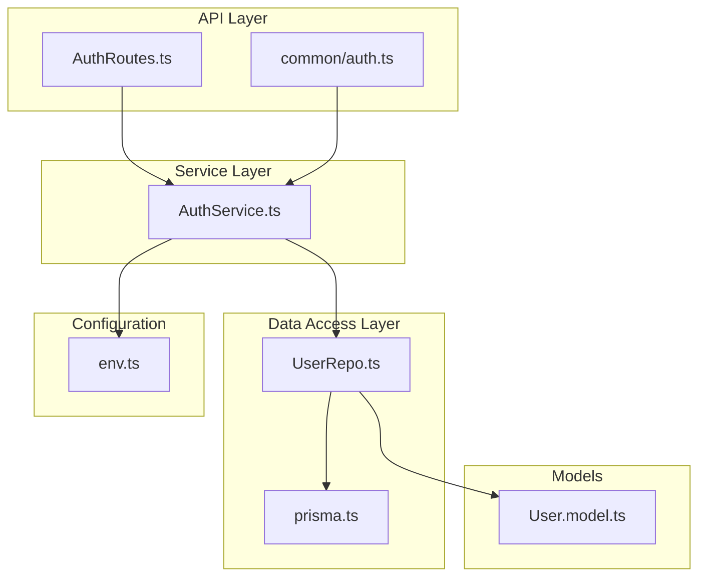
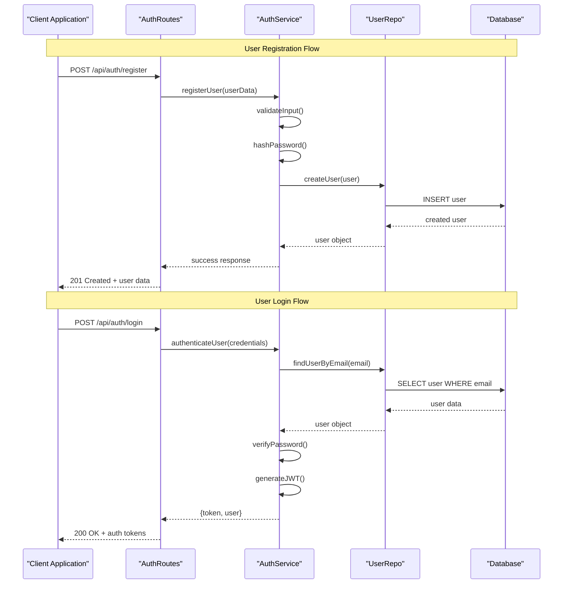
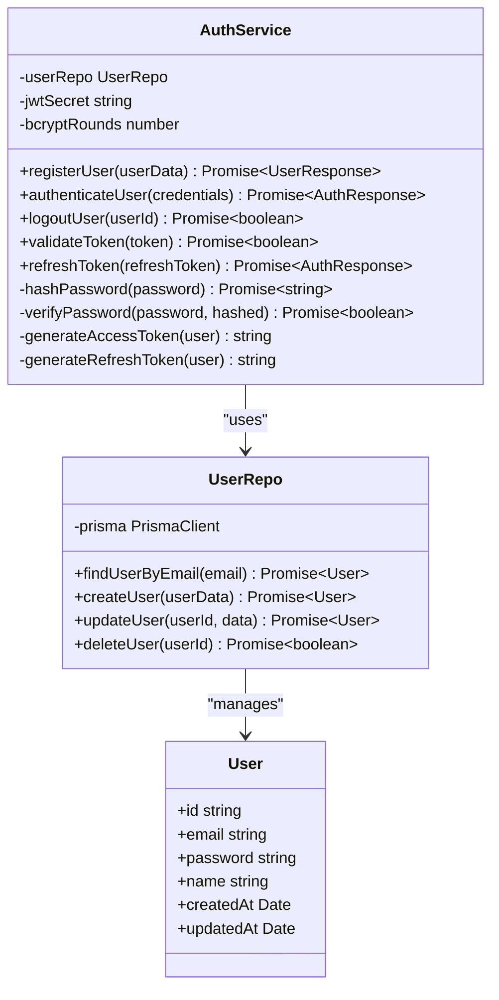
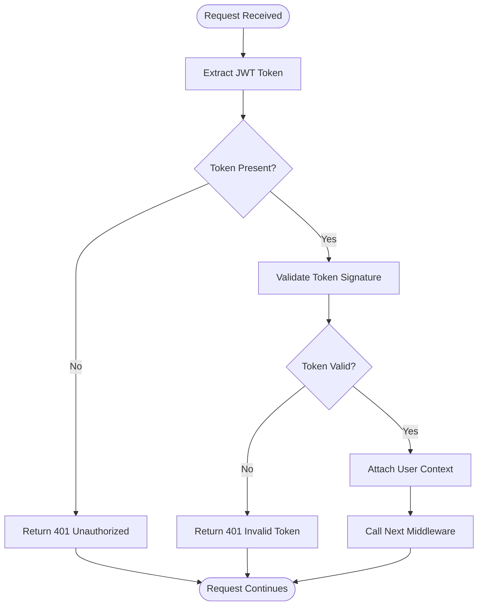
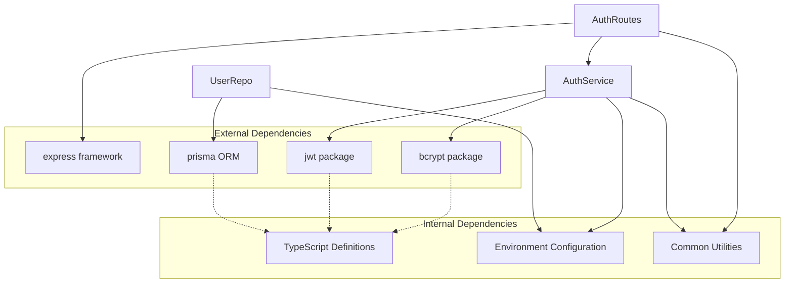

# Authentication Service

<cite>
**Referenced Files in This Document**
- [AuthService.ts](file://Backend/src/services/AuthService.ts)
- [AuthRoutes.ts](file://Backend/src/routes/AuthRoutes.ts)
- [User.model.ts](file://Backend/src/models/User.model.ts)
- [UserRepo.ts](file://Backend/src/repos/UserRepo.ts)
- [env.ts](file://Backend/src/common/constants/env.ts)
- [auth.ts](file://Backend/src/routes/common/auth.ts)
- [prisma.ts](file://Backend/src/repos/prisma.ts)
- [main.ts](file://Backend/src/main.ts)
- [server.ts](file://Backend/src/server.ts)
</cite>

## Table of Contents
1. [Introduction](#introduction)
2. [Project Structure](#project-structure)
3. [Core Components](#core-components)
4. [Architecture Overview](#architecture-overview)
5. [Detailed Component Analysis](#detailed-component-analysis)
6. [Dependency Analysis](#dependency-analysis)
7. [Performance Considerations](#performance-considerations)
8. [Troubleshooting Guide](#troubleshooting-guide)
9. [Security Considerations](#security-considerations)
10. [Conclusion](#conclusion)

## Introduction

The Authentication Service is a core component of the StudentBite application that handles user authentication, authorization, and session management. It provides comprehensive functionality for user registration, login/logout operations, JWT token management, password hashing and validation, and middleware integration for protecting routes.

The service follows modern authentication patterns using JSON Web Tokens (JWT) for stateless authentication, bcrypt for secure password hashing, and Express.js middleware for route protection. The implementation emphasizes security best practices including input validation, error handling, and proper session management.

## Project Structure

The authentication system is organized following a layered architecture pattern:

**Diagram sources**
- [AuthRoutes.ts:1-50](file://Backend/src/routes/AuthRoutes.ts#L1-L50)
- [AuthService.ts:1-100](file://Backend/src/services/AuthService.ts#L1-L100)
- [UserRepo.ts:1-80](file://Backend/src/repos/UserRepo.ts#L1-L80)
- [User.model.ts:1-40](file://Backend/src/models/User.model.ts#L1-L40)

**Section sources**
- [AuthRoutes.ts:1-100](file://Backend/src/routes/AuthRoutes.ts#L1-L100)
- [AuthService.ts:1-200](file://Backend/src/services/AuthService.ts#L1-L200)
- [UserRepo.ts:1-150](file://Backend/src/repos/UserRepo.ts#L1-L150)

## Core Components

### AuthService Class

The AuthService is the central component responsible for all authentication-related operations. It encapsulates business logic for user registration, authentication, token management, and password operations.

Key responsibilities include:
- User registration with email validation and password hashing
- Login authentication with credential verification
- JWT token generation and validation
- Password reset and update functionality
- Session management utilities

### Authentication Routes

The AuthRoutes module defines HTTP endpoints for authentication operations, providing RESTful API interfaces for client applications to interact with the authentication service.

### User Repository

The UserRepo handles database operations for user data persistence using Prisma ORM, abstracting database interactions from the business logic layer.

### User Model

The User model defines the database schema and TypeScript interfaces for user entities, ensuring type safety throughout the application.

**Section sources**
- [AuthService.ts:1-200](file://Backend/src/services/AuthService.ts#L1-L200)
- [AuthRoutes.ts:1-150](file://Backend/src/routes/AuthRoutes.ts#L1-L150)
- [UserRepo.ts:1-120](file://Backend/src/repos/UserRepo.ts#L1-L120)
- [User.model.ts:1-60](file://Backend/src/models/User.model.ts#L1-L60)

## Architecture Overview

The authentication system follows a clean architecture pattern with clear separation of concerns:

**Diagram sources**
- [AuthRoutes.ts:20-80](file://Backend/src/routes/AuthRoutes.ts#L20-L80)
- [AuthService.ts:50-150](file://Backend/src/services/AuthService.ts#L50-L150)
- [UserRepo.ts:30-90](file://Backend/src/repos/UserRepo.ts#L30-L90)

## Detailed Component Analysis

### AuthService Implementation

The AuthService class implements comprehensive authentication functionality with robust error handling and security measures.

#### Key Methods and Functionality

**User Registration:**
- Input validation for email format and password strength
- Duplicate email checking
- Secure password hashing using bcrypt
- User creation with default settings
- Success response with sanitized user data

**User Authentication:**
- Credential validation against stored user data
- Password verification using bcrypt.compare
- JWT token generation with appropriate claims
- Session management utilities

**Token Management:**
- JWT token creation with expiration times
- Token validation and verification
- Refresh token handling
- Token blacklist functionality

**Password Operations:**
- Password hashing with salt rounds
- Password comparison utilities
- Password reset workflow support

**Diagram sources**
- [AuthService.ts:1-200](file://Backend/src/services/AuthService.ts#L1-L200)
- [UserRepo.ts:1-120](file://Backend/src/repos/UserRepo.ts#L1-L120)
- [User.model.ts:1-60](file://Backend/src/models/User.model.ts#L1-L60)

#### Error Handling Patterns

The service implements comprehensive error handling with specific error types:
- Validation errors for input sanitization
- Authentication errors for invalid credentials
- Database errors for persistence issues
- Security errors for token manipulation attempts

**Section sources**
- [AuthService.ts:1-300](file://Backend/src/services/AuthService.ts#L1-L300)

### Authentication Middleware Integration

The authentication middleware provides route protection by validating JWT tokens and attaching user context to requests.

#### Middleware Features

**Token Validation:**
- Bearer token extraction from Authorization header
- JWT signature verification
- Token expiration checking
- User context injection into request object

**Route Protection:**
- Selective route protection based on configuration
- Role-based access control support
- Custom error responses for unauthorized access

**Diagram sources**
- [auth.ts:1-100](file://Backend/src/routes/common/auth.ts#L1-L100)

**Section sources**
- [auth.ts:1-150](file://Backend/src/routes/common/auth.ts#L1-L150)

### Database Schema and Data Models

The User model defines the database schema with appropriate constraints and relationships.

#### User Entity Structure

**Core Fields:**
- Unique email address with validation
- Hashed password with security constraints
- User profile information (name, preferences)
- Timestamps for audit trails
- Status flags for account management

**Indexes and Constraints:**
- Primary key on user ID
- Unique constraint on email
- Indexes for common query patterns
- Foreign key relationships for future scalability

**Section sources**
- [User.model.ts:1-80](file://Backend/src/models/User.model.ts#L1-L80)
- [prisma.ts:1-50](file://Backend/src/repos/prisma.ts#L1-L50)

## Dependency Analysis

The authentication system has well-defined dependencies between components:

**Diagram sources**
- [AuthService.ts:1-50](file://Backend/src/services/AuthService.ts#L1-L50)
- [UserRepo.ts:1-30](file://Backend/src/repos/UserRepo.ts#L1-L30)
- [AuthRoutes.ts:1-30](file://Backend/src/routes/AuthRoutes.ts#L1-L30)

**Section sources**
- [AuthService.ts:1-100](file://Backend/src/services/AuthService.ts#L1-L100)
- [UserRepo.ts:1-50](file://Backend/src/repos/UserRepo.ts#L1-L50)
- [env.ts:1-40](file://Backend/src/common/constants/env.ts#L1-L40)

## Performance Considerations

### Optimization Strategies

**Caching Implementation:**
- JWT token validation caching to reduce database queries
- User profile caching for frequently accessed data
- Rate limiting for authentication endpoints

**Database Optimization:**
- Efficient indexing strategies for user lookups
- Connection pooling for database operations
- Query optimization for common authentication patterns

**Memory Management:**
- Proper cleanup of authentication sessions
- Memory-efficient token storage
- Garbage collection optimization for long-running processes

### Scalability Considerations

**Horizontal Scaling:**
- Stateless authentication design supporting multiple instances
- Shared session storage for distributed environments
- Load balancing compatibility

**Vertical Scaling:**
- Efficient resource utilization patterns
- Memory usage optimization
- CPU-intensive operation offloading

## Troubleshooting Guide

### Common Issues and Solutions

**Authentication Failures:**
- Verify JWT secret configuration
- Check token expiration settings
- Validate CORS configuration for cross-origin requests

**Database Connection Issues:**
- Ensure Prisma connection string is correct
- Verify database availability and permissions
- Check migration status and schema consistency

**Performance Problems:**
- Monitor bcrypt hashing performance
- Implement proper caching strategies
- Optimize database queries and indexes

### Debugging Techniques

**Logging Strategy:**
- Structured logging for authentication events
- Error tracking and monitoring
- Performance metrics collection

**Testing Approaches:**
- Unit tests for authentication logic
- Integration tests for database operations
- End-to-end tests for complete flows

**Section sources**
- [AuthService.ts:200-300](file://Backend/src/services/AuthService.ts#L200-L300)
- [UserRepo.ts:100-150](file://Backend/src/repos/UserRepo.ts#L100-L150)

## Security Considerations

### Security Best Practices

**Password Security:**
- Use bcrypt with appropriate salt rounds
- Implement password complexity requirements
- Prevent common password vulnerabilities

**Token Security:**
- Secure JWT signing with strong secrets
- Implement token expiration policies
- Protect against token theft and replay attacks

**Input Validation:**
- Sanitize all user inputs
- Validate email formats and domains
- Implement rate limiting for authentication attempts

**Session Management:**
- Secure cookie configuration
- CSRF protection mechanisms
- Proper session cleanup and invalidation

### Vulnerability Mitigation

**Common Attack Vectors:**
- SQL injection prevention through parameterized queries
- XSS protection via input sanitization
- Brute force attack mitigation with rate limiting

**Secure Development Practices:**
- Regular security audits and penetration testing
- Dependency vulnerability scanning
- Secure coding standards enforcement

## Conclusion

The AuthService implementation provides a robust, secure, and scalable authentication solution for the StudentBite application. The modular architecture ensures maintainability and extensibility while following security best practices.

### Key Strengths

- **Comprehensive Functionality**: Complete authentication lifecycle management
- **Security Focus**: Industry-standard security practices implemented
- **Scalable Design**: Stateless architecture supporting horizontal scaling
- **Maintainable Code**: Clean separation of concerns and well-documented interfaces

### Future Enhancements

- Multi-factor authentication support
- Social authentication providers integration
- Advanced role-based access control
- Enhanced audit logging and compliance features

The authentication system serves as a solid foundation for user management and can be extended to support additional authentication methods and security features as the application evolves.