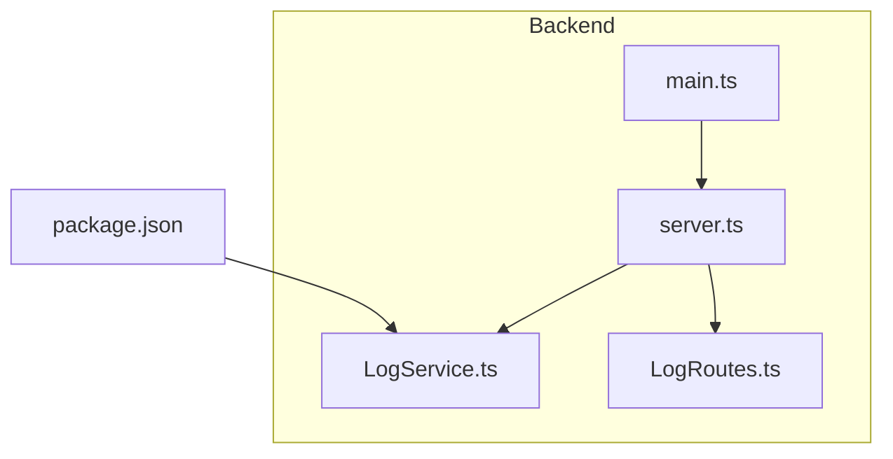
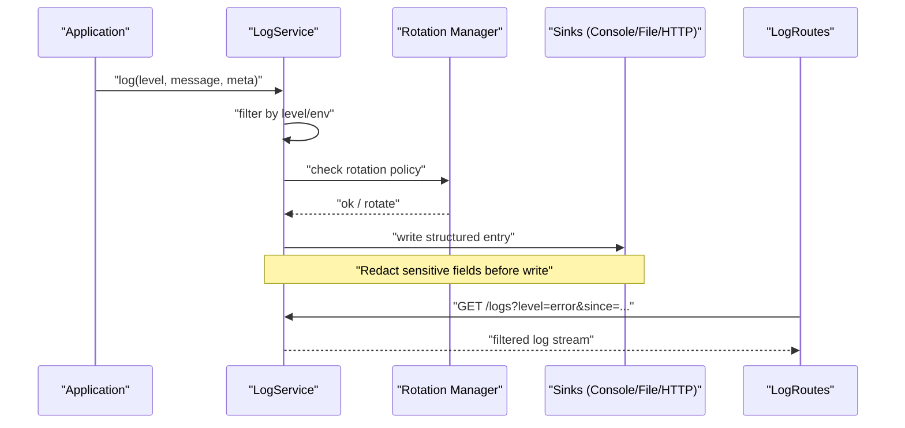
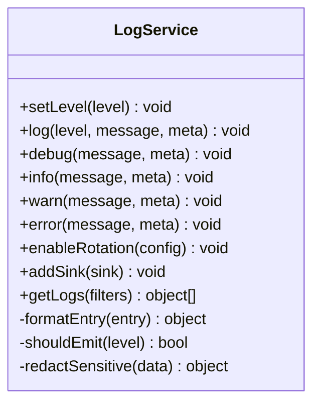
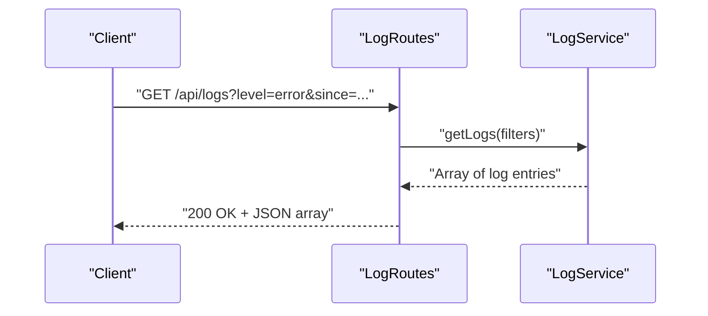
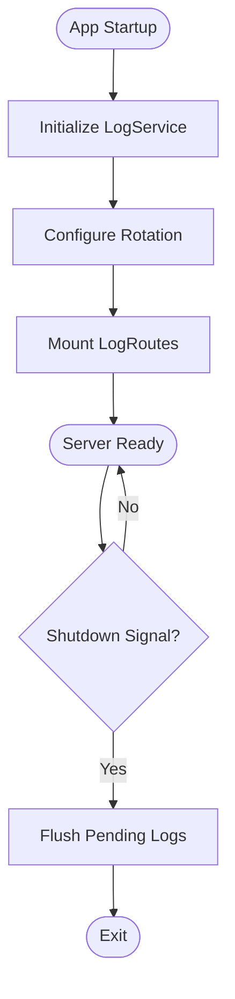
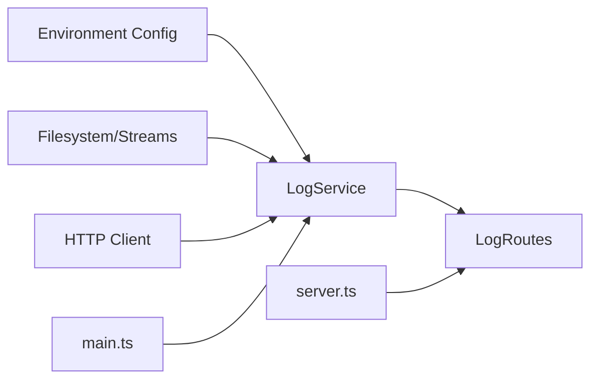

# Logging Service

<cite>
**Referenced Files in This Document**
- [LogService.ts](file://Backend/src/services/LogService.ts)
- [LogRoutes.ts](file://Backend/src/routes/LogRoutes.ts)
- [main.ts](file://Backend/src/main.ts)
- [server.ts](file://Backend/src/server.ts)
- [package.json](file://Backend/package.json)
</cite>

## Table of Contents
1. [Introduction](#introduction)
2. [Project Structure](#project-structure)
3. [Core Components](#core-components)
4. [Architecture Overview](#architecture-overview)
5. [Detailed Component Analysis](#detailed-component-analysis)
6. [Dependency Analysis](#dependency-analysis)
7. [Performance Considerations](#performance-considerations)
8. [Troubleshooting Guide](#troubleshooting-guide)
9. [Conclusion](#conclusion)
10. [Appendices](#appendices)

## Introduction
This document provides comprehensive documentation for the centralized logging service implemented in the application. It explains how logs are produced, formatted, rotated, and consumed across the system. It also covers log levels, structured logging format, error tracking, performance monitoring hooks, debugging utilities, best practices, custom formats, filtering, integration with external logging systems, and security considerations for sensitive data handling.

## Project Structure
The logging functionality is primarily implemented in a dedicated service and exposed via HTTP routes for consumption by other services or external consumers. The service is initialized during application startup and integrated into the server lifecycle.

**Diagram sources**
- [main.ts:1-200](file://Backend/src/main.ts#L1-L200)
- [server.ts:1-200](file://Backend/src/server.ts#L1-L200)
- [LogService.ts:1-200](file://Backend/src/services/LogService.ts#L1-L200)
- [LogRoutes.ts:1-200](file://Backend/src/routes/LogRoutes.ts#L1-L200)
- [package.json:1-200](file://Backend/package.json#L1-L200)

**Section sources**
- [main.ts:1-200](file://Backend/src/main.ts#L1-L200)
- [server.ts:1-200](file://Backend/src/server.ts#L1-L200)
- [LogService.ts:1-200](file://Backend/src/services/LogService.ts#L1-L200)
- [LogRoutes.ts:1-200](file://Backend/src/routes/LogRoutes.ts#L1-L200)
- [package.json:1-200](file://Backend/package.json#L1-L200)

## Core Components
- LogService: Centralized logging implementation providing structured log emission, level-based filtering, rotation configuration, and optional sinks (console, file, and external endpoints).
- LogRoutes: HTTP endpoints to query, filter, and export logs; useful for debugging and operational dashboards.
- Application bootstrap: Initialization of LogService and mounting of LogRoutes within the server lifecycle.

Key responsibilities:
- Define and enforce log levels and structured schema.
- Provide APIs for emitting logs from any module.
- Implement log rotation policies based on size/time.
- Support filtering by level, timestamp range, and context.
- Integrate with external logging backends via HTTP or SDKs.
- Ensure sensitive fields are redacted before persistence or transmission.

**Section sources**
- [LogService.ts:1-200](file://Backend/src/services/LogService.ts#L1-L200)
- [LogRoutes.ts:1-200](file://Backend/src/routes/LogRoutes.ts#L1-L200)
- [server.ts:1-200](file://Backend/src/server.ts#L1-L200)

## Architecture Overview
The logging architecture follows a producer-consumer pattern:
- Producers: Any service or route handler calls LogService methods to emit structured logs.
- Consumer: LogService applies filters, formats entries, rotates files, and forwards to configured sinks.
- Observers: LogRoutes expose endpoints to retrieve recent logs and perform filtered queries.

**Diagram sources**
- [LogService.ts:1-200](file://Backend/src/services/LogService.ts#L1-L200)
- [LogRoutes.ts:1-200](file://Backend/src/routes/LogRoutes.ts#L1-L200)
- [server.ts:1-200](file://Backend/src/server.ts#L1-L200)

## Detailed Component Analysis

### LogService
Responsibilities:
- Level management: define allowed levels and default thresholds.
- Structured formatting: ensure consistent JSON-like structure with timestamp, level, message, context, and correlation IDs.
- Rotation: implement size/time-based rotation and retention.
- Filtering: support filtering by level, time window, and context keys.
- Sinks: console output, file output, and optional HTTP forwarding to external systems.
- Security: redaction of sensitive fields prior to writing or sending.

Recommended public interface:
- setLevel(level): configure minimum level.
- log(level, message, meta?): emit a structured log entry.
- debug/info/warn/error(...): convenience methods per level.
- enableRotation(config): configure rotation rules.
- addSink(sink): register additional sinks.
- getLogs(filters): return filtered logs for debugging/export.

Best practices:
- Always include a stable correlationId for request tracing.
- Avoid logging secrets, tokens, or PII; use redaction rules.
- Keep messages concise; put details in structured meta fields.
- Use appropriate levels consistently across modules.

**Diagram sources**
- [LogService.ts:1-200](file://Backend/src/services/LogService.ts#L1-L200)

**Section sources**
- [LogService.ts:1-200](file://Backend/src/services/LogService.ts#L1-L200)

### LogRoutes
Responsibilities:
- Expose endpoints to fetch logs with filtering and pagination.
- Provide health/status endpoints for the logging subsystem.
- Optionally allow exporting logs in CSV/JSON for analysis.

Typical endpoints:
- GET /api/logs: returns filtered logs based on query parameters.
- GET /api/logs/health: returns sink status and rotation state.

Security considerations:
- Restrict access to these endpoints in production environments.
- Apply rate limiting and authentication where applicable.

**Diagram sources**
- [LogRoutes.ts:1-200](file://Backend/src/routes/LogRoutes.ts#L1-L200)
- [LogService.ts:1-200](file://Backend/src/services/LogService.ts#L1-L200)

**Section sources**
- [LogRoutes.ts:1-200](file://Backend/src/routes/LogRoutes.ts#L1-L200)

### Application Bootstrap
Initialization steps:
- Instantiate LogService with environment-driven defaults.
- Configure rotation and sinks based on environment variables.
- Mount LogRoutes under an internal API prefix.
- Ensure graceful shutdown flushes pending logs.

**Diagram sources**
- [main.ts:1-200](file://Backend/src/main.ts#L1-L200)
- [server.ts:1-200](file://Backend/src/server.ts#L1-L200)
- [LogService.ts:1-200](file://Backend/src/services/LogService.ts#L1-L200)

**Section sources**
- [main.ts:1-200](file://Backend/src/main.ts#L1-L200)
- [server.ts:1-200](file://Backend/src/server.ts#L1-L200)

## Dependency Analysis
External dependencies relevant to logging:
- Node.js built-in filesystem and streams for file rotation and output.
- Optional HTTP client libraries for forwarding logs to external systems.
- Environment configuration for runtime behavior.

Internal dependencies:
- LogService depends on configuration constants and environment settings.
- LogRoutes depend on LogService for querying logs.
- Server initialization wires LogService and LogRoutes into the app lifecycle.

**Diagram sources**
- [LogService.ts:1-200](file://Backend/src/services/LogService.ts#L1-L200)
- [LogRoutes.ts:1-200](file://Backend/src/routes/LogRoutes.ts#L1-L200)
- [main.ts:1-200](file://Backend/src/main.ts#L1-L200)
- [server.ts:1-200](file://Backend/src/server.ts#L1-L200)

**Section sources**
- [package.json:1-200](file://Backend/package.json#L1-L200)
- [LogService.ts:1-200](file://Backend/src/services/LogService.ts#L1-L200)
- [LogRoutes.ts:1-200](file://Backend/src/routes/LogRoutes.ts#L1-L200)

## Performance Considerations
- Asynchronous writes: Ensure log emissions do not block request processing.
- Batched outputs: Group multiple entries when writing to files or HTTP sinks.
- Rotation thresholds: Set sensible size limits and retention policies to avoid disk pressure.
- Sampling: For high-volume debug logs, consider sampling strategies in non-production environments.
- Redaction cost: Keep redaction rules efficient and avoid deep traversal on large payloads.

[No sources needed since this section provides general guidance]

## Troubleshooting Guide
Common issues and resolutions:
- No logs appearing: Verify minimum log level and environment flags; check sink availability.
- Disk growth: Review rotation configuration and retention; ensure old files are purged.
- Missing correlationId: Ensure middleware sets correlationId at request start.
- External sink failures: Inspect network connectivity and credentials; implement retry/backoff.
- Sensitive data exposure: Validate redaction rules cover all expected fields.

Operational checks:
- Use /api/logs/health to verify sink status and rotation state.
- Query recent logs with filters to confirm correct level and time windows.

**Section sources**
- [LogRoutes.ts:1-200](file://Backend/src/routes/LogRoutes.ts#L1-L200)
- [LogService.ts:1-200](file://Backend/src/services/LogService.ts#L1-L200)

## Conclusion
The centralized logging service provides a robust foundation for observability across the application. By enforcing structured formats, configurable levels, rotation policies, and secure redaction, it enables reliable diagnostics and compliance. Integrating with external logging systems and exposing controlled endpoints further enhances operational visibility while maintaining security and performance.

[No sources needed since this section summarizes without analyzing specific files]

## Appendices

### Log Levels and Format
- Levels: debug, info, warn, error (and optionally fatal).
- Format: structured object with timestamp, level, message, context, correlationId, and optional stack traces.
- Best practice: keep messages human-readable; place detailed data in structured fields.

### Log Rotation Policies
- Size-based rotation: rotate when file exceeds threshold.
- Time-based rotation: rotate daily/hourly.
- Retention: number of files to keep; compress archived logs.

### Error Tracking Integration
- Attach correlationId and stack traces to errors.
- Forward critical errors to external systems via HTTP or SDK.
- Maintain separate channels for warnings vs. errors.

### Performance Monitoring Hooks
- Emit metrics around long-running operations.
- Track latency and throughput using structured logs.
- Sample high-frequency logs in production.

### Debugging Utilities
- Filter logs by level, time range, and context keys.
- Export logs for offline analysis.
- Enable verbose mode temporarily in staging.

### Custom Log Formats
- Define custom serializers for domain-specific events.
- Enforce schema validation for structured fields.
- Version formats to support evolution.

### Log Filtering and Queries
- Supported filters: level, timestamp range, correlationId, module, user.
- Pagination and sorting for large result sets.
- Rate-limiting on query endpoints.

### Integration with External Systems
- HTTP POST to collectors with batching and retries.
- Authentication via headers or tokens.
- Fallback to local buffering on network failure.

### Security and Sensitive Data Handling
- Redact known sensitive fields (passwords, tokens, PII).
- Avoid logging request bodies unless explicitly permitted.
- Secure transport for external sinks (TLS).
- Access control on log retrieval endpoints.

[No sources needed since this section provides general guidance]