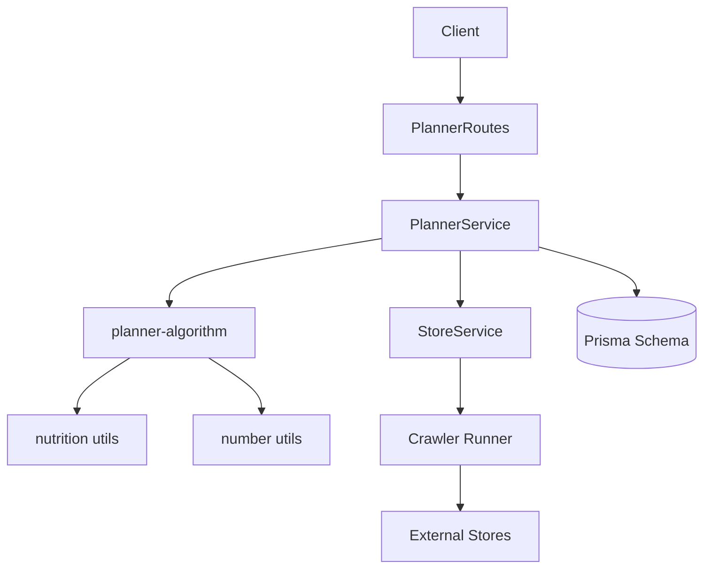
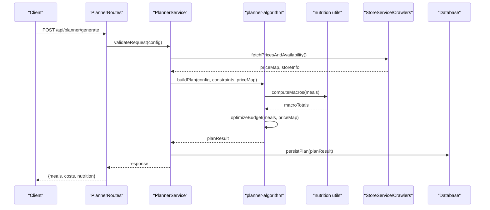
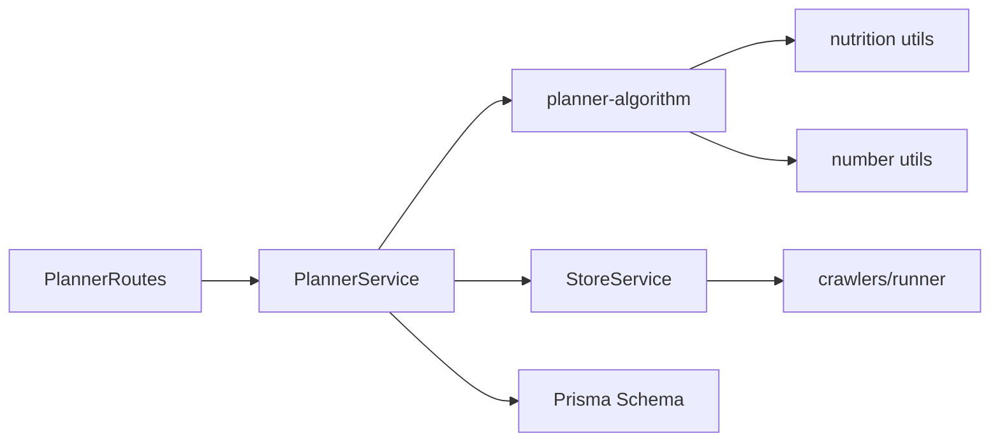
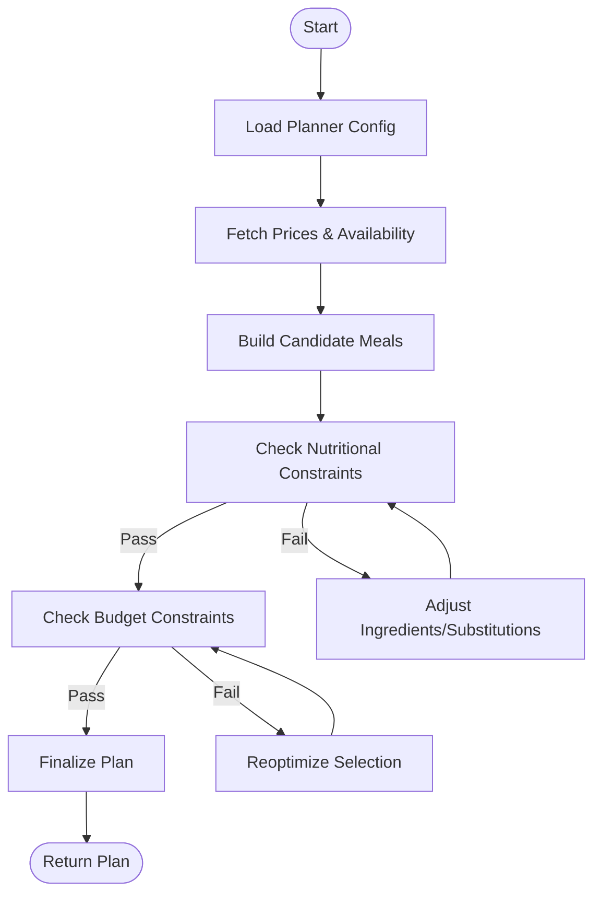

# Meal Planning Service

<cite>
**Referenced Files in This Document**
- [PlannerService.ts](file://Backend/src/services/PlannerService.ts)
- [planner-algorithm.ts](file://Backend/src/services/planner-algorithm.ts)
- [PlannerRoutes.ts](file://Backend/src/routes/PlannerRoutes.ts)
- [nutrition.ts](file://Backend/src/common/utils/nutrition.ts)
- [number-utils.ts](file://Backend/src/common/utils/number-utils.ts)
- [StoreService.ts](file://Backend/src/services/StoreService.ts)
- [crawlers/runner.ts](file://Backend/src/crawlers/runner.ts)
- [crawlers/common.ts](file://Backend/src/crawlers/common.ts)
- [schema.prisma](file://Backend/prisma/schema.prisma)
- [package.json](file://Backend/package.json)
</cite>

## Table of Contents
1. [Introduction](#introduction)
2. [Project Structure](#project-structure)
3. [Core Components](#core-components)
4. [Architecture Overview](#architecture-overview)
5. [Detailed Component Analysis](#detailed-component-analysis)
6. [Dependency Analysis](#dependency-analysis)
7. [Performance Considerations](#performance-considerations)
8. [Troubleshooting Guide](#troubleshooting-guide)
9. [Conclusion](#conclusion)
10. [Appendices](#appendices)

## Introduction
This document explains the meal planning service, focusing on the PlannerService and its underlying algorithm. It covers how meal plans are generated, nutritional balancing, budget optimization, dietary restriction handling, and recipe recommendation logic. It also documents configuration options, algorithm parameters, constraint satisfaction, customization points, and integration with nutritional data and store pricing information.

## Project Structure
The meal planning functionality is implemented primarily in the Backend module:
- Routes expose endpoints for planner operations.
- PlannerService orchestrates planning requests and delegates to the algorithm.
- The planner-algorithm implements the core generation and optimization logic.
- Nutrition utilities support macro calculations and constraints.
- StoreService and crawlers integrate pricing data from external sources.
- Prisma schema defines persistent models used by services.

**Diagram sources**
- [PlannerRoutes.ts](file://Backend/src/routes/PlannerRoutes.ts)
- [PlannerService.ts](file://Backend/src/services/PlannerService.ts)
- [planner-algorithm.ts](file://Backend/src/services/planner-algorithm.ts)
- [nutrition.ts](file://Backend/src/common/utils/nutrition.ts)
- [number-utils.ts](file://Backend/src/common/utils/number-utils.ts)
- [StoreService.ts](file://Backend/src/services/StoreService.ts)
- [crawlers/runner.ts](file://Backend/src/crawlers/runner.ts)
- [schema.prisma](file://Backend/prisma/schema.prisma)

**Section sources**
- [PlannerRoutes.ts](file://Backend/src/routes/PlannerRoutes.ts)
- [PlannerService.ts](file://Backend/src/services/PlannerService.ts)
- [planner-algorithm.ts](file://Backend/src/services/planner-algorithm.ts)
- [nutrition.ts](file://Backend/src/common/utils/nutrition.ts)
- [number-utils.ts](file://Backend/src/common/utils/number-utils.ts)
- [StoreService.ts](file://Backend/src/services/StoreService.ts)
- [crawlers/runner.ts](file://Backend/src/crawlers/runner.ts)
- [schema.prisma](file://Backend/prisma/schema.prisma)

## Core Components
- PlannerService: Entry point for planner requests; validates inputs, composes constraints, coordinates data retrieval (nutrition and pricing), and returns a plan.
- planner-algorithm: Implements the planning engine—iterative selection, scoring, constraint satisfaction, and budget optimization.
- nutrition utils: Provides helpers for computing macros, energy totals, and validating nutritional targets.
- number utils: Numeric helpers for rounding, clamping, and weighted averages.
- StoreService and crawlers: Fetch current prices and availability from multiple stores to optimize cost and feasibility.
- Prisma schema: Defines entities such as users, meals, recipes, and shopping lists that underpin persistence and reporting.

Key responsibilities:
- Input validation and normalization for planner configuration.
- Constraint formulation (calories, macros, dietary restrictions).
- Recipe selection and substitution strategies.
- Cost minimization while maintaining nutritional goals.
- Output formatting for client consumption.

**Section sources**
- [PlannerService.ts](file://Backend/src/services/PlannerService.ts)
- [planner-algorithm.ts](file://Backend/src/services/planner-algorithm.ts)
- [nutrition.ts](file://Backend/src/common/utils/nutrition.ts)
- [number-utils.ts](file://Backend/src/common/utils/number-utils.ts)
- [StoreService.ts](file://Backend/src/services/StoreService.ts)
- [crawlers/runner.ts](file://Backend/src/crawlers/runner.ts)
- [schema.prisma](file://Backend/prisma/schema.prisma)

## Architecture Overview
The planner follows a layered architecture:
- HTTP layer exposes routes for generating plans.
- Service layer handles orchestration and data coordination.
- Algorithm layer performs constraint-based optimization.
- Data layer integrates with external pricing via crawlers and internal storage via Prisma.

**Diagram sources**
- [PlannerRoutes.ts](file://Backend/src/routes/PlannerRoutes.ts)
- [PlannerService.ts](file://Backend/src/services/PlannerService.ts)
- [planner-algorithm.ts](file://Backend/src/services/planner-algorithm.ts)
- [nutrition.ts](file://Backend/src/common/utils/nutrition.ts)
- [StoreService.ts](file://Backend/src/services/StoreService.ts)
- [crawlers/runner.ts](file://Backend/src/crawlers/runner.ts)
- [schema.prisma](file://Backend/prisma/schema.prisma)

## Detailed Component Analysis

### PlannerService
Responsibilities:
- Accepts planner configuration from clients.
- Normalizes and validates inputs.
- Coordinates fetching of pricing and availability.
- Invokes the planning algorithm with constraints.
- Persists results and returns structured responses.

Typical flow:
- Validate planner config (days, servings, dietary filters).
- Retrieve store pricing and availability.
- Build constraints (nutritional targets, restrictions).
- Call algorithm to generate and optimize plan.
- Persist plan and return summary.

Customization points:
- Adjust constraint weights for nutrition vs. cost.
- Inject custom dietary rules or exclusions.
- Modify store selection or pricing fallback behavior.

**Section sources**
- [PlannerService.ts](file://Backend/src/services/PlannerService.ts)
- [StoreService.ts](file://Backend/src/services/StoreService.ts)
- [crawlers/runner.ts](file://Backend/src/crawlers/runner.ts)
- [schema.prisma](file://Backend/prisma/schema.prisma)

### planner-algorithm
Responsibilities:
- Construct candidate meal sets based on configuration.
- Apply nutritional constraints using macro calculations.
- Optimize for budget using store pricing.
- Enforce dietary restrictions and preferences.
- Produce final plan with per-meal details and aggregated metrics.

Algorithm highlights:
- Iterative selection with scoring functions.
- Constraint satisfaction checks (calories, macros, allergens).
- Budget-aware substitutions and store-specific pricing.
- Fallback strategies when constraints cannot be fully satisfied.

Parameters commonly tuned:
- Nutritional tolerance thresholds (e.g., ±10% of target calories/macros).
- Budget weight vs. nutritional quality weight.
- Diversity constraints (avoid repeated ingredients/meals).
- Maximum iterations or time limits.

**Section sources**
- [planner-algorithm.ts](file://Backend/src/services/planner-algorithm.ts)
- [nutrition.ts](file://Backend/src/common/utils/nutrition.ts)
- [number-utils.ts](file://Backend/src/common/utils/number-utils.ts)

### Nutrition Utilities
Functions typically include:
- Summing macros across selected meals.
- Validating against daily targets.
- Computing derived metrics (energy density, fiber ratios).
- Handling unit conversions and rounding.

Integration:
- Used by the algorithm to evaluate candidate plans.
- Supports constraint checks and scoring.

**Section sources**
- [nutrition.ts](file://Backend/src/common/utils/nutrition.ts)
- [number-utils.ts](file://Backend/src/common/utils/number-utils.ts)

### Store Integration and Crawlers
Responsibilities:
- Aggregate prices from multiple stores.
- Normalize product identifiers and units.
- Provide availability and best-price selection.
- Handle failures and fallbacks gracefully.

Integration points:
- PlannerService requests price maps before planning.
- Algorithm uses price maps to minimize total cost.
- StoreService abstracts crawler execution and caching.

**Section sources**
- [StoreService.ts](file://Backend/src/services/StoreService.ts)
- [crawlers/runner.ts](file://Backend/src/crawlers/runner.ts)
- [crawlers/common.ts](file://Backend/src/crawlers/common.ts)

### Data Model and Persistence
The Prisma schema defines entities relevant to planning:
- Users and profiles for preferences and restrictions.
- Recipes and meals for plan composition.
- Shopping lists and purchase records for cost tracking.

Usage:
- PlannerService persists generated plans and related items.
- Services query historical data for recommendations and analytics.

**Section sources**
- [schema.prisma](file://Backend/prisma/schema.prisma)

## Dependency Analysis
High-level dependencies:
- PlannerRoutes depends on PlannerService.
- PlannerService depends on planner-algorithm, StoreService, and persistence layer.
- planner-algorithm depends on nutrition and number utilities.
- StoreService depends on crawlers for external pricing.

**Diagram sources**
- [PlannerRoutes.ts](file://Backend/src/routes/PlannerRoutes.ts)
- [PlannerService.ts](file://Backend/src/services/PlannerService.ts)
- [planner-algorithm.ts](file://Backend/src/services/planner-algorithm.ts)
- [nutrition.ts](file://Backend/src/common/utils/nutrition.ts)
- [number-utils.ts](file://Backend/src/common/utils/number-utils.ts)
- [StoreService.ts](file://Backend/src/services/StoreService.ts)
- [crawlers/runner.ts](file://Backend/src/crawlers/runner.ts)
- [schema.prisma](file://Backend/prisma/schema.prisma)

**Section sources**
- [PlannerRoutes.ts](file://Backend/src/routes/PlannerRoutes.ts)
- [PlannerService.ts](file://Backend/src/services/PlannerService.ts)
- [planner-algorithm.ts](file://Backend/src/services/planner-algorithm.ts)
- [StoreService.ts](file://Backend/src/services/StoreService.ts)
- [crawlers/runner.ts](file://Backend/src/crawlers/runner.ts)
- [schema.prisma](file://Backend/prisma/schema.prisma)

## Performance Considerations
- Caching pricing data to reduce crawler calls.
- Limiting search space via pre-filtering recipes by dietary restrictions.
- Early termination when constraints are satisfied within tolerances.
- Batched database queries for profile and history lookups.
- Parallel crawling where supported to speed up price aggregation.

[No sources needed since this section provides general guidance]

## Troubleshooting Guide
Common issues and resolutions:
- Missing or invalid planner configuration: Ensure required fields are present and valid ranges are respected.
- No feasible plan found: Relax nutritional tolerances or broaden dietary allowances; check ingredient availability.
- Pricing anomalies: Verify crawler health and store coverage; enable fallback pricing strategies.
- Slow planning: Reduce iteration limits, increase caching, or narrow candidate sets.

Operational tips:
- Log constraint violations and scoring decisions for debugging.
- Monitor crawler success rates and latency.
- Validate nutrition totals post-generation to catch discrepancies.

**Section sources**
- [planner-algorithm.ts](file://Backend/src/services/planner-algorithm.ts)
- [StoreService.ts](file://Backend/src/services/StoreService.ts)
- [crawlers/runner.ts](file://Backend/src/crawlers/runner.ts)

## Conclusion
The meal planning service combines robust constraint satisfaction with budget optimization to deliver personalized, nutritionally balanced plans. By integrating real-time store pricing and flexible configuration, it supports diverse dietary needs and cost targets. Customization points allow teams to tune algorithmic behavior and extend capabilities without disrupting core flows.

[No sources needed since this section summarizes without analyzing specific files]

## Appendices

### Planner Configuration Example
- days: Number of days to plan.
- servingsPerDay: Meals per day.
- nutritionalTargets: Daily calorie and macro goals.
- dietaryRestrictions: Allergens, vegetarian/vegan, halal, etc.
- budgetLimit: Maximum weekly spend.
- preferredStores: Preferred vendors for pricing.
- diversityConstraints: Limits on repeated ingredients or meals.

[No sources needed since this section provides general guidance]

### Algorithm Parameters
- calorieTolerance: Allowed deviation from target calories.
- macroTolerance: Allowed deviation from target macros.
- budgetWeight: Importance of minimizing cost.
- nutritionWeight: Importance of meeting nutritional goals.
- maxIterations: Upper bound on planning iterations.
- fallbackStrategy: Behavior when constraints cannot be met.

[No sources needed since this section provides general guidance]

### Constraint Satisfaction Flow

[No sources needed since this diagram shows conceptual workflow, not actual code structure]

### Integration Points
- Nutritional data: Provided by nutrition utilities for macro computation and validation.
- Store pricing: Aggregated via StoreService and crawlers for cost optimization.
- Persistence: Plans and related entities stored through Prisma schema.

**Section sources**
- [nutrition.ts](file://Backend/src/common/utils/nutrition.ts)
- [StoreService.ts](file://Backend/src/services/StoreService.ts)
- [crawlers/runner.ts](file://Backend/src/crawlers/runner.ts)
- [schema.prisma](file://Backend/prisma/schema.prisma)