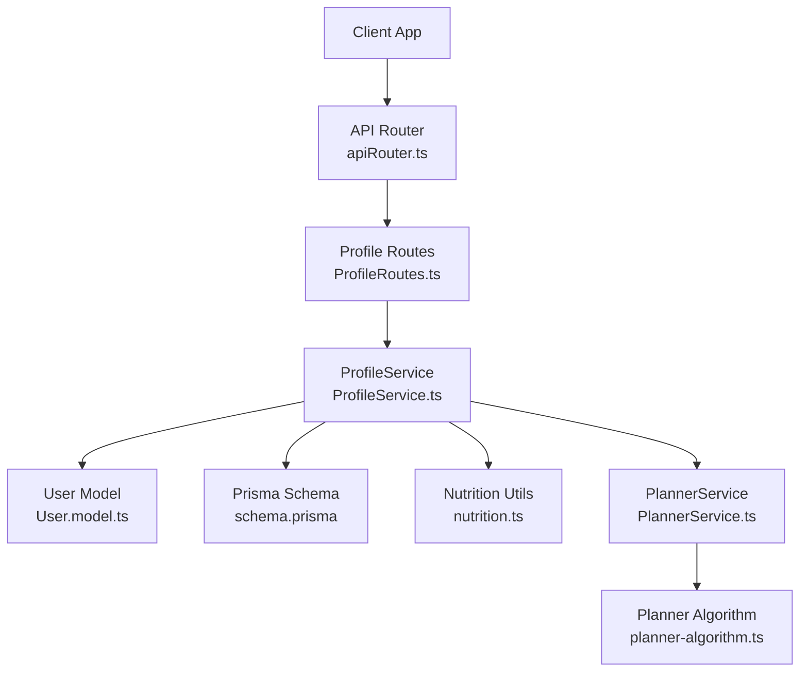
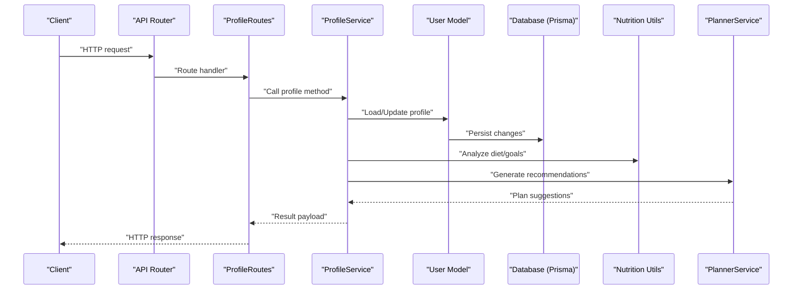
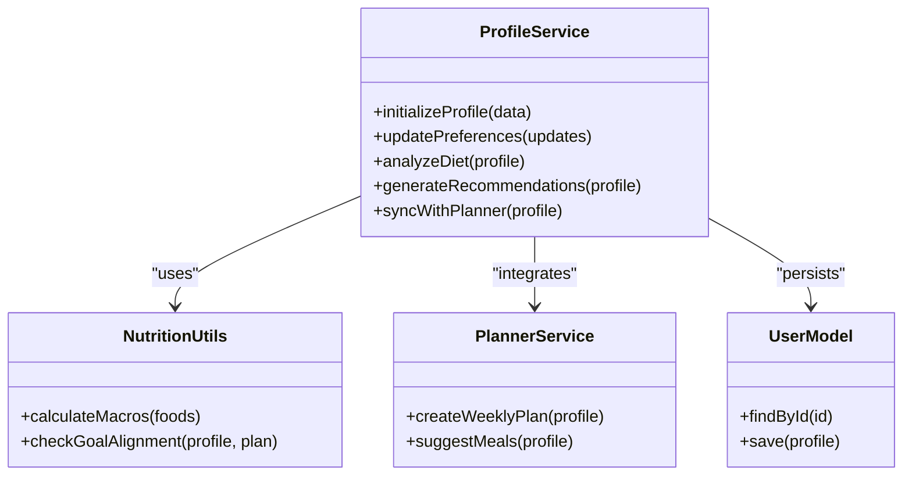
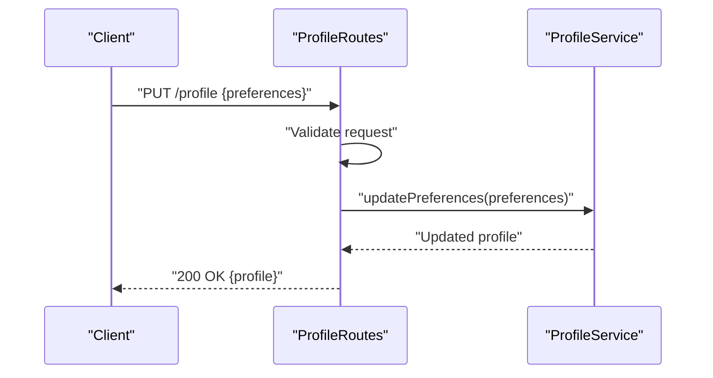
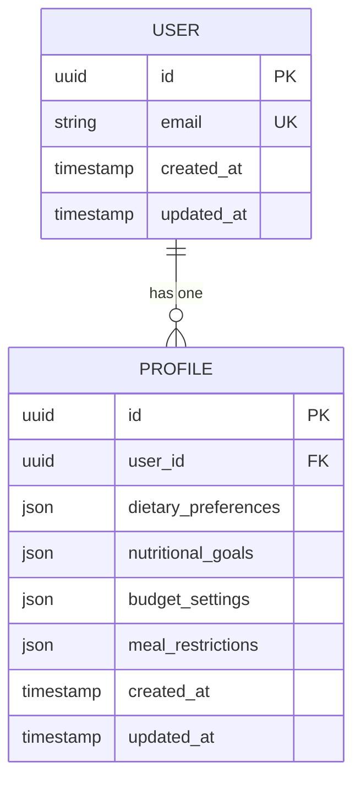
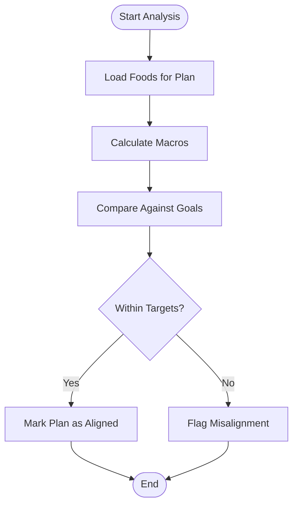
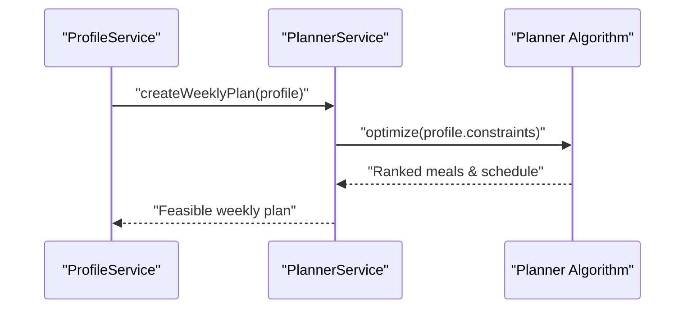
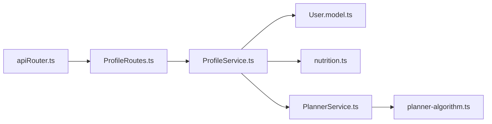

# Profile Management Service

<cite>
**Referenced Files in This Document**
- [ProfileService.ts](file://Backend/src/services/ProfileService.ts)
- [ProfileRoutes.ts](file://Backend/src/routes/ProfileRoutes.ts)
- [User.model.ts](file://Backend/src/models/User.model.ts)
- [schema.prisma](file://Backend/prisma/schema.prisma)
- [nutrition.ts](file://Backend/src/common/utils/nutrition.ts)
- [PlannerService.ts](file://Backend/src/services/PlannerService.ts)
- [planner-algorithm.ts](file://Backend/src/services/planner-algorithm.ts)
- [apiRouter.ts](file://Backend/src/routes/apiRouter.ts)
</cite>

## Table of Contents
1. [Introduction](#introduction)
2. [Project Structure](#project-structure)
3. [Core Components](#core-components)
4. [Architecture Overview](#architecture-overview)
5. [Detailed Component Analysis](#detailed-component-analysis)
6. [Dependency Analysis](#dependency-analysis)
7. [Performance Considerations](#performance-considerations)
8. [Troubleshooting Guide](#troubleshooting-guide)
9. [Conclusion](#conclusion)
10. [Appendices](#appendices)

## Introduction
This document provides comprehensive documentation for the ProfileService that manages user profiles and preferences. It covers dietary preferences storage, nutritional goals tracking, budget settings, meal restrictions, and personalized recommendations. It also explains profile data structure and validation rules, and demonstrates how to initialize a profile, update preferences, perform dietary analysis, and integrate with the meal planning system.

## Project Structure
The ProfileService is implemented within the backend service layer and exposed via dedicated routes. The relevant files include:
- Service implementation: Backend/src/services/ProfileService.ts
- HTTP routes: Backend/src/routes/ProfileRoutes.ts
- Data model and persistence schema: Backend/src/models/User.model.ts and Backend/prisma/schema.prisma
- Nutrition utilities: Backend/src/common/utils/nutrition.ts
- Meal planning integration: Backend/src/services/PlannerService.ts and Backend/src/services/planner-algorithm.ts
- API router wiring: Backend/src/routes/apiRouter.ts

**Diagram sources**
- [apiRouter.ts](file://Backend/src/routes/apiRouter.ts)
- [ProfileRoutes.ts](file://Backend/src/routes/ProfileRoutes.ts)
- [ProfileService.ts](file://Backend/src/services/ProfileService.ts)
- [User.model.ts](file://Backend/src/models/User.model.ts)
- [schema.prisma](file://Backend/prisma/schema.prisma)
- [nutrition.ts](file://Backend/src/common/utils/nutrition.ts)
- [PlannerService.ts](file://Backend/src/services/PlannerService.ts)
- [planner-algorithm.ts](file://Backend/src/services/planner-algorithm.ts)

**Section sources**
- [ProfileService.ts](file://Backend/src/services/ProfileService.ts)
- [ProfileRoutes.ts](file://Backend/src/routes/ProfileRoutes.ts)
- [User.model.ts](file://Backend/src/models/User.model.ts)
- [schema.prisma](file://Backend/prisma/schema.prisma)
- [nutrition.ts](file://Backend/src/common/utils/nutrition.ts)
- [PlannerService.ts](file://Backend/src/services/PlannerService.ts)
- [planner-algorithm.ts](file://Backend/src/services/planner-algorithm.ts)
- [apiRouter.ts](file://Backend/src/routes/apiRouter.ts)

## Core Components
- ProfileService: Encapsulates all profile-related business logic including initialization, updates, dietary analysis, and recommendation generation.
- ProfileRoutes: Exposes REST endpoints for client interactions with profile data.
- User Model and Prisma Schema: Define persistent structures for users and their profile attributes.
- Nutrition Utilities: Provide helpers for nutritional calculations and goal alignment.
- PlannerService and Planner Algorithm: Integrate profile preferences into meal planning and recommendation engines.

Key responsibilities:
- Initialize default or custom profile data for new users.
- Validate and persist dietary preferences, nutritional goals, budget settings, and meal restrictions.
- Compute dietary analysis (e.g., macro alignment, restriction compliance).
- Generate personalized recommendations based on profile constraints and goals.
- Coordinate with the meal planning system to produce feasible weekly plans.

**Section sources**
- [ProfileService.ts](file://Backend/src/services/ProfileService.ts)
- [ProfileRoutes.ts](file://Backend/src/routes/ProfileRoutes.ts)
- [User.model.ts](file://Backend/src/models/User.model.ts)
- [schema.prisma](file://Backend/prisma/schema.prisma)
- [nutrition.ts](file://Backend/src/common/utils/nutrition.ts)
- [PlannerService.ts](file://Backend/src/services/PlannerService.ts)
- [planner-algorithm.ts](file://Backend/src/services/planner-algorithm.ts)

## Architecture Overview
The ProfileService sits between HTTP routes and data/model layers, leveraging nutrition utilities and planner services to deliver insights and recommendations.

**Diagram sources**
- [apiRouter.ts](file://Backend/src/routes/apiRouter.ts)
- [ProfileRoutes.ts](file://Backend/src/routes/ProfileRoutes.ts)
- [ProfileService.ts](file://Backend/src/services/ProfileService.ts)
- [User.model.ts](file://Backend/src/models/User.model.ts)
- [schema.prisma](file://Backend/prisma/schema.prisma)
- [nutrition.ts](file://Backend/src/common/utils/nutrition.ts)
- [PlannerService.ts](file://Backend/src/services/PlannerService.ts)

## Detailed Component Analysis

### ProfileService
Responsibilities:
- Profile initialization with defaults or provided values.
- Preference updates with validation and persistence.
- Dietary analysis using nutrition utilities.
- Recommendation generation aligned with goals and restrictions.
- Integration with PlannerService for actionable meal plans.

Typical operations:
- Initialize profile: create or merge defaults with user-provided fields; validate required fields; persist.
- Update preferences: accept partial updates; apply validation rules; compute derived metrics; persist.
- Dietary analysis: evaluate macros vs goals; check restriction compliance; score adherence.
- Recommendations: filter and rank meals by preferences, goals, and budget; return ranked list.

Validation rules:
- Required fields: ensure essential profile attributes are present.
- Range checks: enforce numeric bounds for goals and budgets.
- Enumerations: restrict allowed values for dietary patterns and restrictions.
- Consistency: ensure goals align with restrictions (e.g., no conflicting macros).

Integration points:
- Nutrition utilities for calculations.
- PlannerService for generating weekly plans based on profile constraints.

**Diagram sources**
- [ProfileService.ts](file://Backend/src/services/ProfileService.ts)
- [nutrition.ts](file://Backend/src/common/utils/nutrition.ts)
- [PlannerService.ts](file://Backend/src/services/PlannerService.ts)
- [User.model.ts](file://Backend/src/models/User.model.ts)

**Section sources**
- [ProfileService.ts](file://Backend/src/services/ProfileService.ts)
- [nutrition.ts](file://Backend/src/common/utils/nutrition.ts)
- [PlannerService.ts](file://Backend/src/services/PlannerService.ts)
- [User.model.ts](file://Backend/src/models/User.model.ts)

### ProfileRoutes
Responsibilities:
- Define HTTP endpoints for profile CRUD and analysis.
- Parse requests and delegate to ProfileService.
- Return standardized responses and handle errors.

Common endpoints:
- GET /profile: retrieve current profile.
- PUT /profile: update preferences.
- POST /profile/analyze: run dietary analysis.
- GET /profile/recommendations: fetch personalized recommendations.

Request/response flow:
- Client sends JSON payload with profile data or filters.
- Route validates input shape and delegates to service.
- Service returns structured result; route formats HTTP response.

**Diagram sources**
- [ProfileRoutes.ts](file://Backend/src/routes/ProfileRoutes.ts)
- [ProfileService.ts](file://Backend/src/services/ProfileService.ts)

**Section sources**
- [ProfileRoutes.ts](file://Backend/src/routes/ProfileRoutes.ts)
- [ProfileService.ts](file://Backend/src/services/ProfileService.ts)

### Data Model and Persistence
The User model and Prisma schema define the structure for storing profiles and related attributes. Key aspects:
- User entity includes identifiers and timestamps.
- Profile attributes include dietary preferences, nutritional goals, budget settings, and meal restrictions.
- Relationships and constraints ensure data integrity.

Data structure highlights:
- Dietary preferences: arrays or enums for allowed/disallowed foods and diets.
- Nutritional goals: target macros and calories per day.
- Budget settings: daily or weekly spending limits.
- Meal restrictions: allergies, cultural/religious constraints, and health conditions.

Persistence behavior:
- Create/Update operations map directly to schema fields.
- Validation enforced at both application and database levels.

**Diagram sources**
- [User.model.ts](file://Backend/src/models/User.model.ts)
- [schema.prisma](file://Backend/prisma/schema.prisma)

**Section sources**
- [User.model.ts](file://Backend/src/models/User.model.ts)
- [schema.prisma](file://Backend/prisma/schema.prisma)

### Nutrition Utilities
Purpose:
- Calculate macronutrient totals from food items.
- Check alignment between planned meals and user goals.
- Provide helper functions for dietary scoring and constraint checking.

Usage:
- ProfileService calls these utilities during analysis and recommendation phases.
- Ensures consistent calculations across features.

**Diagram sources**
- [nutrition.ts](file://Backend/src/common/utils/nutrition.ts)
- [ProfileService.ts](file://Backend/src/services/ProfileService.ts)

**Section sources**
- [nutrition.ts](file://Backend/src/common/utils/nutrition.ts)
- [ProfileService.ts](file://Backend/src/services/ProfileService.ts)

### Meal Planning Integration
Purpose:
- Translate profile constraints into actionable weekly plans.
- Use planner algorithm to optimize meals against goals, restrictions, and budget.

Workflow:
- ProfileService requests plan creation from PlannerService.
- PlannerService invokes planner algorithm with profile context.
- Resulting plan respects dietary preferences and restrictions while targeting goals.

**Diagram sources**
- [ProfileService.ts](file://Backend/src/services/ProfileService.ts)
- [PlannerService.ts](file://Backend/src/services/PlannerService.ts)
- [planner-algorithm.ts](file://Backend/src/services/planner-algorithm.ts)

**Section sources**
- [ProfileService.ts](file://Backend/src/services/ProfileService.ts)
- [PlannerService.ts](file://Backend/src/services/PlannerService.ts)
- [planner-algorithm.ts](file://Backend/src/services/planner-algorithm.ts)

## Dependency Analysis
ProfileService depends on:
- User model for persistence.
- Nutrition utilities for calculations.
- PlannerService and planner algorithm for recommendations and planning.
- Routes for HTTP exposure.

**Diagram sources**
- [ProfileService.ts](file://Backend/src/services/ProfileService.ts)
- [User.model.ts](file://Backend/src/models/User.model.ts)
- [nutrition.ts](file://Backend/src/common/utils/nutrition.ts)
- [PlannerService.ts](file://Backend/src/services/PlannerService.ts)
- [planner-algorithm.ts](file://Backend/src/services/planner-algorithm.ts)
- [ProfileRoutes.ts](file://Backend/src/routes/ProfileRoutes.ts)
- [apiRouter.ts](file://Backend/src/routes/apiRouter.ts)

**Section sources**
- [ProfileService.ts](file://Backend/src/services/ProfileService.ts)
- [ProfileRoutes.ts](file://Backend/src/routes/ProfileRoutes.ts)
- [User.model.ts](file://Backend/src/models/User.model.ts)
- [nutrition.ts](file://Backend/src/common/utils/nutrition.ts)
- [PlannerService.ts](file://Backend/src/services/PlannerService.ts)
- [planner-algorithm.ts](file://Backend/src/services/planner-algorithm.ts)
- [apiRouter.ts](file://Backend/src/routes/apiRouter.ts)

## Performance Considerations
- Batch updates: prefer merging multiple preference changes in a single transaction to reduce I/O.
- Caching: cache frequent reads of profile data when appropriate to minimize database load.
- Lazy analysis: compute dietary analysis on-demand rather than eagerly on every update.
- Efficient filtering: leverage database-level constraints and indexes for quick retrieval of restricted or preferred items.
- Planner optimization: use incremental updates to planner inputs to avoid recomputing entire plans unnecessarily.

[No sources needed since this section provides general guidance]

## Troubleshooting Guide
Common issues and resolutions:
- Validation failures: ensure all required fields are present and within allowed ranges; check enum values for dietary patterns and restrictions.
- Goal misalignment: verify that targets do not conflict with restrictions; adjust goals or relax constraints where possible.
- Budget exceedances: review cost estimates in recommended plans; refine budget settings or swap higher-cost items.
- Planner conflicts: if no feasible plan exists, relax restrictions or broaden preferences; re-run planning with adjusted inputs.

Operational tips:
- Log detailed error messages from validation and planner steps.
- Inspect persisted profile state to confirm updates were applied.
- Use analysis outputs to identify specific misalignments and guide user corrections.

[No sources needed since this section provides general guidance]

## Conclusion
The ProfileService centralizes profile management, enabling robust handling of dietary preferences, nutritional goals, budget settings, and meal restrictions. Through tight integration with nutrition utilities and the meal planning system, it delivers personalized recommendations and feasible weekly plans. Proper validation and clear data structures ensure reliability and scalability.

[No sources needed since this section summarizes without analyzing specific files]

## Appendices

### Profile Initialization Example
- Steps:
  - Prepare initial profile data with defaults or user-provided values.
  - Call the initialization endpoint to create or merge profile.
  - Verify returned profile contains expected fields and constraints.

**Section sources**
- [ProfileRoutes.ts](file://Backend/src/routes/ProfileRoutes.ts)
- [ProfileService.ts](file://Backend/src/services/ProfileService.ts)

### Preference Updates Example
- Steps:
  - Submit partial updates for preferences, goals, or restrictions.
  - Service validates and persists changes.
  - Review updated profile and any recalculated analysis results.

**Section sources**
- [ProfileRoutes.ts](file://Backend/src/routes/ProfileRoutes.ts)
- [ProfileService.ts](file://Backend/src/services/ProfileService.ts)

### Dietary Analysis Example
- Steps:
  - Request analysis with current profile and recent meal data.
  - Service computes macro totals and adherence scores.
  - Receive actionable insights and flags for misalignment.

**Section sources**
- [ProfileService.ts](file://Backend/src/services/ProfileService.ts)
- [nutrition.ts](file://Backend/src/common/utils/nutrition.ts)

### Integration with Meal Planning Example
- Steps:
  - Trigger plan generation with profile constraints.
  - PlannerService uses algorithm to produce a feasible weekly plan.
  - Review recommendations and iterate on preferences if needed.

**Section sources**
- [ProfileService.ts](file://Backend/src/services/ProfileService.ts)
- [PlannerService.ts](file://Backend/src/services/PlannerService.ts)
- [planner-algorithm.ts](file://Backend/src/services/planner-algorithm.ts)