# Service Layer Architecture

<cite>
**Referenced Files in This Document**
- [AuthService.ts](file://Backend/src/services/AuthService.ts)
- [PlannerService.ts](file://Backend/src/services/PlannerService.ts)
- [StoreService.ts](file://Backend/src/services/StoreService.ts)
- [UserService.ts](file://Backend/src/services/UserService.ts)
- [ProfileService.ts](file://Backend/src/services/ProfileService.ts)
- [StatsService.ts](file://Backend/src/services/StatsService.ts)
- [LogService.ts](file://Backend/src/services/LogService.ts)
- [AuthRoutes.ts](file://Backend/src/routes/AuthRoutes.ts)
- [PlannerRoutes.ts](file://Backend/src/routes/PlannerRoutes.ts)
- [StoreRoutes.ts](file://Backend/src/routes/StoreRoutes.ts)
- [UserRoutes.ts](file://Backend/src/routes/UserRoutes.ts)
- [ProfileRoutes.ts](file://Backend/src/routes/ProfileRoutes.ts)
- [LogRoutes.ts](file://Backend/src/routes/LogRoutes.ts)
- [apiRouter.ts](file://Backend/src/routes/apiRouter.ts)
- [main.ts](file://Backend/src/main.ts)
- [server.ts](file://Backend/src/server.ts)
- [planner-algorithm.ts](file://Backend/src/services/planner-algorithm.ts)
</cite>

## Table of Contents
1. [Introduction](#introduction)
2. [Project Structure](#project-structure)
3. [Core Components](#core-components)
4. [Architecture Overview](#architecture-overview)
5. [Detailed Component Analysis](#detailed-component-analysis)
6. [Dependency Analysis](#dependency-analysis)
7. [Performance Considerations](#performance-considerations)
8. [Troubleshooting Guide](#troubleshooting-guide)
9. [Conclusion](#conclusion)
10. [Appendices](#appendices)

## Introduction
This document explains the service layer architecture implemented in the backend, focusing on how business logic is separated from HTTP routes and how services are composed and injected into the routing layer. It covers each service class (AuthService, PlannerService, StoreService, UserService, ProfileService, StatsService, LogService), their responsibilities, error handling strategies, and patterns for creating new services and integrating them with routes.

## Project Structure
The backend organizes functionality by layers:
- Routes: HTTP endpoints that parse requests and delegate to services.
- Services: Business logic implementations encapsulated per domain.
- Repositories and utilities: Data access and shared helpers used by services.
- Entry points: Application bootstrap and server initialization.

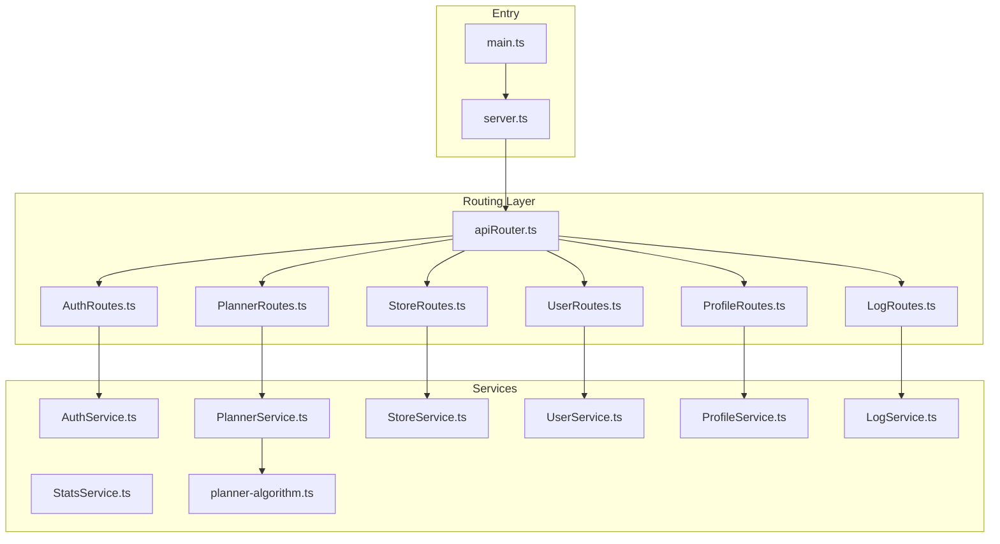

**Diagram sources**
- [main.ts](file://Backend/src/main.ts)
- [server.ts](file://Backend/src/server.ts)
- [apiRouter.ts](file://Backend/src/routes/apiRouter.ts)
- [AuthRoutes.ts](file://Backend/src/routes/AuthRoutes.ts)
- [PlannerRoutes.ts](file://Backend/src/routes/PlannerRoutes.ts)
- [StoreRoutes.ts](file://Backend/src/routes/StoreRoutes.ts)
- [UserRoutes.ts](file://Backend/src/routes/UserRoutes.ts)
- [ProfileRoutes.ts](file://Backend/src/routes/ProfileRoutes.ts)
- [LogRoutes.ts](file://Backend/src/routes/LogRoutes.ts)
- [AuthService.ts](file://Backend/src/services/AuthService.ts)
- [PlannerService.ts](file://Backend/src/services/PlannerService.ts)
- [StoreService.ts](file://Backend/src/services/StoreService.ts)
- [UserService.ts](file://Backend/src/services/UserService.ts)
- [ProfileService.ts](file://Backend/src/services/ProfileService.ts)
- [StatsService.ts](file://Backend/src/services/StatsService.ts)
- [LogService.ts](file://Backend/src/services/LogService.ts)
- [planner-algorithm.ts](file://Backend/src/services/planner-algorithm.ts)

**Section sources**
- [main.ts](file://Backend/src/main.ts)
- [server.ts](file://Backend/src/server.ts)
- [apiRouter.ts](file://Backend/src/routes/apiRouter.ts)

## Core Components
The service layer centralizes business logic behind clean interfaces, enabling routes to remain thin and focused on request/response concerns. Each service encapsulates domain operations, coordinates data access, and returns structured results or throws typed errors.

Key responsibilities:
- AuthService: Authentication flows, token handling, and session management.
- PlannerService: Planning algorithms and scheduling logic.
- StoreService: Store-related business rules and data operations.
- UserService: User account management and profile updates.
- ProfileService: Profile-specific operations and validations.
- StatsService: Aggregation and statistics computation.
- LogService: Logging and audit trails.

**Section sources**
- [AuthService.ts](file://Backend/src/services/AuthService.ts)
- [PlannerService.ts](file://Backend/src/services/PlannerService.ts)
- [StoreService.ts](file://Backend/src/services/StoreService.ts)
- [UserService.ts](file://Backend/src/services/UserService.ts)
- [ProfileService.ts](file://Backend/src/services/ProfileService.ts)
- [StatsService.ts](file://Backend/src/services/StatsService.ts)
- [LogService.ts](file://Backend/src/services/LogService.ts)

## Architecture Overview
The application follows a layered architecture:
- Routes receive HTTP requests, validate inputs, and call services.
- Services implement business logic, orchestrate repositories/utilities, and return domain results.
- Dependency injection wires services into routes at startup.

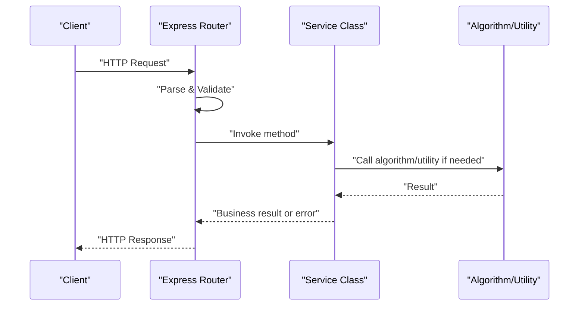

[No sources needed since this diagram shows conceptual workflow, not actual code structure]

## Detailed Component Analysis

### AuthService
Responsibilities:
- Authenticate users and manage tokens/sessions.
- Coordinate with user data and security utilities.
- Provide methods for login, logout, refresh, and permission checks.

Integration pattern:
- Routes import and instantiate AuthService via dependency injection.
- Errors thrown by AuthService are mapped to appropriate HTTP status codes.

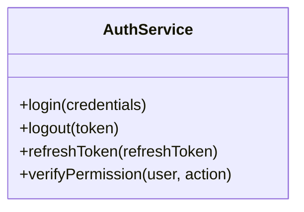

**Diagram sources**
- [AuthService.ts](file://Backend/src/services/AuthService.ts)

**Section sources**
- [AuthService.ts](file://Backend/src/services/AuthService.ts)
- [AuthRoutes.ts](file://Backend/src/routes/AuthRoutes.ts)

### PlannerService
Responsibilities:
- Implement planning algorithms and schedule generation.
- Compose planner-algorithm module for core computations.
- Return validated plans and handle edge cases.

Integration pattern:
- PlannerRoutes call PlannerService methods; PlannerService delegates to planner-algorithm when necessary.

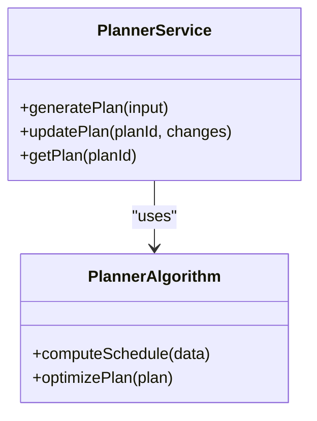

**Diagram sources**
- [PlannerService.ts](file://Backend/src/services/PlannerService.ts)
- [planner-algorithm.ts](file://Backend/src/services/planner-algorithm.ts)

**Section sources**
- [PlannerService.ts](file://Backend/src/services/PlannerService.ts)
- [planner-algorithm.ts](file://Backend/src/services/planner-algorithm.ts)
- [PlannerRoutes.ts](file://Backend/src/routes/PlannerRoutes.ts)

### StoreService
Responsibilities:
- Manage store-related business rules and data operations.
- Validate store entities and coordinate with repositories.
- Expose methods for CRUD and specialized queries.

Integration pattern:
- StoreRoutes invoke StoreService methods; errors are handled consistently across routes.

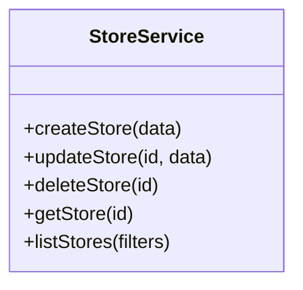

**Diagram sources**
- [StoreService.ts](file://Backend/src/services/StoreService.ts)

**Section sources**
- [StoreService.ts](file://Backend/src/services/StoreService.ts)
- [StoreRoutes.ts](file://Backend/src/routes/StoreRoutes.ts)

### UserService
Responsibilities:
- Handle user account lifecycle: creation, updates, deletion.
- Enforce validation and business constraints.
- Coordinate with authentication and profile services where applicable.

Integration pattern:
- UserRoutes call UserService; dependencies are injected at route initialization.

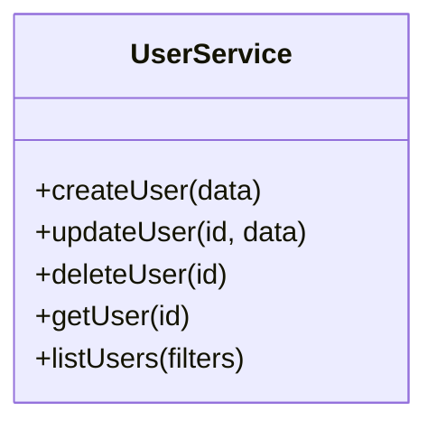

**Diagram sources**
- [UserService.ts](file://Backend/src/services/UserService.ts)

**Section sources**
- [UserService.ts](file://Backend/src/services/UserService.ts)
- [UserRoutes.ts](file://Backend/src/routes/UserRoutes.ts)

### ProfileService
Responsibilities:
- Manage profile-specific operations and validations.
- Ensure consistency between user and profile data.
- Provide methods for reading and updating profiles.

Integration pattern:
- ProfileRoutes use ProfileService; errors are normalized before response.

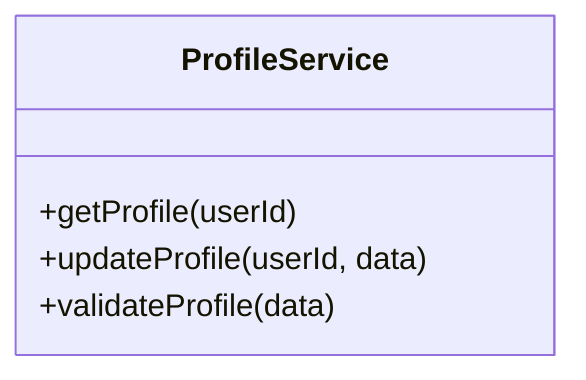

**Diagram sources**
- [ProfileService.ts](file://Backend/src/services/ProfileService.ts)

**Section sources**
- [ProfileService.ts](file://Backend/src/services/ProfileService.ts)
- [ProfileRoutes.ts](file://Backend/src/routes/ProfileRoutes.ts)

### StatsService
Responsibilities:
- Aggregate and compute statistics across domains.
- Provide read-only analytics endpoints through routes.
- Optimize queries for performance-critical metrics.

Integration pattern:
- Routes call StatsService methods; caching may be applied within the service.

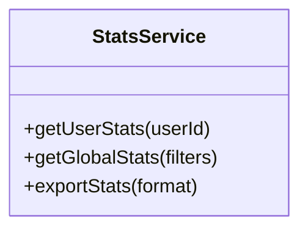

**Diagram sources**
- [StatsService.ts](file://Backend/src/services/StatsService.ts)

**Section sources**
- [StatsService.ts](file://Backend/src/services/StatsService.ts)

### LogService
Responsibilities:
- Centralized logging and audit trail management.
- Format and persist logs with contextual metadata.
- Support different log levels and filtering.

Integration pattern:
- Routes and services call LogService for consistent logging behavior.

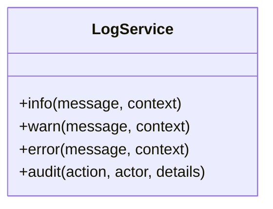

**Diagram sources**
- [LogService.ts](file://Backend/src/services/LogService.ts)

**Section sources**
- [LogService.ts](file://Backend/src/services/LogService.ts)
- [LogRoutes.ts](file://Backend/src/routes/LogRoutes.ts)

## Dependency Analysis
Services are wired into routes using dependency injection. The router aggregates services and passes them to route handlers, ensuring loose coupling and testability.

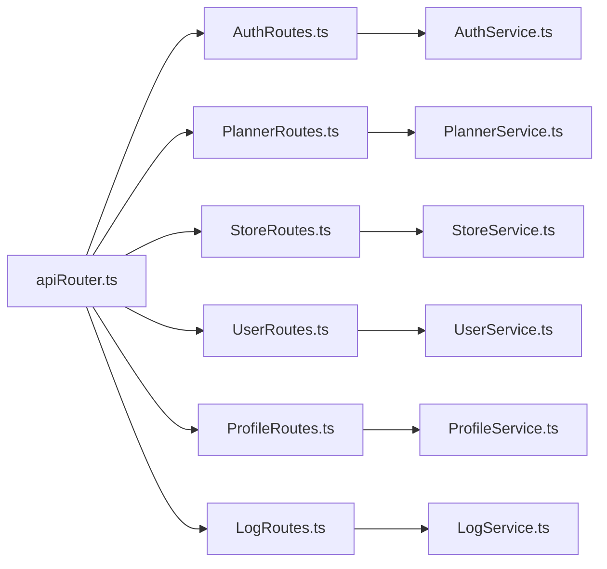

**Diagram sources**
- [apiRouter.ts](file://Backend/src/routes/apiRouter.ts)
- [AuthRoutes.ts](file://Backend/src/routes/AuthRoutes.ts)
- [PlannerRoutes.ts](file://Backend/src/routes/PlannerRoutes.ts)
- [StoreRoutes.ts](file://Backend/src/routes/StoreRoutes.ts)
- [UserRoutes.ts](file://Backend/src/routes/UserRoutes.ts)
- [ProfileRoutes.ts](file://Backend/src/routes/ProfileRoutes.ts)
- [LogRoutes.ts](file://Backend/src/routes/LogRoutes.ts)
- [AuthService.ts](file://Backend/src/services/AuthService.ts)
- [PlannerService.ts](file://Backend/src/services/PlannerService.ts)
- [StoreService.ts](file://Backend/src/services/StoreService.ts)
- [UserService.ts](file://Backend/src/services/UserService.ts)
- [ProfileService.ts](file://Backend/src/services/ProfileService.ts)
- [LogService.ts](file://Backend/src/services/LogService.ts)

**Section sources**
- [apiRouter.ts](file://Backend/src/routes/apiRouter.ts)

## Performance Considerations
- Prefer async operations and avoid blocking calls within services.
- Cache expensive computations in StatsService where appropriate.
- Use efficient queries and batch operations in data-heavy services.
- Keep route handlers minimal to reduce overhead.

[No sources needed since this section provides general guidance]

## Troubleshooting Guide
Common issues and resolutions:
- Validation failures: Ensure input validation occurs early in routes and services.
- Missing dependencies: Verify DI wiring in apiRouter and route modules.
- Error mapping: Confirm consistent error-to-status-code mapping in routes.
- Logging gaps: Add contextual logs in services for better debugging.

**Section sources**
- [AuthService.ts](file://Backend/src/services/AuthService.ts)
- [PlannerService.ts](file://Backend/src/services/PlannerService.ts)
- [StoreService.ts](file://Backend/src/services/StoreService.ts)
- [UserService.ts](file://Backend/src/services/UserService.ts)
- [ProfileService.ts](file://Backend/src/services/ProfileService.ts)
- [StatsService.ts](file://Backend/src/services/StatsService.ts)
- [LogService.ts](file://Backend/src/services/LogService.ts)

## Conclusion
The service layer architecture cleanly separates business logic from HTTP concerns, enabling maintainable and testable code. Each service encapsulates domain operations, while routes focus on request parsing and response formatting. Dependency injection ensures flexibility and simplifies testing. Following the patterns outlined here will help create new services and integrate them seamlessly.

[No sources needed since this section summarizes without analyzing specific files]

## Appendices

### Creating a New Service
Steps:
1. Define a service class with clear methods for domain operations.
2. Implement validation and error handling within the service.
3. Inject the service into relevant routes via dependency injection.
4. Wire the service in the router aggregation module.

Example integration flow:
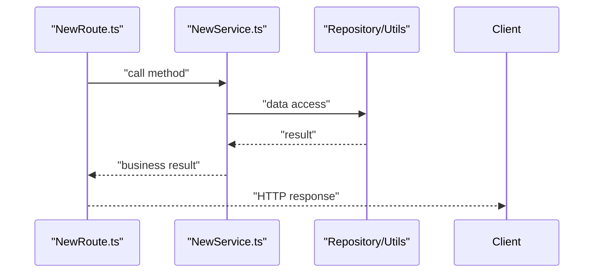

[No sources needed since this diagram shows conceptual workflow, not actual code structure]

**Section sources**
- [apiRouter.ts](file://Backend/src/routes/apiRouter.ts)
- [AuthRoutes.ts](file://Backend/src/routes/AuthRoutes.ts)
- [PlannerRoutes.ts](file://Backend/src/routes/PlannerRoutes.ts)
- [StoreRoutes.ts](file://Backend/src/routes/StoreRoutes.ts)
- [UserRoutes.ts](file://Backend/src/routes/UserRoutes.ts)
- [ProfileRoutes.ts](file://Backend/src/routes/ProfileRoutes.ts)
- [LogRoutes.ts](file://Backend/src/routes/LogRoutes.ts)