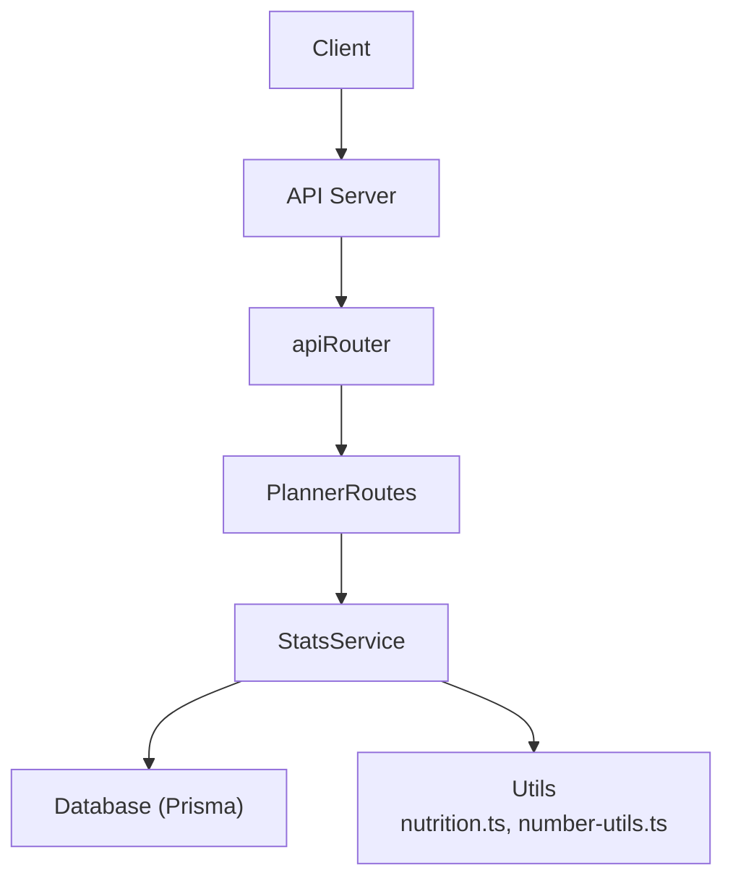
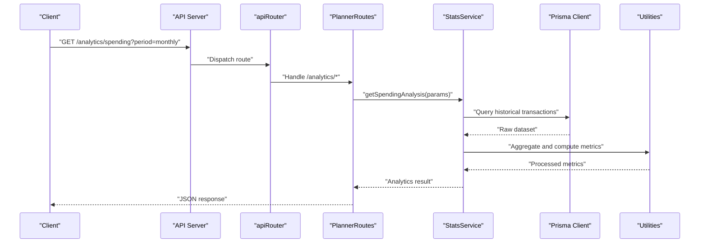
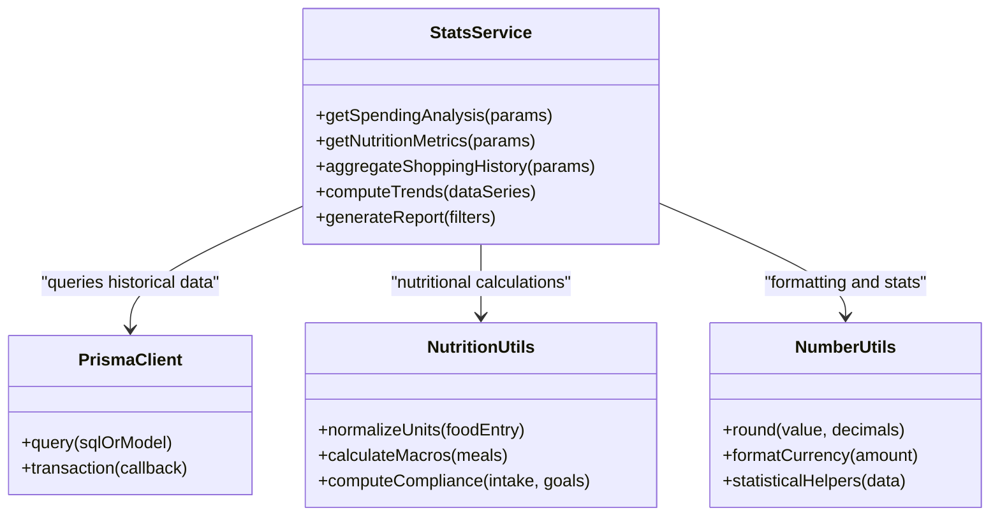
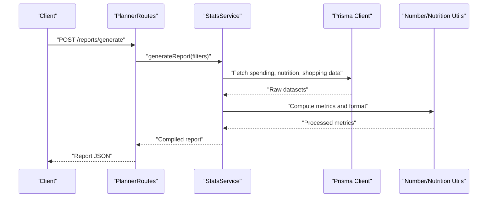
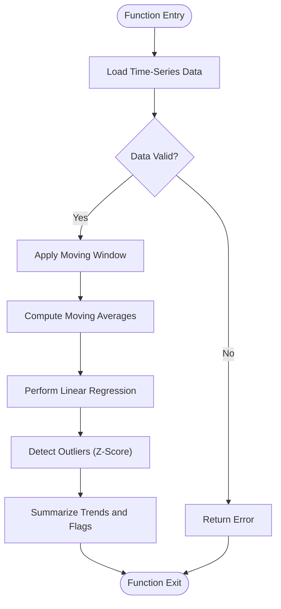
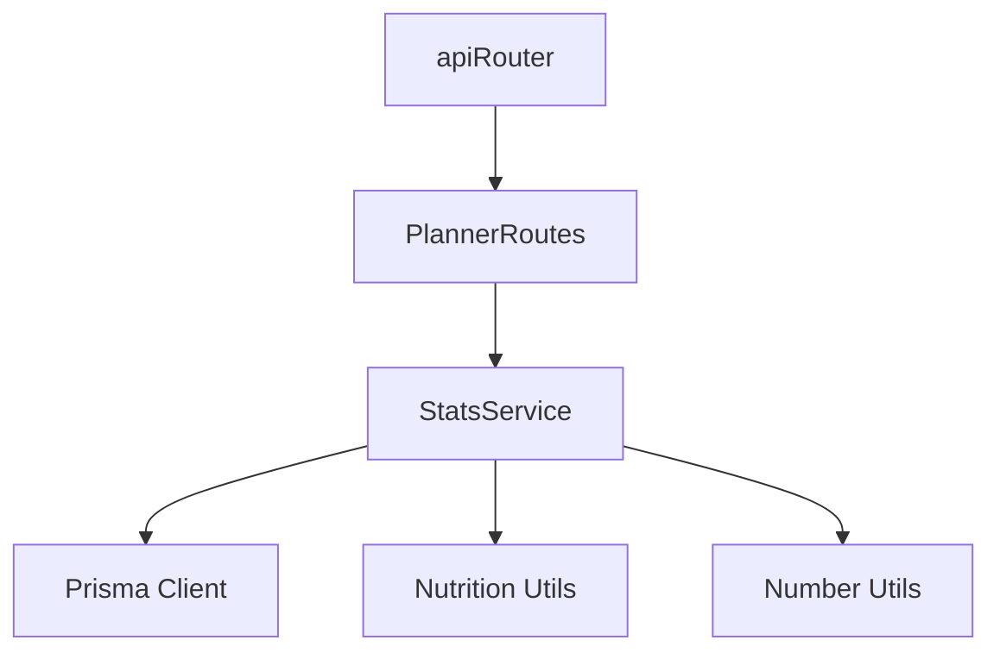

# Statistics and Analytics Service

<cite>
**Referenced Files in This Document**
- [StatsService.ts](file://Backend/src/services/StatsService.ts)
- [PlannerRoutes.ts](file://Backend/src/routes/PlannerRoutes.ts)
- [apiRouter.ts](file://Backend/src/routes/apiRouter.ts)
- [User.model.ts](file://Backend/src/models/User.model.ts)
- [prisma.ts](file://Backend/src/repos/prisma.ts)
- [schema.prisma](file://Backend/prisma/schema.prisma)
- [nutrition.ts](file://Backend/src/common/utils/nutrition.ts)
- [number-utils.ts](file://Backend/src/common/utils/number-utils.ts)
</cite>

## Table of Contents
1. [Introduction](#introduction)
2. [Project Structure](#project-structure)
3. [Core Components](#core-components)
4. [Architecture Overview](#architecture-overview)
5. [Detailed Component Analysis](#detailed-component-analysis)
6. [Dependency Analysis](#dependency-analysis)
7. [Performance Considerations](#performance-considerations)
8. [Troubleshooting Guide](#troubleshooting-guide)
9. [Conclusion](#conclusion)
10. [Appendices](#appendices)

## Introduction
This document provides comprehensive documentation for the StatsService, which delivers analytics and reporting capabilities across spending analysis, nutritional tracking metrics, shopping history aggregation, trend analysis, and report generation. It explains metric definitions, calculation methodologies, data aggregation patterns, performance optimization strategies for large datasets, and integration with historical data sources. The goal is to make the service understandable for both technical and non-technical readers while providing actionable guidance for implementation and maintenance.

## Project Structure
The StatsService resides within the backend services layer and integrates with routing, models, database access, and utility modules:
- Services: StatsService encapsulates analytics logic.
- Routes: PlannerRoutes exposes endpoints that consume StatsService.
- API Router: apiRouter wires routes into the application.
- Models: User.model defines user-related structures used by analytics.
- Database Access: prisma.ts provides Prisma client usage; schema.prisma defines data model.
- Utilities: nutrition.ts and number-utils.ts support calculations and formatting.

**Diagram sources**
- [apiRouter.ts](file://Backend/src/routes/apiRouter.ts)
- [PlannerRoutes.ts](file://Backend/src/routes/PlannerRoutes.ts)
- [StatsService.ts](file://Backend/src/services/StatsService.ts)
- [prisma.ts](file://Backend/src/repos/prisma.ts)
- [nutrition.ts](file://Backend/src/common/utils/nutrition.ts)
- [number-utils.ts](file://Backend/src/common/utils/number-utils.ts)

**Section sources**
- [StatsService.ts](file://Backend/src/services/StatsService.ts)
- [PlannerRoutes.ts](file://Backend/src/routes/PlannerRoutes.ts)
- [apiRouter.ts](file://Backend/src/routes/apiRouter.ts)
- [User.model.ts](file://Backend/src/models/User.model.ts)
- [prisma.ts](file://Backend/src/repos/prisma.ts)
- [schema.prisma](file://Backend/prisma/schema.prisma)
- [nutrition.ts](file://Backend/src/common/utils/nutrition.ts)
- [number-utils.ts](file://Backend/src/common/utils/number-utils.ts)

## Core Components
- StatsService: Central analytics engine implementing spending analysis, nutritional metrics, shopping history aggregation, trend analysis, and report generation.
- PlannerRoutes: HTTP endpoints exposing analytics queries and report requests.
- API Router: Aggregates route handlers and mounts them under a common path.
- User Model: Defines user attributes consumed by analytics (e.g., identifiers, preferences).
- Prisma Integration: Provides typed database access for historical data retrieval.
- Nutrition Utility: Encapsulates nutritional calculations and conversions.
- Number Utility: Supports rounding, formatting, and statistical helpers.

Key responsibilities:
- Data aggregation across time windows (daily, weekly, monthly).
- Metric computation (spending totals, averages, variances, nutritional summaries).
- Trend detection using moving averages and simple regression techniques.
- Report assembly combining multiple metrics into structured outputs.

**Section sources**
- [StatsService.ts](file://Backend/src/services/StatsService.ts)
- [PlannerRoutes.ts](file://Backend/src/routes/PlannerRoutes.ts)
- [apiRouter.ts](file://Backend/src/routes/apiRouter.ts)
- [User.model.ts](file://Backend/src/models/User.model.ts)
- [prisma.ts](file://Backend/src/repos/prisma.ts)
- [nutrition.ts](file://Backend/src/common/utils/nutrition.ts)
- [number-utils.ts](file://Backend/src/common/utils/number-utils.ts)

## Architecture Overview
The analytics pipeline follows a layered approach:
- HTTP request arrives at PlannerRoutes.
- PlannerRoutes validates input and delegates to StatsService.
- StatsService queries historical data via Prisma.
- StatsService computes metrics using utilities and aggregates results.
- Results are returned as structured reports or metric snapshots.

**Diagram sources**
- [PlannerRoutes.ts](file://Backend/src/routes/PlannerRoutes.ts)
- [apiRouter.ts](file://Backend/src/routes/apiRouter.ts)
- [StatsService.ts](file://Backend/src/services/StatsService.ts)
- [prisma.ts](file://Backend/src/repos/prisma.ts)
- [nutrition.ts](file://Backend/src/common/utils/nutrition.ts)
- [number-utils.ts](file://Backend/src/common/utils/number-utils.ts)

## Detailed Component Analysis

### Spending Analysis
Purpose:
- Compute total spending per period, average spend, variance, and category breakdowns.
- Support filtering by date ranges, stores, categories, and users.

Methodology:
- Aggregate transaction amounts grouped by time buckets (day/week/month).
- Calculate rolling averages and standard deviations for volatility.
- Summarize top spending categories and store contributions.

Data Sources:
- Historical transactions via Prisma queries.
- Category mappings and store metadata.

Output:
- Time-series of spending totals.
- Category distribution percentages.
- Volatility indicators (variance, coefficient of variation).

**Section sources**
- [StatsService.ts](file://Backend/src/services/StatsService.ts)
- [prisma.ts](file://Backend/src/repos/prisma.ts)
- [number-utils.ts](file://Backend/src/common/utils/number-utils.ts)

### Nutritional Tracking Metrics
Purpose:
- Track daily caloric intake, macronutrient ratios, and micronutrient summaries.
- Compare against dietary goals and provide compliance scores.

Methodology:
- Normalize units and convert food entries to standardized nutrients.
- Compute sums and ratios per day, week, month.
- Generate compliance metrics based on thresholds.

Data Sources:
- Food logs and nutritional database via Prisma.
- Conversion factors from nutrition.ts.

Output:
- Daily totals for calories, protein, carbs, fats.
- Ratio breakdowns and adherence scores.
- Trend lines for long-term tracking.

**Section sources**
- [StatsService.ts](file://Backend/src/services/StatsService.ts)
- [nutrition.ts](file://Backend/src/common/utils/nutrition.ts)
- [prisma.ts](file://Backend/src/repos/prisma.ts)

### Shopping History Aggregation
Purpose:
- Consolidate purchase history across stores and categories.
- Provide item-level and basket-level summaries.

Methodology:
- Group purchases by user, store, and time window.
- Compute frequency metrics (purchase count, unique items).
- Derive basket size distributions and repeat purchase rates.

Data Sources:
- Purchase records via Prisma.
- Store and product catalogs.

Output:
- Aggregated purchase counts and totals.
- Frequency heatmaps by store/category.
- Basket size statistics.

**Section sources**
- [StatsService.ts](file://Backend/src/services/StatsService.ts)
- [prisma.ts](file://Backend/src/repos/prisma.ts)

### Trend Analysis
Purpose:
- Identify upward/downward trends in spending and nutrition metrics.
- Detect anomalies and seasonal patterns.

Methodology:
- Apply moving averages over configurable windows.
- Perform linear regression to estimate slope and significance.
- Flag outliers using z-score thresholds.

Data Sources:
- Time-series datasets from aggregated metrics.

Output:
- Trend direction and strength indicators.
- Anomaly flags and confidence levels.
- Seasonal decomposition summaries.

**Section sources**
- [StatsService.ts](file://Backend/src/services/StatsService.ts)
- [number-utils.ts](file://Backend/src/common/utils/number-utils.ts)

### Report Generation
Purpose:
- Assemble multi-metric reports for consumption by dashboards or exports.
- Support customizable periods and filters.

Methodology:
- Combine outputs from spending, nutrition, and shopping aggregations.
- Format numbers and dates consistently.
- Include summary statistics and visual-ready arrays.

Data Sources:
- Internal computed metrics and external configuration.

Output:
- Structured JSON reports with sections for each metric domain.
- Arrays suitable for charting libraries.

**Section sources**
- [StatsService.ts](file://Backend/src/services/StatsService.ts)
- [number-utils.ts](file://Backend/src/common/utils/number-utils.ts)

#### Class Diagram: StatsService and Dependencies

**Diagram sources**
- [StatsService.ts](file://Backend/src/services/StatsService.ts)
- [prisma.ts](file://Backend/src/repos/prisma.ts)
- [nutrition.ts](file://Backend/src/common/utils/nutrition.ts)
- [number-utils.ts](file://Backend/src/common/utils/number-utils.ts)

#### Sequence Diagram: Report Generation Flow

**Diagram sources**
- [PlannerRoutes.ts](file://Backend/src/routes/PlannerRoutes.ts)
- [StatsService.ts](file://Backend/src/services/StatsService.ts)
- [prisma.ts](file://Backend/src/repos/prisma.ts)
- [nutrition.ts](file://Backend/src/common/utils/nutrition.ts)
- [number-utils.ts](file://Backend/src/common/utils/number-utils.ts)

#### Flowchart: Trend Computation Algorithm

**Diagram sources**
- [StatsService.ts](file://Backend/src/services/StatsService.ts)
- [number-utils.ts](file://Backend/src/common/utils/number-utils.ts)

## Dependency Analysis
- StatsService depends on Prisma for data retrieval and on utilities for calculations.
- PlannerRoutes depends on StatsService to expose analytics endpoints.
- apiRouter aggregates routes and mounts them under a base path.
- User.model may be referenced for user-scoped analytics.

**Diagram sources**
- [StatsService.ts](file://Backend/src/services/StatsService.ts)
- [plannerRoutes.ts](file://Backend/src/routes/PlannerRoutes.ts)
- [apiRouter.ts](file://Backend/src/routes/apiRouter.ts)
- [prisma.ts](file://Backend/src/repos/prisma.ts)
- [nutrition.ts](file://Backend/src/common/utils/nutrition.ts)
- [number-utils.ts](file://Backend/src/common/utils/number-utils.ts)

**Section sources**
- [StatsService.ts](file://Backend/src/services/StatsService.ts)
- [PlannerRoutes.ts](file://Backend/src/routes/PlannerRoutes.ts)
- [apiRouter.ts](file://Backend/src/routes/apiRouter.ts)
- [prisma.ts](file://Backend/src/repos/prisma.ts)
- [nutrition.ts](file://Backend/src/common/utils/nutrition.ts)
- [number-utils.ts](file://Backend/src/common/utils/number-utils.ts)

## Performance Considerations
- Use indexed queries on frequently filtered fields (date, user_id, category).
- Implement pagination and cursor-based fetching for large datasets.
- Cache intermediate aggregations when possible (e.g., daily totals).
- Batch database operations to reduce round-trips.
- Avoid recomputing expensive metrics by storing derived tables or materialized views.
- Optimize moving window computations by incremental updates.

[No sources needed since this section provides general guidance]

## Troubleshooting Guide
Common issues and resolutions:
- Missing data: Ensure historical records exist for requested periods; validate date range inputs.
- Inconsistent units: Confirm normalization steps in nutrition utilities; check conversion factors.
- Slow queries: Add indexes, limit result sets, and use efficient grouping.
- Rounding errors: Use consistent decimal precision and rounding functions from number-utils.
- Null handling: Guard against missing values in aggregations and set defaults where appropriate.

**Section sources**
- [StatsService.ts](file://Backend/src/services/StatsService.ts)
- [nutrition.ts](file://Backend/src/common/utils/nutrition.ts)
- [number-utils.ts](file://Backend/src/common/utils/number-utils.ts)

## Conclusion
The StatsService centralizes analytics and reporting for spending, nutrition, and shopping history. It leverages robust aggregation patterns, statistical methods, and utility functions to deliver accurate and performant insights. By following the outlined methodologies and performance recommendations, teams can extend and maintain the service effectively while ensuring reliable analytics outputs.

[No sources needed since this section summarizes without analyzing specific files]

## Appendices

### Metric Definitions and Calculation Methodologies
- Spending Total: Sum of transaction amounts within a defined period.
- Average Spend: Total spending divided by number of transactions or days.
- Variance: Measure of dispersion around the mean spend.
- Caloric Intake: Sum of energy values from food entries after unit normalization.
- Macronutrient Ratios: Proportions of protein, carbs, and fats relative to total calories.
- Compliance Score: Percentage of goals met based on thresholds.
- Trend Slope: Coefficient from linear regression indicating direction and magnitude.
- Anomaly Flag: Indicator when z-score exceeds threshold.

[No sources needed since this section provides conceptual definitions]